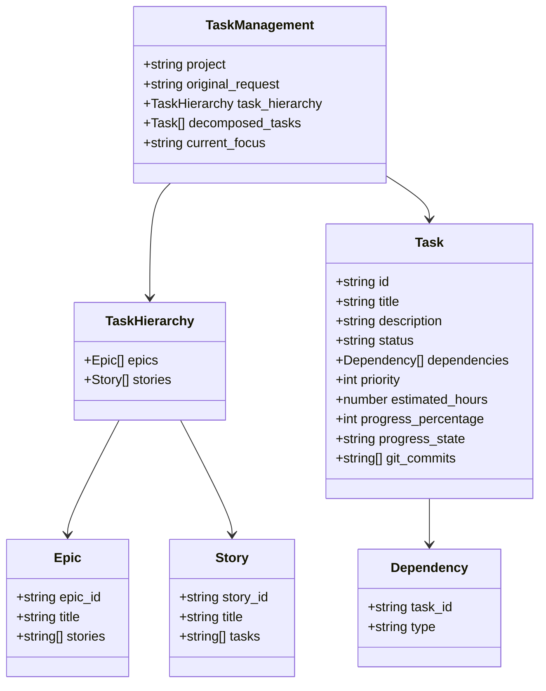
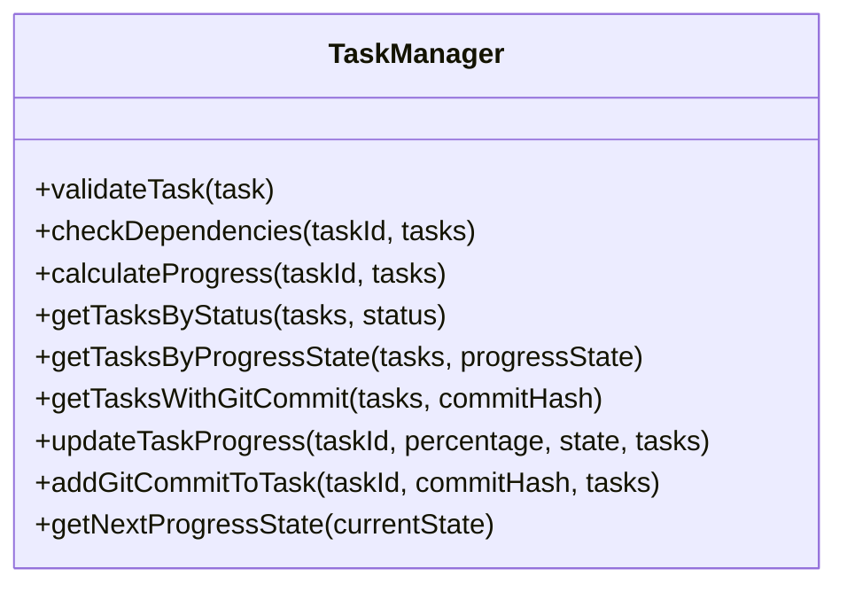
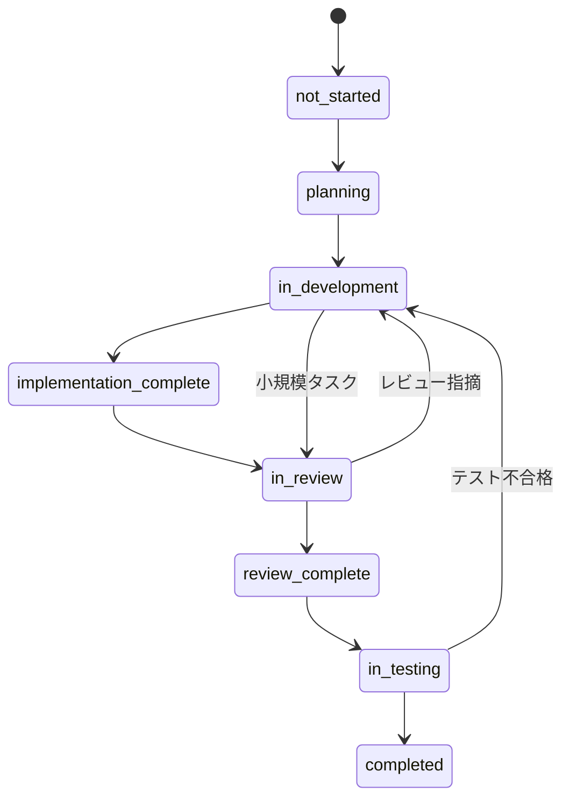

# タスク管理の詳細化（T007）実装戦略

## 現状分析

現在のプロジェクト「knoa」は、AI駆動開発のためのフレームワークを構築中で、フェーズ0の実装段階にあります。タスクT001からT006までが完了し、現在はT007「タスク管理JSONファイル形式の詳細化」にフォーカスしています。

現状のタスク管理スキーマは基本的な情報（ID、タイトル、説明、ステータス、依存関係）のみを含んでおり、より詳細な進捗管理や優先順位付けができない状態です。

## 目標

タスク管理のJSONスキーマを拡張し、以下の機能を追加することで、AI駆動開発の効率と透明性を向上させます：

1. タスクの優先度と見積もり時間の管理
2. 進捗率の追跡と進捗状態の詳細化
3. 依存関係の詳細化（強依存/弱依存）
4. Gitコミットとの連携
5. 将来的な階層構造（エピック、ストーリー、タスク）の基盤準備

## 実装戦略

### 1. スキーマ拡張

`src/schemas/task.schema.json`を以下のように拡張します：



#### 主な拡張ポイント：

1. **タスク属性の拡張**:
   - `priority`: 優先度（1-5）
   - `estimated_hours`: 見積もり時間
   - `progress_percentage`: 進捗率（0-100%）
   - `progress_state`: 進捗状態
     - 例: "not_started", "planning", "in_development", "implementation_complete", "in_review", "review_complete", "in_testing", "completed"
   - `git_commits`: 関連するGitコミットハッシュのリスト

2. **依存関係の詳細化**:
   - 単純な文字列配列から、タスクIDとタイプ（強依存/弱依存）を持つオブジェクト配列に変更

3. **階層構造の基盤**:
   - `task_hierarchy`セクションを追加し、エピックとストーリーの構造を定義
   - 将来的な拡張を見据えた設計

### 2. タスク管理ユーティリティの実装

`src/utils/task-manager.js`を新規作成し、以下の機能を実装します：



#### 主な機能：

1. **タスク検証**:
   - スキーマに基づくタスクの検証
   - 依存関係の整合性チェック

2. **依存関係管理**:
   - 依存関係の循環検出
   - 強依存/弱依存の区別に基づく依存関係チェック

3. **進捗管理**:
   - タスクの進捗率と進捗状態の更新
   - 進捗状態に基づく自動的な進捗率の提案
   - 依存タスクの進捗に基づく親タスクの進捗自動計算

4. **Git連携**:
   - コミットハッシュとタスクの関連付け
   - コミットメッセージからタスクIDの抽出（`#T001`形式）

### 3. 進捗状態の定義

タスクの進捗状態を以下のように定義します：

```json
{
  "progress_states": {
    "not_started": {
      "description": "タスクがまだ開始されていない状態",
      "default_percentage": 0
    },
    "planning": {
      "description": "タスクの計画段階",
      "default_percentage": 10
    },
    "in_development": {
      "description": "開発中の状態",
      "default_percentage": 30
    },
    "implementation_complete": {
      "description": "実装が完了した状態",
      "default_percentage": 60
    },
    "in_review": {
      "description": "レビュー中の状態",
      "default_percentage": 70
    },
    "review_complete": {
      "description": "レビューが完了した状態",
      "default_percentage": 80
    },
    "in_testing": {
      "description": "テスト中の状態",
      "default_percentage": 90
    },
    "completed": {
      "description": "タスクが完了した状態",
      "default_percentage": 100
    }
  }
}
```

各進捗状態にはデフォルトの進捗率を設定し、状態変更時に自動的に進捗率を更新する機能を提供します。ただし、手動で進捗率を調整することも可能です。

### 4. テンプレート更新

`src/templates/docs/task.json`を更新し、拡張されたスキーマに対応したサンプルを提供します：

```json
{
  "project": "サンプルプロジェクト",
  "original_request": "ユーザー登録機能とプロフィール編集機能を実装してください",
  "task_hierarchy": {
    "epics": [
      {
        "epic_id": "E001",
        "title": "ユーザー管理システム",
        "stories": ["S001", "S002"]
      }
    ],
    "stories": [
      {
        "story_id": "S001",
        "title": "ユーザー登録機能",
        "tasks": ["T001", "T002"]
      },
      {
        "story_id": "S002",
        "title": "プロフィール編集機能",
        "tasks": ["T003"]
      }
    ]
  },
  "decomposed_tasks": [
    {
      "id": "T001",
      "title": "ユーザーエンティティ設計",
      "description": "ユーザーの属性とメソッドを定義",
      "status": "completed",
      "dependencies": [],
      "priority": 5,
      "estimated_hours": 4,
      "progress_percentage": 100,
      "progress_state": "completed",
      "git_commits": ["abc123", "def456"]
    },
    {
      "id": "T002",
      "title": "ユーザー登録API実装",
      "description": "新規ユーザー登録エンドポイントの作成",
      "status": "in_progress",
      "dependencies": [
        {
          "task_id": "T001",
          "type": "strong"
        }
      ],
      "priority": 4,
      "estimated_hours": 8,
      "progress_percentage": 70,
      "progress_state": "in_review",
      "git_commits": ["ghi789"]
    },
    {
      "id": "T003",
      "title": "プロフィール編集API実装",
      "description": "既存ユーザー情報更新エンドポイントの作成",
      "status": "pending",
      "dependencies": [
        {
          "task_id": "T001",
          "type": "strong"
        },
        {
          "task_id": "T002",
          "type": "weak"
        }
      ],
      "priority": 3,
      "estimated_hours": 6,
      "progress_percentage": 0,
      "progress_state": "not_started",
      "git_commits": []
    }
  ],
  "current_focus": "T002"
}
```

### 5. 既存タスクの移行

`ai-context/tasks/current-tasks.json`を新しい形式に移行します：

1. 既存のタスクに新しいフィールドを追加
2. 依存関係を詳細化（デフォルトは強依存）
3. 優先度、見積もり時間、進捗率、進捗状態の初期値を設定

## 実装手順

以下の順序で実装を進めます：

1. **スキーマ拡張（Day 1）**:
   - `src/schemas/task.schema.json`の拡張
   - 新しいフィールドの追加と検証ルールの設定
   - 進捗状態の定義と列挙型の設定

2. **テンプレート更新（Day 1）**:
   - `src/templates/docs/task.json`の更新
   - 拡張されたスキーマに対応したサンプルの作成

3. **ユーティリティ実装（Day 2-3）**:
   - `src/utils/task-manager.js`の作成
   - 各機能の実装とテスト
   - 進捗状態管理機能の実装

4. **既存タスクの移行（Day 4）**:
   - `ai-context/tasks/current-tasks.json`の更新
   - 新しい形式への移行と検証

## 技術的考慮事項

### 1. 進捗状態と進捗率の連携

進捗状態と進捗率を連携させるため、以下の機能を実装します：

1. 進捗状態変更時に、デフォルトの進捗率を提案
2. 進捗率が特定のしきい値を超えた場合に、進捗状態の更新を提案
3. 両方の値を独立して設定できる柔軟性も維持

### 2. 状態遷移の定義

進捗状態の遷移を定義し、不正な状態遷移を防止します：



### 3. 段階的導入

すべての機能を一度に導入するのではなく、以下の順序で段階的に導入します：

1. 基本的な拡張（優先度、見積もり時間、進捗率、進捗状態）
2. 依存関係の詳細化（強依存/弱依存）
3. Git連携機能
4. 階層構造の基盤

### 4. 下位互換性

既存のタスク管理システムとの互換性を維持するため、以下の対策を講じます：

1. 新しいフィールドはすべてオプショナルに設定
2. デフォルト値の適切な設定
3. 古い形式から新しい形式への自動変換機能の提供

### 5. 将来の拡張性

将来的な拡張を見据えて、以下の点に配慮します：

1. 階層構造（エピック、ストーリー、タスク）の基盤を準備
2. スキーマのバージョニング機能の導入
3. プラグイン機構の検討（外部システムとの連携）

## 期待される効果

1. **タスク管理の詳細化**:
   - 優先度に基づく効率的なタスク選択
   - 見積もり時間と進捗率による正確な進捗管理
   - 進捗状態による詳細なワークフロー管理

2. **依存関係の明確化**:
   - 強依存/弱依存の区別による柔軟なタスク管理
   - 依存関係の可視化による開発フローの最適化

3. **Git連携の強化**:
   - タスクとコミットの自動関連付けによる追跡性向上
   - 変更履歴とタスク進捗の一元管理

4. **将来的な拡張への準備**:
   - 階層構造の基盤整備によるスケーラビリティの確保
   - フェーズ1以降への円滑な移行

## リスクと対策

| リスク | 影響度 | 対策 |
|-------|-------|------|
| スキーマ変更による既存データの互換性問題 | 中 | 移行スクリプトの作成、下位互換性の維持 |
| 複雑化によるAIの理解・処理負荷の増加 | 中 | 段階的導入、明確なドキュメント作成 |
| Git連携機能の実装複雑性 | 高 | 最小限の機能から開始し、徐々に拡張 |
| 階層構造導入による設計変更の波及 | 高 | 将来的な拡張として基盤のみ準備し、実装は後回し |
| 進捗状態と進捗率の不整合 | 中 | 自動連携機能の提供、検証ロジックの実装 |

## まとめ

この実装戦略により、タスク管理の詳細化が実現し、AI駆動開発の効率と透明性が向上します。特に進捗状態の詳細化により、タスクのライフサイクル管理がより精緻になります。また、優先度、見積もり時間、Git連携、階層構造の基盤の導入により、フェーズ0の目標である「ユーザー指示を5分以内に実行可能なタスクに分解できる」「セッションを跨いでも開発コンテキストを90%以上維持できる」の達成に貢献します。