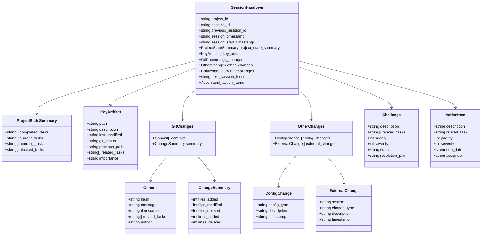
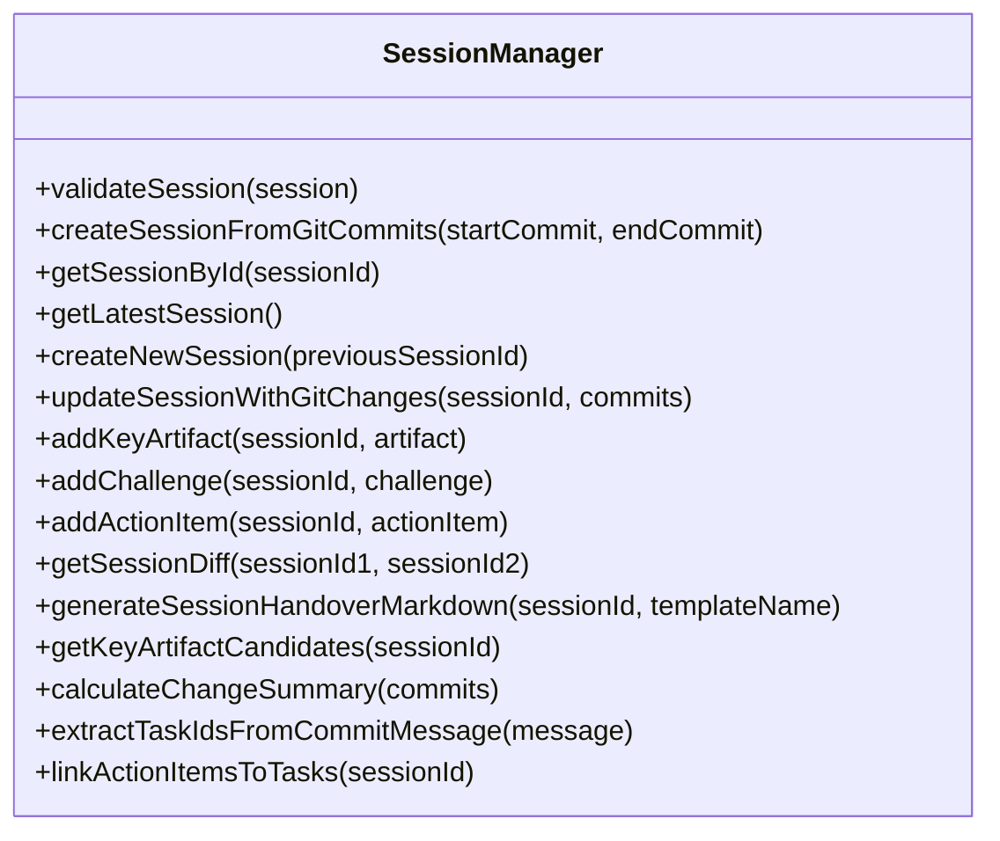

# セッション間状態引継ぎフォーマットの改善（T008）実装戦略

## 現状分析

現在のプロジェクト「knoa」は、AI駆動開発のためのフレームワークを構築中で、フェーズ0の実装段階にあります。タスクT001からT007までが完了または実装中で、次のフォーカスはT008「セッション間状態引継ぎフォーマットの改善」です。

現状のセッションスキーマは基本的な情報（プロジェクトID、タイムスタンプ、タスク状態サマリー、重要なファイル、課題、次のセッションの焦点）のみを含んでおり、以下の課題があります：

1. セッション間の連続性が弱い（前のセッションへの明示的な参照がない）
2. Gitとの連携が不足している（コミット情報との関連付けがない）
3. 変更差分の記録が不十分（どのファイルが変更されたかの詳細情報がない）
4. アクションアイテムの優先順位付けができない
5. 課題の構造化と優先順位付けができない

## 目標

セッション管理のJSONスキーマを拡張し、以下の機能を追加することで、AI駆動開発のセッション間連続性と追跡可能性を向上させます：

1. セッションとGitコミットの関連付け（複数コミット対応）
2. セッション間の連続性強化（前回のセッションIDの参照）
3. 変更差分の効率的な記録機能（ファイル単位と行単位）
4. アクションアイテムの優先順位付けと重要度評価
5. 課題の構造化と優先順位付け（優先度と重要度の2軸）
6. マークダウン形式の引継ぎドキュメント自動生成機能（カスタマイズ可能）

## 実装戦略

### 1. スキーマ拡張

`src/schemas/session.schema.json`を以下のように拡張します：



#### 主な拡張ポイント：

1. **セッション識別と連続性**:
   - `session_id`: セッションの一意識別子（セッション終了時のGitコミットハッシュを使用）
   - `previous_session_id`: 前回のセッションID（連続性の確保）
   - `session_start_timestamp`: セッション開始時刻（セッション境界の明確化）
   - `session_timestamp`: セッション終了時刻（従来のフィールド）

2. **key_artifactsの構造化**:
   - `path`: ファイルパス
   - `description`: ファイルの説明
   - `last_modified`: 最終更新日時（Gitコミット時刻を基準）
   - `git_status`: Gitの状態（unchanged, modified, added, deleted, renamed）
   - `previous_path`: リネーム前のパス（git_statusがrenamedの場合）
   - `related_tasks`: 関連するタスクID
   - `importance`: 重要度（high, medium, low）

3. **Git連携の強化**:
   - `git_changes`セクションの追加
   - `commits`: セッション中のコミット情報（ハッシュ、メッセージ、タイムスタンプ、関連タスク、作者）
   - `summary`: 変更の要約（追加/変更/削除されたファイル数、追加/削除された行数）

4. **その他の変更トラッキング**:
   - `other_changes`セクションの追加
   - `config_changes`: 設定変更（設定タイプ、説明、タイムスタンプ）
   - `external_changes`: 外部システムの変更（システム、変更タイプ、説明、タイムスタンプ）

5. **課題の構造化**:
   - `description`: 課題の説明
   - `related_tasks`: 関連するタスクID
   - `priority`: 優先度（1-5、ビジネス価値）
   - `severity`: 重要度（1-5、技術的影響）
   - `status`: 状態（identified, analyzing, in_progress, resolved, wontfix）
   - `resolution_plan`: 解決計画

6. **アクションアイテムの強化**:
   - `description`: アクションの説明
   - `related_task`: 関連するタスクID
   - `priority`: 優先度（1-5、ビジネス価値）
   - `severity`: 重要度（1-5、技術的影響）
   - `due_date`: 期限
   - `assignee`: 担当者

### 2. セッション管理ユーティリティの実装

`src/utils/session-manager.js`を新規作成し、以下の機能を実装します：



#### 主な機能：

1. **セッション検証**:
   - スキーマに基づくセッションの検証
   - 必須フィールドと値の型チェック

2. **Git連携**:
   - 複数のGitコミットからセッション情報を生成
   - コミットメッセージからタスクIDの抽出（`#T001 #T002`形式）
   - 変更差分の自動収集（ファイル単位と行単位）

3. **セッション管理**:
   - セッションの作成、取得、更新
   - 前回のセッションからの情報の引き継ぎ
   - セッション間の差分の計算

4. **key_artifact管理**:
   - 重要なファイルの候補を自動検出
   - ファイルの重要度の評価
   - リネームされたファイルの追跡

5. **課題とアクションアイテム管理**:
   - 優先度と重要度の2軸での評価
   - アクションアイテムとタスクの関連付け
   - 課題の状態管理

6. **マークダウン生成**:
   - カスタマイズ可能なテンプレートを使用
   - セッション情報からマークダウン形式の引継ぎドキュメントを生成
   - 重要な情報のハイライト

### 3. テンプレート更新

`src/templates/docs/session.json`を更新し、拡張されたスキーマに対応したサンプルを提供します：

```json
{
  "session_handover": {
    "project_id": "knoa",
    "session_id": "abc123def456",
    "previous_session_id": "789ghi012jkl",
    "session_timestamp": "2025-03-20T15:30:00Z",
    "session_start_timestamp": "2025-03-20T13:45:00Z",
    "project_state_summary": {
      "completed_tasks": ["T001", "T002", "T003"],
      "current_tasks": ["T004"],
      "pending_tasks": ["T005", "T006"],
      "blocked_tasks": []
    },
    "key_artifacts": [
      {
        "path": "src/schemas/session.schema.json",
        "description": "セッションスキーマ定義",
        "last_modified": "2025-03-20T14:25:00Z",
        "git_status": "modified",
        "related_tasks": ["T004"],
        "importance": "high"
      },
      {
        "path": "src/utils/session-manager.js",
        "description": "セッション管理ユーティリティ",
        "last_modified": "2025-03-20T15:10:00Z",
        "git_status": "added",
        "related_tasks": ["T004"],
        "importance": "high"
      },
      {
        "path": "src/templates/docs/session.json",
        "description": "セッションテンプレート",
        "last_modified": "2025-03-20T14:30:00Z",
        "git_status": "renamed",
        "previous_path": "src/templates/session-template.json",
        "related_tasks": ["T004"],
        "importance": "medium"
      }
    ],
    "git_changes": {
      "commits": [
        {
          "hash": "abc123def456",
          "message": "セッションスキーマの拡張 #T004",
          "timestamp": "2025-03-20T15:20:00Z",
          "related_tasks": ["T004"],
          "author": "AI Developer"
        },
        {
          "hash": "def456ghi789",
          "message": "セッション管理ユーティリティの追加 #T004",
          "timestamp": "2025-03-20T14:50:00Z",
          "related_tasks": ["T004"],
          "author": "AI Developer"
        }
      ],
      "summary": {
        "files_added": 1,
        "files_modified": 2,
        "files_deleted": 0,
        "lines_added": 120,
        "lines_deleted": 30
      }
    },
    "other_changes": {
      "config_changes": [
        {
          "config_type": "environment",
          "description": "NODE_ENV=development に設定",
          "timestamp": "2025-03-20T13:50:00Z"
        }
      ],
      "external_changes": [
        {
          "system": "Issue Tracker",
          "change_type": "status_update",
          "description": "Issue #42 を 'In Progress' に更新",
          "timestamp": "2025-03-20T14:15:00Z"
        }
      ]
    },
    "current_challenges": [
      {
        "description": "セッションIDとGitコミットハッシュの関連付けの最適化",
        "related_tasks": ["T004"],
        "priority": 4,
        "severity": 3,
        "status": "in_progress",
        "resolution_plan": "複数コミットを1セッションとして扱うロジックの実装"
      },
      {
        "description": "複数のコミットがある場合のセッション管理",
        "related_tasks": ["T004"],
        "priority": 3,
        "severity": 4,
        "status": "analyzing",
        "resolution_plan": "セッション開始・終了時のコミットを明示的に記録する仕組みの導入"
      }
    ],
    "next_session_focus": "T005: フィードバックループの確立",
    "action_items": [
      {
        "description": "セッション管理ユーティリティのテスト作成",
        "related_task": "T004",
        "priority": 5,
        "severity": 4,
        "due_date": "2025-03-21",
        "assignee": "AI Developer"
      },
      {
        "description": "マークダウン生成機能の実装",
        "related_task": "T004",
        "priority": 4,
        "severity": 3,
        "due_date": "2025-03-22",
        "assignee": "AI Developer"
      }
    ]
  }
}
```

### 4. マークダウンテンプレートの作成

`src/templates/docs/session-handover-template.md`を作成し、マークダウン生成のためのテンプレートを提供します：

```markdown
# セッション引継ぎドキュメント

## セッション情報
- **プロジェクト**: {{project_id}}
- **日時**: {{session_timestamp}}
- **セッション時間**: {{session_duration}}
- **セッションID**: {{session_id}}

## プロジェクト状態サマリー
- **完了タスク**: {{completed_tasks_formatted}}
- **進行中タスク**: {{current_tasks_formatted}}
- **保留中タスク**: {{pending_tasks_formatted}}
- **ブロック中タスク**: {{blocked_tasks_formatted}}

## 実装済みの内容

{{implementation_summary}}

### 主な変更点
{{key_changes}}

### 重要なファイル
{{key_artifacts_formatted}}

## 解決済みの課題
{{resolved_challenges}}

## 現在の課題
{{current_challenges_formatted}}

## 次のセッションでの実装手順

### 主な焦点
{{next_session_focus}}

### アクションアイテム
{{action_items_formatted}}

## 注意点と推奨事項
{{recommendations}}
```

### 5. 既存セッションの移行

`ai-context/sessions/latest-session.json`を新しい形式に移行します：

1. 既存のセッション情報に新しいフィールドを追加
2. セッションIDとして最新のGitコミットハッシュを使用
3. key_artifactsを構造化された形式に変換
4. 現在の課題を構造化された形式に変換
5. アクションアイテムを追加
6. その他の変更情報を追加

### 6. セッション管理ユーティリティのテスト

`tests/session-manager.test.js`を作成し、セッション管理ユーティリティのテストを実装します：

```javascript
const { SessionManager } = require('../src/utils/session-manager');
const fs = require('fs');
const path = require('path');

describe('SessionManager', () => {
  let sessionManager;
  
  beforeEach(() => {
    sessionManager = new SessionManager();
  });
  
  test('validateSession should validate session schema', () => {
    // テスト実装
  });
  
  test('createSessionFromGitCommits should create session from git commits', () => {
    // テスト実装
  });
  
  test('extractTaskIdsFromCommitMessage should extract task IDs', () => {
    // テスト実装
  });
  
  test('calculateChangeSummary should calculate change summary', () => {
    // テスト実装
  });
  
  test('generateSessionHandoverMarkdown should generate markdown', () => {
    // テスト実装
  });
  
  // その他のテスト
});
```

## 実装手順

以下の順序で実装を進めます：

1. **スキーマ拡張（Day 1）**:
   - `src/schemas/session.schema.json`の拡張
   - 新しいフィールドの追加と検証ルールの設定
   - 優先度と重要度の2軸の定義

2. **テンプレート更新（Day 1）**:
   - `src/templates/docs/session.json`の更新
   - 拡張されたスキーマに対応したサンプルの作成
   - `src/templates/docs/session-handover-template.md`の作成

3. **ユーティリティ実装（Day 2-3）**:
   - `src/utils/session-manager.js`の作成
   - Git連携機能の実装（複数コミット対応）
   - セッション管理機能の実装
   - key_artifact管理機能の実装
   - 課題とアクションアイテム管理機能の実装

4. **マークダウン生成機能（Day 4）**:
   - テンプレートエンジンの実装
   - マークダウン生成機能の実装
   - カスタマイズオプションの提供

5. **既存セッションの移行（Day 4）**:
   - `ai-context/sessions/latest-session.json`の更新
   - 新しい形式への移行と検証

6. **テストとドキュメント（Day 5）**:
   - `tests/session-manager.test.js`の作成
   - `docs/session-management.md`の作成
   - 使用例とベストプラクティスの提供

## 技術的考慮事項

### 1. 複数コミットの管理

複数のGitコミットを1つのセッションとして管理するために、以下のアプローチを採用します：

1. **セッション境界の定義**:
   - セッション開始時刻と終了時刻を明示的に記録
   - セッション開始時のコミットと終了時のコミットを記録
   - セッションIDとしては終了時のコミットハッシュを使用

2. **コミットの関連付け**:
   - セッション中のすべてのコミットを`commits`配列に記録
   - 各コミットからタスクIDを抽出し、関連付け
   - コミットの時系列順序を維持

3. **変更サマリーの計算**:
   - 複数コミットの変更を集計してサマリーを作成
   - ファイル単位と行単位の変更を記録
   - 重複カウントを避けるロジックの実装

### 2. key_artifactの管理

key_artifactを効果的に管理するために、以下のアプローチを採用します：

1. **重要なファイルの定義**:
   - 変更頻度の高いファイル
   - コアコンポーネントのファイル
   - ユーザーが明示的に指定したファイル
   - 特定のパターンに一致するファイル（例: `*.schema.json`）

2. **自動検出と提案**:
   - 変更されたファイルの中から重要なファイルを自動検出
   - 重要度の評価基準を定義（変更量、ファイルタイプ、パス）
   - ユーザーに提案し、確認を求める機能

3. **リネームの追跡**:
   - Gitのリネーム検出機能を活用
   - 前のパスと新しいパスの両方を記録
   - リネーム履歴の維持

### 3. 優先度と重要度の2軸管理

課題とアクションアイテムを効果的に管理するために、優先度と重要度の2軸を導入します：

1. **優先度（Priority）**:
   - ビジネス価値や機能的重要性を表す
   - 1-5のスケール（1: 最低、5: 最高）
   - ユーザーストーリーやビジネス要件に基づく評価

2. **重要度（Severity）**:
   - 技術的影響や緊急性を表す
   - 1-5のスケール（1: 最低、5: 最高）
   - 技術的リスクや影響範囲に基づく評価

3. **組み合わせの解釈**:
   - 高優先度・高重要度: 即時対応が必要
   - 高優先度・低重要度: 重要だが緊急ではない
   - 低優先度・高重要度: 技術的に重要だが、ビジネス価値は低い
   - 低優先度・低重要度: 後回しにできる

### 4. アクションアイテムとタスク管理の連携

アクションアイテムとタスク管理システムを効果的に連携させるために、以下のアプローチを採用します：

1. **位置づけの明確化**:
   - アクションアイテム: 次のセッションでの短期的なTODOリスト
   - タスク: 正式な作業単位（より長期的、正式な追跡）

2. **関連付けの仕組み**:
   - アクションアイテムに関連するタスクIDを明示的に記録
   - タスクの進捗状況に基づいてアクションアイテムの状態を更新
   - アクションアイテムの完了をタスクの進捗に反映

3. **自動連携機能**:
   - アクションアイテムからタスクを自動生成する機能
   - タスクの進捗に基づいてアクションアイテムを自動生成する機能
   - 重複を避けるための検証ロジック

### 5. マークダウン生成のカスタマイズ

マークダウン生成機能をカスタマイズ可能にするために、以下のアプローチを採用します：

1. **テンプレートエンジン**:
   - シンプルなテンプレートエンジンの実装
   - プレースホルダーの置換機能
   - 条件付きセクションの表示

2. **複数テンプレート**:
   - 用途に応じた複数のテンプレートを提供
   - 詳細版と要約版
   - 特定の情報にフォーカスしたバージョン

3. **カスタマイズオプション**:
   - セクションの表示/非表示の制御
   - 情報の詳細度の調整
   - 強調表示のルールのカスタマイズ

## 期待される効果

1. **セッション間の連続性向上**:
   - セッションの連鎖による開発履歴の追跡性向上
   - 前回のセッションからの情報の効率的な引き継ぎ
   - セッション境界の明確化による混乱の減少

2. **Git連携の強化**:
   - 複数コミットの効果的な管理
   - 変更履歴とセッション情報の一元管理
   - コミットとタスクの関連付けによる追跡性向上

3. **課題とアクションの明確化**:
   - 優先度と重要度の2軸による効果的な優先順位付け
   - 構造化された課題とアクションアイテムによる管理の効率化
   - タスク管理システムとの連携による一貫性の確保

4. **ドキュメント生成の自動化**:
   - カスタマイズ可能なマークダウン形式の引継ぎドキュメントの自動生成
   - 手動でのドキュメント作成の負担軽減
   - 一貫性のある形式での情報共有

## リスクと対策

| リスク | 影響度 | 対策 |
|-------|-------|------|
| 複数コミット管理の複雑性 | 高 | 明確なセッション境界の定義、段階的な実装、十分なテスト |
| key_artifact自動検出の精度 | 中 | 複数の検出基準の組み合わせ、ユーザー確認の仕組み |
| 優先度と重要度の2軸の運用複雑性 | 中 | 明確なガイドラインの提供、デフォルト値の設定 |
| アクションアイテムとタスクの二重管理 | 中 | 明確な役割分担、自動連携機能の提供 |
| マークダウンテンプレートの柔軟性と複雑性のバランス | 中 | シンプルな基本テンプレートと拡張オプションの提供 |
| Gitとの統合の複雑性 | 高 | 段階的な実装、エラーハンドリングの強化、フォールバック機能 |
| スキーマ変更による互換性問題 | 中 | 下位互換性の維持、移行スクリプトの提供、バージョニング |

## まとめ

この実装戦略により、セッション間状態引継ぎフォーマットが大幅に改善され、AI駆動開発のセッション間連続性と追跡可能性が向上します。特に以下の点で効果が期待されます：

1. 複数コミットの効果的な管理によるセッション境界の明確化
2. key_artifactの構造化と自動検出による重要ファイルの追跡性向上
3. 優先度と重要度の2軸による効果的な課題とアクションアイテムの管理
4. カスタマイズ可能なマークダウン生成機能によるドキュメント作成の効率化
5. Gitとの緊密な統合による開発履歴とセッション情報の一元管理

これらの改善により、フェーズ0の目標である「セッションを跨いでも開発コンテキストを90%以上維持できる」の達成に大きく貢献します。また、T007「タスク管理JSONファイル形式の詳細化」と組み合わせることで、AI駆動開発の基盤がより堅固になります。