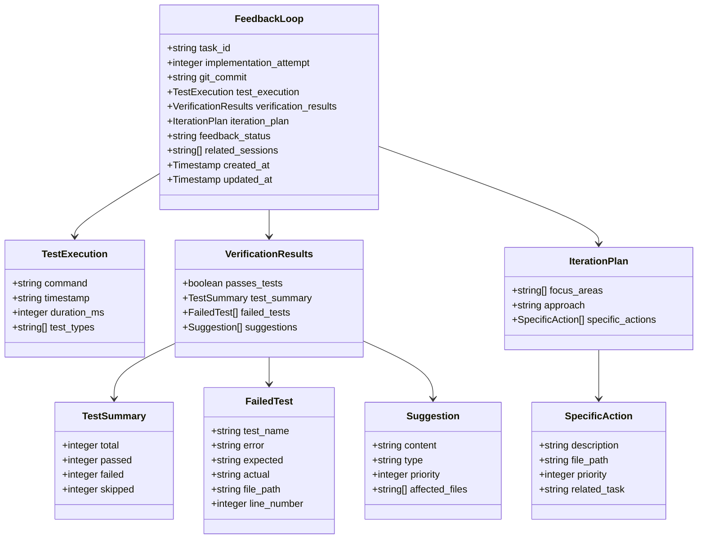
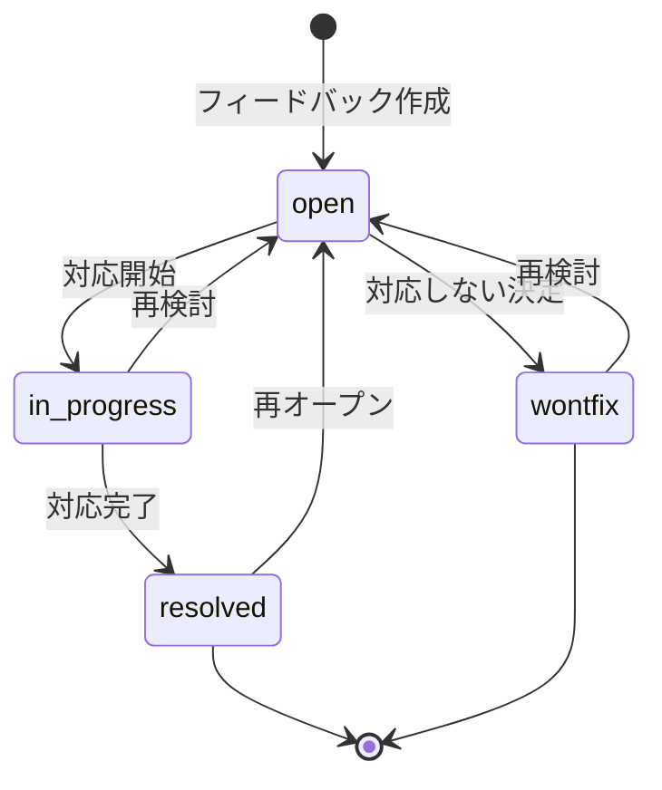
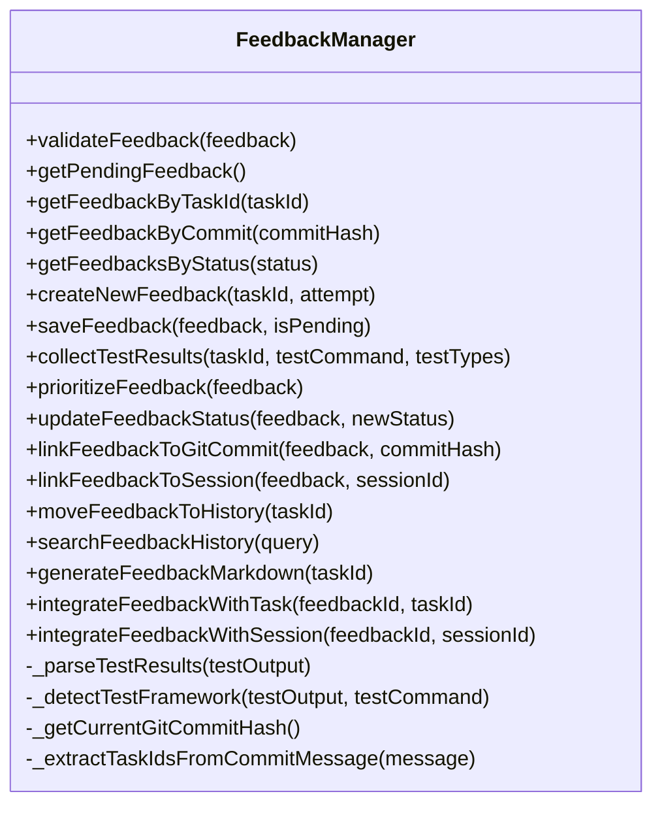
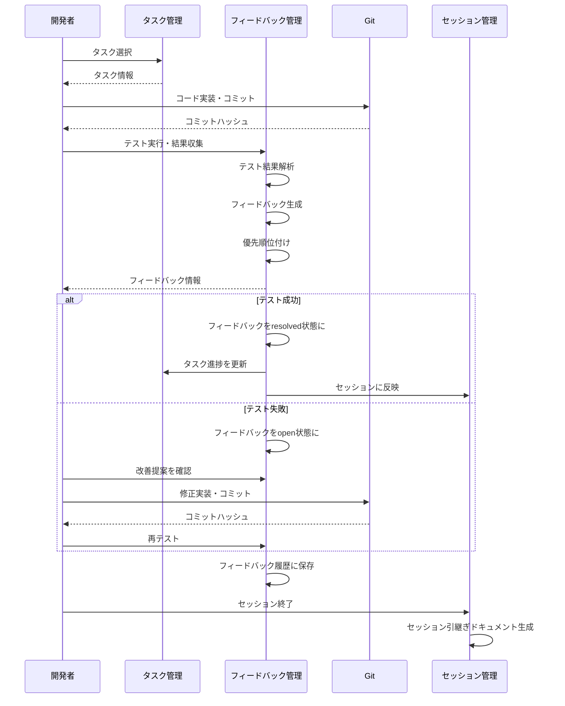

# フィードバックループの確立（T009）実装戦略

## 1. 概要

フィードバックループの確立は、AI駆動開発の重要な要素であり、実装結果の検証とそのフィードバックを開発フローに反映する仕組みを提供します。このタスクでは、フィードバックスキーマの拡張、フィードバック管理ユーティリティの実装、テスト結果の自動収集機能などを実装します。

## 2. 現状分析

### 2.1 既存のファイル構造

```
src/
  ├── schemas/
  │   ├── feedback.schema.json  # 基本的なフィードバックスキーマ
  │   ├── task.schema.json      # タスク管理スキーマ
  │   └── session.schema.json   # セッション管理スキーマ
  ├── templates/
  │   └── docs/
  │       ├── feedback.json     # 基本的なフィードバックテンプレート
  │       └── session.json      # セッションテンプレート
  └── utils/
      ├── session-manager.js    # セッション管理ユーティリティ
      └── task-manager.js       # タスク管理ユーティリティ

ai-context/
  ├── tasks/
  │   └── current-tasks.json    # 現在のタスク状態
  ├── sessions/
  │   └── latest-session.json   # 最新のセッション状態
  └── feedback/
      ├── pending-feedback.json # 保留中のフィードバック
      └── feedback-history/     # 解決済みフィードバックの履歴
```

### 2.2 現在のフィードバックスキーマの制限

現在のフィードバックスキーマには以下の制限があります：

1. テスト実行情報（コマンド、実行時間、テスト種類）がない
2. テスト結果の詳細情報（合計テスト数、成功数、失敗数、スキップ数）がない
3. フィードバックの種類と優先順位の定義がない
4. フィードバック状態の管理機能がない
5. Gitコミットとの関連付け機能がない
6. 具体的なアクションアイテムの構造化がない
7. 既存システム（タスク管理、セッション管理）との統合機能がない

### 2.3 既存のテスト環境

プロジェクトには2種類のテストスタイルが混在しています：

1. **Jestスタイル** (`session-manager.test.js`)
   - `describe`, `test`, `expect` などのJest APIを使用
   - モックやスパイ機能を活用

2. **カスタムテストスタイル** (`task-manager.test.js`)
   - `runTest`, `assertEqual`, `assertTrue`, `assertFalse` などのカスタムユーティリティを使用
   - シンプルな構造でテストを実行

フィードバックマネージャーは両方のテスト形式を検出・解析できる必要があります。

## 3. 実装戦略

### 3.1 フィードバックスキーマの拡張

`src/schemas/feedback.schema.json`を拡張して、以下の新しいフィールドを追加します：



#### 主な拡張ポイント

1. **Gitコミット連携**:
   - `git_commit`: フィードバック対象のGitコミットハッシュ

2. **テスト実行情報**:
   - `test_execution`: テスト実行の詳細情報（コマンド、タイムスタンプ、実行時間、テスト種類）

3. **テスト結果詳細**:
   - `verification_results.test_summary`: テスト結果の要約（合計、成功、失敗、スキップ）
   - `verification_results.failed_tests`: 失敗したテストの詳細情報

4. **提案の構造化**:
   - `verification_results.suggestions`: 改善提案（内容、種類、優先度、影響ファイル）

5. **アクションアイテムの構造化**:
   - `iteration_plan.specific_actions`: 具体的なアクションアイテム（説明、ファイルパス、優先度、関連タスク）

6. **状態管理**:
   - `feedback_status`: フィードバックの状態（open, in_progress, resolved, wontfix）

7. **セッション連携**:
   - `related_sessions`: 関連するセッションIDの配列

8. **タイムスタンプ**:
   - `created_at`: フィードバック作成日時
   - `updated_at`: フィードバック更新日時

### 3.2 フィードバック種類と優先度の定義

フィードバックの種類と優先度の重み付けを以下のように定義します：

| 種類（Type） | 重み（Weight） | 説明 |
|------------|--------------|------|
| security   | 5            | セキュリティに関連する問題 |
| functional | 5            | 機能的な問題 |
| performance| 4            | パフォーマンスに関連する問題 |
| ux         | 3            | ユーザー体験に関連する問題 |
| code_quality | 2          | コード品質に関連する問題 |

優先度は1〜5の整数値で表し、値が大きいほど優先度が高いことを示します。

### 3.3 フィードバックの状態遷移

フィードバックの状態遷移を以下のように定義します：



## 4. フィードバック管理ユーティリティの実装

`src/utils/feedback-manager.js`を新規作成し、以下の機能を実装します：



### 4.1 基本的な構造

```javascript
/**
 * フィードバック管理ユーティリティ
 * 
 * フィードバックの検証、テスト結果の自動収集、優先順位付け、状態管理、
 * Gitコミットとの関連付け、履歴管理などの機能を提供します。
 */

const fs = require('fs');
const path = require('path');
const { execSync } = require('child_process');

// スキーマの読み込み
const feedbackSchema = require('../schemas/feedback.schema.json');

// フィードバックの状態遷移の定義
const FEEDBACK_STATE_TRANSITIONS = {
  open: ["in_progress", "resolved", "wontfix"],
  in_progress: ["resolved", "wontfix", "open"],
  resolved: ["open"],
  wontfix: ["open"]
};

// フィードバックの種類と優先度の重み付け
const FEEDBACK_TYPE_WEIGHTS = {
  security: 5,
  functional: 5,
  performance: 4,
  ux: 3,
  code_quality: 2
};

/**
 * フィードバック管理クラス
 */
class FeedbackManager {
  /**
   * コンストラクタ
   * @param {Object} options - オプション
   * @param {string} options.feedbackDir - フィードバックディレクトリのパス
   * @param {string} options.templateDir - テンプレートディレクトリのパス
   */
  constructor(options = {}) {
    this.feedbackDir = options.feedbackDir || path.join(process.cwd(), 'ai-context', 'feedback');
    this.templateDir = options.templateDir || path.join(process.cwd(), 'src', 'templates', 'docs');
    this.pendingFeedbackPath = path.join(this.feedbackDir, 'pending-feedback.json');
    this.feedbackHistoryDir = path.join(this.feedbackDir, 'feedback-history');
    
    // ディレクトリが存在しない場合は作成
    if (!fs.existsSync(this.feedbackDir)) {
      fs.mkdirSync(this.feedbackDir, { recursive: true });
    }
    if (!fs.existsSync(this.feedbackHistoryDir)) {
      fs.mkdirSync(this.feedbackHistoryDir, { recursive: true });
    }
  }
  
  // 以下、各メソッドの実装
}
```

### 4.2 テストフレームワーク検出と結果解析

```javascript
/**
 * テストフレームワークを検出
 * @param {string} testOutput - テスト出力
 * @param {string} testCommand - テストコマンド
 * @returns {string} テストフレームワーク（'jest', 'custom', 'unknown'）
 * @private
 */
_detectTestFramework(testOutput, testCommand) {
  if (testOutput.includes('PASS') || testOutput.includes('FAIL') || testCommand.includes('jest')) {
    return 'jest';
  } else if (testOutput.includes('✅ PASS') || testOutput.includes('❌ FAIL')) {
    return 'custom';
  }
  return 'unknown';
}

/**
 * テスト結果を解析
 * @param {string} testOutput - テスト出力
 * @param {string} testCommand - テストコマンド
 * @returns {Object} 解析結果 {summary, failedTests}
 * @private
 */
_parseTestResults(testOutput, testCommand) {
  const framework = this._detectTestFramework(testOutput, testCommand);
  
  switch (framework) {
    case 'jest':
      return this._parseJestOutput(testOutput);
    case 'custom':
      return this._parseCustomOutput(testOutput);
    default:
      return this._parseGenericOutput(testOutput);
  }
}

/**
 * Jestの出力を解析
 * @param {string} output - テスト出力
 * @returns {Object} 解析結果
 * @private
 */
_parseJestOutput(output) {
  // Jestの出力形式を解析するロジック
  // 例: "Test Suites: 1 failed, 1 total"
  //     "Tests: 2 failed, 2 passed, 4 total"
}

/**
 * カスタムテストの出力を解析
 * @param {string} output - テスト出力
 * @returns {Object} 解析結果
 * @private
 */
_parseCustomOutput(output) {
  // カスタムテストの出力形式を解析するロジック
  // 例: "✅ PASS: テスト名"
  //     "❌ FAIL: テスト名 - 期待値: X, 実際値: Y"
}
```

### 4.3 テスト結果の自動収集

```javascript
/**
 * テスト結果を自動収集
 * @param {string} taskId - タスクID
 * @param {string} testCommand - テストコマンド
 * @param {Array} testTypes - テストの種類
 * @returns {Object} 更新されたフィードバック
 */
async collectTestResults(taskId, testCommand, testTypes = ["unit"]) {
  try {
    // 既存のフィードバックを取得または新規作成
    let feedback = this.getFeedbackByTaskId(taskId);
    if (!feedback) {
      feedback = this.createNewFeedback(taskId);
    }
    
    const loop = feedback.feedback_loop;
    const startTime = Date.now();
    
    // テストコマンドを実行
    let testOutput;
    let passes = false;
    
    try {
      testOutput = execSync(testCommand, { encoding: 'utf8' });
      passes = true;
    } catch (e) {
      testOutput = e.stdout || e.message;
      passes = false;
    }
    
    const endTime = Date.now();
    const duration = endTime - startTime;
    
    // テスト実行情報を更新
    loop.test_execution = {
      command: testCommand,
      timestamp: new Date().toISOString(),
      duration_ms: duration,
      test_types: testTypes
    };
    
    // テスト結果を解析
    const testResults = this._parseTestResults(testOutput, testCommand);
    
    // verification_resultsを更新
    loop.verification_results.passes_tests = passes;
    loop.verification_results.test_summary = testResults.summary;
    loop.verification_results.failed_tests = testResults.failedTests;
    
    // フィードバックを保存
    this.saveFeedback(feedback);
    
    return feedback;
  } catch (error) {
    console.error('テスト結果の自動収集に失敗しました:', error);
    return null;
  }
}
```

### 4.4 フィードバックの優先順位付けと状態管理

```javascript
/**
 * フィードバックの優先順位付け
 * @param {Object} feedback - フィードバック
 * @returns {Object} 優先順位付けされたフィードバック
 */
prioritizeFeedback(feedback) {
  try {
    if (!this.validateFeedback(feedback)) {
      console.error('不正なフィードバックは優先順位付けできません');
      return feedback;
    }
    
    const loop = feedback.feedback_loop;
    const suggestions = loop.verification_results.suggestions;
    
    // 提案の優先順位付け
    for (let i = 0; i < suggestions.length; i++) {
      const suggestion = suggestions[i];
      
      // 種類が指定されていない場合はfunctionalとみなす
      if (!suggestion.type) {
        suggestion.type = "functional";
      }
      
      // 優先度が指定されていない場合は種類に基づいて設定
      if (!suggestion.priority) {
        suggestion.priority = FEEDBACK_TYPE_WEIGHTS[suggestion.type] || 3;
      }
    }
    
    // 優先度でソート（高い順）
    suggestions.sort((a, b) => b.priority - a.priority);
    
    // iteration_planのspecific_actionsも優先順位付け
    if (Array.isArray(loop.iteration_plan.specific_actions)) {
      loop.iteration_plan.specific_actions.sort((a, b) => b.priority - a.priority);
    }
    
    return feedback;
  } catch (error) {
    console.error('フィードバックの優先順位付けに失敗しました:', error);
    return feedback;
  }
}

/**
 * フィードバックの状態を更新
 * @param {Object} feedback - フィードバック
 * @param {string} newStatus - 新しい状態
 * @returns {Object} 更新されたフィードバック
 */
updateFeedbackStatus(feedback, newStatus) {
  try {
    if (!this.validateFeedback(feedback)) {
      console.error('不正なフィードバックは状態を更新できません');
      return feedback;
    }
    
    const loop = feedback.feedback_loop;
    const currentStatus = loop.feedback_status || "open";
    
    // 状態遷移の検証
    if (!FEEDBACK_STATE_TRANSITIONS[currentStatus].includes(newStatus)) {
      console.error(`${currentStatus}から${newStatus}への状態遷移は許可されていません`);
      return feedback;
    }
    
    // 状態を更新
    loop.feedback_status = newStatus;
    loop.updated_at = new Date().toISOString();
    
    // resolvedまたはwontfixの場合は履歴に移動
    if (newStatus === "resolved" || newStatus === "wontfix") {
      this.saveFeedback(feedback, false);
      
      // 保留中のフィードバックが同じタスクIDの場合は削除
      const pendingFeedback = this.getPendingFeedback();
      if (pendingFeedback && pendingFeedback.feedback_loop.task_id === loop.task_id) {
        fs.unlinkSync(this.pendingFeedbackPath);
      }
    } else {
      this.saveFeedback(feedback);
    }
    
    return feedback;
  } catch (error) {
    console.error('フィードバックの状態更新に失敗しました:', error);
    return feedback;
  }
}
```

### 4.5 Git連携

```javascript
/**
 * フィードバックにGitコミットを関連付ける
 * @param {Object} feedback - フィードバック
 * @param {string} commitHash - コミットハッシュ
 * @returns {Object} 更新されたフィードバック
 */
linkFeedbackToGitCommit(feedback, commitHash) {
  try {
    if (!this.validateFeedback(feedback)) {
      console.error('不正なフィードバックはGitコミットと関連付けできません');
      return feedback;
    }
    
    // コミットハッシュを設定
    feedback.feedback_loop.git_commit = commitHash;
    feedback.feedback_loop.updated_at = new Date().toISOString();
    
    // フィードバックを保存
    this.saveFeedback(feedback);
    
    return feedback;
  } catch (error) {
    console.error('フィードバックとGitコミットの関連付けに失敗しました:', error);
    return feedback;
  }
}

/**
 * 現在のGitコミットハッシュを取得
 * @returns {string} コミットハッシュ
 * @private
 */
_getCurrentGitCommitHash() {
  try {
    return execSync('git rev-parse HEAD').toString().trim();
  } catch (error) {
    console.error('Gitコミットハッシュの取得に失敗しました:', error);
    return `unknown-${Date.now()}`;
  }
}

/**
 * コミットメッセージからタスクIDを抽出
 * @param {string} message - コミットメッセージ
 * @returns {Array} タスクIDの配列
 * @private
 */
_extractTaskIdsFromCommitMessage(message) {
  try {
    const taskPattern = /#T[0-9]{3}/g;
    const matches = message.match(taskPattern) || [];
    
    // '#'を除去してタスクIDのみを返す
    return matches.map(match => match.substring(1));
  } catch (error) {
    console.error('タスクIDの抽出に失敗しました:', error);
    return [];
  }
}
```

### 4.6 セッション連携

```javascript
/**
 * フィードバックにセッションを関連付ける
 * @param {Object} feedback - フィードバック
 * @param {string} sessionId - セッションID
 * @returns {Object} 更新されたフィードバック
 */
linkFeedbackToSession(feedback, sessionId) {
  try {
    if (!this.validateFeedback(feedback)) {
      console.error('不正なフィードバックはセッションと関連付けできません');
      return feedback;
    }
    
    // 関連するセッションが未定義の場合は初期化
    if (!Array.isArray(feedback.feedback_loop.related_sessions)) {
      feedback.feedback_loop.related_sessions = [];
    }
    
    // 既に関連付けられている場合は何もしない
    if (feedback.feedback_loop.related_sessions.includes(sessionId)) {
      return feedback;
    }
    
    // セッションIDを追加
    feedback.feedback_loop.related_sessions.push(sessionId);
    feedback.feedback_loop.updated_at = new Date().toISOString();
    
    // フィードバックを保存
    this.saveFeedback(feedback);
    
    return feedback;
  } catch (error) {
    console.error('フィードバックとセッションの関連付けに失敗しました:', error);
    return feedback;
  }
}

/**
 * フィードバックをセッションに統合
 * @param {string} feedbackId - フィードバックID（タスクID）
 * @param {string} sessionId - セッションID
 * @returns {boolean} 統合結果
 */
async integrateFeedbackWithSession(feedbackId, sessionId) {
  try {
    const { SessionManager } = require('./session-manager');
    const sessionManager = new SessionManager();
    
    // フィードバックを取得
    const feedback = this.getFeedbackByTaskId(feedbackId);
    if (!feedback) {
      console.error(`フィードバック ${feedbackId} が見つかりません`);
      return false;
    }
    
    // セッションを取得
    const session = sessionManager.getSessionById(sessionId);
    if (!session) {
      console.error(`セッション ${sessionId} が見つかりません`);
      return false;
    }
    
    // フィードバックの失敗したテストを課題として反映
    const failedTests = feedback.feedback_loop.verification_results.failed_tests;
    for (const test of failedTests) {
      const challenge = {
        description: `テスト失敗: ${test.test_name}`,
        related_tasks: [feedback.feedback_loop.task_id],
        priority: 4,
        severity: 4,
        status: "in_progress",
        resolution_plan: "テストが成功するように実装を修正"
      };
      
      sessionManager.addChallenge(sessionId, challenge);
    }
    
    // フィードバックのアクションアイテムをセッションのアクションアイテムに反映
    const actions = feedback.feedback_loop.iteration_plan.specific_actions;
    for (const action of actions) {
      const actionItem = {
        description: action.description,
        related_task: action.related_task || feedback.feedback_loop.task_id,
        priority: action.priority,
        severity: action.priority,
        due_date: new Date(Date.now() + 86400000).toISOString().split('T')[0],
        assignee: "AI Developer"
      };
      
      sessionManager.addActionItem(sessionId, actionItem);
    }
    
    // フィードバックとセッションを関連付け
    this.linkFeedbackToSession(feedback, sessionId);
    
    return true;
  } catch (error) {
    console.error('フィードバックとセッションの統合に失敗しました:', error);
    return false;
  }
}
```

### 4.7 タスク連携

```javascript
/**
 * フィードバックをタスクに統合
 * @param {string} feedbackId - フィードバックID（タスクID）
 * @param {string} taskId - タスクID
 * @returns {boolean} 統合結果
 */
async integrateFeedbackWithTask(feedbackId, taskId) {
  try {
    const { TaskManager } = require('./task-manager');
    const taskManager = new TaskManager();
    
    // フィードバックを取得
    const feedback = this.getFeedbackByTaskId(feedbackId);
    if (!feedback) {
      console.error(`フィードバック ${feedbackId} が見つかりません`);
      return false;
    }
    
    // タスクを取得
    const tasks = await taskManager.getAllTasks();
    const task = tasks.decomposed_tasks.find(t => t.id === taskId);
    if (!task) {
      console.error(`タスク ${taskId} が見つかりません`);
      return false;
    }
    
    // フィードバックの状態に基づいてタスクの進捗状態を更新
    const statusMap = {
      open: "in_progress",
      in_progress: "in_progress",
      resolved: task.progress_state === "completed" ? "completed" : "in_testing",
      wontfix: task.status
    };
    
    const progressStateMap = {
      open: "in_development",
      in_progress: "in_review",
      resolved: task.progress_percentage === 100 ? "completed" : "in_testing",
      wontfix: task.progress_state
    };
    
    task.status = statusMap[feedback.feedback_loop.feedback_status];
    task.progress_state = progressStateMap[feedback.feedback_loop.feedback_status];
    
    // テスト結果に基づいてタスクの進捗率を更新
    if (feedback.feedback_loop.verification_results.passes_tests) {
      task.progress_percentage = Math.max(task.progress_percentage, 90);
    }
    
    // Gitコミットの関連付け
    if (feedback.feedback_loop.git_commit && !task.git_commits.includes(feedback.feedback_loop.git_commit)) {
      task.git_commits.push(feedback.feedback_loop.git_commit);
    }
    
    // 更新したタスクを保存
    return await taskManager.updateTask(task, tasks);
  } catch (error) {
    console.error('フィードバックとタスクの統合に失敗しました:', error);
    return false;
  }
}
```

### 4.8 マークダウン生成

```javascript
/**
 * フィードバックのマークダウンを生成
 * @param {string} taskId - タスクID
 * @returns {string} マークダウン文字列
 */
generateFeedbackMarkdown(taskId) {
  try {
    // フィードバックを取得
    const feedback = this.getFeedbackByTaskId(taskId);
    if (!feedback) {
      console.error(`タスクID ${taskId} のフィードバックが見つかりません`);
      return null;
    }
    
    // マークダウンテンプレートを読み込む
    const templatePath = path.join(this.templateDir, 'feedback-markdown-template.md');
    if (!fs.existsSync(templatePath)) {
      console.error(`テンプレートファイル ${templatePath} が見つかりません`);
      return null;
    }
    
    let template = fs.readFileSync(templatePath, 'utf8');
    const loop = feedback.feedback_loop;
    
    // プレースホルダーを置換
    template = template.replace(/{{task_id}}/g, loop.task_id);
    template = template.replace(/{{implementation_attempt}}/g, loop.implementation_attempt);
    template = template.replace(/{{git_commit}}/g, loop.git_commit || 'なし');
    template = template.replace(/{{feedback_status}}/g, loop.feedback_status || 'open');
    
    // テスト実行情報
    if (loop.test_execution) {
      template = template.replace(/{{test_execution.timestamp}}/g, this._formatDateTime(loop.test_execution.timestamp));
      template = template.replace(/{{test_types_formatted}}/g, (loop.test_execution.test_types || []).join(', '));
    }
    
    // テスト結果
    const vr = loop.verification_results;
    template = template.replace(/{{passes_tests_text}}/g, vr.passes_tests ? '✅ 成功' : '❌ 失敗');
    
    if (vr.test_summary) {
      template = template.replace(/{{test_summary.total}}/g, vr.test_summary.total || 0);
      template = template.replace(/{{test_summary.passed}}/g, vr.test_summary.passed || 0);
      template = template.replace(/{{test_summary.failed}}/g, vr.test_summary.failed || 0);
      template = template.replace(/{{test_summary.skipped}}/g, vr.test_summary.skipped || 0);
    }
    
    // 失敗したテスト
    const hasFailedTests = vr.failed_tests && vr.failed_tests.length > 0;
    template = template.replace(/{{has_failed_tests}}/g, hasFailedTests);
    
    if (hasFailedTests) {
      let failedTestsContent = '';
      for (const test of vr.failed_tests) {
        failedTestsContent += `#### ${test.test_name}\n\n`;
        failedTestsContent += `- **エラー**: ${test.error}\n`;
        if (test.expected) failedTestsContent += `- **期待値**: ${test.expected}\n`;
        if (test.actual) failedTestsContent += `- **実際値**: ${test.actual}\n`;
        if (test.file_path) failedTestsContent += `- **ファイル**: ${test.file_path}`;
        if (test.line_number) failedTestsContent += `:${test.line_number}`;
        failedTestsContent += '\n\n';
      }
      template = template.replace(/{{#each failed_tests}}[\s\S]*?{{\/each}}/g, failedTestsContent);
    }
    
    // 改善提案
    let suggestionsContent = '';
    if (vr.suggestions && vr.suggestions.length > 0) {
      for (const suggestion of vr.suggestions) {
        suggestionsContent += `### ${suggestion.type || 'その他'} (優先度: ${suggestion.priority || 3})\n\n`;
        suggestionsContent += `${suggestion.content}\n\n`;
        
        if (suggestion.affected_files && suggestion.affected_files.length > 0) {
          suggestionsContent += '**影響ファイル**:\n';
          for (const file of suggestion.affected_files) {
            suggestionsContent += `- ${file}\n`;
          }
          suggestionsContent += '\n';
        }
      }
    } else {
      suggestionsContent = '改善提案はありません。\n\n';
    }
    template = template.replace(/{{#each suggestions}}[\s\S]*?{{\/each}}/g, suggestionsContent);
    
    // 次のイテレーション計画
    const ip = loop.iteration_plan;
    
    // 焦点領域
    let focusAreasContent = '';
    if (ip.focus_areas && ip.focus_areas.length > 0) {
      for (const area of ip.focus_areas) {
        focusAreasContent += `- ${area}\n`;
      }
    } else {
      focusAreasContent = '- 特に焦点領域はありません\n';
    }
    template = template.replace(/{{#each focus_areas}}[\s\S]*?{{\/each}}/g, focusAreasContent);
    
    // アプローチ
    template = template.replace(/{{approach}}/g, ip.approach || '特に指定されていません');
    
    // 具体的なアクション
    let actionsContent = '';
    if (ip.specific_actions && ip.specific_actions.length > 0) {
      for (const action of ip.specific_actions) {
        actionsContent += `- [P${action.priority || 3}] ${action.description}`;
        if (action.file_path) actionsContent += ` (${action.file_path})`;
        actionsContent += '\n';
      }
    } else {
      actionsContent = '- 特に具体的なアクションはありません\n';
    }
    template = template.replace(/{{#each specific_actions}}[\s\S]*?{{\/each}}/g, actionsContent);
    
    return template;
  } catch (error) {
    console.error('マークダウン生成に失敗しました:', error);
    return null;
  }
}

/**
 * 日時をフォーマット
 * @param {string} dateTimeString - ISO 8601形式の日時文字列
 * @returns {string} フォーマットされた日時
 * @private
 */
_formatDateTime(dateTimeString) {
  try {
    const date = new Date(dateTimeString);
    return date.toLocaleString('ja-JP', {
      year: 'numeric',
      month: '2-digit',
      day: '2-digit',
      hour: '2-digit',
      minute: '2-digit'
    });
  } catch (error) {
    return dateTimeString;
  }
}
```

## 5. CLIの実装

`src/cli/feedback.js`を新規作成し、以下のようなCLIを実装します：

```javascript
#!/usr/bin/env node
const { FeedbackManager } = require('../utils/feedback-manager');

// コマンドライン引数の解析
const args = process.argv.slice(2);
const taskId = args[0];
const command = args[1] || 'collect';

if (!taskId) {
  console.error('タスクIDを指定してください');
  console.log('使用方法: npm run feedback <タスクID> [コマンド]');
  console.log('コマンド:');
  console.log('  collect  - テスト結果を収集してフィードバックを生成（デフォルト）');
  console.log('  status   - フィードバックの状態を表示');
  console.log('  resolve  - フィードバックを解決済みとしてマーク');
  console.log('  reopen   - フィードバックを再オープン');
  console.log('  report   - フィードバックレポートを生成');
  process.exit(1);
}

const feedbackManager = new FeedbackManager();

async function main() {
  switch (command) {
    case 'collect':
      console.log(`タスク ${taskId} のフィードバックを収集します...`);
      const feedback = await feedbackManager.collectTestResults(taskId, 'npm test');
      console.log(`フィードバックを保存しました。`);
      break;
      
    case 'status':
      console.log(`タスク ${taskId} のフィードバック状態を表示します...`);
      const status = feedbackManager.getFeedbackByTaskId(taskId);
      console.log(status ? status.feedback_loop.feedback_status : 'フィードバックが見つかりません');
      break;
      
    case 'resolve':
      console.log(`タスク ${taskId} のフィードバックを解決済みとしてマークします...`);
      const resolvedFeedback = feedbackManager.getFeedbackByTaskId(taskId);
      if (resolvedFeedback) {
        feedbackManager.updateFeedbackStatus(resolvedFeedback, 'resolved');
        console.log('フィードバックを解決済みとしてマークしました');
      } else {
        console.error('フィードバックが見つかりません');
      }
      break;
      
    case 'reopen':
      console.log(`タスク ${taskId} のフィードバックを再オープンします...`);
      const reopenFeedback = feedbackManager.getFeedbackByTaskId(taskId);
      if (reopenFeedback) {
        feedbackManager.updateFeedbackStatus(reopenFeedback, 'open');
        console.log('フィードバックを再オープンしました');
      } else {
        console.error('フィードバックが見つかりません');
      }
      break;
      
    case 'report':
      console.log(`タスク ${taskId} のフィードバックレポートを生成します...`);
      const report = feedbackManager.generateFeedbackMarkdown(taskId);
      if (report) {
        console.log(report);
      } else {
        console.error('フィードバックレポートの生成に失敗しました');
      }
      break;
      
    default:
      console.error(`不明なコマンド: ${command}`);
      break;
  }
}

main().catch(console.error);
```

package.jsonに以下のスクリプトを追加：

```json
"scripts": {
  "feedback": "node src/cli/feedback.js"
}
```

## 6. マークダウンテンプレートの実装

`src/templates/docs/feedback-markdown-template.md`を作成し、以下のようなテンプレートを提供します：

```markdown
# フィードバックレポート: {{task_id}}

## 概要

- **タスク**: {{task_id}}
- **実装試行回数**: {{implementation_attempt}}
- **コミット**: {{git_commit}}
- **ステータス**: {{feedback_status}}
- **テスト実行日時**: {{test_execution.timestamp}}

## テスト結果

- **結果**: {{passes_tests_text}}
- **テスト数**: {{test_summary.total}}
- **成功**: {{test_summary.passed}}
- **失敗**: {{test_summary.failed}}
- **スキップ**: {{test_summary.skipped}}
- **テスト種別**: {{test_types_formatted}}

{{#if has_failed_tests}}
### 失敗したテスト

{{#each failed_tests}}
#### {{test_name}}

- **エラー**: {{error}}
- **期待値**: {{expected}}
- **実際値**: {{actual}}
- **ファイル**: {{file_path}}:{{line_number}}

{{/each}}
{{/if}}

## 改善提案

{{#each suggestions}}
### {{type}} (優先度: {{priority}})

{{content}}

{{#if affected_files}}
**影響ファイル**:
{{#each affected_files}}
- {{this}}
{{/each}}
{{/if}}

{{/each}}

## 次のイテレーション計画

### 焦点領域

{{#each focus_areas}}
- {{this}}
{{/each}}

### アプローチ

{{approach}}

### 具体的なアクション

{{#each specific_actions}}
- [P{{priority}}] {{description}} {{#if file_path}}({{file_path}}){{/if}}
{{/each}}
```

## 7. テストファイルの実装

`tests/feedback-manager.test.js`を作成し、フィードバック管理ユーティリティのテストを実装します。

## 8. 実装の優先順位と段階的アプローチ

実装を以下の段階に分けて進めます：

### フェーズ1：基盤実装（Days 1-2）

1. **FeedbackManagerクラスの基本構造実装**
   - `SessionManager`クラスのパターンを参考に、基本的なCRUD操作を実装
   - 既存のファイル構造と一貫性のある設計

2. **テストフレームワーク検出と結果解析**
   - Jest形式とカスタムテスト形式の両方に対応
   - 汎用的なパーサーインターフェースの実装

3. **フィードバックスキーマの完成**
   - テスト出力の検出結果に基づく調整
   - 検証機能の実装

### フェーズ2：機能拡充（Days 3-4）

4. **優先順位付けと状態管理**
   - 提案の優先順位付け機能の実装
   - フィードバック状態管理の実装

5. **Git連携**
   - コミット関連付け機能の実装
   - コミットメッセージからのタスクID抽出機能の実装

6. **履歴管理**
   - フィードバック履歴機能の実装
   - 検索機能の実装

### フェーズ3：CLIとテスト（Days 5-6）

7. **CLIの実装**
   - `npm run feedback TXXX`コマンドの実装
   - 基本的なコマンド（collect, status, resolve）の実装

8. **マークダウン生成**
   - マークダウンテンプレートの実装
   - フィードバックレポート生成機能の実装

9. **テスト実装**
   - ユニットテストの実装
   - 統合テストの実装

### フェーズ4：統合と文書化（Days 7-8）

10. **タスク・セッション統合**
    - タスク管理システムとの統合
    - セッション管理システムとの統合

11. **ドキュメント作成**
    - 使用方法ドキュメントの作成
    - APIリファレンスの作成

12. **サンプル作成**
    - サンプルフィードバックの作成
    - 統合フローの例示

## 9. 統合フロー

フィードバックループの全体フローを以下のように定義します：



## 10. まとめ

フィードバックループの確立（T009）の実装により、AI駆動開発プロセスにおける重要な要素が整備されます。テスト結果の自動収集、フィードバックの優先順位付け、状態管理、Gitコミットとの関連付け、履歴管理などの機能により、開発サイクルが効率化され、品質が向上します。

この実装は、フェーズ0の基盤として機能し、後続のフェーズでさらに拡張されることで、より高度なフィードバックループへと発展していきます。