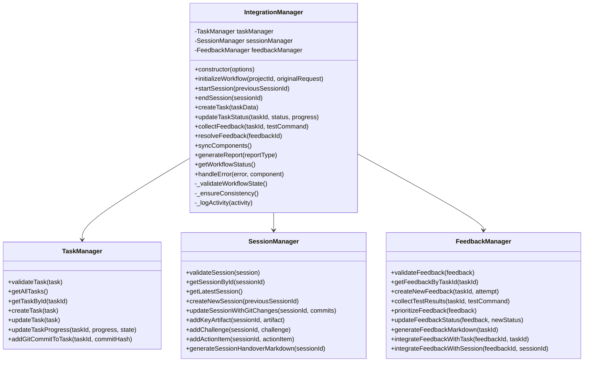
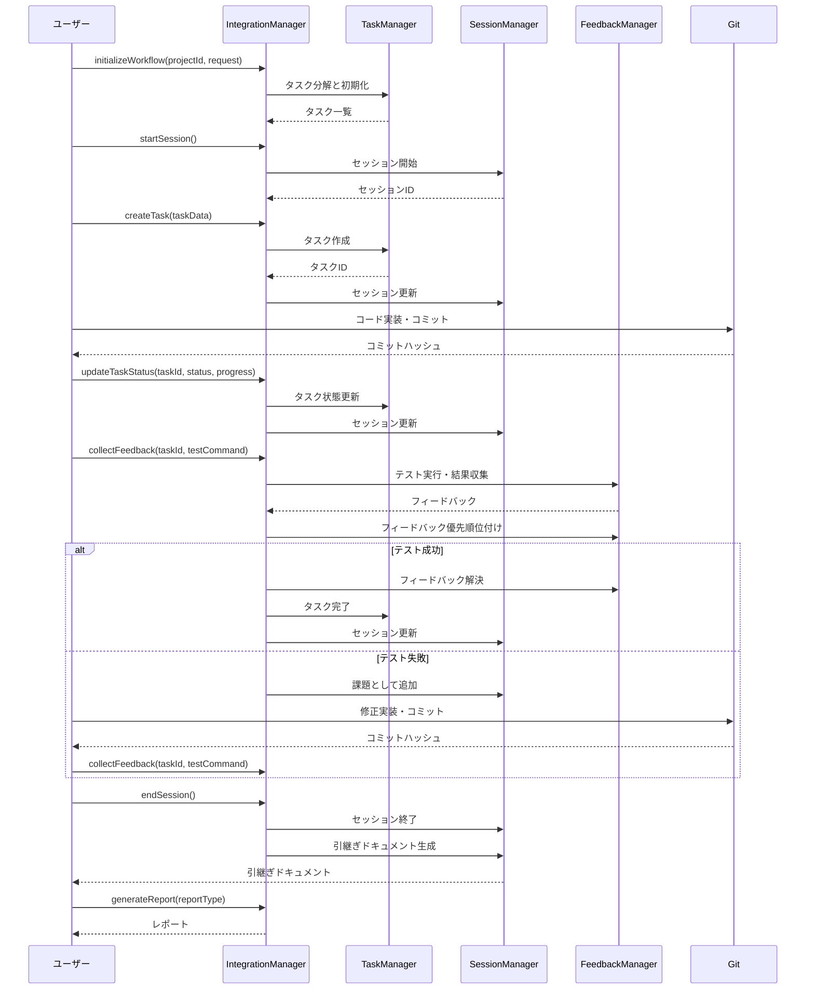

# 統合フローの確立（T010）実装戦略

## 1. 概要

タスク管理、セッション管理、フィードバック管理の統合フローの確立は、AI駆動開発の効率と一貫性を向上させるための重要なステップです。これまでに実装された3つの主要コンポーネント（タスク管理、セッション管理、フィードバック管理）を統合し、一貫したワークフローを確立することで、開発プロセス全体の効率化と品質向上を目指します。

## 2. 現状分析

### 2.1 既存のコンポーネント

現在、以下の3つの主要コンポーネントが個別に実装されています：

1. **タスク管理（T007）**
   - `src/utils/task-manager.js`: タスク管理ユーティリティ
   - `src/schemas/task.schema.json`: タスクスキーマ
   - `ai-context/tasks/current-tasks.json`: 現在のタスク状態

2. **セッション管理（T008）**
   - `src/utils/session-manager.js`: セッション管理ユーティリティ
   - `src/schemas/session.schema.json`: セッションスキーマ
   - `ai-context/sessions/latest-session.json`: 最新のセッション状態

3. **フィードバック管理（T009）**
   - `src/utils/feedback-manager.js`: フィードバック管理ユーティリティ
   - `src/schemas/feedback.schema.json`: フィードバックスキーマ
   - `ai-context/feedback/pending-feedback.json`: 保留中のフィードバック
   - `ai-context/feedback/feedback-history/`: 解決済みフィードバックの履歴

### 2.2 現在の連携状況

現在、これらのコンポーネント間には部分的な連携が実装されています：

1. **タスク管理とセッション管理の連携**
   - セッションの`project_state_summary`にタスク状態が反映される
   - セッションの`key_artifacts`にタスクIDが関連付けられる
   - セッションの`action_items`にタスクIDが関連付けられる

2. **フィードバック管理とタスク管理の連携**
   - `integrateFeedbackWithTask`メソッドによるタスク進捗の更新
   - フィードバックのタスクIDによる関連付け
   - Gitコミットを介した間接的な連携

3. **フィードバック管理とセッション管理の連携**
   - `integrateFeedbackWithSession`メソッドによるセッションへの反映
   - フィードバックの課題とアクションアイテムのセッションへの反映
   - セッションIDによる関連付け

### 2.3 現在の課題

現在の実装には以下の課題があります：

1. **統合フローの欠如**
   - 3つのコンポーネントを一貫して連携させるフローが確立されていない
   - 各コンポーネント間の連携が部分的で、全体的な整合性が保証されていない
   - 統合的なインターフェースがなく、各コンポーネントを個別に操作する必要がある

2. **データの一貫性の課題**
   - 同じ情報が複数の場所に重複して保存される可能性がある
   - 一方のコンポーネントの更新が他のコンポーネントに自動的に反映されない
   - 更新の順序や依存関係が明確に定義されていない

3. **ワークフローの複雑性**
   - 各コンポーネントを適切な順序で操作する必要がある
   - 複数のコマンドやAPIを使い分ける必要がある
   - エラー処理や回復メカニズムが不十分

4. **拡張性の制限**
   - 新しいコンポーネントの追加が困難
   - 既存のコンポーネントの変更が他のコンポーネントに影響を与える可能性がある
   - 統合的なテストが困難

## 3. 実装戦略

### 3.1 統合マネージャーの設計

`src/utils/integration-manager.js`を新規作成し、3つのコンポーネントを統合するマネージャークラスを実装します：



### 3.2 統合フローの定義

AI駆動開発の統合フローを以下のように定義します：



### 3.3 主要機能の実装

#### 3.3.1 ワークフロー初期化と管理

```javascript
/**
 * ワークフローを初期化
 * @param {string} projectId - プロジェクトID
 * @param {string} originalRequest - 元のリクエスト
 * @returns {Object} 初期化されたワークフロー情報
 */
async initializeWorkflow(projectId, originalRequest) {
  try {
    // プロジェクト情報の初期化
    const projectInfo = {
      project: projectId,
      original_request: originalRequest,
      task_hierarchy: {
        epics: [],
        stories: []
      },
      decomposed_tasks: [],
      current_focus: null
    };
    
    // タスク管理の初期化
    await this.taskManager.initializeTasks(projectInfo);
    
    // ワークフロー状態の記録
    this._logActivity({
      type: 'workflow_initialized',
      timestamp: new Date().toISOString(),
      project_id: projectId,
      details: { original_request: originalRequest }
    });
    
    return projectInfo;
  } catch (error) {
    return this.handleError(error, 'workflow_initialization');
  }
}

/**
 * セッションを開始
 * @param {string} previousSessionId - 前回のセッションID
 * @returns {Object} セッション情報
 */
async startSession(previousSessionId = null) {
  try {
    // 新しいセッションの作成
    const session = await this.sessionManager.createNewSession(previousSessionId);
    
    // 現在のタスク状態をセッションに反映
    const tasks = await this.taskManager.getAllTasks();
    const projectStateSummary = {
      completed_tasks: tasks.decomposed_tasks.filter(t => t.status === 'completed').map(t => t.id),
      current_tasks: tasks.decomposed_tasks.filter(t => t.status === 'in_progress').map(t => t.id),
      pending_tasks: tasks.decomposed_tasks.filter(t => t.status === 'pending').map(t => t.id),
      blocked_tasks: tasks.decomposed_tasks.filter(t => t.status === 'blocked').map(t => t.id)
    };
    
    await this.sessionManager.updateSession(session.session_id, {
      project_state_summary: projectStateSummary
    });
    
    // 現在のフォーカスタスクをセッションに反映
    if (tasks.current_focus) {
      await this.sessionManager.updateSession(session.session_id, {
        next_session_focus: tasks.current_focus
      });
    }
    
    // ワークフロー状態の記録
    this._logActivity({
      type: 'session_started',
      timestamp: new Date().toISOString(),
      session_id: session.session_id,
      details: { previous_session_id: previousSessionId }
    });
    
    return session;
  } catch (error) {
    return this.handleError(error, 'session_start');
  }
}
```

#### 3.3.2 タスク管理と連携

```javascript
/**
 * タスクを作成し、セッションに反映
 * @param {Object} taskData - タスクデータ
 * @returns {Object} 作成されたタスク
 */
async createTask(taskData) {
  try {
    // タスクの作成
    const task = await this.taskManager.createTask(taskData);
    
    // 最新のセッションを取得
    const session = await this.sessionManager.getLatestSession();
    if (!session) {
      throw new Error('アクティブなセッションが見つかりません');
    }
    
    // セッションのプロジェクト状態サマリーを更新
    const projectStateSummary = session.session_handover.project_state_summary;
    if (task.status === 'pending') {
      projectStateSummary.pending_tasks.push(task.id);
    } else if (task.status === 'in_progress') {
      projectStateSummary.current_tasks.push(task.id);
    }
    
    await this.sessionManager.updateSession(session.session_id, {
      project_state_summary: projectStateSummary
    });
    
    // ワークフロー状態の記録
    this._logActivity({
      type: 'task_created',
      timestamp: new Date().toISOString(),
      task_id: task.id,
      details: { task_title: task.title, task_status: task.status }
    });
    
    return task;
  } catch (error) {
    return this.handleError(error, 'task_creation');
  }
}

/**
 * タスク状態を更新し、関連コンポーネントに反映
 * @param {string} taskId - タスクID
 * @param {string} status - 新しい状態
 * @param {number} progress - 進捗率
 * @returns {Object} 更新されたタスク
 */
async updateTaskStatus(taskId, status, progress = null) {
  try {
    // タスクの状態を更新
    const tasks = await this.taskManager.getAllTasks();
    const task = tasks.decomposed_tasks.find(t => t.id === taskId);
    if (!task) {
      throw new Error(`タスク ${taskId} が見つかりません`);
    }
    
    const oldStatus = task.status;
    const result = await this.taskManager.updateTaskProgress(
      taskId,
      progress,
      status === 'completed' ? 'completed' : status === 'in_progress' ? 'in_progress' : 'pending',
      tasks.decomposed_tasks
    );
    
    if (!result.success) {
      throw new Error(`タスクの更新に失敗しました: ${result.message}`);
    }
    
    // 最新のセッションを取得
    const session = await this.sessionManager.getLatestSession();
    if (session) {
      // セッションのプロジェクト状態サマリーを更新
      const projectStateSummary = session.session_handover.project_state_summary;
      
      // 古い状態からタスクIDを削除
      if (oldStatus === 'completed') {
        projectStateSummary.completed_tasks = projectStateSummary.completed_tasks.filter(id => id !== taskId);
      } else if (oldStatus === 'in_progress') {
        projectStateSummary.current_tasks = projectStateSummary.current_tasks.filter(id => id !== taskId);
      } else if (oldStatus === 'pending') {
        projectStateSummary.pending_tasks = projectStateSummary.pending_tasks.filter(id => id !== taskId);
      } else if (oldStatus === 'blocked') {
        projectStateSummary.blocked_tasks = projectStateSummary.blocked_tasks.filter(id => id !== taskId);
      }
      
      // 新しい状態にタスクIDを追加
      if (status === 'completed' && !projectStateSummary.completed_tasks.includes(taskId)) {
        projectStateSummary.completed_tasks.push(taskId);
      } else if (status === 'in_progress' && !projectStateSummary.current_tasks.includes(taskId)) {
        projectStateSummary.current_tasks.push(taskId);
      } else if (status === 'pending' && !projectStateSummary.pending_tasks.includes(taskId)) {
        projectStateSummary.pending_tasks.push(taskId);
      } else if (status === 'blocked' && !projectStateSummary.blocked_tasks.includes(taskId)) {
        projectStateSummary.blocked_tasks.push(taskId);
      }
      
      await this.sessionManager.updateSession(session.session_id, {
        project_state_summary: projectStateSummary
      });
    }
    
    // 関連するフィードバックを取得
    const feedback = await this.feedbackManager.getFeedbackByTaskId(taskId);
    if (feedback && status === 'completed') {
      // タスクが完了した場合、関連するフィードバックを解決済みにする
      await this.feedbackManager.updateFeedbackStatus(feedback, 'resolved');
    }
    
    // ワークフロー状態の記録
    this._logActivity({
      type: 'task_status_updated',
      timestamp: new Date().toISOString(),
      task_id: taskId,
      details: { old_status: oldStatus, new_status: status, progress }
    });
    
    return result.updatedTask;
  } catch (error) {
    return this.handleError(error, 'task_status_update');
  }
}
```

#### 3.3.3 フィードバック収集と連携

```javascript
/**
 * フィードバックを収集し、関連コンポーネントに反映
 * @param {string} taskId - タスクID
 * @param {string} testCommand - テストコマンド
 * @returns {Object} フィードバック
 */
async collectFeedback(taskId, testCommand) {
  try {
    // フィードバックの収集
    const feedback = await this.feedbackManager.collectTestResults(taskId, testCommand);
    if (!feedback) {
      throw new Error(`タスク ${taskId} のフィードバック収集に失敗しました`);
    }
    
    // フィードバックの優先順位付け
    const prioritizedFeedback = await this.feedbackManager.prioritizeFeedback(feedback);
    
    // 最新のセッションを取得
    const session = await this.sessionManager.getLatestSession();
    if (session) {
      // フィードバックをセッションに統合
      await this.feedbackManager.integrateFeedbackWithSession(taskId, session.session_id);
    }
    
    // フィードバックをタスクに統合
    await this.feedbackManager.integrateFeedbackWithTask(taskId, taskId);
    
    // テスト結果に基づいてタスク状態を更新
    const passes = feedback.feedback_loop.verification_results.passes_tests;
    if (passes) {
      // テストが成功した場合、タスクの進捗を更新
      await this.updateTaskStatus(taskId, 'in_progress', 90);
    }
    
    // ワークフロー状態の記録
    this._logActivity({
      type: 'feedback_collected',
      timestamp: new Date().toISOString(),
      task_id: taskId,
      details: {
        test_command: testCommand,
        passes_tests: passes,
        test_summary: feedback.feedback_loop.verification_results.test_summary
      }
    });
    
    return prioritizedFeedback;
  } catch (error) {
    return this.handleError(error, 'feedback_collection');
  }
}

/**
 * フィードバックを解決し、関連コンポーネントに反映
 * @param {string} feedbackId - フィードバックID（タスクID）
 * @returns {Object} 更新されたフィードバック
 */
async resolveFeedback(feedbackId) {
  try {
    // フィードバックを取得
    const feedback = await this.feedbackManager.getFeedbackByTaskId(feedbackId);
    if (!feedback) {
      throw new Error(`フィードバック ${feedbackId} が見つかりません`);
    }
    
    // フィードバックを解決済みにする
    const resolvedFeedback = await this.feedbackManager.updateFeedbackStatus(feedback, 'resolved');
    
    // タスクを完了状態に更新
    await this.updateTaskStatus(feedbackId, 'completed', 100);
    
    // 最新のセッションを取得
    const session = await this.sessionManager.getLatestSession();
    if (session) {
      // セッションの課題を更新
      const challenges = session.session_handover.current_challenges;
      for (const challenge of challenges) {
        if (challenge.related_tasks.includes(feedbackId)) {
          challenge.status = 'resolved';
        }
      }
      
      await this.sessionManager.updateSession(session.session_id, {
        current_challenges: challenges
      });
    }
    
    // ワークフロー状態の記録
    this._logActivity({
      type: 'feedback_resolved',
      timestamp: new Date().toISOString(),
      feedback_id: feedbackId,
      details: { feedback_status: 'resolved' }
    });
    
    return resolvedFeedback;
  } catch (error) {
    return this.handleError(error, 'feedback_resolution');
  }
}
```

#### 3.3.4 セッション終了と引継ぎ

```javascript
/**
 * セッションを終了し、引継ぎドキュメントを生成
 * @param {string} sessionId - セッションID
 * @returns {Object} 引継ぎ情報
 */
async endSession(sessionId) {
  try {
    // セッションを取得
    const session = await this.sessionManager.getSessionById(sessionId);
    if (!session) {
      throw new Error(`セッション ${sessionId} が見つかりません`);
    }
    
    // 最新のタスク状態をセッションに反映
    await this.syncComponents();
    
    // 引継ぎドキュメントを生成
    const handoverDoc = await this.sessionManager.generateSessionHandoverMarkdown(sessionId);
    
    // ワークフロー状態の記録
    this._logActivity({
      type: 'session_ended',
      timestamp: new Date().toISOString(),
      session_id: sessionId,
      details: { session_duration: this._calculateSessionDuration(session) }
    });
    
    return {
      session_id: sessionId,
      handover_document: handoverDoc
    };
  } catch (error) {
    return this.handleError(error, 'session_end');
  }
}

/**
 * コンポーネント間の同期を実行
 * @returns {boolean} 同期結果
 */
async syncComponents() {
  try {
    // 最新のタスク状態を取得
    const tasks = await this.taskManager.getAllTasks();
    
    // 最新のセッションを取得
    const session = await this.sessionManager.getLatestSession();
    if (!session) {
      return false;
    }
    
    // プロジェクト状態サマリーを更新
    const projectStateSummary = {
      completed_tasks: tasks.decomposed_tasks.filter(t => t.status === 'completed').map(t => t.id),
      current_tasks: tasks.decomposed_tasks.filter(t => t.status === 'in_progress').map(t => t.id),
      pending_tasks: tasks.decomposed_tasks.filter(t => t.status === 'pending').map(t => t.id),
      blocked_tasks: tasks.decomposed_tasks.filter(t => t.status === 'blocked').map(t => t.id)
    };
    
    await this.sessionManager.updateSession(session.session_id, {
      project_state_summary: projectStateSummary,
      next_session_focus: tasks.current_focus
    });
    
    // 保留中のフィードバックを取得
    const pendingFeedback = await this.feedbackManager.getPendingFeedback();
    if (pendingFeedback) {
      // フィードバックをセッションに統合
      await this.feedbackManager.integrateFeedbackWithSession(
        pendingFeedback.feedback_loop.task_id,
        session.session_id
      );
    }
    
    // データの一貫性を確保
    await this._ensureConsistency();
    
    return true;
  } catch (error) {
    this.handleError(error, 'component_sync');
    return false;
  }
}
```

#### 3.3.5 レポート生成

```javascript
/**
 * レポートを生成
 * @param {string} reportType - レポートタイプ
 * @param {Object} options - レポートオプション
 * @returns {string} レポート
 */
async generateReport(reportType, options = {}) {
  try {
    switch (reportType) {
      case 'task_summary':
        return await this._generateTaskSummaryReport(options);
      case 'session_summary':
        return await this._generateSessionSummaryReport(options);
      case 'feedback_summary':
        return await this._generateFeedbackSummaryReport(options);
      case 'workflow_status':
        return await this._generateWorkflowStatusReport(options);
      case 'integration_status':
        return await this._generateIntegrationStatusReport(options);
      default:
        throw new Error(`不明なレポートタイプ: ${reportType}`);
    }
  } catch (error) {
    return this.handleError(error, 'report_generation');
  }
}

/**
 * タスクサマリーレポートを生成
 * @param {Object} options - レポートオプション
 * @returns {string} レポート
 * @private
 */
async _generateTaskSummaryReport(options) {
  const tasks = await this.taskManager.getAllTasks();
  
  let report = '# タスクサマリーレポート\n\n';
  
  report += '## タスク状態\n\n';
  report += `- 完了タスク: ${tasks.decomposed_tasks.filter(t => t.status === 'completed').length}\n`;
  report += `- 進行中タスク: ${tasks.decomposed_tasks.filter(t => t.status === 'in_progress').length}\n`;
  report += `- 保留中タスク: ${tasks.decomposed_tasks.filter(t => t.status === 'pending').length}\n`;
  report += `- ブロック中タスク: ${tasks.decomposed_tasks.filter(t => t.status === 'blocked').length}\n\n`;
  
  report += '## 現在のフォーカス\n\n';
  if (tasks.current_focus) {
    const focusTask = tasks.decomposed_tasks.find(t => t.id === tasks.current_focus);
    if (focusTask) {
      report += `- **${focusTask.id}**: ${focusTask.title}\n`;
      report += `  - 説明: ${focusTask.description}\n`;
      report += `  - 状態: ${focusTask.status}\n`;
      report += `  - 進捗率: ${focusTask.progress_percentage}%\n`;
    } else {
      report += `- ${tasks.current_focus} (タスクが見つかりません)\n`;
    }
  } else {
    report += '- 現在のフォーカスタスクはありません\n';
  }
  
  return report;
}
```

#### 3.3.6 エラー処理と回復

```javascript
/**
 * エラーを処理
 * @param {Error} error - エラー
 * @param {string} component - エラーが発生したコンポーネント
 * @returns {Object} エラー情報
 */
handleError(error, component) {
  console.error(`[${component}] エラーが発生しました:`, error);
  
  // エラーログの記録
  this._logActivity({
    type: 'error',
    timestamp: new Date().toISOString(),
    component,
    details: {
      message: error.message,
      stack: error.stack
    }
  });
  
  // エラーの種類に応じた回復処理
  switch (component) {
    case 'workflow_initialization':
      // 初期化エラーの場合は空のプロジェクト情報を返す
      return {
        project: 'unknown',
        original_request: '',
        decomposed_tasks: [],
        current_focus: null,
        error: error.message
      };
    
    case 'session_start':
    case 'session_end':
      // セッション関連のエラーの場合はセッション情報を再構築
      this._recoverSessionState();
      return {
        session_id: 'error-recovery-session',
        error: error.message
      };
    
    case 'task_creation':
    case 'task_status_update':
      // タスク関連のエラーの場合はタスク情報を再構築
      this._recoverTaskState();
      return {
        id: 'error-recovery-task',
        error: error.message
      };
    
    case 'feedback_collection':
    case 'feedback_resolution':
      // フィードバック関連のエラーの場合はフィードバック情報を再構築
      this._recoverFeedbackState();
      return {
        feedback_loop: {
          task_id: 'error-recovery-feedback',
          error: error.message
        }
      };
    
    default:
      // その他のエラーの場合は一般的なエラー情報を返す
      return {
        error: error.message,
        component,
        timestamp: new Date().toISOString()
      };
  }
}

/**
 * セッション状態を回復
 * @private
 */
async _recoverSessionState() {
  try {
    // 最新のセッションを取得
    const session = await this.sessionManager.getLatestSession();
    if (!session) {
      // セッションが見つからない場合は新しいセッションを作成
      await this.sessionManager.createNewSession();
      return;
    }
    
    // セッションの整合性を検証
    const validation = await this.sessionManager.validateSession(session);
    if (!validation.isValid) {
      // セッションが不正な場合は修復
      const fixedSession = this._fixSessionData(session, validation.errors);
      await this.sessionManager.saveSession(fixedSession);
    }
  } catch (error) {
    console.error('セッション状態の回復に失敗しました:', error);
  }
}
```

### 3.4 CLIの実装

`src/cli/integration.js`を新規作成し、統合マネージャーを操作するためのCLIを実装します：

```javascript
#!/usr/bin/env node
const { IntegrationManager } = require('../utils/integration-manager');

// コマンドライン引数の解析
const args = process.argv.slice(2);
const command = args[0];
const params = args.slice(1);

// 統合マネージャーのインスタンスを作成
const integrationManager = new IntegrationManager();

async function main() {
  try {
    switch (command) {
      case 'init':
        // ワークフローの初期化
        const projectId = params[0];
        const originalRequest = params[1];
        if (!projectId || !originalRequest) {
          console.error('使用方法: npm run integration init <プロジェクトID> <元のリクエスト>');
          process.exit(1);
        }
        
        const workflow = await integrationManager.initializeWorkflow(projectId, originalRequest);
        console.log('ワークフローを初期化しました:', workflow);
        break;
      
      case 'start-session':
        // セッションの開始
        const previousSessionId = params[0] || null;
        const session = await integrationManager.startSession(previousSessionId);
        console.log('セッションを開始しました:', session.session_id);
        break;
      
      case 'end-session':
        // セッションの終了
        const sessionId = params[0];
        if (!sessionId) {
          console.error('使用方法: npm run integration end-session <セッションID>');
          process.exit(1);
        }
        
        const handover = await integrationManager.endSession(sessionId);
        console.log('セッションを終了しました:', handover.session_id);
        console.log('引継ぎドキュメント:');
        console.log(handover.handover_document);
        break;
      
      case 'create-task':
        // タスクの作成
        const taskTitle = params[0];
        const taskDescription = params[1];
        if (!taskTitle || !taskDescription) {
          console.error('使用方法: npm run integration create-task <タイトル> <説明>');
          process.exit(1);
        }
        
        const taskData = {
          title: taskTitle,
          description: taskDescription,
          status: 'pending',
          dependencies: []
        };
        
        const task = await integrationManager.createTask(taskData);
        console.log('タスクを作成しました:', task.id);
        break;
      
      case 'update-task':
        // タスクの更新
        const taskId = params[0];
        const taskStatus = params[1];
        const taskProgress = params[2] ? parseInt(params[2], 10) : null;
        if (!taskId || !taskStatus) {
          console.error('使用方法: npm run integration update-task <タスクID> <状態> [進捗率]');
          process.exit(1);
        }
        
        const updatedTask = await integrationManager.updateTaskStatus(taskId, taskStatus, taskProgress);
        console.log('タスクを更新しました:', updatedTask.id);
        break;
      
      case 'collect-feedback':
        // フィードバックの収集
        const feedbackTaskId = params[0];
        const testCommand = params[1];
        if (!feedbackTaskId || !testCommand) {
          console.error('使用方法: npm run integration collect-feedback <タスクID> <テストコマンド>');
          process.exit(1);
        }
        
        const feedback = await integrationManager.collectFeedback(feedbackTaskId, testCommand);
        console.log('フィードバックを収集しました:', feedback.feedback_loop.task_id);
        console.log('テスト結果:', feedback.feedback_loop.verification_results.passes_tests ? '成功' : '失敗');
        break;
      
      case 'resolve-feedback':
        // フィードバックの解決
        const resolveFeedbackId = params[0];
        if (!resolveFeedbackId) {
          console.error('使用方法: npm run integration resolve-feedback <フィードバックID>');
          process.exit(1);
        }
        
        const resolvedFeedback = await integrationManager.resolveFeedback(resolveFeedbackId);
        console.log('フィードバックを解決しました:', resolvedFeedback.feedback_loop.task_id);
        break;
      
      case 'sync':
        // コンポーネントの同期
        const syncResult = await integrationManager.syncComponents();
        console.log('コンポーネントを同期しました:', syncResult ? '成功' : '失敗');
        break;
      
      case 'report':
        // レポートの生成
        const reportType = params[0];
        if (!reportType) {
          console.error('使用方法: npm run integration report <レポートタイプ>');
          console.error('レポートタイプ: task_summary, session_summary, feedback_summary, workflow_status, integration_status');
          process.exit(1);
        }
        
        const report = await integrationManager.generateReport(reportType);
        console.log(report);
        break;
      
      case 'status':
        // ワークフロー状態の取得
        const status = await integrationManager.getWorkflowStatus();
        console.log('ワークフロー状態:');
        console.log(JSON.stringify(status, null, 2));
        break;
      
      default:
        console.error('不明なコマンド:', command);
        console.error('使用方法: npm run integration <コマンド> [パラメータ...]');
        console.error('コマンド: init, start-session, end-session, create-task, update-task, collect-feedback, resolve-feedback, sync, report, status');
        process.exit(1);
    }
  } catch (error) {
    console.error('エラーが発生しました:', error);
    process.exit(1);
  }
}

main().catch(console.error);
```

package.jsonに以下のスクリプトを追加：

```json
"scripts": {
  "integration": "node src/cli/integration.js"
}
```

### 3.5 テストの実装

`tests/integration-manager.test.js`を作成し、統合マネージャーのテストを実装します：

```javascript
const { IntegrationManager } = require('../src/utils/integration-manager');
const { TaskManager } = require('../src/utils/task-manager');
const { SessionManager } = require('../src/utils/session-manager');
const { FeedbackManager } = require('../src/utils/feedback-manager');

// モックの設定
jest.mock('../src/utils/task-manager');
jest.mock('../src/utils/session-manager');
jest.mock('../src/utils/feedback-manager');

describe('IntegrationManager', () => {
  let integrationManager;
  let mockTaskManager;
  let mockSessionManager;
  let mockFeedbackManager;
  
  beforeEach(() => {
    // モックのリセット
    TaskManager.mockClear();
    SessionManager.mockClear();
    FeedbackManager.mockClear();
    
    // モックの実装
    mockTaskManager = {
      validateTask: jest.fn(),
      getAllTasks: jest.fn(),
      getTaskById: jest.fn(),
      createTask: jest.fn(),
      updateTask: jest.fn(),
      updateTaskProgress: jest.fn(),
      addGitCommitToTask: jest.fn()
    };
    
    mockSessionManager = {
      validateSession: jest.fn(),
      getSessionById: jest.fn(),
      getLatestSession: jest.fn(),
      createNewSession: jest.fn(),
      updateSession: jest.fn(),
      updateSessionWithGitChanges: jest.fn(),
      addKeyArtifact: jest.fn(),
      addChallenge: jest.fn(),
      addActionItem: jest.fn(),
      generateSessionHandoverMarkdown: jest.fn()
    };
    
    mockFeedbackManager = {
      validateFeedback: jest.fn(),
      getFeedbackByTaskId: jest.fn(),
      getPendingFeedback: jest.fn(),
      createNewFeedback: jest.fn(),
      collectTestResults: jest.fn(),
      prioritizeFeedback: jest.fn(),
      updateFeedbackStatus: jest.fn(),
      generateFeedbackMarkdown: jest.fn(),
      integrateFeedbackWithTask: jest.fn(),
      integrateFeedbackWithSession: jest.fn()
    };
    
    // モックの注入
    TaskManager.mockImplementation(() => mockTaskManager);
    SessionManager.mockImplementation(() => mockSessionManager);
    FeedbackManager.mockImplementation(() => mockFeedbackManager);
    
    // IntegrationManagerのインスタンスを作成
    integrationManager = new IntegrationManager();
  });
  
  test('initializeWorkflow should initialize workflow', async () => {
    // モックの設定
    mockTaskManager.initializeTasks.mockResolvedValue({
      project: 'test-project',
      original_request: 'test-request',
      decomposed_tasks: [],
      current_focus: null
    });
    
    // テスト対象のメソッドを呼び出す
    const result = await integrationManager.initializeWorkflow('test-project', 'test-request');
    
    // 検証
    expect(mockTaskManager.initializeTasks).toHaveBeenCalledWith({
      project: 'test-project',
      original_request: 'test-request',
      task_hierarchy: {
        epics: [],
        stories: []
      },
      decomposed_tasks: [],
      current_focus: null
    });
    
    expect(result).toEqual({
      project: 'test-project',
      original_request: 'test-request',
      decomposed_tasks: [],
      current_focus: null
    });
  });
  
  // その他のテスト
});
```

## 4. 統合フローの詳細

### 4.1 ワークフローの初期化

1. **プロジェクト情報の設定**
   - プロジェクトID、元のリクエスト、タスク階層の初期化
   - タスク管理システムの初期化

2. **初期タスクの分解**
   - 元のリクエストからタスクを分解
   - タスク間の依存関係の設定
   - 初期フォーカスタスクの設定

3. **初期セッションの作成**
   - セッション情報の初期化
   - プロジェクト状態サマリーの設定
   - 初期アクションアイテムの設定

### 4.2 タスク実装サイクル

1. **セッション開始**
   - 前回のセッションからの情報の引き継ぎ
   - 現在のタスク状態の反映
   - セッション開始時刻の記録

2. **タスク選択と実装**
   - 現在のフォーカスタスクの選択
   - タスク状態の「in_progress」への更新
   - コード実装とGitコミット

3. **フィードバック収集**
   - テスト実行と結果収集
   - フィードバックの優先順位付け
   - フィードバックのタスクとセッションへの反映

4. **タスク完了**
   - テスト成功時のタスク状態の「completed」への更新
   - フィードバックの「resolved」への更新
   - 次のフォーカスタスクの選択

5. **セッション終了**
   - セッション終了時刻の記録
   - 引継ぎドキュメントの生成
   - 次のセッションのための準備

### 4.3 コンポーネント間の同期

1. **タスク状態の同期**
   - タスク状態のセッションへの反映
   - タスク状態のフィードバックへの反映
   - フォーカスタスクの更新

2. **セッション状態の同期**
   - セッション情報のタスク管理への反映
   - セッション情報のフィードバック管理への反映
   - アクションアイテムと課題の更新

3. **フィードバック状態の同期**
   - フィードバック状態のタスク管理への反映
   - フィードバック状態のセッション管理への反映
   - テスト結果の反映

4. **Git連携の同期**
   - Gitコミット情報のタスク管理への反映
   - Gitコミット情報のセッション管理への反映
   - Gitコミット情報のフィードバック管理への反映

### 4.4 エラー処理と回復

1. **エラー検出**
   - コンポーネント間の不整合の検出
   - データの欠落や破損の検出
   - 外部システムとの連携エラーの検出

2. **エラーログ**
   - エラー情報の記録
   - エラーの種類と発生場所の特定
   - エラーの影響範囲の評価

3. **回復処理**
   - データの整合性の回復
   - 欠落データの再構築
   - 代替フローの実行

4. **ユーザー通知**
   - エラーの通知
   - 回復処理の結果の通知
   - 手動介入の必要性の判断

## 5. 実装の優先順位と段階的アプローチ

実装を以下の段階に分けて進めます：

### フェーズ1：基盤実装（Days 1-2）

1. **統合マネージャーの基本構造実装**
   - `IntegrationManager`クラスの基本構造の実装
   - 各コンポーネントとの連携インターフェースの定義
   - 基本的なエラー処理の実装

2. **ワークフロー初期化機能の実装**
   - `initializeWorkflow`メソッドの実装
   - プロジェクト情報の初期化
   - 各コンポーネントの初期化

3. **セッション管理機能の実装**
   - `startSession`と`endSession`メソッドの実装
   - セッション情報の管理
   - 引継ぎドキュメント生成の連携

### フェーズ2：タスク・フィードバック連携（Days 3-4）

4. **タスク管理連携の実装**
   - `createTask`と`updateTaskStatus`メソッドの実装
   - タスク状態の管理
   - タスク状態のセッションへの反映

5. **フィードバック管理連携の実装**
   - `collectFeedback`と`resolveFeedback`メソッドの実装
   - フィードバック状態の管理
   - フィードバック状態のタスクとセッションへの反映

6. **コンポーネント間同期の実装**
   - `syncComponents`メソッドの実装
   - データの一貫性の確保
   - 自動同期の仕組み

### フェーズ3：CLI・テスト・ドキュメント（Days 5-6）

7. **CLIの実装**
   - `integration.js`の実装
   - コマンドラインインターフェースの提供
   - 使いやすいコマンド体系の設計

8. **レポート生成機能の実装**
   - `generateReport`メソッドの実装
   - 各種レポートの生成
   - カスタマイズ可能なレポート形式

9. **テストの実装**
   - `integration-manager.test.js`の実装
   - 各機能のユニットテスト
   - 統合テスト

10. **ドキュメントの作成**
    - 使用方法ドキュメントの作成
    - APIリファレンスの作成
    - サンプルワークフローの提供

### フェーズ4：高度な機能と最適化（Days 7-8）

11. **エラー処理と回復の強化**
    - 高度なエラー検出の実装
    - 自動回復メカニズムの実装
    - エラーログと分析機能の強化

12. **パフォーマンス最適化**
    - データアクセスの最適化
    - キャッシュの導入
    - 非同期処理の最適化

13. **拡張性の向上**
    - プラグインシステムの導入
    - カスタムコンポーネントの対応
    - 設定のカスタマイズ

14. **ユーザーエクスペリエンスの向上**
    - 進捗表示の改善
    - インタラクティブなコマンド
    - ヘルプとガイダンスの強化

## 6. 技術的考慮事項

### 6.1 データの一貫性

3つのコンポーネント間でデータの一貫性を確保するために、以下のアプローチを採用します：

1. **単一の真実源（Single Source of Truth）**
   - 各データ項目に対して、どのコンポーネントが真実源であるかを明確に定義
   - タスク状態はタスク管理が真実源
   - セッション情報はセッション管理が真実源
   - フィードバック情報はフィードバック管理が真実源

2. **同期メカニズム**
   - 定期的な同期処理の実行
   - 重要な操作の前後での同期
   - 不整合検出時の自動同期

3. **トランザクション的アプローチ**
   - 複数のコンポーネントを更新する操作をトランザクション的に処理
   - 全ての更新が成功するか、全ての更新が行われないかのいずれか
   - エラー発生時のロールバック機能

4. **バージョン管理**
   - 各データ項目のバージョン番号の管理
   - 更新時のバージョンチェック
   - 競合検出と解決メカニズム

### 6.2 エラー処理と回復

エラーを効果的に処理し、システムの回復力を高めるために、以下のアプローチを採用します：

1. **エラーの分類**
   - 一時的なエラー（ネットワーク問題など）
   - 永続的なエラー（データ破損など）
   - ユーザーエラー（無効な入力など）
   - システムエラー（リソース不足など）

2. **エラーの検出**
   - 事前条件と事後条件のチェック
   - データの整合性チェック
   - タイムアウト検出
   - 例外処理

3. **回復戦略**
   - 自動再試行（一時的なエラー）
   - データの再構築（データ破損）
   - 代替フローの実行（機能の一部が利用できない場合）
   - グレースフルデグラデーション（機能の一部を制限して動作を継続）

4. **ログとモニタリング**
   - 詳細なエラーログの記録
   - エラーパターンの分析
   - 早期警告システム
   - 診断情報の収集

### 6.3 拡張性

将来の拡張に備えて、以下のアプローチを採用します：

1. **モジュール化**
   - 明確に定義されたインターフェースによるコンポーネントの分離
   - 疎結合な設計
   - 依存性の明示的な管理

2. **プラグインアーキテクチャ**
   - 新しいコンポーネントの追加を容易にするプラグインシステム
   - 標準化されたインターフェース
   - 動的なコンポーネントの読み込み

3. **設定のカスタマイズ**
   - 外部設定ファイルによる動作のカスタマイズ
   - 環境変数によるオーバーライド
   - ランタイム設定の変更

4. **APIの安定性**
   - 下位互換性の維持
   - 非推奨APIの段階的な廃止
   - バージョニングによる互換性の管理

### 6.4 パフォーマンス

システムのパフォーマンスを確保するために、以下のアプローチを採用します：

1. **データアクセスの最適化**
   - 必要なデータのみの読み込み
   - バッチ処理の活用
   - インデックスの活用

2. **キャッシュ**
   - 頻繁にアクセスされるデータのキャッシュ
   - キャッシュの有効期限と更新戦略
   - メモリ使用量の管理

3. **非同期処理**
   - 長時間実行される操作の非同期処理
   - バックグラウンド処理の活用
   - 進捗状況の通知

4. **リソース管理**
   - メモリ使用量の最適化
   - ファイルハンドルなどのリソースの適切な解放
   - リソース使用量の監視

## 7. 期待される効果

統合フローの確立により、以下の効果が期待されます：

1. **開発効率の向上**
   - 一貫したワークフローによる作業の効率化
   - 自動化された連携による手動操作の削減
   - エラー処理と回復メカニズムによる問題解決の迅速化

2. **品質の向上**
   - データの一貫性の確保による品質の向上
   - 統合的なフィードバックによる問題の早期発見
   - 標準化されたプロセスによる品質の安定化

3. **追跡可能性の向上**
   - タスク、セッション、フィードバックの関連付けによる追跡可能性の向上
   - 変更履歴の一元管理
   - 問題の原因特定の容易化

4. **拡張性の向上**
   - 新しいコンポーネントの追加が容易
   - 既存のコンポーネントの変更の影響を最小化
   - カスタマイズと設定の柔軟性

5. **ユーザーエクスペリエンスの向上**
   - 統一されたインターフェースによる操作の簡素化
   - 一貫したフィードバックと通知
   - 詳細なレポートと可視化

## 8. リスクと対策

| リスク | 影響度 | 対策 |
|-------|-------|------|
| コンポーネント間の依存関係の複雑化 | 高 | 明確なインターフェース定義、疎結合な設計、依存性の明示的な管理 |
| データの不整合 | 高 | 単一の真実源の定義、同期メカニズム、トランザクション的アプローチ、整合性チェック |
| エラー処理の複雑化 | 中 | エラーの分類、回復戦略の定義、詳細なログ記録、テストの強化 |
| パフォーマンスの低下 | 中 | データアクセスの最適化、キャッシュの導入、非同期処理、リソース管理 |
| 拡張性の制限 | 中 | モジュール化、プラグインアーキテクチャ、設定のカスタマイズ、APIの安定性 |
| 学習曲線の急峻化 | 中 | 詳細なドキュメント、サンプルワークフロー、ヘルプとガイダンス、段階的な導入 |
| 既存コンポーネントとの互換性問題 | 高 | 下位互換性の維持、移行ガイド、バージョニング、テストの強化 |

## 9. まとめ

統合フローの確立（T010）の実装により、タスク管理、セッション管理、フィードバック管理の3つの主要コンポーネントが一貫したワークフローで連携し、AI駆動開発の効率と品質が向上します。特に以下の点で効果が期待されます：

1. 統合マネージャーによる一貫した操作インターフェースの提供
2. コンポーネント間のデータの一貫性の確保
3. エラー処理と回復メカニズムの強化
4. 拡張性と将来の変更への対応力の向上
5. 詳細なレポートと可視化による透明性の向上

この実装は、フェーズ0の完了と、フェーズ1への移行の橋渡しとなる重要なステップです。T007（タスク管理）、T008（セッション管理）、T009（フィードバック管理）の成果を統合し、AI駆動開発の基盤をより堅固なものにします。