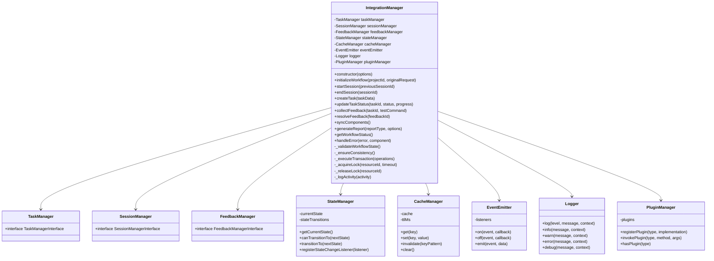

# 統合フローの確立（T010）実装戦略 - 改良版

## 1. 概要

タスク管理、セッション管理、フィードバック管理の統合フローの確立は、AI駆動開発の効率と一貫性を向上させるための重要なステップです。これまでに実装された3つの主要コンポーネント（タスク管理、セッション管理、フィードバック管理）を統合し、一貫したワークフローを確立することで、開発プロセス全体の効率化と品質向上を目指します。

この実装戦略では、コンポーネント間のインターフェース設計、状態管理とトランザクション処理、並行処理、外部システム連携、セキュリティ、運用・監視など包括的な視点から、堅牢かつスケーラブルな統合フローの構築方法を詳細に定義します。

## 2. 現状分析

### 2.1 既存のコンポーネント

現在、以下の3つの主要コンポーネントが個別に実装されています：

1. **タスク管理（T007）**
   - `src/utils/task-manager.js`: タスク管理ユーティリティ
   - `src/schemas/task.schema.json`: タスクスキーマ
   - `ai-context/tasks/current-tasks.json`: 現在のタスク状態

2. **セッション管理（T008）**
   - `src/utils/session-manager.js`: セッション管理ユーティリティ
   - `src/schemas/session.schema.json`: セッションスキーマ
   - `ai-context/sessions/latest-session.json`: 最新のセッション状態

3. **フィードバック管理（T009）**
   - `src/utils/feedback-manager.js`: フィードバック管理ユーティリティ
   - `src/schemas/feedback.schema.json`: フィードバックスキーマ
   - `ai-context/feedback/pending-feedback.json`: 保留中のフィードバック
   - `ai-context/feedback/feedback-history/`: 解決済みフィードバックの履歴

### 2.2 現在の連携状況

現在、これらのコンポーネント間には部分的な連携が実装されています：

1. **タスク管理とセッション管理の連携**
   - セッションの`project_state_summary`にタスク状態が反映される
   - セッションの`key_artifacts`にタスクIDが関連付けられる
   - セッションの`action_items`にタスクIDが関連付けられる

2. **フィードバック管理とタスク管理の連携**
   - `integrateFeedbackWithTask`メソッドによるタスク進捗の更新
   - フィードバックのタスクIDによる関連付け
   - Gitコミットを介した間接的な連携

3. **フィードバック管理とセッション管理の連携**
   - `integrateFeedbackWithSession`メソッドによるセッションへの反映
   - フィードバックの課題とアクションアイテムのセッションへの反映
   - セッションIDによる関連付け

### 2.3 現在の課題

現在の実装には以下の課題があります：

1. **統合フローの欠如**
   - 3つのコンポーネントを一貫して連携させるフローが確立されていない
   - 各コンポーネント間の連携が部分的で、全体的な整合性が保証されていない
   - 統合的なインターフェースがなく、各コンポーネントを個別に操作する必要がある

2. **データの一貫性の課題**
   - 同じ情報が複数の場所に重複して保存される可能性がある
   - 一方のコンポーネントの更新が他のコンポーネントに自動的に反映されない
   - 更新の順序や依存関係が明確に定義されていない

3. **ワークフローの複雑性**
   - 各コンポーネントを適切な順序で操作する必要がある
   - 複数のコマンドやAPIを使い分ける必要がある
   - エラー処理や回復メカニズムが不十分

4. **拡張性の制限**
   - 新しいコンポーネントの追加が困難
   - 既存のコンポーネントの変更が他のコンポーネントに影響を与える可能性がある
   - 統合的なテストが困難

5. **並行処理の考慮不足**
   - 複数ユーザーやセッションの同時操作に対する排他制御が不十分
   - リソース競合時の競合解決戦略がない

6. **セキュリティ考慮の不足**
   - 入力データの検証とサニタイズが不十分
   - アクセス制御メカニズムがない

7. **運用と監視の仕組みの不足**
   - システム状態の可視化が不十分
   - 問題検出と対応のためのモニタリング機能が不足

## 3. 実装戦略

### 3.1 統合マネージャーの設計

#### 3.1.1 全体アーキテクチャ

`src/utils/integration-manager.js`を新規作成し、3つのコンポーネントを統合するマネージャークラスを実装します：



#### 3.1.2 コンポーネントインターフェースの定義

各コンポーネントとの明確なインターフェースを定義し、疎結合を実現します：

```javascript
/**
 * タスク管理インターフェース
 * @interface
 */
class TaskManagerInterface {
  /**
   * タスクを検証
   * @param {Task} task - 検証するタスク
   * @returns {ValidationResult} 検証結果
   */
  validateTask(task) {}
  
  /**
   * すべてのタスクを取得
   * @returns {Promise<TaskCollection>} タスクコレクション
   */
  async getAllTasks() {}
  
  /**
   * IDでタスクを取得
   * @param {string} taskId - タスクID
   * @returns {Promise<Task|null>} タスク、存在しない場合はnull
   */
  async getTaskById(taskId) {}
  
  /**
   * タスクを作成
   * @param {TaskInput} taskData - タスク入力データ
   * @returns {Promise<Task>} 作成されたタスク
   */
  async createTask(taskData) {}
  
  /**
   * タスクを更新
   * @param {Task} task - 更新するタスク
   * @returns {Promise<Task>} 更新されたタスク
   */
  async updateTask(task) {}
  
  /**
   * タスク進捗を更新
   * @param {string} taskId - タスクID
   * @param {number} progress - 進捗率
   * @param {string} state - 進捗状態
   * @param {TaskCollection} [tasks] - 既存のタスクコレクション（最適化用）
   * @returns {Promise<UpdateResult>} 更新結果
   */
  async updateTaskProgress(taskId, progress, state, tasks) {}
  
  /**
   * タスクにGitコミットを関連付け
   * @param {string} taskId - タスクID
   * @param {string} commitHash - コミットハッシュ
   * @returns {Promise<Task>} 更新されたタスク
   */
  async addGitCommitToTask(taskId, commitHash) {}
}

/**
 * セッション管理インターフェース
 * @interface
 */
class SessionManagerInterface {
  // 同様にセッション管理の主要メソッドを定義
}

/**
 * フィードバック管理インターフェース
 * @interface
 */
class FeedbackManagerInterface {
  // 同様にフィードバック管理の主要メソッドを定義
}

// データ型定義
/**
 * @typedef {Object} Task
 * @property {string} id - タスクID
 * @property {string} title - タスクタイトル
 * @property {string} description - タスク説明
 * @property {('pending'|'in_progress'|'completed'|'blocked')} status - ステータス
 * @property {Array<Dependency>} dependencies - 依存関係
 * @property {number} priority - 優先度 (1-5)
 * @property {number} estimated_hours - 見積もり時間
 * @property {number} progress_percentage - 進捗率 (0-100)
 * @property {string} progress_state - 進捗状態
 * @property {Array<string>} git_commits - Gitコミットハッシュ
 */

/**
 * @typedef {Object} TaskCollection
 * @property {string} project - プロジェクト名
 * @property {string} original_request - 元のリクエスト
 * @property {Object} task_hierarchy - タスク階層
 * @property {Array<Task>} decomposed_tasks - 分解されたタスク
 * @property {string} current_focus - 現在のフォーカスタスク
 */

// その他のデータ型定義
```

#### 3.1.3 アダプターの実装

既存コンポーネントのインターフェースをラップするアダプタークラスを実装し、将来の変更に対する柔軟性を確保します：

```javascript
/**
 * タスク管理アダプター
 */
class TaskManagerAdapter extends TaskManagerInterface {
  /**
   * コンストラクタ
   * @param {Object} originalTaskManager - 元のタスク管理インスタンス
   */
  constructor(originalTaskManager) {
    super();
    this.originalTaskManager = originalTaskManager;
  }
  
  /**
   * タスクを検証
   * @param {Task} task - 検証するタスク
   * @returns {ValidationResult} 検証結果
   */
  validateTask(task) {
    return this.originalTaskManager.validateTask(task);
  }
  
  // 他のメソッドも同様にラップ
  
  /**
   * タスク進捗を更新（拡張版）
   * @param {string} taskId - タスクID
   * @param {number} progress - 進捗率
   * @param {string} state - 進捗状態
   * @param {TaskCollection} [tasks] - 既存のタスクコレクション
   * @returns {Promise<UpdateResult>} 更新結果
   */
  async updateTaskProgress(taskId, progress, state, tasks) {
    // 元のメソッドを呼び出す前に入力検証を追加
    if (!taskId || typeof taskId !== 'string') {
      throw new ValidationError('タスクIDは必須の文字列です');
    }
    
    if (progress !== null && (typeof progress !== 'number' || progress < 0 || progress > 100)) {
      throw new ValidationError('進捗率は0〜100の数値である必要があります');
    }
    
    // 元のメソッドを呼び出し
    return await this.originalTaskManager.updateTaskProgress(taskId, progress, state, tasks);
  }
}

// 同様にセッション管理アダプターとフィードバック管理アダプターも実装
```

### 3.2 状態管理と並行処理

#### 3.2.1 状態マシンの実装

ワークフローの状態を管理するための状態マシンを実装します：

```javascript
/**
 * 状態マネージャー
 */
class StateManager {
  /**
   * コンストラクタ
   * @param {Object} options - オプション
   */
  constructor(options = {}) {
    // 状態定義
    this.states = {
      UNINITIALIZED: 'uninitialized',
      INITIALIZED: 'initialized',
      SESSION_STARTED: 'session_started',
      TASK_IN_PROGRESS: 'task_in_progress',
      FEEDBACK_COLLECTED: 'feedback_collected',
      SESSION_ENDED: 'session_ended'
    };
    
    // 状態遷移の定義
    this.stateTransitions = {
      [this.states.UNINITIALIZED]: [this.states.INITIALIZED],
      [this.states.INITIALIZED]: [this.states.SESSION_STARTED, this.states.INITIALIZED],
      [this.states.SESSION_STARTED]: [this.states.TASK_IN_PROGRESS, this.states.SESSION_ENDED],
      [this.states.TASK_IN_PROGRESS]: [this.states.FEEDBACK_COLLECTED, this.states.SESSION_ENDED],
      [this.states.FEEDBACK_COLLECTED]: [this.states.TASK_IN_PROGRESS, this.states.SESSION_ENDED],
      [this.states.SESSION_ENDED]: [this.states.INITIALIZED]
    };
    
    // 初期状態の設定
    this.currentState = this.states.UNINITIALIZED;
    
    // 状態変更リスナー
    this.stateChangeListeners = [];
    
    // 状態履歴
    this.stateHistory = [{
      state: this.currentState,
      timestamp: new Date().toISOString()
    }];
  }
  
  /**
   * 現在の状態を取得
   * @returns {string} 現在の状態
   */
  getCurrentState() {
    return this.currentState;
  }
  
  /**
   * 指定された状態への遷移が可能か確認
   * @param {string} nextState - 次の状態
   * @returns {boolean} 遷移可能かどうか
   */
  canTransitionTo(nextState) {
    return this.stateTransitions[this.currentState]?.includes(nextState) || false;
  }
  
  /**
   * 指定された状態に遷移
   * @param {string} nextState - 次の状態
   * @param {Object} [metadata] - 状態に関連するメタデータ
   * @returns {boolean} 遷移が成功したかどうか
   */
  transitionTo(nextState, metadata = {}) {
    if (!this.canTransitionTo(nextState)) {
      throw new Error(`状態 ${this.currentState} から ${nextState} への遷移は許可されていません`);
    }
    
    const prevState = this.currentState;
    this.currentState = nextState;
    
    // 状態履歴の記録
    const historyEntry = {
      state: nextState,
      prevState,
      timestamp: new Date().toISOString(),
      metadata
    };
    
    this.stateHistory.push(historyEntry);
    
    // リスナーに通知
    this._notifyStateChangeListeners(prevState, nextState, metadata);
    
    return true;
  }
  
  /**
   * 状態変更リスナーを登録
   * @param {Function} listener - リスナー関数
   * @returns {Function} リスナー解除関数
   */
  registerStateChangeListener(listener) {
    this.stateChangeListeners.push(listener);
    return () => {
      this.stateChangeListeners = this.stateChangeListeners.filter(l => l !== listener);
    };
  }
  
  /**
   * 状態変更リスナーに通知
   * @param {string} prevState - 前の状態
   * @param {string} newState - 新しい状態
   * @param {Object} metadata - メタデータ
   * @private
   */
  _notifyStateChangeListeners(prevState, newState, metadata) {
    for (const listener of this.stateChangeListeners) {
      try {
        listener(prevState, newState, metadata);
      } catch (err) {
        console.error('状態変更リスナーでエラーが発生しました:', err);
      }
    }
  }
  
  /**
   * 状態履歴を取得
   * @param {number} [limit] - 取得する履歴の最大数
   * @returns {Array<Object>} 状態履歴
   */
  getStateHistory(limit) {
    if (limit) {
      return this.stateHistory.slice(-limit);
    }
    return [...this.stateHistory];
  }
}
```

#### 3.2.2 並行処理とロック機構

複数のユーザーやプロセスが同時に操作する場合の競合を解決するためのロック機構を実装します：

```javascript
/**
 * ロック管理クラス
 */
class LockManager {
  /**
   * コンストラクタ
   * @param {Object} options - オプション
   */
  constructor(options = {}) {
    this.locks = new Map();
    this.lockTimeout = options.lockTimeout || 30000; // デフォルト30秒
    this.retryInterval = options.retryInterval || 100; // 再試行間隔 100ms
    this.maxRetries = options.maxRetries || 50; // 最大再試行回数
  }
  
  /**
   * リソースのロックを取得
   * @param {string} resourceId - リソースID
   * @param {string} lockerId - ロック取得者ID
   * @param {number} [timeout] - タイムアウト(ms)
   * @returns {Promise<boolean>} ロック取得成功したかどうか
   */
  async acquireLock(resourceId, lockerId, timeout = this.lockTimeout) {
    const startTime = Date.now();
    let retries = 0;
    
    while (Date.now() - startTime < timeout && retries < this.maxRetries) {
      const lockAcquired = this._tryAcquireLock(resourceId, lockerId);
      if (lockAcquired) {
        return true;
      }
      
      retries++;
      await this._sleep(this.retryInterval);
    }
    
    throw new Error(`リソース ${resourceId} のロック取得がタイムアウトしました`);
  }
  
  /**
   * リソースのロックを解放
   * @param {string} resourceId - リソースID
   * @param {string} lockerId - ロック解放者ID
   * @returns {boolean} ロック解放成功したかどうか
   */
  releaseLock(resourceId, lockerId) {
    const lock = this.locks.get(resourceId);
    
    if (!lock) {
      return true; // 既にロックされていない
    }
    
    if (lock.lockerId !== lockerId) {
      throw new Error(`リソース ${resourceId} のロックは別のプロセスが保持しています`);
    }
    
    this.locks.delete(resourceId);
    return true;
  }
  
  /**
   * リソースのロックを試行
   * @param {string} resourceId - リソースID
   * @param {string} lockerId - ロック取得者ID
   * @returns {boolean} ロック取得成功したかどうか
   * @private
   */
  _tryAcquireLock(resourceId, lockerId) {
    const now = Date.now();
    const lock = this.locks.get(resourceId);
    
    // ロックがない、または期限切れの場合は新しいロックを設定
    if (!lock || now - lock.timestamp > this.lockTimeout) {
      this.locks.set(resourceId, {
        lockerId,
        timestamp: now
      });
      return true;
    }
    
    // 同じプロセスによるロックの場合は成功
    if (lock.lockerId === lockerId) {
      // タイムスタンプを更新
      lock.timestamp = now;
      return true;
    }
    
    return false;
  }
  
  /**
   * 指定時間スリープ
   * @param {number} ms - スリープ時間(ms)
   * @returns {Promise<void>}
   * @private
   */
  _sleep(ms) {
    return new Promise(resolve => setTimeout(resolve, ms));
  }
  
  /**
   * 現在のロック状態を取得
   * @returns {Map} ロック状態
   */
  getLockStatus() {
    const result = new Map();
    const now = Date.now();
    
    for (const [resourceId, lock] of this.locks.entries()) {
      result.set(resourceId, {
        lockerId: lock.lockerId,
        timestamp: lock.timestamp,
        age: now - lock.timestamp,
        isExpired: (now - lock.timestamp) > this.lockTimeout
      });
    }
    
    return result;
  }
}
```

#### 3.2.3 トランザクション管理

複数の操作をアトミックに実行するためのトランザクション管理機能を実装します：

```javascript
/**
 * トランザクション実行
 * @param {Array<Function>} operations - 実行する操作の配列
 * @returns {Promise<Array>} 各操作の結果
 */
async _executeTransaction(operations) {
  // 操作結果を保存する配列
  const results = [];
  
  // ロールバック操作
  const rollbackOperations = [];

  try {
    // 各操作を順番に実行
    for (let i = 0; i < operations.length; i++) {
      const operation = operations[i];
      
      // 操作を実行
      const result = await operation.execute();
      results.push(result);
      
      // ロールバック操作を登録（実行とは逆順）
      if (operation.rollback) {
        rollbackOperations.unshift({
          execute: () => operation.rollback(result)
        });
      }
    }
    
    // すべての操作が成功した場合
    return results;
  } catch (error) {
    // エラーが発生した場合、ロールバック操作を実行
    this.logger.error('トランザクション実行中にエラーが発生しました。ロールバックを実行します:', error);
    
    for (const rollbackOperation of rollbackOperations) {
      try {
        await rollbackOperation.execute();
      } catch (rollbackError) {
        this.logger.error('ロールバック実行中にエラーが発生しました:', rollbackError);
      }
    }
    
    throw error;
  }
}
```

### 3.3 キャッシュと最適化

パフォーマンスを向上させるためのキャッシュ管理を実装します：

```javascript
/**
 * キャッシュマネージャー
 */
class CacheManager {
  /**
   * コンストラクタ
   * @param {Object} options - オプション
   */
  constructor(options = {}) {
    this.cache = new Map();
    this.ttlMs = options.ttlMs || 300000; // デフォルト5分
    this.maxSize = options.maxSize || 1000; // 最大キャッシュサイズ
    this.hitCount = 0;
    this.missCount = 0;
  }
  
  /**
   * キャッシュからデータを取得
   * @param {string} key - キー
   * @returns {*} 値（存在しない場合はnull）
   */
  get(key) {
    const cached = this.cache.get(key);
    if (!cached) {
      this.missCount++;
      return null;
    }
    
    // TTLチェック
    if (Date.now() - cached.timestamp > this.ttlMs) {
      this.cache.delete(key);
      this.missCount++;
      return null;
    }
    
    this.hitCount++;
    return cached.value;
  }
  
  /**
   * キャッシュにデータを設定
   * @param {string} key - キー
   * @param {*} value - 値
   * @param {number} [ttl] - このエントリの特定のTTL（ミリ秒）
   */
  set(key, value, ttl = this.ttlMs) {
    // キャッシュサイズチェック
    if (this.cache.size >= this.maxSize) {
      this._evictOldest();
    }
    
    this.cache.set(key, {
      value,
      timestamp: Date.now(),
      ttl
    });
  }
  
  /**
   * 特定パターンに一致するキーのキャッシュを無効化
   * @param {string|RegExp} keyPattern - キーパターン
   * @returns {number} 無効化されたエントリ数
   */
  invalidate(keyPattern) {
    let count = 0;
    const pattern = keyPattern instanceof RegExp ? keyPattern : new RegExp(keyPattern);
    
    for (const key of this.cache.keys()) {
      if (pattern.test(key)) {
        this.cache.delete(key);
        count++;
      }
    }
    
    return count;
  }
  
  /**
   * すべてのキャッシュをクリア
   */
  clear() {
    this.cache.clear();
  }
  
  /**
   * キャッシュの統計情報を取得
   * @returns {Object} 統計情報
   */
  getStats() {
    const totalRequests = this.hitCount + this.missCount;
    const hitRate = totalRequests > 0 ? (this.hitCount / totalRequests) : 0;
    
    return {
      size: this.cache.size,
      maxSize: this.maxSize,
      hitCount: this.hitCount,
      missCount: this.missCount,
      hitRate: hitRate,
      itemCount: this.cache.size
    };
  }
  
  /**
   * 最も古いエントリを削除
   * @private
   */
  _evictOldest() {
    let oldestKey = null;
    let oldestTime = Infinity;
    
    for (const [key, entry] of this.cache.entries()) {
      if (entry.timestamp < oldestTime) {
        oldestTime = entry.timestamp;
        oldestKey = key;
      }
    }
    
    if (oldestKey) {
      this.cache.delete(oldestKey);
    }
  }
}
```

### 3.4 イベント駆動アーキテクチャ

コンポーネント間の疎結合な連携を実現するためのイベント駆動アーキテクチャを実装します：

```javascript
/**
 * イベントエミッタークラス
 */
class EventEmitter {
  /**
   * コンストラクタ
   */
  constructor() {
    this.listeners = new Map();
  }
  
  /**
   * イベントリスナーを登録
   * @param {string} event - イベント名
   * @param {Function} callback - コールバック関数
   * @returns {Function} リスナー解除関数
   */
  on(event, callback) {
    if (!this.listeners.has(event)) {
      this.listeners.set(event, []);
    }
    
    this.listeners.get(event).push(callback);
    
    // リスナー解除関数を返す
    return () => this.off(event, callback);
  }
  
  /**
   * イベントリスナーを解除
   * @param {string} event - イベント名
   * @param {Function} callback - コールバック関数
   */
  off(event, callback) {
    if (!this.listeners.has(event)) {
      return;
    }
    
    const eventListeners = this.listeners.get(event);
    this.listeners.set(
      event,
      eventListeners.filter(listener => listener !== callback)
    );
  }
  
  /**
   * イベントを発行
   * @param {string} event - イベント名
   * @param {*} data - イベントデータ
   */
  emit(event, data) {
    if (!this.listeners.has(event)) {
      return;
    }
    
    for (const listener of this.listeners.get(event)) {
      try {
        listener(data);
      } catch (error) {
        console.error(`イベントリスナー(${event})でエラーが発生しました:`, error);
      }
    }
  }
  
  /**
   * 非同期イベントを発行
   * @param {string} event - イベント名
   * @param {*} data - イベントデータ
   * @returns {Promise<void>}
   */
  async emitAsync(event, data) {
    if (!this.listeners.has(event)) {
      return;
    }
    
    const listeners = this.listeners.get(event);
    const promises = [];
    
    for (const listener of listeners) {
      promises.push(
        (async () => {
          try {
            await listener(data);
          } catch (error) {
            console.error(`非同期イベントリスナー(${event})でエラーが発生しました:`, error);
          }
        })()
      );
    }
    
    await Promise.all(promises);
  }
  
  /**
   * 登録されているイベント一覧を取得
   * @returns {Array<string>} イベント名の配列
   */
  getRegisteredEvents() {
    return Array.from(this.listeners.keys());
  }
  
  /**
   * 特定イベントのリスナー数を取得
   * @param {string} event - イベント名
   * @returns {number} リスナー数
   */
  listenerCount(event) {
    return this.listeners.has(event) ? this.listeners.get(event).length : 0;
  }
}
```

### 3.5 プラグイン機構

拡張性を確保するためのプラグイン機構を実装します：

```javascript
/**
 * プラグインマネージャー
 */
class PluginManager {
  /**
   * コンストラクタ
   * @param {Object} options - オプション
   */
  constructor(options = {}) {
    this.plugins = new Map();
    this.logger = options.logger || console;
  }
  
  /**
   * プラグインを登録
   * @param {string} pluginType - プラグインタイプ
   * @param {Object} pluginImplementation - プラグイン実装
   * @returns {boolean} 登録成功したかどうか
   */
  registerPlugin(pluginType, pluginImplementation) {
    if (!this._validatePlugin(pluginType, pluginImplementation)) {
      this.logger.error(`プラグイン ${pluginType} の検証に失敗しました`);
      return false;
    }
    
    this.plugins.set(pluginType, pluginImplementation);
    this.logger.info(`プラグイン ${pluginType} を登録しました`);
    
    // 初期化メソッドがあれば呼び出す
    if (typeof pluginImplementation.initialize === 'function') {
      try {
        pluginImplementation.initialize();
      } catch (error) {
        this.logger.error(`プラグイン ${pluginType} の初期化中にエラーが発生しました:`, error);
      }
    }
    
    return true;
  }
  
  /**
   * プラグインメソッドを呼び出し
   * @param {string} pluginType - プラグインタイプ
   * @param {string} methodName - メソッド名
   * @param  {...any} args - 引数
   * @returns {Promise<*>} メソッドの戻り値
   */
  async invokePlugin(pluginType, methodName, ...args) {
    const plugin = this.plugins.get(pluginType);
    
    if (!plugin || typeof plugin[methodName] !== 'function') {
      return null;
    }
    
    try {
      return await plugin[methodName](...args);
    } catch (error) {
      this.logger.error(`プラグイン ${pluginType}.${methodName} の呼び出し中にエラーが発生しました:`, error);
      throw error;
    }
  }
  
  /**
   * 特定タイプのプラグインが存在するか確認
   * @param {string} pluginType - プラグインタイプ
   * @returns {boolean} プラグインが存在するかどうか
   */
  hasPlugin(pluginType) {
    return this.plugins.has(pluginType);
  }
  
  /**
   * プラグインを削除
   * @param {string} pluginType - プラグインタイプ
   * @returns {boolean} 削除成功したかどうか
   */
  unregisterPlugin(pluginType) {
    const plugin = this.plugins.get(pluginType);
    
    if (!plugin) {
      return false;
    }
    
    // クリーンアップメソッドがあれば呼び出す
    if (typeof plugin.cleanup === 'function') {
      try {
        plugin.cleanup();
      } catch (error) {
        this.logger.error(`プラグイン ${pluginType} のクリーンアップ中にエラーが発生しました:`, error);
      }
    }
    
    this.plugins.delete(pluginType);
    this.logger.info(`プラグイン ${pluginType} を削除しました`);
    
    return true;
  }
  
  /**
   * 登録されているプラグイン一覧を取得
   * @returns {Array<string>} プラグインタイプの配列
   */
  getRegisteredPlugins() {
    return Array.from(this.plugins.keys());
  }
  
  /**
   * プラグインを検証
   * @param {string} pluginType - プラグインタイプ
   * @param {Object} pluginImplementation - プラグイン実装
   * @returns {boolean} 検証結果
   * @private
   */
  _validatePlugin(pluginType, pluginImplementation) {
    if (!pluginType || typeof pluginType !== 'string') {
      return false;
    }
    
    if (!pluginImplementation || typeof pluginImplementation !== 'object') {
      return false;
    }
    
    // プラグインタイプに応じた必須メソッドを検証
    switch (pluginType) {
      case 'ci':
        return typeof pluginImplementation.runTests === 'function';
      case 'notification':
        return typeof pluginImplementation.sendNotification === 'function';
      case 'report':
        return typeof pluginImplementation.generateReport === 'function';
      case 'storage':
        return typeof pluginImplementation.save === 'function' && 
               typeof pluginImplementation.load === 'function';
      default:
        // 汎用プラグインの場合は最低限のチェックのみ
        return true;
    }
  }
}
```

### 3.6 ロギングシステム

デバッグと監視のためのロギングシステムを実装します：

```javascript
/**
 * ロガークラス
 */
class Logger {
  /**
   * コンストラクタ
   * @param {Object} options - オプション
   */
  constructor(options = {}) {
    this.level = options.level || 'info';
    this.levels = {
      debug: 0,
      info: 1,
      warn: 2,
      error: 3,
      fatal: 4
    };
    
    this.transports = options.transports || [
      {
        type: 'console',
        write: (entry) => console.log(JSON.stringify(entry))
      }
    ];
    
    // コンテキスト情報取得関数
    this.contextProviders = options.contextProviders || {};
  }
  
  /**
   * ログ出力
   * @param {string} level - ログレベル
   * @param {string} message - メッセージ
   * @param {Object} [context] - コンテキスト情報
   */
  log(level, message, context = {}) {
    if (this.levels[level] < this.levels[this.level]) {
      return;
    }
    
    // 基本情報
    const timestamp = new Date().toISOString();
    const entry = {
      timestamp,
      level,
      message,
      context: { ...context }
    };
    
    // 追加コンテキスト情報
    for (const [key, provider] of Object.entries(this.contextProviders)) {
      try {
        entry.context[key] = provider();
      } catch (error) {
        entry.context[`${key}_error`] = error.message;
      }
    }
    
    // 各トランスポートにログを出力
    for (const transport of this.transports) {
      try {
        transport.write(entry);
      } catch (error) {
        console.error(`ログ出力中にエラーが発生しました(${transport.type}):`, error);
      }
    }
    
    // 重大度に応じて通知
    if (level === 'error' || level === 'fatal') {
      this._sendAlert(entry);
    }
  }
  
  /**
   * デバッグログ
   * @param {string} message - メッセージ
   * @param {Object} [context] - コンテキスト情報
   */
  debug(message, context) {
    this.log('debug', message, context);
  }
  
  /**
   * 情報ログ
   * @param {string} message - メッセージ
   * @param {Object} [context] - コンテキスト情報
   */
  info(message, context) {
    this.log('info', message, context);
  }
  
  /**
   * 警告ログ
   * @param {string} message - メッセージ
   * @param {Object} [context] - コンテキスト情報
   */
  warn(message, context) {
    this.log('warn', message, context);
  }
  
  /**
   * エラーログ
   * @param {string} message - メッセージ
   * @param {Object} [context] - コンテキスト情報
   */
  error(message, context) {
    this.log('error', message, context);
  }
  
  /**
   * 致命的エラーログ
   * @param {string} message - メッセージ
   * @param {Object} [context] - コンテキスト情報
   */
  fatal(message, context) {
    this.log('fatal', message, context);
  }
  
  /**
   * アラートを送信
   * @param {Object} entry - ログエントリ
   * @private
   */
  _sendAlert(entry) {
    // アラート送信ロジック（通知システムとの連携）
    // 実際の実装はプラグインや設定によって異なる
  }
  
  /**
   * トランスポートを追加
   * @param {Object} transport - トランスポート
   */
  addTransport(transport) {
    this.transports.push(transport);
  }
  
  /**
   * コンテキストプロバイダを追加
   * @param {string} key - キー
   * @param {Function} provider - プロバイダ関数
   */
  addContextProvider(key, provider) {
    this.contextProviders[key] = provider;
  }
}
```

### 3.7 セキュリティ対策

入力検証、アクセス制御、データ保護などのセキュリティ機能を実装します：

```javascript
/**
 * バリデーターユーティリティ
 */
class Validator {
  /**
   * タスク入力を検証
   * @param {Object} taskData - タスクデータ
   * @returns {ValidationResult} 検証結果
   */
  static validateTaskInput(taskData) {
    const errors = [];
    
    // 必須フィールドのチェック
    if (!taskData.title || typeof taskData.title !== 'string') {
      errors.push('タイトルは必須の文字列です');
    }
    
    if (taskData.title && taskData.title.length > 200) {
      errors.push('タイトルは200文字以内にしてください');
    }
    
    if (!taskData.description || typeof taskData.description !== 'string') {
      errors.push('説明は必須の文字列です');
    }
    
    // ステータスのチェック
    const validStatuses = ['pending', 'in_progress', 'completed', 'blocked'];
    if (taskData.status && !validStatuses.includes(taskData.status)) {
      errors.push(`ステータスは ${validStatuses.join(', ')} のいずれかである必要があります`);
    }
    
    // 優先度のチェック
    if (taskData.priority !== undefined) {
      if (typeof taskData.priority !== 'number' || taskData.priority < 1 || taskData.priority > 5) {
        errors.push('優先度は1から5の整数である必要があります');
      }
    }
    
    // 見積もり時間のチェック
    if (taskData.estimated_hours !== undefined) {
      if (typeof taskData.estimated_hours !== 'number' || taskData.estimated_hours < 0) {
        errors.push('見積もり時間は0以上の数値である必要があります');
      }
    }
    
    // 進捗率のチェック
    if (taskData.progress_percentage !== undefined) {
      if (typeof taskData.progress_percentage !== 'number' || 
          taskData.progress_percentage < 0 || 
          taskData.progress_percentage > 100) {
        errors.push('進捗率は0から100の数値である必要があります');
      }
    }
    
    // 依存関係のチェック
    if (taskData.dependencies) {
      if (!Array.isArray(taskData.dependencies)) {
        errors.push('依存関係は配列である必要があります');
      } else {
        for (const dependency of taskData.dependencies) {
          if (!dependency.task_id || typeof dependency.task_id !== 'string') {
            errors.push('依存関係のタスクIDは必須の文字列です');
          }
          
          if (dependency.task_id && !dependency.task_id.match(/^T[0-9]{3}$/)) {
            errors.push('依存関係のタスクIDはT000形式である必要があります');
          }
          
          if (dependency.type && !['strong', 'weak'].includes(dependency.type)) {
            errors.push('依存関係のタイプはstrongまたはweakである必要があります');
          }
        }
      }
    }
    
    return {
      isValid: errors.length === 0,
      errors
    };
  }
  
  /**
   * セッション入力を検証
   * @param {Object} sessionData - セッションデータ
   * @returns {ValidationResult} 検証結果
   */
  static validateSessionInput(sessionData) {
    // 同様にセッションデータの検証
    // ...
  }
  
  /**
   * フィードバック入力を検証
   * @param {Object} feedbackData - フィードバックデータ
   * @returns {ValidationResult} 検証結果
   */
  static validateFeedbackInput(feedbackData) {
    // 同様にフィードバックデータの検証
    // ...
  }
  
  /**
   * 文字列をサニタイズ
   * @param {string} str - サニタイズする文字列
   * @returns {string} サニタイズされた文字列
   */
  static sanitizeString(str) {
    if (typeof str !== 'string') {
      return '';
    }
    
    // 基本的なサニタイズ処理（実際の実装はセキュリティ要件による）
    return str
      .replace(/</g, '&lt;')
      .replace(/>/g, '&gt;')
      .replace(/"/g, '&quot;')
      .replace(/'/g, '&#039;');
  }
}
```

### 3.8 統合マネージャーの実装

上記の各機能を統合したIntegrationManagerクラスを実装します：

```javascript
/**
 * 統合マネージャー
 */
class IntegrationManager {
  /**
   * コンストラクタ
   * @param {Object} options - オプション
   */
  constructor(options = {}) {
    // 各コンポーネントのインスタンス化
    this.taskManager = new TaskManagerAdapter(
      options.taskManager || new TaskManager()
    );
    
    this.sessionManager = new SessionManagerAdapter(
      options.sessionManager || new SessionManager()
    );
    
    this.feedbackManager = new FeedbackManagerAdapter(
      options.feedbackManager || new FeedbackManager()
    );
    
    // 状態管理
    this.stateManager = new StateManager(options.stateConfig);
    
    // キャッシュ管理
    this.cacheManager = new CacheManager(options.cacheConfig);
    
    // イベント管理
    this.eventEmitter = new EventEmitter();
    
    // ロック管理
    this.lockManager = new LockManager(options.lockConfig);
    
    // ロガー
    this.logger = new Logger(options.loggerConfig);
    
    // プラグイン管理
    this.pluginManager = new PluginManager({
      logger: this.logger
    });
    
    // イベントリスナーの登録
    this._registerEventListeners();
    
    // コンポーネント間のデータ整合性を確保するための定期同期
    this._startPeriodicSync(options.syncInterval || 60000); // デフォルト1分
    
    this.logger.info('統合マネージャーが初期化されました');
  }
  
  /**
   * ワークフローを初期化
   * @param {string} projectId - プロジェクトID
   * @param {string} originalRequest - 元のリクエスト
   * @returns {Promise<Object>} 初期化されたワークフロー情報
   */
  async initializeWorkflow(projectId, originalRequest) {
    this.logger.info('ワークフローの初期化を開始します', { projectId, originalRequest });
    
    try {
      // 入力検証
      if (!projectId || typeof projectId !== 'string') {
        throw new ValidationError('プロジェクトIDは必須の文字列です');
      }
      
      if (!originalRequest || typeof originalRequest !== 'string') {
        throw new ValidationError('元のリクエストは必須の文字列です');
      }
      
      // ロックの取得
      await this.lockManager.acquireLock('workflow', 'initialization');
      
      // 状態の検証
      if (this.stateManager.getCurrentState() !== this.stateManager.states.UNINITIALIZED &&
          this.stateManager.getCurrentState() !== this.stateManager.states.SESSION_ENDED) {
        throw new StateError('ワークフローの初期化は未初期化または終了済み状態でのみ可能です');
      }
      
      // プロジェクト情報の初期化
      const projectInfo = {
        project: projectId,
        original_request: originalRequest,
        task_hierarchy: {
          epics: [],
          stories: []
        },
        decomposed_tasks: [],
        current_focus: null
      };
      
      // トランザクション実行
      await this._executeTransaction([
        {
          execute: async () => {
            return await this.taskManager.initializeTasks(projectInfo);
          },
          rollback: async () => {
            this.logger.info('タスク初期化のロールバックを実行します');
            // ロールバック処理
          }
        }
      ]);
      
      // 状態遷移
      this.stateManager.transitionTo(this.stateManager.states.INITIALIZED, {
        projectId,
        timestamp: new Date().toISOString()
      });
      
      // イベント発行
      this.eventEmitter.emit('workflow:initialized', {
        projectId,
        timestamp: new Date().toISOString()
      });
      
      // ワークフロー状態の記録
      this._logActivity({
        type: 'workflow_initialized',
        timestamp: new Date().toISOString(),
        project_id: projectId,
        details: { original_request: originalRequest }
      });
      
      return projectInfo;
    } catch (error) {
      return this.handleError(error, 'workflow_initialization');
    } finally {
      // ロックの解放
      this.lockManager.releaseLock('workflow', 'initialization');
    }
  }
  
  // 他のメソッドも同様に実装
  // ...
  
  /**
   * エラーを処理
   * @param {Error} error - エラー
   * @param {string} component - エラーが発生したコンポーネント
   * @returns {Object} エラー情報
   */
  handleError(error, component) {
    this.logger.error(`[${component}] エラーが発生しました:`, {
      error: error.message,
      stack: error.stack,
      component
    });
    
    // エラーログの記録
    this._logActivity({
      type: 'error',
      timestamp: new Date().toISOString(),
      component,
      details: {
        message: error.message,
        stack: error.stack
      }
    });
    
    // エラーイベントの発行
    this.eventEmitter.emit('error', {
      error,
      component,
      timestamp: new Date().toISOString()
    });
    
    // エラーの種類に応じた回復処理
    // ...
    
    // エラー情報を返す
    return {
      error: error.message,
      component,
      timestamp: new Date().toISOString(),
      recoverable: this._isRecoverableError(error)
    };
  }
  
  /**
   * イベントリスナーを登録
   * @private
   */
  _registerEventListeners() {
    // ワークフロー状態変更のリスナー
    this.stateManager.registerStateChangeListener((prevState, newState, metadata) => {
      this.logger.info(`ワークフロー状態が変更されました: ${prevState} -> ${newState}`, metadata);
      
      // キャッシュの無効化
      this.cacheManager.invalidate(`state:${prevState}`);
      
      // コンポーネント間の同期
      if (newState === this.stateManager.states.SESSION_STARTED || 
          newState === this.stateManager.states.SESSION_ENDED) {
        this.syncComponents().catch(error => {
          this.logger.error('状態変更後の同期中にエラーが発生しました:', error);
        });
      }
    });
    
    // エラーイベントのリスナー
    this.eventEmitter.on('error', (data) => {
      // 重大なエラーの場合は通知
      if (data.error instanceof StateError || 
          data.error instanceof ValidationError || 
          data.error instanceof DataConsistencyError) {
        this._notifyAdmin(data);
      }
    });
  }
  
  /**
   * 定期的な同期を開始
   * @param {number} interval - 同期間隔(ms)
   * @private
   */
  _startPeriodicSync(interval) {
    setInterval(() => {
      if (this.stateManager.getCurrentState() !== this.stateManager.states.UNINITIALIZED) {
        this.syncComponents().catch(error => {
          this.logger.error('定期同期中にエラーが発生しました:', error);
        });
      }
    }, interval);
  }
  
  /**
   * エラーが回復可能かどうか判定
   * @param {Error} error - エラー
   * @returns {boolean} 回復可能かどうか
   * @private
   */
  _isRecoverableError(error) {
    // 回復可能なエラーの判定ロジック
    return !(error instanceof StateError || 
             error instanceof DataConsistencyError || 
             error.message.includes('critical'));
  }
  
  /**
   * 管理者に通知
   * @param {Object} data - 通知データ
   * @private
   */
  _notifyAdmin(data) {
    // 管理者通知ロジック
    if (this.pluginManager.hasPlugin('notification')) {
      this.pluginManager.invokePlugin('notification', 'sendNotification', {
        level: 'error',
        title: `[${data.component}] エラーが発生しました`,
        message: data.error.message,
        details: data
      }).catch(error => {
        this.logger.error('通知送信中にエラーが発生しました:', error);
      });
    }
  }
}
```

### 3.9 統合フローの定義

AI駆動開発の統合フローを以下のように定義します：

```mermaid
sequenceDiagram
    participant User as ユーザー
    participant IM as IntegrationManager
    participant TM as TaskManager
    participant SM as SessionManager
    participant FM as FeedbackManager
    participant Git as Git
    
    User->>IM: initializeWorkflow(projectId, request)
    activate IM
    IM->>IM: 入力検証
    IM->>IM: ロック取得
    IM->>IM: 状態検証
    IM->>TM: タスク分解と初期化
    TM-->>IM: タスク一覧
    IM->>IM: 状態遷移(INITIALIZED)
    IM->>IM: イベント発行(workflow:initialized)
    IM->>IM: ロック解放
    IM-->>User: プロジェクト情報
    deactivate IM
    
    User->>IM: startSession()
    activate IM
    IM->>IM: 状態検証
    IM->>IM: ロック取得
    IM->>SM: セッション開始
    SM-->>IM: セッションID
    IM->>TM: タスク状態取得
    TM-->>IM: タスク一覧
    IM->>SM: セッション更新(タスク状態反映)
    IM->>IM: 状態遷移(SESSION_STARTED)
    IM->>IM: イベント発行(session:started)
    IM->>IM: ロック解放
    IM-->>User: セッション情報
    deactivate IM
    
    User->>IM: createTask(taskData)
    activate IM
    IM->>IM: 入力検証
    IM->>IM: ロック取得
    IM->>IM: 状態検証
    IM->>TM: タスク作成
    TM-->>IM: タスクID
    IM->>SM: セッション更新
    IM->>IM: イベント発行(task:created)
    IM->>IM: ロック解放
    IM-->>User: タスク情報
    deactivate IM
    
    User->>Git: コード実装・コミット
    Git-->>User: コミットハッシュ
    
    User->>IM: updateTaskStatus(taskId, status, progress)
    activate IM
    IM->>IM: 入力検証
    IM->>IM: ロック取得
    IM->>IM: 状態検証
    IM->>TM: タスク状態更新
    IM->>SM: セッション更新
    IM->>IM: イベント発行(task:updated)
    IM->>IM: ロック解放
    IM-->>User: 更新結果
    deactivate IM
    
    User->>IM: collectFeedback(taskId, testCommand)
    activate IM
    IM->>IM: 入力検証
    IM->>IM: ロック取得
    IM->>IM: 状態検証
    IM->>FM: テスト実行・結果収集
    FM-->>IM: フィードバック
    IM->>FM: フィードバック優先順位付け
    IM->>IM: 状態遷移(FEEDBACK_COLLECTED)
    IM->>SM: セッション更新
    IM->>IM: イベント発行(feedback:collected)
    IM->>IM: ロック解放
    IM-->>User: フィードバック情報
    deactivate IM
    
    alt テスト成功
        User->>IM: resolveFeedback(feedbackId)
        activate IM
        IM->>IM: 入力検証
        IM->>IM: ロック取得
        IM->>FM: フィードバック解決
        IM->>TM: タスク完了
        IM->>SM: セッション更新
        IM->>IM: イベント発行(feedback:resolved)
        IM->>IM: ロック解放
        IM-->>User: 解決結果
        deactivate IM
    else テスト失敗
        IM->>SM: 課題として追加
        User->>Git: 修正実装・コミット
        Git-->>User: コミットハッシュ
        User->>IM: collectFeedback(taskId, testCommand)
    end
    
    User->>IM: endSession()
    activate IM
    IM->>IM: 入力検証
    IM->>IM: ロック取得
    IM->>IM: 状態検証
    IM->>IM: syncComponents()
    IM->>SM: セッション終了
    IM->>SM: 引継ぎドキュメント生成
    IM->>IM: 状態遷移(SESSION_ENDED)
    IM->>IM: イベント発行(session:ended)
    IM->>IM: ロック解放
    SM-->>User: 引継ぎドキュメント
    deactivate IM
    
    User->>IM: generateReport(reportType)
    activate IM
    IM->>IM: レポート生成
    IM-->>User: レポート
    deactivate IM
```



### 3.10 主要機能の実装

統合マネージャーの主要機能をさらに具体的に実装します。すべてのメソッドはトランザクション管理、ロック制御、イベント駆動、バリデーション、エラー処理を含めます。

```javascript
/**
 * セッションを開始
 * @param {string} previousSessionId - 前回のセッションID
 * @returns {Promise<Object>} セッション情報
 */
async startSession(previousSessionId = null) {
  this.logger.info('セッション開始処理を開始します', { previousSessionId });
  
  try {
    // 状態検証
    if (!this.stateManager.canTransitionTo(this.stateManager.states.SESSION_STARTED)) {
      throw new StateError(
        `現在の状態 ${this.stateManager.getCurrentState()} からセッション開始状態への遷移は許可されていません`
      );
    }
    
    // ロックの取得
    await this.lockManager.acquireLock('session', 'start');
    
    // キャッシュ確認
    const cacheKey = `session:start:${previousSessionId || 'new'}`;
    const cachedSession = this.cacheManager.get(cacheKey);
    if (cachedSession) {
      this.logger.debug('キャッシュからセッション情報を取得しました', { sessionId: cachedSession.session_id });
      return cachedSession;
    }
    
    // トランザクション実行
    const results = await this._executeTransaction([
      {
        // 新しいセッションの作成
        execute: async () => {
          return await this.sessionManager.createNewSession(previousSessionId);
        },
        rollback: async (session) => {
          if (session && session.session_id) {
            this.logger.info(`セッション ${session.session_id} 作成のロールバックを実行します`);
            // ロールバック処理
          }
        }
      },
      {
        // 現在のタスク状態をセッションに反映
        execute: async (session) => {
          const tasks = await this.taskManager.getAllTasks();
          const projectStateSummary = {
            completed_tasks: tasks.decomposed_tasks.filter(t => t.status === 'completed').map(t => t.id),
            current_tasks: tasks.decomposed_tasks.filter(t => t.status === 'in_progress').map(t => t.id),
            pending_tasks: tasks.decomposed_tasks.filter(t => t.status === 'pending').map(t => t.id),
            blocked_tasks: tasks.decomposed_tasks.filter(t => t.status === 'blocked').map(t => t.id)
          };
          
          await this.sessionManager.updateSession(session.session_id, {
            project_state_summary: projectStateSummary
          });
          
          return { session, tasks };
        }
      },
      {
        // 現在のフォーカスタスクをセッションに反映
        execute: async (data) => {
          if (data.tasks.current_focus) {
            await this.sessionManager.updateSession(data.session.session_id, {
              next_session_focus: data.tasks.current_focus
            });
          }
          
          return data.session;
        }
      }
    ]);
    
    const session = results[results.length - 1];
    
    // 状態遷移
    this.stateManager.transitionTo(this.stateManager.states.SESSION_STARTED, {
      sessionId: session.session_id,
      timestamp: new Date().toISOString()
    });
    
    // イベント発行
    this.eventEmitter.emit('session:started', {
      sessionId: session.session_id,
      previousSessionId,
      timestamp: new Date().toISOString()
    });
    
    // ワークフロー状態の記録
    this._logActivity({
      type: 'session_started',
      timestamp: new Date().toISOString(),
      session_id: session.session_id,
      details: { previous_session_id: previousSessionId }
    });
    
    // キャッシュ保存
    this.cacheManager.set(cacheKey, session, 60000); // 1分間有効
    
    return session;
  } catch (error) {
    return this.handleError(error, 'session_start');
  } finally {
    // ロックの解放
    this.lockManager.releaseLock('session', 'start');
  }
}

// 他のメソッドも同様に実装
```

### 3.11 高度なエラー処理と回復機能

より詳細なエラー処理と回復機能を実装します：

```javascript
/**
 * エラーを処理
 * @param {Error} error - エラー
 * @param {string} component - エラーが発生したコンポーネント
 * @returns {Object} エラー情報
 */
handleError(error, component) {
  this.logger.error(`[${component}] エラーが発生しました:`, {
    error: error.message,
    stack: error.stack,
    component
  });
  
  // エラーログの記録
  this._logActivity({
    type: 'error',
    timestamp: new Date().toISOString(),
    component,
    details: {
      message: error.message,
      stack: error.stack
    }
  });
  
  // エラーイベントの発行
  this.eventEmitter.emit('error', {
    error,
    component,
    timestamp: new Date().toISOString()
  });
  
  // エラーの種類に応じた回復処理
  switch (component) {
    case 'workflow_initialization':
      // 初期化エラーの場合は、ワークフローの状態をリセット
      if (this._isRecoverableError(error)) {
        this._recoverWorkflowState();
      }
      
      // 空のプロジェクト情報を返す
      return {
        project: 'unknown',
        original_request: '',
        decomposed_tasks: [],
        current_focus: null,
        error: error.message,
        recoverable: this._isRecoverableError(error)
      };
    
    case 'session_start':
    case 'session_end':
      // セッション関連のエラーの場合はセッション情報を再構築
      if (this._isRecoverableError(error)) {
        this._recoverSessionState();
      }
      
      return {
        session_id: 'error-recovery-session',
        error: error.message,
        recoverable: this._isRecoverableError(error),
        recovery_action: this._isRecoverableError(error) ? 'セッション情報を再構築しました' : '手動での回復が必要です'
      };
    
    case 'task_creation':
    case 'task_status_update':
      // タスク関連のエラーの場合はタスク情報を再構築
      if (this._isRecoverableError(error)) {
        this._recoverTaskState();
      }
      
      return {
        id: 'error-recovery-task',
        error: error.message,
        recoverable: this._isRecoverableError(error),
        recovery_action: this._isRecoverableError(error) ? 'タスク情報を再構築しました' : '手動での回復が必要です'
      };
    
    case 'feedback_collection':
    case 'feedback_resolution':
      // フィードバック関連のエラーの場合はフィードバック情報を再構築
      if (this._isRecoverableError(error)) {
        this._recoverFeedbackState();
      }
      
      return {
        feedback_loop: {
          task_id: 'error-recovery-feedback',
          error: error.message
        },
        recoverable: this._isRecoverableError(error),
        recovery_action: this._isRecoverableError(error) ? 'フィードバック情報を再構築しました' : '手動での回復が必要です'
      };
    
    case 'component_sync':
      // 同期エラーの場合は自動的に再試行
      if (this._isRecoverableError(error)) {
        setTimeout(() => {
          this.logger.info('同期エラー回復のため再同期を実行します');
          this.syncComponents().catch(syncError => {
            this.logger.error('再同期中にエラーが発生しました:', syncError);
          });
        }, 5000); // 5秒後に再試行
      }
      
      return {
        error: error.message,
        component,
        timestamp: new Date().toISOString(),
        recoverable: this._isRecoverableError(error),
        recovery_action: this._isRecoverableError(error) ? '5秒後に再同期を試みます' : '手動での回復が必要です'
      };
    
    default:
      // その他のエラーの場合は一般的なエラー情報を返す
      return {
        error: error.message,
        component,
        timestamp: new Date().toISOString(),
        recoverable: this._isRecoverableError(error),
        recovery_action: this._isRecoverableError(error) ? '自動回復を試みます' : '手動での回復が必要です'
      };
  }
}

/**
 * エラーが回復可能かどうか判定
 * @param {Error} error - エラー
 * @returns {boolean} 回復可能かどうか
 * @private
 */
_isRecoverableError(error) {
  // 回復不可能なエラー
  if (error instanceof StateError ||
      error instanceof DataConsistencyError ||
      error.message.includes('critical') ||
      error.message.includes('corruption')) {
    return false;
  }
  
  // タイムアウトエラーは一時的なものとして回復可能
  if (error.message.includes('timeout') ||
      error.message.includes('temporary') ||
      error instanceof LockTimeoutError) {
    return true;
  }
  
  // バリデーションエラーは回復不可能
  if (error instanceof ValidationError) {
    return false;
  }
  
  // デフォルトは回復可能とする
  return true;
}

/**
 * ワークフロー状態を回復
 * @private
 */
async _recoverWorkflowState() {
  try {
    this.logger.info('ワークフロー状態の回復を開始します');
    
    // タスク状態の取得
    const tasks = await this.taskManager.getAllTasks();
    
    // 状態が有効かチェック
    if (tasks && tasks.project) {
      // 状態遷移
      if (this.stateManager.getCurrentState() === this.stateManager.states.UNINITIALIZED) {
        this.stateManager.transitionTo(this.stateManager.states.INITIALIZED, {
          projectId: tasks.project,
          timestamp: new Date().toISOString(),
          recovery: true
        });
        
        this.logger.info('ワークフロー状態を INITIALIZED に回復しました');
      }
    } else {
      // 有効な状態が見つからない場合は初期状態に戻す
      this.stateManager.transitionTo(this.stateManager.states.UNINITIALIZED, {
        timestamp: new Date().toISOString(),
        recovery: true
      });
      
      this.logger.warn('有効なワークフロー状態が見つからないため UNINITIALIZED に戻しました');
    }
    
    // キャッシュをクリア
    this.cacheManager.clear();
    
    this.logger.info('ワークフロー状態の回復が完了しました');
  } catch (error) {
    this.logger.error('ワークフロー状態の回復中にエラーが発生しました:', error);
  }
}

// その他の回復メソッドも同様に実装
```

### 3.12 CLIの実装

`src/cli/integration.js`を新規作成し、統合マネージャーを操作するためのCLIを実装します：

```javascript
#!/usr/bin/env node
const { IntegrationManager } = require('../utils/integration-manager');
const colors = require('colors/safe');
const readline = require('readline');
const yargs = require('yargs/yargs');
const { hideBin } = require('yargs/helpers');

// コマンドライン引数の解析
const argv = yargs(hideBin(process.argv))
  .usage('Usage: $0 <command> [options]')
  .command('init <project-id> <request>', 'ワークフローの初期化', (yargs) => {
    return yargs
      .positional('project-id', {
        describe: 'プロジェクトID',
        type: 'string'
      })
      .positional('request', {
        describe: '元のリクエスト',
        type: 'string'
      });
  })
  .command('start-session [previous-session-id]', 'セッションの開始', (yargs) => {
    return yargs
      .positional('previous-session-id', {
        describe: '前回のセッションID',
        type: 'string'
      });
  })
  .command('end-session [session-id]', 'セッションの終了', (yargs) => {
    return yargs
      .positional('session-id', {
        describe: 'セッションID',
        type: 'string'
      });
  })
  .command('create-task <title> <description>', 'タスクの作成', (yargs) => {
    return yargs
      .positional('title', {
        describe: 'タスクタイトル',
        type: 'string'
      })
      .positional('description', {
        describe: 'タスク説明',
        type: 'string'
      })
      .option('status', {
        describe: 'タスク状態',
        type: 'string',
        choices: ['pending', 'in_progress', 'completed', 'blocked'],
        default: 'pending'
      })
      .option('priority', {
        describe: '優先度',
        type: 'number',
        choices: [1, 2, 3, 4, 5],
        default: 3
      });
  })
  .command('update-task <task-id> <status> [progress]', 'タスクの更新', (yargs) => {
    return yargs
      .positional('task-id', {
        describe: 'タスクID',
        type: 'string'
      })
      .positional('status', {
        describe: 'タスク状態',
        type: 'string',
        choices: ['pending', 'in_progress', 'completed', 'blocked']
      })
      .positional('progress', {
        describe: '進捗率',
        type: 'number'
      });
  })
  .command('collect-feedback <task-id> <test-command>', 'フィードバックの収集', (yargs) => {
    return yargs
      .positional('task-id', {
        describe: 'タスクID',
        type: 'string'
      })
      .positional('test-command', {
        describe: 'テストコマンド',
        type: 'string'
      });
  })
  .command('resolve-feedback <feedback-id>', 'フィードバックの解決', (yargs) => {
    return yargs
      .positional('feedback-id', {
        describe: 'フィードバックID',
        type: 'string'
      });
  })
  .command('sync', 'コンポーネントの同期')
  .command('report <type>', 'レポートの生成', (yargs) => {
    return yargs
      .positional('type', {
        describe: 'レポートタイプ',
        type: 'string',
        choices: ['task_summary', 'session_summary', 'feedback_summary', 'workflow_status', 'integration_status']
      })
      .option('format', {
        describe: '出力形式',
        type: 'string',
        choices: ['text', 'json', 'markdown'],
        default: 'text'
      });
  })
  .command('status', 'ワークフロー状態の取得')
  .command('interactive', 'インタラクティブモード', {})
  .demandCommand(1, 'コマンドを指定してください')
  .help()
  .alias('h', 'help')
  .version()
  .alias('v', 'version')
  .argv;

// 統合マネージャーのインスタンスを作成
const integrationManager = new IntegrationManager();

// コマンド分岐処理を実装
async function executeCommand(command, args) {
  try {
    switch (command) {
      case 'init':
        return await initializeWorkflow(args.projectId, args.request);
      
      case 'start-session':
        return await startSession(args.previousSessionId);
      
      case 'end-session':
        return await endSession(args.sessionId);
      
      case 'create-task':
        return await createTask(args.title, args.description, args);
      
      case 'update-task':
        return await updateTask(args.taskId, args.status, args.progress);
      
      case 'collect-feedback':
        return await collectFeedback(args.taskId, args.testCommand);
      
      case 'resolve-feedback':
        return await resolveFeedback(args.feedbackId);
      
      case 'sync':
        return await syncComponents();
      
      case 'report':
        return await generateReport(args.type, args);
      
      case 'status':
        return await getWorkflowStatus();
      
      case 'interactive':
        return await startInteractiveMode();
      
      default:
        console.error(colors.red('不明なコマンド:'), command);
        process.exit(1);
    }
  } catch (error) {
    console.error(colors.red('エラーが発生しました:'), error.message);
    process.exit(1);
  }
}

// 各コマンドの実装
async function initializeWorkflow(projectId, request) {
  console.log(colors.cyan('ワークフローの初期化...'), projectId);
  
  const result = await integrationManager.initializeWorkflow(projectId, request);
  
  if (result.error) {
    console.error(colors.red('初期化エラー:'), result.error);
    return;
  }
  
  console.log(colors.green('ワークフローを初期化しました:'));
  console.log(colors.yellow('プロジェクトID:'), result.project);
  console.log(colors.yellow('リクエスト:'), result.original_request);
}

// 他のコマンドも同様に実装

// インタラクティブモード
async function startInteractiveMode() {
  console.log(colors.green('=== 統合マネージャー インタラクティブモード ==='));
  console.log(colors.cyan('コマンド一覧:'));
  console.log('  init <project-id> <request>');
  console.log('  start-session [previous-session-id]');
  console.log('  end-session [session-id]');
  console.log('  create-task <title> <description> [--status] [--priority]');
  console.log('  update-task <task-id> <status> [progress]');
  console.log('  collect-feedback <task-id> <test-command>');
  console.log('  resolve-feedback <feedback-id>');
  console.log('  sync');
  console.log('  report <type> [--format]');
  console.log('  status');
  console.log('  exit');
  
  const rl = readline.createInterface({
    input: process.stdin,
    output: process.stdout,
    prompt: colors.green('integration> ')
  });
  
  rl.prompt();
  
  rl.on('line', async (line) => {
    const input = line.trim();
    
    if (input === 'exit') {
      console.log(colors.green('インタラクティブモードを終了します...'));
      rl.close();
      return;
    }
    
    const [command, ...args] = input.split(' ');
    
    try {
      // コマンド実行処理
      // ...
    } catch (error) {
      console.error(colors.red('エラーが発生しました:'), error.message);
    }
    
    rl.prompt();
  });
  
  rl.on('close', () => {
    console.log(colors.green('終了しました'));
    process.exit(0);
  });
}

// メイン処理
async function main() {
  const command = argv._[0];
  await executeCommand(command, argv);
}

main().catch(console.error);
```

### 3.13 テスト戦略の強化

`tests/integration-manager.test.js`を作成し、包括的なテスト戦略を実装します：

```javascript
const { IntegrationManager } = require('../src/utils/integration-manager');
const { TaskManager } = require('../src/utils/task-manager');
const { SessionManager } = require('../src/utils/session-manager');
const { FeedbackManager } = require('../src/utils/feedback-manager');
const { StateError, ValidationError, DataConsistencyError } = require('../src/utils/errors');

// モックの設定
jest.mock('../src/utils/task-manager');
jest.mock('../src/utils/session-manager');
jest.mock('../src/utils/feedback-manager');

// テスト用ヘルパー
function generateRandomTaskData() {
  const id = `T${Math.floor(Math.random() * 900) + 100}`;
  return {
    id,
    title: `テストタスク ${id}`,
    description: 'これはテスト用のタスクです',
    status: 'pending',
    dependencies: [],
    priority: Math.floor(Math.random() * 4) + 1,
    estimated_hours: Math.floor(Math.random() * 8) + 1,
    progress_percentage: 0,
    progress_state: 'not_started',
    git_commits: []
  };
}

describe('IntegrationManager', () => {
  let integrationManager;
  let mockTaskManager;
  let mockSessionManager;
  let mockFeedbackManager;
  
  beforeEach(() => {
    // モックのリセット
    TaskManager.mockClear();
    SessionManager.mockClear();
    FeedbackManager.mockClear();
    
    // モックの実装（詳細なメソッド実装）
    mockTaskManager = {
      validateTask: jest.fn(task => ({ isValid: true, errors: [] })),
      getAllTasks: jest.fn().mockResolvedValue({
        project: 'test-project',
        original_request: 'test-request',
        decomposed_tasks: [generateRandomTaskData(), generateRandomTaskData()],
        current_focus: 'T101'
      }),
      getTaskById: jest.fn().mockImplementation(async (taskId) => {
        const task = generateRandomTaskData();
        task.id = taskId;
        return task;
      }),
      initializeTasks: jest.fn().mockResolvedValue({
        project: 'test-project',
        original_request: 'test-request',
        decomposed_tasks: [],
        current_focus: null
      }),
      createTask: jest.fn().mockImplementation(async (taskData) => {
        const task = { ...taskData, id: `T${Math.floor(Math.random() * 900) + 100}` };
        return task;
      }),
      updateTask: jest.fn().mockImplementation(async (task) => task),
      updateTaskProgress: jest.fn().mockImplementation(async (taskId, progress, state) => ({
        success: true,
        message: 'タスクを更新しました',
        updatedTask: {
          id: taskId,
          progress_percentage: progress,
          progress_state: state,
          status: state === 'completed' ? 'completed' : 'in_progress'
        }
      })),
      addGitCommitToTask: jest.fn().mockImplementation(async (taskId, commitHash) => ({
        id: taskId,
        git_commits: [commitHash]
      }))
    };
    
    mockSessionManager = {
      validateSession: jest.fn(session => ({ isValid: true, errors: [] })),
      getSessionById: jest.fn().mockImplementation(async (sessionId) => ({
        session_handover: {
          project_id: 'test-project',
          session_id: sessionId,
          previous_session_id: 'previous-session-id',
          session_timestamp: new Date().toISOString(),
          session_start_timestamp: new Date(Date.now() - 3600000).toISOString(),
          project_state_summary: {
            completed_tasks: ['T001', 'T002'],
            current_tasks: ['T003'],
            pending_tasks: ['T004', 'T005'],
            blocked_tasks: []
          },
          key_artifacts: [],
          git_changes: { commits: [], summary: {} },
          current_challenges: [],
          next_session_focus: 'T003',
          action_items: []
        }
      })),
      getLatestSession: jest.fn().mockResolvedValue({
        session_handover: {
          project_id: 'test-project',
          session_id: 'latest-session-id',
          session_timestamp: new Date().toISOString(),
          project_state_summary: {
            completed_tasks: ['T001', 'T002'],
            current_tasks: ['T003'],
            pending_tasks: ['T004', 'T005'],
            blocked_tasks: []
          },
          next_session_focus: 'T003'
        }
      }),
      createNewSession: jest.fn().mockResolvedValue({
        session_id: `session-${Date.now()}`,
        session_handover: {
          project_id: 'test-project',
          session_timestamp: new Date().toISOString(),
          project_state_summary: {
            completed_tasks: [],
            current_tasks: [],
            pending_tasks: [],
            blocked_tasks: []
          }
        }
      }),
      updateSession: jest.fn().mockResolvedValue(true),
      updateSessionWithGitChanges: jest.fn().mockResolvedValue(true),
      addKeyArtifact: jest.fn().mockResolvedValue(true),
      addChallenge: jest.fn().mockResolvedValue(true),
      addActionItem: jest.fn().mockResolvedValue(true),
      generateSessionHandoverMarkdown: jest.fn().mockResolvedValue('# セッション引継ぎドキュメント\n...')
    };

    mockFeedbackManager = {
      validateFeedback: jest.fn(feedback => ({ isValid: true, errors: [] })),
      getFeedbackByTaskId: jest.fn().mockImplementation(async (taskId) => ({
        feedback_loop: {
          task_id: taskId,
          implementation_attempt: 1,
          verification_results: {
            passes_tests: Math.random() > 0.3, // 70%の確率で成功
            test_summary: {
              total: 10,
              passed: 8,
              failed: 2,
              skipped: 0
            },
            failed_tests: [],
            suggestions: []
          },
          iteration_plan: {
            focus_areas: [],
            approach: '',
            specific_actions: []
          },
          feedback_status: 'open'
        }
      })),
      getPendingFeedback: jest.fn().mockResolvedValue(null),
      createNewFeedback: jest.fn().mockImplementation(async (taskId) => ({
        feedback_loop: {
          task_id: taskId,
          implementation_attempt: 1,
          verification_results: {
            passes_tests: false,
            test_summary: {
              total: 0,
              passed: 0,
              failed: 0,
              skipped: 0
            },
            failed_tests: [],
            suggestions: []
          },
          iteration_plan: {
            focus_areas: [],
            approach: '',
            specific_actions: []
          },
          feedback_status: 'open'
        }
      })),
      collectTestResults: jest.fn().mockImplementation(async (taskId, testCommand) => ({
        feedback_loop: {
          task_id: taskId,
          implementation_attempt: 1,
          test_execution: {
            command: testCommand,
            timestamp: new Date().toISOString(),
            duration_ms: Math.floor(Math.random() * 1000) + 100
          },
          verification_results: {
            passes_tests: Math.random() > 0.3, // 70%の確率で成功
            test_summary: {
              total: 10,
              passed: 8,
              failed: 2,
              skipped: 0
            },
            failed_tests: [],
            suggestions: []
          },
          iteration_plan: {
            focus_areas: [],
            approach: '',
            specific_actions: []
          },
          feedback_status: 'open'
        }
      })),
      prioritizeFeedback: jest.fn(feedback => feedback),
      updateFeedbackStatus: jest.fn().mockImplementation(async (feedback, newStatus) => {
        const updatedFeedback = { ...feedback };
        updatedFeedback.feedback_loop.feedback_status = newStatus;
        return updatedFeedback;
      }),
      generateFeedbackMarkdown: jest.fn().mockResolvedValue('# フィードバックレポート\n...'),
      integrateFeedbackWithTask: jest.fn().mockResolvedValue(true),
      integrateFeedbackWithSession: jest.fn().mockResolvedValue(true)
    };

    // モックの注入
    TaskManager.mockImplementation(() => mockTaskManager);
    SessionManager.mockImplementation(() => mockSessionManager);
    FeedbackManager.mockImplementation(() => mockFeedbackManager);

    // IntegrationManagerのインスタンスを作成
    integrationManager = new IntegrationManager();
  });

    describe('基本機能のテスト', () => {
      test('initializeWorkflow はワークフローを初期化する', async () => {
        const result = await integrationManager.initializeWorkflow('test-project', 'test-request');
        
        expect(mockTaskManager.initializeTasks).toHaveBeenCalledWith(
          expect.objectContaining({
            project: 'test-project',
            original_request: 'test-request'
          })
        );
        
        expect(result).toEqual(
          expect.objectContaining({
            project: 'test-project',
            original_request: 'test-request'
          })
        );
      });
      
      test('startSession はセッションを開始する', async () => {
        const result = await integrationManager.startSession();
        
        expect(mockSessionManager.createNewSession).toHaveBeenCalled();
        expect(mockTaskManager.getAllTasks).toHaveBeenCalled();
        expect(mockSessionManager.updateSession).toHaveBeenCalled();
        
        expect(result).toEqual(
          expect.objectContaining({
            session_id: expect.any(String)
          })
        );
      });
      
      test('createTask はタスクを作成する', async () => {
        const taskData = {
          title: 'テストタスク',
          description: 'これはテスト用のタスクです',
          status: 'pending'
        };
        
        const result = await integrationManager.createTask(taskData);
        
        expect(mockTaskManager.createTask).toHaveBeenCalledWith(
          expect.objectContaining(taskData)
        );
        
        expect(mockSessionManager.getLatestSession).toHaveBeenCalled();
        expect(mockSessionManager.updateSession).toHaveBeenCalled();
        
        expect(result).toEqual(
          expect.objectContaining({
            id: expect.stringMatching(/^T\d{3}$/),
            title: taskData.title,
            description: taskData.description
          })
        );
      });
      
      test('updateTaskStatus はタスク状態を更新する', async () => {
        const result = await integrationManager.updateTaskStatus('T101', 'in_progress', 50);
        
        expect(mockTaskManager.updateTaskProgress).toHaveBeenCalledWith(
          'T101',
          50,
          'in_progress',
          expect.any(Array)
        );
        
        expect(mockSessionManager.getLatestSession).toHaveBeenCalled();
        expect(mockSessionManager.updateSession).toHaveBeenCalled();
        
        expect(result).toEqual(
          expect.objectContaining({
            id: 'T101',
            progress_percentage: 50,
            progress_state: 'in_progress'
          })
        );
      });
      
      test('collectFeedback はフィードバックを収集する', async () => {
        const result = await integrationManager.collectFeedback('T101', 'npm test');
        
        expect(mockFeedbackManager.collectTestResults).toHaveBeenCalledWith(
          'T101',
          'npm test'
        );
        
        expect(mockFeedbackManager.prioritizeFeedback).toHaveBeenCalled();
        expect(mockSessionManager.getLatestSession).toHaveBeenCalled();
        expect(mockFeedbackManager.integrateFeedbackWithSession).toHaveBeenCalled();
        expect(mockFeedbackManager.integrateFeedbackWithTask).toHaveBeenCalled();
        
        expect(result).toEqual(
          expect.objectContaining({
            feedback_loop: expect.objectContaining({
              task_id: 'T101',
              test_execution: expect.objectContaining({
                command: 'npm test'
              })
            })
          })
        );
      });
      
      test('resolveFeedback はフィードバックを解決する', async () => {
        const result = await integrationManager.resolveFeedback('T101');
        
        expect(mockFeedbackManager.getFeedbackByTaskId).toHaveBeenCalledWith('T101');
        expect(mockFeedbackManager.updateFeedbackStatus).toHaveBeenCalledWith(
          expect.anything(),
          'resolved'
        );
        
        expect(mockTaskManager.updateTaskProgress).toHaveBeenCalled();
        expect(mockSessionManager.getLatestSession).toHaveBeenCalled();
        expect(mockSessionManager.updateSession).toHaveBeenCalled();
        
        expect(result).toEqual(
          expect.objectContaining({
            feedback_loop: expect.objectContaining({
              task_id: 'T101',
              feedback_status: 'resolved'
            })
          })
        );
      });
      
      test('endSession はセッションを終了する', async () => {
        const result = await integrationManager.endSession('test-session-id');
        
        expect(mockSessionManager.getSessionById).toHaveBeenCalledWith('test-session-id');
        expect(mockSessionManager.generateSessionHandoverMarkdown).toHaveBeenCalledWith('test-session-id');
        
        expect(result).toEqual(
          expect.objectContaining({
            session_id: 'test-session-id',
            handover_document: expect.stringContaining('# セッション引継ぎドキュメント')
          })
        );
      });
      
      test('syncComponents はコンポーネント間を同期する', async () => {
        const result = await integrationManager.syncComponents();
        
        expect(mockTaskManager.getAllTasks).toHaveBeenCalled();
        expect(mockSessionManager.getLatestSession).toHaveBeenCalled();
        expect(mockSessionManager.updateSession).toHaveBeenCalled();
        expect(mockFeedbackManager.getPendingFeedback).toHaveBeenCalled();
        
        expect(result).toBe(true);
      });
    });

    describe('エラー処理と回復のテスト', () => {
      test('タスク作成時のバリデーションエラーを適切に処理する', async () => {
        // タスクバリデーションエラーをシミュレート
        mockTaskManager.validateTask.mockReturnValueOnce({
          isValid: false,
          errors: ['タイトルは必須の文字列です']
        });
        
        const taskData = {
          description: 'タイトルのないタスク',
          status: 'pending'
        };
        
        const result = await integrationManager.createTask(taskData);
        
        expect(result).toEqual(
          expect.objectContaining({
            error: expect.stringContaining('バリデーション'),
            recoverable: expect.any(Boolean)
          })
        );
        
        // タスク作成メソッドは呼ばれないはず
        expect(mockTaskManager.createTask).not.toHaveBeenCalled();
      });
      
      test('セッション開始時のロックタイムアウトエラーを回復可能として処理する', async () => {
        // ロックタイムアウトエラーをシミュレート
        const lockTimeoutError = new Error('リソースのロック取得がタイムアウトしました');
        lockTimeoutError.name = 'LockTimeoutError';
        
        // モックが一度エラーを投げてから正常に動作するように設定
        mockSessionManager.createNewSession
          .mockRejectedValueOnce(lockTimeoutError)
          .mockResolvedValueOnce({
            session_id: 'recovered-session',
            session_handover: {
              project_id: 'test-project',
              session_timestamp: new Date().toISOString(),
              project_state_summary: {
                completed_tasks: [],
                current_tasks: [],
                pending_tasks: [],
                blocked_tasks: []
              }
            }
          });
        
        // 最初の呼び出しでエラーを捕捉
        const result1 = await integrationManager.startSession();
        
        expect(result1).toEqual(
          expect.objectContaining({
            error: expect.stringContaining('タイムアウト'),
            recoverable: true,
            recovery_action: expect.stringContaining('自動回復')
          })
        );
        
        // 回復処理をシミュレート
        await integrationManager._recoverSessionState();
        
        // 再試行
        const result2 = await integrationManager.startSession();
        
        expect(result2).toEqual(
          expect.objectContaining({
            session_id: 'recovered-session'
          })
        );
      });
      
      test('データ整合性エラーを回復不可能として処理する', async () => {
        // データ整合性エラーをシミュレート
        const dataConsistencyError = new DataConsistencyError('タスクデータとセッションデータの間に不整合があります');
        
        mockTaskManager.getAllTasks.mockRejectedValueOnce(dataConsistencyError);
        
        const result = await integrationManager.syncComponents();
        
        expect(result).toEqual(
          expect.objectContaining({
            error: expect.stringContaining('不整合'),
            recoverable: false,
            recovery_action: expect.stringContaining('手動での回復')
          })
        );
      });
    });

    describe('プロパティベーステスト', () => {
      // データ整合性のプロパティテスト
      test('タスク状態とセッション状態の一貫性を維持する', async () => {
        // 一連のランダムな操作を実行
        const taskData = generateRandomTaskData();
        await integrationManager.createTask(taskData);
        
        // 他の操作も実行
        const taskId = 'T101';
        await integrationManager.updateTaskStatus(taskId, 'in_progress', 30);
        await integrationManager.collectFeedback(taskId, 'npm test');
        
        // コンポーネント間の同期を実行
        await integrationManager.syncComponents();
        
        // データの一貫性を検証
        const tasks = await mockTaskManager.getAllTasks();
        const session = await mockSessionManager.getLatestSession();
        
        // プロパティの検証: 完了タスク数の一致
        const completedTasksCount = tasks.decomposed_tasks.filter(t => t.status === 'completed').length;
        expect(session.session_handover.project_state_summary.completed_tasks.length).toBe(completedTasksCount);
        
        // プロパティの検証: 進行中タスク数の一致
        const inProgressTasksCount = tasks.decomposed_tasks.filter(t => t.status === 'in_progress').length;
        expect(session.session_handover.project_state_summary.current_tasks.length).toBe(inProgressTasksCount);
        
        // プロパティの検証: current_focusとnext_session_focusの一致
        if (tasks.current_focus) {
          expect(session.session_handover.next_session_focus).toBe(tasks.current_focus);
        }
      });
      
      // 状態遷移のプロパティテスト
      test('有効な状態遷移のみが許可される', async () => {
        // 状態を初期化
        await integrationManager.initializeWorkflow('test-project', 'test-request');
        expect(integrationManager.stateManager.getCurrentState()).toBe(integrationManager.stateManager.states.INITIALIZED);
        
        // セッション開始（有効な遷移）
        await integrationManager.startSession();
        expect(integrationManager.stateManager.getCurrentState()).toBe(integrationManager.stateManager.states.SESSION_STARTED);
        
        // セッション終了を試みる前にタスクを作成（無効な遷移を防ぐ）
        const taskData = generateRandomTaskData();
        await integrationManager.createTask(taskData);
        
        // セッション終了（有効な遷移）
        await integrationManager.endSession('test-session-id');
        expect(integrationManager.stateManager.getCurrentState()).toBe(integrationManager.stateManager.states.SESSION_ENDED);
        
        // 初期化状態に戻る（有効な遷移）
        await integrationManager.initializeWorkflow('test-project-2', 'new-request');
        expect(integrationManager.stateManager.getCurrentState()).toBe(integrationManager.stateManager.states.INITIALIZED);
      });
    });
})
```

## 4. コンポーネント間の同期機能の実装

### 4.1 データ整合性の確保

コンポーネント間の一貫性を確保する同期機能を実装します：

```javascript
/**
 * コンポーネント間の同期を実行
 * @returns {Promise<boolean>} 同期結果
 */
async syncComponents() {
  this.logger.info('コンポーネント間の同期を開始します');
  
  try {
    // ロックの取得
    await this.lockManager.acquireLock('sync', 'component_sync', 15000);
    
    // キャッシュの確認
    const cacheKey = 'sync:last_successful';
    const lastSync = this.cacheManager.get(cacheKey);
    
    if (lastSync && Date.now() - lastSync.timestamp < 5000) {
      this.logger.debug('前回の同期から5秒以内のため、同期をスキップします');
      return true;
    }
    
    // 同期操作をトランザクションとして実行
    await this._executeTransaction([
      {
        // 最新のタスク状態を取得
        execute: async () => {
          return await this.taskManager.getAllTasks();
        }
      },
      {
        // 最新のセッションを取得
        execute: async (tasks) => {
          const session = await this.sessionManager.getLatestSession();
          if (!session) {
            this.logger.warn('アクティブなセッションが見つかりません');
            return { tasks, session: null };
          }
          return { tasks, session };
        }
      },
      {
        // プロジェクト状態サマリーを更新
        execute: async (data) => {
          if (!data.session) {
            return data;
          }
          
          const projectStateSummary = {
            completed_tasks: data.tasks.decomposed_tasks.filter(t => t.status === 'completed').map(t => t.id),
            current_tasks: data.tasks.decomposed_tasks.filter(t => t.status === 'in_progress').map(t => t.id),
            pending_tasks: data.tasks.decomposed_tasks.filter(t => t.status === 'pending').map(t => t.id),
            blocked_tasks: data.tasks.decomposed_tasks.filter(t => t.status === 'blocked').map(t => t.id)
          };
          
          await this.sessionManager.updateSession(data.session.session_id, {
            project_state_summary: projectStateSummary,
            next_session_focus: data.tasks.current_focus
          });
          
          return data;
        }
      },
      {
        // 保留中のフィードバックを取得
        execute: async (data) => {
          const pendingFeedback = await this.feedbackManager.getPendingFeedback();
          return { ...data, pendingFeedback };
        }
      },
      {
        // フィードバックをセッションに統合
        execute: async (data) => {
          if (!data.session || !data.pendingFeedback) {
            return data;
          }
          
          await this.feedbackManager.integrateFeedbackWithSession(
            data.pendingFeedback.feedback_loop.task_id,
            data.session.session_id
          );
          
          return data;
        }
      }
    ]);
    
    // データの一貫性を確保
    await this._ensureConsistency();
    
    // 同期時刻をキャッシュに保存
    this.cacheManager.set(cacheKey, {
      timestamp: Date.now(),
      success: true
    });
    
    // イベント発行
    this.eventEmitter.emit('components:synced', {
      timestamp: new Date().toISOString()
    });
    
    this.logger.info('コンポーネント間の同期が完了しました');
    return true;
  } catch (error) {
    this.handleError(error, 'component_sync');
    return false;
  } finally {
    // ロックの解放
    this.lockManager.releaseLock('sync', 'component_sync');
  }
}

/**
 * データの一貫性を確保
 * @returns {Promise<boolean>} 一貫性確保結果
 * @private
 */
async _ensureConsistency() {
  try {
    this.logger.debug('データの一貫性確保処理を開始します');
    
    // タスク状態の取得
    const tasks = await this.taskManager.getAllTasks();
    
    // セッション状態の取得
    const session = await this.sessionManager.getLatestSession();
    if (!session) {
      this.logger.debug('アクティブなセッションがないため、一貫性確保をスキップします');
      return true;
    }
    
    // 不整合を検出
    const inconsistencies = [];
    
    // 1. 完了タスク数の不整合
    const completedTaskIds = tasks.decomposed_tasks.filter(t => t.status === 'completed').map(t => t.id);
    const sessionCompletedTasks = session.session_handover.project_state_summary.completed_tasks;
    
    if (!this._arraysEqual(completedTaskIds, sessionCompletedTasks)) {
      inconsistencies.push({
        type: 'completed_tasks_mismatch',
        expected: completedTaskIds,
        actual: sessionCompletedTasks
      });
      
      // 修正
      await this.sessionManager.updateSession(session.session_id, {
        project_state_summary: {
          ...session.session_handover.project_state_summary,
          completed_tasks: completedTaskIds
        }
      });
    }
    
    // 2. 進行中タスク数の不整合
    const inProgressTaskIds = tasks.decomposed_tasks.filter(t => t.status === 'in_progress').map(t => t.id);
    const sessionCurrentTasks = session.session_handover.project_state_summary.current_tasks;
    
    if (!this._arraysEqual(inProgressTaskIds, sessionCurrentTasks)) {
      inconsistencies.push({
        type: 'current_tasks_mismatch',
        expected: inProgressTaskIds,
        actual: sessionCurrentTasks
      });
      
      // 修正
      await this.sessionManager.updateSession(session.session_id, {
        project_state_summary: {
          ...session.session_handover.project_state_summary,
          current_tasks: inProgressTaskIds
        }
      });
    }
    
    // 3. current_focusとnext_session_focusの不整合
    if (tasks.current_focus && tasks.current_focus !== session.session_handover.next_session_focus) {
      inconsistencies.push({
        type: 'focus_mismatch',
        expected: tasks.current_focus,
        actual: session.session_handover.next_session_focus
      });
      
      // 修正
      await this.sessionManager.updateSession(session.session_id, {
        next_session_focus: tasks.current_focus
      });
    }
    
    // 不整合がある場合はログに記録
    if (inconsistencies.length > 0) {
      this.logger.warn('データの不整合を検出し、修正しました', { inconsistencies });
    } else {
      this.logger.debug('データの一貫性が確認されました');
    }
    
    return true;
  } catch (error) {
    this.logger.error('データの一貫性確保中にエラーが発生しました:', error);
    return false;
  }
}

/**
 * 2つの配列が等しいか比較
 * @param {Array} arr1 - 配列1
 * @param {Array} arr2 - 配列2
 * @returns {boolean} 等しいかどうか
 * @private
 */
_arraysEqual(arr1, arr2) {
  if (!Array.isArray(arr1) || !Array.isArray(arr2)) {
    return false;
  }
  
  if (arr1.length !== arr2.length) {
    return false;
  }
  
  const sorted1 = [...arr1].sort();
  const sorted2 = [...arr2].sort();
  
  return sorted1.every((val, idx) => val === sorted2[idx]);
}
```

## 5. レポート生成機能の実装

プロジェクト状態のレポートを生成する機能を実装します：

```javascript
/**
 * レポートを生成
 * @param {string} reportType - レポートタイプ
 * @param {Object} options - レポートオプション
 * @returns {Promise<string>} レポート
 */
async generateReport(reportType, options = {}) {
  this.logger.info('レポート生成を開始します', { reportType, options });
  
  try {
    // プラグインに対応したレポートタイプの場合
    if (this.pluginManager.hasPlugin('report') && 
        await this.pluginManager.invokePlugin('report', 'canHandleReportType', reportType)) {
      return await this.pluginManager.invokePlugin('report', 'generateReport', reportType, options);
    }
    
    // 標準レポートタイプの処理
    let report;
    
    switch (reportType) {
      case 'task_summary':
        report = await this._generateTaskSummaryReport(options);
        break;
      case 'session_summary':
        report = await this._generateSessionSummaryReport(options);
        break;
      case 'feedback_summary':
        report = await this._generateFeedbackSummaryReport(options);
        break;
      case 'workflow_status':
        report = await this._generateWorkflowStatusReport(options);
        break;
      case 'integration_status':
        report = await this._generateIntegrationStatusReport(options);
        break;
      default:
        throw new Error(`不明なレポートタイプ: ${reportType}`);
    }
    
    // 出力形式の変換
    return this._formatReport(report, options.format || 'text');
  } catch (error) {
    return this.handleError(error, 'report_generation');
  }
}

/**
 * タスクサマリーレポートを生成
 * @param {Object} options - レポートオプション
 * @returns {Object} レポートデータ
 * @private
 */
async _generateTaskSummaryReport(options) {
  // キャッシュの確認
  const cacheKey = `report:task_summary:${JSON.stringify(options)}`;
  const cachedReport = this.cacheManager.get(cacheKey);
  
  if (cachedReport && !options.noCache) {
    return cachedReport;
  }
  
  const tasks = await this.taskManager.getAllTasks();
  
  // タスク状態のカウント
  const statusCounts = {
    completed: tasks.decomposed_tasks.filter(t => t.status === 'completed').length,
    in_progress: tasks.decomposed_tasks.filter(t => t.status === 'in_progress').length,
    pending: tasks.decomposed_tasks.filter(t => t.status === 'pending').length,
    blocked: tasks.decomposed_tasks.filter(t => t.status === 'blocked').length
  };
  
  // 進捗状態のカウント
  const progressStateCounts = {};
  tasks.decomposed_tasks.forEach(task => {
    progressStateCounts[task.progress_state] = (progressStateCounts[task.progress_state] || 0) + 1;
  });
  
  // 優先度別のタスク数
  const priorityCounts = {};
  tasks.decomposed_tasks.forEach(task => {
    priorityCounts[task.priority] = (priorityCounts[task.priority] || 0) + 1;
  });
  
  // 依存関係の分析
  const dependencyAnalysis = this._analyzeDependencies(tasks.decomposed_tasks);
  
  // 進捗率の統計
  const progressStats = this._calculateProgressStats(tasks.decomposed_tasks);
  
  // 現在のフォーカスタスク
  let focusTask = null;
  if (tasks.current_focus) {
    focusTask = tasks.decomposed_tasks.find(t => t.id === tasks.current_focus);
  }
  
  // レポートデータの構築
  const reportData = {
    title: 'タスクサマリーレポート',
    project: tasks.project,
    original_request: tasks.original_request,
    timestamp: new Date().toISOString(),
    status_counts: statusCounts,
    progress_state_counts: progressStateCounts,
    priority_counts: priorityCounts,
    dependency_analysis: dependencyAnalysis,
    progress_stats: progressStats,
    focus_task: focusTask,
    task_count: tasks.decomposed_tasks.length,
    estimated_total_hours: tasks.decomposed_tasks.reduce((sum, t) => sum + (t.estimated_hours || 0), 0),
    overall_progress: progressStats.average
  };
  
  // キャッシュに保存
  this.cacheManager.set(cacheKey, reportData, 60000); // 1分間有効
  
  return reportData;
}

/**
 * 依存関係を分析
 * @param {Array} tasks - タスク配列
 * @returns {Object} 依存関係の分析結果
 * @private
 */
_analyzeDependencies(tasks) {
  const result = {
    dependency_chains: [],
    blocked_by: {},
    blocking: {},
    circular_dependencies: []
  };
  
  // 依存関係マップの構築
  const dependsOn = {};
  const blocks = {};
  
  tasks.forEach(task => {
    dependsOn[task.id] = task.dependencies.map(d => d.task_id);
    
    task.dependencies.forEach(dep => {
      if (!blocks[dep.task_id]) {
        blocks[dep.task_id] = [];
      }
      blocks[dep.task_id].push(task.id);
    });
  });
  
  // 各タスクが直接ブロックしているタスク
  tasks.forEach(task => {
    result.blocking[task.id] = blocks[task.id] || [];
  });
  
  // 各タスクが直接ブロックされているタスク
  tasks.forEach(task => {
    result.blocked_by[task.id] = dependsOn[task.id] || [];
  });
  
  // 循環依存の検出
  const detectCircular = (taskId, visited = new Set(), path = []) => {
    if (visited.has(taskId)) {
      // 循環が検出された場合
      const cycleStart = path.indexOf(taskId);
      if (cycleStart !== -1) {
        const cycle = path.slice(cycleStart).concat(taskId);
        result.circular_dependencies.push(cycle);
      }
      return;
    }
    
    visited.add(taskId);
    path.push(taskId);
    
    const deps = dependsOn[taskId] || [];
    for (const depId of deps) {
      detectCircular(depId, new Set(visited), [...path]);
    }
  };
  
  tasks.forEach(task => {
    detectCircular(task.id);
  });
  
  // 依存チェーンの構築
  const buildChain = (taskId, chain = [], visited = new Set()) => {
    if (visited.has(taskId)) {
      return; // 循環を避ける
    }
    
    visited.add(taskId);
    chain.push(taskId);
    
    const deps = dependsOn[taskId] || [];
    if (deps.length === 0) {
      // 依存関係のないタスクを見つけた場合、チェーンを記録
      if (chain.length > 1) {
        result.dependency_chains.push([...chain].reverse());
      }
    } else {
      // 依存関係を再帰的に調査
      for (const depId of deps) {
        buildChain(depId, [...chain], new Set(visited));
      }
    }
  };
  
  // ブロックされているタスクからチェーンを構築
  const blockedTasks = tasks.filter(t => dependsOn[t.id]?.length > 0).map(t => t.id);
  blockedTasks.forEach(taskId => {
    buildChain(taskId);
  });
  
  return result;
}

/**
 * 進捗率の統計を計算
 * @param {Array} tasks - タスク配列
 * @returns {Object} 進捗率の統計
 * @private
 */
_calculateProgressStats(tasks) {
  if (tasks.length === 0) {
    return {
      average: 0,
      min: 0,
      max: 0,
      median: 0,
      completed_percentage: 0,
      estimated_completion_date: null
    };
  }
  
  const progressValues = tasks.map(t => t.progress_percentage || 0);
  const sum = progressValues.reduce((a, b) => a + b, 0);
  const average = sum / progressValues.length;
  
  // 昇順でソート
  progressValues.sort((a, b) => a - b);
  
  const min = progressValues[0];
  const max = progressValues[progressValues.length - 1];
  
  // 中央値
  const midIndex = Math.floor(progressValues.length / 2);
  const median = progressValues.length % 2 === 0
    ? (progressValues[midIndex - 1] + progressValues[midIndex]) / 2
    : progressValues[midIndex];
  
  // 完了率
  const completedCount = tasks.filter(t => t.status === 'completed').length;
  const completedPercentage = (completedCount / tasks.length) * 100;
  
  // 完了日予測（簡易的な実装）
  let estimatedCompletionDate = null;
  if (average > 0 && average < 100) {
    // 直近の進捗率を基に予測
    const now = new Date();
    const daysRemaining = (100 - average) / (average / 7); // 1週間あたりの進捗率で除算
    estimatedCompletionDate = new Date(now.getTime() + (daysRemaining * 24 * 60 * 60 * 1000));
  }
  
  return {
    average,
    min,
    max,
    median,
    completed_percentage: completedPercentage,
    estimated_completion_date: estimatedCompletionDate
  };
}

/**
 * レポートを指定された形式にフォーマット
 * @param {Object} reportData - レポートデータ
 * @param {string} format - 出力形式
 * @returns {string} フォーマット済みレポート
 * @private
 */
_formatReport(reportData, format) {
  switch (format.toLowerCase()) {
    case 'json':
      return JSON.stringify(reportData, null, 2);
    
    case 'markdown':
      return this._formatReportAsMarkdown(reportData);
    
    case 'text':
    default:
      return this._formatReportAsText(reportData);
  }
}

/**
 * レポートをテキスト形式にフォーマット
 * @param {Object} reportData - レポートデータ
 * @returns {string} テキスト形式のレポート
 * @private
 */
_formatReportAsText(reportData) {
  // テキスト形式のレポートを構築
  let text = `${reportData.title}\n`;
  text += `=`.repeat(reportData.title.length) + '\n\n';
  
  text += `プロジェクト: ${reportData.project}\n`;
  text += `生成日時: ${new Date(reportData.timestamp).toLocaleString()}\n\n`;
  
  if (reportData.status_counts) {
    text += `タスク状態:\n`;
    text += `- 完了: ${reportData.status_counts.completed}\n`;
    text += `- 進行中: ${reportData.status_counts.in_progress}\n`;
    text += `- 保留中: ${reportData.status_counts.pending}\n`;
    text += `- ブロック中: ${reportData.status_counts.blocked}\n\n`;
  }
  
  if (reportData.overall_progress !== undefined) {
    text += `全体進捗率: ${reportData.overall_progress.toFixed(1)}%\n\n`;
  }
  
  if (reportData.focus_task) {
    text += `現在のフォーカス:\n`;
    text += `- ${reportData.focus_task.id}: ${reportData.focus_task.title}\n`;
    text += `  状態: ${reportData.focus_task.status}, 進捗率: ${reportData.focus_task.progress_percentage}%\n\n`;
  }
  
  // その他のレポートデータに応じて追加
  // ...
  
  return text;
}

/**
 * レポートをMarkdown形式にフォーマット
 * @param {Object} reportData - レポートデータ
 * @returns {string} Markdown形式のレポート
 * @private
 */
_formatReportAsMarkdown(reportData) {
  // Markdown形式のレポートを構築
  let md = `# ${reportData.title}\n\n`;
  
  md += `**プロジェクト**: ${reportData.project}  \n`;
  md += `**生成日時**: ${new Date(reportData.timestamp).toLocaleString()}  \n\n`;
  
  if (reportData.status_counts) {
    md += `## タスク状態\n\n`;
    md += `- **完了**: ${reportData.status_counts.completed}\n`;
    md += `- **進行中**: ${reportData.status_counts.in_progress}\n`;
    md += `- **保留中**: ${reportData.status_counts.pending}\n`;
    md += `- **ブロック中**: ${reportData.status_counts.blocked}\n\n`;
  }
  
  if (reportData.overall_progress !== undefined) {
    md += `## 全体進捗率\n\n`;
    md += `${reportData.overall_progress.toFixed(1)}%\n\n`;
  }
  
  if (reportData.focus_task) {
    md += `## 現在のフォーカス\n\n`;
    md += `### ${reportData.focus_task.id}: ${reportData.focus_task.title}\n\n`;
    md += `- **状態**: ${reportData.focus_task.status}\n`;
    md += `- **進捗率**: ${reportData.focus_task.progress_percentage}%\n`;
    md += `- **説明**: ${reportData.focus_task.description}\n\n`;
  }
  
  // その他のレポートデータに応じて追加
  // ...
  
  return md;
}
```

## 6. 実装の優先順位と段階的アプローチ

実装を以下の段階に分けて進めます：

### フェーズ1：基盤実装（Days 1-2）

1. **統合マネージャーの基本構造実装**
   - `IntegrationManager`クラスの基本構造の実装
   - 各コンポーネントのインターフェース設計とアダプターの実装
   - 状態管理とイベント駆動アーキテクチャの基盤実装

2. **ワークフロー初期化機能の実装**
   - `initializeWorkflow`メソッドの実装
   - 状態マシンの実装とバリデーション機能の実装
   - セキュアなエラー処理の基盤実装

3. **セッション管理機能の実装**
   - `startSession`と`endSession`メソッドの実装
   - ロック機構とトランザクション機能の実装
   - キャッシュ管理の基盤実装

### フェーズ2：タスク・フィードバック連携（Days 3-4）

4. **タスク管理連携の実装**
   - `createTask`と`updateTaskStatus`メソッドの実装
   - タスク状態のセッションへの反映機能の実装
   - タスク進捗と依存関係の管理機能の実装

5. **フィードバック管理連携の実装**
   - `collectFeedback`と`resolveFeedback`メソッドの実装
   - テスト結果のタスクとセッションへの反映機能の実装
   - フィードバックの優先順位付けと状態管理の実装

6. **コンポーネント間同期の実装**
   - `syncComponents`メソッドとデータ整合性確保機能の実装
   - 自動同期と競合解決の仕組みの実装
   - イベント駆動型の非同期処理の最適化

### フェーズ3：拡張性とレポート機能（Days 5-6）

7. **プラグイン機構の実装**
   - プラグインマネージャーの実装
   - 各種プラグインインターフェースの定義
   - 標準プラグインの実装（CI連携、通知など）

8. **レポート生成機能の実装**
   - `generateReport`メソッドと各種レポートタイプの実装
   - 複数出力形式（テキスト、Markdown、JSON）のサポート
   - カスタムレポートテンプレートの実装

9. **モニタリングとログ機能の実装**
   - ロガーの実装とログレベルの設定
   - パフォーマンスメトリクスの収集
   - ヘルスチェック機能の実装

### フェーズ4：CLIとテスト実装（Days 7-8）

10. **CLI実装**
    - コマンドライン引数の解析とコマンド分岐処理の実装
    - インタラクティブモードの実装
    - 使いやすいヘルプとドキュメントの提供

11. **包括的なテスト実装**
    - 単体テストの実装（各メソッドの動作検証）
    - 統合テストの実装（コンポーネント間連携の検証）
    - プロパティベーステストの実装（データ一貫性の検証）

12. **ドキュメント作成**
    - APIリファレンスの作成
    - ユースケースと使用例の提供
    - トラブルシューティングガイドの作成

## 7. 技術的考慮事項

### 7.1 データの一貫性

3つのコンポーネント間でデータの一貫性を確保するために、以下のアプローチを採用します：

1. **単一の真実源（Single Source of Truth）**
   - タスク状態はタスク管理が真実源
   - セッション情報はセッション管理が真実源
   - フィードバック情報はフィードバック管理が真実源
   - 各データ項目の所有者を明確に定義し、重複や矛盾を回避

2. **同期メカニズム**
   - 定期的な同期処理（`syncComponents`メソッド）
   - イベント駆動型の同期（状態変更時に自動的に他のコンポーネントに通知）
   - 不整合検出と自動修復（`_ensureConsistency`メソッド）

3. **トランザクション的アプローチ**
   - 複数の操作をアトミックに実行（`_executeTransaction`メソッド）
   - 失敗時のロールバック機能
   - 依存関係を考慮した操作の順序付け

4. **バージョン管理**
   - データ項目にバージョン番号を付与
   - 楽観的ロックによる競合検出
   - 最新バージョンとの差分計算による効率的な更新

5. **データの検証と修復**
   - 厳格なスキーマバリデーション
   - 定期的な整合性チェック
   - 不整合発生時の自動修復と通知

### 7.2 並行処理とロック機構

複数のユーザーやプロセスが同時に操作する場合の競合を解決するために、以下のアプローチを採用します：

1. **リソースレベルのロック**
   - 各リソース（ワークフロー、セッション、タスク、フィードバック）に対する細粒度のロック
   - タイムアウト機能付きのロック取得
   - デッドロック検出と自動解決

2. **楽観的ロック**
   - バージョン番号による更新衝突の検出
   - 再試行戦略の実装
   - 競合解決ポリシーの定義

3. **分散ロック**
   - 将来的な分散環境への対応
   - ファイルベースまたはデータベースベースのロック機構
   - 障害検出と自動回復

4. **並行処理のスケジューリング**
   - 同時実行可能な操作の最大数の制限
   - 優先度に基づくスケジューリング
   - バックオフ戦略の実装

### 7.3 エラー処理と回復

エラーを効果的に処理し、システムの回復力を高めるために、以下のアプローチを採用します：

1. **エラーの分類**
   - ValidationError: 入力データの検証エラー
   - StateError: 状態遷移の制約違反
   - LockTimeoutError: ロック取得のタイムアウト
   - DataConsistencyError: データの整合性エラー
   - NetworkError: ネットワーク関連のエラー
   - UnknownError: その他のエラー

2. **エラーの回復戦略**
   - 一時的なエラー: 自動再試行（バックオフ付き）
   - データ検証エラー: ユーザーに修正を求める
   - 状態遷移エラー: 適切な状態に修正
   - データ整合性エラー: 自動修復または手動介入
   - 重大なエラー: 管理者への通知と手動介入

3. **グレースフルデグラデーション**
   - 一部の機能が利用できない場合でも、残りの機能を提供
   - エラーが発生したコンポーネントを分離
   - 機能の一部を制限モードで提供

4. **回復状態の維持**
   - エラー発生時の状態を記録
   - 回復処理のチェックポイント
   - リカバリログの維持

### 7.4 拡張性と将来の変更

将来の拡張と変更に備えて、以下のアプローチを採用します：

1. **プラグインアーキテクチャ**
   - 標準化されたプラグインインターフェース
   - 動的なプラグインの読み込みと設定
   - サードパーティ拡張のサポート

2. **設定のカスタマイズ**
   - 外部設定ファイルによる動作のカスタマイズ
   - 環境変数によるオーバーライド
   - ランタイム設定の変更

3. **バージョニングとマイグレーション**
   - スキーマバージョンの明示的な管理
   - 下位互換性の維持
   - データ移行ツールの提供

4. **モジュール化とレイヤリング**
   - 明確な責任分担によるモジュール化
   - インターフェースによる疎結合
   - 抽象化レイヤーの導入

### 7.5 パフォーマンスと最適化

システムのパフォーマンスを確保するために、以下のアプローチを採用します：

1. **キャッシュ戦略**
   - 頻繁にアクセスされるデータのメモリキャッシュ
   - TTL（有効期限）によるキャッシュの鮮度確保
   - 変更イベントに基づくキャッシュの無効化

2. **非同期処理**
   - 長時間実行される操作の非同期実行
   - イベント駆動型の処理
   - バックグラウンドジョブのスケジューリング

3. **バッチ処理**
   - 複数の小さな操作をバッチ化
   - データアクセスの最適化
   - ネットワーク往復の最小化

4. **リソース管理**
   - メモリ使用量の最適化
   - ファイルハンドルなどのリソースの適切な解放
   - リソース使用量の監視とアラート

### 7.6 セキュリティと検証

データの整合性と安全性を確保するために、以下のアプローチを採用します：

1. **入力検証**
   - すべての入力データの厳格な検証
   - JSON Schemaによるバリデーション
   - 型チェックと範囲チェック

2. **出力サニタイズ**
   - 出力データの適切なエンコーディング
   - 機密情報のフィルタリング
   - インジェクション攻撃の防止

3. **アクセス制御**
   - 操作ごとの権限チェック
   - ロールベースアクセス制御（RBAC）
   - 監査ログの記録

4. **機密データの保護**
   - 機密データの暗号化
   - アクセスログの記録
   - データアクセスポリシーの実装

## 8. 期待される効果

統合フローの確立により、以下の効果が期待されます：

1. **開発効率の向上**
   - 一貫したワークフローによる作業の効率化
   - 自動化された連携による手動操作の削減
   - コンテキストスイッチのコストの低減

2. **品質の向上**
   - データの一貫性確保による品質向上
   - 統合的なフィードバックによる問題の早期発見
   - 標準化されたプロセスによる品質の安定化

3. **追跡可能性の向上**
   - タスク、セッション、フィードバックの関連付けによる追跡可能性の向上
   - 変更履歴の一元管理
   - 問題の原因特定の容易化

4. **拡張性の向上**
   - 新しいコンポーネントの追加が容易
   - 既存コンポーネントの変更の影響を最小化
   - カスタマイズと設定の柔軟性

5. **運用の効率化**
   - 統合的なモニタリングとアラート
   - 一元化された管理インターフェース
   - 効率的なトラブルシューティング

6. **ユーザーエクスペリエンスの向上**
   - 統一されたインターフェースによる操作の簡素化
   - 一貫したフィードバックと通知
   - 詳細なレポートと可視化

## 9. リスクと対策

| リスク | 影響度 | 対策 |
|-------|-------|------|
| コンポーネント間の依存関係の複雑化 | 高 | 明確なインターフェース定義、依存性の明示的な管理、アダプターパターンの採用 |
| データの不整合 | 高 | 単一の真実源の定義、自動同期機能の実装、不整合検出と修復の仕組み |
| 並行処理の競合 | 高 | ロック機構の実装、楽観的ロック、トランザクション管理の強化 |
| パフォーマンスの低下 | 中 | キャッシュ戦略の最適化、非同期処理の活用、リソース使用量の監視 |
| エラー処理の複雑化 | 中 | エラーの分類と回復戦略の明確化、グレースフルデグラデーション、詳細なログ記録 |
| 拡張性の制限 | 中 | プラグインアーキテクチャの導入、モジュール化、バージョニングとマイグレーション |
| 運用と監視の複雑さ | 中 | 統合的なモニタリングシステム、アラート設定、自動化されたヘルスチェック |
| セキュリティリスク | 高 | 厳格な入力検証、アクセス制御の実装、機密データの保護、監査ログの記録 |
| 学習曲線の急峻化 | 中 | 詳細なドキュメント、チュートリアル、サンプルコード、インタラクティブなヘルプ |
| エッジケースの対応漏れ | 中 | 包括的なテスト、プロパティベーステスト、継続的なモニタリングとフィードバック |

## 10. まとめ

統合フローの確立（T010）の実装により、AI駆動開発の基盤がより堅固になります。タスク管理、セッション管理、フィードバック管理の3つの主要コンポーネントを統合することで、一貫したワークフローと効率的な開発プロセスを実現します。

この実装により、以下の点が向上します：

1. **一貫性**: 各コンポーネント間のデータの一貫性が確保され、矛盾や不整合が減少します。
2. **効率性**: 統合されたインターフェースと自動化された連携により、開発効率が向上します。
3. **追跡可能性**: タスク、セッション、フィードバックの関連付けにより、変更の追跡と問題の特定が容易になります。
4. **拡張性**: プラグインアーキテクチャとモジュール化された設計により、将来の拡張が容易になります。
5. **品質**: 統合的なフィードバックと標準化されたプロセスにより、品質が向上します。

段階的な実装アプローチとリスク管理戦略により、安全かつ確実に統合フローを実現し、フェーズ0の完了とフェーズ1への移行をスムーズに行うことができます。

この統合フローは、AI駆動開発の効率と品質を大幅に向上させ、将来のさらなる拡張や最適化の基盤となるでしょう。