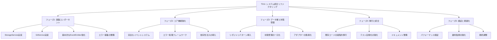

# システム統合リファクタリング（T011）実装戦略

## 1. 概要

T011は、現在のシステムに存在する複数の不整合と改善が必要な領域を解決するためのリファクタリングタスクです。このタスクでは、イベント管理、エラー処理、ファイルシステム操作、Git統合、アダプター実装、状態管理などの領域における問題を体系的に解決し、より堅牢で保守性の高いシステムを構築します。

このリファクタリング戦略は、既存の機能を維持しながら、コードの品質、拡張性、テスト容易性を向上させることを目的としています。段階的なアプローチを採用し、基盤となるコンポーネントから順に改善を進めることで、リスクを最小限に抑えながら効果的なリファクタリングを実現します。

## 2. 現状分析

### 2.1 イベント管理の非一貫性

現在のシステムでは、イベント管理に関して以下の問題が存在します：

- `EventEmitter`クラスは基本的な機能を提供していますが、ワイルドカードパターンやイベント名の標準化などの高度な機能が不足しています
- イベント名の命名規則が統一されていません（例：`workflow:initialized` vs `session:started`）
- エラーハンドリングがコンソールログに直接出力されており、構造化されていません
- イベントベースの連携が部分的にしか実装されていません

```javascript
// 現在のEventEmitterの実装（src/utils/event-emitter.js）
class EventEmitter {
  constructor() {
    this.listeners = new Map();
  }
  
  on(event, callback) {
    if (!this.listeners.has(event)) {
      this.listeners.set(event, []);
    }
    
    this.listeners.get(event).push(callback);
    
    // リスナー解除関数を返す
    return () => this.off(event, callback);
  }
  
  // 他のメソッド...
}
```

### 2.2 エラー処理の分散

エラー処理に関しては以下の問題が存在します：

- 基本的なエラークラス階層は存在しますが、コンテキスト情報や回復メカニズムが不足しています
- エラーログは`console.error`と`Logger`クラスの両方で記録されており、一貫性がありません
- エラー処理が各コンポーネントで独自に実装されており、統一されたアプローチがありません

```javascript
// 現在のエラークラスの実装（src/utils/errors.js）
class ValidationError extends Error {
  constructor(message) {
    super(message);
    this.name = 'ValidationError';
  }
}

class StateError extends Error {
  constructor(message) {
    super(message);
    this.name = 'StateError';
  }
}

// 他のエラークラス...
```

### 2.3 ファイルシステム操作の重複

ファイルシステム操作に関しては以下の問題が存在します：

- `SessionManager`や他のマネージャーでファイルシステム操作が直接行われています
- パス構築とディレクトリ作成のロジックが複数のコンポーネントで重複しています
- ファイルI/Oエラー処理に一貫性がありません

```javascript
// SessionManagerでのファイルシステム操作の例
constructor(options = {}) {
  this.sessionsDir = options.sessionsDir || path.join(process.cwd(), 'ai-context', 'sessions');
  this.templateDir = options.templateDir || path.join(process.cwd(), 'src', 'templates', 'docs');
  this.latestSessionPath = path.join(this.sessionsDir, 'latest-session.json');
  this.sessionHistoryDir = path.join(this.sessionsDir, 'session-history');
  
  // ディレクトリが存在しない場合は作成
  if (!fs.existsSync(this.sessionHistoryDir)) {
    fs.mkdirSync(this.sessionHistoryDir, { recursive: true });
  }
}

// TaskManagerでも同様のコードが重複している
```

### 2.4 Git統合の断片化

Git操作に関しては以下の問題が存在します：

- Git関連機能が複数のコンポーネントに分散しています
- コミット情報取得やタスクID抽出のロジックが重複しています（`SessionManager.extractTaskIdsFromCommitMessage`と`TaskManager.extractTaskIdsFromCommitMessage`）

### 2.5 アダプター実装の不整合

アダプターパターンに関しては以下の問題が存在します：

- アダプターパターンは採用されていますが、元のコンポーネントとアダプター間のインターフェース一致に問題があります
- エラーハンドリングとロギングがアダプターレイヤーで重複しています
- 一部のアダプターメソッドでは非同期処理が適切に扱われていません

### 2.6 状態管理の分散

状態管理に関しては以下の問題が存在します：

- `IntegrationManager`内で状態管理が行われていますが、他のコンポーネントにも独自の状態管理ロジックが存在します
- 状態遷移のルールが複数の場所に定義されています
- 状態変更の通知メカニズムが一貫していません

## 3. 実装戦略

リファクタリングは以下の6つのフェーズに分けて実施します：



### 3.1 フェーズ1: 基盤コンポーネント（2週間）

#### 3.1.1 StorageServiceの実装

**目的**: ファイルシステム操作を抽象化し、一貫したインターフェースを提供する

**実装内容**:

```javascript
// src/lib/utils/storage.js
class StorageService {
  constructor(options = {}) {
    this.basePath = options.basePath || process.cwd();
    this.fs = require('fs');
    this.path = require('path');
    this.logger = options.logger || console;
  }

  getFilePath(directory, filename) {
    const dirPath = this.path.join(this.basePath, directory);
    this.ensureDirectoryExists(dirPath);
    return this.path.join(dirPath, filename);
  }

  ensureDirectoryExists(dirPath) {
    if (!this.fs.existsSync(dirPath)) {
      this.fs.mkdirSync(dirPath, { recursive: true });
    }
  }

  readJSON(directory, filename) {
    try {
      const filePath = this.getFilePath(directory, filename);
      if (!this.fs.existsSync(filePath)) {
        return null;
      }
      const content = this.fs.readFileSync(filePath, 'utf8');
      return JSON.parse(content);
    } catch (error) {
      throw new StorageError(`Failed to read JSON from ${directory}/${filename}`, error);
    }
  }

  writeJSON(directory, filename, data) {
    try {
      const filePath = this.getFilePath(directory, filename);
      this.fs.writeFileSync(filePath, JSON.stringify(data, null, 2), 'utf8');
      return true;
    } catch (error) {
      throw new StorageError(`Failed to write JSON to ${directory}/${filename}`, error);
    }
  }

  // 他のメソッド...
}

class StorageError extends Error {
  constructor(message, cause) {
    super(message);
    this.name = 'StorageError';
    this.cause = cause;
  }
}
```

**段階的な移行計画**:
1. `FeedbackManager`の一部機能でStorageServiceを使用（パイロット）
2. 問題なければ`FeedbackManager`全体を移行
3. `SessionManager`と`TaskManager`へ順次展開
4. 各ステップでの検証基準と回帰テスト計画を定義

**テスト戦略**:
- 単体テスト: 各メソッドの機能検証
- モック化: ファイルシステム操作のモック化
- エラーケース: 様々なエラー状況のシミュレーション
- 統合テスト: 既存コンポーネントとの統合検証

#### 3.1.2 GitServiceの実装

**目的**: Git操作を抽象化し、一貫したインターフェースを提供する

**実装内容**:

```javascript
// src/lib/utils/git.js
class GitService {
  constructor(options = {}) {
    this.execSync = require('child_process').execSync;
    this.logger = options.logger || console;
    this.repoPath = options.repoPath || process.cwd();
  }

  getCurrentCommitHash() {
    try {
      return this.execSync('git rev-parse HEAD', { cwd: this.repoPath }).toString().trim();
    } catch (error) {
      throw new GitError('Failed to get current commit hash', error);
    }
  }

  extractTaskIdsFromCommitMessage(message) {
    try {
      const regex = /#(T[0-9]{3})/g;
      const matches = message.match(regex) || [];
      return matches.map(match => match.substring(1)); // #を除去
    } catch (error) {
      throw new GitError('Failed to extract task IDs from commit message', error);
    }
  }

  // 他のメソッド...
}

class GitError extends Error {
  constructor(message, cause) {
    super(message);
    this.name = 'GitError';
    this.cause = cause;
  }
}
```

**テスト戦略**:
- モックリポジトリ: テスト用のGitリポジトリを自動セットアップ
- コマンド実行のモック化: Git操作のモック化
- エラーシナリオ: 様々なGitエラーのシミュレーション

#### 3.1.3 基本的なEventEmitter強化

**目的**: より柔軟で強力なイベント管理システムの基盤を提供する

**実装内容**:

```javascript
// src/lib/core/event-system.js
class EnhancedEventEmitter {
  constructor() {
    this.listeners = new Map();
    this.wildcardListeners = [];
    this.debugMode = false;
  }

  on(event, callback) {
    if (event.includes('*')) {
      // ワイルドカードリスナーとして登録
      const pattern = new RegExp('^' + event.replace('*', '.*') + '$');
      const wildcardListener = { pattern, callback };
      this.wildcardListeners.push(wildcardListener);
      
      return () => this.offWildcard(wildcardListener);
    } else {
      // 通常のリスナーとして登録
      if (!this.listeners.has(event)) {
        this.listeners.set(event, []);
      }
      
      this.listeners.get(event).push(callback);
      
      return () => this.off(event, callback);
    }
  }

  // 他のメソッド...
}
```

**テスト戦略**:
- イベント発行と受信: 基本機能のテスト
- エラーハンドリング: イベントリスナー内のエラー処理テスト
- パフォーマンス: 多数のリスナー登録時の挙動テスト

#### 3.1.4 エラー基盤の整備

**目的**: 一貫したエラー処理のための基盤を提供する

**実装内容**:

```javascript
// src/lib/core/error-framework.js
class ApplicationError extends Error {
  constructor(message, options = {}) {
    super(message);
    this.name = this.constructor.name;
    this.code = options.code || 'ERR_APPLICATION';
    this.context = options.context || {};
    this.cause = options.cause;
    this.recoverable = options.recoverable !== undefined ? options.recoverable : true;
    this.timestamp = new Date().toISOString();
  }

  toJSON() {
    return {
      name: this.name,
      message: this.message,
      code: this.code,
      context: this.context,
      cause: this.cause?.message,
      recoverable: this.recoverable,
      timestamp: this.timestamp
    };
  }
}

// その他のエラータイプ
class ValidationError extends ApplicationError {
  constructor(message, options = {}) {
    super(message, { ...options, code: 'ERR_VALIDATION' });
  }
}

class StateError extends ApplicationError {
  constructor(message, options = {}) {
    super(message, { ...options, code: 'ERR_STATE', recoverable: false });
  }
}
```

**テスト戦略**:
- エラー階層: 継承関係の正確性テスト
- コンテキスト情報: エラーコンテキスト情報の保持テスト
- シリアライズ: エラーのJSON変換テスト

### 3.2 フェーズ2: コア機能強化（3週間）

#### 3.2.1 完全なイベントシステム

**目的**: より柔軟で強力なイベント管理システムを完成させる

**実装内容**:

```javascript
// src/lib/core/event-system.js（拡張）
class EnhancedEventEmitter {
  // 基本実装に加えて...

  /**
   * イベントをシステム全体で標準化された名前で発行
   * @param {string} component - コンポーネント名
   * @param {string} action - アクション名
   * @param {Object} data - イベントデータ
   */
  emitStandardized(component, action, data = {}) {
    const standardEvent = `${component}:${action}`;
    const timestamp = new Date().toISOString();
    const standardizedData = { ...data, timestamp, component, action };
    
    this.emit(standardEvent, standardizedData);
    
    // グローバルイベントも発行
    this.emit('event', { type: standardEvent, ...standardizedData });
    
    if (this.debugMode) {
      console.log(`[EVENT] ${standardEvent}`, standardizedData);
    }
  }
}
```

**イベント命名の標準化**:
- イベント名の標準形式を定義（例：`component:action`）
- イベントカタログの作成

**イベント駆動アーキテクチャへの移行計画**:
1. 既存の直接メソッド呼び出しの識別
2. イベント発行/購読モデルへの変換マッピング
3. 両方式の並行動作期間の管理
4. 移行完了判定基準の設定

#### 3.2.2 エラー処理フレームワーク

**目的**: エラー処理を一元化し、一貫した対応を可能にする

**実装内容**:

```javascript
// src/lib/core/error-handler.js
class ErrorHandler {
  constructor(logger, eventEmitter) {
    this.logger = logger;
    this.eventEmitter = eventEmitter;
    this.recoveryStrategies = new Map();
  }

  handle(error, component, operation) {
    // アプリケーションエラーでなければラップする
    if (!(error instanceof ApplicationError)) {
      error = new ApplicationError(error.message, {
        cause: error,
        context: { component, operation }
      });
    }

    // エラーをログに記録
    this.logger.error(`[${component}] ${operation} failed:`, {
      error_name: error.name,
      error_message: error.message,
      error_code: error.code,
      stack: error.stack,
      context: error.context
    });

    // エラーイベントを発行
    this.eventEmitter.emit('error', { error, component, operation });

    // 回復可能なエラーの場合は回復を試みる
    if (error.recoverable && this.recoveryStrategies.has(error.code)) {
      try {
        return this.recoveryStrategies.get(error.code)(error, component, operation);
      } catch (recoveryError) {
        this.logger.error(`Recovery failed for ${error.code}:`, recoveryError);
      }
    }

    return error;
  }

  // 他のメソッド...
}
```

**運用監視とトレーサビリティ**:
- 構造化ログ形式の定義
- トレースIDとリクエスト追跡メカニズム
- エラー集約ダッシュボードの設計
- アラート閾値と対応プロトコルの設定

#### 3.2.3 依存性注入の導入

**目的**: コンポーネント間の依存関係を明確にし、テスト容易性を向上させる

**実装内容**:

```javascript
// src/lib/core/service-container.js
class ServiceContainer {
  constructor() {
    this.services = new Map();
    this.factories = new Map();
  }

  register(name, instance) {
    this.services.set(name, instance);
    return this;
  }

  registerFactory(name, factory) {
    this.factories.set(name, factory);
    return this;
  }

  get(name) {
    // サービスが既に登録されているか確認
    if (this.services.has(name)) {
      return this.services.get(name);
    }
    
    // ファクトリーが登録されているか確認
    if (this.factories.has(name)) {
      const factory = this.factories.get(name);
      const instance = factory(this);
      this.services.set(name, instance);
      return instance;
    }
    
    throw new Error(`Service '${name}' not found`);
  }

  // 他のメソッド...
}
```

**テスト戦略**:
- モックサービス注入のテスト
- サービス解決の循環参照検出テスト

### 3.3 フェーズ3: データ層と状態管理（3週間）

#### 3.3.1 リポジトリパターン導入

**目的**: データアクセスを抽象化し、一貫したインターフェースを提供する

**実装内容**:

```javascript
// src/lib/data/repository.js
class Repository {
  constructor(storageService, entityName, options = {}) {
    this.storage = storageService;
    this.entityName = entityName;
    this.directory = options.directory || `ai-context/${entityName}s`;
    this.currentFile = options.currentFile || `current-${entityName}.json`;
    this.historyDirectory = options.historyDirectory || `${entityName}-history`;
    this.validator = options.validator;
  }

  async getAll() {
    return this.storage.readJSON(this.directory, this.currentFile);
  }

  async getById(id) {
    const entities = await this.getAll();
    if (!entities || !Array.isArray(entities[`${this.entityName}s`])) {
      return null;
    }
    return entities[`${this.entityName}s`].find(entity => entity.id === id) || null;
  }

  async create(data) {
    if (this.validator && typeof this.validator.validate === 'function') {
      const validation = this.validator.validate(data);
      if (!validation.isValid) {
        throw new ValidationError(`Invalid ${this.entityName} data: ${validation.errors.join(', ')}`);
      }
    }

    const entities = await this.getAll() || {};
    const entityCollection = entities[`${this.entityName}s`] || [];
    
    const newEntity = { ...data };
    entityCollection.push(newEntity);
    entities[`${this.entityName}s`] = entityCollection;
    
    await this.storage.writeJSON(this.directory, this.currentFile, entities);
    return newEntity;
  }

  // 他のメソッド...
}
```

**テスト戦略**:
- データ整合性テスト
- トランザクション処理テスト
- 並行アクセステスト

#### 3.3.2 状態管理の一元化

**目的**: 状態管理を一元化し、一貫性を確保する

**実装内容**:

```javascript
// src/lib/core/workflow-state.js
class WorkflowStateManager {
  constructor(eventEmitter, options = {}) {
    this.eventEmitter = eventEmitter;
    
    // 状態定義
    this.states = {
      UNINITIALIZED: 'uninitialized',
      INITIALIZED: 'initialized',
      SESSION_STARTED: 'session_started',
      TASK_IN_PROGRESS: 'task_in_progress',
      FEEDBACK_COLLECTED: 'feedback_collected',
      SESSION_ENDED: 'session_ended'
    };
    
    // 状態遷移定義
    this.stateTransitions = {
      [this.states.UNINITIALIZED]: [this.states.INITIALIZED],
      [this.states.INITIALIZED]: [this.states.SESSION_STARTED, this.states.INITIALIZED],
      [this.states.SESSION_STARTED]: [this.states.TASK_IN_PROGRESS, this.states.SESSION_ENDED],
      [this.states.TASK_IN_PROGRESS]: [this.states.FEEDBACK_COLLECTED, this.states.SESSION_ENDED],
      [this.states.FEEDBACK_COLLECTED]: [this.states.TASK_IN_PROGRESS, this.states.SESSION_ENDED],
      [this.states.SESSION_ENDED]: [this.states.INITIALIZED]
    };
    
    // アクションに対応する状態遷移
    this.actionToStateMap = {
      'task:create': this.states.TASK_IN_PROGRESS,
      'task:update': this.states.TASK_IN_PROGRESS,
      'feedback:collect': this.states.FEEDBACK_COLLECTED,
      'feedback:resolve': this.states.TASK_IN_PROGRESS,
      'session:start': this.states.SESSION_STARTED,
      'session:end': this.states.SESSION_ENDED
    };
    
    // 初期状態
    this.currentState = this.states.UNINITIALIZED;
    
    // 状態履歴
    this.stateHistory = [{
      state: this.currentState,
      timestamp: new Date().toISOString()
    }];
    
    // イベントリスナーの登録
    this._registerEventListeners();
  }
  
  // 状態管理メソッド...
  
  _registerEventListeners() {
    // アクションに基づく自動状態遷移
    Object.entries(this.actionToStateMap).forEach(([action, targetState]) => {
      this.eventEmitter.on(action, (data) => {
        if (this.canTransitionTo(targetState)) {
          this.transitionTo(targetState, data);
        }
      });
    });
  }
}
```

**テスト戦略**:
- 状態遷移の正確性テスト
- 不正な遷移の拒否テスト
- イベントベース遷移テスト

#### 3.3.3 アダプターの簡素化

**目的**: アダプターパターンを簡素化し、依存関係を明確にする

**実装内容**:

```javascript
// src/lib/core/manager-factory.js
class ManagerFactory {
  constructor(container) {
    this.container = container;
  }
  
  createTaskManager() {
    return new TaskManager({
      repository: this.container.get('taskRepository'),
      eventEmitter: this.container.get('eventEmitter'),
      errorHandler: this.container.get('errorHandler'),
      gitService: this.container.get('gitService')
    });
  }
  
  createSessionManager() {
    return new SessionManager({
      repository: this.container.get('sessionRepository'),
      eventEmitter: this.container.get('eventEmitter'),
      errorHandler: this.container.get('errorHandler'),
      gitService: this.container.get('gitService')
    });
  }
  
  createFeedbackManager() {
    return new FeedbackManager({
      repository: this.container.get('feedbackRepository'),
      eventEmitter: this.container.get('eventEmitter'),
      errorHandler: this.container.get('errorHandler'),
      gitService: this.container.get('gitService')
    });
  }
  
  createIntegrationManager() {
    return new IntegrationManager({
      taskManager: this.createTaskManager(),
      sessionManager: this.createSessionManager(),
      feedbackManager: this.createFeedbackManager(),
      eventEmitter: this.container.get('eventEmitter'),
      errorHandler: this.container.get('errorHandler'),
      stateManager: this.container.get('stateManager')
    });
  }
}
```

**テスト戦略**:
- 依存性解決テスト
- アダプターインターフェース一致テスト

### 3.4 フェーズ4: 移行と統合（2週間）

#### 3.4.1 既存コードの段階的移行

**目的**: 既存のコードを新しいアーキテクチャに段階的に移行する

**移行計画**:
1. 各コンポーネントの移行優先順位を決定
   - 最初に`FeedbackManager`（最も新しく、依存が少ない）
   - 次に`TaskManager`
   - 最後に`SessionManager`と`IntegrationManager`
2. 各コンポーネントの移行ステップを定義
   - ステップ1: 新しいユーティリティクラスの使用
   - ステップ2: イベント駆動アーキテクチャへの移行
   - ステップ3: エラー処理の統一
   - ステップ4: リポジトリパターンの導入
3. 移行中の並行動作保証
   - アダプターを使用して新旧両方のインターフェースをサポート
   - フィーチャーフラグを使用して段階的に新機能を有効化
4. 移行完了基準の定義
   - すべてのテストが成功すること
   - パフォーマンス指標が基準を満たすこと
   - コードの重複率が50%以上削減されていること

#### 3.4.2 テスト自動化の強化

**目的**: テスト自動化を強化し、リファクタリングの品質を確保する

**実装内容**:
- CI/CDパイプラインの更新
- 自動テストカバレッジの向上
- 回帰テストスイートの拡充

#### 3.4.3 ドキュメント整備

**目的**: 新しいアーキテクチャのドキュメントを整備し、開発者の理解を促進する

**実装内容**:
- 新アーキテクチャの概要図作成
- コンポーネント間の関係図
- 設計原則とパターンの解説
- 移行ガイドと開発者向けチュートリアル

### 3.5 フェーズ5: 検証と最適化（2週間）

#### 3.5.1 パフォーマンス検証

**目的**: リファクタリング後のパフォーマンスを検証し、最適化する

**実装内容**:
- リファクタリング前後のパフォーマンス測定
- 重要な操作のレスポンスタイム目標設定
- メモリ使用量の監視
- スケーラビリティテストの実施

#### 3.5.2 運用監視の強化

**目的**: 運用監視を強化し、問題の早期発見と対応を可能にする

**実装内容**:
- ログ集約システムの構築
- アラート設定の最適化
- 運用ダッシュボードの構築

#### 3.5.3 最終調整

**目的**: フィードバックに基づいて最終調整を行い、リファクタリングを完了する

**実装内容**:
- フィードバックに基づく微調整
- ドキュメントの最終更新
- 知識移転セッションの実施

## 4. 実装スケジュールと担当者割り当て

| フェーズ | タスク | 期間 | 担当者 | 依存関係 |
|---------|-------|------|-------|---------|
| 1 | StorageService実装 | 3日 | 開発者A | なし |
| 1 | GitService実装 | 3日 | 開発者B | なし |
| 1 | 基本EventEmitter強化 | 4日 | 開発者A | なし |
| 1 | エラー基盤整備 | 4日 | 開発者B | なし |
| 2 | イベントシステム完成 | 1週間 | 開発者A | 1.3 |
| 2 | エラー処理フレームワーク | 1週間 | 開発者B | 1.4 |
| 2 | 依存性注入導入 | 1週間 | 開発者C | 1.1, 1.2 |
| 3 | リポジトリパターン導入 | 1週間 | 開発者A | 1.1, 2.3 |
| 3 | 状態管理一元化 | 1週間 | 開発者B | 2.1, 2.2 |
| 3 | アダプター簡素化 | 1週間 | 開発者C | 2.3 |
| 4 | 既存コード移行 | 1週間 | 全員 | 3.1, 3.2, 3.3 |
| 4 | テスト自動化強化 | 3日 | 開発者B | 4.1 |
| 4 | ドキュメント整備 | 4日 | 開発者A, C | 4.1 |
| 5 | パフォーマンス検証 | 1週間 | 開発者B | 4.1 |
| 5 | 運用監視強化 | 3日 | 開発者C | 4.1 |
| 5 | 最終調整 | 4日 | 全員 | 5.1, 5.2 |

## 5. リスク管理計画

| リスク | 影響度 | 発生確率 | 対策 |
|-------|-------|---------|-----|
| 既存機能の回帰 | 高 | 中 | 包括的なテストスイート、段階的移行、並行動作期間の設定 |
| パフォーマンス低下 | 中 | 中 | 早期からのベンチマーク、ホットスポット分析、最適化 |
| 開発遅延 | 中 | 高 | 小さなマイルストーン、優先順位の明確化、定期的な進捗確認 |
| チーム知識格差 | 中 | 高 | ペアプログラミング、知識共有セッション、詳細なドキュメント |
| 複雑性の増加 | 高 | 中 | 明確な設計原則、コードレビュー強化、リファクタリングの段階的実施 |

## 6. 成功基準

1. **機能的基準**:
   - 既存の全機能が正常に動作すること
   - 新しいアーキテクチャでの機能追加が容易になること

2. **非機能的基準**:
   - パフォーマンス: リファクタリング前と比較して20%以上の改善
   - 保守性: コードの重複率が50%以上削減
   - テストカバレッジ: 80%以上
   - ドキュメント: 全コンポーネントの設計と使用方法が文書化されていること

3. **プロセス基準**:
   - 計画されたスケジュール内での完了
   - 重大な回帰バグの発生がないこと

## 7. まとめ

このリファクタリング戦略は、現在のシステムに存在する複数の不整合と改善が必要な領域を体系的に解決し、より堅牢で保守性の高いシステムを構築することを目的としています。段階的なアプローチを採用し、基盤となるコンポーネントから順に改善を進めることで、リスクを最小限に抑えながら効果的なリファクタリングを実現します。

この計画を実行することで、コードベースの保守性、拡張性、テスト容易性が大幅に向上し、将来のフィーチャー追加も容易になります。また、開発者の生産性向上、バグの減少、運用コストの削減など、長期的なメリットも期待できます。