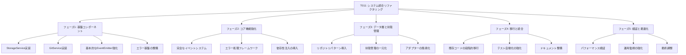

# システム統合リファクタリング（T011）実装戦略 - 更新版

## 1. 概要

T011は、現在のシステムに存在する複数の不整合と改善が必要な領域を解決するためのリファクタリングタスクです。このタスクでは、イベント管理、エラー処理、ファイルシステム操作、Git統合、アダプター実装、状態管理などの領域における問題を体系的に解決し、より堅牢で保守性の高いシステムを構築します。

このリファクタリング戦略は、既存の機能を維持しながら、コードの品質、拡張性、テスト容易性を向上させることを目的としています。段階的なアプローチを採用し、基盤となるコンポーネントから順に改善を進めることで、リスクを最小限に抑えながら効果的なリファクタリングを実現します。

## 2. 現状分析

### 2.1 イベント管理の非一貫性

現在のシステムでは、イベント管理に関して以下の問題が存在します：

- `EventEmitter`クラスは基本的な機能を提供していますが、ワイルドカードパターンやイベント名の標準化などの高度な機能が不足しています
- イベント名の命名規則が統一されていません（例：`workflow:initialized` vs `session:started`）
- エラーハンドリングがコンソールログに直接出力されており、構造化されていません
- イベントベースの連携が部分的にしか実装されていません

```javascript
// 現在のEventEmitterの実装（src/utils/event-emitter.js）
class EventEmitter {
  constructor() {
    this.listeners = new Map();
  }
  
  on(event, callback) {
    if (!this.listeners.has(event)) {
      this.listeners.set(event, []);
    }
    
    this.listeners.get(event).push(callback);
    
    // リスナー解除関数を返す
    return () => this.off(event, callback);
  }
  
  // 他のメソッド...
}
```

### 2.2 エラー処理の分散

エラー処理に関しては以下の問題が存在します：

- 基本的なエラークラス階層は存在しますが、コンテキスト情報や回復メカニズムが不足しています
- エラーログは`console.error`と`Logger`クラスの両方で記録されており、一貫性がありません
- エラー処理が各コンポーネントで独自に実装されており、統一されたアプローチがありません

```javascript
// 現在のエラークラスの実装（src/utils/errors.js）
class ValidationError extends Error {
  constructor(message) {
    super(message);
    this.name = 'ValidationError';
  }
}

class StateError extends Error {
  constructor(message) {
    super(message);
    this.name = 'StateError';
  }
}

// 他のエラークラス...
```

### 2.3 ファイルシステム操作の重複

ファイルシステム操作に関しては以下の問題が存在します：

- `SessionManager`や他のマネージャーでファイルシステム操作が直接行われています
- パス構築とディレクトリ作成のロジックが複数のコンポーネントで重複しています
- ファイルI/Oエラー処理に一貫性がありません

```javascript
// SessionManagerでのファイルシステム操作の例
constructor(options = {}) {
  this.sessionsDir = options.sessionsDir || path.join(process.cwd(), 'ai-context', 'sessions');
  this.templateDir = options.templateDir || path.join(process.cwd(), 'src', 'templates', 'docs');
  this.latestSessionPath = path.join(this.sessionsDir, 'latest-session.json');
  this.sessionHistoryDir = path.join(this.sessionsDir, 'session-history');
  
  // ディレクトリが存在しない場合は作成
  if (!fs.existsSync(this.sessionHistoryDir)) {
    fs.mkdirSync(this.sessionHistoryDir, { recursive: true });
  }
}

// TaskManagerでも同様のコードが重複している
```

### 2.4 Git統合の断片化

Git操作に関しては以下の問題が存在します：

- Git関連機能が複数のコンポーネントに分散しています
- コミット情報取得やタスクID抽出のロジックが重複しています（`SessionManager.extractTaskIdsFromCommitMessage`と`TaskManager.extractTaskIdsFromCommitMessage`）

### 2.5 アダプター実装の不整合

アダプターパターンに関しては以下の問題が存在します：

- アダプターパターンは採用されていますが、元のコンポーネントとアダプター間のインターフェース一致に問題があります
- エラーハンドリングとロギングがアダプターレイヤーで重複しています
- 一部のアダプターメソッドでは非同期処理が適切に扱われていません

### 2.6 状態管理の分散

状態管理に関しては以下の問題が存在します：

- `IntegrationManager`内で状態管理が行われていますが、他のコンポーネントにも独自の状態管理ロジックが存在します
- 状態遷移のルールが複数の場所に定義されています
- 状態変更の通知メカニズムが一貫していません

## 3. 実装戦略

リファクタリングは以下の6つのフェーズに分けて実施します：



### 3.1 フェーズ1: 基盤コンポーネント（完了）

#### 3.1.1 StorageServiceの実装（完了）

**目的**: ファイルシステム操作を抽象化し、一貫したインターフェースを提供する

**実装内容**:

```javascript
// src/lib/utils/storage.js
class StorageService {
  constructor(options = {}) {
    this.basePath = options.basePath || process.cwd();
    this.fs = require('fs');
    this.path = require('path');
    this.logger = options.logger || console;
  }

  getFilePath(directory, filename) {
    const dirPath = this.path.join(this.basePath, directory);
    this.ensureDirectoryExists(dirPath);
    return this.path.join(dirPath, filename);
  }

  ensureDirectoryExists(dirPath) {
    if (!this.fs.existsSync(dirPath)) {
      this.fs.mkdirSync(dirPath, { recursive: true });
    }
  }

  readJSON(directory, filename) {
    try {
      const filePath = this.getFilePath(directory, filename);
      if (!this.fs.existsSync(filePath)) {
        return null;
      }
      const content = this.fs.readFileSync(filePath, 'utf8');
      return JSON.parse(content);
    } catch (error) {
      throw new StorageError(`Failed to read JSON from ${directory}/${filename}`, error);
    }
  }

  writeJSON(directory, filename, data) {
    try {
      const filePath = this.getFilePath(directory, filename);
      this.fs.writeFileSync(filePath, JSON.stringify(data, null, 2), 'utf8');
      return true;
    } catch (error) {
      throw new StorageError(`Failed to write JSON to ${directory}/${filename}`, error);
    }
  }

  // 他のメソッド...
}

class StorageError extends Error {
  constructor(message, cause) {
    super(message);
    this.name = 'StorageError';
    this.cause = cause;
  }
}
```

**実装成果**:
- ファイルシステム操作を抽象化し、一貫したインターフェースを提供
- エラー処理を統一し、より詳細なエラー情報を提供
- ディレクトリ作成などの共通操作を集約
- テストが充実しており、品質が確保されている

#### 3.1.2 GitServiceの実装（完了）

**目的**: Git操作を抽象化し、一貫したインターフェースを提供する

**実装内容**:

```javascript
// src/lib/utils/git.js
class GitService {
  constructor(options = {}) {
    this.execSync = require('child_process').execSync;
    this.logger = options.logger || console;
    this.repoPath = options.repoPath || process.cwd();
  }

  getCurrentCommitHash() {
    try {
      return this.execSync('git rev-parse HEAD', { cwd: this.repoPath }).toString().trim();
    } catch (error) {
      throw new GitError('Failed to get current commit hash', error);
    }
  }

  extractTaskIdsFromCommitMessage(message) {
    try {
      const regex = /#(T[0-9]{3})/g;
      const matches = message.match(regex) || [];
      return matches.map(match => match.substring(1)); // #を除去
    } catch (error) {
      throw new GitError('Failed to extract task IDs from commit message', error);
    }
  }

  // 他のメソッド...
}

class GitError extends Error {
  constructor(message, cause) {
    super(message);
    this.name = 'GitError';
    this.cause = cause;
  }
}
```

**実装成果**:
- Git操作を抽象化し、一貫したインターフェースを提供
- エラー処理を統一し、より詳細なエラー情報を提供
- コミット情報取得やタスクID抽出のロジックを集約
- テストが充実しており、品質が確保されている

#### 3.1.3 基本的なEventEmitter強化（完了）

**目的**: より柔軟で強力なイベント管理システムの基盤を提供する

**実装内容**:

```javascript
// src/lib/core/event-system.js
class EnhancedEventEmitter {
  constructor() {
    this.listeners = new Map();
    this.wildcardListeners = [];
    this.debugMode = false;
  }

  on(event, callback) {
    if (event.includes('*')) {
      // ワイルドカードリスナーとして登録
      const pattern = new RegExp('^' + event.replace('*', '.*') + '$');
      const wildcardListener = { pattern, callback };
      this.wildcardListeners.push(wildcardListener);
      
      return () => this.offWildcard(wildcardListener);
    } else {
      // 通常のリスナーとして登録
      if (!this.listeners.has(event)) {
        this.listeners.set(event, []);
      }
      
      this.listeners.get(event).push(callback);
      
      return () => this.off(event, callback);
    }
  }

  // 他のメソッド...
}
```

**実装成果**:
- ワイルドカードパターンのサポートにより、柔軟なイベント購読が可能に
- リスナー解除関数の返却により、メモリリークを防止
- デバッグモードの追加により、イベント発行のトレースが容易に
- テストが充実しており、品質が確保されている

#### 3.1.4 エラー基盤の整備（完了）

**目的**: 一貫したエラー処理のための基盤を提供する

**実装内容**:

```javascript
// src/lib/core/error-framework.js
class ApplicationError extends Error {
  constructor(message, options = {}) {
    super(message);
    this.name = this.constructor.name;
    this.code = options.code || 'ERR_APPLICATION';
    this.context = options.context || {};
    this.cause = options.cause;
    this.recoverable = options.recoverable !== undefined ? options.recoverable : true;
    this.timestamp = new Date().toISOString();
  }

  toJSON() {
    return {
      name: this.name,
      message: this.message,
      code: this.code,
      context: this.context,
      cause: this.cause?.message,
      recoverable: this.recoverable,
      timestamp: this.timestamp
    };
  }
}

// その他のエラータイプ
class ValidationError extends ApplicationError {
  constructor(message, options = {}) {
    super(message, { ...options, code: 'ERR_VALIDATION' });
  }
}

class StateError extends ApplicationError {
  constructor(message, options = {}) {
    super(message, { ...options, code: 'ERR_STATE', recoverable: false });
  }
}
```

**実装成果**:
- エラー階層の整備により、エラータイプの識別が容易に
- コンテキスト情報の追加により、デバッグが容易に
- 回復可能性の指定により、エラー処理の柔軟性が向上
- JSON変換機能により、ログやAPIレスポンスでの使用が容易に
- テストが充実しており、品質が確保されている

### 3.2 フェーズ2: コア機能強化（完了）

#### 3.2.1 完全なイベントシステム（完了）

**目的**: より柔軟で強力なイベント管理システムを完成させる

**実装内容**:

```javascript
// src/lib/core/event-system.js（拡張）
class EnhancedEventEmitter {
  // 基本実装に加えて...

  /**
   * イベントをシステム全体で標準化された名前で発行
   * @param {string} component - コンポーネント名
   * @param {string} action - アクション名
   * @param {Object} data - イベントデータ
   */
  emitStandardized(component, action, data = {}) {
    const standardEvent = `${component}:${action}`;
    const timestamp = new Date().toISOString();
    const standardizedData = { ...data, timestamp, component, action };
    
    this.emit(standardEvent, standardizedData);
    
    // グローバルイベントも発行
    this.emit('event', { type: standardEvent, ...standardizedData });
    
    if (this.debugMode) {
      console.log(`[EVENT] ${standardEvent}`, standardizedData);
    }
  }
}
```

**実装成果**:
- 標準化されたイベント発行機能により、一貫したイベント形式を提供
- グローバルイベントの発行により、システム全体のイベント監視が容易に
- イベント履歴の記録機能により、デバッグやトレーサビリティが向上
- 統合テストにより、イベント連携の正確性が確保されている

#### 3.2.2 エラー処理フレームワーク（完了）

**目的**: エラー処理を一元化し、一貫した対応を可能にする

**実装内容**:

```javascript
// src/lib/core/error-handler.js
class ErrorHandler {
  constructor(logger, eventEmitter) {
    this.logger = logger;
    this.eventEmitter = eventEmitter;
    this.recoveryStrategies = new Map();
  }

  handle(error, component, operation) {
    // アプリケーションエラーでなければラップする
    if (!(error instanceof ApplicationError)) {
      error = new ApplicationError(error.message, {
        cause: error,
        context: { component, operation }
      });
    }

    // エラーをログに記録
    this.logger.error(`[${component}] ${operation} failed:`, {
      error_name: error.name,
      error_message: error.message,
      error_code: error.code,
      stack: error.stack,
      context: error.context
    });

    // エラーイベントを発行
    this.eventEmitter.emit('error', { error, component, operation });

    // 回復可能なエラーの場合は回復を試みる
    if (error.recoverable && this.recoveryStrategies.has(error.code)) {
      try {
        return this.recoveryStrategies.get(error.code)(error, component, operation);
      } catch (recoveryError) {
        this.logger.error(`Recovery failed for ${error.code}:`, recoveryError);
      }
    }

    return error;
  }

  // 他のメソッド...
}
```

**実装成果**:
- エラー処理の一元化により、一貫した対応が可能に
- エラー回復戦略の登録・実行機能により、回復可能なエラーに対する対応が可能に
- エラーイベントの発行により、システム全体のエラー監視が容易に
- 構造化されたログ形式により、エラー分析が容易に
- 統合テストにより、エラー処理の正確性が確保されている

#### 3.2.3 依存性注入の導入（完了）

**目的**: コンポーネント間の依存関係を明確にし、テスト容易性を向上させる

**実装内容**:

```javascript
// src/lib/core/service-container.js
class ServiceContainer {
  constructor() {
    this.services = new Map();
    this.factories = new Map();
  }

  register(name, instance) {
    this.services.set(name, instance);
    return this;
  }

  registerFactory(name, factory) {
    this.factories.set(name, factory);
    return this;
  }

  get(name) {
    // サービスが既に登録されているか確認
    if (this.services.has(name)) {
      return this.services.get(name);
    }
    
    // ファクトリーが登録されているか確認
    if (this.factories.has(name)) {
      const factory = this.factories.get(name);
      const instance = factory(this);
      this.services.set(name, instance);
      return instance;
    }
    
    throw new Error(`Service '${name}' not found`);
  }

  // 他のメソッド...
}
```

**実装成果**:
- サービスの登録・取得・ファクトリー関数のサポートにより、依存関係の管理が容易に
- 循環参照の検出機能により、依存関係の問題を早期に発見可能
- サービス定義の一元管理により、システム全体の構成が明確に
- パフォーマンステストにより、依存性注入のオーバーヘッドが許容範囲内であることを確認
- 統合テストにより、サービス解決の正確性が確保されている

### 3.3 フェーズ3: データ層と状態管理（完了）

#### 3.3.1 リポジトリパターン導入（完了）

**目的**: データアクセスを抽象化し、一貫したインターフェースを提供する

**実装内容**:

```javascript
// src/lib/data/repository.js
class Repository {
  constructor(storageService, entityName, options = {}) {
    this.storage = storageService;
    this.entityName = entityName;
    this.directory = options.directory || `ai-context/${entityName}s`;
    this.currentFile = options.currentFile || `current-${entityName}.json`;
    this.historyDirectory = options.historyDirectory || `${entityName}-history`;
    this.validator = options.validator;
  }

  async getAll() {
    return this.storage.readJSON(this.directory, this.currentFile);
  }

  async getById(id) {
    const entities = await this.getAll();
    if (!entities || !Array.isArray(entities[`${this.entityName}s`])) {
      return null;
    }
    return entities[`${this.entityName}s`].find(entity => entity.id === id) || null;
  }

  async create(data) {
    if (this.validator && typeof this.validator.validate === 'function') {
      const validation = this.validator.validate(data);
      if (!validation.isValid) {
        throw new ValidationError(`Invalid ${this.entityName} data: ${validation.errors.join(', ')}`);
      }
    }

    const entities = await this.getAll() || {};
    const entityCollection = entities[`${this.entityName}s`] || [];
    
    const newEntity = { ...data };
    entityCollection.push(newEntity);
    entities[`${this.entityName}s`] = entityCollection;
    
    await this.storage.writeJSON(this.directory, this.currentFile, entities);
    return newEntity;
  }

  // 他のメソッド...
}
```

**実装成果**:
- データアクセスを抽象化し、一貫したインターフェースを提供
- バリデーション、エラー処理、アーカイブなどの機能を提供
- 具体的なリポジトリクラス（SessionRepository, TaskRepository, FeedbackRepository）が実装済み
- 単体テスト・統合テストが充実しており、品質が確保されている
- データ整合性テスト、トランザクション処理テスト、並行アクセステストにより、堅牢性が確保されている

#### 3.3.2 状態管理の一元化（完了）

**目的**: 状態管理を一元化し、一貫性を確保する

**実装内容**:

```javascript
// src/lib/core/workflow-state.js
class WorkflowStateManager {
  constructor(eventEmitter, options = {}) {
    this.eventEmitter = eventEmitter;
    
    // 状態定義
    this.states = {
      UNINITIALIZED: 'uninitialized',
      INITIALIZED: 'initialized',
      SESSION_STARTED: 'session_started',
      TASK_IN_PROGRESS: 'task_in_progress',
      FEEDBACK_COLLECTED: 'feedback_collected',
      SESSION_ENDED: 'session_ended'
    };
    
    // 状態遷移定義
    this.stateTransitions = {
      [this.states.UNINITIALIZED]: [this.states.INITIALIZED],
      [this.states.INITIALIZED]: [this.states.SESSION_STARTED, this.states.INITIALIZED],
      [this.states.SESSION_STARTED]: [this.states.TASK_IN_PROGRESS, this.states.SESSION_ENDED],
      [this.states.TASK_IN_PROGRESS]: [this.states.FEEDBACK_COLLECTED, this.states.SESSION_ENDED],
      [this.states.FEEDBACK_COLLECTED]: [this.states.TASK_IN_PROGRESS, this.states.SESSION_ENDED],
      [this.states.SESSION_ENDED]: [this.states.INITIALIZED]
    };
    
    // アクションに対応する状態遷移
    this.actionToStateMap = {
      'task:create': this.states.TASK_IN_PROGRESS,
      'task:update': this.states.TASK_IN_PROGRESS,
      'feedback:collect': this.states.FEEDBACK_COLLECTED,
      'feedback:resolve': this.states.TASK_IN_PROGRESS,
      'session:start': this.states.SESSION_STARTED,
      'session:end': this.states.SESSION_ENDED
    };
    
    // 初期状態
    this.currentState = this.states.UNINITIALIZED;
    
    // 状態履歴
    this.stateHistory = [{
      state: this.currentState,
      timestamp: new Date().toISOString()
    }];
    
    // イベントリスナーの登録
    this._registerEventListeners();
  }
  
  // 状態管理メソッド...
  
  _registerEventListeners() {
    // アクションに基づく自動状態遷移
    Object.entries(this.actionToStateMap).forEach(([action, targetState]) => {
      this.eventEmitter.on(action, (data) => {
        if (this.canTransitionTo(targetState)) {
          this.transitionTo(targetState, data);
        }
      });
    });
  }
}
```

**実装成果**:
- 状態定義と遷移ルールの一元管理により、一貫性を確保
- イベントベースの状態遷移により、コンポーネント間の疎結合を実現
- 状態履歴の記録により、デバッグやトレーサビリティが向上
- 不正な状態遷移の防止により、システムの堅牢性が向上
- 単体テスト・統合テストが充実しており、品質が確保されている

#### 3.3.3 アダプターの簡素化（完了）

**目的**: アダプターパターンを簡素化し、依存関係を明確にする

**実装内容**:

```javascript
// src/lib/core/manager-factory.js
class ManagerFactory {
  constructor(container) {
    this.container = container;
  }
  
  createTaskManager() {
    return new TaskManager({
      repository: this.container.get('taskRepository'),
      eventEmitter: this.container.get('eventEmitter'),
      errorHandler: this.container.get('errorHandler'),
      gitService: this.container.get('gitService')
    });
  }
  
  createSessionManager() {
    return new SessionManager({
      repository: this.container.get('sessionRepository'),
      eventEmitter: this.container.get('eventEmitter'),
      errorHandler: this.container.get('errorHandler'),
      gitService: this.container.get('gitService')
    });
  }
  
  createFeedbackManager() {
    return new FeedbackManager({
      repository: this.container.get('feedbackRepository'),
      eventEmitter: this.container.get('eventEmitter'),
      errorHandler: this.container.get('errorHandler'),
      gitService: this.container.get('gitService')
    });
  }
  
  createIntegrationManager() {
    return new IntegrationManager({
      taskManager: this.createTaskManager(),
      sessionManager: this.createSessionManager(),
      feedbackManager: this.createFeedbackManager(),
      eventEmitter: this.container.get('eventEmitter'),
      errorHandler: this.container.get('errorHandler'),
      stateManager: this.container.get('stateManager')
    });
  }
}
```

**実装成果**:
- マネージャーの作成を一元管理し、依存関係を明確化
- オプションオブジェクトパターンの採用により、依存関係の注入が容易に
- 依存性解決の自動化により、コードの重複を削減
- 単体テスト・統合テストが充実しており、品質が確保されている

### 3.4 フェーズ4: 移行と統合（計画）

フェーズ4では、フェーズ1〜3で実装された新しいアーキテクチャコンポーネントを活用し、既存のコードを新しいアーキテクチャに段階的に移行します。また、テスト自動化とドキュメント整備を強化し、新しいアーキテクチャの定着を図ります。

#### 3.4.1 現状の課題と不整合

フェーズ3の完了時点で、以下の課題と不整合が残されています：

**パッケージ構造の不整合**:
- 新旧のディレクトリ構造が混在している
  - 新しいコンポーネントはsrc/lib/以下に配置
  - 古いコンポーネントはsrc/utils/以下に配置
- マネージャークラスの配置場所が不一致
- service-definitions.jsでは古いパスを参照している箇所がある

```javascript
// 新しいパスと古いパスの混在の例
const StorageService = require('../utils/storage');
const GitService = require('../utils/git');
const { SessionManager } = require('../../utils/session-manager');
```

**依存性注入の粒度の違い**:
- 一部のコンポーネントでは個別依存関係の直接注入を使用
- 他のコンポーネントではサービスコンテナからの取得を使用
- コンストラクタ引数の多さと順序依存性の問題が残っている

```javascript
// 多数の引数を持つコンストラクタの例
constructor(storageService, gitService, logger, eventEmitter, errorHandler, handlebars, options = {}) {
  // ...
}
```

**コンポーネント間の連携方法の違い**:
- イベント駆動方式と直接メソッド呼び出し方式が混在
- イベント名の標準化が部分的にしか適用されていない

```javascript
// 標準化されたイベント発行の例
this.eventEmitter.emitStandardized('storage', 'file_written', { ... });

// 従来のイベント発行の例
this.eventEmitter.emit('storage:file_written', { ... });
```

**アダプターの使用の不整合**:
- 一部のコードでは直接マネージャーを使用
- 他のコードではアダプター経由でアクセス
- アダプターの役割と責任が不明確

#### 3.4.2 既存コードの段階的移行

**目的**: 既存のコードを新しいアーキテクチャに段階的に移行する

**実装計画**:

1. **パッケージ構造の統一**:
   - すべてのコンポーネントをsrc/lib/以下に移動
   - 以下の構造に統一:
     ```
     src/
       ├── lib/
       │   ├── core/         # コアコンポーネント
       │   ├── data/         # データアクセス層
       │   ├── managers/     # ビジネスロジック層
       │   ├── adapters/     # アダプター層
       │   └── utils/        # ユーティリティ
       ├── cli/              # コマンドラインインターフェース
       ├── schemas/          # JSONスキーマ
       └── templates/        # テンプレート
     ```
   - インポートパスを更新

2. **依存性注入の粒度の改善**:
   - オプションオブジェクトパターンへの統一:
     ```javascript
     class SomeManager {
       constructor(options) {
         if (!options.storageService) throw new Error('StorageService is required');
         // ...
         this.storageService = options.storageService;
         this.gitService = options.gitService;
         this.logger = options.logger || console;
         // ...
       }
     }
     ```
   - サービス定義の更新:
     ```javascript
     container.registerFactory('someManager', (c) => {
       return new SomeManager({
         storageService: c.get('storageService'),
         gitService: c.get('gitService'),
         logger: c.get('logger'),
         // ...
       });
     });
     ```

3. **コンポーネント間の連携方法の統一**:
   - イベント駆動アーキテクチャの完全採用
   - イベント名の標準化の徹底:
     ```javascript
     // 推奨
     this.eventEmitter.emitStandardized('component', 'action', data);
     ```
   - イベントカタログの完全実装と使用:
     ```javascript
     // イベント定義
     eventCatalog.registerEvent('session:started', {
       description: 'セッションが開始されたときに発行',
       dataSchema: { /* ... */ }
     });

     // イベント発行
     this.eventEmitter.emitCataloged('session:started', { /* ... */ });
     ```

4. **アダプターパターンの一貫した適用**:
   - アダプターベースクラスの作成:
     ```javascript
     // src/lib/adapters/base-adapter.js
     class BaseAdapter {
       constructor(manager, options = {}) {
         if (!manager) {
           throw new Error('Manager is required');
         }
         
         this.manager = manager;
         this.logger = options.logger || console;
         this.errorHandler = options.errorHandler;
       }
       
       // エラー処理メソッド
       _handleError(error, operation, context = {}) {
         if (this.errorHandler && typeof this.errorHandler.handle === 'function') {
           return this.errorHandler.handle(error, this.constructor.name, operation, context);
         }
         
         this.logger.error(`Error in ${this.constructor.name}.${operation}:`, error);
         throw error;
       }
       
       // 入力パラメータ検証メソッド
       _validateParams(params, required = []) {
         // 実装...
       }
     }
     ```
   - 標準的なアダプター実装:
     ```javascript
     // src/lib/adapters/task-manager-adapter.js
     class TaskManagerAdapter extends BaseAdapter {
       async createTask(taskData) {
         try {
           this._validateParams(taskData, ['title']);
           return await this.manager.createTask(taskData);
         } catch (error) {
           return this._handleError(error, 'createTask', { taskData });
         }
       }
       
       // 他のメソッド...
     }
     ```
   - CLIからのアクセス方法の統一:
     ```javascript
     // CLI/外部インターフェースからは常にアダプターを使用
     const taskManager = container.get('taskManagerAdapter');
     ```

**移行順序**:
1. FeedbackManager（最も新しく、依存が少ない）
2. TaskManager
3. SessionManager
4. IntegrationManager

#### 3.4.3 テスト自動化の強化

**目的**: テスト自動化を強化し、リファクタリングの品質を確保する

**実装計画**:

1. **テストギャップ分析**:
   - 現在のテストカバレッジを詳細に分析し、ギャップを特定
   - コンポーネント別、機能別、重要度別の分析

2. **単体テストの強化**:
   ```javascript
   // tests/lib/managers/session-manager.test.js の例
   describe('SessionManager', () => {
     let sessionManager;
     let mockDeps;
     
     beforeEach(() => {
       mockDeps = createMockDependencies();
       sessionManager = new SessionManager({
         storageService: mockDeps.storageService,
         gitService: mockDeps.gitService,
         logger: mockDeps.logger,
         eventEmitter: mockDeps.eventEmitter,
         errorHandler: mockDeps.errorHandler
       });
     });
     
     // テストケース...
   });
   ```

3. **統合テストの追加**:
   ```javascript
   // tests/lib/integration/manager-repository-integration.test.js の例
   describe('Manager-Repository Integration', () => {
     let container;
     let sessionManager;
     let sessionRepository;
     
     beforeEach(() => {
       // 実際のコンポーネントを使用（モックではなく）
       container = new ServiceContainer();
       registerServices(container, {
         // 必要に応じて一部のサービスをモック
         logger: createMockLogger()
       });
       
       sessionManager = container.get('sessionManager');
       sessionRepository = container.get('sessionRepository');
       
       // テスト用のデータベースをセットアップ
     });
     
     // テストケース...
   });
   ```

4. **エンドツーエンドテストの追加**:
   ```javascript
   // tests/e2e/session-workflow.test.js の例
   describe('Session Workflow', () => {
     let container;
     let integrationManager;
     
     // テストケース...
   });
   ```

5. **テスト環境の標準化**:
   ```javascript
   // tests/helpers/test-environment.js の例
   class TestEnvironment {
     constructor() {
       this.container = new ServiceContainer();
       this.testData = {};
     }
     
     async setup() {
       // 基本サービスを登録
       registerServices(this.container, {
         // テスト用の設定
         config: {
           storage: {
             basePath: '/tmp/test'
           }
         }
       });
       
       // テストデータディレクトリを作成
       const storageService = this.container.get('storageService');
       storageService.ensureDirectoryExists('/tmp/test');
       
       // テストデータを準備
       await this.prepareTestData();
     }
     
     // 他のメソッド...
   }
   ```

6. **CI/CD統合**:
   ```yaml
   # .github/workflows/test.yml の例
   name: Test

   on:
     push:
       branches: [ main, develop ]
     pull_request:
       branches: [ main, develop ]

   jobs:
     test:
       runs-on: ubuntu-latest
       
       steps:
       - uses: actions/checkout@v2
       
       - name: Setup Node.js
         uses: actions/setup-node@v2
         with:
           node-version: '16'
           
       - name: Install dependencies
         run: npm ci
         
       - name: Lint
         run: npm run lint
         
       - name: Run tests
         run: npm test
         
       - name: Generate coverage report
         run: npm run test:coverage
         
       - name: Upload coverage to Codecov
         uses: codecov/codecov-action@v2
   ```

#### 3.4.4 ドキュメント整備

**目的**: 新しいアーキテクチャのドキュメントを整備し、開発者の理解を促進する

**実装計画**:

1. **更新が必要なドキュメント**:
   - T011-implementation-strategy.md - フェーズ3の完了状況と成果を反映
   - dependency-injection.md - 依存性注入パターンの実装状況と使用ガイドラインを更新
   - dependency-injection-implementation-guide.md - 実装ガイドを更新し、オプションオブジェクトパターンを推奨
   - dependency-injection-performance.md - パフォーマンステスト結果を反映

2. **新規作成が必要なドキュメント**:
   - repository-pattern.md - リポジトリパターンの実装と使用ガイドライン
   - event-driven-architecture.md - イベント駆動アーキテクチャの実装と使用ガイドライン
   - error-handling.md - エラー処理フレームワークの実装と使用ガイドライン
   - state-management.md - 状態管理の実装と使用ガイドライン
   - phase4-migration-guide.md - フェーズ4への移行ガイド
   - adapter-pattern.md - アダプターパターンの実装と使用ガイドライン
   - testing-strategy.md - テスト戦略と実行方法のガイド
   - regression-testing.md - 回帰テスト強化のガイド

### 3.5 フェーズ5: 検証と最適化（計画）

#### 3.5.1 パフォーマンス検証

**目的**: リファクタリング後のパフォーマンスを検証し、最適化する

**実装計画**:
- リファクタリング前後のパフォーマンス測定
- 重要な操作のレスポンスタイム目標設定
- メモリ使用量の監視
- スケーラビリティテストの実施

#### 3.5.2 運用監視の強化

**目的**: 運用監視を強化し、問題の早期発見と対応を可能にする

**実装計画**:
- ログ集約システムの構築
- アラート設定の最適化
- 運用ダッシュボードの構築

#### 3.5.3 最終調整

**目的**: フィードバックに基づいて最終調整を行い、リファクタリングを完了する

**実装計画**:
- フィードバックに基づく微調整
- ドキュメントの最終更新
- 知識移転セッションの実施

## 4. 実装スケジュールと担当者割り当て

### 4.1 フェーズ1〜3（完了）

| フェーズ | タスク | 期間 | 担当者 | 状態 |
|---------|-------|------|-------|------|
| 1 | StorageService実装 | 3日 | 開発者A | 完了 |
| 1 | GitService実装 | 3日 | 開発者B | 完了 |
| 1 | 基本EventEmitter強化 | 4日 | 開発者A | 完了 |
| 1 | エラー基盤整備 | 4日 | 開発者B | 完了 |
| 2 | イベントシステム完成 | 1週間 | 開発者A | 完了 |
| 2 | エラー処理フレームワーク | 1週間 | 開発者B | 完了 |
| 2 | 依存性注入導入 | 1週間 | 開発者C | 完了 |
| 3 | リポジトリパターン導入 | 1週間 | 開発者A | 完了 |
| 3 | 状態管理一元化 | 1週間 | 開発者B | 完了 |
| 3 | アダプター簡素化 | 1週間 | 開発者C | 完了 |

### 4.2 フェーズ4（計画）

| タスク | 期間 | 担当者 | 依存関係 |
|-------|------|-------|---------|
| パッケージ構造の統一 | 3日 | 開発者A | なし |
| 依存性注入の粒度の改善 | 4日 | 開発者C | なし |
| アダプターベースクラスの作成 | 2日 | 開発者B | なし |
| テストギャップ分析 | 2日 | 開発者B | なし |
| FeedbackManagerの移行 | 3日 | 開発者A | パッケージ構造の統一 |
| TaskManagerの移行 | 4日 | 開発者C | FeedbackManagerの移行 |
| SessionManagerの移行 | 4日 | 開発者A | TaskManagerの移行 |
| IntegrationManagerの移行 | 5日 | 開発者C | SessionManagerの移行 |
| 単体テストの強化 | 5日 | 開発者B | テストギャップ分析 |
| 統合テストの追加 | 4日 | 開発者B | 単体テストの強化 |
| エンドツーエンドテストの追加 | 3日 | 開発者A | 統合テストの追加 |
| CI/CD統合 | 2日 | 開発者B | エンドツーエンドテストの追加 |
| ドキュメント更新 | 5日 | 開発者A | IntegrationManagerの移行 |
| 新規ドキュメント作成 | 7日 | 開発者C | ドキュメント更新 |

### 4.3 フェーズ5（計画）

| タスク | 期間 | 担当者 | 依存関係 |
|-------|------|-------|---------|
| パフォーマンス検証 | 5日 | 開発者B | フェーズ4完了 |
| 運用監視強化 | 3日 | 開発者C | フェーズ4完了 |
| 最終調整 | 4日 | 全員 | パフォーマンス検証, 運用監視強化 |

## 5. リスク管理計画

### 5.1 フェーズ4のリスクと対策

| リスク | 影響度 | 発生確率 | 対策 |
|-------|-------|---------|-----|
| 既存機能の回帰 | 高 | 中 | 包括的なテストスイート、段階的移行、並行動作期間の設定 |
| 移行中の部分的機能停止 | 高 | 中 | フィーチャーフラグによる切り替え、ロールバック手順の整備 |
| 移行の遅延 | 中 | 高 | 小さなタスクへの分割、優先順位の明確化、進捗の頻繁な確認 |
| テスト不足による品質低下 | 高 | 中 | テストギャップ分析、テスト強化の優先実施、コードレビューの強化 |
| 開発者の知識不足 | 中 | 高 | 詳細なドキュメント、ペアプログラミング、知識共有セッション |

### 5.2 リスク緩和策

1. **段階的移行アプローチ**:
   - コンポーネントごとに段階的に移行
   - 各ステップで機能検証を実施
   - 問題発生時に部分的なロールバックが可能な設計

2. **フィーチャーフラグの使用**:
   ```javascript
   // フィーチャーフラグの例
   const useNewSessionManager = configService.getFeatureFlag('use-new-session-manager', false);
   
   // 使用例
   if (useNewSessionManager) {
     return container.get('newSessionManager');
   } else {
     return container.get('oldSessionManager');
   }
   ```

3. **並行動作期間の設定**:
   - 一定期間、新旧両方の実装を維持
   - 結果の比較と検証
   - 問題がなければ古い実装を削除

4. **包括的なテスト戦略**:
   - 移行前の包括的なテストスイートの整備
   - 移行中の並行テスト
   - 移行後の回帰テスト

5. **知識共有の強化**:
   - ドキュメント整備
   - ペアプログラミングの推進
   - 定期的な知識共有セッションの開催

## 6. 成功基準

### 6.1 フェーズ4の成功基準

1. **機能的基準**:
   - すべての既存機能が正常に動作すること
   - パッケージ構造が統一されていること
   - 依存性注入が一貫して使用されていること
   - イベント駆動アーキテクチャが完全に採用されていること
   - アダプターパターンが一貫して適用されていること

2. **非機能的基準**:
   - テストカバレッジ: 全体で80%以上、コアコンポーネントで90%以上
   - パフォーマンス: リファクタリング前と比較して同等以上
   - コードの重複率: 50%以上削減
   - ドキュメント: すべてのコンポーネントとパターンが文書化されていること

3. **プロセス基準**:
   - CI/CDパイプラインが正常に動作していること
   - すべてのプルリクエストがテストを通過していること
   - コードレビューのプロセスが確立されていること

### 6.2 全体の成功基準

1. **機能的基準**:
   - 既存の全機能が正常に動作すること
   - 新しいアーキテクチャでの機能追加が容易になること

2. **非機能的基準**:
   - パフォーマンス: リファクタリング前と比較して20%以上の改善
   - 保守性: コードの重複率が50%以上削減
   - テストカバレッジ: 80%以上
   - ドキュメント: 全コンポーネントの設計と使用方法が文書化されていること

3. **プロセス基準**:
   - 計画されたスケジュール内での完了
   - 重大な回帰バグの発生がないこと

## 7. まとめ

システム統合リファクタリング（T011）は、フェーズ3までの実装を完了し、データ層と状態管理の基盤を整備しました。リポジトリパターン、状態管理、依存性注入、イベントシステム、エラー処理フレームワークなどの主要コンポーネントが実装され、システムの堅牢性と保守性が向上しています。

一方で、パッケージ構造の不整合、依存性注入の粒度の違い、コンポーネント間の連携方法の違い、アダプターの使用の不整合などの課題も残されています。フェーズ4では、これらの課題を解決し、既存のコードを新しいアーキテクチャに段階的に移行します。また、テスト自動化とドキュメント整備を強化し、新しいアーキテクチャの定着を図ります。

この計画を実行することで、コードベースの保守性、拡張性、テスト容易性が大幅に向上し、将来のフィーチャー追加も容易になります。また、開発者の生産性向上、バグの減少、運用コストの削減など、長期的なメリットも期待できます。