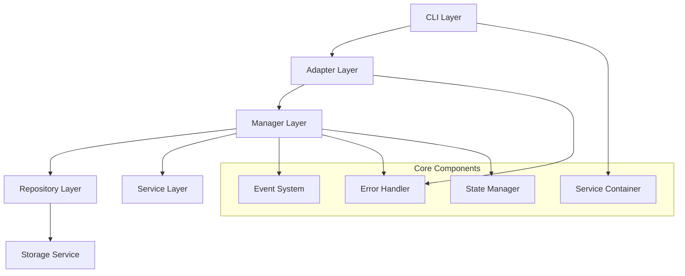
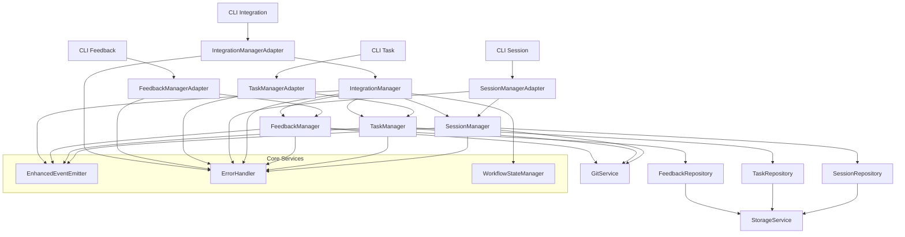
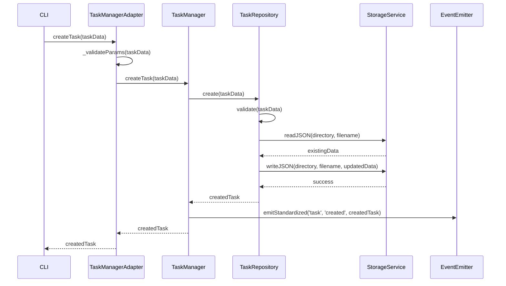
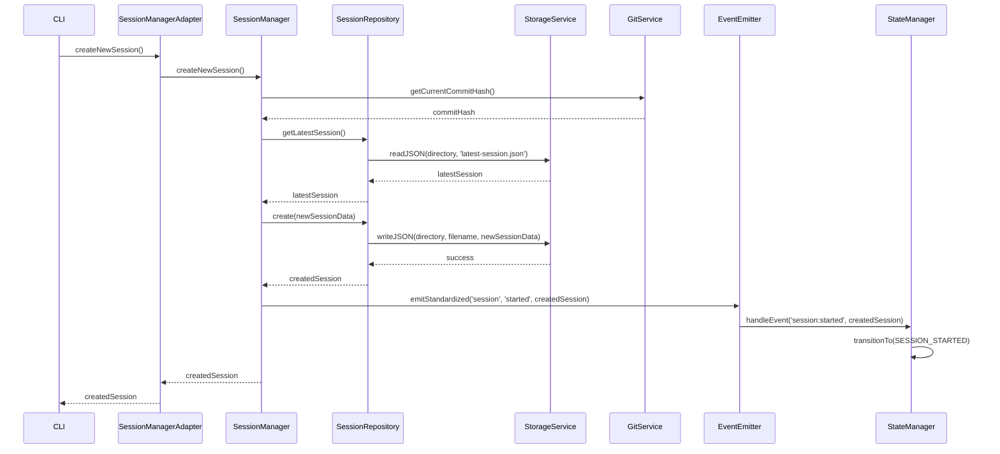
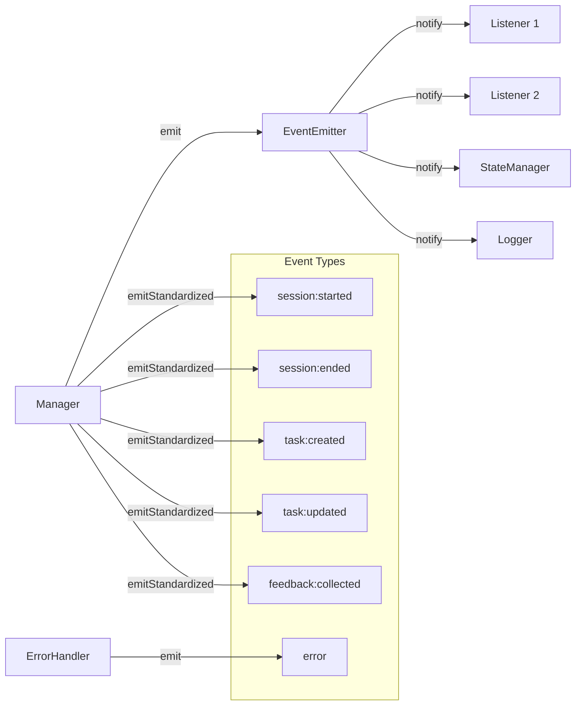
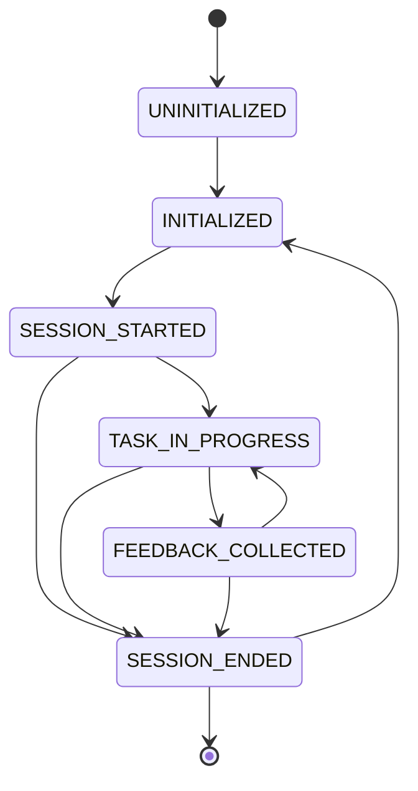

# アーキテクチャ概要

## 1. システム全体の構造

システム統合リファクタリング（T011）によって実装された新しいアーキテクチャは、以下のレイヤーで構成されています：



### 1.1 レイヤーの責任

- **CLI Layer**: コマンドラインインターフェースを提供し、ユーザーからの入力を受け付ける
- **Adapter Layer**: マネージャークラスとCLIの間の橋渡しを行い、入力バリデーションとエラー処理を担当
- **Manager Layer**: ビジネスロジックを実装し、リポジトリとサービスを利用してデータ操作を行う
- **Repository Layer**: データアクセスを抽象化し、永続化と取得を担当
- **Service Layer**: ファイルシステム操作やGit操作などの共通機能を提供

### 1.2 コアコンポーネント

- **Event System**: コンポーネント間の疎結合な通信を可能にする
- **Error Handler**: エラー処理を一元化し、回復戦略を提供
- **Service Container**: 依存性注入を管理し、コンポーネントのライフサイクルを制御
- **State Manager**: システム全体の状態を管理し、状態遷移を制御

## 2. コンポーネント間の依存関係



## 3. データフロー

### 3.1 タスク作成のデータフロー



### 3.2 セッション開始のデータフロー



## 4. イベントフロー

システム内のイベントフローは以下のように設計されています：



## 5. 状態遷移図

システムの状態遷移は以下のように定義されています：



## 6. パッケージ構造

新しいアーキテクチャでは、以下のパッケージ構造を採用しています：

```
src/
  ├── lib/
  │   ├── core/             # コアコンポーネント
  │   │   ├── error-framework.js
  │   │   ├── event-system.js
  │   │   ├── service-container.js
  │   │   ├── service-definitions.js
  │   │   └── workflow-state.js
  │   ├── data/             # データアクセス層
  │   │   ├── repository.js
  │   │   ├── session-repository.js
  │   │   ├── task-repository.js
  │   │   ├── feedback-repository.js
  │   │   └── validators/
  │   │       ├── session-validator.js
  │   │       ├── task-validator.js
  │   │       └── feedback-validator.js
  │   ├── managers/         # ビジネスロジック層
  │   │   ├── session-manager.js
  │   │   ├── task-manager.js
  │   │   ├── feedback-manager.js
  │   │   └── integration-manager.js
  │   ├── adapters/         # アダプター層
  │   │   ├── base-adapter.js
  │   │   ├── session-manager-adapter.js
  │   │   ├── task-manager-adapter.js
  │   │   ├── feedback-manager-adapter.js
  │   │   └── integration-manager-adapter.js
  │   └── utils/            # ユーティリティ
  │       ├── storage.js
  │       └── git.js
  ├── cli/                  # コマンドラインインターフェース
  │   ├── session.js
  │   ├── task.js
  │   ├── feedback.js
  │   └── integration.js
  ├── schemas/              # JSONスキーマ
  │   ├── session-schema.js
  │   ├── task-schema.js
  │   └── feedback-schema.js
  └── templates/            # テンプレート
      └── docs/
          ├── session-template.md
          └── task-template.md
```

## 7. 依存性注入の設定

サービスコンテナの設定は以下のように行われています：

```javascript
// src/lib/core/service-definitions.js
const ServiceContainer = require('./service-container');
const { EnhancedEventEmitter } = require('./event-system');
const { ErrorHandler } = require('./error-framework');
const { WorkflowStateManager } = require('./workflow-state');
const StorageService = require('../utils/storage');
const GitService = require('../utils/git');
const SessionRepository = require('../data/session-repository');
const TaskRepository = require('../data/task-repository');
const FeedbackRepository = require('../data/feedback-repository');
const SessionManager = require('../managers/session-manager');
const TaskManager = require('../managers/task-manager');
const FeedbackManager = require('../managers/feedback-manager');
const IntegrationManager = require('../managers/integration-manager');
const SessionManagerAdapter = require('../adapters/session-manager-adapter');
const TaskManagerAdapter = require('../adapters/task-manager-adapter');
const FeedbackManagerAdapter = require('../adapters/feedback-manager-adapter');
const IntegrationManagerAdapter = require('../adapters/integration-manager-adapter');

function registerServices(container, options = {}) {
  // コアサービス
  container.register('logger', options.logger || console);
  
  container.registerFactory('eventEmitter', () => {
    return new EnhancedEventEmitter({
      logger: container.get('logger'),
      keepHistory: true
    });
  });
  
  container.registerFactory('errorHandler', (c) => {
    return new ErrorHandler(c.get('logger'), c.get('eventEmitter'));
  });
  
  container.registerFactory('stateManager', (c) => {
    return new WorkflowStateManager(c.get('eventEmitter'));
  });
  
  // ユーティリティサービス
  container.registerFactory('storageService', (c) => {
    return new StorageService({
      logger: c.get('logger'),
      eventEmitter: c.get('eventEmitter'),
      errorHandler: c.get('errorHandler')
    });
  });
  
  container.registerFactory('gitService', (c) => {
    return new GitService({
      logger: c.get('logger'),
      eventEmitter: c.get('eventEmitter'),
      errorHandler: c.get('errorHandler')
    });
  });
  
  // リポジトリ
  container.registerFactory('sessionRepository', (c) => {
    return new SessionRepository(c.get('storageService'));
  });
  
  container.registerFactory('taskRepository', (c) => {
    return new TaskRepository(c.get('storageService'));
  });
  
  container.registerFactory('feedbackRepository', (c) => {
    return new FeedbackRepository(c.get('storageService'));
  });
  
  // マネージャー
  container.registerFactory('sessionManager', (c) => {
    return new SessionManager({
      repository: c.get('sessionRepository'),
      gitService: c.get('gitService'),
      eventEmitter: c.get('eventEmitter'),
      errorHandler: c.get('errorHandler'),
      logger: c.get('logger')
    });
  });
  
  container.registerFactory('taskManager', (c) => {
    return new TaskManager({
      repository: c.get('taskRepository'),
      gitService: c.get('gitService'),
      eventEmitter: c.get('eventEmitter'),
      errorHandler: c.get('errorHandler'),
      logger: c.get('logger')
    });
  });
  
  container.registerFactory('feedbackManager', (c) => {
    return new FeedbackManager({
      repository: c.get('feedbackRepository'),
      gitService: c.get('gitService'),
      eventEmitter: c.get('eventEmitter'),
      errorHandler: c.get('errorHandler'),
      logger: c.get('logger')
    });
  });
  
  container.registerFactory('integrationManager', (c) => {
    return new IntegrationManager({
      sessionManager: c.get('sessionManager'),
      taskManager: c.get('taskManager'),
      feedbackManager: c.get('feedbackManager'),
      stateManager: c.get('stateManager'),
      eventEmitter: c.get('eventEmitter'),
      errorHandler: c.get('errorHandler'),
      logger: c.get('logger')
    });
  });
  
  // アダプター
  container.registerFactory('sessionManagerAdapter', (c) => {
    return new SessionManagerAdapter(
      c.get('sessionManager'),
      {
        logger: c.get('logger'),
        errorHandler: c.get('errorHandler')
      }
    );
  });
  
  container.registerFactory('taskManagerAdapter', (c) => {
    return new TaskManagerAdapter(
      c.get('taskManager'),
      {
        logger: c.get('logger'),
        errorHandler: c.get('errorHandler')
      }
    );
  });
  
  container.registerFactory('feedbackManagerAdapter', (c) => {
    return new FeedbackManagerAdapter(
      c.get('feedbackManager'),
      {
        logger: c.get('logger'),
        errorHandler: c.get('errorHandler')
      }
    );
  });
  
  container.registerFactory('integrationManagerAdapter', (c) => {
    return new IntegrationManagerAdapter(
      c.get('integrationManager'),
      {
        logger: c.get('logger'),
        errorHandler: c.get('errorHandler')
      }
    );
  });
  
  return container;
}

module.exports = { registerServices };
```

## 8. まとめ

このアーキテクチャは、以下の設計原則に基づいています：

1. **関心の分離**: 各レイヤーが明確な責任を持ち、他のレイヤーの実装詳細に依存しない
2. **依存性の逆転**: 上位レイヤーが下位レイヤーに依存するのではなく、抽象に依存する
3. **単一責任の原則**: 各クラスが単一の責任を持つ
4. **インターフェース分離の原則**: クライアントが必要としないインターフェースに依存しない
5. **開放/閉鎖の原則**: 拡張に対して開かれ、修正に対して閉じている

これらの原則に従うことで、保守性、拡張性、テスト容易性の高いシステムを実現しています。