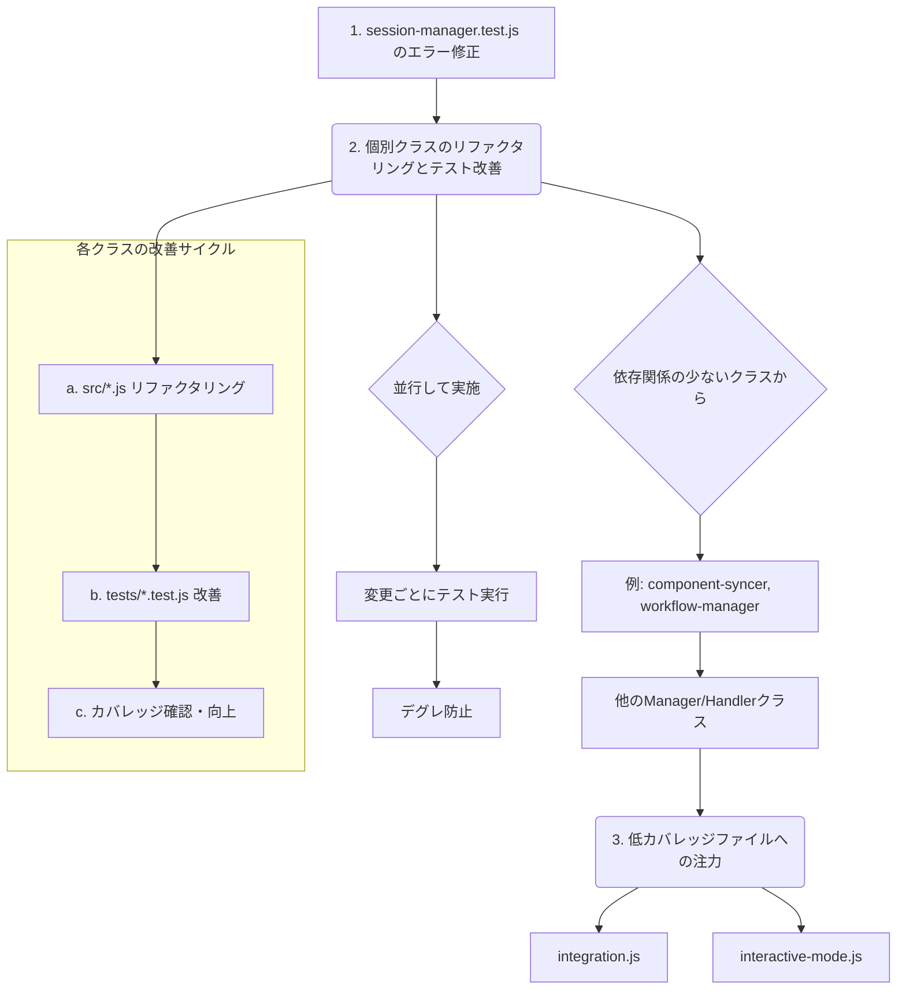

# src/cli および tests/cli のリファクタリング・テスト改善計画

## 1. 現状分析

*   **テストレポート:**
    *   `src/cli` のカバレッジは全体的に 83% 程度。
    *   `integration.js` (65%) と `interactive-mode.js` (61%) のカバレッジが低い。
    *   多くのファイルで未カバー行が存在。
    *   `tests/cli/session-manager.test.js` の `endSession` テストで `NotFoundError` が発生しており、要調査・修正。
*   **基準ドキュメント群:**
    *   コーディング規約、設計原則（DI、エラー処理、イベント駆動）、テストガイドライン、AIガイド、ユーティリティガイドが整備されている。これらをリファクタリングの基準とする。
*   **コード構造（推測）:**
    *   `src/cli` には各機能の Manager/Handler クラスが存在。
    *   `facade.js` はファサードパターン。
    *   `integration.js` は CLI エントリーポイント。表示ロジックや分岐のテスト不足が低カバレッジの原因か。
    *   `interactive-mode.js` は対話モード。テストが難しい要素を含む可能性。

## 2. リファクタリング・テスト改善計画

### 2.1 全体方針

*   `src/cli/*.js` と `tests/cli/*.test.js` をペアで扱い、基準ドキュメント群に準拠させる。
*   `src/lib/utils/*` と `tests/lib/utils/*` を「正」とする。

### 2.2 リファクタリング項目 (`src/cli`)

各クラス (`component-syncer.js`, `facade.js`, `feedback-handler.js`, `integration.js`, `interactive-mode.js`, `report-generator.js`, `session-manager.js`, `status-viewer.js`, `task-manager.js`, `workflow-manager.js`) に対して以下を確認・修正:

1.  **依存性注入 (DI):** コンストラクタでの `options` オブジェクトによる依存注入、必須/任意依存の明確化。
2.  **エラーハンドリング:** `try...catch`、適切なカスタムエラークラス (`CliError` 等) の使用、`errorHandler` への委譲。
3.  **イベント発行:** `emitStandardized`/`emitStandardizedAsync` の使用、`component:action` 形式のイベント名、標準化されたデータ構造。
4.  **コーディング規約準拠:** 命名規則、フォーマット、コメント (JSDoc)。
5.  **ユーティリティ利用:** 各ユーティリティガイドに沿った正しい使い方。
6.  **責務の見直し:** 特に `integration.js`, `interactive-mode.js` の責務分割検討。

### 2.3 テスト改善項目 (`tests/cli`)

各テストファイル (`*.test.js`) に対して以下を実施:

1.  **`session-manager.test.js` のエラー修正:** `NotFoundError` の原因特定と修正。
2.  **カバレッジ向上:** 未カバー行を特定し、テストケース追加。特に `integration.js`, `interactive-mode.js` を重点的に改善 (目標 80% 以上)。
3.  **テストヘルパー活用:** `mock-factory.js` (`createMockDependencies` 等), `test-helpers.js` (`expectStandardizedEventEmitted`, `expectLogged` 等) を活用。
4.  **アサーション強化:** イベントデータ内容、エラー詳細、モック呼び出し引数/回数などを詳細に検証。
5.  **テストケース拡充:** 正常系に加え、異常系（不正入力、エラー、境界値）を網羅。

### 2.4 段階的アプローチ

1.  **エラー修正:** `tests/cli/session-manager.test.js` のエラー解決。
2.  **個別改善:** 依存関係の少ないクラスから順に、リファクタリングとテスト改善をペアで実施。
3.  **重点改善:** `integration.js` と `interactive-mode.js` に注力。
4.  **継続的テスト:** 各ステップで `npm test tests/cli -- --coverage` を実行し、結果とカバレッジを確認。