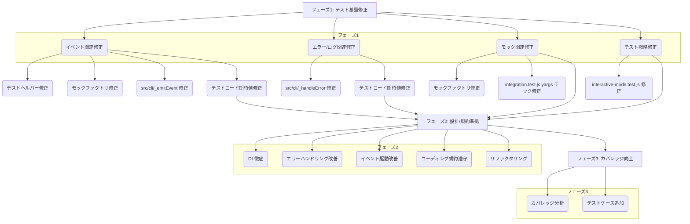

# CLI Refactoring Strategy

## 1. 背景

ユーティリティクラスとそのテストコードのリファクタリングを経て確立された基準ドキュメント群に基づき、`src/cli` および `tests/cli` ディレクトリ内のコードに対して広範な改善・改修を実施する。

## 2. 目標

*   テストの安定性と信頼性の向上 (テストエラーの解消)
*   コード品質の向上 (設計原則とコーディング規約への準拠)
*   テストカバレッジの向上

## 3. 戦略

以下の3つのフェーズで段階的に進める。

### フェーズ1: テスト基盤の修正と安定化

**目的:** テストが正しく実行され、信頼できるフィードバックを提供できるようにする。

**タスク:**

1.  **イベント関連の修正:**
    *   イベント名形式を `component:action` に統一。
    *   イベントデータに `traceId` と `requestId` が含まれることを保証。
    *   **作業:**
        *   `tests/helpers/test-helpers.js`: `expectStandardizedEventEmittedAsync` を修正 (イベント名形式、ID検証)。
        *   `tests/helpers/mock-factory.js`: `createMockEventEmitter` を修正 (ID付与)。
        *   `src/cli/*`: `_emitEvent` ヘルパーを修正 (イベント名形式)。
        *   `tests/cli/*.test.js`: `expectStandardizedEventEmittedAsync` 呼び出し箇所を修正 (期待値)。
2.  **エラー/ログ関連の修正:**
    *   `emitErrorEvent` およびロガー呼び出しの期待値と実装を一致させる。
    *   **作業:**
        *   `src/cli/*`: `_handleError` メソッドを修正 (エラーコード、コンテキスト標準化)。
        *   `tests/cli/*.test.js`: `expect(...).toHaveBeenCalledWith(...)` の期待値を修正 (エラーオブジェクト、ログメッセージ、コンテキスト)。
3.  **モック実装/利用の修正:**
    *   モックが実際の依存関係のインターフェースと振る舞いを模倣するようにする。
    *   **作業:**
        *   `tests/helpers/mock-factory.js`: `createMockEventEmitter` を修正 (IDジェネレータープロパティ)。
        *   `tests/cli/integration.test.js`: `yargs` モック設定を見直し (`exitProcess`)。
        *   `tests/cli/interactive-mode.test.js`: プライベートメソッドのテストを回避し、`console.log` の出力を検証。
4.  **テスト戦略の修正:**
    *   `tests/cli/interactive-mode.test.js` など、プライベートメソッドに依存するテストを見直し、観測可能な副作用（例: `console.log` の出力）を検証するように変更する。

### フェーズ2: 設計原則と規約への準拠

**目的:** コード自体の品質を向上させる。

**タスク:**

1.  **DI の徹底:** コンストラクタでの `options` オブジェクト経由の注入、必須/任意依存チェックを確認・修正。IDジェネレーターの利用を確認。
2.  **エラーハンドリングの改善:** `try...catch`、エラーラップ (`cause` 含む)、`_handleError` への委譲、カスタムエラークラスの利用を確認・修正。
3.  **イベント駆動の改善:** `_emitEvent` ヘルパーパターンの一貫した使用、イベントデータの内容を確認・修正。
4.  **コーディング規約の遵守:** 命名規則、JSDoc、コメント形式などを確認・修正 (Prettier/ESLint 活用)。
5.  **リファクタリング:** 重複コードの抽出、複雑なメソッドの分割、クラス責務の見直し。

### フェーズ3: テストカバレッジ向上

**目的:** コードの信頼性をさらに高める。

**タスク:**

1.  **カバレッジレポートの分析:** `npm test -- --coverage` でカバレッジが低い箇所を特定。
2.  **テストケースの追加:** エラーケース、境界値、エッジケース、`errorHandler` 分岐などの未テストシナリオに対するテストを追加。

## 4. 図 (Mermaid)

## 5. 次のステップ

この計画に基づき、まずはフェーズ1のテスト基盤修正から着手する。