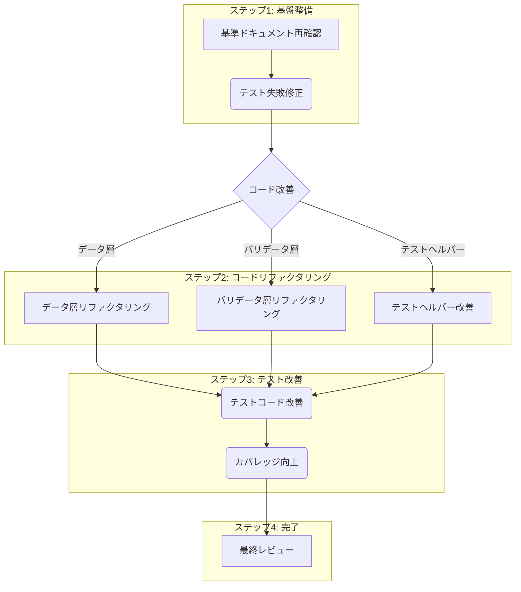

# データ層および関連テストコード 改善・改修戦略

## 1. 背景

ユーティリティクラス・CLIクラスのリファクタリングを経て確立された基準ドキュメント群に基づき、データ層 (`src/lib/data`, `src/lib/data/validators`) および関連テストコード (`tests/helpers`, `tests/lib/data`, `tests/lib/data/integration`, `tests/lib/data/validators`) の広範な改善・改修を実施します。

## 2. 分析結果

*   **基準ドキュメント:** コーディング規約、設計原則 (DI, エラー処理, イベント駆動)、テスト戦略 (FIRST原則, AAA, モック戦略, ヘルパー活用) などを確認。
*   **テストレポート:** `tests/lib/data/task-repository.test.js` で2件のテスト失敗を確認 (`associateCommitWithTask` 関連)。全体的なカバレッジ不足 (特に `src/cli`, `src/lib/adapters`, `src/lib/core`, `src/lib/managers`, `src/lib/utils`)。対象範囲のカバレッジも改善の余地あり。
*   **コード:** DI、エラーハンドリング、イベント発行は部分的に実装されているが、一貫性や規約準拠の点で改善が必要。テストヘルパーは存在するが、モックの精度や活用度に改善の余地あり。

## 3. 改善・改修戦略

以下のステップで進めます。

**戦略詳細:**

1.  **【基盤整備】テスト失敗の修正:**
    *   **対象:** `tests/lib/data/task-repository.test.js` の失敗テストケース (`associateCommitWithTask` 関連)。
    *   **アクション:** `TaskRepository.associateCommitWithTask` のエラーハンドリング実装とテストコード (モック、アサーション) をレビュー・修正し、テストをパスさせる。

2.  **【コードリファクタリング】データ層 (`src/lib/data/*.js`):**
    *   **アクション:**
        *   **エラーハンドリング:** カスタムエラーラップ、`errorHandler` 呼び出し/ログ出力の一貫性確保、エラーコンテキスト追加。`emitErrorEvent` 活用検討。
        *   **イベント発行:** `_emitEvent` ヘルパーパターン導入、`traceId`/`requestId` 付与保証、イベント名規約確認。
        *   **DI:** コンストラクタオプションと必須チェック確認。
        *   **規約準拠:** 命名、フォーマット、JSDoc追加。
        *   **その他:** `async/await`、`floating promise` 確認。

3.  **【コードリファクタリング】バリデータ層 (`src/lib/data/validators/*.js`):**
    *   **アクション:** DI確認、検証ロジックレビュー、規約準拠 (命名、フォーマット、JSDoc)。

4.  **【コードリファクタリング】テストヘルパー (`tests/helpers/*.js`):**
    *   **アクション:**
        *   `mock-factory.js`: モックの精度向上 (特に `EventEmitter` のID付与など)。
        *   `test-helpers.js`: `expectStandardizedEventEmitted(Async)` の検証ロジック確認・修正。必要に応じてヘルパー追加。

5.  **【テスト改善】テストコード (対象範囲):**
    *   **アクション:**
        *   **規約・原則準拠:** AAAパターン適用・コメント追加、テスト名具体化、FIRST原則確認 (モッククリア、状態リセット)。
        *   **モックとアサーション:** 適切なモック使用、アサーション強化 (副作用、連携も検証)、イベント期待値修正。
        *   **テストヘルパー活用:** 活用推進、共通ロジックのヘルパー化検討。
        *   **リファクタリング:** 重複削減、マジックナンバー定数化。

6.  **【テスト改善】カバレッジ向上:**
    *   **アクション:** カバレッジレポートに基づき、対象範囲内の未テストパス (分岐、catchブロック) を特定し、テストケースを追加。

7.  **【完了】最終レビュー:**
    *   コード全体とテスト結果をレビューし、一貫性と品質を確認。

## 4. 次のステップ

この戦略計画を `docs/data-refactoring-strategy.md` として保存します。ご確認いただき、承認が得られれば、ステップ1のテスト失敗修正から着手します。