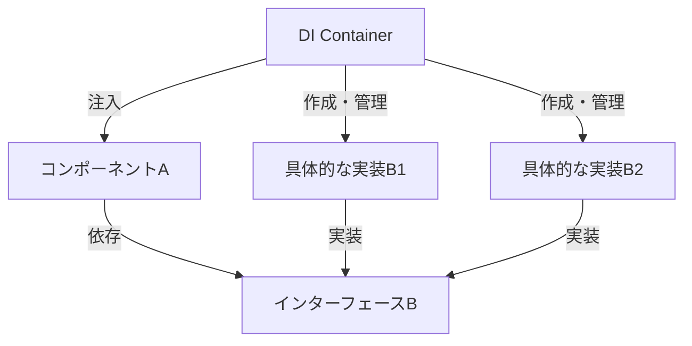
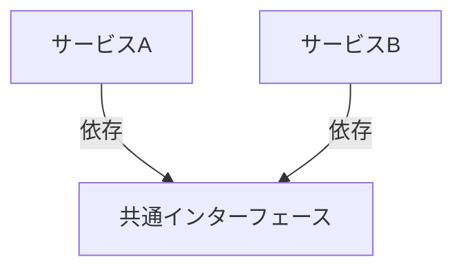

# 依存性注入アーキテクチャガイド

> **難易度: 中級** | 所要時間: 30分

依存性注入（Dependency Injection）は、コンポーネント間の依存関係を外部から注入することで、コンポーネントの結合度を下げ、テスト容易性、柔軟性、再利用性を向上させるデザインパターンです。このガイドでは、knoaプロジェクトにおける依存性注入アーキテクチャの詳細な実装と使用方法について説明します。

## 目次

- [1. 依存性注入の基本概念](#1-依存性注入の基本概念)
- [2. ServiceContainerの詳細な実装](#2-servicecontainerの詳細な実装)
- [3. 依存関係の登録パターン](#3-依存関係の登録パターン)
- [4. 循環参照の検出と解決](#4-循環参照の検出と解決)
- [5. ライフサイクル管理](#5-ライフサイクル管理)
- [6. スコープ管理](#6-スコープ管理)
- [7. フレームワーク比較](#7-フレームワーク比較)
- [8. プロジェクト固有の命名規則とディレクトリ構造](#8-プロジェクト固有の命名規則とディレクトリ構造)
- [9. デバッグとトラブルシューティング](#9-デバッグとトラブルシューティング)
- [10. パフォーマンス最適化](#10-パフォーマンス最適化)
- [11. まとめと次のステップ](#11-まとめと次のステップ)

## 1. 依存性注入の基本概念

### 1.1 依存性注入とは

依存性注入は、コンポーネントが自身の依存関係を直接作成するのではなく、外部から提供（注入）される設計パターンです。これにより、コンポーネントは具体的な実装ではなく、抽象（インターフェース）に依存するようになります。



### 1.2 依存性注入の種類

依存性注入には主に3つの種類があります：

1. **コンストラクタインジェクション**: コンストラクタを通じて依存関係を注入する方法
   ```javascript
   class TaskManager {
     constructor(storageService, eventEmitter) {
       this.storageService = storageService;
       this.eventEmitter = eventEmitter;
     }
   }
   ```

2. **セッターインジェクション**: セッターメソッドを通じて依存関係を注入する方法
   ```javascript
   class TaskManager {
     setStorageService(storageService) {
       this.storageService = storageService;
     }
     
     setEventEmitter(eventEmitter) {
       this.eventEmitter = eventEmitter;
     }
   }
   ```

3. **プロパティインジェクション**: プロパティに直接依存関係を注入する方法
   ```javascript
   const taskManager = new TaskManager();
   taskManager.storageService = storageService;
   taskManager.eventEmitter = eventEmitter;
   ```

knoaプロジェクトでは、主にコンストラクタインジェクションを使用しています。これは最も明示的で、依存関係が明確になるためです。

### 1.3 依存性注入の利点

依存性注入パターンの主な利点は以下の通りです：

1. **疎結合**: コンポーネント間の依存関係が明確になり、変更の影響範囲が限定される
2. **テスト容易性**: モックやスタブを使用して依存関係を置き換えることができ、単体テストが容易になる
3. **柔軟性**: 実装の詳細を隠蔽し、インターフェースに依存することで、実装の変更が容易になる
4. **再利用性**: コンポーネントが特定の実装に依存しないため、再利用しやすくなる
5. **ライフサイクル管理**: コンポーネントのライフサイクルを一元管理できる
6. **並行開発**: インターフェースが定義されていれば、複数の開発者が並行して作業できる
7. **設定の一元化**: 依存関係の設定を一箇所にまとめることができる

### 1.4 依存性注入の欠点と対策

依存性注入パターンには以下の欠点もありますが、適切な対策を講じることで軽減できます：

1. **複雑性の増加**: 
   - 欠点: 依存性注入フレームワークの導入により、コードの複雑性が増加する
   - 対策: 明確なドキュメントと一貫した実装パターンを提供する

2. **学習コスト**: 
   - 欠点: 依存性注入パターンを理解し、適切に使用するための学習コストがかかる
   - 対策: 包括的なドキュメントとサンプルコードを提供する

3. **オーバーヘッド**: 
   - 欠点: サービス解決のオーバーヘッドが発生する可能性がある
   - 対策: キャッシングと遅延初期化を実装する

4. **デバッグの難しさ**: 
   - 欠点: 動的に依存関係が解決されるため、デバッグが難しくなる場合がある
   - 対策: 詳細なログ出力とデバッグツールを提供する

5. **過剰な抽象化**: 
   - 欠点: 不必要に多くの抽象化レイヤーを導入すると、コードが理解しにくくなる
   - 対策: 適切な粒度で抽象化を行い、必要以上に複雑にしない

## 2. ServiceContainerの詳細な実装

### 2.1 ServiceContainerの基本構造

knoaプロジェクトでは、`ServiceContainer`クラスを使用して依存性注入を実装しています。このクラスは、サービスの登録、解決、ライフサイクル管理を担当します。

```javascript
// src/lib/core/service-container.js
class ServiceContainer {
  constructor() {
    this.services = new Map();      // 登録済みのサービスインスタンス
    this.factories = new Map();     // サービス作成用のファクトリー関数
    this.resolving = new Set();     // 現在解決中のサービス（循環参照検出用）
  }

  // サービスを登録
  register(name, instance) {
    this.services.set(name, instance);
    return this;
  }

  // ファクトリー関数を登録
  registerFactory(name, factory) {
    this.factories.set(name, factory);
    return this;
  }

  // サービスを取得
  get(name) {
    // 循環参照の検出
    if (this.resolving.has(name)) {
      throw new Error(`循環参照が検出されました: ${Array.from(this.resolving).join(' -> ')} -> ${name}`);
    }

    // サービスが既に登録されているか確認
    if (this.services.has(name)) {
      return this.services.get(name);
    }
    
    // ファクトリーが登録されているか確認
    if (this.factories.has(name)) {
      // 解決中のサービスとしてマーク
      this.resolving.add(name);
      
      try {
        // ファクトリー関数を実行してインスタンスを作成
        const factory = this.factories.get(name);
        const instance = factory(this);
        
        // インスタンスをキャッシュ
        this.services.set(name, instance);
        
        return instance;
      } finally {
        // 解決中のマークを解除
        this.resolving.delete(name);
      }
    }
    
    throw new Error(`サービス '${name}' が見つかりません`);
  }

  // サービスが登録されているか確認
  has(name) {
    return this.services.has(name) || this.factories.has(name);
  }

  // サービスを削除
  remove(name) {
    const serviceRemoved = this.services.delete(name);
    const factoryRemoved = this.factories.delete(name);
    return serviceRemoved || factoryRemoved;
  }

  // すべてのサービスをクリア
  clear() {
    this.services.clear();
    this.factories.clear();
    this.resolving.clear();
  }

  // 登録されているすべてのサービス名を取得
  getRegisteredServiceNames() {
    return [
      ...new Set([
        ...Array.from(this.services.keys()),
        ...Array.from(this.factories.keys())
      ])
    ];
  }
}
```

### 2.2 ServiceContainerの拡張機能

基本的な`ServiceContainer`クラスに、以下の拡張機能を追加することで、より柔軟で強力な依存性注入コンテナを実現できます：

#### 2.2.1 タグ付け機能

サービスにタグを付けることで、特定のタグを持つすべてのサービスを取得できます。

```javascript
// タグ付けの実装
registerWithTags(name, instance, tags = []) {
  this.register(name, instance);
  
  // タグの登録
  tags.forEach(tag => {
    if (!this.tags.has(tag)) {
      this.tags.set(tag, new Set());
    }
    this.tags.get(tag).add(name);
  });
  
  return this;
}

// タグでサービスを取得
getByTag(tag) {
  if (!this.tags.has(tag)) {
    return [];
  }
  
  return Array.from(this.tags.get(tag)).map(name => this.get(name));
}
```

#### 2.2.2 デコレーター機能

既存のサービスをデコレートすることで、サービスの振る舞いを拡張できます。

```javascript
// デコレーターの実装
decorate(name, decorator) {
  if (!this.has(name)) {
    throw new Error(`サービス '${name}' が見つかりません`);
  }
  
  // 元のサービスを取得
  const originalService = this.get(name);
  
  // デコレートされたサービスを登録
  this.register(name, decorator(originalService, this));
  
  return this;
}
```

#### 2.2.3 エイリアス機能

サービスにエイリアス（別名）を付けることで、複数の名前で同じサービスを参照できます。

```javascript
// エイリアスの実装
alias(name, aliasName) {
  if (!this.has(name)) {
    throw new Error(`サービス '${name}' が見つかりません`);
  }
  
  // エイリアスを登録
  this.registerFactory(aliasName, () => this.get(name));
  
  return this;
}
```

### 2.3 サービス定義の詳細

サービス定義は、アプリケーションで使用するサービスを定義し、依存関係を解決するコンポーネントです。以下は、knoaプロジェクトで使用しているサービス定義の詳細な実装例です：

```javascript
// src/lib/core/service-definitions.js
function createContainer() {
  const container = new ServiceContainer();
  
  // 基本サービスの登録
  registerBasicServices(container);
  
  // ユーティリティサービスの登録
  registerUtilityServices(container);
  
  // マネージャーサービスの登録
  registerManagerServices(container);
  
  // アダプターサービスの登録
  registerAdapterServices(container);
  
  return container;
}

function registerBasicServices(container) {
  // ロガーの登録
  container.register('logger', console);
  
  // 設定の登録
  container.register('config', require('../../config'));
  
  // イベントエミッターの登録
  container.registerFactory('eventEmitter', (container) => {
    const logger = container.get('logger');
    return new EnhancedEventEmitter({ logger, keepHistory: true });
  });
  
  // エラーハンドラーの登録
  container.registerFactory('errorHandler', (container) => {
    const logger = container.get('logger');
    const eventEmitter = container.get('eventEmitter');
    return new ErrorHandler(logger, eventEmitter);
  });
}

function registerUtilityServices(container) {
  // ストレージサービスの登録
  container.registerFactory('storageService', (container) => {
    const logger = container.get('logger');
    const eventEmitter = container.get('eventEmitter');
    const errorHandler = container.get('errorHandler');
    const config = container.get('config');
    
    return new StorageService({
      basePath: config.basePath || process.cwd(),
      logger,
      eventEmitter,
      errorHandler
    });
  });
  
  // Gitサービスの登録
  container.registerFactory('gitService', (container) => {
    const logger = container.get('logger');
    const eventEmitter = container.get('eventEmitter');
    const errorHandler = container.get('errorHandler');
    const config = container.get('config');
    
    return new GitService({
      repoPath: config.repoPath || process.cwd(),
      logger,
      eventEmitter,
      errorHandler
    });
  });
}

function registerManagerServices(container) {
  // タスクマネージャーの登録
  container.registerFactory('taskManager', (container) => {
    const storageService = container.get('storageService');
    const eventEmitter = container.get('eventEmitter');
    const errorHandler = container.get('errorHandler');
    const gitService = container.get('gitService');
    
    return new TaskManager({
      storageService,
      eventEmitter,
      errorHandler,
      gitService
    });
  });
  
  // セッションマネージャーの登録
  container.registerFactory('sessionManager', (container) => {
    const storageService = container.get('storageService');
    const eventEmitter = container.get('eventEmitter');
    const errorHandler = container.get('errorHandler');
    const gitService = container.get('gitService');
    
    return new SessionManager({
      storageService,
      eventEmitter,
      errorHandler,
      gitService
    });
  });
  
  // フィードバックマネージャーの登録
  container.registerFactory('feedbackManager', (container) => {
    const storageService = container.get('storageService');
    const eventEmitter = container.get('eventEmitter');
    const errorHandler = container.get('errorHandler');
    const gitService = container.get('gitService');
    
    return new FeedbackManager({
      storageService,
      eventEmitter,
      errorHandler,
      gitService
    });
  });
  
  // 統合マネージャーの登録
  container.registerFactory('integrationManager', (container) => {
    const taskManager = container.get('taskManager');
    const sessionManager = container.get('sessionManager');
    const feedbackManager = container.get('feedbackManager');
    const eventEmitter = container.get('eventEmitter');
    const errorHandler = container.get('errorHandler');
    
    return new IntegrationManager({
      taskManager,
      sessionManager,
      feedbackManager,
      eventEmitter,
      errorHandler
    });
  });
}

function registerAdapterServices(container) {
  // タスクマネージャーアダプターの登録
  container.registerFactory('taskManagerAdapter', (container) => {
    const taskManager = container.get('taskManager');
    const eventEmitter = container.get('eventEmitter');
    const errorHandler = container.get('errorHandler');
    
    return new TaskManagerAdapter({
      manager: taskManager,
      eventEmitter,
      errorHandler
    });
  });
  
  // セッションマネージャーアダプターの登録
  container.registerFactory('sessionManagerAdapter', (container) => {
    const sessionManager = container.get('sessionManager');
    const eventEmitter = container.get('eventEmitter');
    const errorHandler = container.get('errorHandler');
    
    return new SessionManagerAdapter({
      manager: sessionManager,
      eventEmitter,
      errorHandler
    });
  });
  
  // フィードバックマネージャーアダプターの登録
  container.registerFactory('feedbackManagerAdapter', (container) => {
    const feedbackManager = container.get('feedbackManager');
    const eventEmitter = container.get('eventEmitter');
    const errorHandler = container.get('errorHandler');
    
    return new FeedbackManagerAdapter({
      manager: feedbackManager,
      eventEmitter,
      errorHandler
    });
  });
}
```

## 3. 依存関係の登録パターン

依存性注入コンテナには、様々な依存関係の登録パターンがあります。knoaプロジェクトでは、以下のパターンを使用しています：

### 3.1 値の登録

値の登録は、サービスとして直接値を登録するパターンです。これは、設定やロガーなどの単純なサービスに適しています。

```javascript
// 値の登録
container.register('logger', console);
container.register('config', { basePath: '/path/to/base', debug: true });
container.register('apiKey', 'your-api-key');
```

### 3.2 ファクトリー関数の登録

ファクトリー関数の登録は、サービスを作成するための関数を登録するパターンです。これは、複雑なサービスや依存関係を持つサービスに適しています。

```javascript
// ファクトリー関数の登録
container.registerFactory('storageService', (container) => {
  const logger = container.get('logger');
  const config = container.get('config');
  
  return new StorageService({
    basePath: config.basePath,
    logger
  });
});
```

### 3.3 シングルトンパターン

シングルトンパターンは、サービスのインスタンスを一度だけ作成し、それを再利用するパターンです。knoaプロジェクトの`ServiceContainer`は、デフォルトでシングルトンパターンを実装しています。

```javascript
// シングルトンパターン（デフォルト）
container.registerFactory('storageService', (container) => {
  // このファクトリー関数は一度だけ実行され、結果がキャッシュされる
  return new StorageService();
});

// 同じインスタンスが返される
const service1 = container.get('storageService');
const service2 = container.get('storageService');
console.log(service1 === service2); // true
```

### 3.4 トランジェントパターン

トランジェントパターンは、サービスを取得するたびに新しいインスタンスを作成するパターンです。これは、ステートフルなサービスや、リクエストごとに異なるインスタンスが必要な場合に適しています。

```javascript
// トランジェントパターンの実装
container.registerTransient('requestContext', (container) => {
  return new RequestContext();
});

// 異なるインスタンスが返される
const context1 = container.get('requestContext');
const context2 = container.get('requestContext');
console.log(context1 === context2); // false
```

### 3.5 スコープ付きパターン

スコープ付きパターンは、特定のスコープ内でサービスのインスタンスを共有するパターンです。これは、リクエストスコープやセッションスコープなどで使用されます。

```javascript
// スコープ付きパターンの実装
container.registerScoped('requestService', (container, scope) => {
  return new RequestService(scope.id);
});

// スコープの作成
const scope1 = container.createScope('request1');
const scope2 = container.createScope('request2');

// 同じスコープ内では同じインスタンス
const service1a = scope1.get('requestService');
const service1b = scope1.get('requestService');
console.log(service1a === service1b); // true

// 異なるスコープでは異なるインスタンス
const service2 = scope2.get('requestService');
console.log(service1a === service2); // false
```

## 4. 循環参照の検出と解決

循環参照は、2つ以上のサービスが互いに依存している場合に発生します。例えば、サービスAがサービスBに依存し、サービスBがサービスAに依存している場合です。

### 4.1 循環参照の問題

循環参照は以下の問題を引き起こす可能性があります：

1. **無限ループ**: サービス解決時に無限ループが発生し、スタックオーバーフローを引き起こす
2. **メモリリーク**: 循環参照によりメモリリークが発生する可能性がある
3. **初期化の問題**: サービスの初期化順序が不明確になり、予期しない動作を引き起こす
4. **設計の問題**: 循環参照は通常、設計上の問題を示している

### 4.2 循環参照の検出

knoaプロジェクトの`ServiceContainer`は、サービス解決時に循環参照を自動的に検出します：

```javascript
// 循環参照の検出
get(name) {
  // 循環参照の検出
  if (this.resolving.has(name)) {
    throw new Error(`循環参照が検出されました: ${Array.from(this.resolving).join(' -> ')} -> ${name}`);
  }

  // 解決中のサービスとしてマーク
  this.resolving.add(name);
  
  try {
    // サービス解決ロジック...
  } finally {
    // 解決中のマークを解除
    this.resolving.delete(name);
  }
}
```

### 4.3 循環参照の解決策

循環参照を解決するには、以下の方法があります：

#### 4.3.1 依存関係の再設計

最も根本的な解決策は、依存関係を再設計することです。これには、以下のアプローチがあります：

1. **共通の抽象化**: 両方のサービスが依存する共通のインターフェースを導入する
2. **責任の分離**: サービスの責任を明確に分離し、依存関係を一方向にする
3. **第三のサービス**: 両方のサービスが依存する第三のサービスを導入する



#### 4.3.2 遅延初期化

遅延初期化は、サービスが実際に使用されるまで依存関係の解決を遅らせる方法です。これにより、循環参照の問題を回避できます。

```javascript
// 遅延初期化の実装
class ServiceA {
  constructor(container) {
    this.container = container;
    // ServiceBへの直接的な依存はない
  }
  
  someMethod() {
    // 必要になった時点でServiceBを取得
    const serviceB = this.container.get('serviceB');
    // serviceB を使用...
  }
}
```

#### 4.3.3 イベント駆動アーキテクチャの使用

イベント駆動アーキテクチャを使用することで、直接的な依存関係をイベントベースの通信に置き換えることができます。これにより、循環参照を回避できます。

```javascript
// イベント駆動アーキテクチャの使用
class ServiceA {
  constructor(eventEmitter) {
    this.eventEmitter = eventEmitter;
    
    // イベントリスナーの登録
    this.eventEmitter.on('serviceB:event', this.handleServiceBEvent.bind(this));
  }
  
  handleServiceBEvent(data) {
    // ServiceBからのイベントを処理
  }
  
  doSomething() {
    // イベントを発行
    this.eventEmitter.emit('serviceA:event', { /* データ */ });
  }
}

class ServiceB {
  constructor(eventEmitter) {
    this.eventEmitter = eventEmitter;
    
    // イベントリスナーの登録
    this.eventEmitter.on('serviceA:event', this.handleServiceAEvent.bind(this));
  }
  
  handleServiceAEvent(data) {
    // ServiceAからのイベントを処理
  }
  
  doSomething() {
    // イベントを発行
    this.eventEmitter.emit('serviceB:event', { /* データ */ });
  }
}
```

## 5. ライフサイクル管理

ライフサイクル管理は、サービスの作成、初期化、破棄を管理するプロセスです。適切なライフサイクル管理により、リソースの効率的な使用とメモリリークの防止が可能になります。

### 5.1 サービスの初期化

サービスの初期化は、サービスが作成された後に実行される処理です。これには、リソースの割り当て、イベントリスナーの登録、外部接続の確立などが含まれます。

```javascript
// 初期化可能なサービスのインターフェース
class Initializable {
  async initialize() {
    // 初期化処理
  }
}

// 初期化処理を含むサービス
class DatabaseService extends Initializable {
  constructor(config) {
    super();
    this.config = config;
    this.connection = null;
  }
  
  async initialize() {
    // データベース接続を確立
    this.connection = await createDatabaseConnection(this.config);
    return this;
  }
}

// 初期化処理を行うファクトリー関数
container.registerFactory('databaseService', async (container) => {
  const config = container.get('config');
  const service = new DatabaseService(config);
  return await service.initialize();
});
```

### 5.2 サービスの破棄

サービスの破棄は、サービスが不要になった時に実行される処理です。これには、リソースの解放、イベントリスナーの解除、外部接続の切断などが含まれます。

```javascript
// 破棄可能なサービスのインターフェース
class Disposable {
  async dispose() {
    // 破棄処理
  }
}

// 破棄処理を含むサービス
class DatabaseService extends Disposable {
  constructor(config) {
    super();
    this.config = config;
    this.connection = null;
  }
  
  async initialize() {
    // データベース接続を確立
    this.connection = await createDatabaseConnection(this.config);
    return this;
  }
  
  async dispose() {
    // データベース接続を切断
    if (this.connection) {
      await this.connection.close();
      this.connection = null;
    }
  }
}

// コンテナの拡張
class EnhancedServiceContainer extends ServiceContainer {
  constructor() {
    super();
    this.disposables = new Set();
  }
  
  registerDisposable(name, instance) {
    this.register(name, instance);
    if (typeof instance.dispose === 'function') {
      this.disposables.add(name);
    }
    return this;
  }
  
  async dispose() {
    // すべての破棄可能なサービスを破棄
    for (const name of this.disposables) {
      const service = this.services.get(name);
      if (service && typeof service.dispose === 'function') {
        await service.dispose();
      }
    }
    
    // コンテナをクリア
    this.clear();
  }
}
```

## 11. まとめと次のステップ

### 11.1 まとめ

依存性注入は、コンポーネント間の依存関係を外部から注入することで、コンポーネントの結合度を下げ、テスト容易性、柔軟性、再利用性を向上させるデザインパターンです。knoaプロジェクトでは、`ServiceContainer`クラスを使用して依存性注入を実装しています。

このガイドでは、以下の内容を説明しました：

1. **依存性注入の基本概念**: 依存性注入の種類、利点、欠点と対策
2. **ServiceContainerの詳細な実装**: 基本構造、拡張機能、サービス定義
3. **依存関係の登録パターン**: 値の登録、ファクトリー関数の登録、シングルトンパターン、トランジェントパターン、スコープ付きパターン
4. **循環参照の検出と解決**: 循環参照の問題、検出、解決策
5. **ライフサイクル管理**: サービスの初期化、破棄、ライフサイクルフック
6. **スコープ管理**: スコープの種類、スコープ付きコンテナの実装、スコープ付きサービスの使用例
7. **フレームワーク比較**: 自前実装、InversifyJS、Awilix、NestJSの比較
8. **プロジェクト固有の命名規則とディレクトリ構造**: ディレクトリ構造、命名規則、依存関係の注入パターン
9. **デバッグとトラブルシューティング**: デバッグモードの有効化、依存関係の可視化、よくある問題と解決策
10. **パフォーマンス最適化**: サービス解決の最適化、メモリ使用量の最適化

### 11.2 次のステップ

依存性注入パターンをさらに理解し、活用するための次のステップは以下の通りです：

1. **依存性注入のベストプラクティスを学ぶ**: [依存性注入のベストプラクティス](./dependency-injection-best-practices.md)を参照してください。
2. **テスト方法を学ぶ**: [依存性注入のテストガイド](./dependency-injection-testing-guide.md)を参照してください。
3. **既存コードの移行方法を学ぶ**: [依存性注入移行ガイド](./dependency-injection-migration-guide.md)を参照してください。
4. **イベント駆動アーキテクチャとの連携方法を学ぶ**: [依存性注入とイベント駆動アーキテクチャの統合ガイド](./dependency-injection-event-driven-integration.md)を参照してください。
5. **サンプルプロジェクトを確認する**: [依存性注入サンプルプロジェクトガイド](./dependency-injection-sample-project.md)を参照してください。

### 11.3 関連ドキュメント

- [依存性注入クイックスタートガイド](./dependency-injection-quickstart.md) - 依存性注入の基本的な概念と使用方法
- [依存性注入のベストプラクティス](./dependency-injection-best-practices.md) - 依存性注入パターンを効果的に使用するためのベストプラクティス
- [依存性注入のテストガイド](./dependency-injection-testing-guide.md) - 依存性注入パターンを使用したコードのテスト方法
- [依存性注入移行ガイド](./dependency-injection-migration-guide.md) - 既存コードを依存性注入パターンに移行する方法
- [依存性注入とイベント駆動アーキテクチャの統合ガイド](./dependency-injection-event-driven-integration.md) - 依存性注入とイベント駆動アーキテクチャの連携方法
- [依存性注入サンプルプロジェクトガイド](./dependency-injection-sample-project.md) - 完全な依存性注入実装を示すサンプルプロジェクト
