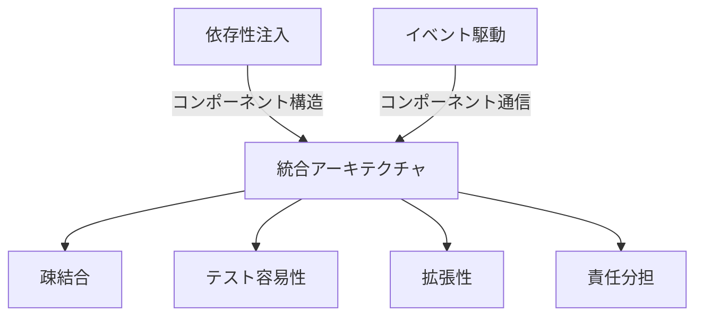
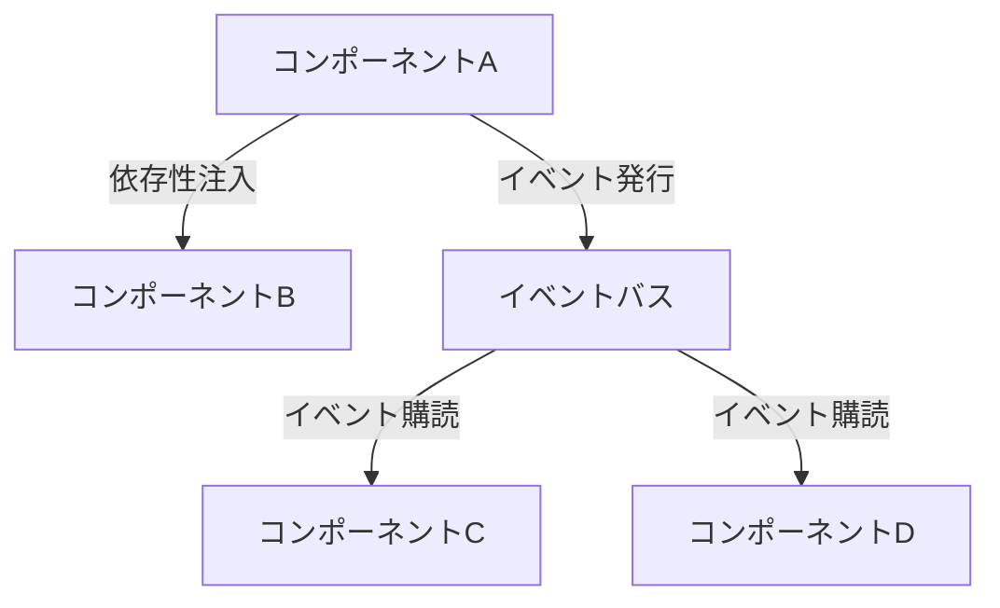

# 依存性注入とイベント駆動アーキテクチャの統合ガイド

> **難易度: 上級** | 所要時間: 30分

このガイドでは、依存性注入パターンとイベント駆動アーキテクチャを効果的に組み合わせる方法について説明します。両方のアーキテクチャパターンを統合することで、疎結合で柔軟性が高く、テスト容易性に優れたシステムを構築できます。

## 目次

- [1. 概要](#1-概要)
- [2. 両アーキテクチャの基本原則](#2-両アーキテクチャの基本原則)
- [3. 統合アプローチ](#3-統合アプローチ)
- [4. イベントエミッターの注入](#4-イベントエミッターの注入)
- [5. イベントリスナーの登録](#5-イベントリスナーの登録)
- [6. 操作コンテキストの活用](#6-操作コンテキストの活用)
- [7. エラー処理の統合](#7-エラー処理の統合)
- [8. テスト戦略](#8-テスト戦略)
- [9. パフォーマンス最適化](#9-パフォーマンス最適化)
- [10. 実装例](#10-実装例)
- [11. まとめと次のステップ](#11-まとめと次のステップ)

## 1. 概要

依存性注入（DI）とイベント駆動アーキテクチャ（EDA）は、それぞれ異なる目的を持つアーキテクチャパターンですが、組み合わせることで相乗効果を発揮します。

- **依存性注入**は、コンポーネント間の依存関係を外部から注入することで、コンポーネントの結合度を下げ、テスト容易性を向上させます。
- **イベント駆動アーキテクチャ**は、コンポーネント間の通信をイベントベースで行うことで、コンポーネントの疎結合を実現し、柔軟性を向上させます。

これらを統合することで、以下のメリットが得られます：

1. **完全な疎結合**: 依存性注入による実装の疎結合とイベント駆動による通信の疎結合
2. **高いテスト容易性**: 両方のパターンを活用した包括的なテスト戦略
3. **柔軟な拡張性**: 新しいコンポーネントの追加が容易
4. **明確な責任分担**: 各コンポーネントの責任が明確に定義される



## 2. 両アーキテクチャの基本原則

### 2.1 依存性注入の原則

依存性注入の基本原則は以下の通りです：

1. **依存関係の外部化**: コンポーネントは自身の依存関係を直接作成せず、外部から提供される
2. **インターフェースへの依存**: 具体的な実装ではなく、抽象（インターフェース）に依存する
3. **単一責任の原則**: 各コンポーネントは明確に定義された単一の責任を持つ
4. **依存関係の明示**: コンポーネントの依存関係は明示的に宣言される

### 2.2 イベント駆動アーキテクチャの原則

イベント駆動アーキテクチャの基本原則は以下の通りです：

1. **イベントベースの通信**: コンポーネント間の通信はイベントを通じて行われる
2. **発行-購読モデル**: イベント発行者はイベント購読者を知らない（疎結合）
3. **非同期処理**: イベントは非同期に処理される
4. **イベントの標準化**: イベント名とデータ構造は標準化される

### 2.3 統合の原則

両アーキテクチャを統合する際の原則は以下の通りです：

1. **イベントエミッターの注入**: イベントエミッターは依存性として注入される
2. **リスナー登録の一元管理**: イベントリスナーの登録は一元管理される
3. **コンテキスト共有**: 操作コンテキストを通じて状態とメタデータを共有する
4. **エラー伝播の一貫性**: エラーはイベントシステムを通じて一貫して伝播される
5. **テスト戦略の統合**: 両方のパターンを考慮したテスト戦略を採用する

## 3. 統合アプローチ

依存性注入とイベント駆動アーキテクチャを統合するためのアプローチは以下の通りです：

### 3.1 サービスコンテナによるイベントシステムの管理

サービスコンテナを使用して、イベントシステムのコンポーネント（イベントエミッター、イベントカタログ、イベント移行ヘルパーなど）を管理します。

```javascript
// サービス定義
function registerEventServices(container) {
  // イベントエミッターの登録
  container.registerFactory('eventEmitter', (c) => {
    const config = c.get('config').eventEmitter || {};
    return new EnhancedEventEmitter({
      logger: c.get('logger'),
      debugMode: config.debugMode || false,
      keepHistory: config.keepHistory || false,
      historyLimit: config.historyLimit || 100
    });
  });
  
  // イベントカタログの登録
  container.registerFactory('eventCatalog', (c) => {
    return new EventCatalog();
  });
  
  // イベント移行ヘルパーの登録
  container.registerFactory('eventMigrationHelper', (c) => {
    return new EventMigrationHelper(
      c.get('eventEmitter'),
      c.get('eventCatalog')
    );
  });
}
```

### 3.2 コンポーネント間の通信パターン

コンポーネント間の通信には、以下のパターンを使用します：

1. **直接依存関係**: コンポーネントが直接使用する依存関係は依存性注入を使用
2. **間接的な連携**: コンポーネント間の間接的な連携はイベントを使用
3. **ハイブリッドアプローチ**: 状況に応じて両方のパターンを組み合わせる



### 3.3 責任の分離

依存性注入とイベント駆動アーキテクチャを統合する際の責任の分離は以下の通りです：

1. **サービスコンテナ**: 依存関係の管理とライフサイクル管理
2. **イベントエミッター**: イベントの発行と購読の管理
3. **イベントカタログ**: イベント定義の管理
4. **コンポーネント**: ビジネスロジックの実装
5. **アダプター**: 外部インターフェースとの連携

## 4. イベントエミッターの注入

イベントエミッターを依存性として注入することで、コンポーネントはイベントを発行できるようになります。

### 4.1 イベントエミッターの実装

```javascript
// src/lib/core/event-system.js
class EnhancedEventEmitter {
  constructor(options = {}) {
    this.listeners = new Map();
    this.wildcardListeners = [];
    this.logger = options.logger || console;
    this.debugMode = options.debugMode || false;
    this.keepHistory = options.keepHistory || false;
    this.historyLimit = options.historyLimit || 100;
    this.history = this.keepHistory ? [] : null;
    this.errorOccurred = false;
  }
  
  // イベントリスナーの登録
  on(event, callback) {
    // 実装...
  }
  
  // イベントの発行
  emit(event, data) {
    // 実装...
  }
  
  // 標準化されたイベントの発行
  emitStandardized(component, action, data = {}) {
    const standardEvent = `${component}:${action}`;
    const timestamp = new Date().toISOString();
    const standardizedData = { ...data, timestamp, component, action };
    
    this.emit(standardEvent, standardizedData);
    
    // グローバルイベントも発行
    this.emit('event', { type: standardEvent, ...standardizedData });
    
    if (this.debugMode) {
      this.logger.debug(`[EVENT] ${standardEvent}`, standardizedData);
    }
    
    // イベント履歴の記録
    if (this.keepHistory) {
      this.history.push({
        event: standardEvent,
        data: standardizedData,
        timestamp
      });
      
      // 履歴の制限
      if (this.history.length > this.historyLimit) {
        this.history.shift();
      }
    }
  }
  
  // コンテキスト付きイベントの発行
  emitStandardizedWithContext(component, action, data = {}, context, options = {}) {
    // 実装...
  }
  
  // エラーイベントの発行
  emitError(error, component, operation, context = null, details = {}) {
    // 実装...
  }
  
  // 操作コンテキストの作成
  createContext(metadata = {}, parentContext = null) {
    // 実装...
  }
}
```

### 4.2 イベントエミッターの注入

イベントエミッターは、コンポーネントのコンストラクタを通じて注入します。

```javascript
// コンポーネントの実装
class TaskManager {
  constructor(options) {
    // 必須依存関係の検証
    if (!options.storageService) throw new Error('storageService is required');
    if (!options.eventEmitter) throw new Error('eventEmitter is required');
    
    // 依存関係の設定
    this.storageService = options.storageService;
    this.eventEmitter = options.eventEmitter;
    this.errorHandler = options.errorHandler;
    this.gitService = options.gitService;
    this.logger = options.logger || console;
  }
  
  // タスクの作成
  async createTask(taskData) {
    try {
      // タスクの作成処理...
      
      // イベントの発行
      this.eventEmitter.emitStandardized('task', 'task_created', {
        taskId: task.id,
        title: task.title,
        status: task.status
      });
      
      return task;
    } catch (error) {
      // エラー処理...
    }
  }
}

// サービス定義
container.registerFactory('taskManager', (c) => {
  return new TaskManager({
    storageService: c.get('storageService'),
    eventEmitter: c.get('eventEmitter'),
    errorHandler: c.get('errorHandler'),
    gitService: c.get('gitService'),
    logger: c.get('logger')
  });
});
```

### 4.3 イベントエミッターのモック

テスト時には、イベントエミッターをモックすることで、イベントの発行をテストできます。

```javascript
// イベントエミッターのモック
const mockEventEmitter = {
  emitStandardized: jest.fn(),
  emitError: jest.fn(),
  createContext: jest.fn().mockReturnValue({ id: 'test-context' })
};

// テスト用のタスクマネージャーの作成
const taskManager = new TaskManager({
  storageService: mockStorageService,
  eventEmitter: mockEventEmitter,
  errorHandler: mockErrorHandler,
  gitService: mockGitService,
  logger: mockLogger
});

// テスト
test('createTask should emit task_created event', async () => {
  // テストの準備...
  
  // メソッドの実行
  await taskManager.createTask({ title: 'Test Task' });
  
  // イベントの発行を検証
  expect(mockEventEmitter.emitStandardized).toHaveBeenCalledWith(
    'task',
    'task_created',
    expect.objectContaining({
      taskId: expect.any(String),
      title: 'Test Task',
      status: 'pending'
    })
  );
});
```

## 5. イベントリスナーの登録

イベントリスナーの登録は、コンポーネントの初期化時に行います。

### 5.1 コンポーネント内でのリスナー登録

```javascript
class FeedbackManager {
  constructor(options) {
    // 依存関係の設定...
    this.eventEmitter = options.eventEmitter;
    
    // イベントリスナーの登録
    if (this.eventEmitter) {
      this._registerEventListeners();
    }
  }
  
  _registerEventListeners() {
    // タスク作成イベントのリスナー
    this.eventEmitter.on('task:task_created', this._handleTaskCreated.bind(this));
    
    // セッション開始イベントのリスナー
    this.eventEmitter.on('session:session_started', this._handleSessionStarted.bind(this));
    
    // エラーイベントのリスナー
    this.eventEmitter.on('error', this._handleError.bind(this));
  }
  
  _handleTaskCreated(data) {
    // タスク作成イベントの処理...
  }
  
  _handleSessionStarted(data) {
    // セッション開始イベントの処理...
  }
  
  _handleError(data) {
    // エラーイベントの処理...
  }
}
```

### 5.2 サービス定義でのリスナー登録

```javascript
// サービス定義
container.registerFactory('eventListenerManager', (c) => {
  const eventEmitter = c.get('eventEmitter');
  const taskManager = c.get('taskManager');
  const sessionManager = c.get('sessionManager');
  const feedbackManager = c.get('feedbackManager');
  
  // タスク関連のイベントリスナー
  eventEmitter.on('task:task_created', (data) => {
    sessionManager.addTaskToCurrentSession(data.taskId);
  });
  
  // セッション関連のイベントリスナー
  eventEmitter.on('session:session_ended', (data) => {
    feedbackManager.collectFeedbackForSession(data.sessionId);
  });
  
  // エラー関連のイベントリスナー
  eventEmitter.on('error', (data) => {
    // エラー処理...
  });
  
  return {
    // イベントリスナーマネージャーのインターフェース
    registerListener: (event, callback) => {
      eventEmitter.on(event, callback);
    },
    removeListener: (event, callback) => {
      eventEmitter.off(event, callback);
    }
  };
});
```

### 5.3 動的なリスナー登録

```javascript
// 動的なリスナー登録
class PluginManager {
  constructor(options) {
    this.eventEmitter = options.eventEmitter;
    this.plugins = [];
  }
  
  registerPlugin(plugin) {
    this.plugins.push(plugin);
    
    // プラグインのイベントリスナーを登録
    if (plugin.eventListeners) {
      for (const [event, callback] of Object.entries(plugin.eventListeners)) {
        this.eventEmitter.on(event, callback.bind(plugin));
      }
    }
  }
  
  unregisterPlugin(pluginId) {
    const plugin = this.plugins.find(p => p.id === pluginId);
    if (!plugin) return;
    
    // プラグインのイベントリスナーを解除
    if (plugin.eventListeners) {
      for (const [event, callback] of Object.entries(plugin.eventListeners)) {
        this.eventEmitter.off(event, callback.bind(plugin));
      }
    }
    
    this.plugins = this.plugins.filter(p => p.id !== pluginId);
  }
}
```

## 6. 操作コンテキストの活用

操作コンテキストは、イベント駆動アーキテクチャにおいて、操作の状態とメタデータを共有するための仕組みです。依存性注入と組み合わせることで、より柔軟で堅牢なシステムを構築できます。

### 6.1 操作コンテキストの実装

```javascript
// src/lib/core/operation-context.js
class OperationContext {
  constructor(metadata = {}, parentContext = null) {
    this.id = metadata.id || `ctx-${Date.now()}-${Math.random().toString(36).substr(2, 9)}`;
    this.component = metadata.component;
    this.operation = metadata.operation;
    this.timestamp = metadata.timestamp || new Date().toISOString();
    this.parentId = parentContext ? parentContext.id : null;
    this.rootId = parentContext ? parentContext.rootId : this.id;
    this.depth = parentContext ? parentContext.depth + 1 : 0;
    this.path = parentContext ? `${parentContext.path}/${this.id}` : this.id;
    this.metadata = metadata;
    this.data = {};
    this.errors = [];
    this.children = [];
    this.status = 'created';
    
    // 親コンテキストに子として登録
    if (parentContext) {
      parentContext.addChild(this);
    }
  }
  
  // データの設定
  setData(key, value) {
    this.data[key] = value;
    return this;
  }
  
  // データの取得
  getData(key) {
    return this.data[key];
  }
  
  // エラーの追加
  addError(error) {
    this.errors.push({
      message: error.message,
      code: error.code,
      timestamp: new Date().toISOString()
    });
    this.status = 'error';
    return this;
  }
  
  // エラーの有無
  hasError() {
    return this.errors.length > 0;
  }
  
  // 子コンテキストの追加
  addChild(childContext) {
    this.children.push(childContext);
    return this;
  }
  
  // 操作の開始
  start() {
    this.status = 'started';
    this.startTime = new Date().toISOString();
    return this;
  }
  
  // 操作の完了
  complete() {
    this.status = 'completed';
    this.endTime = new Date().toISOString();
    return this;
  }
  
  // 操作の失敗
  fail(error) {
    this.addError(error);
    this.endTime = new Date().toISOString();
    return this;
  }
  
  // コンテキストのシリアライズ
  toJSON() {
    return {
      id: this.id,
      component: this.component,
      operation: this.operation,
      timestamp: this.timestamp,
      parentId: this.parentId,
      rootId: this.rootId,
      depth: this.depth,
      path: this.path,
      metadata: this.metadata,
      data: this.data,
      errors: this.errors,
      status: this.status,
      startTime: this.startTime,
      endTime: this.endTime,
      children: this.children.map(child => child.id)
    };
  }
}
```

### 6.2 操作コンテキストの注入と使用

```javascript
// イベントエミッターの拡張
class EnhancedEventEmitter {
  // ...
  
  // 操作コンテキストの作成
  createContext(metadata = {}, parentContext = null) {
    return new OperationContext(metadata, parentContext);
  }
  
  // コンテキスト付きイベントの発行
  emitStandardizedWithContext(component, action, data = {}, context, options = {}) {
    const standardEvent = `${component}:${action}`;
    const timestamp = new Date().toISOString();
    
    // コンテキスト情報をデータに追加
    const standardizedData = {
      ...data,
      timestamp,
      component,
      action,
      _context: context ? context.id : null
    };
    
    // イベントの発行
    this.emit(standardEvent, standardizedData);
    
    // グローバルイベントも発行
    this.emit('event', {
      type: standardEvent,
      ...standardizedData
    });
    
    // 古いイベント名のサポート（オプション）
    if (options.bridgeOldEvents) {
      // 実装...
    }
    
    // イベント履歴の記録
    if (this.keepHistory) {
      // 実装...
    }
  }
}

// コンポーネントでの使用
class TaskManager {
  // ...
  
  async createTask(taskData, parentContext = null) {
    // 操作コンテキストの作成
    const context = this.eventEmitter.createContext({
      component: 'TaskManager',
      operation: 'createTask',
      taskData
    }, parentContext);
    
    // 操作の開始
    context.start();
    
    try {
      // タスクの作成処理...
      
      // コンテキストにデータを設定
      context.setData('taskId', task.id);
      
      // イベントの発行
      this.eventEmitter.emitStandardizedWithContext('task', 'task_created', {
        taskId: task.id,
        title: task.title,
        status: task.status
      }, context);
      
      // 操作の完了
      context.complete();
      
      return task;
    } catch (error) {
      // 操作の失敗
      context.fail(error);
      
      // エラーイベントの発行
      this.eventEmitter.emitError(error, 'task', 'createTask', context, {
        taskData
      });
      
      throw error;
    }
  }
}
```

### 6.3 操作コンテキストの伝播

```javascript
// 操作コンテキストの伝播
class IntegrationManager {
  // ...
  
  async createTaskAndAddToSession(taskData, sessionId = null) {
    // 操作コンテキストの作成
    const context = this.eventEmitter.createContext({
      component: 'IntegrationManager',
      operation: 'createTaskAndAddToSession',
      taskData,
      sessionId
    });
    
    // 操作の開始
    context.start();
    
    try {
      // タスクの作成（コンテキストを伝播）
      const task = await this.taskManager.createTask(taskData, context);
      
      // セッションの取得
      const session = sessionId
        ? await this.sessionManager.getSession(sessionId, context)
        : await this.sessionManager.getCurrentSession(context);
      
      if (!session) {
        throw new Error('Session not found');
      }
      
      // タスクをセッションに追加（コンテキストを伝播）
      await this.sessionManager.addTaskToSession(session.id, task.id, context);
      
      // 操作の完了
      context.complete();
      
      return {
        task,
        session
      };
    } catch (error) {
      // 操作の失敗
      context.fail(error);
      
      // エラーイベントの発行
      this.eventEmitter.emitError(error, 'integration', 'createTaskAndAddToSession', context, {
        taskData,
        sessionId
      });
      
      throw error;
    }
  }
}
```

## 7. エラー処理の統合

依存性注入とイベント駆動アーキテクチャを統合する際のエラー処理は、両方のパターンを組み合わせて行います。

### 7.1 エラーハンドラーの実装

```javascript
// src/lib/core/error-handler.js
class ErrorHandler {
  constructor(logger, eventEmitter, options = {}) {
    this.logger = logger;
    this.eventEmitter = eventEmitter;
    this.recoveryStrategies = new Map();
    this.options = options;
  }
  
  // エラー処理
  handle(error, component, operation, context = {}) {
    // アプリケーションエラーでなければラップする
    if (!(error instanceof ApplicationError)) {
      error = new ApplicationError(error.message, {
        cause: error,
        context: { component, operation, ...context }
      });
    }
    
    // エラーをログに記録
    this.logger.error(`[${component}] ${operation} failed:`, {
      error_name: error.name,
      error_message: error.message,
      error_code: error.code,
      stack: error.stack,
      context
    });
    
    // エラーイベントを発行
    if (this.eventEmitter) {
      this.eventEmitter.emitError(error, component, operation, context);
    }
    
    // 回復可能なエラーの場合は回復を試みる
    if (error.recoverable && this.recoveryStrategies.has(error.code)) {
      try {
        return this.recoveryStrategies.get(error.code)(error, component, operation, context);
      } catch (recoveryError) {
        this.logger.error(`Recovery failed for ${error.code}:`, recoveryError);
      }
    }
    
    // 構造化されたエラー情報を返す
    return {
      error: true,
      message: error.message,
      code: error.code || 'UNKNOWN_ERROR',
      operation,
      name: error.name || 'Error',
      timestamp: new Date().toISOString(),
      context: context.id || null,
      details: JSON.stringify(context)
    };
  }
  
  // 回復戦略の登録
  registerRecoveryStrategy(errorCode, strategy) {
    this.recoveryStrategies.set(errorCode, strategy);
    return this;
  }
}
```

### 7.2 エラーイベントの発行

```javascript
// イベントエミッターの拡張
class EnhancedEventEmitter {
  // ...
  
  // エラーイベントの発行
  emitError(error, component, operation, context = null, details = {}) {
    // グローバルなエラー状態を設定
    this.errorOccurred = true;
    
    // エラーデータの作成
    const errorData = {
      component,
      operation,
      errorCode: error.code || 'ERR_UNKNOWN',
      errorMessage: error.message,
      errorName: error.name || 'Error',
      severity: error.severity || 'error',
      timestamp: new Date().toISOString(),
      context: context ? context.id : null,
      details
    };
    
    // 開発環境ではスタックトレースも含める
    if (process.env.NODE_ENV === 'development') {
      errorData.stack = error.stack;
    }
    
    // エラーイベントの発行
    this.emit(`${component}:error`, errorData);
    
    // グローバルエラーイベントも発行
    this.emit('error', errorData);
    
    if (this.debugMode) {
      this.logger.debug(`[ERROR] ${component}:${operation}`, errorData);
    }
    
    // イベント履歴の記録
    if (this.keepHistory) {
      this.history.push({
        event: `${component}:error`,
        data: errorData,
        timestamp: errorData.timestamp
      });
      
      // 履歴の制限
      if (this.history.length > this.historyLimit) {
        this.history.shift();
      }
    }
  }
}
```

### 7.3 エラー処理の統合

```javascript
// コンポーネントでのエラー処理
class TaskManager {
  // ...
  
  async createTask(taskData, parentContext = null) {
    // 操作コンテキストの作成
    const context = this.eventEmitter.createContext({
      component: 'TaskManager',
      operation: 'createTask',
      taskData
    }, parentContext);
    
    // 操作の開始
    context.start();
    
    try {
      // パラメータの検証
      if (!taskData) {
        throw new ValidationError('Task data is required');
      }
      
      // タスクの作成処理...
      
      // 操作の完了
      context.complete();
      
      return task;
    } catch (error) {
      // 操作の失敗
      context.fail(error);
      
      // エラーハンドラーが存在する場合はそちらに委譲
      if (this.errorHandler) {
        return this.errorHandler.handle(error, 'TaskManager', 'createTask', {
          context: context.id,
          taskData
        });
      }
      
      // エラーイベントの発行
      this.eventEmitter.emitError(error, 'task', 'createTask', context, {
        taskData
      });
      
      // エラーログの出力
      this.logger.error(`Error in TaskManager.createTask:`, error, {
        taskData
      });
      
      // 構造化されたエラー情報を返す
      return {
        error: true,
        message: error.message,
        code: error.code || 'UNKNOWN_ERROR',
        operation: 'createTask',
        name: error.name || 'Error',
        timestamp: new Date().toISOString(),
        context: context.id,
        details: JSON.stringify({ taskData })
      };
    }
  }
}
```

## 8. テスト戦略

依存性注入とイベント駆動アーキテクチャを統合したシステムのテスト戦略は、両方のパターンを考慮する必要があります。

### 8.1 単体テスト

```javascript
// TaskManagerの単体テスト
describe('TaskManager', () => {
  let taskManager;
  let mockStorageService;
  let mockEventEmitter;
  let mockErrorHandler;
  let mockContext;
  
  beforeEach(() => {
    // モックの作成
    mockStorageService = {
      readJSON: jest.fn().mockResolvedValue({ tasks: [] }),
      writeJSON: jest.fn().mockResolvedValue(true)
    };
    
    mockEventEmitter = {
      emitStandardized: jest.fn(),
      emitStandardizedWithContext: jest.fn(),
      emitError: jest.fn(),
      createContext: jest.fn().mockReturnValue({
        id: 'test-context',
        start: jest.fn().mockReturnThis(),
        complete: jest.fn().mockReturnThis(),
        fail: jest.fn().mockReturnThis(),
        setData: jest.fn().mockReturnThis()
      })
    };
    
    mockErrorHandler = {
      handle: jest.fn().mockReturnValue({
        error: true,
        message: 'Test error'
      })
    };
    
    // TaskManagerのインスタンス化
    taskManager = new TaskManager({
      storageService: mockStorageService,
      eventEmitter: mockEventEmitter,
      errorHandler: mockErrorHandler,
      logger: console
    });
    
    // モックコンテキスト
    mockContext = {
      id: 'parent-context',
      start: jest.fn().mockReturnThis(),
      complete: jest.fn().mockReturnThis(),
      fail: jest.fn().mockReturnThis(),
      setData: jest.fn().mockReturnThis()
    };
  });
  
  test('createTask should create a task and emit event', async () => {
    // テストの準備
    const taskData = { title: 'Test Task' };
    
    // メソッドの実行
    const result = await taskManager.createTask(taskData);
    
    // 結果の検証
    expect(result).toHaveProperty('id');
    expect(result).toHaveProperty('title', 'Test Task');
    
    // ストレージサービスの呼び出しを検証
    expect(mockStorageService.readJSON).toHaveBeenCalled();
    expect(mockStorageService.writeJSON).toHaveBeenCalled();
    
    // イベントの発行を検証
    expect(mockEventEmitter.createContext).toHaveBeenCalled();
    expect(mockEventEmitter.emitStandardizedWithContext).toHaveBeenCalledWith(
      'task',
      'task_created',
      expect.objectContaining({
        taskId: expect.any(String),
        title: 'Test Task'
      }),
      expect.anything()
    );
  });
  
  test('createTask should handle errors', async () => {
    // テストの準備
    const taskData = { title: 'Test Task' };
    const testError = new Error('Test error');
    
    // ストレージサービスのモックをエラーを投げるように設定
    mockStorageService.readJSON.mockRejectedValue(testError);
    
    // メソッドの実行
    const result = await taskManager.createTask(taskData);
    
    // 結果の検証
    expect(result).toHaveProperty('error', true);
    expect(result).toHaveProperty('message', 'Test error');
    
    // エラーハンドラーの呼び出しを検証
    expect(mockErrorHandler.handle).toHaveBeenCalledWith(
      testError,
      'TaskManager',
      'createTask',
      expect.objectContaining({
        context: 'test-context',
        taskData
      })
    );
    
    // エラーイベントの発行を検証
    expect(mockEventEmitter.emitError).not.toHaveBeenCalled(); // エラーハンドラーが処理するため
  });
  
  test('createTask should propagate context', async () => {
    // テストの準備
    const taskData = { title: 'Test Task' };
    
    // メソッドの実行
    await taskManager.createTask(taskData, mockContext);
    
    // コンテキストの伝播を検証
    expect(mockEventEmitter.createContext).toHaveBeenCalledWith(
      expect.objectContaining({
        component: 'TaskManager',
        operation: 'createTask',
        taskData
      }),
      mockContext
    );
  });
});
```

### 8.2 統合テスト

```javascript
// IntegrationManagerの統合テスト
describe('IntegrationManager', () => {
  let container;
  let integrationManager;
  
  beforeEach(() => {
    // サービスコンテナの作成
    container = new ServiceContainer();
    
    // モックサービスの登録
    container.register('logger', createMockLogger());
    container.register('config', { /* テスト用の設定 */ });
    
    // イベントエミッターの登録
    container.registerFactory('eventEmitter', () => {
      return new EnhancedEventEmitter({
        logger: container.get('logger'),
        debugMode: true,
        keepHistory: true
      });
    });
    
    // エラーハンドラーの登録
    container.registerFactory('errorHandler', (c) => {
      return new ErrorHandler(
        c.get('logger'),
        c.get('eventEmitter')
      );
    });
    
    // ストレージサービスの登録
    container.register('storageService', createMockStorageService());
    
    // マネージャーの登録
    container.registerFactory('taskManager', (c) => {
      return new TaskManager({
        storageService: c.get('storageService'),
        eventEmitter: c.get('eventEmitter'),
        errorHandler: c.get('errorHandler'),
        logger: c.get('logger')
      });
    });
    
    container.registerFactory('sessionManager', (c) => {
      return new SessionManager({
        storageService: c.get('storageService'),
        eventEmitter: c.get('eventEmitter'),
        errorHandler: c.get('errorHandler'),
        logger: c.get('logger')
      });
    });
    
    // アダプターの登録
    container.registerFactory('taskManagerAdapter', (c) => {
      return new TaskManagerAdapter(
        c.get('taskManager'),
        {
          logger: c.get('logger'),
          errorHandler: c.get('errorHandler'),
          eventEmitter: c.get('eventEmitter')
        }
      );
    });
    
    container.registerFactory('sessionManagerAdapter', (c) => {
      return new SessionManagerAdapter(
        c.get('sessionManager'),
        {
          logger: c.get('logger'),
          errorHandler: c.get('errorHandler'),
          eventEmitter: c.get('eventEmitter')
        }
      );
    });
    
    // 統合マネージャーの登録
    container.registerFactory('integrationManager', (c) => {
      return new IntegrationManager({
        taskManager: c.get('taskManagerAdapter'),
        sessionManager: c.get('sessionManagerAdapter'),
        eventEmitter: c.get('eventEmitter'),
        errorHandler: c.get('errorHandler'),
        logger: c.get('logger')
      });
    });
    
    // 統合マネージャーの取得
    integrationManager = container.get('integrationManager');
  });
  
  test('createTaskAndAddToSession should create task and add to session', async () => {
    // テストの準備
    const taskData = { title: 'Test Task' };
    const eventEmitter = container.get('eventEmitter');
    const taskCreatedSpy = jest.fn();
    const sessionUpdatedSpy = jest.fn();
    
    // イベントリスナーの登録
    eventEmitter.on('task:task_created', taskCreatedSpy);
    eventEmitter.on('session:session_updated', sessionUpdatedSpy);
    
    // メソッドの実行
    const result = await integrationManager.createTaskAndAddToSession(taskData);
    
    // 結果の検証
    expect(result).toHaveProperty('task');
    expect(result).toHaveProperty('session');
    expect(result.task).toHaveProperty('title', 'Test Task');
    expect(result.session.tasks).toContain(result.task.id);
    
    // イベントの発行を検証
    expect(taskCreatedSpy).toHaveBeenCalled();
    expect(sessionUpdatedSpy).toHaveBeenCalled();
  });
  
  test('createTaskAndAddToSession should handle errors', async () => {
    // テストの準備
    const taskData = { title: 'Test Task' };
    const eventEmitter = container.get('eventEmitter');
    const errorSpy = jest.fn();
    
    // イベントリスナーの登録
    eventEmitter.on('error', errorSpy);
    
    // タスクマネージャーのモックをエラーを投げるように設定
    const taskManager = container.get('taskManager');
    jest.spyOn(taskManager, 'createTask').mockRejectedValue(new Error('Test error'));
    
    // メソッドの実行と例外の検証
    await expect(integrationManager.createTaskAndAddToSession(taskData)).rejects.toThrow('Test error');
    
    // エラーイベントの発行を検証
    expect(errorSpy).toHaveBeenCalled();
    expect(errorSpy.mock.calls[0][0]).toHaveProperty('errorMessage', 'Test error');
    expect(errorSpy.mock.calls[0][0]).toHaveProperty('component', 'integration');
    expect(errorSpy.mock.calls[0][0]).toHaveProperty('operation', 'createTaskAndAddToSession');
  });
});
```

### 8.3 イベントフローのテスト

```javascript
// イベントフローのテスト
describe('Event Flow', () => {
  let container;
  let eventEmitter;
  let taskManager;
  let sessionManager;
  let feedbackManager;
  
  beforeEach(() => {
    // サービスコンテナの作成
    container = new ServiceContainer();
    
    // テスト用のサービス登録
    registerTestServices(container);
    
    // サービスの取得
    eventEmitter = container.get('eventEmitter');
    taskManager = container.get('taskManager');
    sessionManager = container.get('sessionManager');
    feedbackManager = container.get('feedbackManager');
  });
  
  test('task creation should trigger session update', async () => {
    // テストの準備
    const sessionUpdatedSpy = jest.fn();
    eventEmitter.on('session:session_updated', sessionUpdatedSpy);
    
    // セッションの開始
    await sessionManager.startSession({ name: 'Test Session' });
    
    // タスクの作成
    await taskManager.createTask({ title: 'Test Task' });
    
    // イベントの発行を検証
    expect(sessionUpdatedSpy).toHaveBeenCalled();
    expect(sessionUpdatedSpy.mock.calls[0][0]).toHaveProperty('taskIds');
    
    // セッションの検証
    const session = await sessionManager.getCurrentSession();
    expect(session.tasks).toHaveLength(1);
  });
  
  test('session end should trigger feedback collection', async () => {
    // テストの準備
    const feedbackCollectedSpy = jest.fn();
    eventEmitter.on('feedback:feedback_collected', feedbackCollectedSpy);
    
    // セッションの開始
    const session = await sessionManager.startSession({ name: 'Test Session' });
    
    // タスクの作成
    await taskManager.createTask({ title: 'Test Task' });
    
    // セッションの終了
    await sessionManager.endSession(session.id);
    
    // イベントの発行を検証
    expect(feedbackCollectedSpy).toHaveBeenCalled();
    
    // フィードバックの検証
    const feedback = await feedbackManager.getFeedbackForSession(session.id);
    expect(feedback).toBeTruthy();
  });
  
  test('error in task creation should not affect session', async () => {
    // テストの準備
    const errorSpy = jest.fn();
    eventEmitter.on('error', errorSpy);
    
    // セッションの開始
    await sessionManager.startSession({ name: 'Test Session' });
    
    // タスクの作成でエラーを発生させる
    jest.spyOn(taskManager, 'createTask').mockRejectedValueOnce(new Error('Test error'));
    
    // タスクの作成（エラーが発生する）
    await expect(taskManager.createTask({ title: 'Test Task' })).rejects.toThrow('Test error');
    
    // エラーイベントの発行を検証
    expect(errorSpy).toHaveBeenCalled();
    
    // セッションの検証（タスクが追加されていないことを確認）
    const session = await sessionManager.getCurrentSession();
    expect(session.tasks).toHaveLength(0);
  });
});
```

## 9. パフォーマンス最適化

依存性注入とイベント駆動アーキテクチャを統合する際のパフォーマンス最適化について説明します。

### 9.1 サービス解決の最適化

```javascript
// サービス解決の最適化
class OptimizedServiceContainer extends ServiceContainer {
  constructor() {
    super();
    this.cache = new Map();
  }
  
  // サービスの取得（キャッシュ付き）
  get(name) {
    // キャッシュからサービスを取得
    if (this.cache.has(name)) {
      return this.cache.get(name);
    }
    
    // サービスを解決
    const service = super.get(name);
    
    // サービスをキャッシュ
    this.cache.set(name, service);
    
    return service;
  }
  
  // キャッシュをクリア
  clearCache() {
    this.cache.clear();
  }
  
  // 特定のサービスのキャッシュをクリア
  clearCacheFor(name) {
    this.cache.delete(name);
  }
}
```

### 9.2 イベント処理の最適化

```javascript
// イベント処理の最適化
class OptimizedEventEmitter extends EnhancedEventEmitter {
  constructor(options = {}) {
    super(options);
    this.wildcardCache = new Map();
  }
  
  // イベントの発行（最適化版）
  emit(event, data) {
    // 直接リスナーの呼び出し
    const listeners = this.listeners.get(event);
    if (listeners) {
      for (const listener of listeners) {
        listener(data, event);
      }
    }
    
    // ワイルドカードリスナーの呼び出し
    if (this.wildcardListeners.length > 0) {
      // キャッシュからマッチするリスナーを取得
      if (!this.wildcardCache.has(event)) {
        // キャッシュにない場合は計算して保存
        const matchingListeners = this.wildcardListeners.filter(({ pattern }) => pattern.test(event));
        this.wildcardCache.set(event, matchingListeners);
      }
      
      // マッチするリスナーを呼び出し
      const matchingListeners = this.wildcardCache.get(event);
      for (const { callback } of matchingListeners) {
        callback(data, event);
      }
    }
    
    return true;
  }
  
  // イベントリスナーの登録（キャッシュクリア付き）
  on(event, callback) {
    // ワイルドカードキャッシュをクリア
    if (event.includes('*')) {
      this.wildcardCache.clear();
    }
    
    return super.on(event, callback);
  }
  
  // イベントリスナーの削除（キャッシュクリア付き）
  off(event, callback) {
    // ワイルドカードキャッシュをクリア
    if (event.includes('*')) {
      this.wildcardCache.clear();
    }
    
    return super.off(event, callback);
  }
}
```

### 9.3 メモリ使用量の最適化

```javascript
// メモリ使用量の最適化
class MemoryOptimizedEventEmitter extends EnhancedEventEmitter {
  constructor(options = {}) {
    super(options);
    this.historyLimit = options.historyLimit || 100;
    this.pruneInterval = options.pruneInterval || 1000;
    this.eventCount = 0;
  }
  
  // イベントの発行（メモリ最適化版）
  emit(event, data) {
    // イベントの発行
    super.emit(event, data);
    
    // イベントカウントの増加
    this.eventCount++;
    
    // 定期的に履歴を削減
    if (this.keepHistory && this.eventCount >= this.pruneInterval) {
      this.pruneHistory();
      this.eventCount = 0;
    }
    
    return true;
  }
  
  // 履歴の削減
  pruneHistory() {
    if (!this.history || this.history.length <= this.historyLimit) {
      return;
    }
    
    // 履歴を削減
    this.history = this.history.slice(-this.historyLimit);
  }
  
  // 履歴のクリア
  clearHistory() {
    if (this.history) {
      this.history = [];
      this.eventCount = 0;
    }
  }
}
```

## 10. 実装例

依存性注入とイベント駆動アーキテクチャを統合した実装例を示します。

### 10.1 アプリケーションの初期化

```javascript
// src/index.js
const ServiceContainer = require('./lib/core/service-container');
const { registerServices } = require('./lib/core/service-definitions');

// アプリケーションの初期化
async function initializeApplication() {
  // サービスコンテナの作成
  const container = new ServiceContainer();
  
  // 設定の読み込み
  const config = require('./config');
  
  // サービスの登録
  registerServices(container, config);
  
  // 統合マネージャーの取得
  const integrationManager = container.get('integrationManager');
  
  // アプリケーションの初期化
  await integrationManager.initialize();
  
  return {
    container,
    integrationManager
  };
}

// アプリケーションの実行
async function runApplication() {
  try {
    const { container, integrationManager } = await initializeApplication();
    
    // CLIの初期化
    const cli = require('./cli')(container);
    
    // CLIの実行
    cli.run();
  } catch (error) {
    console.error('Application initialization failed:', error);
    process.exit(1);
  }
}

// アプリケーションの実行
if (require.main === module) {
  runApplication();
}

module.exports = {
  initializeApplication
};
```

### 10.2 CLIの実装

```javascript
// src/cli/index.js
module.exports = function createCLI(container) {
  const taskManagerAdapter = container.get('taskManagerAdapter');
  const sessionManagerAdapter = container.get('sessionManagerAdapter');
  const feedbackManagerAdapter = container.get('feedbackManagerAdapter');
  const integrationManager = container.get('integrationManager');
  const logger = container.get('logger');
  
  return {
    run() {
      const command = process.argv[2];
      const args = process.argv.slice(3);
      
      switch (command) {
        case 'task:create':
          this.createTask(args);
          break;
        case 'session:start':
          this.startSession(args);
          break;
        case 'session:end':
          this.endSession(args);
          break;
        case 'feedback:collect':
          this.collectFeedback(args);
          break;
        default:
          logger.info('Usage: node src/cli [command] [args]');
          logger.info('Commands:');
          logger.info('  task:create [title]');
          logger.info('  session:start [name]');
          logger.info('  session:end [id]');
          logger.info('  feedback:collect [sessionId]');
          break;
      }
    },
    
    async createTask(args) {
      try {
        const title = args[0];
        if (!title) {
          logger.error('Title is required');
          return;
        }
        
        const task = await taskManagerAdapter.createTask({ title });
        logger.info('Task created:', task);
      } catch (error) {
        logger.error('Failed to create task:', error);
      }
    },
    
    async startSession(args) {
      try {
        const name = args[0];
        if (!name) {
          logger.error('Name is required');
          return;
        }
        
        const session = await sessionManagerAdapter.startSession({ name });
        logger.info('Session started:', session);
      } catch (error) {
        logger.error('Failed to start session:', error);
      }
    },
    
    async endSession(args) {
      try {
        const id = args[0];
        if (!id) {
          logger.error('ID is required');
          return;
        }
        
        const session = await sessionManagerAdapter.endSession(id);
        logger.info('Session ended:', session);
      } catch (error) {
        logger.error('Failed to end session:', error);
      }
    },
    
    async collectFeedback(args) {
      try {
        const sessionId = args[0];
        if (!sessionId) {
          logger.error('Session ID is required');
          return;
        }
        
        const feedback = await feedbackManagerAdapter.collectFeedbackForSession(sessionId);
        logger.info('Feedback collected:', feedback);
      } catch (error) {
        logger.error('Failed to collect feedback:', error);
      }
    }
  };
};
```

## 11. まとめと次のステップ

依存性注入とイベント駆動アーキテクチャを統合することで、疎結合で柔軟性が高く、テスト容易性に優れたシステムを構築できます。この統合アプローチは、以下の利点を提供します：

1. **完全な疎結合**: 依存性注入による実装の疎結合とイベント駆動による通信の疎結合
2. **高いテスト容易性**: 両方のパターンを活用した包括的なテスト戦略
3. **柔軟な拡張性**: 新しいコンポーネントの追加が容易
4. **明確な責任分担**: 各コンポーネントの責任が明確に定義される
5. **エラー処理の一貫性**: エラーはイベントシステムを通じて一貫して伝播される
6. **操作コンテキストの共有**: 操作の状態とメタデータを共有するための仕組み

次のステップとして、以下の点を検討することをお勧めします：

1. **既存コードの移行**: 既存のコードを依存性注入とイベント駆動アーキテクチャに移行する
2. **テスト戦略の強化**: 両方のパターンを考慮した包括的なテスト戦略を構築する
3. **パフォーマンス最適化**: サービス解決とイベント処理のパフォーマンスを最適化する
4. **ドキュメントの整備**: 統合アプローチのドキュメントを整備し、開発者の理解を促進する
5. **ツールの開発**: イベントフローの可視化や依存関係グラフの生成などのツールを開発する

依存性注入とイベント駆動アーキテクチャの統合は、大規模なシステムの開発において特に有効です。この統合アプローチを採用することで、システムの保守性、拡張性、テスト容易性を向上させることができます。

## 関連ドキュメント

- [依存性注入アーキテクチャガイド](./dependency-injection-architecture-guide.md) - 依存性注入の詳細な実装と使用方法
- [イベント駆動アーキテクチャガイド](./event-driven-architecture-guide.md) - イベント駆動アーキテクチャの詳細な実装と使用方法
- [依存性注入のテストガイド](./dependency-injection-testing-guide.md) - 依存性注入パターンを使用したコードのテスト方法
- [イベント駆動アーキテクチャのテストガイド](./event-driven-testing-guide.md) - イベント駆動アーキテクチャのテスト方法
- [操作コンテキスト活用ガイド](./operation-context-guide.md) - 操作コンテキストの概念と使用方法
