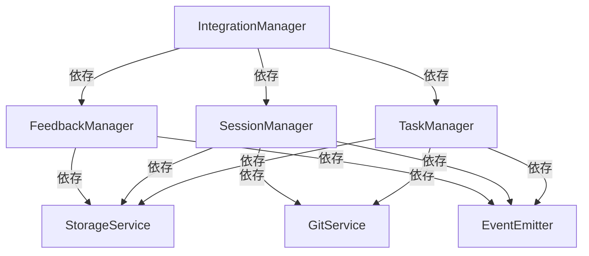
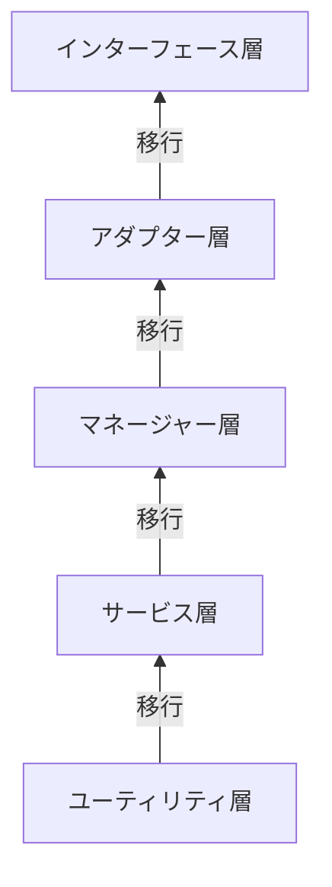
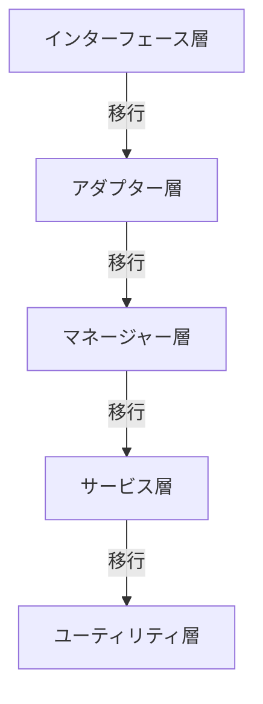
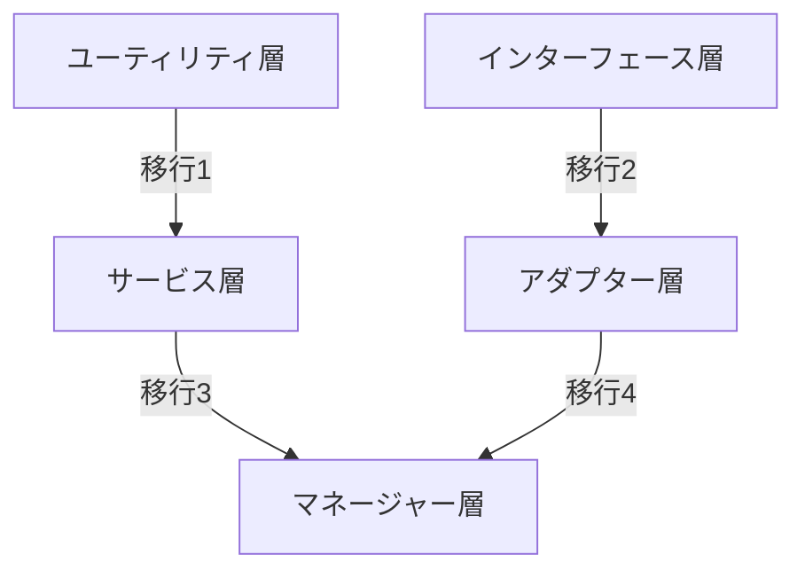

# 依存性注入移行ガイド

> **難易度: 上級** | 所要時間: 30分

既存のコードベースを依存性注入パターンに移行することは、コードの品質、保守性、テスト容易性を向上させるための重要なステップです。このガイドでは、既存コードを依存性注入パターンに移行するための体系的なアプローチを説明し、knoaプロジェクトでの実際の移行例を詳細に紹介します。

## 目次

- [1. 概要と移行の必要性](#1-概要と移行の必要性)
- [2. 既存コードの分析と依存関係の特定](#2-既存コードの分析と依存関係の特定)
- [3. 段階的な移行戦略](#3-段階的な移行戦略)
- [4. コンストラクタの修正パターン](#4-コンストラクタの修正パターン)
- [5. 後方互換性の維持](#5-後方互換性の維持)
- [6. リファクタリングのベストプラクティス](#6-リファクタリングのベストプラクティス)
- [7. よくある問題と解決策](#7-よくある問題と解決策)
- [8. knoaプロジェクトでの移行事例](#8-knoaプロジェクトでの移行事例)
- [9. 移行チェックリスト](#9-移行チェックリスト)
- [10. まとめと次のステップ](#10-まとめと次のステップ)

## 1. 概要と移行の必要性

### 1.1 依存性注入の利点の再確認

依存性注入（DI）パターンは、コンポーネント間の依存関係を外部から注入することで、以下の利点をもたらします：

- **疎結合**: コンポーネント間の結合度を下げ、変更の影響範囲を限定
- **テスト容易性**: モックやスタブを使用した単体テストが容易
- **柔軟性**: 実装の詳細を隠蔽し、インターフェースに依存
- **再利用性**: コンポーネントが特定の実装に依存しないため再利用しやすい
- **ライフサイクル管理**: コンポーネントのライフサイクルを一元管理

### 1.2 移行によって得られるメリット

既存コードを依存性注入パターンに移行することで、以下のメリットが得られます：

- **コードの品質向上**: 責任の明確化と単一責任の原則の適用
- **保守性の向上**: 変更の影響範囲が限定され、修正が容易に
- **テスト容易性の向上**: 依存関係をモックに置き換えることでテストが容易に
- **拡張性の向上**: 新機能の追加や既存機能の変更が容易に
- **開発効率の向上**: 並行開発が容易になり、開発速度が向上

### 1.3 移行のリスクと対策

移行には以下のリスクがありますが、適切な対策を講じることで軽減できます：

| リスク | 対策 |
|-------|------|
| 既存機能の回帰 | 包括的なテストスイートの作成、段階的な移行 |
| 移行中の部分的機能停止 | フィーチャーフラグによる切り替え、ロールバック手順の整備 |
| 移行の遅延 | 小さなタスクへの分割、優先順位の明確化、進捗の頻繁な確認 |
| テスト不足による品質低下 | テストギャップ分析、テスト強化の優先実施 |
| 開発者の知識不足 | 詳細なドキュメント、ペアプログラミング、知識共有セッション |

## 2. 既存コードの分析と依存関係の特定

### 2.1 依存関係の可視化手法

既存コードの依存関係を可視化するには、以下の手法が有効です：

1. **静的解析ツールの使用**: ESLintやTypeScriptなどの静的解析ツールを使用して依存関係を分析
2. **インポート/要求の分析**: ファイル内のimport文やrequire文を分析して依存関係を特定
3. **コンストラクタの分析**: クラスのコンストラクタを分析して、必要な依存関係を特定
4. **メソッド呼び出しの分析**: メソッド呼び出しを分析して、暗黙的な依存関係を特定

```javascript
// 依存関係の分析例
function analyzeDependencies(filePath) {
  const content = fs.readFileSync(filePath, 'utf8');
  const importRegex = /import\s+.*\s+from\s+['"](.*)['"];/g;
  const requireRegex = /require\(['"](.*)['"])/g;
  
  const imports = [];
  let match;
  
  while ((match = importRegex.exec(content)) !== null) {
    imports.push(match[1]);
  }
  
  while ((match = requireRegex.exec(content)) !== null) {
    imports.push(match[1]);
  }
  
  return imports;
}
```

### 2.2 依存関係グラフの作成

依存関係グラフを作成することで、コンポーネント間の関係を視覚化できます：



### 2.3 循環参照の特定

循環参照は、2つ以上のコンポーネントが互いに依存している状態です。これを特定するには：

1. 依存関係グラフを作成し、循環を検出
2. 実行時に循環参照を検出する仕組みを実装

```javascript
// 循環参照検出の例
class ServiceContainer {
  constructor() {
    this.services = new Map();
    this.factories = new Map();
    this.resolving = new Set(); // 解決中のサービスを追跡
  }
  
  get(name) {
    // 循環参照の検出
    if (this.resolving.has(name)) {
      throw new Error(`循環参照が検出されました: ${Array.from(this.resolving).join(' -> ')} -> ${name}`);
    }
    
    // 解決中のサービスとしてマーク
    this.resolving.add(name);
    
    try {
      // サービスの解決ロジック...
      return service;
    } finally {
      // 解決中のマークを解除
      this.resolving.delete(name);
    }
  }
}
```

## 3. 段階的な移行戦略

### 3.1 移行の優先順位付け

移行の優先順位を決定する際の考慮事項：

1. **依存関係の少ないコンポーネント**: 依存が少ないコンポーネントから移行すると影響範囲が限定される
2. **変更頻度の高いコンポーネント**: 頻繁に変更されるコンポーネントを優先すると早期にメリットを享受できる
3. **テストカバレッジの高いコンポーネント**: テストが充実しているコンポーネントは移行リスクが低い
4. **ビジネス価値の高いコンポーネント**: 重要なコンポーネントを優先すると投資対効果が高い

### 3.2 ボトムアップアプローチ

ボトムアップアプローチでは、依存関係の少ないコンポーネントから移行を開始します：



**メリット**:
- 依存関係の少ないコンポーネントから移行するため、影響範囲が限定される
- 基盤となるコンポーネントが先に改善されるため、上位層の移行が容易になる

**デメリット**:
- 全体的なメリットを享受するまでに時間がかかる
- 上位層と下位層の間で一時的な不整合が生じる可能性がある

### 3.3 トップダウンアプローチ

トップダウンアプローチでは、インターフェース層から移行を開始します：



**メリット**:
- 早期にユーザーインターフェースの改善が可能
- 全体的なアーキテクチャビジョンに基づいて移行できる

**デメリット**:
- 下位層の依存関係が解決されていないため、アダプターの作成が必要
- 一時的に複雑さが増す可能性がある

### 3.4 ハイブリッドアプローチ

ハイブリッドアプローチでは、ボトムアップとトップダウンを組み合わせます：



**メリット**:
- ボトムアップとトップダウンのメリットを組み合わせられる
- 並行して複数のチームが作業できる

**デメリット**:
- 調整が複雑になる可能性がある
- 一時的な不整合が生じる可能性がある

## 4. コンストラクタの修正パターン

### 4.1 個別パラメータからオプションオブジェクトへの変換

個別パラメータを使用するコンストラクタは、オプションオブジェクトパターンに変換することで、より柔軟で保守しやすくなります：

**変換前**:
```javascript
class TaskManager {
  constructor(storageService, eventEmitter, logger, errorHandler, gitService) {
    this.storageService = storageService;
    this.eventEmitter = eventEmitter;
    this.logger = logger;
    this.errorHandler = errorHandler;
    this.gitService = gitService;
  }
}

// 使用例
const taskManager = new TaskManager(
  storageService,
  eventEmitter,
  logger,
  errorHandler,
  gitService
);
```

**変換後**:
```javascript
class TaskManager {
  constructor(options) {
    // 必須依存関係の検証
    if (!options.storageService) throw new Error('storageService is required');
    if (!options.eventEmitter) throw new Error('eventEmitter is required');
    
    // 依存関係の設定
    this.storageService = options.storageService;
    this.eventEmitter = options.eventEmitter;
    this.errorHandler = options.errorHandler;
    this.gitService = options.gitService;
    this.logger = options.logger || console;
  }
}

// 使用例
const taskManager = new TaskManager({
  storageService,
  eventEmitter,
  errorHandler,
  gitService,
  logger
});
```

### 4.2 必須依存関係と任意依存関係の区別

依存関係を必須と任意に区別することで、コンポーネントの使用要件を明確にできます：

```javascript
class SessionManager {
  constructor(options) {
    // 必須依存関係の検証
    if (!options.storageService) throw new Error('storageService is required');
    if (!options.eventEmitter) throw new Error('eventEmitter is required');
    
    // 必須依存関係の設定
    this.storageService = options.storageService;
    this.eventEmitter = options.eventEmitter;
    
    // 任意依存関係の設定（デフォルト値あり）
    this.errorHandler = options.errorHandler || {
      handle: (error) => console.error('Error:', error)
    };
    this.logger = options.logger || console;
    this.gitService = options.gitService;
  }
}
```

### 4.3 デフォルト値の設定

デフォルト値を設定することで、任意の依存関係を柔軟に扱えます：

```javascript
class FeedbackManager {
  constructor(options = {}) {
    // デフォルト設定
    const defaults = {
      logger: console,
      debug: false,
      storageDir: 'feedback',
      maxRetries: 3
    };
    
    // オプションとデフォルトのマージ
    const settings = { ...defaults, ...options };
    
    // 必須依存関係の検証
    if (!settings.storageService) throw new Error('storageService is required');
    
    // 設定の適用
    this.storageService = settings.storageService;
    this.logger = settings.logger;
    this.debug = settings.debug;
    this.storageDir = settings.storageDir;
    this.maxRetries = settings.maxRetries;
  }
}
```

## 5. 後方互換性の維持

### 5.1 互換性レイヤーの作成

既存のAPIを維持しながら内部実装を変更するには、互換性レイヤーを作成します：

```javascript
// 古いAPI
function createTask(title, description, priority) {
  // 実装...
}

// 新しいAPI（依存性注入を使用）
class TaskManager {
  constructor(options) {
    this.storageService = options.storageService;
    // その他の依存関係...
  }
  
  createTask(taskData) {
    // 実装...
  }
}

// 互換性レイヤー
function createTask(title, description, priority) {
  const container = require('./service-container').getContainer();
  const taskManager = container.get('taskManager');
  
  return taskManager.createTask({
    title,
    description,
    priority
  });
}
```

### 5.2 段階的な移行のためのファサードパターン

ファサードパターンを使用して、新旧のAPIを橋渡しします：

```javascript
// ファサードクラス
class TaskManagerFacade {
  constructor() {
    this.container = require('./service-container').getContainer();
    this.legacyImplementation = require('./legacy-task-manager');
    this.useNewImplementation = process.env.USE_NEW_IMPLEMENTATION === 'true';
  }
  
  createTask(taskData) {
    if (this.useNewImplementation) {
      const taskManager = this.container.get('taskManager');
      return taskManager.createTask(taskData);
    } else {
      return this.legacyImplementation.createTask(
        taskData.title,
        taskData.description,
        taskData.priority
      );
    }
  }
  
  // 他のメソッド...
}
```

### 5.3 古いAPIと新しいAPIの共存

フィーチャーフラグを使用して、古いAPIと新しいAPIを共存させます：

```javascript
// フィーチャーフラグの設定
const config = {
  features: {
    useDependencyInjection: process.env.USE_DI === 'true'
  }
};

// フィーチャーフラグに基づいてAPIを選択
function getTaskManager() {
  if (config.features.useDependencyInjection) {
    const container = require('./service-container').getContainer();
    return container.get('taskManager');
  } else {
    return require('./legacy-task-manager');
  }
}

// 使用例
const taskManager = getTaskManager();
taskManager.createTask(/* ... */);
```

## 6. リファクタリングのベストプラクティス

### 6.1 単一責任の原則の適用

各クラスが単一の責任を持つように設計します：

**変更前**:
```javascript
class TaskManager {
  constructor() {
    // ...
  }
  
  // タスク管理
  createTask(taskData) { /* ... */ }
  updateTask(taskId, taskData) { /* ... */ }
  deleteTask(taskId) { /* ... */ }
  
  // ファイル操作
  readTaskFile() { /* ... */ }
  writeTaskFile(data) { /* ... */ }
  ensureTaskDirectory() { /* ... */ }
  
  // イベント処理
  emitTaskCreated(task) { /* ... */ }
  emitTaskUpdated(task) { /* ... */ }
  emitTaskDeleted(taskId) { /* ... */ }
}
```

**変更後**:
```javascript
// タスク管理の責任
class TaskManager {
  constructor(options) {
    this.storageService = options.storageService;
    this.eventEmitter = options.eventEmitter;
  }
  
  createTask(taskData) {
    const task = this._createTaskObject(taskData);
    this.storageService.writeJSON('tasks', 'task.json', task);
    this.eventEmitter.emit('task:created', task);
    return task;
  }
  
  // 他のタスク管理メソッド...
}

// ストレージの責任
class StorageService {
  readJSON(directory, filename) { /* ... */ }
  writeJSON(directory, filename, data) { /* ... */ }
  ensureDirectory(directory) { /* ... */ }
}

// イベント処理の責任
class EventEmitter {
  emit(event, data) { /* ... */ }
  on(event, callback) { /* ... */ }
}
```

### 6.2 テストカバレッジの確保

リファクタリング前後でテストカバレッジを維持または向上させます：

```javascript
// リファクタリング前のテスト
test('createTask should create a task', () => {
  const taskManager = new TaskManager();
  const task = taskManager.createTask({ title: 'Test Task' });
  
  expect(task).toHaveProperty('id');
  expect(task.title).toBe('Test Task');
  
  // ファイルが作成されたことを確認
  expect(fs.existsSync('./tasks/task.json')).toBe(true);
});

// リファクタリング後のテスト
test('createTask should create a task', () => {
  // モックの作成
  const mockStorageService = {
    writeJSON: jest.fn()
  };
  const mockEventEmitter = {
    emit: jest.fn()
  };
  
  // TaskManagerのインスタンス化
  const taskManager = new TaskManager({
    storageService: mockStorageService,
    eventEmitter: mockEventEmitter
  });
  
  // メソッドの実行
  const task = taskManager.createTask({ title: 'Test Task' });
  
  // 検証
  expect(task).toHaveProperty('id');
  expect(task.title).toBe('Test Task');
  
  // 依存サービスの呼び出しを検証
  expect(mockStorageService.writeJSON).toHaveBeenCalledWith(
    'tasks',
    'task.json',
    expect.objectContaining({ title: 'Test Task' })
  );
  expect(mockEventEmitter.emit).toHaveBeenCalledWith(
    'task:created',
    expect.objectContaining({ title: 'Test Task' })
  );
});
```

### 6.3 小さな変更の積み重ね

リファクタリングは小さな変更の積み重ねで行います：

1. **テストの作成**: 既存コードのテストを作成
2. **依存関係の抽出**: 依存関係を抽出してインターフェースを定義
3. **コンストラクタの修正**: コンストラクタをオプションオブジェクトパターンに変更
4. **依存関係の注入**: 依存関係を注入するように変更
5. **テストの更新**: テストを更新して依存関係をモックに置き換え
6. **サービス定義の作成**: サービスコンテナに登録するサービス定義を作成
7. **古いコードの削除**: 十分なテストと移行が完了したら古いコードを削除

### 6.4 コードレビューの重要性

リファクタリング中のコードレビューは特に重要です：

- **レビューチェックリスト**を作成して一貫したレビューを実施
- **ペアプログラミング**を活用して知識共有と品質向上
- **自動化されたコードチェック**を導入してコード品質を維持
- **段階的なレビュー**を実施して大きな変更を小さな単位で確認

## 7. よくある問題と解決策

### 7.1 循環参照の解決

循環参照は以下の方法で解決できます：

1. **依存関係の方向性の見直し**: 依存関係の方向を変更して循環を解消
2. **イベント駆動アーキテクチャの導入**: 直接的な依存関係をイベントベースの通信に置き換え
3. **インターフェースの導入**: 共通のインターフェースを導入して依存関係を逆転
4. **遅延初期化**: 必要になった時点で依存関係を解決

```javascript
// イベント駆動アーキテクチャによる循環参照の解決
class ServiceA {
  constructor(options) {
    this.eventEmitter = options.eventEmitter;
  }
  
  doSomething() {
    // 処理...
    this.eventEmitter.emit('serviceA:done', { result });
  }
}

class ServiceB {
  constructor(options) {
    this.eventEmitter = options.eventEmitter;
    
    // イベントリスナーの登録
    this.eventEmitter.on('serviceA:done', this.handleServiceADone.bind(this));
  }
  
  handleServiceADone(data) {
    // ServiceAの結果を処理...
  }
}
```

### 7.2 大きなクラスの分割

大きなクラスは以下の方法で分割できます：

1. **責任に基づく分割**: 単一責任の原則に基づいてクラスを分割
2. **ユーティリティクラスの抽出**: 共通機能をユーティリティクラスとして抽出
3. **コンポジションの活用**: 継承ではなくコンポジションを活用して機能を組み合わせ

```javascript
// 大きなクラスの分割例
// 変更前: 大きなSessionManagerクラス
class SessionManager {
  constructor() {
    // ...
  }
  
  // セッション管理
  startSession() { /* ... */ }
  endSession() { /* ... */ }
  
  // タスク管理
  addTaskToSession() { /* ... */ }
  removeTaskFromSession() { /* ... */ }
  
  // Git操作
  getCommitInfo() { /* ... */ }
  extractTaskIdsFromCommit() { /* ... */ }
  
  // ファイル操作
  readSessionFile() { /* ... */ }
  writeSessionFile() { /* ... */ }
}

// 変更後: 責任に基づいて分割
class SessionManager {
  constructor(options) {
    this.storageService = options.storageService;
    this.gitService = options.gitService;
    this.taskService = options.taskService;
  }
  
  startSession() { /* ... */ }
  endSession() { /* ... */ }
  addTaskToSession() { /* ... */ }
  removeTaskFromSession() { /* ... */ }
}

class GitService {
  getCommitInfo() { /* ... */ }
  extractTaskIdsFromCommit() { /* ... */ }
}

class StorageService {
  readJSON() { /* ... */ }
  writeJSON() { /* ... */ }
}

class TaskService {
  getTask() { /* ... */ }
  updateTask() { /* ... */ }
}
```

### 7.3 グローバル状態の排除

グローバル状態は以下の方法で排除できます：

1. **依存性注入の活用**: グローバル変数の代わりに依存性注入を使用
2. **コンテキストオブジェクトの導入**: 操作コンテキストを通じて状態を共有
3. **イベントベースの通信**: グローバル状態の代わりにイベントを使用して通信

```javascript
// グローバル状態の排除例
// 変更前: グローバル変数の使用
const globalConfig = {
  debug: true,
  basePath: '/path/to/base',
  apiKey: 'your-api-key'
};

class Service {
  constructor() {
    this.debug = globalConfig.debug;
    this.basePath = globalConfig.basePath;
  }
}

// 変更後: 依存性注入の使用
class Service {
  constructor(options) {
    this.debug = options.config.debug;
    this.basePath = options.config.basePath;
  }
}

// サービス定義
container.register('config', {
  debug: true,
  basePath: '/path/to/base',
  apiKey: 'your-api-key'
});

container.registerFactory('service', (container) => {
  return new Service({
    config: container.get('config')
  });
});
```

### 7.4 サービスロケーターからの脱却

サービスロケーターパターンは依存性注入パターンに置き換えることができます：

**変更前**:
```javascript
// サービスロケーターの使用
class ServiceLocator {
  static getInstance() {
    if (!ServiceLocator.instance) {
      ServiceLocator.instance = new ServiceLocator();
    }
    return ServiceLocator.instance;
  }
  
  constructor() {
    this.services = new Map();
  }
  
  register(name, service) {
    this.services.set(name, service);
  }
  
  get(name) {
    return this.services.get(name);
  }
}

class TaskManager {
  constructor() {
    // サービスロケーターからサービスを取得
    const locator = ServiceLocator.getInstance();
    this.storageService = locator.get('storageService');
    this.logger = locator.get('logger');
  }
}
```

**変更後**:
```javascript
// 依存性注入の使用
class TaskManager {
  constructor(options) {
    // 依存関係を外部から注入
    this.storageService = options.storageService;
    this.logger = options.logger || console;
  }
}

// サービス定義
container.registerFactory('taskManager', (container) => {
  return new TaskManager({
    storageService: container.get('storageService'),
    logger: container.get('logger')
  });
});
```

## 8. knoaプロジェクトでの移行事例

### 8.1 TaskManagerの移行例

knoaプロジェクトでのTaskManagerクラスの移行例を示します：

**移行前**:
```javascript
// src/utils/task-manager.js
const fs = require('fs');
const path = require('path');
const { v4: uuidv4 } = require('uuid');
const { EventEmitter } = require('../utils/event-emitter');

class TaskManager {
  constructor() {
    this.tasksDir = path.join(process.cwd(), 'ai-context', 'tasks');
    this.currentTasksPath = path.join(this.tasksDir, 'current-tasks.json');
    this.eventEmitter = new EventEmitter();
    
    // ディレクトリが存在しない場合は作成
    if (!fs.existsSync(this.tasksDir)) {
      fs.mkdirSync(this.tasksDir, { recursive: true });
    }
  }
  
  async createTask(taskData) {
    try {
      if (!taskData.title) {
        throw new Error('Task title is required');
      }
      
      // 現在のタスクを読み込む
      let currentTasks = { tasks: [] };
      if (fs.existsSync(this.currentTasksPath)) {
        const content = fs.readFileSync(this.currentTasksPath, 'utf8');
        currentTasks = JSON.parse(content);
      }
      
      // 新しいタスクを作成
      const task = {
        id: `T${String(currentTasks.tasks.length + 1).padStart(3, '0')}`,
        title: taskData.title,
        description: taskData.description || '',
        status: 'pending',
        createdAt: new Date().toISOString()
      };
      
      // タスクを追加
      currentTasks.tasks.push(task);
      
      // ファイルに保存
      fs.writeFileSync(this.currentTasksPath, JSON.stringify(currentTasks, null, 2), 'utf8');
      
      // イベントを発行
      this.eventEmitter.emit('task:created', task);
      
      return task;
    } catch (error) {
      console.error('Error creating task:', error);
      throw error;
    }
  }
  
  // 他のメソッド...
}

module.exports = { TaskManager };
```

**移行後**:
```javascript
// src/lib/managers/task-manager.js
const { v4: uuidv4 } = require('uuid');

class TaskManager {
  constructor(options) {
    // 必須依存関係の検証
    if (!options.storageService) throw new Error('storageService is required');
    if (!options.eventEmitter) throw new Error('eventEmitter is required');
    
    // 依存関係の設定
    this.storageService = options.storageService;
    this.eventEmitter = options.eventEmitter;
    this.errorHandler = options.errorHandler;
    this.gitService = options.gitService;
    this.logger = options.logger || console;
    
    // 設定
    this.tasksDir = 'tasks';
    this.currentTasksFile = 'current-tasks.json';
  }
  
  async createTask(taskData) {
    try {
      // バリデーション
      if (!taskData.title) {
        throw new Error('Task title is required');
      }
      
      // 現在のタスクを読み込む
      let currentTasks = await this.storageService.readJSON(this.tasksDir, this.currentTasksFile) || { tasks: [] };
      
      // 新しいタスクを作成
      const task = {
        id: `T${String(currentTasks.tasks.length + 1).padStart(3, '0')}`,
        title: taskData.title,
        description: taskData.description || '',
        status: 'pending',
        createdAt: new Date().toISOString()
      };
      
      // タスクを追加
      currentTasks.tasks.push(task);
      
      // ファイルに保存
      await this.storageService.writeJSON(this.tasksDir, this.currentTasksFile, currentTasks);
      
      // イベントを発行
      this.eventEmitter.emitStandardized('task', 'task_created', {
        taskId: task.id,
        title: task.title,
        status: task.status
      });
      
      this.logger.info(`Task created: ${task.id} - ${task.title}`);
      
      return task;
    } catch (error) {
      // エラー処理
      if (this.errorHandler) {
        return this.errorHandler.handle(error, 'TaskManager', 'createTask', { taskData });
      }
      
      this.logger.error('Error creating task:', error);
      throw error;
    }
  }
  
  // 他のメソッド...
}

module.exports = { TaskManager };
```

**サービス定義**:
```javascript
// src/lib/core/service-definitions.js
function registerManagerServices(container) {
  // TaskManagerの登録
  container.registerFactory('taskManager', (container) => {
    const storageService = container.get('storageService');
    const eventEmitter = container.get('eventEmitter');
    const errorHandler = container.get('errorHandler');
    const gitService = container.get('gitService');
    const logger = container.get('logger');
    
    return new TaskManager({
      storageService,
      eventEmitter,
      errorHandler,
      gitService,
      logger
    });
  });
  
  // 他のマネージャーの登録...
}
```

### 8.2 SessionManagerの移行例

knoaプロジェクトでのSessionManagerクラスの移行例を示します：

**移行前**:
```javascript
// src/utils/session-manager.js
const fs = require('fs');
const path = require('path');
const { v4: uuidv4 } = require('uuid');
const { EventEmitter } = require('../utils/event-emitter');

class SessionManager {
  constructor(options = {}) {
    this.sessionsDir = options.sessionsDir || path.join(process.cwd(), 'ai-context', 'sessions');
    this.templateDir = options.templateDir || path.join(process.cwd(), 'src', 'templates', 'docs');
    this.latestSessionPath = path.join(this.sessionsDir, 'latest-session.json');
    this.sessionHistoryDir = path.join(this.sessionsDir, 'session-history');
    this.eventEmitter = new EventEmitter();
    
    // ディレクトリが存在しない場合は作成
    if (!fs.existsSync(this.sessionHistoryDir)) {
      fs.mkdirSync(this.sessionHistoryDir, { recursive: true });
    }
  }
  
  // メソッド...
}
```

**移行後**:
```javascript
// src/lib/managers/session-manager.js
class SessionManager {
  constructor(options) {
    // 必須依存関係の検証
    if (!options.storageService) throw new Error('storageService is required');
    if (!options.eventEmitter) throw new Error('eventEmitter is required');
    
    // 依存関係の設定
    this.storageService = options.storageService;
    this.eventEmitter = options.eventEmitter;
    this.errorHandler = options.errorHandler;
    this.gitService = options.gitService;
    this.logger = options.logger || console;
    
    // 設定
    this.sessionsDir = 'sessions';
    this.latestSessionFile = 'latest-session.json';
    this.sessionHistoryDir = 'session-history';
    this.templateDir = options.templateDir || 'src/templates/docs';
    
    // ディレクトリの作成
    this.storageService.ensureDirectoryExists(this.sessionsDir);
    this.storageService.ensureDirectoryExists(this.sessionHistoryDir);
  }
  
  // メソッド...
}
```

### 8.3 IntegrationManagerの移行例

knoaプロジェクトでのIntegrationManagerクラスの移行例を示します：

**移行前**:
```javascript
// src/utils/integration-manager.js
const { TaskManager } = require('./task-manager');
const { SessionManager } = require('./session-manager');
const { FeedbackManager } = require('./feedback-manager');
const { EventEmitter } = require('./event-emitter');

class IntegrationManager {
  constructor(options = {}) {
    this.taskManager = options.taskManager || new TaskManager();
    this.sessionManager = options.sessionManager || new SessionManager();
    this.feedbackManager = options.feedbackManager || new FeedbackManager();
    this.eventEmitter = options.eventEmitter || new EventEmitter();
    
    // イベントリスナーの登録
    this._registerEventListeners();
  }
  
  _registerEventListeners() {
    this.eventEmitter.on('task:created', (task) => {
      this.sessionManager.addTaskToCurrentSession(task.id);
    });
    
    // 他のリスナー...
  }
  
  // メソッド...
}
```

**移行後**:
```javascript
// src/lib/managers/integration-manager.js
class IntegrationManager {
  constructor(options) {
    // 必須依存関係の検証
    if (!options.taskManager) throw new Error('taskManager is required');
    if (!options.sessionManager) throw new Error('sessionManager is required');
    if (!options.feedbackManager) throw new Error('feedbackManager is required');
    if (!options.eventEmitter) throw new Error('eventEmitter is required');
    
    // 依存関係の設定
    this.taskManager = options.taskManager;
    this.sessionManager = options.sessionManager;
    this.feedbackManager = options.feedbackManager;
    this.eventEmitter = options.eventEmitter;
    this.errorHandler = options.errorHandler;
    this.logger = options.logger || console;
    
    // イベントリスナーの登録
    this._registerEventListeners();
  }
  
  _registerEventListeners() {
    this.eventEmitter.on('task:task_created', (data) => {
      this.sessionManager.addTaskToCurrentSession(data.taskId);
    });
    
    // 他のリスナー...
  }
  
  // メソッド...
}
```

**サービス定義**:
```javascript
// src/lib/core/service-definitions.js
function registerManagerServices(container) {
  // 他のマネージャーの登録...
  
  // IntegrationManagerの登録
  container.registerFactory('integrationManager', (container) => {
    const taskManager = container.get('taskManager');
    const sessionManager = container.get('sessionManager');
    const feedbackManager = container.get('feedbackManager');
    const eventEmitter = container.get('eventEmitter');
    const errorHandler = container.get('errorHandler');
    const logger = container.get('logger');
    
    return new IntegrationManager({
      taskManager,
      sessionManager,
      feedbackManager,
      eventEmitter,
      errorHandler,
      logger
    });
  });
}
```

### 8.4 移行の教訓

knoaプロジェクトでの移行から得られた教訓：

1. **段階的なアプローチが効果的**: 一度にすべてを変更するのではなく、段階的に移行することで、リスクを最小限に抑えられました
2. **テストの重要性**: 十分なテストカバレッジがあることで、移行中の回帰バグを早期に発見できました
3. **コミュニケーションの重要性**: チーム全体が移行の目的と方法を理解していることが重要でした
4. **ドキュメントの整備**: 移行前後のアーキテクチャと移行手順を文書化することで、チームの理解が深まりました
5. **小さなコミット**: 小さな変更を積み重ねることで、レビューが容易になり、問題の特定が容易になりました

## 9. 移行チェックリスト

### 9.1 移行前の準備

- [ ] 既存コードの依存関係を分析し、依存関係グラフを作成
- [ ] 循環参照を特定し、解決策を検討
- [ ] テストカバレッジを確認し、不足している部分のテストを追加
- [ ] 移行の優先順位を決定
- [ ] 移行計画を作成し、チームと共有
- [ ] 必要なツールとライブラリを準備

### 9.2 移行中のチェックポイント

- [ ] 各コンポーネントの移行前にテストを作成
- [ ] コンストラクタをオプションオブジェクトパターンに変更
- [ ] 依存関係を外部から注入するように変更
- [ ] サービス定義を作成
- [ ] テストを更新して依存関係をモックに置き換え
- [ ] コードレビューを実施
- [ ] 移行したコンポーネントの動作を確認

### 9.3 移行後の検証

- [ ] すべてのテストが成功することを確認
- [ ] 統合テストを実行して全体の動作を確認
- [ ] パフォーマンスを測定して移行前と比較
- [ ] メモリ使用量を測定して移行前と比較
- [ ] ドキュメントを更新
- [ ] チームに移行の成果を共有
- [ ] 古いコードを削除

## 10. まとめと次のステップ

### 10.1 まとめ

依存性注入パターンへの移行は、コードの品質、保守性、テスト容易性を向上させるための重要なステップです。このガイドでは、既存コードを依存性注入パターンに移行するための体系的なアプローチを説明しました。

主なポイント：
- 依存関係の分析と可視化が移行の第一歩
- 段階的な移行戦略が効果的
- コンストラクタの修正パターンとしてオプションオブジェクトパターンが推奨
- 後方互換性の維持が重要
- リファクタリングのベストプラクティスを適用
- よくある問題と解決策を理解
- knoaプロジェクトでの実際の移行例から学ぶ
- 移行チェックリストを活用

### 10.2 次のステップ

依存性注入パターンへの移行が完了したら、以下のステップを検討してください：

1. **イベント駆動アーキテクチャの導入**: 依存性注入と組み合わせてさらに疎結合なアーキテクチャを実現
2. **リポジトリパターンの導入**: データアクセスを抽象化してさらに柔軟性を向上
3. **アダプターパターンの導入**: 外部システムとの連携を抽象化
4. **テスト自動化の強化**: 単体テスト、統合テスト、エンドツーエンドテストの自動化
5. **継続的インテグレーション/継続的デプロイメント（CI/CD）の導入**: 品質を維持しながら迅速にデプロイ
6. **パフォーマンス最適化**: 依存性注入のオーバーヘッドを最小化

## 関連ドキュメント

- [依存性注入アーキテクチャガイド](./dependency-injection-architecture-guide.md) - 依存性注入パターンの詳細な説明
- [依存性注入のベストプラクティス](./dependency-injection-best-practices.md) - 依存性注入パターンを効果的に使用するためのベストプラクティス
- [依存性注入のテストガイド](./dependency-injection-testing-guide.md) - 依存性注入パターンを使用したコードのテスト方法
- [依存性注入サンプルプロジェクトガイド](./dependency-injection-sample-project.md) - 完全な依存性注入実装を示すサンプルプロジェクト

## 次のステップ

依存性注入パターンへの移行について理解を深めるには、[依存性注入サンプルプロジェクトガイド](./dependency-injection-sample-project.md)を参照してください。このガイドでは、依存性注入パターンを使用した完全なサンプルプロジェクトを提供しています。