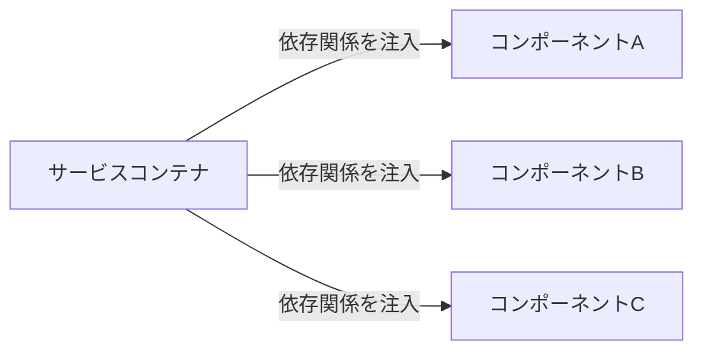

# 依存性注入 クイックスタートガイド

> **難易度: 基本** | 所要時間: 15分

このガイドでは、依存性注入パターンの基本概念と、本システムでの実装方法を簡潔に説明します。最小限の知識で基本的な依存性注入の実装と使用ができるようになることを目指します。

## 目次
- [1. 依存性注入とは](#1-依存性注入とは)
- [2. 基本的な依存関係の登録と解決](#2-基本的な依存関係の登録と解決)
- [3. よくある使用パターン](#3-よくある使用パターン)
- [4. 循環参照の問題と検出](#4-循環参照の問題と検出)
- [5. テスト時のモック作成](#5-テスト時のモック作成)
- [6. 次のステップ](#6-次のステップ)

## 1. 依存性注入とは

依存性注入（Dependency Injection）は、コンポーネント間の依存関係を外部から注入することで、コンポーネントの結合度を下げ、テスト容易性、柔軟性、再利用性を向上させるデザインパターンです。



### 主要コンポーネント

- **ServiceContainer**: サービスの登録と解決を担当するクラス
- **サービス定義**: アプリケーションで使用するサービスを定義するファイル
- **ファクトリー関数**: サービスのインスタンスを作成する関数

### 依存性注入の利点

1. **疎結合**: コンポーネント間の依存関係が明確になり、変更の影響範囲が限定される
2. **テスト容易性**: モックやスタブを使用して依存関係を置き換えることができ、単体テストが容易になる
3. **柔軟性**: 実装の詳細を隠蔽し、インターフェースに依存することで、実装の変更が容易になる
4. **再利用性**: コンポーネントが特定の実装に依存しないため、再利用しやすくなる
5. **ライフサイクル管理**: コンポーネントのライフサイクルを一元管理できる
6. **並行開発**: インターフェースが定義されていれば、複数の開発者が並行して作業できる

### 依存性注入の欠点

1. **複雑性の増加**: 依存性注入フレームワークの導入により、コードの複雑性が増加する場合がある
2. **学習コスト**: 依存性注入パターンを理解し、適切に使用するための学習コストがかかる
3. **オーバーヘッド**: サービス解決のオーバーヘッドが発生する可能性がある（ただし、本システムでは最適化されている）
4. **デバッグの難しさ**: 動的に依存関係が解決されるため、デバッグが難しくなる場合がある
5. **過剰な抽象化**: 不必要に多くの抽象化レイヤーを導入すると、コードが理解しにくくなる

> **ヒント**: 依存性注入の最大の利点は、コンポーネント間の疎結合を実現できることです。これにより、テストが容易になり、コードの保守性と拡張性が向上します。

## 2. 基本的な依存関係の登録と解決

### サービスコンテナの作成

```javascript
// サービスコンテナの作成
const { createContainer } = require('./lib/core/service-definitions');
const container = createContainer();
```

### 依存関係の登録

```javascript
// インスタンスの直接登録
container.register('logger', console);

// ファクトリー関数による登録
container.registerFactory('storageService', (container) => {
  const logger = container.get('logger');
  return new StorageService({ logger });
});
```

### 依存関係の解決

```javascript
// サービスの取得
const logger = container.get('logger');
const storageService = container.get('storageService');
```

## 3. よくある使用パターン

### コンストラクタインジェクション

```javascript
class TaskManager {
  constructor(options) {
    // 必須依存関係の検証
    if (!options.storageService) throw new Error('storageService is required');
    
    // 依存関係の設定
    this.storageService = options.storageService;
    this.logger = options.logger || console;
  }
  
  // メソッドの実装...
}

// 使用例
const taskManager = new TaskManager({
  storageService: container.get('storageService'),
  logger: container.get('logger')
});
```

### サービス定義ファイルでの登録

```javascript
// src/lib/core/service-definitions.js
function createContainer() {
  const container = new ServiceContainer();
  
  // 基本サービスの登録
  container.register('logger', console);
  container.register('config', require('../../config'));
  
  // ストレージサービスの登録
  container.registerFactory('storageService', (container) => {
    const logger = container.get('logger');
    const config = container.get('config');
    
    return new StorageService({
      basePath: config.basePath || process.cwd(),
      logger
    });
  });
  
  // タスクマネージャーの登録
  container.registerFactory('taskManager', (container) => {
    const storageService = container.get('storageService');
    const logger = container.get('logger');
    
    return new TaskManager({
      storageService,
      logger
    });
  });
  
  return container;
}
```

### CLIでの使用例

```javascript
// src/cli/task.js
const { createContainer } = require('../lib/core/service-definitions');

async function main() {
  try {
    // サービスコンテナを作成
    const container = createContainer();
    
    // タスクマネージャーを取得
    const taskManager = container.get('taskManager');
    
    // コマンドライン引数を解析
    const command = process.argv[2];
    
    // コマンドに応じた処理を実行
    switch (command) {
      case 'create':
        await taskManager.createTask({ title: process.argv[3] });
        break;
      case 'list':
        const tasks = await taskManager.listTasks();
        console.table(tasks);
        break;
      default:
        console.log('Unknown command');
        break;
    }
  } catch (error) {
    console.error('Error:', error.message);
    process.exit(1);
  }
}

main();
```

## 4. 循環参照の問題と検出

循環参照は、2つ以上のコンポーネントが互いに依存している場合に発生します。例えば、AがBに依存し、BがAに依存している場合です。


### 循環参照の問題点

1. **無限ループ**: サービス解決時に無限ループが発生する可能性がある
2. **メモリリーク**: 循環参照によりメモリリークが発生する可能性がある
3. **設計の問題**: 循環参照は通常、設計上の問題を示している

### 循環参照の検出

本システムのServiceContainerは、サービス解決時に循環参照を自動的に検出します：

```javascript
// src/lib/core/service-container.js
get(name) {
  // 循環参照の検出
  if (this.resolving.has(name)) {
    throw new Error(`循環参照が検出されました: ${Array.from(this.resolving).join(' -> ')} -> ${name}`);
  }
  
  // 解決中のサービスとしてマーク
  this.resolving.add(name);
  
  try {
    // ファクトリー関数を実行してインスタンスを作成
    const factory = this.factories.get(name);
    const instance = factory(this);
    
    // インスタンスをキャッシュ
    this.services.set(name, instance);
    
    return instance;
  } finally {
    // 解決中のマークを解除
    this.resolving.delete(name);
  }
}
```

### 循環参照の解決策

1. **依存関係の再設計**: 循環参照を解消するために依存関係を再設計する
2. **イベント駆動アーキテクチャの使用**: 直接的な依存関係をイベントベースの通信に置き換える
3. **インターフェースの導入**: 共通のインターフェースを導入し、依存関係を逆転させる

## 5. テスト時のモック作成

依存性注入パターンを使用することで、テストが容易になります。以下は、モックを使用したテストの例です：

### モックの作成

```javascript
// tests/helpers/mock-factory.js
function createMockStorageService() {
  return {
    readJSON: jest.fn().mockResolvedValue({ data: 'test' }),
    writeJSON: jest.fn().mockResolvedValue(true),
    fileExists: jest.fn().mockReturnValue(true),
    ensureDirectoryExists: jest.fn()
  };
}

function createMockLogger() {
  return {
    info: jest.fn(),
    warn: jest.fn(),
    error: jest.fn(),
    debug: jest.fn()
  };
}

module.exports = {
  createMockStorageService,
  createMockLogger
};
```

### テストでのモックの使用

```javascript
// tests/task-manager.test.js
const TaskManager = require('../src/lib/managers/task-manager');
const { createMockStorageService, createMockLogger } = require('./helpers/mock-factory');

describe('TaskManager', () => {
  let taskManager;
  let mockStorageService;
  let mockLogger;
  
  beforeEach(() => {
    // モックを作成
    mockStorageService = createMockStorageService();
    mockLogger = createMockLogger();
    
    // TaskManagerを作成
    taskManager = new TaskManager({
      storageService: mockStorageService,
      logger: mockLogger
    });
  });
  
  test('createTask should create a task', async () => {
    // テストデータ
    const taskData = { title: 'テストタスク' };
    
    // モックの振る舞いを設定
    mockStorageService.readJSON.mockResolvedValueOnce({ tasks: [] });
    
    // メソッドを実行
    const result = await taskManager.createTask(taskData);
    
    // 検証
    expect(result).toHaveProperty('id');
    expect(result.title).toBe('テストタスク');
    expect(mockStorageService.writeJSON).toHaveBeenCalled();
    expect(mockLogger.info).toHaveBeenCalled();
  });
  
  test('createTask should throw error when title is missing', async () => {
    // テストデータ
    const taskData = {}; // titleなし
    
    // メソッドを実行して例外をキャッチ
    await expect(taskManager.createTask(taskData)).rejects.toThrow('title is required');
    
    // 検証
    expect(mockStorageService.writeJSON).not.toHaveBeenCalled();
    expect(mockLogger.error).toHaveBeenCalled();
  });
});
```

### テスト用のサービスコンテナ

```javascript
// tests/helpers/test-container.js
const ServiceContainer = require('../../src/lib/core/service-container');
const { createMockStorageService, createMockLogger } = require('./mock-factory');

function createTestContainer() {
  const container = new ServiceContainer();
  
  // モックサービスを登録
  container.register('logger', createMockLogger());
  container.register('storageService', createMockStorageService());
  container.register('config', { basePath: '/tmp/test' });
  
  // 実際のサービスを登録（必要に応じて）
  container.registerFactory('taskManager', (container) => {
    const storageService = container.get('storageService');
    const logger = container.get('logger');
    
    return new TaskManager({
      storageService,
      logger
    });
  });
  
  return container;
}

module.exports = { createTestContainer };
```

## 6. 次のステップ

このクイックスタートガイドでは、依存性注入パターンの基本的な概念と使用方法を説明しました。より詳細な情報は以下のドキュメントを参照してください：

- [依存性注入アーキテクチャガイド](./dependency-injection-architecture-guide.md) - 依存性注入パターンの詳細な説明
- [開発者向けチートシート](./dependency-injection-cheatsheet.md) - よく使用される依存性注入パターンとコードスニペット
- [依存性注入のベストプラクティス](./dependency-injection-best-practices.md) - 依存性注入パターンを効果的に使用するためのベストプラクティス

## 関連ドキュメント

- [依存性注入のテストガイド](./dependency-injection-testing-guide.md) - 依存性注入パターンを使用したコードのテスト方法
- [依存性注入移行ガイド](./dependency-injection-migration-guide.md) - 既存コードを依存性注入パターンに移行する方法
- [依存性注入とイベント駆動アーキテクチャの統合ガイド](./dependency-injection-event-driven-integration.md) - 依存性注入とイベント駆動アーキテクチャの連携方法