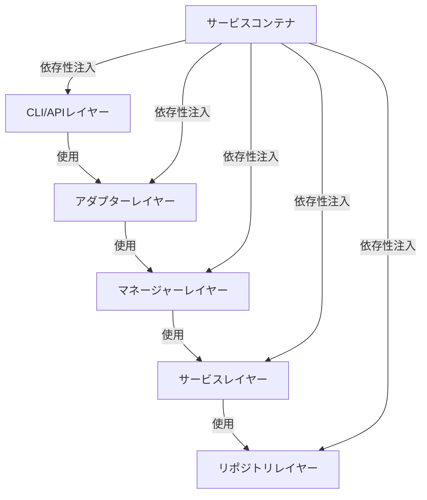
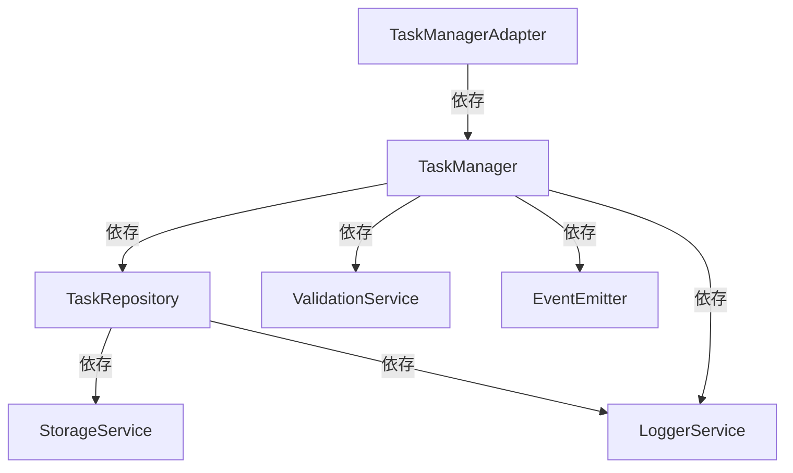

# 依存性注入サンプルプロジェクトガイド

> **難易度: 中級** | 所要時間: 25分

このガイドでは、依存性注入パターンを実践的に理解するための完全なサンプルプロジェクトを提供します。小規模ながら実用的な機能を持つプロジェクトを通じて、サービスコンテナの実装、サービス定義、コンポーネントの実装、テストの実装など、依存性注入の実際の使用方法を学ぶことができます。

## 目次

- [1. サンプルプロジェクトの概要](#1-サンプルプロジェクトの概要)
- [2. プロジェクト構造](#2-プロジェクト構造)
- [3. サービスコンテナの実装](#3-サービスコンテナの実装)
- [4. サービス定義の実装](#4-サービス定義の実装)
- [5. コンポーネントの実装](#5-コンポーネントの実装)
- [6. テストの実装](#6-テストの実装)
- [7. 実行方法と動作確認](#7-実行方法と動作確認)
- [8. 拡張と応用](#8-拡張と応用)
- [9. トラブルシューティング](#9-トラブルシューティング)
- [10. まとめと次のステップ](#10-まとめと次のステップ)

## 1. サンプルプロジェクトの概要

### 1.1 プロジェクトの目的と機能

このサンプルプロジェクトは、タスク管理システムの簡易版を実装しています。以下の機能を提供します：

- タスクの作成、取得、更新、削除（CRUD操作）
- タスクのカテゴリ分類
- タスクの優先度設定
- タスクの検索とフィルタリング
- タスク操作のイベント通知
- タスク統計の集計

このプロジェクトは、依存性注入パターンを使用して、コンポーネント間の疎結合を実現し、テスト容易性を向上させています。

### 1.2 アーキテクチャの概要

このプロジェクトは、以下の層から構成されています：



- **CLIレイヤー**: コマンドラインインターフェース
- **アダプターレイヤー**: 外部インターフェースとの連携
- **マネージャーレイヤー**: ビジネスロジック
- **サービスレイヤー**: 共通機能
- **リポジトリレイヤー**: データアクセス
- **サービスコンテナ**: 依存性注入の管理

### 1.3 主要コンポーネントの説明

- **TaskManager**: タスク管理のビジネスロジックを実装
- **TaskRepository**: タスクデータの永続化を担当
- **StorageService**: ファイルシステム操作を抽象化
- **EventEmitter**: イベントの発行と購読を管理
- **ValidationService**: データバリデーションを担当
- **LoggerService**: ログ出力を担当
- **TaskManagerAdapter**: TaskManagerの外部インターフェース
- **ServiceContainer**: 依存性注入コンテナ

## 2. プロジェクト構造

### 2.1 ディレクトリ構造

```
task-manager/
├── src/
│   ├── lib/
│   │   ├── core/
│   │   │   ├── service-container.js     # 依存性注入コンテナ
│   │   │   ├── service-definitions.js   # サービス定義
│   │   │   └── event-emitter.js         # イベントエミッター
│   │   ├── services/
│   │   │   ├── storage-service.js       # ストレージサービス
│   │   │   ├── validation-service.js    # バリデーションサービス
│   │   │   └── logger-service.js        # ロガーサービス
│   │   ├── repositories/
│   │   │   └── task-repository.js       # タスクリポジトリ
│   │   ├── managers/
│   │   │   └── task-manager.js          # タスクマネージャー
│   │   └── adapters/
│   │       └── task-manager-adapter.js  # タスクマネージャーアダプター
│   ├── cli/
│   │   └── task-cli.js                  # CLIエントリーポイント
│   └── index.js                         # アプリケーションエントリーポイント
├── tests/
│   ├── unit/
│   │   ├── core/
│   │   │   ├── service-container.test.js
│   │   │   └── event-emitter.test.js
│   │   ├── services/
│   │   │   ├── storage-service.test.js
│   │   │   └── validation-service.test.js
│   │   ├── repositories/
│   │   │   └── task-repository.test.js
│   │   └── managers/
│   │       └── task-manager.test.js
│   ├── integration/
│   │   └── task-manager-repository.test.js
│   └── helpers/
│       └── mock-factory.js              # テスト用モックファクトリー
├── data/
│   └── tasks/                           # タスクデータ保存ディレクトリ
├── package.json
└── README.md
```

### 2.2 ファイル構成

各ファイルの役割は以下の通りです：

- **service-container.js**: 依存性注入コンテナの実装
- **service-definitions.js**: サービス定義の実装
- **event-emitter.js**: イベントエミッターの実装
- **storage-service.js**: ファイルシステム操作の抽象化
- **validation-service.js**: データバリデーションの実装
- **logger-service.js**: ログ出力の実装
- **task-repository.js**: タスクデータの永続化
- **task-manager.js**: タスク管理のビジネスロジック
- **task-manager-adapter.js**: TaskManagerの外部インターフェース
- **task-cli.js**: コマンドラインインターフェース
- **index.js**: アプリケーションエントリーポイント

### 2.3 依存関係の概要

コンポーネント間の依存関係は以下の通りです：



## 3. サービスコンテナの実装

### 3.1 ServiceContainerクラスの実装

サービスコンテナは、依存性注入の中核となるコンポーネントです。サービスの登録、解決、ライフサイクル管理を担当します。

```javascript
// src/lib/core/service-container.js
class ServiceContainer {
  constructor() {
    this.services = new Map();      // 登録済みのサービスインスタンス
    this.factories = new Map();     // サービス作成用のファクトリー関数
    this.resolving = new Set();     // 現在解決中のサービス（循環参照検出用）
  }

  // サービスを登録
  register(name, instance) {
    this.services.set(name, instance);
    return this;
  }

  // ファクトリー関数を登録
  registerFactory(name, factory) {
    this.factories.set(name, factory);
    return this;
  }

  // サービスを取得
  get(name) {
    // 循環参照の検出
    if (this.resolving.has(name)) {
      throw new Error(`循環参照が検出されました: ${Array.from(this.resolving).join(' -> ')} -> ${name}`);
    }

    // サービスが既に登録されているか確認
    if (this.services.has(name)) {
      return this.services.get(name);
    }
    
    // ファクトリーが登録されているか確認
    if (this.factories.has(name)) {
      // 解決中のサービスとしてマーク
      this.resolving.add(name);
      
      try {
        // ファクトリー関数を実行してインスタンスを作成
        const factory = this.factories.get(name);
        const instance = factory(this);
        
        // インスタンスをキャッシュ
        this.services.set(name, instance);
        
        return instance;
      } finally {
        // 解決中のマークを解除
        this.resolving.delete(name);
      }
    }
    
    throw new Error(`サービス '${name}' が見つかりません`);
  }

  // サービスが登録されているか確認
  has(name) {
    return this.services.has(name) || this.factories.has(name);
  }

  // サービスを削除
  remove(name) {
    const serviceRemoved = this.services.delete(name);
    const factoryRemoved = this.factories.delete(name);
    return serviceRemoved || factoryRemoved;
  }

  // すべてのサービスをクリア
  clear() {
    this.services.clear();
    this.factories.clear();
    this.resolving.clear();
  }

  // 登録されているすべてのサービス名を取得
  getRegisteredServiceNames() {
    return [
      ...new Set([
        ...Array.from(this.services.keys()),
        ...Array.from(this.factories.keys())
      ])
    ];
  }
}

module.exports = { ServiceContainer };
```

### 3.2 依存関係の登録と解決の仕組み

サービスコンテナは、以下の2つの方法でサービスを登録します：

1. **直接登録（register）**: サービスのインスタンスを直接登録
2. **ファクトリー関数登録（registerFactory）**: サービスを作成するファクトリー関数を登録

サービスの解決は、以下の手順で行われます：

1. サービスが既に登録されているか確認
2. 登録されていない場合、ファクトリー関数が登録されているか確認
3. ファクトリー関数が登録されている場合、実行してインスタンスを作成
4. 作成したインスタンスをキャッシュして返す

### 3.3 循環参照の検出

循環参照は、2つ以上のコンポーネントが互いに依存している状態です。サービスコンテナは、サービス解決時に循環参照を検出します：

1. 解決中のサービスを `resolving` セットに追加
2. サービス解決後、セットから削除
3. 既に解決中のサービスが再度要求された場合、循環参照として検出

```javascript
// 循環参照の例
container.registerFactory('serviceA', (c) => {
  return {
    name: 'ServiceA',
    dependency: c.get('serviceB')
  };
});

container.registerFactory('serviceB', (c) => {
  return {
    name: 'ServiceB',
    dependency: c.get('serviceA') // 循環参照！
  };
});

// エラーが発生
try {
  container.get('serviceA');
} catch (error) {
  console.error(error.message); // "循環参照が検出されました: serviceA -> serviceB -> serviceA"
}
```

## 4. サービス定義の実装

### 4.1 サービス定義ファイルの構造

サービス定義ファイルは、アプリケーションで使用するサービスを定義し、依存関係を解決します：

```javascript
// src/lib/core/service-definitions.js
const { ServiceContainer } = require('./service-container');
const { EnhancedEventEmitter } = require('./event-emitter');
const { StorageService } = require('../services/storage-service');
const { ValidationService } = require('../services/validation-service');
const { LoggerService } = require('../services/logger-service');
const { TaskRepository } = require('../repositories/task-repository');
const { TaskManager } = require('../managers/task-manager');
const { TaskManagerAdapter } = require('../adapters/task-manager-adapter');

function createContainer() {
  const container = new ServiceContainer();
  
  // 基本サービスの登録
  registerBasicServices(container);
  
  // リポジトリの登録
  registerRepositories(container);
  
  // マネージャーの登録
  registerManagers(container);
  
  // アダプターの登録
  registerAdapters(container);
  
  return container;
}

function registerBasicServices(container) {
  // ロガーの登録
  container.registerFactory('logger', () => {
    return new LoggerService({
      level: process.env.LOG_LEVEL || 'info',
      prefix: 'task-manager'
    });
  });
  
  // 設定の登録
  container.register('config', {
    basePath: process.env.BASE_PATH || process.cwd(),
    tasksDir: 'data/tasks',
    debug: process.env.DEBUG === 'true'
  });
  
  // イベントエミッターの登録
  container.registerFactory('eventEmitter', (container) => {
    const logger = container.get('logger');
    const config = container.get('config');
    
    return new EnhancedEventEmitter({
      logger,
      debugMode: config.debug,
      keepHistory: true,
      historyLimit: 100
    });
  });
  
  // ストレージサービスの登録
  container.registerFactory('storageService', (container) => {
    const logger = container.get('logger');
    const config = container.get('config');
    
    return new StorageService({
      basePath: config.basePath,
      logger
    });
  });
  
  // バリデーションサービスの登録
  container.registerFactory('validationService', () => {
    return new ValidationService();
  });
}

function registerRepositories(container) {
  // タスクリポジトリの登録
  container.registerFactory('taskRepository', (container) => {
    const storageService = container.get('storageService');
    const logger = container.get('logger');
    const config = container.get('config');
    
    return new TaskRepository({
      storageService,
      logger,
      tasksDir: config.tasksDir
    });
  });
}

function registerManagers(container) {
  // タスクマネージャーの登録
  container.registerFactory('taskManager', (container) => {
    const taskRepository = container.get('taskRepository');
    const validationService = container.get('validationService');
    const eventEmitter = container.get('eventEmitter');
    const logger = container.get('logger');
    
    return new TaskManager({
      taskRepository,
      validationService,
      eventEmitter,
      logger
    });
  });
}

function registerAdapters(container) {
  // タスクマネージャーアダプターの登録
  container.registerFactory('taskManagerAdapter', (container) => {
    const taskManager = container.get('taskManager');
    const logger = container.get('logger');
    
    return new TaskManagerAdapter({
      taskManager,
      logger
    });
  });
}

module.exports = { createContainer };
```

### 4.2 基本サービスの登録

基本サービスは、アプリケーション全体で使用される共通のサービスです：

- **logger**: ログ出力を担当
- **config**: アプリケーション設定
- **eventEmitter**: イベントの発行と購読を管理
- **storageService**: ファイルシステム操作を抽象化
- **validationService**: データバリデーションを担当

### 4.3 リポジトリの登録

リポジトリは、データアクセスを担当するコンポーネントです：

- **taskRepository**: タスクデータの永続化を担当

### 4.4 マネージャーの登録

マネージャーは、ビジネスロジックを担当するコンポーネントです：

- **taskManager**: タスク管理のビジネスロジックを実装

### 4.5 アダプターの登録

アダプターは、外部インターフェースとの連携を担当するコンポーネントです：

- **taskManagerAdapter**: TaskManagerの外部インターフェース

## 5. コンポーネントの実装

### 5.1 イベントエミッターの実装

イベントエミッターは、コンポーネント間の通信を担当します：

```javascript
// src/lib/core/event-emitter.js
class EnhancedEventEmitter {
  constructor(options = {}) {
    this.listeners = new Map();
    this.wildcardListeners = [];
    this.logger = options.logger || console;
    this.debugMode = options.debugMode || false;
    this.keepHistory = options.keepHistory || false;
    this.historyLimit = options.historyLimit || 100;
    this.history = this.keepHistory ? [] : null;
  }

  // イベントリスナーの登録
  on(event, callback) {
    if (event.includes('*')) {
      // ワイルドカードリスナーとして登録
      const pattern = new RegExp('^' + event.replace('*', '.*') + '$');
      const wildcardListener = { pattern, callback };
      this.wildcardListeners.push(wildcardListener);
      
      return () => this.offWildcard(wildcardListener);
    } else {
      // 通常のリスナーとして登録
      if (!this.listeners.has(event)) {
        this.listeners.set(event, []);
      }
      
      this.listeners.get(event).push(callback);
      
      return () => this.off(event, callback);
    }
  }

  // イベントリスナーの削除
  off(event, callback) {
    if (!this.listeners.has(event)) {
      return false;
    }
    
    const listeners = this.listeners.get(event);
    const index = listeners.indexOf(callback);
    
    if (index === -1) {
      return false;
    }
    
    listeners.splice(index, 1);
    
    if (listeners.length === 0) {
      this.listeners.delete(event);
    }
    
    return true;
  }

  // ワイルドカードリスナーの削除
  offWildcard(wildcardListener) {
    const index = this.wildcardListeners.indexOf(wildcardListener);
    
    if (index === -1) {
      return false;
    }
    
    this.wildcardListeners.splice(index, 1);
    return true;
  }

  // イベントの発行
  emit(event, data) {
    const listeners = this.listeners.get(event) || [];
    
    // 通常のリスナーを呼び出し
    for (const callback of listeners) {
      try {
        callback(data);
      } catch (error) {
        this.logger.error(`Error in event listener for ${event}:`, error);
      }
    }
    
    // ワイルドカードリスナーを呼び出し
    for (const { pattern, callback } of this.wildcardListeners) {
      if (pattern.test(event)) {
        try {
          callback(data, event);
        } catch (error) {
          this.logger.error(`Error in wildcard listener for ${event}:`, error);
        }
      }
    }
    
    // イベント履歴の記録
    if (this.keepHistory) {
      this.history.push({
        event,
        data,
        timestamp: new Date().toISOString()
      });
      
      // 履歴の制限
      if (this.history.length > this.historyLimit) {
        this.history.shift();
      }
    }
    
    // デバッグモードの場合、イベントをログに出力
    if (this.debugMode) {
      this.logger.debug(`[EVENT] ${event}`, data);
    }
    
    return listeners.length > 0 || this.wildcardListeners.some(({ pattern }) => pattern.test(event));
  }

  // 標準化されたイベントの発行
  emitStandardized(component, action, data = {}) {
    const standardEvent = `${component}:${action}`;
    const timestamp = new Date().toISOString();
    const standardizedData = { ...data, timestamp, component, action };
    
    this.emit(standardEvent, standardizedData);
    
    // グローバルイベントも発行
    this.emit('event', { type: standardEvent, ...standardizedData });
  }

  // イベント履歴の取得
  getHistory() {
    return this.keepHistory ? [...this.history] : [];
  }

  // イベント履歴のクリア
  clearHistory() {
    if (this.keepHistory) {
      this.history = [];
    }
  }
}

module.exports = { EnhancedEventEmitter };
```

### 5.2 タスクリポジトリの実装

タスクリポジトリは、タスクデータの永続化を担当します：

```javascript
// src/lib/repositories/task-repository.js
class TaskRepository {
  constructor(options) {
    // 必須依存関係の検証
    if (!options.storageService) throw new Error('storageService is required');
    
    // 依存関係の設定
    this.storageService = options.storageService;
    this.logger = options.logger || console;
    
    // 設定
    this.tasksDir = options.tasksDir || 'data/tasks';
    this.tasksFile = 'tasks.json';
  }

  // すべてのタスクを取得
  async getAllTasks() {
    try {
      const data = this.storageService.readJSON(this.tasksDir, this.tasksFile) || { tasks: [] };
      return data.tasks;
    } catch (error) {
      this.logger.error('Failed to get all tasks:', error);
      throw new Error(`Failed to get all tasks: ${error.message}`);
    }
  }

  // IDでタスクを取得
  async getTaskById(id) {
    try {
      const tasks = await this.getAllTasks();
      return tasks.find(task => task.id === id) || null;
    } catch (error) {
      this.logger.error(`Failed to get task by id ${id}:`, error);
      throw new Error(`Failed to get task by id ${id}: ${error.message}`);
    }
  }

  // タスクの作成
  async createTask(taskData) {
    try {
      const data = this.storageService.readJSON(this.tasksDir, this.tasksFile) || { tasks: [] };
      
      // タスクIDの生成
      const taskId = `task-${Date.now()}-${Math.floor(Math.random() * 1000)}`;
      
      // 新しいタスクの作成
      const newTask = {
        id: taskId,
        ...taskData,
        createdAt: new Date().toISOString(),
        updatedAt: new Date().toISOString()
      };
      
      // タスクの追加
      data.tasks.push(newTask);
      
      // ファイルに保存
      this.storageService.writeJSON(this.tasksDir, this.tasksFile, data);
      
      return newTask;
    } catch (error) {
      this.logger.error('Failed to create task:', error);
      throw new Error(`Failed to create task: ${error.message}`);
    }
  }

  // タスクの更新
  async updateTask(id, taskData) {
    try {
      const data = this.storageService.readJSON(this.tasksDir, this.tasksFile) || { tasks: [] };
      const taskIndex = data.tasks.findIndex(task => task.id === id);
      
      if (taskIndex === -1) {
        throw new Error(`Task with id ${id} not found`);
      }
      
      // タスクの更新
      const updatedTask = {
        ...data.tasks[taskIndex],
        ...taskData,
        updatedAt: new Date().toISOString()
      };
      
      data.tasks[taskIndex] = updatedTask;
      
      // ファイルに保存
      this.storageService.writeJSON(this.tasksDir, this.tasksFile, data);
      
      return updatedTask;
    } catch (error) {
      this.logger.error(`Failed to update task ${id}:`, error);
      throw new Error(`Failed to update task ${id}: ${error.message}`);
    }
  }

  // タスクの削除
  async deleteTask(id) {
    try {
      const data = this.storageService.readJSON(this.tasksDir, this.tasksFile) || { tasks: [] };
      const taskIndex = data.tasks.findIndex(task => task.id === id);
      
      if (taskIndex === -1) {
        throw new Error(`Task with id ${id} not found`);
      }
      
      // タスクの削除
      const deletedTask = data.tasks[taskIndex];
      data.tasks.splice(taskIndex, 1);
      
      // ファイルに保存
      this.storageService.writeJSON(this.tasksDir, this.tasksFile, data);
      
      return deletedTask;
    } catch (error) {
      this.logger.error(`Failed to delete task ${id}:`, error);
      throw new Error(`Failed to delete task ${id}: ${error.message}`);
    }
  }
}

module.exports = { TaskRepository };
```

### 5.3 タスクマネージャーの実装

タスクマネージャーは、タスク管理のビジネスロジックを実装します：

```javascript
// src/lib/managers/task-manager.js
class TaskManager {
  constructor(options) {
    // 必須依存関係の検証
    if (!options.taskRepository) throw new Error('taskRepository is required');
    if (!options.validationService) throw new Error('validationService is required');
    
    // 依存関係の設定
    this.taskRepository = options.taskRepository;
    this.validationService = options.validationService;
    this.eventEmitter = options.eventEmitter;
    this.logger = options.logger || console;
  }

  // タスクの作成
  async createTask(taskData) {
    try {
      // バリデーション
      const validation = this.validationService.validateTask(taskData);
      
      if (!validation.isValid) {
        throw new Error(`Invalid task data: ${validation.errors.join(', ')}`);
      }
      
      // タスクの作成
      const task = await this.taskRepository.createTask(taskData);
      
      // イベントの発行
      if (this.eventEmitter) {
        this.eventEmitter.emitStandardized('task', 'created', {
          taskId: task.id,
          title: task.title
        });
      }
      
      this.logger.info(`Task created: ${task.id} - ${task.title}`);
      
      return task;
    } catch (error) {
      this.logger.error('Error creating task:', error);
      throw error;
    }
  }

  // タスクの取得
  async getTask(id) {
    try {
      const task = await this.taskRepository.getTaskById(id);
      
      if (!task) {
        throw new Error(`Task with id ${id} not found`);
      }
      
      return task;
    } catch (error) {
      this.logger.error(`Error getting task ${id}:`, error);
      throw error;
    }
  }

  // すべてのタスクの取得
  async getAllTasks() {
    try {
      return await this.taskRepository.getAllTasks();
    } catch (error) {
      this.logger.error('Error getting all tasks:', error);
      throw error;
    }
  }

  // タスクの更新
  async updateTask(id, taskData) {
    try {
      // タスクの存在確認
      const existingTask = await this.taskRepository.getTaskById(id);
      
      if (!existingTask) {
        throw new Error(`Task with id ${id} not found`);
      }
      
      // バリデーション
      const validation = this.validationService.validateTask({
        ...existingTask,
        ...taskData
      });
      
      if (!validation.isValid) {
        throw new Error(`Invalid task data: ${validation.errors.join(', ')}`);
      }
      
      // タスクの更新
      const updatedTask = await this.taskRepository.updateTask(id, taskData);
      
      // イベントの発行
      if (this.eventEmitter) {
        this.eventEmitter.emitStandardized('task', 'updated', {
          taskId: updatedTask.id,
          title: updatedTask.title,
          changes: Object.keys(taskData)
        });
      }
      
      this.logger.info(`Task updated: ${updatedTask.id} - ${updatedTask.title}`);
      
      return updatedTask;
    } catch (error) {
      this.logger.error(`Error updating task ${id}:`, error);
      throw error;
    }
  }

  // タスクの削除
  async deleteTask(id) {
    try {
      // タスクの存在確認
      const existingTask = await this.taskRepository.getTaskById(id);
      
      if (!existingTask) {
        throw new Error(`Task with id ${id} not found`);
      }
      
      // タスクの削除
      const deletedTask = await this.taskRepository.deleteTask(id);
      
      // イベントの発行
      if (this.eventEmitter) {
        this.eventEmitter.emitStandardized('task', 'deleted', {
          taskId: deletedTask.id,
          title: deletedTask.title
        });
      }
      
      this.logger.info(`Task deleted: ${deletedTask.id} - ${deletedTask.title}`);
      
      return deletedTask;
    } catch (error) {
      this.logger.error(`Error deleting task ${id}:`, error);
      throw error;
    }
  }
}

module.exports = { TaskManager };
```

## 6. テストの実装

### 6.1 単体テストの実装

単体テストは、個々のコンポーネントを独立してテストします：

```javascript
// tests/unit/managers/task-manager.test.js
const { TaskManager } = require('../../../src/lib/managers/task-manager');

describe('TaskManager', () => {
  let taskManager;
  let mockTaskRepository;
  let mockValidationService;
  let mockEventEmitter;
  let mockLogger;
  
  beforeEach(() => {
    // モックの作成
    mockTaskRepository = {
      getAllTasks: jest.fn(),
      getTaskById: jest.fn(),
      createTask: jest.fn(),
      updateTask: jest.fn(),
      deleteTask: jest.fn()
    };
    
    mockValidationService = {
      validateTask: jest.fn()
    };
    
    mockEventEmitter = {
      emitStandardized: jest.fn()
    };
    
    mockLogger = {
      info: jest.fn(),
      error: jest.fn(),
      debug: jest.fn(),
      warn: jest.fn()
    };
    
    // TaskManagerのインスタンス化
    taskManager = new TaskManager({
      taskRepository: mockTaskRepository,
      validationService: mockValidationService,
      eventEmitter: mockEventEmitter,
      logger: mockLogger
    });
  });
  
  describe('createTask', () => {
    test('should create a task when data is valid', async () => {
      // テストデータ
      const taskData = { title: 'Test Task' };
      const createdTask = { id: 'task-123', title: 'Test Task', createdAt: '2023-01-01T00:00:00.000Z' };
      
      // モックの振る舞いを設定
      mockValidationService.validateTask.mockReturnValue({ isValid: true, errors: [] });
      mockTaskRepository.createTask.mockResolvedValue(createdTask);
      
      // メソッドの実行
      const result = await taskManager.createTask(taskData);
      
      // 検証
      expect(result).toEqual(createdTask);
      expect(mockValidationService.validateTask).toHaveBeenCalledWith(taskData);
      expect(mockTaskRepository.createTask).toHaveBeenCalledWith(taskData);
      expect(mockEventEmitter.emitStandardized).toHaveBeenCalledWith('task', 'created', {
        taskId: createdTask.id,
        title: createdTask.title
      });
      expect(mockLogger.info).toHaveBeenCalled();
    });
    
    test('should throw an error when validation fails', async () => {
      // テストデータ
      const taskData = { title: '' };
      
      // モックの振る舞いを設定
      mockValidationService.validateTask.mockReturnValue({ isValid: false, errors: ['Title is required'] });
      
      // メソッドの実行と例外の検証
      await expect(taskManager.createTask(taskData)).rejects.toThrow('Invalid task data: Title is required');
      
      // 検証
      expect(mockValidationService.validateTask).toHaveBeenCalledWith(taskData);
      expect(mockTaskRepository.createTask).not.toHaveBeenCalled();
      expect(mockEventEmitter.emitStandardized).not.toHaveBeenCalled();
      expect(mockLogger.error).toHaveBeenCalled();
    });
  });
});
```

### 6.2 統合テストの実装

統合テストは、複数のコンポーネントを組み合わせてテストします：

```javascript
// tests/integration/task-manager-repository.test.js
const { ServiceContainer } = require('../../src/lib/core/service-container');
const { StorageService } = require('../../src/lib/services/storage-service');
const { ValidationService } = require('../../src/lib/services/validation-service');
const { TaskRepository } = require('../../src/lib/repositories/task-repository');
const { TaskManager } = require('../../src/lib/managers/task-manager');
const fs = require('fs');
const path = require('path');

describe('TaskManager and TaskRepository Integration', () => {
  let container;
  let taskManager;
  let taskRepository;
  let testDataDir;
  
  beforeEach(() => {
    // テスト用のディレクトリを作成
    testDataDir = path.join(__dirname, '..', 'temp-data');
    if (!fs.existsSync(testDataDir)) {
      fs.mkdirSync(testDataDir, { recursive: true });
    }
    
    // サービスコンテナの作成
    container = new ServiceContainer();
    
    // モックロガーの登録
    container.register('logger', {
      info: jest.fn(),
      error: jest.fn(),
      debug: jest.fn(),
      warn: jest.fn()
    });
    
    // 設定の登録
    container.register('config', {
      basePath: testDataDir,
      tasksDir: 'tasks'
    });
    
    // ストレージサービスの登録
    container.registerFactory('storageService', (c) => {
      return new StorageService({
        basePath: c.get('config').basePath,
        logger: c.get('logger')
      });
    });
    
    // バリデーションサービスの登録
    container.registerFactory('validationService', () => {
      return new ValidationService();
    });
    
    // タスクリポジトリの登録
    container.registerFactory('taskRepository', (c) => {
      return new TaskRepository({
        storageService: c.get('storageService'),
        logger: c.get('logger'),
        tasksDir: c.get('config').tasksDir
      });
    });
    
    // タスクマネージャーの登録
    container.registerFactory('taskManager', (c) => {
      return new TaskManager({
        taskRepository: c.get('taskRepository'),
        validationService: c.get('validationService'),
        logger: c.get('logger')
      });
    });
    
    // サービスの取得
    taskManager = container.get('taskManager');
    taskRepository = container.get('taskRepository');
  });
  
  afterEach(() => {
    // テストデータのクリーンアップ
    if (fs.existsSync(testDataDir)) {
      fs.rmSync(testDataDir, { recursive: true, force: true });
    }
  });
  
  test('should create and retrieve a task', async () => {
    // タスクの作成
    const taskData = {
      title: 'Integration Test Task',
      description: 'This is a test task',
      priority: 'high',
      category: 'test'
    };
    
    const createdTask = await taskManager.createTask(taskData);
    
    // 検証
    expect(createdTask).toHaveProperty('id');
    expect(createdTask.title).toBe(taskData.title);
    expect(createdTask.description).toBe(taskData.description);
    expect(createdTask.priority).toBe(taskData.priority);
    expect(createdTask.category).toBe(taskData.category);
    
    // タスクの取得
    const retrievedTask = await taskManager.getTask(createdTask.id);
    
    // 検証
    expect(retrievedTask).toEqual(createdTask);
  });
});
```

## 7. 実行方法と動作確認

### 7.1 プロジェクトのセットアップ

プロジェクトをセットアップするには、以下の手順を実行します：

1. プロジェクトディレクトリを作成します：

```bash
mkdir task-manager
cd task-manager
```

2. package.jsonを作成します：

```bash
npm init -y
```

3. 必要なパッケージをインストールします：

```bash
npm install --save jest
```

4. package.jsonにスクリプトを追加します：

```json
{
  "scripts": {
    "start": "node src/index.js",
    "cli": "node src/cli/task-cli.js",
    "test": "jest",
    "test:watch": "jest --watch",
    "test:coverage": "jest --coverage"
  }
}
```

5. ディレクトリ構造を作成します：

```bash
mkdir -p src/lib/core src/lib/services src/lib/repositories src/lib/managers src/lib/adapters src/cli data/tasks tests/unit/core tests/unit/services tests/unit/repositories tests/unit/managers tests/integration tests/helpers
```

6. 前述のコードを各ファイルに実装します。

### 7.2 実行コマンド

プロジェクトを実行するには、以下のコマンドを使用します：

1. アプリケーションを起動します：

```bash
npm start
```

2. CLIを使用してタスクを管理します：

```bash
# タスクの作成
npm run cli create "タスクのタイトル" "タスクの説明" "high" "仕事"

# タスク一覧の取得
npm run cli list

# タスクの取得
npm run cli get task-123456789

# タスクの更新
npm run cli update task-123456789 "更新されたタイトル" "更新された説明" "medium" "プライベート"

# タスクの削除
npm run cli delete task-123456789
```

3. テストを実行します：

```bash
# すべてのテストを実行
npm test

# テストをウォッチモードで実行
npm run test:watch

# テストカバレッジを取得
npm run test:coverage
```

## 8. 拡張と応用

### 8.1 新しいコンポーネントの追加方法

新しいコンポーネントを追加するには、以下の手順を実行します：

1. コンポーネントのクラスを作成します
2. サービス定義に追加します
3. テストを作成します

### 8.2 既存コンポーネントの修正方法

既存のコンポーネントを修正するには、以下の手順を実行します：

1. コンポーネントのクラスを修正します
2. 必要に応じてサービス定義を更新します
3. テストを更新します

### 8.3 高度な使用パターン

高度な使用パターンとして、以下のものがあります：

1. **スコープ付きコンテナ**: リクエストごとにスコープ付きコンテナを作成
2. **タグ付け**: サービスにタグを付けて、タグでサービスを取得
3. **デコレーター**: 既存のサービスをデコレートして機能を拡張

## 9. トラブルシューティング

### 9.1 よくあるエラーと解決策

1. **サービスが見つからない**:
   - サービス名のスペルミスを確認
   - サービス定義が正しく登録されているか確認

2. **循環参照エラー**:
   - 依存関係のグラフを確認
   - イベント駆動アーキテクチャを使用して循環参照を解消

3. **テストが失敗する**:
   - モックが正しく設定されているか確認
   - 非同期処理が正しく処理されているか確認

### 9.2 デバッグ方法

1. **ログの活用**: ログレベルを変更して詳細なログを出力
2. **デバッガーの使用**: Node.jsのデバッガーを使用
3. **サービスコンテナの検査**: 登録されているサービスを確認

## 10. まとめと次のステップ

### 10.1 まとめ

このサンプルプロジェクトでは、依存性注入パターンを使用したタスク管理システムを実装しました。主なコンポーネントとして、サービスコンテナ、サービス定義、イベントエミッター、タスクリポジトリ、タスクマネージャー、タスクマネージャーアダプターを実装しました。

依存性注入パターンを使用することで、以下のメリットが得られました：

1. **疎結合**: コンポーネント間の結合度が低くなり、変更の影響範囲が限定される
2. **テスト容易性**: モックを使用して依存関係を置き換えることができ、単体テストが容易になる
3. **柔軟性**: 実装の詳細を隠蔽し、インターフェースに依存することで、実装の変更が容易になる
4. **再利用性**: コンポーネントが特定の実装に依存しないため、再利用しやすくなる

### 10.2 次のステップ

このサンプルプロジェクトを拡張するには、以下のステップを検討してください：

1. **データベース統合**: ファイルベースのストレージからデータベースへの移行
2. **APIの実装**: RESTful APIの実装
3. **ユーザー認証**: ユーザー認証の実装
4. **フロントエンドの実装**: Webフロントエンドの実装
5. **コンテナ化**: Dockerを使用したコンテナ化

## 関連ドキュメント

- [依存性注入アーキテクチャガイド](./dependency-injection-architecture-guide.md) - 依存性注入パターンの詳細な説明
- [依存性注入のベストプラクティス](./dependency-injection-best-practices.md) - 依存性注入パターンを効果的に使用するためのベストプラクティス
- [依存性注入のテストガイド](./dependency-injection-testing-guide.md) - 依存性注入パターンを使用したコードのテスト方法
- [依存性注入移行ガイド](./dependency-injection-migration-guide.md) - 既存コードを依存性注入パターンに移行する方法

## 次のステップ

依存性注入パターンについてさらに学ぶには、[依存性注入アーキテクチャガイド](./dependency-injection-architecture-guide.md)を参照してください。既存のコードを依存性注入パターンに移行する方法については、[依存性注入移行ガイド](./dependency-injection-migration-guide.md)を参照してください。
