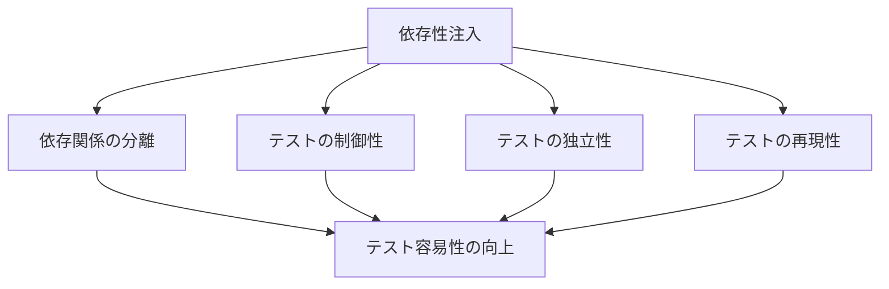
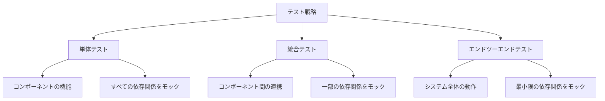
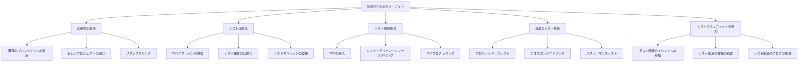

# 依存性注入のテストガイド

> **難易度: 中級** | 所要時間: 25分

このガイドでは、依存性注入パターンを使用したコードのテスト方法について説明します。依存性注入の主なメリットの一つはテスト容易性ですが、効果的にテストするためには適切なアプローチが必要です。

## 目次

- [1. 依存性注入とテスト容易性](#1-依存性注入とテスト容易性)
- [2. テスト戦略](#2-テスト戦略)
- [3. モックの作成](#3-モックの作成)
- [4. 単体テスト](#4-単体テスト)
- [5. 統合テスト](#5-統合テスト)
- [6. エンドツーエンドテスト](#6-エンドツーエンドテスト)
- [7. テスト環境の構築](#7-テスト環境の構築)
- [8. テストヘルパー](#8-テストヘルパー)
- [9. テストカバレッジ](#9-テストカバレッジ)
- [10. よくある問題と解決策](#10-よくある問題と解決策)
- [11. まとめと次のステップ](#11-まとめと次のステップ)

## 1. 依存性注入とテスト容易性

依存性注入パターンは、コンポーネントの依存関係を外部から注入することで、テスト容易性を向上させます。これにより、以下のメリットが得られます：

1. **依存関係の分離**: コンポーネントとその依存関係を分離できるため、依存関係をモックに置き換えやすくなります
2. **テストの制御性**: テスト時に依存関係の振る舞いを制御できるため、様々なシナリオをテストできます
3. **テストの独立性**: 各コンポーネントを独立してテストできるため、テストの実行が高速になります
4. **テストの再現性**: 依存関係をモックに置き換えることで、テストの再現性が向上します



## 2. テスト戦略

依存性注入パターンを使用したコードのテスト戦略は、以下の3つのレベルで構成されます：

### 2.1 単体テスト

単体テストでは、個々のコンポーネントを独立してテストします。依存関係はすべてモックに置き換えます。

**目的**:
- コンポーネントの機能が正しく動作することを確認する
- エッジケースやエラーケースを検証する
- コードカバレッジを向上させる

**特徴**:
- 高速に実行できる
- 依存関係をすべてモックに置き換える
- テストの粒度が細かい

### 2.2 統合テスト

統合テストでは、複数のコンポーネントを組み合わせてテストします。一部の依存関係は実際のコンポーネントを使用し、外部システムへの依存関係はモックに置き換えます。

**目的**:
- コンポーネント間の連携が正しく動作することを確認する
- 依存性注入の設定が正しいことを確認する
- 実際のユースケースをテストする

**特徴**:
- 単体テストよりも実行時間が長い
- 一部の依存関係は実際のコンポーネントを使用する
- テストの粒度が中程度

### 2.3 エンドツーエンドテスト

エンドツーエンドテストでは、システム全体を実際の環境に近い状態でテストします。依存関係はできるだけ実際のコンポーネントを使用し、外部システムへの依存関係のみをモックに置き換えます。

**目的**:
- システム全体が正しく動作することを確認する
- 実際のユーザーシナリオをテストする
- 統合ポイントの問題を検出する

**特徴**:
- 実行時間が長い
- ほとんどの依存関係は実際のコンポーネントを使用する
- テストの粒度が粗い



## 3. モックの作成

依存性注入パターンを使用したコードのテストでは、依存関係をモックに置き換えることが重要です。モックの作成方法は以下の通りです：

### 3.1 手動モック

手動モックは、依存関係のインターフェースを実装したモッククラスを作成する方法です。

```javascript
// 手動モックの例
class MockStorageService {
  constructor() {
    this.data = {};
  }
  
  readJSON(directory, filename) {
    const key = `${directory}/${filename}`;
    return Promise.resolve(this.data[key] || null);
  }
  
  writeJSON(directory, filename, data) {
    const key = `${directory}/${filename}`;
    this.data[key] = data;
    return Promise.resolve(true);
  }
  
  fileExists(path) {
    return Promise.resolve(this.data[path] !== undefined);
  }
  
  ensureDirectoryExists(directory) {
    return Promise.resolve(true);
  }
}
```

### 3.2 Jest モック

Jest のモック機能を使用して、依存関係をモックに置き換えることができます。

```javascript
// Jest モックの例
const mockStorageService = {
  readJSON: jest.fn().mockResolvedValue({ tasks: [] }),
  writeJSON: jest.fn().mockResolvedValue(true),
  fileExists: jest.fn().mockResolvedValue(true),
  ensureDirectoryExists: jest.fn().mockResolvedValue(true)
};

// モックの振る舞いを設定
mockStorageService.readJSON.mockResolvedValueOnce({ tasks: [{ id: 'task1', title: 'Test Task' }] });
```

### 3.3 Sinon モック

Sinon のモック機能を使用して、依存関係をモックに置き換えることもできます。

```javascript
// Sinon モックの例
const mockStorageService = {
  readJSON: sinon.stub().resolves({ tasks: [] }),
  writeJSON: sinon.stub().resolves(true),
  fileExists: sinon.stub().resolves(true),
  ensureDirectoryExists: sinon.stub().resolves(true)
};

// モックの振る舞いを設定
mockStorageService.readJSON.withArgs('tasks', 'current-tasks.json').resolves({ tasks: [{ id: 'task1', title: 'Test Task' }] });
```

### 3.4 モックファクトリー

モックファクトリーを作成して、テストで使用するモックを一元管理することができます。

```javascript
// モックファクトリーの例
function createMockStorageService(options = {}) {
  return {
    readJSON: jest.fn().mockImplementation((directory, filename) => {
      const key = `${directory}/${filename}`;
      return Promise.resolve(options.data?.[key] || null);
    }),
    writeJSON: jest.fn().mockResolvedValue(true),
    fileExists: jest.fn().mockResolvedValue(true),
    ensureDirectoryExists: jest.fn().mockResolvedValue(true)
  };
}

function createMockEventEmitter(options = {}) {
  return {
    emit: jest.fn(),
    on: jest.fn(),
    off: jest.fn(),
    emitStandardized: jest.fn(),
    emitError: jest.fn(),
    createContext: jest.fn().mockReturnValue({
      id: 'test-context',
      start: jest.fn().mockReturnThis(),
      complete: jest.fn().mockReturnThis(),
      fail: jest.fn().mockReturnThis(),
      setData: jest.fn().mockReturnThis()
    })
  };
}

function createMockErrorHandler(options = {}) {
  return {
    handle: jest.fn().mockReturnValue({
      error: true,
      message: options.errorMessage || 'Test error',
      code: options.errorCode || 'TEST_ERROR',
      operation: options.operation || 'test',
      timestamp: new Date().toISOString()
    })
  };
}
```

## 4. 単体テスト

依存性注入パターンを使用したコードの単体テストの例を示します。

### 4.1 コンポーネントの単体テスト

```javascript
// TaskManagerの単体テスト
describe('TaskManager', () => {
  let taskManager;
  let mockStorageService;
  let mockEventEmitter;
  let mockErrorHandler;
  
  beforeEach(() => {
    // モックの作成
    mockStorageService = createMockStorageService();
    mockEventEmitter = createMockEventEmitter();
    mockErrorHandler = createMockErrorHandler();
    
    // TaskManagerのインスタンス化
    taskManager = new TaskManager({
      storageService: mockStorageService,
      eventEmitter: mockEventEmitter,
      errorHandler: mockErrorHandler,
      logger: console
    });
  });
  
  test('createTask should create a task and emit event', async () => {
    // テストの準備
    const taskData = { title: 'Test Task' };
    mockStorageService.readJSON.mockResolvedValue({ tasks: [] });
    
    // メソッドの実行
    const result = await taskManager.createTask(taskData);
    
    // 結果の検証
    expect(result).toHaveProperty('id');
    expect(result).toHaveProperty('title', 'Test Task');
    
    // ストレージサービスの呼び出しを検証
    expect(mockStorageService.readJSON).toHaveBeenCalledWith('tasks', 'current-tasks.json');
    expect(mockStorageService.writeJSON).toHaveBeenCalledWith(
      'tasks',
      'current-tasks.json',
      expect.objectContaining({
        tasks: expect.arrayContaining([
          expect.objectContaining({
            id: expect.any(String),
            title: 'Test Task'
          })
        ])
      })
    );
    
    // イベントの発行を検証
    expect(mockEventEmitter.emitStandardized).toHaveBeenCalledWith(
      'task',
      'task_created',
      expect.objectContaining({
        taskId: expect.any(String),
        title: 'Test Task'
      })
    );
  });
  
  test('createTask should handle errors', async () => {
    // テストの準備
    const taskData = { title: 'Test Task' };
    const testError = new Error('Test error');
    mockStorageService.readJSON.mockRejectedValue(testError);
    
    // メソッドの実行
    const result = await taskManager.createTask(taskData);
    
    // 結果の検証
    expect(result).toHaveProperty('error', true);
    expect(result).toHaveProperty('message', 'Test error');
    
    // エラーハンドラーの呼び出しを検証
    expect(mockErrorHandler.handle).toHaveBeenCalledWith(
      testError,
      'TaskManager',
      'createTask',
      expect.any(Object)
    );
  });
  
  test('getTask should return a task by id', async () => {
    // テストの準備
    const taskId = 'task1';
    mockStorageService.readJSON.mockResolvedValue({
      tasks: [
        { id: 'task1', title: 'Test Task 1' },
        { id: 'task2', title: 'Test Task 2' }
      ]
    });
    
    // メソッドの実行
    const result = await taskManager.getTask(taskId);
    
    // 結果の検証
    expect(result).toHaveProperty('id', 'task1');
    expect(result).toHaveProperty('title', 'Test Task 1');
    
    // ストレージサービスの呼び出しを検証
    expect(mockStorageService.readJSON).toHaveBeenCalledWith('tasks', 'current-tasks.json');
  });
  
  test('getTask should return null for non-existent task', async () => {
    // テストの準備
    const taskId = 'non-existent';
    mockStorageService.readJSON.mockResolvedValue({
      tasks: [
        { id: 'task1', title: 'Test Task 1' },
        { id: 'task2', title: 'Test Task 2' }
      ]
    });
    
    // メソッドの実行
    const result = await taskManager.getTask(taskId);
    
    // 結果の検証
    expect(result).toBeNull();
    
    // ストレージサービスの呼び出しを検証
    expect(mockStorageService.readJSON).toHaveBeenCalledWith('tasks', 'current-tasks.json');
  });
});
```

### 4.2 サービスコンテナの単体テスト

```javascript
// ServiceContainerの単体テスト
describe('ServiceContainer', () => {
  let container;
  
  beforeEach(() => {
    container = new ServiceContainer();
  });
  
  test('register should register a service', () => {
    // テストの準備
    const service = { name: 'test-service' };
    
    // メソッドの実行
    container.register('testService', service);
    
    // 結果の検証
    expect(container.has('testService')).toBe(true);
    expect(container.get('testService')).toBe(service);
  });
  
  test('registerFactory should register a factory function', () => {
    // テストの準備
    const factory = jest.fn().mockReturnValue({ name: 'test-service' });
    
    // メソッドの実行
    container.registerFactory('testService', factory);
    
    // 結果の検証
    expect(container.has('testService')).toBe(true);
    
    // ファクトリー関数の呼び出しを検証
    const service = container.get('testService');
    expect(factory).toHaveBeenCalledWith(container);
    expect(service).toHaveProperty('name', 'test-service');
  });
  
  test('get should throw an error for non-existent service', () => {
    // メソッドの実行と例外の検証
    expect(() => container.get('nonExistentService')).toThrow();
  });
  
  test('get should detect circular dependencies', () => {
    // テストの準備
    container.registerFactory('serviceA', (c) => c.get('serviceB'));
    container.registerFactory('serviceB', (c) => c.get('serviceA'));
    
    // メソッドの実行と例外の検証
    expect(() => container.get('serviceA')).toThrow(/循環参照/);
  });
  
  test('remove should remove a service', () => {
    // テストの準備
    const service = { name: 'test-service' };
    container.register('testService', service);
    
    // メソッドの実行
    const result = container.remove('testService');
    
    // 結果の検証
    expect(result).toBe(true);
    expect(container.has('testService')).toBe(false);
    expect(() => container.get('testService')).toThrow();
  });
  
  test('clear should remove all services', () => {
    // テストの準備
    container.register('serviceA', { name: 'service-a' });
    container.register('serviceB', { name: 'service-b' });
    
    // メソッドの実行
    container.clear();
    
    // 結果の検証
    expect(container.has('serviceA')).toBe(false);
    expect(container.has('serviceB')).toBe(false);
  });
  
  test('getRegisteredServiceNames should return all service names', () => {
    // テストの準備
    container.register('serviceA', { name: 'service-a' });
    container.registerFactory('serviceB', () => ({ name: 'service-b' }));
    
    // メソッドの実行
    const serviceNames = container.getRegisteredServiceNames();
    
    // 結果の検証
    expect(serviceNames).toContain('serviceA');
    expect(serviceNames).toContain('serviceB');
    expect(serviceNames.length).toBe(2);
  });
});
```

## 5. 統合テスト

依存性注入パターンを使用したコードの統合テストの例を示します。

### 5.1 コンポーネント間の統合テスト

```javascript
// TaskManagerとSessionManagerの統合テスト
describe('TaskManager and SessionManager Integration', () => {
  let container;
  let taskManager;
  let sessionManager;
  let mockStorageService;
  
  beforeEach(() => {
    // サービスコンテナの作成
    container = new ServiceContainer();
    
    // モックの作成
    mockStorageService = createMockStorageService({
      data: {
        'sessions/current-session.json': {
          id: 'session1',
          name: 'Test Session',
          tasks: []
        },
        'tasks/current-tasks.json': {
          tasks: []
        }
      }
    });
    
    // サービスの登録
    container.register('storageService', mockStorageService);
    container.register('eventEmitter', createMockEventEmitter());
    container.register('errorHandler', createMockErrorHandler());
    container.register('logger', console);
    
    // マネージャーの登録
    container.registerFactory('taskManager', (c) => {
      return new TaskManager({
        storageService: c.get('storageService'),
        eventEmitter: c.get('eventEmitter'),
        errorHandler: c.get('errorHandler'),
        logger: c.get('logger')
      });
    });
    
    container.registerFactory('sessionManager', (c) => {
      return new SessionManager({
        storageService: c.get('storageService'),
        eventEmitter: c.get('eventEmitter'),
        errorHandler: c.get('errorHandler'),
        logger: c.get('logger')
      });
    });
    
    // マネージャーの取得
    taskManager = container.get('taskManager');
    sessionManager = container.get('sessionManager');
  });
  
  test('addTaskToSession should add task to session', async () => {
    // テストの準備
    const taskData = { title: 'Test Task' };
    const sessionId = 'session1';
    
    // タスクの作成
    const task = await taskManager.createTask(taskData);
    
    // タスクをセッションに追加
    await sessionManager.addTaskToSession(sessionId, task.id);
    
    // セッションの取得
    const session = await sessionManager.getSession(sessionId);
    
    // 結果の検証
    expect(session.tasks).toContain(task.id);
    
    // ストレージサービスの呼び出しを検証
    expect(mockStorageService.writeJSON).toHaveBeenCalledWith(
      'sessions',
      'current-session.json',
      expect.objectContaining({
        id: 'session1',
        name: 'Test Session',
        tasks: [task.id]
      })
    );
  });
  
  test('getTasksForSession should return tasks for session', async () => {
    // テストの準備
    const taskData1 = { title: 'Test Task 1' };
    const taskData2 = { title: 'Test Task 2' };
    const sessionId = 'session1';
    
    // タスクの作成
    const task1 = await taskManager.createTask(taskData1);
    const task2 = await taskManager.createTask(taskData2);
    
    // タスクをセッションに追加
    await sessionManager.addTaskToSession(sessionId, task1.id);
    await sessionManager.addTaskToSession(sessionId, task2.id);
    
    // セッションのタスクを取得
    const tasks = await sessionManager.getTasksForSession(sessionId);
    
    // 結果の検証
    expect(tasks).toHaveLength(2);
    expect(tasks[0]).toHaveProperty('id', task1.id);
    expect(tasks[1]).toHaveProperty('id', task2.id);
  });
});
```

### 5.2 サービス定義の統合テスト

```javascript
// サービス定義の統合テスト
describe('Service Definitions', () => {
  let container;
  
  beforeEach(() => {
    // サービスコンテナの作成
    container = new ServiceContainer();
    
    // モックの作成
    const mockFs = { /* fs モック */ };
    const mockPath = { /* path モック */ };
    const mockExecSync = jest.fn();
    const mockHandlebars = { /* handlebars モック */ };
    
    // 基本サービスの登録
    container.register('fs', mockFs);
    container.register('path', mockPath);
    container.register('execSync', mockExecSync);
    container.register('handlebars', mockHandlebars);
    container.register('config', {
      logger: { level: 'info' },
      eventEmitter: { debugMode: true },
      storage: { basePath: '/test' }
    });
    
    // サービス定義の登録
    registerServices(container);
  });
  
  test('should register core components', () => {
    // サービスの存在を検証
    expect(container.has('logger')).toBe(true);
    expect(container.has('eventEmitter')).toBe(true);
    expect(container.has('eventCatalog')).toBe(true);
    expect(container.has('errorHandler')).toBe(true);
    expect(container.has('eventMigrationHelper')).toBe(true);
  });
  
  test('should register utilities', () => {
    // サービスの存在を検証
    expect(container.has('storageService')).toBe(true);
    expect(container.has('gitService')).toBe(true);
    expect(container.has('stateManager')).toBe(true);
    expect(container.has('cacheManager')).toBe(true);
    expect(container.has('lockManager')).toBe(true);
    expect(container.has('pluginManager')).toBe(true);
    expect(container.has('validator')).toBe(true);
  });
  
  test('should register managers', () => {
    // サービスの存在を検証
    expect(container.has('sessionManager')).toBe(true);
    expect(container.has('feedbackManager')).toBe(true);
    expect(container.has('taskManager')).toBe(true);
  });
  
  test('should register adapters', () => {
    // サービスの存在を検証
    expect(container.has('taskManagerAdapter')).toBe(true);
    expect(container.has('sessionManagerAdapter')).toBe(true);
    expect(container.has('feedbackManagerAdapter')).toBe(true);
  });
  
  test('should register integration manager', () => {
    // サービスの存在を検証
    expect(container.has('integrationManager')).toBe(true);
  });
  
  test('should resolve dependencies correctly', () => {
    // 依存関係の解決を検証
    const integrationManager = container.get('integrationManager');
    expect(integrationManager).toBeDefined();
    
    // 依存関係が正しく注入されていることを検証
    expect(integrationManager.taskManager).toBeDefined();
    expect(integrationManager.sessionManager).toBeDefined();
    expect(integrationManager.feedbackManager).toBeDefined();
    expect(integrationManager.eventEmitter).toBeDefined();
    expect(integrationManager.errorHandler).toBeDefined();
    expect(integrationManager.logger).toBeDefined();
  });
});
```

## 6. エンドツーエンドテスト

依存性注入パターンを使用したコードのエンドツーエンドテストの例を示します。

### 6.1 アプリケーションのエンドツーエンドテスト

```javascript
// アプリケーションのエンドツーエンドテスト
describe('Application End-to-End', () => {
  let container;
  let integrationManager;
  let taskManagerAdapter;
  let sessionManagerAdapter;
  let feedbackManagerAdapter;
  
  beforeEach(async () => {
    // テスト用のデータディレクトリを作成
    const testDataDir = path.join(os.tmpdir(), `test-data-${Date.now()}`);
    fs.mkdirSync(testDataDir, { recursive: true });
    
    // テスト用の設定
    const config = {
      storage: {
        basePath: testDataDir
      },
      logger: {
        level: 'info'
      },
      eventEmitter: {
        debugMode: true,
        keepHistory: true
      }
    };
    
    // アプリケーションの初期化
    const app = await initializeApplication(config);
    container = app.container;
    integrationManager = app.integrationManager;
    
    // アダプターの取得
    taskManagerAdapter = container.get('taskManagerAdapter');
    sessionManagerAdapter = container.get('sessionManagerAdapter');
    feedbackManagerAdapter = container.get('feedbackManagerAdapter');
  });
  
  afterEach(() => {
    // テスト用のデータディレクトリを削除
    const testDataDir = container.get('config').storage.basePath;
    fs.rmSync(testDataDir, { recursive: true, force: true });
  });
  
  test('should create a task and add it to a session', async () => {
    // セッションの開始
    const session = await sessionManagerAdapter.startSession({
      name: 'Test Session'
    });
    
    // タスクの作成
    const task = await taskManagerAdapter.createTask({
      title: 'Test Task',
      description: 'This is a test task'
    });
    
    // タスクをセッションに追加
    await sessionManagerAdapter.addTaskToSession(session.id, task.id);
    
    // セッションの取得
    const updatedSession = await sessionManagerAdapter.getSession(session.id);
    
    // 結果の検証
    expect(updatedSession.tasks).toContain(task.id);
    
    // セッションのタスクを取得
    const tasks = await sessionManagerAdapter.getTasksForSession(session.id);
    
    // 結果の検証
    expect(tasks).toHaveLength(1);
    expect(tasks[0]).toHaveProperty('id', task.id);
    expect(tasks[0]).toHaveProperty('title', 'Test Task');
    expect(tasks[0]).toHaveProperty('description', 'This is a test task');
  });
  
  test('should collect feedback for a session', async () => {
    // セッションの開始
    const session = await sessionManagerAdapter.startSession({
      name: 'Test Session'
    });
    
    // タスクの作成
    const task = await taskManagerAdapter.createTask({
      title: 'Test Task',
      description: 'This is a test task'
    });
    
    // タスクをセッションに追加
    await sessionManagerAdapter.addTaskToSession(session.id, task.id);
    
    // セッションの終了
    await sessionManagerAdapter.endSession(session.id);
    
    // フィードバックの収集
    const feedback = await feedbackManagerAdapter.collectFeedbackForSession(session.id);
    
    // 結果の検証
    expect(feedback).toBeDefined();
    expect(feedback).toHaveProperty('sessionId', session.id);
    expect(feedback).toHaveProperty('tasks');
    expect(feedback.tasks).toHaveLength(1);
    expect(feedback.tasks[0]).toHaveProperty('id', task.id);
  });
  
  test('should handle errors gracefully', async () => {
    // 存在しないセッションのタスクを取得
    const result = await sessionManagerAdapter.getTasksForSession('non-existent');
    
    // 結果の検証
    expect(result).toHaveProperty('error', true);
    expect(result).toHaveProperty('message');
    expect(result).toHaveProperty('code');
    expect(result).toHaveProperty('operation', 'getTasksForSession');
  });
});
```

### 6.2 CLIのエンドツーエンドテスト

```javascript
// CLIのエンドツーエンドテスト
describe('CLI End-to-End', () => {
  let execResult;
  let testDataDir;
  
  beforeEach(() => {
    // テスト用のデータディレクトリを作成
    testDataDir = path.join(os.tmpdir(), `test-data-${Date.now()}`);
    fs.mkdirSync(testDataDir, { recursive: true });
    
    // 環境変数を設定
    process.env.DATA_DIR = testDataDir;
  });
  
  afterEach(() => {
    // テスト用のデータディレクトリを削除
    fs.rmSync(testDataDir, { recursive: true, force: true });
    
    // 環境変数をクリア
    delete process.env.DATA_DIR;
  });
  
  test('should create a session', () => {
    // CLIコマンドを実行
    execResult = execSync('node src/cli session:start "Test Session"', {
      encoding: 'utf8'
    });
    
    // 結果の検証
    expect(execResult).toContain('Session started');
    
    // セッションファイルの存在を確認
    const sessionFile = path.join(testDataDir, 'sessions', 'current-session.json');
    expect(fs.existsSync(sessionFile)).toBe(true);
    
    // セッションファイルの内容を確認
    const sessionData = JSON.parse(fs.readFileSync(sessionFile, 'utf8'));
    expect(sessionData).toHaveProperty('name', 'Test Session');
  });
  
  test('should create a task', () => {
    // CLIコマンドを実行
    execResult = execSync('node src/cli task:create "Test Task"', {
      encoding: 'utf8'
    });
    
    // 結果の検証
    expect(execResult).toContain('Task created');
    
    // タスクファイルの存在を確認
    const taskFile = path.join(testDataDir, 'tasks', 'current-tasks.json');
    expect(fs.existsSync(taskFile)).toBe(true);
    
    // タスクファイルの内容を確認
    const taskData = JSON.parse(fs.readFileSync(taskFile, 'utf8'));
    expect(taskData).toHaveProperty('tasks');
    expect(taskData.tasks).toHaveLength(1);
    expect(taskData.tasks[0]).toHaveProperty('title', 'Test Task');
  });
  
  test('should end a session', () => {
    // セッションを開始
    const startResult = execSync('node src/cli session:start "Test Session"', {
      encoding: 'utf8'
    });
    
    // セッションIDを取得
    const sessionId = /Session started: (\S+)/.exec(startResult)[1];
    
    // セッションを終了
    execResult = execSync(`node src/cli session:end ${sessionId}`, {
      encoding: 'utf8'
    });
    
    // 結果の検証
    expect(execResult).toContain('Session ended');
    
    // セッション履歴ファイルの存在を確認
    const sessionHistoryDir = path.join(testDataDir, 'sessions', 'session-history');
    expect(fs.existsSync(sessionHistoryDir)).toBe(true);
    
    // セッション履歴ファイルの内容を確認
    const files = fs.readdirSync(sessionHistoryDir);
    expect(files.length).toBeGreaterThan(0);
    
    const sessionHistoryFile = path.join(sessionHistoryDir, files[0]);
    const sessionData = JSON.parse(fs.readFileSync(sessionHistoryFile, 'utf8'));
    expect(sessionData).toHaveProperty('id', sessionId);
    expect(sessionData).toHaveProperty('name', 'Test Session');
    expect(sessionData).toHaveProperty('endTime');
  });
});
```

## 7. テスト環境の構築

依存性注入パターンを使用したコードのテスト環境を構築する方法を説明します。

### 7.1 テスト用のサービスコンテナ

```javascript
// テスト用のサービスコンテナの作成
function createTestContainer(options = {}) {
  const container = new ServiceContainer();
  
  // 基本サービスの登録
  container.register('fs', options.fs || require('fs'));
  container.register('path', options.path || require('path'));
  container.register('execSync', options.execSync || require('child_process').execSync);
  container.register('handlebars', options.handlebars || require('handlebars'));
  
  // 設定の登録
  container.register('config', options.config || {
    logger: { level: 'info' },
    eventEmitter: { debugMode: true },
    storage: { basePath: '/test' }
  });
  
  // コアコンポーネントの登録
  container.registerFactory('logger', (c) => {
    return options.logger || createMockLogger();
  });
  
  container.registerFactory('eventEmitter', (c) => {
    return options.eventEmitter || createMockEventEmitter();
  });
  
  container.registerFactory('errorHandler', (c) => {
    return options.errorHandler || createMockErrorHandler();
  });
  
  // ユーティリティの登録
  container.registerFactory('storageService', (c) => {
    return options.storageService || createMockStorageService();
  });
  
  container.registerFactory('gitService', (c) => {
    return options.gitService || createMockGitService();
  });
  
  // マネージャーの登録
  container.registerFactory('taskManager', (c) => {
    return options.taskManager || new TaskManager({
      storageService: c.get('storageService'),
      eventEmitter: c.get('eventEmitter'),
      errorHandler: c.get('errorHandler'),
      logger: c.get('logger')
    });
  });
  
  container.registerFactory('sessionManager', (c) => {
    return options.sessionManager || new SessionManager({
      storageService: c.get('storageService'),
      eventEmitter: c.get('eventEmitter'),
      errorHandler: c.get('errorHandler'),
      logger: c.get('logger')
    });
  });
  
  container.registerFactory('feedbackManager', (c) => {
    return options.feedbackManager || new FeedbackManager({
      storageService: c.get('storageService'),
      eventEmitter: c.get('eventEmitter'),
      errorHandler: c.get('errorHandler'),
      logger: c.get('logger'),
      handlebars: c.get('handlebars')
    });
  });
  
  // アダプターの登録
  container.registerFactory('taskManagerAdapter', (c) => {
    return options.taskManagerAdapter || new TaskManagerAdapter(
      c.get('taskManager'),
      {
        logger: c.get('logger'),
        errorHandler: c.get('errorHandler'),
        eventEmitter: c.get('eventEmitter')
      }
    );
  });
  
  container.registerFactory('sessionManagerAdapter', (c) => {
    return options.sessionManagerAdapter || new SessionManagerAdapter(
      c.get('sessionManager'),
      {
        logger: c.get('logger'),
        errorHandler: c.get('errorHandler'),
        eventEmitter: c.get('eventEmitter')
      }
    );
  });
  
  container.registerFactory('feedbackManagerAdapter', (c) => {
    return options.feedbackManagerAdapter || new FeedbackManagerAdapter(
      c.get('feedbackManager'),
      {
        logger: c.get('logger'),
        errorHandler: c.get('errorHandler'),
        eventEmitter: c.get('eventEmitter')
      }
    );
  });
  
  // 統合マネージャーの登録
  container.registerFactory('integrationManager', (c) => {
    return options.integrationManager || new IntegrationManager({
      taskManager: c.get('taskManagerAdapter'),
      sessionManager: c.get('sessionManagerAdapter'),
      feedbackManager: c.get('feedbackManagerAdapter'),
      eventEmitter: c.get('eventEmitter'),
      errorHandler: c.get('errorHandler'),
      logger: c.get('logger')
    });
  });
  
  return container;
}
```

### 7.2 テスト用のデータ準備

```javascript
// テスト用のデータ準備
function prepareTestData(options = {}) {
  const testDataDir = options.dataDir || path.join(os.tmpdir(), `test-data-${Date.now()}`);
  fs.mkdirSync(testDataDir, { recursive: true });
  
  // ディレクトリ構造の作成
  const dirs = [
    path.join(testDataDir, 'tasks'),
    path.join(testDataDir, 'sessions'),
    path.join(testDataDir, 'sessions', 'session-history'),
    path.join(testDataDir, 'feedback'),
    path.join(testDataDir, 'feedback', 'feedback-history')
  ];
  
  dirs.forEach(dir => {
    fs.mkdirSync(dir, { recursive: true });
  });
  
  // 初期データの作成
  if (options.createInitialData) {
    // タスクデータの作成
    const tasksData = {
      tasks: [
        {
          id: 'task1',
          title: 'Test Task 1',
          description: 'This is test task 1',
          status: 'pending',
          createdAt: new Date().toISOString()
        },
        {
          id: 'task2',
          title: 'Test Task 2',
          description: 'This is test task 2',
          status: 'in-progress',
          createdAt: new Date().toISOString()
        }
      ]
    };
    
    fs.writeFileSync(
      path.join(testDataDir, 'tasks', 'current-tasks.json'),
      JSON.stringify(tasksData, null, 2),
      'utf8'
    );
    
    // セッションデータの作成
    const sessionData = {
      id: 'session1',
      name: 'Test Session',
      tasks: ['task1', 'task2'],
      startTime: new Date().toISOString()
    };
    
    fs.writeFileSync(
      path.join(testDataDir, 'sessions', 'current-session.json'),
      JSON.stringify(sessionData, null, 2),
      'utf8'
    );
  }
  
  return {
    dataDir: testDataDir,
    cleanup: () => {
      fs.rmSync(testDataDir, { recursive: true, force: true });
    }
  };
}
```

### 7.3 テスト用の設定

```javascript
// テスト用の設定
function createTestConfig(options = {}) {
  return {
    storage: {
      basePath: options.dataDir || path.join(os.tmpdir(), `test-data-${Date.now()}`)
    },
    logger: {
      level: options.logLevel || 'info',
      silent: options.silent || false
    },
    eventEmitter: {
      debugMode: options.debugMode || false,
      keepHistory: options.keepHistory || false,
      historyLimit: options.historyLimit || 100
    },
    task: {
      tasksDir: options.tasksDir || 'tasks',
      currentTasksFile: options.currentTasksFile || 'current-tasks.json'
    },
    session: {
      sessionsDir: options.sessionsDir || 'sessions',
      templateDir: options.templateDir || 'templates/docs'
    },
    feedback: {
      feedbackDir: options.feedbackDir || 'feedback',
      templateDir: options.templateDir || 'templates/docs'
    },
    integration: {
      syncInterval: options.syncInterval || 0,
      enablePeriodicSync: options.enablePeriodicSync || false
    }
  };
}
```

## 8. テストヘルパー

依存性注入パターンを使用したコードのテストを支援するヘルパー関数を紹介します。

### 8.1 テスト環境クラス

```javascript
// テスト環境クラス
class TestEnvironment {
  constructor(options = {}) {
    this.options = options;
    this.container = null;
    this.testData = null;
    this.config = null;
  }
  
  async setup() {
    // テストデータの準備
    this.testData = prepareTestData({
      dataDir: this.options.dataDir,
      createInitialData: this.options.createInitialData
    });
    
    // テスト用の設定
    this.config = createTestConfig({
      dataDir: this.testData.dataDir,
      ...this.options
    });
    
    // テスト用のサービスコンテナ
    this.container = createTestContainer({
      config: this.config,
      ...this.options
    });
    
    return this;
  }
  
  async teardown() {
    // テストデータのクリーンアップ
    if (this.testData) {
      this.testData.cleanup();
    }
    
    // サービスコンテナのクリア
    if (this.container) {
      this.container.clear();
    }
  }
  
  get(serviceName) {
    return this.container.get(serviceName);
  }
  
  register(serviceName, instance) {
    return this.container.register(serviceName, instance);
  }
  
  registerFactory(serviceName, factory) {
    return this.container.registerFactory(serviceName, factory);
  }
  
  // ユーティリティメソッド
  async createTask(taskData) {
    const taskManager = this.get('taskManagerAdapter');
    return await taskManager.createTask(taskData);
  }
  
  async startSession(sessionData) {
    const sessionManager = this.get('sessionManagerAdapter');
    return await sessionManager.startSession(sessionData);
  }
  
  async addTaskToSession(sessionId, taskId) {
    const sessionManager = this.get('sessionManagerAdapter');
    return await sessionManager.addTaskToSession(sessionId, taskId);
  }
  
  async endSession(sessionId) {
    const sessionManager = this.get('sessionManagerAdapter');
    return await sessionManager.endSession(sessionId);
  }
  
  async collectFeedback(sessionId) {
    const feedbackManager = this.get('feedbackManagerAdapter');
    return await feedbackManager.collectFeedbackForSession(sessionId);
  }
}
```

### 8.2 モック作成ヘルパー

```javascript
// モック作成ヘルパー
class MockFactory {
  static createStorageService(options = {}) {
    const data = options.data || {};
    
    return {
      readJSON: jest.fn().mockImplementation((directory, filename) => {
        const key = `${directory}/${filename}`;
        return Promise.resolve(data[key] || null);
      }),
      writeJSON: jest.fn().mockImplementation((directory, filename, content) => {
        const key = `${directory}/${filename}`;
        data[key] = content;
        return Promise.resolve(true);
      }),
      fileExists: jest.fn().mockImplementation((path) => {
        return Promise.resolve(data[path] !== undefined);
      }),
      ensureDirectoryExists: jest.fn().mockResolvedValue(true)
    };
  }
  
  static createEventEmitter(options = {}) {
    const listeners = new Map();
    const wildcardListeners = [];
    const history = options.keepHistory ? [] : null;
    
    return {
      emit: jest.fn().mockImplementation((event, data) => {
        const eventListeners = listeners.get(event) || [];
        eventListeners.forEach(listener => listener(data, event));
        
        wildcardListeners.forEach(({ pattern, callback }) => {
          if (pattern.test(event)) {
            callback(data, event);
          }
        });
        
        if (history) {
          history.push({
            event,
            data,
            timestamp: new Date().toISOString()
          });
        }
        
        return true;
      }),
      on: jest.fn().mockImplementation((event, callback) => {
        if (event.includes('*')) {
          const pattern = new RegExp('^' + event.replace('*', '.*') + '$');
          wildcardListeners.push({ pattern, callback });
        } else {
          if (!listeners.has(event)) {
            listeners.set(event, []);
          }
          listeners.get(event).push(callback);
        }
        
        return () => this.off(event, callback);
      }),
      off: jest.fn().mockImplementation((event, callback) => {
        if (event.includes('*')) {
          const index = wildcardListeners.findIndex(
            wl => wl.pattern.toString() === event && wl.callback === callback
          );
          if (index !== -1) {
            wildcardListeners.splice(index, 1);
          }
        } else {
          if (listeners.has(event)) {
            const eventListeners = listeners.get(event);
            const index = eventListeners.indexOf(callback);
            if (index !== -1) {
              eventListeners.splice(index, 1);
            }
          }
        }
        
        return true;
      }),
      emitStandardized: jest.fn().mockImplementation((component, action, data = {}) => {
        const standardEvent = `${component}:${action}`;
        const timestamp = new Date().toISOString();
        const standardizedData = { ...data, timestamp, component, action };
        
        return this.emit(standardEvent, standardizedData);
      }),
      emitError: jest.fn(),
      createContext: jest.fn().mockReturnValue({
        id: 'test-context',
        start: jest.fn().mockReturnThis(),
        complete: jest.fn().mockReturnThis(),
        fail: jest.fn().mockReturnThis(),
        setData: jest.fn().mockReturnThis()
      }),
      getHistory: jest.fn().mockReturnValue(history || [])
    };
  }
  
  static createErrorHandler(options = {}) {
    return {
      handle: jest.fn().mockReturnValue({
        error: true,
        message: options.errorMessage || 'Test error',
        code: options.errorCode || 'TEST_ERROR',
        operation: options.operation || 'test',
        timestamp: new Date().toISOString()
      })
    };
  }
  
  static createLogger(options = {}) {
    return {
      debug: jest.fn(),
      info: jest.fn(),
      warn: jest.fn(),
      error: jest.fn()
    };
  }
}
```

## 9. テストカバレッジ

依存性注入パターンを使用したコードのテストカバレッジを向上させる方法を説明します。

### 9.1 テストカバレッジの測定

```javascript
// package.json
{
  "scripts": {
    "test": "jest",
    "test:coverage": "jest --coverage",
    "test:watch": "jest --watch"
  },
  "jest": {
    "collectCoverageFrom": [
      "src/**/*.js",
      "!src/cli/**/*.js",
      "!src/examples/**/*.js",
      "!src/templates/**/*.js"
    ],
    "coverageThreshold": {
      "global": {
        "statements": 80,
        "branches": 75,
        "functions": 80,
        "lines": 80
      },
      "src/lib/core/**/*.js": {
        "statements": 90,
        "branches": 85,
        "functions": 90,
        "lines": 90
      }
    }
  }
}
```

### 9.2 テストカバレッジの向上

テストカバレッジを向上させるためのポイントは以下の通りです：

1. **エッジケースのテスト**: 境界値や特殊なケースをテストする
2. **エラーケースのテスト**: エラーが発生するケースをテストする
3. **分岐カバレッジの向上**: 条件分岐のすべてのパスをテストする
4. **プライベートメソッドのテスト**: 必要に応じてプライベートメソッドもテストする

```javascript
// エッジケースのテスト例
test('getTask should handle empty tasks array', async () => {
  // テストの準備
  mockStorageService.readJSON.mockResolvedValue({ tasks: [] });
  
  // メソッドの実行
  const result = await taskManager.getTask('task1');
  
  // 結果の検証
  expect(result).toBeNull();
});

// エラーケースのテスト例
test('getTask should handle null response from storage', async () => {
  // テストの準備
  mockStorageService.readJSON.mockResolvedValue(null);
  
  // メソッドの実行
  const result = await taskManager.getTask('task1');
  
  // 結果の検証
  expect(result).toBeNull();
});

// 分岐カバレッジの向上例
test('createTask should use default status if not provided', async () => {
  // テストの準備
  const taskData = { title: 'Test Task' };
  mockStorageService.readJSON.mockResolvedValue({ tasks: [] });
  
  // メソッドの実行
  const result = await taskManager.createTask(taskData);
  
  // 結果の検証
  expect(result).toHaveProperty('status', 'pending');
});

test('createTask should use provided status', async () => {
  // テストの準備
  const taskData = { title: 'Test Task', status: 'in-progress' };
  mockStorageService.readJSON.mockResolvedValue({ tasks: [] });
  
  // メソッドの実行
  const result = await taskManager.createTask(taskData);
  
  // 結果の検証
  expect(result).toHaveProperty('status', 'in-progress');
});

// プライベートメソッドのテスト例
test('_validateTaskData should throw for missing title', () => {
  // メソッドの実行と例外の検証
  expect(() => taskManager._validateTaskData({})).toThrow(/title is required/i);
});

test('_validateTaskData should not throw for valid data', () => {
  // メソッドの実行
  expect(() => taskManager._validateTaskData({ title: 'Test Task' })).not.toThrow();
});
```

## 10. よくある問題と解決策

依存性注入パターンを使用したコードのテストでよくある問題と解決策を紹介します。

### 10.1 循環参照の問題

**問題**: テスト時に循環参照が検出される

**解決策**:
1. 依存関係グラフを見直し、循環参照を解消する
2. テスト用のモックを使用して循環参照を回避する

```javascript
// 循環参照の問題例
// ServiceA は ServiceB に依存し、ServiceB は ServiceA に依存する
container.registerFactory('serviceA', (c) => {
  return new ServiceA(c.get('serviceB'));
});

container.registerFactory('serviceB', (c) => {
  return new ServiceB(c.get('serviceA'));
});

// 解決策: モックを使用して循環参照を回避
const mockServiceB = createMockServiceB();
container.register('serviceB', mockServiceB);

container.registerFactory('serviceA', (c) => {
  return new ServiceA(c.get('serviceB'));
});

// ServiceA のインスタンスを取得
const serviceA = container.get('serviceA');

// ServiceB のファクトリーを登録（ServiceA のインスタンスを使用）
container.registerFactory('serviceB', (c) => {
  return new ServiceB(serviceA);
});

// モックを削除
container.remove('serviceB');

// ServiceB のインスタンスを取得
const serviceB = container.get('serviceB');
```

### 10.2 非同期処理のテスト

**問題**: 非同期処理のテストが難しい

**解決策**:
1. `async/await` を使用して非同期処理をテストする
2. Jest の `done` コールバックを使用して非同期処理をテストする
3. タイマーのモックを使用して非同期処理をテストする

```javascript
// async/await を使用した非同期処理のテスト
test('createTask should create a task asynchronously', async () => {
  // テストの準備
  const taskData = { title: 'Test Task' };
  
  // メソッドの実行
  const result = await taskManager.createTask(taskData);
  
  // 結果の検証
  expect(result).toHaveProperty('id');
});

// done コールバックを使用した非同期処理のテスト
test('createTask should create a task asynchronously', (done) => {
  // テストの準備
  const taskData = { title: 'Test Task' };
  
  // メソッドの実行
  taskManager.createTask(taskData)
    .then(result => {
      // 結果の検証
      expect(result).toHaveProperty('id');
      done();
    })
    .catch(error => {
      done(error);
    });
});

// タイマーのモックを使用した非同期処理のテスト
test('periodicSync should sync periodically', () => {
  // タイマーのモック
  jest.useFakeTimers();
  
  // メソッドの実行
  integrationManager.startPeriodicSync();
  
  // 同期メソッドが呼び出されていないことを確認
  expect(integrationManager.sync).not.toHaveBeenCalled();
  
  // タイマーを進める
  jest.advanceTimersByTime(5000);
  
  // 同期メソッドが呼び出されたことを確認
  expect(integrationManager.sync).toHaveBeenCalled();
  
  // タイマーをリセット
  jest.useRealTimers();
});
```

### 10.3 モックの複雑さの問題

**問題**: モックが複雑になりすぎて管理が難しい

**解決策**:
1. モックファクトリーを使用してモックの作成を一元管理する
2. テスト用のヘルパー関数を作成してモックの作成を簡略化する
3. テスト環境クラスを使用してテストの設定を一元管理する

```javascript
// モックファクトリーを使用したテスト
test('createTask should create a task and emit event', async () => {
  // モックの作成
  const mockStorageService = MockFactory.createStorageService({
    data: {
      'tasks/current-tasks.json': { tasks: [] }
    }
  });
  
  const mockEventEmitter = MockFactory.createEventEmitter();
  
  // TaskManagerのインスタンス化
  const taskManager = new TaskManager({
    storageService: mockStorageService,
    eventEmitter: mockEventEmitter,
    errorHandler: MockFactory.createErrorHandler(),
    logger: MockFactory.createLogger()
  });
  
  // テストの実行
  const result = await taskManager.createTask({ title: 'Test Task' });
  
  // 結果の検証
  expect(result).toHaveProperty('id');
  expect(mockEventEmitter.emitStandardized).toHaveBeenCalled();
});

// テスト環境クラスを使用したテスト
test('createTask should create a task and emit event', async () => {
  // テスト環境の準備
  const env = await new TestEnvironment().setup();
  
  // テストの実行
  const result = await env.createTask({ title: 'Test Task' });
  
  // 結果の検証
  expect(result).toHaveProperty('id');
  
  // テスト環境のクリーンアップ
  await env.teardown();
});
```

### 10.4 テストの実行時間の問題

**問題**: テストの実行時間が長くなる

**解決策**:
1. テストを並列実行する
2. テストをグループ化して実行する
3. テストの依存関係を最小限にする

```javascript
// package.json
{
  "scripts": {
    "test": "jest",
    "test:parallel": "jest --maxWorkers=4",
    "test:unit": "jest --testMatch='**/*.unit.test.js'",
    "test:integration": "jest --testMatch='**/*.integration.test.js'",
    "test:e2e": "jest --testMatch='**/*.e2e.test.js'"
  }
}

// テストの依存関係を最小限にする
beforeEach(() => {
  // 必要最小限のモックを作成
  mockStorageService = createMockStorageService();
  
  // テスト対象のコンポーネントのみをインスタンス化
  taskManager = new TaskManager({
    storageService: mockStorageService,
    eventEmitter: createMockEventEmitter(),
    errorHandler: createMockErrorHandler(),
    logger: console
  });
});
```

## 11. まとめと次のステップ

依存性注入パターンを使用したコードのテスト方法について説明しました。依存性注入パターンを使用することで、テスト容易性が向上し、より堅牢なコードを作成できます。

### 11.1 まとめ

「11. まとめと次のステップ」の続きを生成します。

### 11.1 まとめ

- 依存性注入パターンは、コンポーネントの依存関係を外部から注入することで、テスト容易性を向上させます
- テスト戦略は単体テスト、統合テスト、エンドツーエンドテストの3つのレベルで構成されます
- 単体テストでは依存関係をモックに置き換え、個々のコンポーネントを独立してテストします
- 統合テストでは一部の依存関係を実際のコンポーネントに置き換え、コンポーネント間の連携をテストします
- エンドツーエンドテストでは最小限の依存関係だけをモックに置き換え、システム全体の動作をテストします
- モックの作成は手動モック、Jestモック、Sinonモック、モックファクトリーなどの方法があります
- テスト環境の構築はテスト用のサービスコンテナ、テスト用のデータ準備、テスト用の設定が重要です
- テストヘルパーを活用することでテストの記述が容易になります
- テストカバレッジを向上させるためにはエッジケース、エラーケース、分岐カバレッジ、プライベートメソッドのテストが重要です
- 循環参照、非同期処理、モックの複雑さ、テストの実行時間などの問題に対する解決策を理解しておく必要があります

### 11.2 次のステップ

この依存性注入のテストガイドを読んだ後、以下の次のステップを検討してください：

#### 11.2.1 実践的な適用

- **既存のプロジェクトへの適用**: 既存のプロジェクトに依存性注入パターンを導入し、テスト容易性を向上させます
- **新しいプロジェクトの設計**: 新しいプロジェクトでは最初から依存性注入パターンを採用し、テスト容易性を確保します
- **リファクタリング**: 依存性注入パターンを活用してコードをリファクタリングし、テスト容易性を向上させます

#### 11.2.2 テスト自動化

- **CIパイプラインの構築**: テストを自動化し、継続的インテグレーション（CI）パイプラインに組み込みます
- **テスト報告の自動化**: テスト結果を自動的に報告し、問題を早期に発見します
- **テストカバレッジの監視**: テストカバレッジを定期的に監視し、カバレッジの低下を防止します

#### 11.2.3 テスト駆動開発（TDD）

- **TDDの導入**: テスト駆動開発（TDD）を導入し、テストを先に書いてからコードを実装します
- **レッド・グリーン・リファクタリング**: TDDのサイクルを実践し、テストが失敗する（レッド）→テストが成功する（グリーン）→リファクタリングの流れを身につけます
- **ペアプログラミング**: ペアプログラミングを取り入れ、TDDの実践を促進します

#### 11.2.4 高度なテスト技術

- **プロパティベーステスト**: プロパティベーステストを導入し、より広範囲のテストを自動化します
- **カオスエンジニアリング**: カオスエンジニアリングの手法を取り入れ、障害耐性をテストします
- **パフォーマンステスト**: 負荷テストやパフォーマンステストを導入し、システムの性能を確保します

#### 11.2.5 テストコミュニティへの参加

- **テスト関連のイベントへの参加**: テスト関連のカンファレンスやミートアップに参加し、最新のテスト技術を学びます
- **テスト関連の書籍の読書**: テスト関連の書籍を読み、テストの知識を深めます
- **テスト関連のブログの執筆**: テスト関連のブログを執筆し、知識を共有します



依存性注入パターンを使用したコードのテストは、ソフトウェア開発の重要な部分です。このガイドで紹介した技術と戦略を活用して、より堅牢でテスト容易なコードを作成してください。テストを重視することで、長期的にはコードの品質が向上し、メンテナンスコストが削減されます。

テストは単なる作業ではなく、コードの品質を確保するための投資です。依存性注入パターンはその投資を最大化するための重要なツールの一つです。このガイドが皆様のテスト戦略の向上に役立てば幸いです。

Happy Testing!