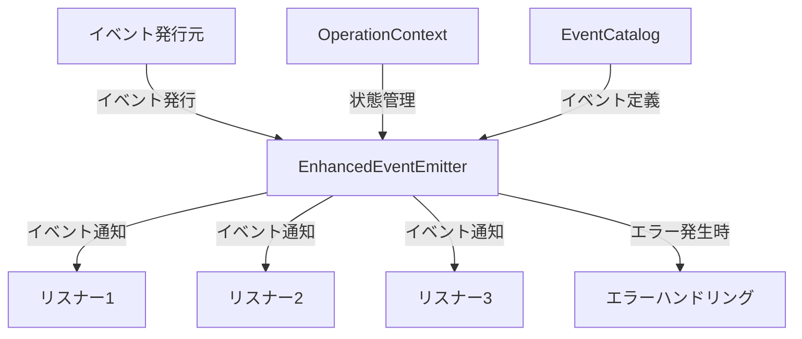

# イベント駆動アーキテクチャガイド

> **難易度: 基本〜中級** | 所要時間: 30分

このガイドでは、イベント駆動アーキテクチャの概念、本システムでの実装、および効果的な使用方法について詳細に説明します。システムコンポーネント間の疎結合な連携を実現するための基盤となる知識を提供します。

## 目次
- [1. イベント駆動アーキテクチャの概要](#1-イベント駆動アーキテクチャの概要)
- [2. 主要コンポーネント](#2-主要コンポーネント)
- [3. イベントの発行と購読](#3-イベントの発行と購読)
- [4. エラーハンドリング](#4-エラーハンドリング)
- [5. デバッグとモニタリング](#5-デバッグとモニタリング)
- [6. よくある問題とその解決法](#6-よくある問題とその解決法)
- [7. アーキテクチャ決定記録](#7-アーキテクチャ決定記録)

## 1. イベント駆動アーキテクチャの概要

### 1.1 イベント駆動アーキテクチャとは

イベント駆動アーキテクチャ（Event-Driven Architecture, EDA）は、システムコンポーネント間の通信をイベントの発行と購読によって実現するアーキテクチャパターンです。イベントとは、システム内で発生した重要な状態変化や動作を表すメッセージです。



### 1.2 メリット

- **疎結合**: コンポーネント間の直接的な依存関係が減少し、変更の影響範囲が限定される
- **スケーラビリティ**: コンポーネントを独立してスケールアップ/ダウン可能
- **柔軟性**: 新しい機能の追加が容易で、既存のコードへの影響が最小限
- **拡張性**: 既存の機能に影響を与えずに新しいリスナーを追加可能
- **テスト容易性**: コンポーネントを分離してテスト可能

### 1.3 デメリット

- **デバッグの複雑さ**: イベントの流れを追跡するのが難しい場合がある
- **一貫性の確保**: イベント処理の順序や完了の保証が難しい
- **学習曲線**: 従来の同期呼び出しと比較して理解が難しい場合がある

### 1.4 本システムでの採用理由

本システムでは、以下の理由からイベント駆動アーキテクチャを採用しています：

1. **コンポーネント間の疎結合の実現**: タスク管理、セッション管理、フィードバック管理などの機能を疎結合に保つ
2. **拡張性の確保**: 新しい機能やインテグレーションを容易に追加できるようにする
3. **非同期処理のサポート**: 長時間実行される処理や外部システムとの連携をスムーズに行う
4. **イベントの履歴と監査**: システム内で発生したイベントを記録し、監査やデバッグに活用

## 2. 主要コンポーネント

### 2.1 EnhancedEventEmitter

EnhancedEventEmitterは、標準的なイベントエミッターの機能に加え、以下の拡張機能を提供します：

- **ワイルドカードパターンのサポート**: `task:*` のようなパターンでイベントを購読可能
- **イベント名の標準化**: `component:action` 形式のイベント名を標準化
- **非同期イベント処理**: 非同期リスナーのサポート
- **イベント履歴**: 発行されたイベントの履歴を保持
- **デバッグモード**: 詳細なログ出力が可能

```javascript
// EnhancedEventEmitterの基本的な使用例
const eventEmitter = new EnhancedEventEmitter({ 
  logger: logger,
  debugMode: true,
  keepHistory: true
});

// イベントの発行
eventEmitter.emitStandardized('task', 'task_created', { id: 'T001' });

// イベント履歴の取得
const history = eventEmitter.getEventHistory();
```

### 2.2 OperationContext

OperationContextは、イベント連鎖の状態を追跡し、エラー状態を管理するクラスです。主な機能は以下の通りです：

- **コンテキストの親子関係**: 親コンテキストから子コンテキストを作成可能
- **エラー状態の管理**: エラーが発生した場合にエラー状態を設定
- **エラーの伝播**: 子コンテキストのエラーを親コンテキストに伝播
- **メタデータの保持**: コンテキストに関連するメタデータを保持

```javascript
// OperationContextの基本的な使用例
const context = eventEmitter.createContext({ 
  component: 'TaskManager',
  operation: 'createTask',
  taskId: 'T001'
});

// 子コンテキストの作成
const childContext = context.createChildContext({ 
  operation: 'validateTask'
});

// エラー状態の設定
if (error) {
  childContext.setError(error, 'TaskManager', 'validateTask', { taskId: 'T001' });
}

// エラー状態のチェック
if (context.hasError()) {
  // エラーが発生している場合の処理
}
```

### 2.3 EventCatalog

EventCatalogは、イベント定義を管理するクラスです。主な機能は以下の通りです：

- **イベント定義の登録**: イベント名、説明、スキーマなどを登録
- **イベント定義の取得**: イベント名からイベント定義を取得
- **カテゴリ別のイベント取得**: カテゴリ別にイベントを取得
- **イベントのバージョン管理**: イベントのバージョンを管理

```javascript
// EventCatalogの基本的な使用例
const eventCatalog = new EventCatalog();

// イベント定義の登録
eventCatalog.registerEvent('task:task_created', {
  description: '新しいタスクが作成されたときに発行されます',
  category: 'data',
  version: 1,
  schema: {
    id: 'タスクID',
    title: 'タスクのタイトル',
    // ...
  }
});

// イベント定義の取得
const eventDefinition = eventCatalog.getEventDefinition('task:task_created');
```

### 2.4 BaseAdapter

BaseAdapterは、すべてのアダプターの基底クラスとして機能し、共通の機能を提供します：

- **エラー処理**: 統一されたエラー処理メカニズム
- **パラメータ検証**: 入力パラメータの検証
- **イベント発行**: 標準化されたイベント発行
- **操作コンテキスト**: コンテキストの作成と管理

```javascript
// BaseAdapterを継承したクラスの例
class TaskManagerAdapter extends BaseAdapter {
  async createTask(taskData, context = null) {
    // コンテキストがない場合は新しく作成
    context = context || this._createContext('createTask', { taskData });
    
    try {
      // パラメータの検証
      this._validateParams(taskData, ['title']);
      
      // タスクの作成
      const task = await this.manager.createTask(taskData);
      
      // イベントの発行
      this._emitEvent('task', 'task_created', task, context);
      
      return task;
    } catch (error) {
      // エラー処理
      return this._handleError(error, 'createTask', context, { taskData });
    }
  }
}
```

## 3. イベントの発行と購読

### 3.1 標準的なイベント発行方法

イベントを発行するには、主に以下の方法があります：

#### 3.1.1 emitStandardizedメソッド

```javascript
// 標準化されたイベント発行
eventEmitter.emitStandardized('task', 'task_created', { 
  id: 'T001', 
  title: 'タスクの作成'
});
```

#### 3.1.2 _emitEventメソッド（BaseAdapter）

```javascript
// BaseAdapterの_emitEventメソッド
this._emitEvent('task', 'task_created', { 
  id: 'T001', 
  title: 'タスクの作成'
}, context);
```

#### 3.1.3 非同期イベント発行

```javascript
// 非同期イベント発行
await eventEmitter.emitStandardizedAsync('task', 'task_created', { 
  id: 'T001', 
  title: 'タスクの作成'
});
```

### 3.2 イベントリスナーの登録方法

イベントリスナーを登録するには、以下の方法があります：

#### 3.2.1 基本的なリスナー登録

```javascript
// 基本的なイベントリスナー
const removeListener = eventEmitter.on('task:task_created', (data) => {
  console.log(`タスクが作成されました: ${data.title}`);
});

// リスナーの解除
removeListener();
```

#### 3.2.2 ワイルドカードリスナー

```javascript
// ワイルドカードリスナー
eventEmitter.on('task:*', (data, eventName) => {
  console.log(`タスク関連イベント: ${eventName}`);
});
```

#### 3.2.3 一度だけ実行されるリスナー

```javascript
// 一度だけ実行されるリスナー
eventEmitter.once('task:task_created', (data) => {
  console.log(`タスクが作成されました（一度だけ表示）: ${data.title}`);
});
```

### 3.3 イベントデータの構造

標準的なイベントデータには、以下のフィールドが含まれます：

- **timestamp**: イベントが発行された時刻（ISO 8601形式）
- **component**: イベントを発行したコンポーネント名
- **action**: イベントのアクション名
- **_context**: 操作コンテキストのID（コンテキスト付きイベントの場合）
- **その他のデータ**: イベント固有のデータ

```javascript
// 標準的なイベントデータの例
{
  id: 'T001',
  title: 'タスクの作成',
  timestamp: '2025-03-23T08:45:12.345Z',
  component: 'task',
  action: 'task_created',
  _context: 'ctx-1742706751540-mrg1hyvmf'
}
```

## 4. エラーハンドリング

### 4.1 イベント処理中のエラー処理

イベントリスナー内でエラーが発生した場合、EnhancedEventEmitterは以下の処理を行います：

1. エラーをログに出力
2. エラーイベントを発行（`error`イベント）
3. リスナーの実行を継続（他のリスナーには影響しない）

```javascript
// イベントリスナー内でのエラー処理
eventEmitter.on('task:task_created', (data) => {
  try {
    // 何らかの処理
    throw new Error('テストエラー');
  } catch (error) {
    // エラー処理
    console.error('エラーが発生しました:', error);
  }
});
```

### 4.2 エラーイベントの発行

エラーが発生した場合、エラーイベントを発行することができます：

```javascript
// エラーイベントの発行
this._emitErrorEvent(error, 'createTask', context, { 
  taskData: { title: 'タスクの作成' }
});
```

または、BaseAdapterの`_handleError`メソッドを使用することもできます：

```javascript
// _handleErrorメソッドの使用
return this._handleError(error, 'createTask', context, { taskData });
```

### 4.3 操作コンテキストを使用したエラー伝播

操作コンテキストを使用すると、エラーを親コンテキストに伝播させることができます：

```javascript
// エラーの設定と伝播
childContext.setError(error, 'TaskManager', 'validateTask', { taskId: 'T001' });

// 親コンテキストでもエラー状態になる
console.log(context.hasError()); // true
```

### 4.4 エラーハンドリングのベストプラクティス

1. **適切なエラー情報の提供**: エラーメッセージ、コード、コンポーネント名、操作名などを含める
2. **コンテキストの活用**: 操作コンテキストを使用してエラー状態を管理
3. **エラーイベントの発行**: エラーが発生した場合はエラーイベントを発行
4. **エラーの適切な処理**: エラーを適切に処理し、システムの安定性を確保

## 5. デバッグとモニタリング

### 5.1 イベント履歴の活用

EnhancedEventEmitterは、発行されたイベントの履歴を保持することができます：

```javascript
// イベント履歴の取得
const history = eventEmitter.getEventHistory();
console.log('最近のイベント:', history);
```

### 5.2 デバッグモードの使用方法

デバッグモードを有効にすると、詳細なログが出力されます：

```javascript
// デバッグモードの有効化
eventEmitter.setDebugMode(true);

// イベント発行（詳細なログが出力される）
eventEmitter.emitStandardized('task', 'task_created', { id: 'T001' });
```

### 5.3 イベントフローの可視化

イベントフローを可視化するには、以下のようなコードを使用できます：

```javascript
// イベントフローの可視化（開発環境用）
class EventVisualizer {
  constructor(eventEmitter) {
    this.eventEmitter = eventEmitter;
    this.events = [];
    
    // すべてのイベントを記録
    this.eventEmitter.on('*', (data, eventName) => {
      this.events.push({
        timestamp: new Date().toISOString(),
        eventName,
        data
      });
    });
  }
  
  // イベントフローをmermaid形式で出力
  visualizeFlow() {
    let mermaid = 'sequenceDiagram\n';
    
    // コンポーネントの抽出
    const components = new Set();
    this.events.forEach(event => {
      const [component] = event.eventName.split(':');
      components.add(component);
    });
    
    // コンポーネントの定義
    components.forEach(component => {
      mermaid += `    participant ${component}\n`;
    });
    
    // イベントフローの生成
    this.events.forEach(event => {
      const [source, action] = event.eventName.split(':');
      let target = 'System';
      if (event.data && event.data.component) {
        target = event.data.component;
      }
      
      if (source !== target) {
        mermaid += `    ${source}->>+${target}: ${action}\n`;
      }
    });
    
    return mermaid;
  }
}
```

## 6. よくある問題とその解決法

### 6.1 イベントが発行されない問題

**症状**: イベントを発行しているが、リスナーが呼び出されない

**考えられる原因**:
- イベント名が一致していない
- リスナーが正しく登録されていない
- コンテキストにエラーが発生している

**解決策**:
1. イベント名が正確に一致しているか確認（大文字小文字も含む）
2. リスナーが正しく登録されているか確認
3. コンテキストのエラー状態をチェック（`context.hasError()`）
4. デバッグモードを有効にして詳細なログを確認

### 6.2 リスナーが呼び出されない問題

**症状**: イベントは発行されているが、特定のリスナーが呼び出されない

**考えられる原因**:
- リスナーが解除されている
- イベント名のパターンが一致していない
- リスナー内でエラーが発生している

**解決策**:
1. リスナーが解除されていないか確認
2. イベント名のパターンが正しいか確認
3. リスナー内でエラーが発生していないか確認
4. `listenerCount`メソッドでリスナーの数を確認

```javascript
// リスナーの数を確認
const count = eventEmitter.listenerCount('task:task_created');
console.log(`リスナーの数: ${count}`);
```

### 6.3 エラー伝播が機能しない問題

**症状**: エラーが発生しても親コンテキストにエラーが伝播しない

**考えられる原因**:
- コンテキストの親子関係が正しく設定されていない
- `setError`メソッドが正しく呼び出されていない
- エラーオブジェクトが正しく渡されていない

**解決策**:
1. コンテキストの親子関係を確認（`context.parentContext`）
2. `setError`メソッドの呼び出しを確認
3. エラーオブジェクトが正しく渡されているか確認
4. コンテキストの情報を出力して確認（`context.getInfo()`）

### 6.4 パフォーマンス問題

**症状**: イベント処理が遅い、またはメモリ使用量が多い

**考えられる原因**:
- リスナーの数が多すぎる
- イベント履歴のサイズが大きすぎる
- 非同期リスナーの処理が遅い

**解決策**:
1. 不要なリスナーを解除
2. イベント履歴のサイズを制限（`historyLimit`オプション）
3. 非同期リスナーの処理を最適化
4. デバッグモードを無効にする（本番環境では）

## 7. アーキテクチャ決定記録

### 7.1 イベント駆動アーキテクチャの採用

**決定**: システム全体でイベント駆動アーキテクチャを採用する

**背景**:
- コンポーネント間の結合度が高く、変更の影響範囲が大きい
- 新機能の追加が難しい
- テストが複雑

**検討された代替案**:
- 直接メソッド呼び出し
- メッセージキューの使用
- サービスバスの導入

**決定理由**:
- コンポーネント間の疎結合を実現
- 拡張性の向上
- テストの容易化
- 既存のNode.jsエコシステムとの親和性

### 7.2 操作コンテキストの導入

**決定**: イベント連鎖の状態を追跡するために操作コンテキストを導入する

**背景**:
- イベント連鎖のデバッグが困難
- エラーが発生した場合の処理が不明確
- イベント間の関連性が追跡できない

**検討された代替案**:
- グローバルな状態管理
- トランザクションIDの使用
- コールバックチェーン

**決定理由**:
- 親子関係によるエラー伝播の実現
- コンテキスト情報の保持
- デバッグ情報の充実
- イベント連鎖の制御

### 7.3 イベント名の標準化

**決定**: イベント名を `component:action` 形式で標準化する

**背景**:
- イベント名の形式が統一されていない
- イベント名の意味が不明確
- イベント名の衝突が発生する可能性がある

**検討された代替案**:
- 階層的なイベント名（`component.entity.action`）
- URIスタイルのイベント名（`component/entity/action`）
- オブジェクトベースのイベント識別

**決定理由**:
- シンプルで理解しやすい
- 既存のイベントエミッターとの互換性
- ワイルドカードパターンのサポートが容易
- イベントカタログとの統合が容易

## 関連ドキュメント

- [クイックスタートガイド](./event-driven-quickstart.md) - イベント駆動アーキテクチャの基本的な使用方法
- [開発者向けチートシート](./event-driven-cheatsheet.md) - よく使用されるイベント名とコードスニペット
- [イベント名標準化ガイド](./event-naming-convention.md) - イベント名の命名規則と標準化ガイドライン
- [操作コンテキスト活用ガイド](./operation-context-guide.md) - 操作コンテキストの詳細な使用方法

## 次のステップ

イベント駆動アーキテクチャの基本概念と使用方法を理解したら、次のステップとして以下のドキュメントを参照してください：

- [開発者向けチートシート](./event-driven-cheatsheet.md) - 実際の開発で役立つコードスニペット集
- [操作コンテキスト活用ガイド](./operation-context-guide.md) - 操作コンテキストの高度な使用方法