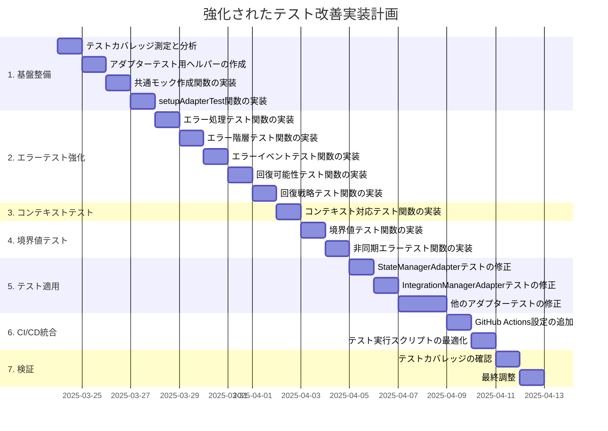

# アダプターテスト改善計画（詳細版）

このドキュメントは、アダプターパターンを使用したコンポーネントのテスト改善計画の詳細を記述しています。

## 1. 現状分析

### 1.1 テスト実装の現状
- 各アダプター（StateManagerAdapter, IntegrationManagerAdapter）のテストファイルでは、モックを個別に定義しており、重複コードが多い
- エラー処理のテストは各アダプターで同様のパターンで実装されている
- CLIテスト用のヘルパー（cli-test-helper.js）は既に存在するが、アダプターテスト用のヘルパーはまだ作成されていない
- 境界値テストや非同期エラーのテストが不足している

### 1.2 アダプターの構造
- BaseAdapterが共通機能（エラー処理、パラメータ検証、イベント発行）を提供
- 各アダプターはBaseAdapterを継承し、特定のマネージャーとの連携機能を実装
- エラー処理は_handleErrorメソッドで統一的に行われている

### 1.3 エラーフレームワーク
- ApplicationErrorを基底クラスとする階層的なエラークラス構造
- エラーの回復可能性（recoverable）の概念が導入されている
- ErrorHandlerクラスがエラーの処理と回復を担当

### 1.4 イベントシステム
- EnhancedEventEmitterクラスが標準的なイベントエミッターの機能に加え、拡張機能を提供
- emitErrorメソッドがエラーイベントの発行を担当
- イベント名の標準化とイベントカタログの機能が実装されている

## 2. 改善計画

以下の改善を段階的に実装することで、テストの保守性、再利用性、カバレッジを向上させます。



### 2.1 テストカバレッジの測定と目標設定

テストカバレッジの測定と目標設定を行います。

```javascript
// jest.config.js の更新
module.exports = {
  // 既存の設定
  // ...
  
  // カバレッジ設定
  collectCoverage: true,
  coverageDirectory: 'coverage',
  coverageReporters: ['text', 'lcov', 'html'],
  collectCoverageFrom: [
    'src/lib/adapters/**/*.js',
    'src/lib/core/error-framework.js',
    'src/lib/core/event-system.js',
    '!**/node_modules/**'
  ],
  coverageThreshold: {
    global: {
      statements: 90,
      branches: 85,
      functions: 90,
      lines: 90
    },
    'src/lib/adapters/': {
      statements: 95,
      branches: 90,
      functions: 95,
      lines: 95
    },
    'src/lib/core/error-framework.js': {
      statements: 95,
      branches: 90,
      functions: 95,
      lines: 95
    }
  }
};
```

### 2.2 アダプターテスト用ヘルパーの作成

アダプターテスト用のヘルパーを作成し、共通のモック作成関数を実装します。

```javascript
// tests/lib/helpers/adapter-test-helper.js
/**
 * アダプターテスト用ヘルパー
 */

const { EnhancedEventEmitter } = require('../../../src/lib/core/event-system');

/**
 * 共通のモックロガーを作成
 * @returns {Object} モックロガー
 */
function createMockLogger() {
  return {
    debug: jest.fn(),
    info: jest.fn(),
    warn: jest.fn(),
    error: jest.fn()
  };
}

/**
 * イベントエミッターとイベントキャプチャを作成
 * @param {Object} options - オプション
 * @returns {Object} イベントエミッターとキャプチャされたイベント
 */
function createEventEmitterWithCapture(options = {}) {
  const emittedEvents = [];
  const logger = options.logger || createMockLogger();
  
  // 実際のEventEmitterを使用
  const eventEmitter = new EnhancedEventEmitter({ logger });
  
  // イベントをキャプチャ
  eventEmitter.on('*', (data, eventName) => {
    emittedEvents.push({ name: eventName, data });
  });
  
  return {
    eventEmitter,
    emittedEvents,
    resetEvents: () => { emittedEvents.length = 0; }
  };
}

/**
 * StateManagerのモックを作成
 * @returns {Object} モックStateManager
 */
function createMockStateManager() {
  return {
    getCurrentState: jest.fn().mockReturnValue('initialized'),
    setState: jest.fn().mockImplementation((state, data) => {
      return { state, previousState: 'initialized', timestamp: new Date().toISOString(), ...data };
    }),
    transitionTo: jest.fn().mockImplementation((state, data) => {
      return { state, previousState: 'initialized', timestamp: new Date().toISOString(), ...data };
    }),
    canTransitionTo: jest.fn().mockReturnValue(true),
    getStateHistory: jest.fn().mockReturnValue([
      { state: 'uninitialized', timestamp: '2025-03-01T00:00:00.000Z' },
      { state: 'initialized', timestamp: '2025-03-01T00:01:00.000Z' }
    ]),
    getPreviousState: jest.fn().mockReturnValue('uninitialized')
  };
}

/**
 * IntegrationManagerのモックを作成
 * @returns {Object} モックIntegrationManager
 */
function createMockIntegrationManager() {
  return {
    initializeWorkflow: jest.fn().mockImplementation(projectData => ({ 
      projectId: projectData?.id || 'P001', 
      initialized: true, 
      timestamp: new Date().toISOString() 
    })),
    startSession: jest.fn().mockImplementation(options => ({ 
      sessionId: 'S001', 
      started: true, 
      timestamp: new Date().toISOString(),
      options 
    })),
    endSession: jest.fn().mockImplementation(sessionId => ({ 
      sessionId: sessionId || 'S001', 
      ended: true, 
      duration: 3600,
      timestamp: new Date().toISOString() 
    })),
    createTask: jest.fn().mockImplementation(taskData => ({ 
      id: 'T001', 
      ...(taskData || {}), 
      created: true,
      timestamp: new Date().toISOString() 
    })),
    updateTaskStatus: jest.fn().mockImplementation((taskId, status) => ({ 
      id: taskId || 'T001', 
      status: status || 'in_progress', 
      previousStatus: 'pending',
      timestamp: new Date().toISOString() 
    })),
    collectFeedback: jest.fn().mockImplementation((taskId, feedbackData) => ({
      id: 'F001',
      taskId: taskId || 'T001',
      ...(feedbackData || {}),
      timestamp: new Date().toISOString()
    })),
    resolveFeedback: jest.fn().mockImplementation((feedbackId) => ({
      id: feedbackId || 'F001',
      resolved: true,
      timestamp: new Date().toISOString()
    })),
    syncComponents: jest.fn().mockImplementation(() => ({
      synced: true,
      timestamp: new Date().toISOString()
    })),
    generateReport: jest.fn().mockImplementation(() => ({
      content: '# 統合レポート\n\nこれはテスト用の統合レポートです。',
      timestamp: new Date().toISOString()
    })),
    getWorkflowStatus: jest.fn().mockImplementation(() => ({ 
      state: 'task_in_progress', 
      activeComponents: ['session', 'task'],
      timestamp: new Date().toISOString() 
    }))
  };
}

/**
 * エラーを発生させるモックを作成
 * @param {Object} mockObject - 元のモックオブジェクト
 * @param {string} methodName - エラーを発生させるメソッド名
 * @param {Object} options - エラーオプション
 * @returns {Object} エラーを発生させるモック
 */
function createErrorMock(mockObject, methodName, options = {}) {
  const { ApplicationError } = require('../../../src/lib/core/error-framework');
  const errorMock = { ...mockObject };
  
  errorMock[methodName] = jest.fn().mockImplementation(() => {
    const errorMessage = options.message || 'テストエラー';
    const errorCode = options.code || 'ERR_TEST';
    const recoverable = options.recoverable !== undefined ? options.recoverable : true;
    
    throw new ApplicationError(errorMessage, {
      code: errorCode,
      recoverable,
      context: options.context || { operation: methodName }
    });
  });
  
  return errorMock;
}

/**
 * テスト用のセットアップを行う
 * @param {Object} options - オプション
 * @returns {Object} セットアップされたテスト環境
 */
function setupAdapterTest(options = {}) {
  // モックの作成
  const mockLogger = createMockLogger();
  const { eventEmitter, emittedEvents, resetEvents } = createEventEmitterWithCapture({ logger: mockLogger });
  
  // マネージャーの種類に応じたモックを作成
  let mockManager;
  if (options.managerType === 'state') {
    mockManager = createMockStateManager();
  } else if (options.managerType === 'integration') {
    mockManager = createMockIntegrationManager();
  } else {
    mockManager = options.mockManager || {};
  }
  
  // エラーハンドラーのモックを作成
  const mockErrorHandler = {
    handle: jest.fn().mockImplementation((error) => error),
    registerRecoveryStrategy: jest.fn(),
    removeRecoveryStrategy: jest.fn()
  };
  
  // アダプターの作成
  const AdapterClass = options.AdapterClass;
  const adapter = new AdapterClass(mockManager, {
    eventEmitter,
    logger: mockLogger,
    errorHandler: options.useErrorHandler ? mockErrorHandler : undefined
  });
  
  // beforeEach関数を返す
  const resetMocks = () => {
    // すべてのモックをリセット
    jest.clearAllMocks();
    resetEvents();
    
    // イベントリスナーをリセット
    if (options.resetListeners && eventEmitter.removeAllListeners) {
      eventEmitter.removeAllListeners();
    }
  };
  
  return {
    adapter,
    mockManager,
    mockLogger,
    eventEmitter,
    emittedEvents,
    mockErrorHandler,
    resetMocks
  };
}

module.exports = {
  createMockLogger,
  createEventEmitterWithCapture,
  createMockStateManager,
  createMockIntegrationManager,
  createErrorMock,
  setupAdapterTest
};
```

### 2.3 共通テスト関数の作成

#### 2.3.1 エラー処理テスト関数

```javascript
// tests/lib/adapters/common-adapter-tests.js
/**
 * アダプター共通テスト
 */

/**
 * 基本的なエラー処理テストを実行
 * @param {Object} adapter - テスト対象のアダプター
 * @param {Object} mockManager - モックマネージャー
 * @param {Array<Object>} methods - テスト対象のメソッド情報
 * @param {Object} mockLogger - モックロガー
 */
function runErrorHandlingTests(adapter, mockManager, methods, mockLogger) {
  describe('エラー処理', () => {
    test.each(methods)(
      '$methodName: エラー時に適切に処理する',
      async ({ methodName, args, errorMessage }) => {
        // モックをリセット
        mockLogger.error.mockClear();
        
        // モックマネージャーのメソッドをエラーを投げるように設定
        mockManager[methodName].mockImplementationOnce(() => {
          throw new Error(errorMessage || 'テストエラー');
        });
        
        // アダプターのメソッドを呼び出す
        const result = await adapter[methodName](...(args || []));
        
        // 結果を検証
        expect(result).toMatchObject({
          error: true,
          message: errorMessage || 'テストエラー',
          operation: methodName
        });
        
        // エラーログが出力されたことを確認
        expect(mockLogger.error).toHaveBeenCalled();
      }
    );
  });
}

/**
 * 回復可能性テストを実行
 * @param {Object} adapter - テスト対象のアダプター
 * @param {Object} mockManager - モックマネージャー
 * @param {string} methodName - テスト対象のメソッド名
 * @param {Array} args - メソッドの引数
 * @param {Object} mockLogger - モックロガー
 */
function runRecoverabilityTests(adapter, mockManager, methodName, args = [], mockLogger) {
  describe('回復可能性', () => {
    test('回復可能なエラーと回復不可能なエラーを区別する', async () => {
      const { ApplicationError } = require('../../../src/lib/core/error-framework');
      
      // モックをリセット
      mockLogger.error.mockClear();
      
      // 回復可能なエラーを発生させる
      mockManager[methodName].mockImplementationOnce(() => {
        throw new ApplicationError('回復可能なエラー', {
          recoverable: true
        });
      });
      
      const result1 = await adapter[methodName](...args);
      
      expect(result1).toMatchObject({
        error: true,
        message: '回復可能なエラー',
        operation: methodName,
        recoverable: true
      });
      
      // モックをリセット
      mockLogger.error.mockClear();
      
      // 回復不可能なエラーを発生させる
      mockManager[methodName].mockImplementationOnce(() => {
        throw new ApplicationError('回復不可能なエラー', {
          recoverable: false
        });
      });
      
      const result2 = await adapter[methodName](...args);
      
      expect(result2).toMatchObject({
        error: true,
        message: '回復不可能なエラー',
        operation: methodName,
        recoverable: false
      });
    });
  });
}

module.exports = {
  runErrorHandlingTests,
  runRecoverabilityTests
};
```

#### 2.3.2 エラー階層テスト関数

```javascript
// tests/lib/adapters/error-hierarchy-tests.js
/**
 * エラー階層テスト関数
 */
const { 
  ApplicationError, 
  ValidationError, 
  StateError, 
  DataConsistencyError,
  StorageError,
  NetworkError,
  TimeoutError
} = require('../../../src/lib/core/error-framework');

/**
 * エラー階層テストを実行
 * @param {Object} adapter - テスト対象のアダプター
 * @param {Object} mockManager - モックマネージャー
 * @param {string} methodName - テスト対象のメソッド名
 * @param {Array} args - メソッドの引数
 * @param {Object} mockLogger - モックロガー
 */
function runErrorHierarchyTest(adapter, mockManager, methodName, args = [], mockLogger) {
  describe(`${methodName}: エラー階層テスト`, () => {
    const errorTypes = [
      { ErrorClass: ValidationError, code: 'ERR_VALIDATION', recoverable: true },
      { ErrorClass: StateError, code: 'ERR_STATE', recoverable: false },
      { ErrorClass: DataConsistencyError, code: 'ERR_DATA_CONSISTENCY', recoverable: false },
      { ErrorClass: StorageError, code: 'ERR_STORAGE', recoverable: true },
      { ErrorClass: NetworkError, code: 'ERR_NETWORK', recoverable: true },
      { ErrorClass: TimeoutError, code: 'ERR_TIMEOUT', recoverable: true }
    ];
    
    test.each(errorTypes)(
      '異なる種類のエラー ($ErrorClass.name) を適切に処理できる',
      async ({ ErrorClass, code, recoverable }) => {
        // モックをリセット
        mockLogger.error.mockClear();
        
        // エラーを発生させるモック
        mockManager[methodName].mockImplementationOnce(() => {
          throw new ErrorClass(`${ErrorClass.name}テスト`, { code });
        });
        
        // アダプターのメソッドを呼び出す
        const result = await adapter[methodName](...args);
        
        // 結果を検証
        expect(result).toMatchObject({
          error: true,
          message: `${ErrorClass.name}テスト`,
          code,
          recoverable,
          operation: methodName
        });
        
        // エラーログが出力されたことを確認
        expect(mockLogger.error).toHaveBeenCalled();
      }
    );
  });
}

module.exports = {
  runErrorHierarchyTest
};
```

#### 2.3.3 エラーイベントテスト関数

```javascript
// tests/lib/adapters/error-event-tests.js
/**
 * エラーイベントテスト関数
 */

/**
 * エラーイベントテストを実行
 * @param {Object} adapter - テスト対象のアダプター
 * @param {Object} mockManager - モックマネージャー
 * @param {Object} mockEventEmitter - モックイベントエミッター
 * @param {string} methodName - テスト対象のメソッド名
 * @param {Array} args - メソッドの引数
 * @param {string} component - コンポーネント名
 * @param {Object} mockLogger - モックロガー
 */
function runErrorEventTest(adapter, mockManager, mockEventEmitter, methodName, args = [], component, mockLogger) {
  describe(`${methodName}: エラーイベントテスト`, () => {
    let errorListener;
    let legacyErrorListener;
    let globalErrorListener;
    
    beforeEach(() => {
      // リスナーをリセット
      errorListener = jest.fn();
      legacyErrorListener = jest.fn();
      globalErrorListener = jest.fn();
      
      // エラーイベントリスナーを設定
      mockEventEmitter.on('app:error', errorListener);
      mockEventEmitter.on(`${component}:error`, legacyErrorListener);
      mockEventEmitter.on('error', globalErrorListener);
      
      // ロガーをリセット
      mockLogger.error.mockClear();
    });
    
    test('エラー時にapp:errorイベントを発行する', async () => {
      // エラーを発生させる
      mockManager[methodName].mockImplementationOnce(() => {
        throw new Error('テストエラー');
      });
      
      // メソッドを呼び出す
      const result = await adapter[methodName](...args);
      
      // エラー結果を確認
      expect(result).toMatchObject({
        error: true,
        message: 'テストエラー',
        operation: methodName
      });
      
      // 各種エラーイベントが発行されたことを確認
      expect(errorListener).toHaveBeenCalled();
      expect(legacyErrorListener).toHaveBeenCalled();
      expect(globalErrorListener).toHaveBeenCalled();
      
      // エラーイベントのデータを確認
      const errorData = errorListener.mock.calls[0][0];
      expect(errorData.component).toBe(component);
      expect(errorData.operation).toBe(methodName);
      expect(errorData.message).toBe('テストエラー');
      expect(errorData.timestamp).toBeDefined();
      
      // エラーログが出力されたことを確認
      expect(mockLogger.error).toHaveBeenCalled();
    });
    
    test('ApplicationErrorのプロパティが保持される', async () => {
      const { ApplicationError } = require('../../../src/lib/core/error-framework');
      
      // ApplicationErrorを発生させる
      mockManager[methodName].mockImplementationOnce(() => {
        throw new ApplicationError('アプリケーションエラー', {
          code: 'ERR_TEST',
          context: { testId: 'T001' },
          recoverable: false
        });
      });
      
      // メソッドを呼び出す
      const result = await adapter[methodName](...args);
      
      // エラー結果を確認
      expect(result).toMatchObject({
        error: true,
        message: 'アプリケーションエラー',
        code: 'ERR_TEST',
        operation: methodName,
        recoverable: false
      });
      
      // エラーイベントのデータを確認
      const errorData = errorListener.mock.calls[0][0];
      expect(errorData.code).toBe('ERR_TEST');
      expect(errorData.recoverable).toBe(false);
    });
  });
}

module.exports = {
  runErrorEventTest
};
```

#### 2.3.4 回復戦略テスト関数

```javascript
// tests/lib/adapters/recovery-strategy-tests.js
/**
 * 回復戦略テスト関数
 */

/**
 * エラー回復戦略テストを実行
 * @param {Object} adapter - テスト対象のアダプター
 * @param {Object} mockManager - モックマネージャー
 * @param {Object} mockErrorHandler - モックエラーハンドラー
 * @param {string} methodName - テスト対象のメソッド名
 * @param {Array} args - メソッドの引数
 * @param {string} errorCode - エラーコード
 */
function runRecoveryStrategyTest(adapter, mockManager, mockErrorHandler, methodName, args = [], errorCode = 'ERR_TEST') {
  describe(`${methodName}: 回復戦略テスト`, () => {
    test('回復戦略が適用される', async () => {
      // 回復戦略を登録
      const recoveryResult = { recovered: true, data: 'recovered data' };
      const recoveryStrategy = jest.fn().mockReturnValue(recoveryResult);
      mockErrorHandler.registerRecoveryStrategy(errorCode, recoveryStrategy);
      
      // 回復可能なエラーを発生させる
      mockManager[methodName].mockImplementationOnce(() => {
        const { ApplicationError } = require('../../../src/lib/core/error-framework');
        throw new ApplicationError('回復可能なエラー', {
          code: errorCode,
          recoverable: true
        });
      });
      
      // アダプターのメソッドを呼び出す
      const result = await adapter[methodName](...args);
      
      // 回復戦略が呼び出されたことを確認
      expect(recoveryStrategy).toHaveBeenCalled();
      
      // 回復結果が返されたことを確認
      expect(result).toEqual(recoveryResult);
    });
    
    test('回復戦略が失敗した場合もエラーが適切に処理される', async () => {
      // 失敗する回復戦略を登録
      const recoveryStrategy = jest.fn().mockImplementation(() => {
        throw new Error('回復戦略エラー');
      });
      mockErrorHandler.registerRecoveryStrategy(errorCode, recoveryStrategy);
      
      // 回復可能なエラーを発生させる
      mockManager[methodName].mockImplementationOnce(() => {
        const { ApplicationError } = require('../../../src/lib/core/error-framework');
        throw new ApplicationError('回復可能なエラー', {
          code: errorCode,
          recoverable: true
        });
      });
      
      // アダプターのメソッドを呼び出す
      const result = await adapter[methodName](...args);
      
      // 回復戦略が呼び出されたことを確認
      expect(recoveryStrategy).toHaveBeenCalled();
      
      // エラー結果が返されることを確認
      expect(result).toMatchObject({
        error: true,
        message: expect.stringContaining('回復戦略エラー'),
        operation: methodName
      });
    });
  });
}

module.exports = {
  runRecoveryStrategyTest
};
```

#### 2.3.5 コンテキスト対応テスト関数

```javascript
// tests/lib/adapters/context-aware-tests.js
/**
 * コンテキスト対応テスト関数
 */

/**
 * コンテキスト対応テストを実行
 * @param {Object} adapter - テスト対象のアダプター
 * @param {Object} mockManager - モックマネージャー
 * @param {Object} mockEventEmitter - モックイベントエミッター
 * @param {string} methodName - テスト対象のメソッド名
 * @param {Array} args - メソッドの引数
 */
function runContextAwareTest(adapter, mockManager, mockEventEmitter, methodName, args = []) {
  describe(`${methodName}: コンテキスト対応テスト`, () => {
    test('操作コンテキストが正しく作成される', async () => {
      // createContextのスパイを作成
      const createContextSpy = jest.spyOn(mockEventEmitter, 'createContext');
      const mockContext = { id: 'ctx-123', setError: jest.fn() };
      createContextSpy.mockReturnValue(mockContext);
      
      // アダプターのメソッドを呼び出す
      await adapter[methodName](...args);
      
      // createContextが呼び出されたことを確認
      expect(createContextSpy).toHaveBeenCalled();
      expect(createContextSpy.mock.calls[0][0]).toMatchObject({
        component: expect.any(String),
        operation: methodName
      });
    });
    
    test('エラー時にコンテキストにエラーが設定される', async () => {
      // createContextのスパイを作成
      const mockContext = { id: 'ctx-123', setError: jest.fn() };
      jest.spyOn(mockEventEmitter, 'createContext').mockReturnValue(mockContext);
      
      // エラーを発生させる
      mockManager[methodName].mockImplementationOnce(() => {
        throw new Error('コンテキストテストエラー');
      });
      
      // アダプターのメソッドを呼び出す
      await adapter[methodName](...args);
      
      // コンテキストにエラーが設定されたことを確認
      expect(mockContext.setError).toHaveBeenCalled();
      expect(mockContext.setError.mock.calls[0][0]).toBeInstanceOf(Error);
      expect(mockContext.setError.mock.calls[0][0].message).toBe('コンテキストテストエラー');
    });
  });
}

module.exports = {
  runContextAwareTest
};
```

#### 2.3.6 境界値テスト関数

```javascript
// tests/lib/adapters/boundary-value-tests.js
/**
 * 境界値テスト関数
 */

/**
 * 長い文字列の処理テストを実行
 * @param {Object} adapter - テスト対象のアダプター
 * @param {string} methodName - テスト対象のメソッド名
 * @param {Array} args - メソッドの引数
 * @param {number} argIndex - 長い文字列を設定する引数のインデックス
 * @param {number} length - 文字列の長さ
 */
function runLongStringTest(adapter, methodName, args = [], argIndex = 0, length = 1000) {
  test(`${methodName}: 長い文字列（${length}文字）を処理できる`, async () => {
    const longString = 'a'.repeat(length);
    const testArgs = [...args];
    testArgs[argIndex] = longString;
    
    const result = await adapter[methodName](...testArgs);
    expect(result).not.toHaveProperty('error');
  });
}

/**
 * 特殊文字の処理テストを実行
 * @param {Object} adapter - テスト対象のアダプター
 * @param {string} methodName - テスト対象のメソッド名
 * @param {Array} args - メソッドの引数
 * @param {number} argIndex - 特殊文字列を設定する引数のインデックス
 */
function runSpecialCharactersTest(adapter, methodName, args = [], argIndex = 0) {
  test(`${methodName}: 特殊文字を含む文字列を処理できる`, async () => {
    const specialChars = '特殊文字!@#$%^&*()_+{}[]|\\:;"\'<>,.?/';
    const testArgs = [...args];
    testArgs[argIndex] = specialChars;
    
    const result = await adapter[methodName](...testArgs);
    expect(result).not.toHaveProperty('error');
  });
}

/**
 * 循環参照の処理テストを実行
 * @param {Object} adapter - テスト対象のアダプター
 * @param {string} methodName - テスト対象のメソッド名
 * @param {Array} args - メソッドの引数
 * @param {number} argIndex - 循環参照オブジェクトを設定する引数のインデックス
 */
function runCircularReferenceTest(adapter, methodName, args = [], argIndex = 0) {
  test(`${methodName}: 循環参照を含むオブジェクトを処理できる`, async () => {
    const circularObj = {};
    circularObj.self = circularObj;
    
    const testArgs = [...args];
    testArgs[argIndex] = circularObj;
    
    const result = await adapter[methodName](...testArgs);
    expect(result).not.toHaveProperty('error');
  });
}

module.exports = {
  runLongStringTest,
  runSpecialCharactersTest,
  runCircularReferenceTest
};
```

#### 2.3.7 非同期エラーテスト関数

```javascript
// tests/lib/adapters/async-error-tests.js
/**
 * 非同期エラーテスト関数
 */

/**
 * 非同期エラー処理テストを実行
 * @param {Object} adapter - テスト対象のアダプター
 * @param {Object} mockManager - モックマネージャー
 * @param {string} methodName - テスト対象のメソッド名
 * @param {Array} args - メソッドの引数
 */
function runAsyncErrorTest(adapter, mockManager, methodName, args = []) {
  test(`${methodName}: 非同期操作中のエラーを適切に処理する`, async () => {
    // 非同期でエラーを発生させるモック
    mockManager[methodName].mockImplementationOnce(() => {
      return new Promise((_, reject) => {
        setTimeout(() => {
          reject(new Error('非同期エラー'));
        }, 100);
      });
    });
    
    const result = await adapter[methodName](...args);
    
    expect(result).toMatchObject({
      error: true,
      message: '非同期エラー',
      operation: methodName
    });
  });
}

/**
 * 操作キャンセルテストを実行
 * @param {Object} adapter - テスト対象のアダプター
 * @param {Object} mockManager - モックマネージャー
 * @param {string} methodName - テスト対象のメソッド名
 * @param {Array} args - メソッドの引数
 */
function runCancellationTest(adapter, mockManager, methodName, args = []) {
  test(`${methodName}: 操作のキャンセルを処理できる`, async () => {
    const abortController = new AbortController();
    const signal = abortController.signal;
    
    // キャンセル可能な非同期操作をモック
    mockManager[methodName].mockImplementationOnce(() => {
      return new Promise((_, reject) => {
        const timeout = setTimeout(() => {
          reject(new Error('タイムアウト'));
        }, 1000);
        
        signal.addEventListener('abort', () => {
          clearTimeout(timeout);
          reject(new Error('操作がキャンセルされました'));
        });
      });
    });
    
    // 操作を開始し、すぐにキャンセル
    const resultPromise = adapter[methodName](...args, { signal });
    abortController.abort();
    
    const result = await resultPromise;
    
    expect(result).toMatchObject({
      error: true,
      message: '操作がキャンセルされました',
      operation: methodName
    });
  });
}

/**
 * イベントリスナーエラーテストを実行
 * @param {Object} adapter - テスト対象のアダプター
 * @param {Object} mockEventEmitter - モックイベントエミッター
 * @param {string} methodName - テスト対象のメソッド名
 * @param {Array} args - メソッドの引数
 * @param {string} eventName - 発行されるイベント名
 * @param {Object} mockLogger - モックロガー
 */
function runEventListenerErrorTest(adapter, mockEventEmitter, methodName, args = [], eventName, mockLogger) {
  test(`${methodName}: イベントリスナーでのエラーが他の処理に影響しない`, async () => {
    // エラーを投げるイベントリスナーを追加
    mockEventEmitter.on(eventName, () => {
      throw new Error('リスナーエラー');
    });
    
    // ロガーをリセット
    mockLogger.error.mockClear();
    
    // 通常の操作を実行
    const result = await adapter[methodName](...args);
    
    // 操作自体は成功することを確認
    expect(result).not.toHaveProperty('error');
    
    // エラーがログに記録されることを確認
    expect(mockLogger.error).toHaveBeenCalledWith(
      expect.stringContaining('リスナーエラー'),
      expect.anything()
    );
  });
}

module.exports = {
  runAsyncErrorTest,
  runCancellationTest,
  runEventListenerErrorTest
};
```

### 2.4 テスト実行の高速化

テスト実行を高速化するための設定を追加します。

```javascript
// package.json に追加
{
  "scripts": {
    // 既存のスクリプト
    // ...
    
    // 高速テスト実行
    "test:fast": "jest --maxWorkers=4",
    "test:watch": "jest --watch",
    "test:coverage": "jest --coverage"
  }
}
```

### 2.5 継続的インテグレーションとの統合

GitHub Actionsを使用した継続的インテグレーションの設定を追加します。

```yaml
# .github/workflows/test.yml
name: Test

on:
  push:
    branches: [ main, develop ]
  pull_request:
    branches: [ main, develop ]

jobs:
  test:
    runs-on: ubuntu-latest
    
    strategy:
      matrix:
        node-version: [14.x, 16.x, 18.x]
    
    steps:
    - uses: actions/checkout@v2
    
    - name: Use Node.js ${{ matrix.node-version }}
      uses: actions/setup-node@v2
      with:
        node-version: ${{ matrix.node-version }}
        cache: 'npm'
    
    - name: Install dependencies
      run: npm ci
    
    - name: Run tests
      run: npm test
    
    - name: Upload coverage to Codecov
      uses: codecov/codecov-action@v2
      with:
        token: ${{ secrets.CODECOV_TOKEN }}
        directory: ./coverage/
        fail_ci_if_error: true
```

## 3. 実装の優先順位

1. **テストカバレッジの測定と分析**
   - 現在のテストカバレッジを把握し、改善が必要な領域を特定

2. **アダプターテスト用ヘルパーの作成**
   - 共通のモック作成関数
   - setupAdapterTest関数
   - createErrorMock関数の強化

3. **エラーテスト関数の実装**
   - エラー処理テスト関数
   - エラー階層テスト関数
   - エラーイベントテスト関数
   - 回復可能性テスト関数
   - 回復戦略テスト関数

4. **コンテキスト対応テスト関数の実装**
   - 操作コンテキストの作成と使用をテスト

5. **境界値・非同期テスト関数の実装**
   - 境界値テスト関数
   - 非同期エラーテスト関数

6. **既存テストの修正**
   - 共通テスト関数を使用するように修正
   - テストカバレッジを向上

7. **CI/CD統合**
   - GitHub Actions設定の追加
   - テスト実行スクリプトの最適化

## 4. 期待される効果

1. **テストコードの重複削減**
   - 共通のモックと関数を使用することで、テストコードの重複が大幅に削減される
   - 保守性と可読性の向上

2. **エラー処理の一貫性向上**
   - エラー階層テストにより、様々な種類のエラーが一貫して処理されることを確認
   - エラーイベントテストにより、エラー通知の一貫性を確保

3. **テストカバレッジの向上**
   - 境界値テストと非同期エラーテストの追加により、エッジケースのカバレッジが向上
   - コンテキスト対応テストにより、操作コンテキストの機能が確実にテストされる

4. **回復メカニズムの信頼性向上**
   - 回復戦略テストにより、エラーからの回復メカニズムの信頼性が向上
   - 様々なエラーシナリオでの回復動作を確認

5. **継続的インテグレーションによる品質保証**
   - CI/CD統合により、コード変更ごとに自動的にテストが実行される
   - テスト品質の継続的な監視と改善

## 5. 次のステップ

1. テストカバレッジの測定を実行し、現状を把握する
2. アダプターテスト用ヘルパーを実装する
3. 共通テスト関数を実装する
4. 既存テストを修正する
5. テストカバレッジを再測定し、改善を確認する