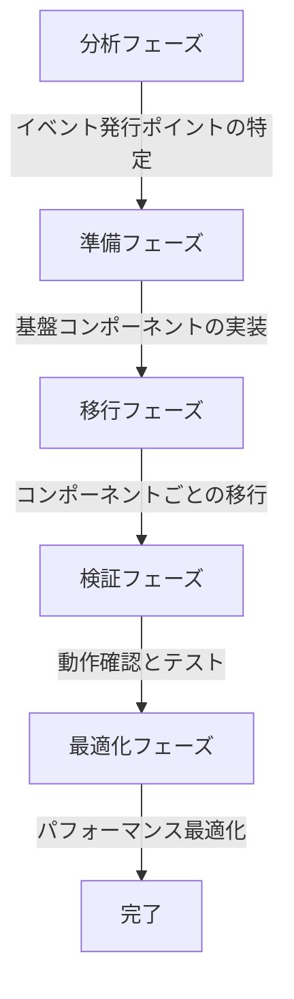

# イベント駆動アーキテクチャ移行ガイド

> **難易度: 中級〜上級** | 所要時間: 30分

このガイドでは、既存のコードを直接メソッド呼び出しからイベント駆動アーキテクチャに移行する手順と、既存コードに操作コンテキストを導入する方法について詳細に説明します。段階的なアプローチで、リスクを最小限に抑えながら移行を進める方法を提供します。

## 目次
- [1. 移行の概要](#1-移行の概要)
- [2. 直接メソッド呼び出しからイベントベースへの変換](#2-直接メソッド呼び出しからイベントベースへの変換)
- [3. EventMigrationHelperの使用方法](#3-eventmigrationhelperの使用方法)
- [4. 移行の検証方法](#4-移行の検証方法)
- [5. 問題発生時のロールバック手順](#5-問題発生時のロールバック手順)
- [6. 操作コンテキストの導入](#6-操作コンテキストの導入)
- [7. ケーススタディ](#7-ケーススタディ)

## 1. 移行の概要

### 1.1 移行の目的と利点

イベント駆動アーキテクチャへの移行には、以下のような目的と利点があります：

- **疎結合の実現**: コンポーネント間の直接的な依存関係を減少させる
- **拡張性の向上**: 新機能の追加が容易になる
- **テスト容易性の向上**: コンポーネントを分離してテストできるようになる
- **並行開発の促進**: 複数の開発者が異なるコンポーネントを同時に開発できる
- **デバッグ情報の充実**: イベントの履歴やコンテキスト情報によりデバッグが容易になる

### 1.2 段階的アプローチの重要性

イベント駆動アーキテクチャへの移行は、一度にすべてを変更するのではなく、段階的に進めることが重要です：

1. **分析フェーズ**: 既存コードの分析とイベント発行ポイントの特定
2. **準備フェーズ**: 基盤コンポーネントの実装とテスト
3. **移行フェーズ**: コンポーネントごとの段階的な移行
4. **検証フェーズ**: 移行後の動作確認とテスト
5. **最適化フェーズ**: パフォーマンスの最適化と改善



### 1.3 移行のタイムライン

移行のタイムラインは、プロジェクトの規模や複雑さによって異なりますが、一般的な目安は以下の通りです：

- **分析フェーズ**: 1〜2週間
- **準備フェーズ**: 2〜4週間
- **移行フェーズ**: 4〜8週間（コンポーネントごとに段階的に実施）
- **検証フェーズ**: 2〜4週間
- **最適化フェーズ**: 2〜4週間

### 1.4 移行の成功基準

移行の成功基準は、以下のような指標で評価できます：

- **機能的基準**: すべての既存機能が正常に動作すること
- **非機能的基準**: パフォーマンス、スケーラビリティ、保守性が向上すること
- **テスト基準**: テストカバレッジが維持または向上すること
- **開発効率基準**: 新機能の追加や変更が容易になること

## 2. 直接メソッド呼び出しからイベントベースへの変換

### 2.1 既存コードの分析

既存コードを分析し、イベント発行ポイントを特定するには、以下の手順を実施します：

1. **コンポーネント間の依存関係の分析**: コンポーネント間の呼び出し関係を図示する
2. **イベント発行候補の特定**: 複数のコンポーネントから呼び出されるメソッドや、状態変化を通知するメソッドを特定する
3. **イベントリスナー候補の特定**: イベントに応じて処理を行うべきコンポーネントを特定する
4. **イベント名の設計**: 標準化されたイベント名を設計する

```javascript
// 既存コードの例（直接メソッド呼び出し）
class TaskManager {
  createTask(taskData) {
    const task = this._createTaskInDatabase(taskData);
    
    // 直接メソッド呼び出し
    this.sessionManager.addTaskToCurrentSession(task.id);
    this.notificationManager.notifyTaskCreated(task);
    this.analyticsManager.trackTaskCreation(task);
    
    return task;
  }
}
```

### 2.2 イベント発行ポイントの特定

イベント発行ポイントを特定するには、以下のようなパターンに注目します：

- **状態変化の通知**: データの作成、更新、削除などの操作後
- **複数コンポーネントへの通知**: 複数のコンポーネントに同じ情報を通知する場合
- **非同期処理のトリガー**: バックグラウンド処理や長時間実行される処理のトリガー
- **クロスカッティングコンサーン**: ログ記録、監査、分析などの横断的関心事

```javascript
// イベント発行ポイントの例
class TaskManager {
  createTask(taskData) {
    const task = this._createTaskInDatabase(taskData);
    
    // イベント発行ポイント
    // ここでタスク作成イベントを発行すべき
    
    return task;
  }
}
```

### 2.3 イベントリスナーの設計

イベントリスナーを設計する際は、以下の点に注意します：

- **単一責任の原則**: 各リスナーは単一の責任を持つようにする
- **エラー処理**: リスナー内でのエラー処理を適切に行う
- **非同期処理**: 長時間実行される処理は非同期で行う
- **順序依存性**: リスナー間の順序依存性を最小限に抑える

```javascript
// イベントリスナーの例
class SessionManager {
  constructor(eventEmitter) {
    this.eventEmitter = eventEmitter;
    
    // イベントリスナーの登録
    this.eventEmitter.on('task:task_created', this.handleTaskCreated.bind(this));
  }
  
  handleTaskCreated(taskData) {
    try {
      this.addTaskToCurrentSession(taskData.id);
    } catch (error) {
      this.logger.error('セッションへのタスク追加に失敗しました:', error);
    }
  }
}
```

### 2.4 Before/Afterの具体例

以下は、直接メソッド呼び出しからイベントベースへの変換の具体例です：

#### Before（直接メソッド呼び出し）

```javascript
// Before: 直接メソッド呼び出し
class TaskManager {
  constructor(sessionManager, notificationManager, analyticsManager) {
    this.sessionManager = sessionManager;
    this.notificationManager = notificationManager;
    this.analyticsManager = analyticsManager;
  }
  
  createTask(taskData) {
    const task = this._createTaskInDatabase(taskData);
    
    // 直接メソッド呼び出し
    this.sessionManager.addTaskToCurrentSession(task.id);
    this.notificationManager.notifyTaskCreated(task);
    this.analyticsManager.trackTaskCreation(task);
    
    return task;
  }
}
```

#### After（イベントベース）

```javascript
// After: イベントベース
class TaskManager {
  constructor(eventEmitter) {
    this.eventEmitter = eventEmitter;
  }
  
  createTask(taskData) {
    const task = this._createTaskInDatabase(taskData);
    
    // イベント発行
    this.eventEmitter.emitStandardized('task', 'task_created', task);
    
    return task;
  }
}

// セッションマネージャーのリスナー
class SessionManager {
  constructor(eventEmitter) {
    this.eventEmitter = eventEmitter;
    
    // イベントリスナーの登録
    this.eventEmitter.on('task:task_created', this.handleTaskCreated.bind(this));
  }
  
  handleTaskCreated(taskData) {
    this.addTaskToCurrentSession(taskData.id);
  }
}

// 通知マネージャーのリスナー
class NotificationManager {
  constructor(eventEmitter) {
    this.eventEmitter = eventEmitter;
    
    // イベントリスナーの登録
    this.eventEmitter.on('task:task_created', this.handleTaskCreated.bind(this));
  }
  
  handleTaskCreated(taskData) {
    this.notifyTaskCreated(taskData);
  }
}

// 分析マネージャーのリスナー
class AnalyticsManager {
  constructor(eventEmitter) {
    this.eventEmitter = eventEmitter;
    
    // イベントリスナーの登録
    this.eventEmitter.on('task:task_created', this.handleTaskCreated.bind(this));
  }
  
  handleTaskCreated(taskData) {
    this.trackTaskCreation(taskData);
  }
}
```

## 3. EventMigrationHelperの使用方法

### 3.1 ヘルパーの機能と利点

EventMigrationHelperは、イベント駆動アーキテクチャへの移行を支援するためのヘルパークラスで、以下の機能と利点があります：

- **古いイベント名と新しいイベント名の両立**: 移行期間中に両方のイベント名をサポート
- **イベントバージョン間の変換**: 異なるバージョンのイベントデータを変換
- **イベント発行の標準化**: イベント発行を標準化された形式に変換
- **デバッグ情報の提供**: 移行に関するデバッグ情報を提供

### 3.2 古いイベント名と新しいイベント名の両立

古いイベント名と新しいイベント名を両立させるには、以下のようにEventMigrationHelperを使用します：

```javascript
// EventMigrationHelperの使用例
const { EVENT_MAP } = require('../../lib/core/event-constants');

function emitStandardizedEvent(eventEmitter, component, action, data = {}, bridgeOldEvents = true) {
  if (!eventEmitter) {
    return false;
  }
  
  try {
    // 標準化されたイベント名
    const standardEvent = `${component}:${action}`;
    
    // 標準化されたイベントデータ
    const standardizedData = {
      ...data,
      timestamp: new Date().toISOString(),
      component,
      action
    };
    
    // 標準化されたイベント発行
    eventEmitter.emit(standardEvent, standardizedData);
    
    // 古いイベント名のサポート（オプション）
    if (bridgeOldEvents) {
      const oldEventName = EVENT_MAP[standardEvent];
      
      if (oldEventName) {
        eventEmitter.emit(oldEventName, standardizedData);
        
        // 警告ログを出力（開発環境のみ）
        if (process.env.NODE_ENV === 'development' && eventEmitter.logger) {
          eventEmitter.logger.warn(`非推奨のイベント名 ${oldEventName} が使用されています。代わりに ${standardEvent} を使用してください。`, {
            oldEventName,
            standardEvent,
            timestamp: standardizedData.timestamp
          });
        }
      }
    }
    
    return true;
  } catch (error) {
    if (eventEmitter.logger) {
      eventEmitter.logger.error(`イベント発行中にエラーが発生しました: ${component}:${action}`, error);
    } else {
      console.error(`イベント発行中にエラーが発生しました: ${component}:${action}`, error);
    }
    return false;
  }
}
```

### 3.3 イベントバージョン間の変換

イベントバージョン間の変換を行うには、以下のようにEventMigrationHelperを使用します：

```javascript
// イベントバージョン間の変換
function migrateEventData(eventName, data, fromVersion, toVersion) {
  // イベント定義の取得
  const eventDefinition = eventCatalog.getEventDefinition(eventName);
  
  if (!eventDefinition) {
    logger.warn(`イベント定義が見つかりません: ${eventName}`);
    return data;
  }
  
  if (fromVersion === toVersion) {
    return data;
  }
  
  // バージョン間の変換ロジック
  let migratedData = { ...data };
  
  // 各バージョンの変更を適用
  for (let v = fromVersion; v < toVersion; v++) {
    const versionInfo = eventDefinition.previousVersions.find(pv => pv.version === v);
    
    if (versionInfo && versionInfo.migrationFunction) {
      migratedData = versionInfo.migrationFunction(migratedData);
    }
  }
  
  return migratedData;
}
```

### 3.4 実際の使用例

以下は、EventMigrationHelperを使用した実際の例です：

```javascript
// BaseAdapterでのEventMigrationHelperの使用例
_emitEvent(component, action, data = {}, context = null, bridgeOldEvents = true) {
  if (!this.eventEmitter) {
    return;
  }
  
  // コンテキストにエラーがある場合はイベント発行をスキップ
  if (context && context.hasError()) {
    if (this.eventEmitter.debugMode) {
      this.logger.debug(`イベント ${component}:${action} はコンテキスト ${context.id} でエラーが発生しているためスキップされました`);
    }
    return;
  }
  
  try {
    // イベント名の定数マッピングをインポート
    const { EVENT_MAP } = require('../../lib/core/event-constants');
    
    // 標準化されたイベント名
    const standardEvent = `${component}:${action}`;
    
    // コンテキスト情報をデータに追加
    const enhancedData = {
      ...data,
      _context: context ? context.id : null,
      timestamp: data.timestamp || new Date().toISOString()
    };
    
    // コンテキスト付きイベント発行が利用可能な場合はそちらを使用
    if (context && typeof this.eventEmitter.emitStandardizedWithContext === 'function') {
      this.eventEmitter.emitStandardizedWithContext(component, action, enhancedData, context, { bridgeOldEvents });
    } else {
      // 標準化されたイベント発行
      this.eventEmitter.emit(standardEvent, enhancedData);
      
      // グローバルイベントも発行
      this.eventEmitter.emit('event', {
        type: standardEvent,
        ...enhancedData
      });
      
      // 古いイベント名のサポート（オプション）
      if (bridgeOldEvents) {
        const oldEventName = EVENT_MAP[standardEvent];
        
        if (oldEventName) {
          this.eventEmitter.emit(oldEventName, enhancedData);
          
          // 警告ログを出力（開発環境のみ）
          if (process.env.NODE_ENV === 'development' && this.eventEmitter.logger) {
            this.eventEmitter.logger.warn(`非推奨のイベント名 ${oldEventName} が使用されています。代わりに ${standardEvent} を使用してください。`, {
              oldEventName,
              standardEvent,
              timestamp: enhancedData.timestamp
            });
          }
        }
      }
    }
  } catch (error) {
    this.logger.warn(`イベント発行中にエラーが発生しました: ${component}:${action}`, error);
  }
}
```

## 4. 移行の検証方法

### 4.1 単体テストの作成

移行の検証には、単体テストが重要です。以下のような単体テストを作成します：

```javascript
// イベント発行のテスト
test('タスク作成時にイベントが発行される', async () => {
  // イベント発行をモック
  const emitSpy = jest.spyOn(eventEmitter, 'emitStandardized');
  
  // テスト対象のメソッドを呼び出し
  await taskAdapter.createTask({ title: 'テストタスク' });
  
  // イベントが発行されたことを確認
  expect(emitSpy).toHaveBeenCalledWith(
    'task', 
    'task_created', 
    expect.objectContaining({ title: 'テストタスク' }),
    expect.any(Object)
  );
});

// イベントリスナーのテスト
test('タスク作成イベントでセッションが更新される', async () => {
  // セッション更新をモック
  const addTaskToSessionMock = jest.fn();
  sessionManager.addTaskToCurrentSession = addTaskToSessionMock;
  
  // イベントを発行
  eventEmitter.emit('task:task_created', { id: 'T001', title: 'テストタスク' });
  
  // セッション更新が呼び出されたことを確認
  expect(addTaskToSessionMock).toHaveBeenCalledWith('T001');
});
```

### 4.2 統合テストの実施

統合テストでは、複数のコンポーネント間の連携を検証します：

```javascript
// 統合テスト
test('タスク作成からセッション関連付けまでの流れ', async () => {
  // イベントリスナーの登録
  const taskCreatedListener = jest.fn();
  const sessionTaskAddedListener = jest.fn();
  
  eventEmitter.on('task:task_created', taskCreatedListener);
  eventEmitter.on('session:task_added', sessionTaskAddedListener);
  
  // タスクの作成
  const task = await taskAdapter.createTask({ title: 'テストタスク' });
  
  // タスク作成イベントが発行されたことを確認
  expect(taskCreatedListener).toHaveBeenCalled();
  
  // セッションの作成
  const session = await sessionAdapter.createNewSession();
  
  // タスクをセッションに関連付け
  await sessionAdapter.addTaskToSession(session.session_handover.session_id, task.id);
  
  // セッションタスク追加イベントが発行されたことを確認
  expect(sessionTaskAddedListener).toHaveBeenCalled();
});
```

### 4.3 並行動作期間の設定

移行中は、新旧両方の実装を並行して動作させることで、問題が発生した場合に迅速に対応できます：

```javascript
// 並行動作の例
class TaskManager {
  createTask(taskData) {
    const task = this._createTaskInDatabase(taskData);
    
    // フィーチャーフラグによる切り替え
    if (this.featureFlags.isEnabled('use-event-driven')) {
      // 新しい実装（イベントベース）
      this.eventEmitter.emitStandardized('task', 'task_created', task);
    } else {
      // 古い実装（直接メソッド呼び出し）
      this.sessionManager.addTaskToCurrentSession(task.id);
      this.notificationManager.notifyTaskCreated(task);
      this.analyticsManager.trackTaskCreation(task);
    }
    
    return task;
  }
}
```

### 4.4 検証の実例

以下は、移行の検証の実例です：

```javascript
// 移行検証の実例
describe('イベント駆動アーキテクチャ移行検証', () => {
  let oldImplementation;
  let newImplementation;
  let testData;
  
  beforeEach(() => {
    // テストデータの準備
    testData = { title: '移行検証タスク' };
    
    // 古い実装のセットアップ
    oldImplementation = new OldTaskManager(
      new OldSessionManager(),
      new OldNotificationManager(),
      new OldAnalyticsManager()
    );
    
    // 新しい実装のセットアップ
    const eventEmitter = new EnhancedEventEmitter();
    newImplementation = new NewTaskManager(eventEmitter);
    new NewSessionManager(eventEmitter);
    new NewNotificationManager(eventEmitter);
    new NewAnalyticsManager(eventEmitter);
  });
  
  test('新旧実装の結果が一致する', async () => {
    // 古い実装の実行
    const oldResult = await oldImplementation.createTask(testData);
    
    // 新しい実装の実行
    const newResult = await newImplementation.createTask(testData);
    
    // 結果が一致することを確認
    expect(newResult).toEqual(oldResult);
  });
  
  test('新しい実装でイベントが発行される', async () => {
    // イベントキャプチャの準備
    const capturedEvents = [];
    eventEmitter.on('*', (data, eventName) => {
      capturedEvents.push({ name: eventName, data });
    });
    
    // 新しい実装の実行
    await newImplementation.createTask(testData);
    
    // イベントが発行されたことを確認
    expect(capturedEvents).toContainEqual({
      name: 'task:task_created',
      data: expect.objectContaining({ title: '移行検証タスク' })
    });
  });
});
```

## 5. 問題発生時のロールバック手順

### 5.1 フィーチャーフラグの活用

フィーチャーフラグを活用することで、問題発生時に迅速にロールバックできます：

```javascript
// フィーチャーフラグの実装
class FeatureFlags {
  constructor(options = {}) {
    this.flags = options.flags || {};
    this.logger = options.logger || console;
  }
  
  isEnabled(flagName, defaultValue = false) {
    if (flagName in this.flags) {
      return this.flags[flagName];
    }
    return defaultValue;
  }
  
  enable(flagName) {
    this.flags[flagName] = true;
    this.logger.info(`フィーチャーフラグを有効化: ${flagName}`);
  }
  
  disable(flagName) {
    this.flags[flagName] = false;
    this.logger.info(`フィーチャーフラグを無効化: ${flagName}`);
  }
}

// フィーチャーフラグの使用例
const featureFlags = new FeatureFlags({
  flags: {
    'use-event-driven': true,
    'use-operation-context': true
  }
});

// コード内での使用
if (featureFlags.isEnabled('use-event-driven')) {
  // 新しい実装（イベントベース）
} else {
  // 古い実装（直接メソッド呼び出し）
}
```

### 5.2 段階的ロールバックの方法

問題発生時には、段階的にロールバックすることで影響を最小限に抑えられます：

1. **フィーチャーフラグの無効化**: 問題のあるフィーチャーフラグを無効化
2. **部分的ロールバック**: 問題のあるコンポーネントのみをロールバック
3. **完全ロールバック**: 必要に応じて完全にロールバック
4. **問題の分析と修正**: 問題の原因を分析し、修正

```javascript
// 段階的ロールバックの例
function rollbackFeature(featureName) {
  // フィーチャーフラグの無効化
  featureFlags.disable(featureName);
  
  // ロールバックログの記録
  logger.info(`フィーチャーをロールバック: ${featureName}`);
  
  // 関連コンポーネントの再初期化
  if (featureName === 'use-event-driven') {
    reinitializeComponents();
  }
}

// 部分的ロールバックの例
function rollbackComponent(componentName) {
  // コンポーネント固有のロールバック処理
  switch (componentName) {
    case 'task-manager':
      taskManager = new OldTaskManager(/* ... */);
      break;
    case 'session-manager':
      sessionManager = new OldSessionManager(/* ... */);
      break;
    // その他のコンポーネント
  }
  
  // ロールバックログの記録
  logger.info(`コンポーネントをロールバック: ${componentName}`);
}
```

### 5.3 移行の再開手順

問題が解決したら、以下の手順で移行を再開します：

1. **問題の修正確認**: 問題が修正されたことを確認
2. **テストの実施**: 修正後のコードをテスト
3. **フィーチャーフラグの再有効化**: フィーチャーフラグを再度有効化
4. **段階的な再導入**: 問題のあったコンポーネントを段階的に再導入
5. **監視の強化**: 問題が再発しないよう監視を強化

```javascript
// 移行再開の例
function resumeMigration(featureName) {
  // 問題が修正されたことを確認
  const testsPassed = runTests(featureName);
  
  if (!testsPassed) {
    logger.error(`テストが失敗したため、移行を再開できません: ${featureName}`);
    return false;
  }
  
  // フィーチャーフラグの再有効化
  featureFlags.enable(featureName);
  
  // 関連コンポーネントの再初期化
  if (featureName === 'use-event-driven') {
    reinitializeComponents();
  }
  
  // 移行再開ログの記録
  logger.info(`移行を再開: ${featureName}`);
  
  // 監視の強化
  enableEnhancedMonitoring(featureName);
  
  return true;
}
```

### 5.4 ロールバックの実例

以下は、ロールバックの実例です：

```javascript
// ロールバックの実例
function handleProductionIssue(issue) {
  logger.error(`本番環境で問題が発生: ${issue.description}`);
  
  // 影響の評価
  const severity = assessIssueSeverity(issue);
  
  if (severity === 'critical') {
    // 重大な問題の場合は完全ロールバック
    logger.warn('重大な問題が発生したため、完全ロールバックを実施します');
    
    // すべてのフィーチャーフラグを無効化
    featureFlags.disable('use-event-driven');
    featureFlags.disable('use-operation-context');
    
    // すべてのコンポーネントをロールバック
    rollbackAllComponents();
    
    // 開発チームに通知
    notifyDevelopmentTeam(issue, 'complete-rollback');
  } else if (severity === 'major') {
    // 重要な問題の場合は部分的ロールバック
    logger.warn('重要な問題が発生したため、部分的ロールバックを実施します');
    
    // 問題のあるコンポーネントを特定
    const affectedComponents = identifyAffectedComponents(issue);
    
    // 影響のあるコンポーネントをロールバック
    affectedComponents.forEach(component => {
      rollbackComponent(component);
    });
    
    // 開発チームに通知
    notifyDevelopmentTeam(issue, 'partial-rollback', affectedComponents);
  } else {
    // 軽微な問題の場合は監視を強化
    logger.info('軽微な問題が発生したため、監視を強化します');
    
    // 監視の強化
    enableEnhancedMonitoring();
    
    // 開発チームに通知
    notifyDevelopmentTeam(issue, 'enhanced-monitoring');
  }
}
```

## 6. 操作コンテキストの導入

### 6.1 操作コンテキストの概要

操作コンテキスト（OperationContext）は、イベント連鎖の状態を追跡し、エラー状態を管理するためのクラスです。既存コードに操作コンテキストを導入することで、以下のような利点があります：

- **状態追跡**: 一連の操作の状態を追跡し、操作の成功/失敗を管理
- **エラー伝播**: 子コンテキストから親コンテキストへのエラー伝播を実現
- **メタデータ管理**: 操作に関連するメタデータを保持
- **デバッグ情報**: 操作の開始時刻、経過時間などのデバッグ情報を提供
- **イベント連鎖の制御**: エラー発生時にイベント連鎖を中断する仕組みを提供

### 6.2 既存メソッドへのコンテキストパラメータの追加

既存メソッドに操作コンテキストパラメータを追加するには、以下の手順を実施します：

1. **メソッドシグネチャの変更**: コンテキストパラメータを追加（オプショナルにして後方互換性を確保）
2. **コンテキスト作成ロジックの追加**: コンテキストがない場合は新しく作成
3. **コンテキストを使用するロジックの追加**: コンテキストを使用してエラー状態を管理
4. **コンテキスト付きイベント発行の追加**: コンテキスト情報をイベントに含める

```javascript
// Before: コンテキストなし
async createTask(taskData) {
  try {
    // パラメータの検証
    this._validateParams(taskData, ['title']);
    
    // タスクの作成
    const task = await this.manager.createTask(taskData);
    
    // イベントの発行
    this._emitEvent('task', 'task_created', task);
    
    return task;
  } catch (error) {
    // エラー処理
    return this._handleError(error, 'createTask', { taskData });
  }
}

// After: コンテキスト付き
async createTask(taskData, context = null) {
  // コンテキストがない場合は新しく作成
  context = context || this._createContext('createTask', { taskData });
  
  try {
    // パラメータの検証
    this._validateParams(taskData, ['title']);
    
    // タスクの作成
    const task = await this.manager.createTask(taskData);
    
    // イベントの発行（コンテキスト付き）
    this._emitEvent('task', 'task_created', task, context);
    
    return task;
  } catch (error) {
    // エラー処理（コンテキスト付き）
    return this._handleError(error, 'createTask', context, { taskData });
  }
}
```

### 6.3 コンテキスト作成メソッドの実装

コンテキスト作成メソッドを実装するには、以下のようにします：

```javascript
// コンテキスト作成メソッドの実装
_createContext(operation, metadata = {}, parentContext = null) {
  if (!this.eventEmitter) {
    return null;
  }
  
  return this.eventEmitter.createContext({
    component: this.constructor.name,
    operation,
    ...metadata
  }, parentContext);
}
```

### 6.4 エラーハンドリングの改善

操作コンテキストを使用してエラーハンドリングを改善するには、以下のようにします：

```javascript
// エラーハンドリングの改善
_handleError(error, operation, context = null, details = {}) {
  // エラーハンドラーが存在する場合はそちらに委譲
  if (this.errorHandler && typeof this.errorHandler.handle === 'function') {
    return this.errorHandler.handle(error, this.constructor.name, operation, {
      context: context ? context.id : null,
      ...details
    });
  }
  
  // コンテキストにエラーを設定
  if (context) {
    context.setError(error, this.constructor.name, operation, details);
  }
  
  // エラーイベントを発行
  if (this.eventEmitter) {
    const component = this.constructor.name.replace('Adapter', '').toLowerCase();
    this.eventEmitter.emitError(error, component, operation, context, details);
  } else {
    // イベントエミッターがない場合は直接ロガーに出力
    this.logger.error(`Error in ${this.constructor.name}.${operation}:`, error, details);
  }
  
  // 構造化されたエラー情報を返す
  return {
    error: true,
    message: error.message,
    code: error.code || 'UNKNOWN_ERROR',
    operation,
    name: error.name || 'Error',
    timestamp: new Date().toISOString(),
    context: context ? context.id : null,
    details: JSON.stringify(details)
  };
}
```

### 6.5 段階的な導入戦略

操作コンテキストを段階的に導入するには、以下の戦略を採用します：

1. **基盤コンポーネントの実装**: OperationContextクラスとEnhancedEventEmitterの実装
2. **アダプターの拡張**: BaseAdapterに操作コンテキスト関連のメソッドを追加
3. **コアコンポーネントの移行**: 重要なコアコンポーネントから順に移行
4. **周辺コンポーネントの移行**: 周辺コンポーネントを順次移行
5. **テストと検証**: 各段階でテストと検証を実施

```javascript
// 段階的な導入の例
// フェーズ1: 基盤コンポーネントの実装
const OperationContext = require('./operation-context');
const EnhancedEventEmitter = require('./enhanced-event-emitter');

// フェーズ2: アダプターの拡張
class BaseAdapter {
  _createContext(operation, metadata = {}, parentContext = null) {
    // コンテキスト作成ロジック
  }
  
  _handleError(error, operation, context = null, details = {}) {
    // エラーハンドリングロジック
  }
  
  _emitEvent(component, action, data = {}, context = null, bridgeOldEvents = true) {
    // イベント発行ロジック
  }
}

// フェーズ3: コアコンポーネントの移行
class TaskManagerAdapter extends BaseAdapter {
  async createTask(taskData, context = null) {
    // コンテキスト対応版の実装
  }
  
  // その他のメソッド
}

// フェーズ4: 周辺コンポーネントの移行
class SessionManagerAdapter extends BaseAdapter {
  async createNewSession(context = null) {
    // コンテキスト対応版の実装
  }
  
  // その他のメソッド
}
```

## 7. ケーススタディ

### 7.1 実際の移行事例

以下は、実際の移行事例の例です：

#### 7.1.1 タスク管理システムの移行

**移行前の状態**:
- タスク作成時に複数のコンポーネントを直接呼び出し
- エラーハンドリングが不統一
- デバッグ情報が不足

**移行手順**:
1. イベント駆動アーキテクチャの基盤コンポーネントを実装
2. タスク作成メソッドをイベントベースに変更
3. 関連コンポーネントにイベントリスナーを実装
4. 操作コンテキストを導入
5. テストと検証を実施

**移行後の状態**:
- タスク作成時にイベントを発行し、関連コンポーネントはリスナーで処理
- 統一されたエラーハンドリング
- 充実したデバッグ情報
- 拡張性の向上

### 7.2 遭遇した問題と解決策

移行中に遭遇した問題と解決策の例：

#### 7.2.1 イベント名の不一致

**問題**:
- 異なるコンポーネントで異なるイベント名が使用されていた
- イベントリスナーが正しく呼び出されない

**解決策**:
- イベント名の標準化ガイドラインを作成
- EVENT_NAMESオブジェクトで標準化されたイベント名を定義
- 古いイベント名と新しいイベント名のマッピングを実装
- 移行期間中は両方のイベント名をサポート

#### 7.2.2 非同期処理の問題

**問題**:
- イベントリスナー内の非同期処理が完了する前に次の処理が実行される
- 処理順序に依存するコンポーネント間で問題が発生

**解決策**:
- 非同期イベント発行メソッド（emitAsync）を実装
- Promiseベースの処理を導入
- 操作コンテキストを使用して処理の状態を追跡
- 重要な処理順序を保証するためのイベント連鎖パターンを導入

#### 7.2.3 エラー処理の問題

**問題**:
- イベントリスナー内でのエラーが適切に処理されない
- エラーが発生してもイベント連鎖が継続してしまう

**解決策**:
- 操作コンテキストを使用したエラー状態の管理
- エラー発生時のイベント連鎖の中断メカニズムを実装
- 統一されたエラーハンドリングパターンを導入
- エラーイベントの標準化

### 7.3 学んだ教訓

移行から学んだ教訓の例：

1. **段階的アプローチの重要性**: 一度にすべてを変更するのではなく、段階的に進めることが重要
2. **テストの重要性**: 各段階でテストを実施することで問題を早期に発見できる
3. **後方互換性の確保**: 移行期間中は後方互換性を確保することが重要
4. **ドキュメントの重要性**: 移行の各段階でドキュメントを更新することが重要
5. **チーム全体の理解**: チーム全体がイベント駆動アーキテクチャを理解することが重要

### 7.4 成功のポイント

移行の成功のポイントの例：

1. **明確な目標設定**: 移行の目標を明確に設定し、チーム全体で共有
2. **段階的な実装**: 一度にすべてを変更するのではなく、段階的に実装
3. **継続的なテスト**: 各段階でテストを実施し、問題を早期に発見
4. **フィーチャーフラグの活用**: フィーチャーフラグを活用して、問題発生時に迅速に対応
5. **チーム全体の参加**: 移行にはチーム全体が参加し、知識を共有
6. **ドキュメントの充実**: 移行の各段階でドキュメントを充実させ、知識を共有
7. **モニタリングの強化**: 移行中はモニタリングを強化し、問題を早期に発見

## 関連ドキュメント

- [クイックスタートガイド](./event-driven-quickstart.md) - イベント駆動アーキテクチャの基本的な使用方法
- [イベント駆動アーキテクチャガイド](./event-driven-architecture-guide.md) - イベント駆動アーキテクチャの詳細な説明
- [開発者向けチートシート](./event-driven-cheatsheet.md) - よく使用されるイベント名とコードスニペット
- [イベント名標準化ガイド](./event-naming-convention.md) - イベント名の命名規則と標準化ガイドライン
- [操作コンテキスト活用ガイド](./operation-context-guide.md) - 操作コンテキストの詳細な使用方法
- [イベント駆動アーキテクチャのテストガイド](./event-driven-testing-guide.md) - イベント駆動アーキテクチャのテスト方法

## 次のステップ

イベント駆動アーキテクチャへの移行方法を理解したら、次のステップとして以下のドキュメントを参照してください：

- [イベント駆動アーキテクチャのテストガイド](./event-driven-testing-guide.md) - 移行後のコードをテストする方法を学ぶ