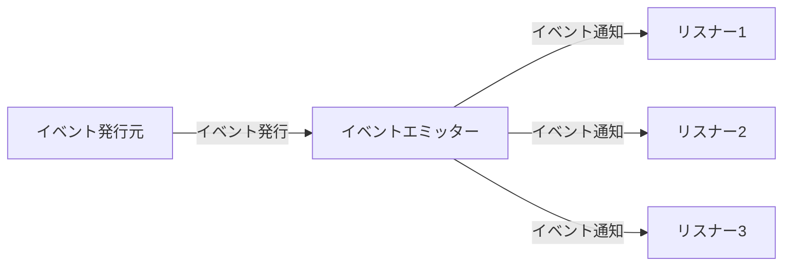

# イベント駆動アーキテクチャ クイックスタートガイド

> **難易度: 基本** | 所要時間: 15分

このガイドでは、イベント駆動アーキテクチャの基本概念と、本システムでの実装方法を簡潔に説明します。最小限の知識で基本的なイベント発行と購読ができるようになることを目指します。

## 目次
- [1. イベント駆動アーキテクチャとは](#1-イベント駆動アーキテクチャとは)
- [2. 基本的なイベント発行と購読](#2-基本的なイベント発行と購読)
- [3. よくある使用パターン](#3-よくある使用パターン)
- [4. 次のステップ](#4-次のステップ)

## 1. イベント駆動アーキテクチャとは

イベント駆動アーキテクチャとは、システムコンポーネント間の通信をイベントの発行と購読によって実現するアーキテクチャパターンです。イベントとは、システム内で発生した重要な状態変化や動作を表すメッセージです。



### 主要コンポーネント

- **EnhancedEventEmitter**: イベントの発行と購読を管理するクラス
- **OperationContext**: イベント連鎖の状態を追跡し、エラー状態を管理するクラス
- **BaseAdapter**: アダプターの基底クラス、共通機能を提供するクラス

> **ヒント**: イベント駆動アーキテクチャの最大の利点は、コンポーネント間の疎結合を実現できることです。これにより、システムの拡張性と保守性が向上します。

## 2. 基本的なイベント発行と購読

### イベントの発行

イベントを発行するには、主に以下の2つの方法があります：

#### 標準的なイベント発行

```javascript
// 基本的なイベント発行
this.eventEmitter.emitStandardized('task', 'task_created', { 
  id: 'T001', 
  title: 'タスクの作成'
});
```

#### コンテキスト付きイベント発行

```javascript
// コンテキスト付きイベント発行
const context = this._createContext('createTask', { taskId: 'T001' });
this._emitEvent('task', 'task_created', { 
  id: 'T001', 
  title: 'タスクの作成'
}, context);
```

### イベントの購読

イベントを購読するには、以下のようにリスナーを登録します：

#### 基本的なイベントリスナー

```javascript
// 基本的なイベントリスナー
eventEmitter.on('task:task_created', (data) => {
  console.log(`タスクが作成されました: ${data.title}`);
});
```

#### ワイルドカードリスナー

```javascript
// ワイルドカードリスナー（タスク関連のすべてのイベントを購読）
eventEmitter.on('task:*', (data, eventName) => {
  console.log(`タスク関連イベント: ${eventName}`);
});
```

#### 一度だけ実行されるリスナー

```javascript
// 一度だけ実行されるリスナー
eventEmitter.once('task:task_created', (data) => {
  console.log(`タスクが作成されました（一度だけ表示）: ${data.title}`);
});
```

> **注意**: イベント名は `component:action` の形式で標準化されています。例えば、`task:task_created` は「タスクが作成された」イベントを表します。

## 3. よくある使用パターン

### タスク作成時のイベント発行

以下は、タスク作成時にイベントを発行する典型的なパターンです：

```javascript
async createTask(taskData, context = null) {
  // コンテキストがない場合は新しく作成
  context = context || this._createContext('createTask', { taskData });
  
  try {
    // パラメータの検証
    this._validateParams(taskData, ['title']);
    
    // タスクの作成
    const task = await this.manager.createTask(taskData);
    
    // イベントの発行
    this._emitEvent('task', 'task_created', task, context);
    
    return task;
  } catch (error) {
    // エラー処理
    return this._handleError(error, 'createTask', context, { taskData });
  }
}
```

### イベントリスナーによる連携処理

以下は、タスク作成イベントを購読して、関連するセッションを作成する例です：

```javascript
// タスク作成時にセッションを自動的に作成するリスナー
eventEmitter.on('task:task_created', async (data) => {
  try {
    // セッションの作成
    const session = await sessionAdapter.createNewSession();
    
    // タスクをセッションに関連付け
    await sessionAdapter.addTaskToSession(
      session.session_handover.session_id,
      data.id
    );
    
    console.log(`タスク ${data.id} をセッション ${session.session_handover.session_id} に関連付けました`);
  } catch (error) {
    console.error('セッション作成中にエラーが発生しました:', error);
  }
});
```

### エラー発生時のイベント発行

エラーが発生した場合にイベントを発行する例です：

```javascript
try {
  // 何らかの処理
  throw new Error('テストエラー');
} catch (error) {
  // エラーイベントを発行
  this._emitErrorEvent(error, 'someOperation', context, { 
    additionalInfo: 'エラーに関する追加情報'
  });
}
```

## 4. 次のステップ

このクイックスタートガイドでは、イベント駆動アーキテクチャの基本的な概念と使用方法を説明しました。より詳細な情報は以下のドキュメントを参照してください：

- [イベント駆動アーキテクチャガイド](./event-driven-architecture-guide.md) - イベント駆動アーキテクチャの詳細な説明
- [開発者向けチートシート](./event-driven-cheatsheet.md) - よく使用されるイベント名とコードスニペット
- [操作コンテキスト活用ガイド](./operation-context-guide.md) - 操作コンテキストの詳細な使用方法

## 関連ドキュメント

- [イベント名標準化ガイド](./event-naming-convention.md) - イベント名の命名規則と標準化ガイドライン
- [イベント駆動アーキテクチャのテストガイド](./event-driven-testing-guide.md) - イベント駆動アーキテクチャのテスト方法