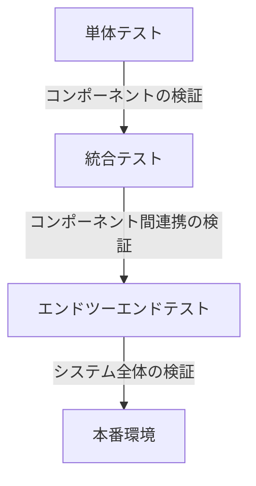

# イベント駆動アーキテクチャのテストガイド

> **難易度: 中級〜上級** | 所要時間: 25分

このガイドでは、イベント駆動アーキテクチャのテスト方法について詳細に説明します。イベント発行のテスト、イベントリスナーのテスト、操作コンテキストを使ったテストなど、効果的なテスト戦略を提供します。

## 目次
- [1. イベント駆動アーキテクチャのテスト概要](#1-イベント駆動アーキテクチャのテスト概要)
- [2. イベント発行のテスト](#2-イベント発行のテスト)
- [3. イベントリスナーのテスト](#3-イベントリスナーのテスト)
- [4. 非同期イベント処理のテスト](#4-非同期イベント処理のテスト)
- [5. 操作コンテキストを使ったテスト](#5-操作コンテキストを使ったテスト)
- [6. 統合テストの実装](#6-統合テストの実装)
- [7. テストのベストプラクティス](#7-テストのベストプラクティス)

## 1. イベント駆動アーキテクチャのテスト概要

### 1.1 テストの重要性

イベント駆動アーキテクチャでは、コンポーネント間の通信がイベントを介して行われるため、従来の直接メソッド呼び出しとは異なるテスト戦略が必要です。適切なテストにより、以下のような利点があります：

- **イベント発行の確認**: 正しいイベントが正しいタイミングで発行されることを確認
- **イベントリスナーの動作確認**: リスナーが正しく登録され、イベントに応じて適切に動作することを確認
- **イベント連鎖の検証**: 複数のイベントが連鎖的に発行される場合の動作を確認
- **エラー処理の検証**: エラー発生時のイベント連鎖の中断や伝播を確認

### 1.2 テスト戦略

イベント駆動アーキテクチャのテストには、以下の戦略が効果的です：

1. **単体テスト**: 個々のコンポーネントやアダプターのテスト
2. **統合テスト**: 複数のコンポーネント間の連携のテスト
3. **エンドツーエンドテスト**: システム全体の動作のテスト



### 1.3 テスト環境のセットアップ

イベント駆動アーキテクチャのテストには、以下の環境セットアップが必要です：

```javascript
// テスト環境のセットアップ例
describe('アダプター統合テスト', () => {
  let eventEmitter;
  let taskAdapter;
  let sessionAdapter;
  let feedbackAdapter;
  let mockLogger;
  let emittedEvents;
  
  beforeEach(() => {
    emittedEvents = [];
    
    mockLogger = {
      debug: jest.fn(),
      info: jest.fn(),
      warn: jest.fn(),
      error: jest.fn()
    };
    
    // 実際のEventEmitterを使用
    eventEmitter = new EnhancedEventEmitter({ logger: mockLogger });
    
    // イベントをキャプチャ
    eventEmitter.on('*', (data, eventName) => {
      emittedEvents.push({ name: eventName, data });
    });
    
    // モックの作成
    const mockTaskManager = {
      createTask: jest.fn().mockImplementation(data => ({ id: 'T001', ...data })),
      // その他のモックメソッド...
    };
    
    // アダプターの作成
    taskAdapter = new TaskManagerAdapter(mockTaskManager, {
      eventEmitter,
      logger: mockLogger
    });
    
    // その他のアダプターのセットアップ...
  });
  
  // テストケース...
});
```

## 2. イベント発行のテスト

### 2.1 イベント発行をモックする方法

イベント発行をテストするには、`jest.spyOn`を使用してイベント発行メソッドをモックします：

```javascript
// イベント発行のモック
test('タスク作成時にイベントが発行される', async () => {
  // イベント発行をモック
  const emitSpy = jest.spyOn(eventEmitter, 'emitStandardized');
  
  // テスト対象のメソッドを呼び出し
  await taskAdapter.createTask({ title: 'テストタスク' });
  
  // イベントが発行されたことを確認
  expect(emitSpy).toHaveBeenCalledWith(
    'task', 
    'task_created', 
    expect.objectContaining({ title: 'テストタスク' }),
    expect.any(Object)
  );
});
```

### 2.2 発行されたイベントの検証

発行されたイベントを検証するには、以下の方法があります：

#### 2.2.1 イベントリスナーを使用した検証

```javascript
// イベントリスナーを使用した検証
test('タスク作成時に正しいイベントが発行される', async () => {
  // イベントをキャプチャするリスナー
  const capturedEvents = [];
  eventEmitter.on('task:task_created', (data) => {
    capturedEvents.push(data);
  });
  
  // テスト対象のメソッドを呼び出し
  await taskAdapter.createTask({ title: 'テストタスク' });
  
  // イベントが発行されたことを確認
  expect(capturedEvents.length).toBe(1);
  expect(capturedEvents[0].title).toBe('テストタスク');
});
```

#### 2.2.2 イベント履歴を使用した検証

```javascript
// イベント履歴を使用した検証
test('タスク作成時に正しいイベントが発行される', async () => {
  // テスト対象のメソッドを呼び出し
  await taskAdapter.createTask({ title: 'テストタスク' });
  
  // イベント履歴を取得
  const history = eventEmitter.getEventHistory();
  
  // イベントが発行されたことを確認
  const taskCreatedEvents = history.filter(e => e.event === 'task:task_created');
  expect(taskCreatedEvents.length).toBe(1);
  expect(taskCreatedEvents[0].data.title).toBe('テストタスク');
});
```

### 2.3 よくあるテストケース

イベント発行のよくあるテストケースには以下があります：

- **イベント名の検証**: 正しいイベント名で発行されることを確認
- **イベントデータの検証**: イベントデータに必要な情報が含まれていることを確認
- **タイムスタンプの検証**: イベントデータにタイムスタンプが含まれていることを確認
- **コンテキストIDの検証**: コンテキスト付きイベントの場合、コンテキストIDが含まれていることを確認

```javascript
// イベント発行の詳細な検証
test('タスク作成イベントの詳細を検証', async () => {
  // テスト対象のメソッドを呼び出し
  await taskAdapter.createTask({ title: 'テストタスク' });
  
  // 発行されたイベントを取得
  const taskCreatedEvent = emittedEvents.find(e => e.name === 'task:task_created');
  
  // イベントが発行されたことを確認
  expect(taskCreatedEvent).toBeDefined();
  
  // イベントデータの検証
  expect(taskCreatedEvent.data.title).toBe('テストタスク');
  expect(taskCreatedEvent.data.id).toBe('T001');
  
  // 標準フィールドの検証
  expect(taskCreatedEvent.data.timestamp).toBeDefined();
  expect(new Date(taskCreatedEvent.data.timestamp)).toBeInstanceOf(Date);
  
  // コンポーネント情報の検証
  expect(taskCreatedEvent.data.component).toBe('task');
  expect(taskCreatedEvent.data.action).toBe('task_created');
});
```

## 3. イベントリスナーのテスト

### 3.1 リスナーをモックする方法

イベントリスナーをテストするには、モックリスナーを作成して登録します：

```javascript
// リスナーのモック
test('イベントリスナーが呼び出される', async () => {
  // モックリスナーを作成
  const listener = jest.fn();
  
  // リスナーを登録
  eventEmitter.on('task:task_created', listener);
  
  // イベントを発行
  eventEmitter.emit('task:task_created', { id: 'T001', title: 'テストタスク' });
  
  // リスナーが呼び出されたことを確認
  expect(listener).toHaveBeenCalledWith(
    expect.objectContaining({ id: 'T001', title: 'テストタスク' })
  );
});
```

### 3.2 リスナーの動作を検証

リスナーの動作を検証するには、以下の方法があります：

```javascript
// リスナーの動作を検証
test('タスク作成時にセッションが作成される', async () => {
  // モックの作成
  const createSessionMock = jest.fn().mockResolvedValue({ session_handover: { session_id: 'S001' } });
  sessionAdapter.createNewSession = createSessionMock;
  
  // リスナーを登録
  eventEmitter.on('task:task_created', async (data) => {
    await sessionAdapter.createNewSession();
  });
  
  // イベントを発行
  await taskAdapter.createTask({ title: 'テストタスク' });
  
  // 非同期処理の完了を待つ
  await new Promise(resolve => setTimeout(resolve, 100));
  
  // セッション作成メソッドが呼び出されたことを確認
  expect(createSessionMock).toHaveBeenCalled();
});
```

### 3.3 よくあるテストケース

イベントリスナーのよくあるテストケースには以下があります：

- **リスナー登録の確認**: リスナーが正しく登録されることを確認
- **リスナー呼び出しの確認**: イベント発行時にリスナーが呼び出されることを確認
- **リスナー解除の確認**: リスナー解除後にイベントが発行されてもリスナーが呼び出されないことを確認
- **複数リスナーの確認**: 複数のリスナーが正しく呼び出されることを確認

```javascript
// リスナー登録と解除のテスト
test('リスナーの登録と解除', async () => {
  // モックリスナーを作成
  const listener = jest.fn();
  
  // リスナーを登録
  const removeListener = eventEmitter.on('task:task_created', listener);
  
  // イベントを発行
  eventEmitter.emit('task:task_created', { id: 'T001' });
  
  // リスナーが呼び出されたことを確認
  expect(listener).toHaveBeenCalledTimes(1);
  
  // リスナーをリセット
  listener.mockClear();
  
  // リスナーを解除
  removeListener();
  
  // 再度イベントを発行
  eventEmitter.emit('task:task_created', { id: 'T002' });
  
  // リスナーが呼び出されないことを確認
  expect(listener).not.toHaveBeenCalled();
});
```

## 4. 非同期イベント処理のテスト

### 4.1 非同期イベントのテスト方法

非同期イベント処理をテストするには、`async/await`と`Promise`を使用します：

```javascript
// 非同期イベント処理のテスト
test('非同期イベント処理のテスト', async () => {
  // 非同期リスナーを登録
  const asyncListener = jest.fn().mockImplementation(() => Promise.resolve());
  eventEmitter.on('task:task_created', asyncListener);
  
  // 非同期イベント発行
  await eventEmitter.emitAsync('task:task_created', { id: 'T001' });
  
  // リスナーが呼び出されたことを確認
  expect(asyncListener).toHaveBeenCalled();
});
```

### 4.2 タイミング問題の解決方法

非同期イベント処理のタイミング問題を解決するには、以下の方法があります：

```javascript
// タイミング問題の解決
test('イベント連鎖のテスト', async () => {
  // モックの作成
  const createSessionMock = jest.fn().mockResolvedValue({ session_handover: { session_id: 'S001' } });
  sessionAdapter.createNewSession = createSessionMock;
  
  // リスナーを登録
  eventEmitter.on('task:task_created', async (data) => {
    // 非同期処理
    await sessionAdapter.createNewSession();
  });
  
  // イベントを発行
  await taskAdapter.createTask({ title: 'テストタスク' });
  
  // 非同期処理の完了を待つ（方法1: setTimeout）
  await new Promise(resolve => setTimeout(resolve, 100));
  
  // または、方法2: jest.advanceTimersByTime（jestのフェイクタイマーを使用する場合）
  // jest.advanceTimersByTime(100);
  
  // セッション作成メソッドが呼び出されたことを確認
  expect(createSessionMock).toHaveBeenCalled();
});
```

### 4.3 よくあるテストケース

非同期イベント処理のよくあるテストケースには以下があります：

- **非同期リスナーの確認**: 非同期リスナーが正しく実行されることを確認
- **イベント連鎖の確認**: 一連の非同期イベントが正しい順序で発行されることを確認
- **タイムアウトの確認**: 長時間実行される処理のタイムアウト処理を確認
- **エラー処理の確認**: 非同期処理中のエラーが適切に処理されることを確認

```javascript
// 非同期イベント連鎖のテスト
test('非同期イベント連鎖のテスト', async () => {
  // イベント連鎖の順序を記録する配列
  const eventSequence = [];
  
  // リスナーを登録
  eventEmitter.on('task:task_created', async (data) => {
    eventSequence.push('task:task_created');
    // 非同期処理
    await new Promise(resolve => setTimeout(resolve, 10));
    // 次のイベントを発行
    eventEmitter.emit('session:session_created', { id: 'S001' });
  });
  
  eventEmitter.on('session:session_created', async (data) => {
    eventSequence.push('session:session_created');
    // 非同期処理
    await new Promise(resolve => setTimeout(resolve, 10));
    // 次のイベントを発行
    eventEmitter.emit('feedback:feedback_created', { id: 'F001' });
  });
  
  eventEmitter.on('feedback:feedback_created', (data) => {
    eventSequence.push('feedback:feedback_created');
  });
  
  // 最初のイベントを発行
  eventEmitter.emit('task:task_created', { id: 'T001' });
  
  // 非同期処理の完了を待つ
  await new Promise(resolve => setTimeout(resolve, 100));
  
  // イベント連鎖の順序を確認
  expect(eventSequence).toEqual([
    'task:task_created',
    'session:session_created',
    'feedback:feedback_created'
  ]);
});
```

## 5. 操作コンテキストを使ったテスト

### 5.1 コンテキストの作成と検証

操作コンテキストを使ったテストでは、コンテキストの作成と検証が重要です：

```javascript
// コンテキストを使ったテスト
test('コンテキストを使ったテスト', async () => {
  // コンテキストを作成
  const context = eventEmitter.createContext({ testId: 'test-001' });
  
  // コンテキストを使ってメソッドを呼び出し
  await taskAdapter.createTask({ title: 'テストタスク' }, context);
  
  // 発行されたイベントを取得
  const taskCreatedEvent = emittedEvents.find(e => e.name === 'task:task_created');
  
  // コンテキストIDが含まれていることを確認
  expect(taskCreatedEvent.data._context).toBe(context.id);
});
```

### 5.2 エラー伝播のテスト

エラー伝播をテストするには、以下の方法があります：

```javascript
// エラー伝播のテスト
test('エラー伝播のテスト', async () => {
  // 親コンテキストを作成
  const parentContext = eventEmitter.createContext({ testId: 'parent-001' });
  
  // 子コンテキストを作成
  const childContext = parentContext.createChildContext({ operation: 'childOperation' });
  
  // 子コンテキストにエラーを設定
  childContext.setError(
    new Error('テストエラー'),
    'TestComponent',
    'testOperation',
    { testData: 'test' }
  );
  
  // 親コンテキストにもエラーが伝播していることを確認
  expect(parentContext.hasError()).toBe(true);
  
  // エラー詳細を確認
  const errorDetails = parentContext.getInfo().errorDetails;
  expect(errorDetails.message).toBe('テストエラー');
  expect(errorDetails.component).toBe('TestComponent');
  expect(errorDetails.operation).toBe('testOperation');
});
```

### 5.3 イベント連鎖の中断テスト

エラー発生時のイベント連鎖の中断をテストするには、以下の方法があります：

```javascript
// イベント連鎖の中断テスト
test('エラー発生時のイベント連鎖の中断', async () => {
  // テストのタイムアウトを設定（ミリ秒）
  jest.setTimeout(10000);
  
  // 操作コンテキストを作成
  const testContext = eventEmitter.createContext({
    testCase: 'エラー発生時のイベント連鎖の中断'
  });
  
  // エラーリスナーを設定
  eventEmitter.on('app:error', (errorData) => {
    // エラーログを出力
    mockLogger.error(`[ERROR] ${errorData.component}.${errorData.operation}: ${errorData.message}`, errorData);
  });
  
  // タスク作成時にセッションに自動的に関連付けるリスナー
  eventEmitter.on('task:task_created', async (data) => {
    // 子コンテキストを作成
    const sessionContext = eventEmitter.createContext({
      operation: 'createSessionFromTask',
      taskId: data.id
    }, data._context); // 親コンテキストを引き継ぐ
    
    const session = await sessionAdapter.createNewSession(sessionContext);
    await sessionAdapter.addTaskToSession(
      session.session_handover.session_id,
      data.id,
      sessionContext // コンテキストを渡す
    );
  });
  
  // セッションにタスクが関連付けられたときにエラーを発生させるリスナー
  eventEmitter.on('session:task_added', async (data) => {
    try {
      throw new Error('テストエラー');
    } catch (error) {
      // 直接エラーイベントを発行
      eventEmitter.emit('app:error', {
        component: 'session',
        operation: 'addTaskToSession',
        message: error.message,
        code: 'ERR_TEST',
        timestamp: new Date().toISOString(),
        _context: data._context
      });
      
      // エラーログを出力
      mockLogger.error(`Error in session.addTaskToSession:`, error);
      
      // グローバルエラー状態を設定
      eventEmitter.errorOccurred = true;
    }
  });
  
  // フィードバック作成イベントをキャプチャするリスナー
  const feedbackListener = jest.fn();
  eventEmitter.on('feedback:feedback_created', feedbackListener);
  
  // タスクの作成（コンテキスト付き）
  const task = await taskAdapter.createTask({ title: 'エラーテスト' }, testContext);
  
  // 非同期処理の完了を待つ
  await new Promise(resolve => setTimeout(resolve, 100));
  
  // エラーログが出力されたことを確認
  expect(mockLogger.error).toHaveBeenCalled();
  
  // フィードバック作成イベントは発行されていないことを確認
  expect(feedbackListener).not.toHaveBeenCalled();
});
```

### 5.4 よくあるテストケース

操作コンテキストを使ったテストのよくあるテストケースには以下があります：

- **コンテキスト作成の確認**: コンテキストが正しく作成されることを確認
- **子コンテキスト作成の確認**: 子コンテキストが正しく作成されることを確認
- **エラー設定の確認**: エラーが正しく設定されることを確認
- **エラー伝播の確認**: エラーが親コンテキストに伝播することを確認
- **イベント連鎖の中断確認**: エラー発生時にイベント連鎖が中断されることを確認

```javascript
// コンテキスト情報のテスト
test('コンテキスト情報のテスト', async () => {
  // コンテキストを作成
  const context = eventEmitter.createContext({
    operation: 'testOperation',
    testData: 'test'
  });
  
  // コンテキスト情報を取得
  const info = context.getInfo();
  
  // コンテキスト情報を確認
  expect(info.id).toBeDefined();
  expect(info.startTime).toBeInstanceOf(Date);
  expect(info.duration).toBeGreaterThanOrEqual(0);
  expect(info.hasError).toBe(false);
  expect(info.errorDetails).toBeNull();
  expect(info.metadata).toEqual({
    operation: 'testOperation',
    testData: 'test'
  });
});
```

## 6. 統合テストの実装

### 6.1 コンポーネント間の連携テスト

コンポーネント間の連携をテストするには、以下の方法があります：

```javascript
// コンポーネント間の連携テスト
test('タスク作成からセッション関連付け、フィードバック作成までの流れ', async () => {
  // イベントリスナーの登録
  const taskCreatedListener = jest.fn();
  const sessionTaskAddedListener = jest.fn();
  const feedbackCreatedListener = jest.fn();
  
  eventEmitter.on('task:task_created', taskCreatedListener);
  eventEmitter.on('session:task_added', sessionTaskAddedListener);
  eventEmitter.on('feedback:feedback_created', feedbackCreatedListener);
  
  // タスクの作成
  const task = await taskAdapter.createTask({ title: 'テストタスク' });
  expect(task).toBeDefined();
  expect(task.id).toBe('T001');
  expect(taskCreatedListener).toHaveBeenCalled();
  
  // セッションの作成
  const session = await sessionAdapter.createNewSession();
  expect(session).toBeDefined();
  expect(session.session_handover.session_id).toBe('S001');
  
  // タスクをセッションに関連付け
  const updatedSession = await sessionAdapter.addTaskToSession(
    session.session_handover.session_id,
    task.id
  );
  expect(updatedSession).toBeDefined();
  expect(updatedSession.tasks).toContain(task.id);
  expect(sessionTaskAddedListener).toHaveBeenCalled();
  
  // フィードバックの作成
  const feedback = await feedbackAdapter.createNewFeedback(task.id, 1);
  expect(feedback).toBeDefined();
  expect(feedback.task_id).toBe(task.id);
  expect(feedbackCreatedListener).toHaveBeenCalled();
  
  // イベントの順序を確認
  const eventSequence = emittedEvents
    .filter(e => ['task:task_created', 'session:session_created', 'session:task_added', 'feedback:feedback_created'].includes(e.name))
    .map(e => e.name);
  
  expect(eventSequence).toEqual([
    'task:task_created',
    'session:session_created',
    'session:task_added',
    'feedback:feedback_created'
  ]);
});
```

### 6.2 イベント連鎖のテスト

イベント連鎖をテストするには、以下の方法があります：

```javascript
// イベント連鎖のテスト
test('イベントリスナーを使用したコンポーネント間の連携', async () => {
  // テストのタイムアウトを設定（ミリ秒）
  jest.setTimeout(10000);
  
  // タスク作成時にセッションに自動的に関連付けるリスナー
  eventEmitter.on('task:task_created', async (data) => {
    const session = await sessionAdapter.createNewSession();
    await sessionAdapter.addTaskToSession(
      session.session_handover.session_id,
      data.id
    );
  });
  
  // セッションにタスクが関連付けられたときにフィードバックを自動的に作成するリスナー
  eventEmitter.on('session:task_added', async (data) => {
    await feedbackAdapter.createNewFeedback(data.taskId, 1);
  });
  
  // タスクの作成（これによって連鎖的にセッション作成、タスク関連付け、フィードバック作成が行われる）
  const task = await taskAdapter.createTask({ title: 'イベント連鎖テスト' });
  expect(task).toBeDefined();
  
  // 非同期処理の完了を待つ
  await new Promise(resolve => setTimeout(resolve, 100));
  
  // すべてのイベントが発行されたことを確認
  const eventNames = emittedEvents.map(e => e.name);
  
  expect(eventNames).toContain('task:task_created');
  expect(eventNames).toContain('session:session_created');
  expect(eventNames).toContain('session:task_added');
  expect(eventNames).toContain('feedback:feedback_created');
  
  // イベントの数を確認
  const taskCreatedEvents = emittedEvents.filter(e => e.name === 'task:task_created');
  const sessionCreatedEvents = emittedEvents.filter(e => e.name === 'session:session_created');
  const taskAddedEvents = emittedEvents.filter(e => e.name === 'session:task_added');
  const feedbackCreatedEvents = emittedEvents.filter(e => e.name === 'feedback:feedback_created');
  
  expect(taskCreatedEvents.length).toBe(1);
  expect(sessionCreatedEvents.length).toBe(1);
  expect(taskAddedEvents.length).toBe(1);
  expect(feedbackCreatedEvents.length).toBe(1);
});
```

### 6.3 エラー伝播のテスト

エラー伝播をテストするには、以下の方法があります：

```javascript
// エラー伝播のテスト
test('エラー発生時のイベント連鎖の中断', async () => {
  // テストのタイムアウトを設定（ミリ秒）
  jest.setTimeout(10000);
  
  // 操作コンテキストを作成
  const testContext = eventEmitter.createContext({
    testCase: 'エラー発生時のイベント連鎖の中断'
  });
  
  // エラーリスナーを設定
  const errorListener = jest.fn();
  eventEmitter.on('app:error', errorListener);
  
  // タスク作成時にセッションに自動的に関連付けるリスナー
  eventEmitter.on('task:task_created', async (data) => {
    // 子コンテキストを作成
    const sessionContext = eventEmitter.createContext({
      operation: 'createSessionFromTask',
      taskId: data.id
    }, data._context); // 親コンテキストを引き継ぐ
    
    const session = await sessionAdapter.createNewSession(sessionContext);
    await sessionAdapter.addTaskToSession(
      session.session_handover.session_id,
      data.id,
      sessionContext // コンテキストを渡す
    );
  });
  
  // セッションにタスクが関連付けられたときにエラーを発生させるリスナー
  eventEmitter.on('session:task_added', async (data) => {
    try {
      throw new Error('テストエラー');
    } catch (error) {
      // 直接エラーイベントを発行
      eventEmitter.emit('app:error', {
        component: 'session',
        operation: 'addTaskToSession',
        message: error.message,
        code: 'ERR_TEST',
        timestamp: new Date().toISOString(),
        _context: data._context
      });
      
      // グローバルエラー状態を設定
      eventEmitter.errorOccurred = true;
    }
  });
  
  // フィードバック作成イベントをキャプチャするリスナー
  const feedbackListener = jest.fn();
  eventEmitter.on('feedback:feedback_created', feedbackListener);
  
  // タスクの作成（コンテキスト付き）
  const task = await taskAdapter.createTask({ title: 'エラーテスト' }, testContext);
  
  // 非同期処理の完了を待つ
  await new Promise(resolve => setTimeout(resolve, 100));
  
  // エラーイベントが発行されたことを確認
  expect(errorListener).toHaveBeenCalled();
  
  // フィードバック作成イベントは発行されていないことを確認
  expect(feedbackListener).not.toHaveBeenCalled();
});
```

## 7. テストのベストプラクティス

### 7.1 テストの構造化

テストを構造化するためのベストプラクティスは以下の通りです：

1. **テストの分類**: 単体テスト、統合テスト、エンドツーエンドテストを明確に分ける
2. **テストの命名**: テストの目的が明確になる命名を使用する
3. **テストの構成**: 準備（Arrange）、実行（Act）、検証（Assert）の3ステップで構成する
4. **テストの独立性**: 各テストは他のテストに依存せず、独立して実行できるようにする

```javascript
// テストの構造化の例
describe('TaskManagerAdapter', () => {
  // 準備（共通のセットアップ）
  let eventEmitter;
  let taskAdapter;
  let mockLogger;
  
  beforeEach(() => {
    // テスト環境のセットアップ
    mockLogger = { debug: jest.fn(), info: jest.fn(), warn: jest.fn(), error: jest.fn() };
    eventEmitter = new EnhancedEventEmitter({ logger: mockLogger });
    
    const mockTaskManager = {
      createTask: jest.fn().mockImplementation(data => ({ id: 'T001', ...data }))
    };
    
    taskAdapter = new TaskManagerAdapter(mockTaskManager, {
      eventEmitter,
      logger: mockLogger
    });
  });
  
  // 単体テスト
  describe('単体テスト', () => {
    test('タスク作成', async () => {
      // 実行
      const task = await taskAdapter.createTask({ title: 'テストタスク' });
      
      // 検証
      expect(task).toBeDefined();
      expect(task.id).toBe('T001');
      expect(task.title).toBe('テストタスク');
    });
  });
  
  // イベント発行テスト
  describe('イベント発行テスト', () => {
    test('タスク作成時にイベントが発行される', async () => {
      // 準備
      const listener = jest.fn();
      eventEmitter.on('task:task_created', listener);
      
      // 実行
      await taskAdapter.createTask({ title: 'テストタスク' });
      
      // 検証
      expect(listener).toHaveBeenCalledWith(
        expect.objectContaining({ title: 'テストタスク' })
      );
    });
  });
  
  // エラーハンドリングテスト
  describe('エラーハンドリングテスト', () => {
    test('パラメータ検証エラー', async () => {
      // 実行
      const result = await taskAdapter.createTask(null);
      
      // 検証
      expect(result.error).toBe(true);
      expect(result.message).toContain('Parameters are required');
    });
  });
});
```

### 7.2 モックとスタブの適切な使用

モックとスタブを適切に使用するためのベストプラクティスは以下の通りです：

1. **必要最小限のモック**: テストに必要な部分だけをモックする
2. **現実的なモック**: 実際の動作に近いモックを作成する
3. **モックの検証**: モックが正しく呼び出されたことを検証する
4. **スタブの使用**: 単純な戻り値を返す場合はスタブを使用する

```javascript
// モックとスタブの適切な使用例
test('タスク更新のテスト', async () => {
  // スタブの使用（単純な戻り値）
  const mockTaskManager = {
    updateTask: jest.fn().mockReturnValue({ id: 'T001', title: '更新されたタスク', updated: true })
  };
  
  const taskAdapter = new TaskManagerAdapter(mockTaskManager, {
    eventEmitter,
    logger: mockLogger
  });
  
  // モックの使用（呼び出しの検証）
  const emitSpy = jest.spyOn(eventEmitter, 'emitStandardized');
  
  // テスト対象のメソッドを呼び出し
  const updatedTask = await taskAdapter.updateTask('T001', { title: '更新されたタスク' });
  
  // 結果の検証
  expect(updatedTask).toBeDefined();
  expect(updatedTask.title).toBe('更新されたタスク');
  
  // モックの検証
  expect(mockTaskManager.updateTask).toHaveBeenCalledWith('T001', { title: '更新されたタスク' });
  expect(emitSpy).toHaveBeenCalledWith(
    'task',
    'task_updated',
    expect.objectContaining({ id: 'T001', title: '更新されたタスク' }),
    expect.any(Object)
  );
});
```

### 7.3 テストの独立性の確保

テストの独立性を確保するためのベストプラクティスは以下の通りです：

1. **テスト間の依存関係の排除**: 各テストは他のテストに依存しないようにする
2. **テスト環境のリセット**: 各テストの前に環境をリセットする
3. **グローバル状態の回避**: グローバル状態に依存しないようにする
4. **テストデータの分離**: 各テストで独自のテストデータを使用する

```javascript
// テストの独立性の確保例
describe('イベント連鎖のテスト', () => {
  let eventEmitter;
  let taskAdapter;
  let sessionAdapter;
  let emittedEvents;
  
  beforeEach(() => {
    // テスト環境のリセット
    emittedEvents = [];
    
    // 新しいイベントエミッターを作成
    eventEmitter = new EnhancedEventEmitter();
    
    // イベントをキャプチャ
    eventEmitter.on('*', (data, eventName) => {
      emittedEvents.push({ name: eventName, data });
    });
    
    // アダプターの作成
    taskAdapter = new TaskManagerAdapter(/* ... */);
    sessionAdapter = new SessionManagerAdapter(/* ... */);
    
    // グローバル状態のリセット
    eventEmitter.errorOccurred = false;
  });
  
  test('正常なイベント連鎖', async () => {
    // テスト固有のリスナーを登録
    const taskCreatedListener = jest.fn();
    eventEmitter.on('task:task_created', taskCreatedListener);
    
    // テスト実行
    // ...
  });
  
  test('エラー発生時のイベント連鎖', async () => {
    // テスト固有のリスナーを登録
    const errorListener = jest.fn();
    eventEmitter.on('app:error', errorListener);
    
    // テスト実行
    // ...
  });
});
```

### 7.4 テストのメンテナンス性の向上

テストのメンテナンス性を向上させるためのベストプラクティスは以下の通りです：

1. **テストヘルパーの作成**: 共通の処理をヘルパー関数にまとめる
2. **テストデータファクトリーの使用**: テストデータの作成を一元化する
3. **テスト設定の分離**: テスト設定を分離して管理する
4. **テストの自己文書化**: テストコード自体が仕様書として機能するようにする

```javascript
// テストのメンテナンス性の向上例

// テストヘルパー
function createTestEventEmitter() {
  const emittedEvents = [];
  const eventEmitter = new EnhancedEventEmitter({ logger: createMockLogger() });
  
  eventEmitter.on('*', (data, eventName) => {
    emittedEvents.push({ name: eventName, data });
  });
  
  return { eventEmitter, emittedEvents };
}

// テストデータファクトリー
function createTestTask(overrides = {}) {
  return {
    id: 'T001',
    title: 'テストタスク',
    status: 'pending',
    ...overrides
  };
}

// テストの使用例
test('タスク作成のテスト', async () => {
  // テストヘルパーを使用
  const { eventEmitter, emittedEvents } = createTestEventEmitter();
  
  // テストデータファクトリーを使用
  const taskData = createTestTask({ title: 'カスタムタスク' });
  
  // テスト実行
  const taskAdapter = new TaskManagerAdapter(/* ... */);
  await taskAdapter.createTask(taskData);
  
  // 検証
  expect(emittedEvents).toContainEqual({
    name: 'task:task_created',
    data: expect.objectContaining({ title: 'カスタムタスク' })
  });
});
```

## 関連ドキュメント

- [クイックスタートガイド](./event-driven-quickstart.md) - イベント駆動アーキテクチャの基本的な使用方法
- [イベント駆動アーキテクチャガイド](./event-driven-architecture-guide.md) - イベント駆動アーキテクチャの詳細な説明
- [開発者向けチートシート](./event-driven-cheatsheet.md) - よく使用されるイベント名とコードスニペット
- [イベント名標準化ガイド](./event-naming-convention.md) - イベント名の命名規則と標準化ガイドライン
- [操作コンテキスト活用ガイド](./operation-context-guide.md) - 操作コンテキストの詳細な使用方法

## 次のステップ

イベント駆動アーキテクチャのテスト方法を理解したら、次のステップとして以下のドキュメントを参照してください：

- [移行ガイド](./event-driven-migration-guide.md) - 既存コードをイベント駆動アーキテクチャに移行する方法を学ぶ