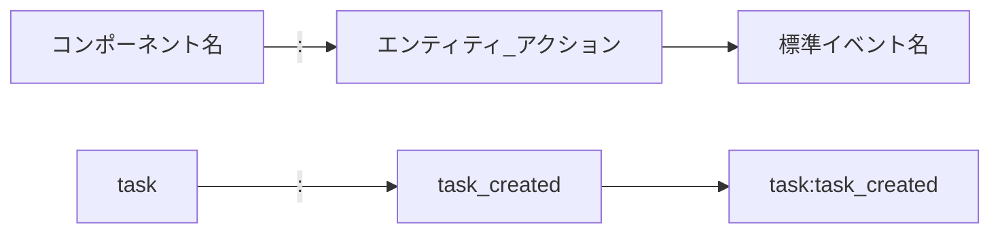

# イベント名標準化ガイド

> **難易度: 基本〜中級** | 所要時間: 15分

このガイドでは、イベント名の標準化に関する命名規則とガイドラインを説明します。一貫性のあるイベント名を使用することで、コードの可読性と保守性が向上します。

## 目次
- [1. イベント名の標準化の重要性](#1-イベント名の標準化の重要性)
- [2. イベント名の命名規則](#2-イベント名の命名規則)
- [3. イベント名の定数定義](#3-イベント名の定数定義)
- [4. イベントデータの構造](#4-イベントデータの構造)
- [5. 後方互換性の確保](#5-後方互換性の確保)
- [6. イベント名のリファクタリング](#6-イベント名のリファクタリング)

## 1. イベント名の標準化の重要性

### 1.1 一貫性のあるイベント名の利点

イベント名を標準化することには、以下のような利点があります：

- **可読性の向上**: 標準化されたイベント名は理解しやすく、コードの意図が明確になる
- **検索性の向上**: 一貫した命名パターンにより、関連するイベントを検索しやすくなる
- **自動化の容易さ**: 標準化されたパターンにより、コード生成やツールによる解析が容易になる
- **ドキュメント化の容易さ**: 標準化されたイベント名はドキュメント化しやすく、新しい開発者の学習曲線が緩やかになる

### 1.2 標準化されていないイベント名の問題点

標準化されていないイベント名には、以下のような問題があります：

- **混乱の原因**: 異なる形式のイベント名が混在すると、コードの理解が難しくなる
- **バグの原因**: イベント名のミスマッチによりリスナーが呼び出されないなどのバグが発生する
- **保守性の低下**: 一貫性のない命名は、コードの保守を困難にする
- **拡張性の低下**: 標準化されていないイベント名は、新機能の追加時に混乱を招く

### 1.3 実際の問題事例

以下は、標準化されていないイベント名による実際の問題事例です：

```javascript
// 問題のあるイベント名の例
eventEmitter.emit('taskCreated', { id: 'T001' });
eventEmitter.emit('session:started', { id: 'S001' });
eventEmitter.emit('feedback.created', { id: 'F001' });
eventEmitter.emit('SYSTEM_INITIALIZED', {});

// リスナーが正しく登録されない例
eventEmitter.on('task:created', (data) => { // 'taskCreated'と一致しない
  console.log('タスクが作成されました:', data);
});
```

## 2. イベント名の命名規則

### 2.1 基本形式: `component:entity_action`

イベント名の基本形式は以下の通りです：

```
component:entity_action
```

- **component**: システムのコンポーネント（task, session, feedback など）
- **entity**: 操作対象のエンティティ（task, session, feedback など）
- **action**: 実行されるアクション（created, updated, deleted など）



### 2.2 コンポーネント名のガイドライン

コンポーネント名には以下のガイドラインを適用します：

- 小文字のみを使用
- 単語間の区切りにはハイフン（-）を使用しない
- 短く、明確な名前を使用
- システムの主要な機能領域を表す名前を使用

**例**:
- `task` - タスク管理コンポーネント
- `session` - セッション管理コンポーネント
- `feedback` - フィードバック管理コンポーネント
- `storage` - ストレージコンポーネント
- `system` - システム全体に関するコンポーネント

### 2.3 アクション名のガイドライン

アクション名には以下のガイドラインを適用します：

- 小文字のみを使用
- 単語間の区切りにはアンダースコア（_）を使用
- 動詞または動詞_目的語の形式を使用
- 過去分詞形を使用（created, updated, deleted など）

**例**:
- `task_created` - タスクが作成された
- `session_updated` - セッションが更新された
- `feedback_prioritized` - フィードバックが優先順位付けされた
- `file_read` - ファイルが読み込まれた

### 2.4 複合アクションの命名

複合アクションには以下のガイドラインを適用します：

- アンダースコア（_）で区切られた複数の単語を使用
- 最初の単語はエンティティ、次の単語はアクション
- 必要に応じて追加の修飾語を使用

**例**:
- `task_progress_updated` - タスクの進捗が更新された
- `session_task_added` - セッションにタスクが追加された
- `feedback_status_updated` - フィードバックのステータスが更新された
- `file_read_completed` - ファイルの読み込みが完了した

### 2.5 命名規則の実例

以下は、標準化されたイベント名の実例です：

```javascript
// 標準化されたイベント名の例
eventEmitter.emit('task:task_created', { id: 'T001' });
eventEmitter.emit('session:session_started', { id: 'S001' });
eventEmitter.emit('feedback:feedback_created', { id: 'F001' });
eventEmitter.emit('system:initialized', {});

// リスナーが正しく登録される例
eventEmitter.on('task:task_created', (data) => {
  console.log('タスクが作成されました:', data);
});
```

## 3. イベント名の定数定義

### 3.1 EVENT_NAMESの構造と使用方法

イベント名は`EVENT_NAMES`オブジェクトに定義されています：

```javascript
const EVENT_NAMES = {
  TASK: {
    CREATED: { new: 'task:task_created', old: 'task:created' },
    UPDATED: { new: 'task:task_updated', old: 'task:updated' },
    PROGRESS_UPDATED: { new: 'task:task_progress_updated', old: 'task:progress' },
    // ...
  },
  SESSION: {
    CREATED: { new: 'session:session_created', old: 'session:started' },
    UPDATED: { new: 'session:session_updated', old: 'session:updated' },
    // ...
  },
  // ...
};
```

### 3.2 新旧イベント名のマッピング

新旧イベント名のマッピングは`EVENT_MAP`オブジェクトに定義されています：

```javascript
// イベント名のマッピングを生成
function generateEventMap() {
  const eventMap = {};
  
  Object.values(EVENT_NAMES).forEach(category => {
    Object.values(category).forEach(eventPair => {
      eventMap[eventPair.new] = eventPair.old;
    });
  });
  
  return eventMap;
}

const EVENT_MAP = generateEventMap();
```

### 3.3 イベントカテゴリの分類

イベントは以下のカテゴリに分類されています：

- **TASK**: タスク関連イベント
- **SESSION**: セッション関連イベント
- **FEEDBACK**: フィードバック関連イベント
- **SYSTEM**: システム関連イベント
- **STORAGE**: ストレージ関連イベント
- **INTEGRATION**: 統合関連イベント
- **LOG**: ログ関連イベント
- **CACHE**: キャッシュ関連イベント

### 3.4 定数の使用例

イベント名の定数を使用する例：

```javascript
// イベント名の定数を使用
const { EVENT_NAMES } = require('../../lib/core/event-constants');

// イベント発行
this._emitEvent('task', EVENT_NAMES.TASK.CREATED.new.split(':')[1], data, context);

// または
const eventName = EVENT_NAMES.TASK.CREATED.new;
eventEmitter.emit(eventName, data);
```

## 4. イベントデータの構造

### 4.1 標準フィールド

標準的なイベントデータには、以下のフィールドが含まれます：

- **timestamp**: イベントが発行された時刻（ISO 8601形式）
- **component**: イベントを発行したコンポーネント名
- **action**: イベントのアクション名
- **_context**: 操作コンテキストのID（コンテキスト付きイベントの場合）

```javascript
// 標準的なイベントデータの例
{
  id: 'T001',
  title: 'タスクの作成',
  timestamp: '2025-03-23T08:45:12.345Z',
  component: 'task',
  action: 'task_created',
  _context: 'ctx-1742706751540-mrg1hyvmf'
}
```

### 4.2 コンテキスト情報の含め方

コンテキスト情報は`_context`フィールドに含めます：

```javascript
// コンテキスト情報を含むイベントデータ
const enhancedData = {
  ...data,
  _context: context ? context.id : null,
  timestamp: data.timestamp || new Date().toISOString()
};
```

### 4.3 メタデータの活用

メタデータを活用することで、イベントデータに追加情報を含めることができます：

```javascript
// メタデータを含むイベントデータ
const enhancedData = {
  ...data,
  metadata: {
    source: 'user_action',
    initiator: 'user_id_123',
    browser: 'Chrome',
    version: '1.0.0'
  }
};
```

### 4.4 データ構造の実例

以下は、実際のイベントデータ構造の例です：

```javascript
// タスク作成イベントのデータ構造
{
  id: 'T001',
  title: 'タスクの作成',
  description: 'これはタスクの説明です',
  status: 'pending',
  created_at: '2025-03-23T08:45:12.345Z',
  timestamp: '2025-03-23T08:45:12.345Z',
  component: 'task',
  action: 'task_created',
  _context: 'ctx-1742706751540-mrg1hyvmf',
  metadata: {
    source: 'user_action',
    initiator: 'user_id_123'
  }
}
```

## 5. 後方互換性の確保

### 5.1 古いイベント名のサポート方法

古いイベント名をサポートするには、以下の方法を使用します：

```javascript
// 古いイベント名のサポート
const oldEventName = EVENT_MAP[standardEvent];
if (oldEventName) {
  eventEmitter.emit(oldEventName, enhancedData);
}
```

### 5.2 非推奨イベント名の警告メカニズム

非推奨イベント名を使用した場合に警告を表示するメカニズム：

```javascript
// 非推奨イベント名の警告
if (process.env.NODE_ENV === 'development' && this.eventEmitter.logger) {
  this.eventEmitter.logger.warn(`非推奨のイベント名 ${oldEventName} が使用されています。代わりに ${standardEvent} を使用してください。`, {
    oldEventName,
    standardEvent,
    timestamp: enhancedData.timestamp
  });
}
```

### 5.3 移行期間中の両方のイベント名サポート

移行期間中は、新旧両方のイベント名をサポートします：

```javascript
// 標準化されたイベント発行
this.eventEmitter.emit(standardEvent, enhancedData);

// 古いイベント名もサポート
if (bridgeOldEvents) {
  const oldEventName = EVENT_MAP[standardEvent];
  if (oldEventName) {
    this.eventEmitter.emit(oldEventName, enhancedData);
  }
}
```

### 5.4 後方互換性の実装例

以下は、BaseAdapterの`_emitEvent`メソッドにおける後方互換性の実装例です：

```javascript
_emitEvent(component, action, data = {}, context = null, bridgeOldEvents = true) {
  if (!this.eventEmitter) {
    return;
  }
  
  // コンテキストにエラーがある場合はイベント発行をスキップ
  if (context && context.hasError()) {
    if (this.eventEmitter.debugMode) {
      this.logger.debug(`イベント ${component}:${action} はコンテキスト ${context.id} でエラーが発生しているためスキップされました`);
    }
    return;
  }
  
  try {
    // イベント名の定数マッピングをインポート
    const { EVENT_MAP } = require('../../lib/core/event-constants');
    
    // 標準化されたイベント名
    const standardEvent = `${component}:${action}`;
    
    // コンテキスト情報をデータに追加
    const enhancedData = {
      ...data,
      _context: context ? context.id : null,
      timestamp: data.timestamp || new Date().toISOString()
    };
    
    // 標準化されたイベント発行
    this.eventEmitter.emit(standardEvent, enhancedData);
    
    // 古いイベント名のサポート（オプション）
    if (bridgeOldEvents) {
      const oldEventName = EVENT_MAP[standardEvent];
      
      if (oldEventName) {
        this.eventEmitter.emit(oldEventName, enhancedData);
        
        // 警告ログを出力（開発環境のみ）
        if (process.env.NODE_ENV === 'development' && this.eventEmitter.logger) {
          this.eventEmitter.logger.warn(`非推奨のイベント名 ${oldEventName} が使用されています。代わりに ${standardEvent} を使用してください。`, {
            oldEventName,
            standardEvent,
            timestamp: enhancedData.timestamp
          });
        }
      }
    }
  } catch (error) {
    this.logger.warn(`イベント発行中にエラーが発生しました: ${component}:${action}`, error);
  }
}
```

## 6. イベント名のリファクタリング

### 6.1 既存イベント名の変更手順

既存イベント名を変更する手順は以下の通りです：

1. 新しいイベント名を`EVENT_NAMES`に追加
2. 古いイベント名と新しいイベント名のマッピングを設定
3. イベント発行コードを新しいイベント名に更新
4. 移行期間中は両方のイベント名をサポート
5. 十分な期間が経過した後、古いイベント名のサポートを削除

### 6.2 リスナーの更新方法

リスナーを更新する方法は以下の通りです：

1. 新しいイベント名でリスナーを登録
2. 古いイベント名のリスナーは徐々に削除
3. 必要に応じて、両方のイベント名でリスナーを登録

```javascript
// 新しいイベント名でリスナーを登録
eventEmitter.on('task:task_created', (data) => {
  console.log('タスクが作成されました:', data);
});

// 古いイベント名のリスナーも一時的に維持
eventEmitter.on('task:created', (data) => {
  console.log('タスクが作成されました（古いイベント名）:', data);
});
```

### 6.3 リファクタリングのテスト方法

リファクタリングのテスト方法は以下の通りです：

1. 新しいイベント名が発行されることをテスト
2. 古いイベント名も発行されることをテスト
3. 両方のイベント名のリスナーが呼び出されることをテスト

```javascript
// リファクタリングのテスト
test('新旧両方のイベント名が発行される', async () => {
  // 新旧両方のイベント名でリスナーを登録
  const newListener = jest.fn();
  const oldListener = jest.fn();
  
  eventEmitter.on('task:task_created', newListener);
  eventEmitter.on('task:created', oldListener);
  
  // イベント発行
  await taskAdapter.createTask({ title: 'テストタスク' });
  
  // 両方のリスナーが呼び出されることを確認
  expect(newListener).toHaveBeenCalled();
  expect(oldListener).toHaveBeenCalled();
});
```

### 6.4 リファクタリングの実例

以下は、イベント名のリファクタリングの実例です：

```javascript
// リファクタリング前
eventEmitter.emit('task:created', { id: 'T001' });

// リファクタリング中（両方のイベント名をサポート）
const standardEvent = 'task:task_created';
const data = { id: 'T001' };
eventEmitter.emit(standardEvent, data);
eventEmitter.emit('task:created', data);

// リファクタリング後
eventEmitter.emit('task:task_created', { id: 'T001' });
```

## 関連ドキュメント

- [クイックスタートガイド](./event-driven-quickstart.md) - イベント駆動アーキテクチャの基本的な使用方法
- [イベント駆動アーキテクチャガイド](./event-driven-architecture-guide.md) - イベント駆動アーキテクチャの詳細な説明
- [開発者向けチートシート](./event-driven-cheatsheet.md) - よく使用されるイベント名とコードスニペット
- [操作コンテキスト活用ガイド](./operation-context-guide.md) - 操作コンテキストの詳細な使用方法

## 次のステップ

イベント名の標準化について理解したら、次のステップとして以下のドキュメントを参照してください：

- [操作コンテキスト活用ガイド](./operation-context-guide.md) - 操作コンテキストの高度な使用方法を学ぶ
- [イベント駆動アーキテクチャのテストガイド](./event-driven-testing-guide.md) - イベント駆動アーキテクチャのテスト方法を学ぶ