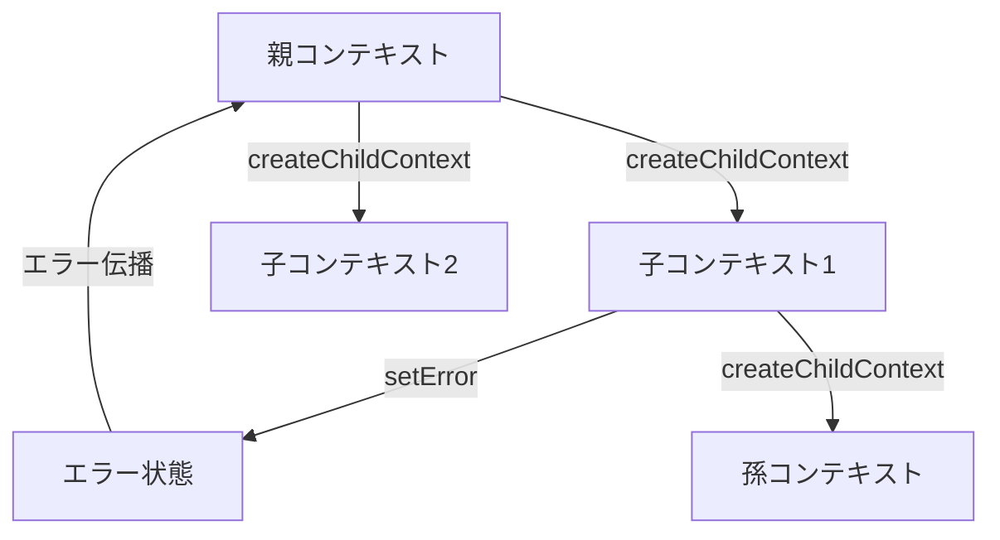

# 操作コンテキスト活用ガイド

> **難易度: 中級〜上級** | 所要時間: 20分

このガイドでは、イベント駆動アーキテクチャにおける操作コンテキスト（OperationContext）の概念と使用方法を詳細に説明します。操作コンテキストを活用することで、イベント連鎖の状態追跡やエラー伝播を効果的に管理できます。

## 目次
- [1. 操作コンテキストの概念](#1-操作コンテキストの概念)
- [2. 操作コンテキストの作成と使用](#2-操作コンテキストの作成と使用)
- [3. エラー状態の管理](#3-エラー状態の管理)
- [4. コンテキストを活用したイベント発行](#4-コンテキストを活用したイベント発行)
- [5. ベストプラクティス](#5-ベストプラクティス)
- [6. トラブルシューティング](#6-トラブルシューティング)

## 1. 操作コンテキストの概念

### 1.1 操作コンテキストとは

操作コンテキスト（OperationContext）は、イベント連鎖の状態を追跡し、エラー状態を管理するためのクラスです。一連の関連する操作（イベント連鎖）を論理的にグループ化し、それらの間で状態や情報を共有するための仕組みを提供します。



### 1.2 コンテキストの役割と重要性

操作コンテキストには以下の重要な役割があります：

- **状態追跡**: 一連の操作の状態を追跡し、操作の成功/失敗を管理
- **エラー伝播**: 子コンテキストから親コンテキストへのエラー伝播を実現
- **メタデータ管理**: 操作に関連するメタデータを保持
- **デバッグ情報**: 操作の開始時刻、経過時間などのデバッグ情報を提供
- **イベント連鎖の制御**: エラー発生時にイベント連鎖を中断する仕組みを提供

### 1.3 コンテキストの親子関係

操作コンテキストは親子関係を持つことができます：

- **親コンテキスト**: 大きな操作全体を表すコンテキスト
- **子コンテキスト**: 親コンテキストの一部として実行される小さな操作を表すコンテキスト
- **孫コンテキスト**: 子コンテキストの一部として実行されるさらに小さな操作を表すコンテキスト

この親子関係により、エラーの伝播や操作の階層構造を表現できます。

### 1.4 導入の背景と理由（ADR）

操作コンテキストが導入された背景と理由は以下の通りです：

- **イベント連鎖のデバッグ困難**: イベント連鎖のデバッグが難しく、関連するイベントを追跡するのが困難だった
- **エラー処理の不明確さ**: イベント連鎖の中でエラーが発生した場合の処理が不明確だった
- **イベント間の関連性の欠如**: 関連するイベント間の関係性を表現する仕組みがなかった
- **操作の追跡困難**: 複数のコンポーネントにまたがる操作を追跡する仕組みがなかった

操作コンテキストはこれらの問題を解決するために導入されました。

## 2. 操作コンテキストの作成と使用

### 2.1 コンテキストの作成方法

操作コンテキストを作成するには、以下の方法があります：

#### 2.1.1 EnhancedEventEmitterのcreateContextメソッド

```javascript
// EnhancedEventEmitterのcreateContextメソッドを使用
const context = eventEmitter.createContext({
  component: 'TaskManager',
  operation: 'createTask',
  taskId: 'T001'
});
```

#### 2.1.2 BaseAdapterの_createContextメソッド

```javascript
// BaseAdapterの_createContextメソッドを使用
const context = this._createContext('createTask', {
  taskId: 'T001',
  taskData: { title: 'タスクの作成' }
});
```

#### 2.1.3 OperationContextクラスの直接使用

```javascript
// OperationContextクラスを直接使用
const OperationContext = require('../../lib/core/operation-context');
const context = new OperationContext({
  id: 'custom-ctx-id', // オプション（省略時は自動生成）
  logger: logger,
  metadata: {
    component: 'TaskManager',
    operation: 'createTask',
    taskId: 'T001'
  }
});
```

### 2.2 子コンテキストの作成

子コンテキストを作成するには、親コンテキストの`createChildContext`メソッドを使用します：

```javascript
// 子コンテキストの作成
const childContext = context.createChildContext({
  operation: 'validateTask',
  validationRules: ['title', 'description']
});

// 孫コンテキストの作成
const grandchildContext = childContext.createChildContext({
  operation: 'checkTitleLength'
});
```

子コンテキストは親コンテキストのメタデータを継承し、追加のメタデータを指定できます。

### 2.3 コンテキスト情報の取得

コンテキスト情報を取得するには、`getInfo`メソッドを使用します：

```javascript
// コンテキスト情報の取得
const contextInfo = context.getInfo();
console.log('コンテキストID:', contextInfo.id);
console.log('開始時刻:', contextInfo.startTime);
console.log('経過時間:', contextInfo.duration);
console.log('エラー状態:', contextInfo.hasError);
console.log('エラー詳細:', contextInfo.errorDetails);
console.log('メタデータ:', contextInfo.metadata);
```

### 2.4 実際のユースケース例

以下は、操作コンテキストを使用した実際のユースケース例です：

```javascript
// タスク作成の例
async createTask(taskData, context = null) {
  // コンテキストがない場合は新しく作成
  context = context || this._createContext('createTask', { taskData });
  
  try {
    // パラメータの検証
    this._validateParams(taskData, ['title']);
    
    // 子コンテキストを作成して検証処理を実行
    const validationContext = context.createChildContext({ operation: 'validateTask' });
    const validationResult = this._validateTaskData(taskData, validationContext);
    
    // 検証エラーがある場合は処理を中断
    if (validationContext.hasError()) {
      return this._handleError(
        new Error('タスクデータの検証に失敗しました'),
        'createTask',
        context,
        { validationErrors: validationResult.errors }
      );
    }
    
    // タスクの作成
    const task = await this.manager.createTask(taskData);
    
    // イベントの発行
    this._emitEvent('task', 'task_created', task, context);
    
    return task;
  } catch (error) {
    // エラー処理
    return this._handleError(error, 'createTask', context, { taskData });
  }
}

// タスクデータの検証
_validateTaskData(taskData, context) {
  const errors = [];
  
  // タイトルの検証
  if (taskData.title.length < 3) {
    errors.push('タイトルは3文字以上である必要があります');
  }
  
  // 説明の検証
  if (taskData.description && taskData.description.length > 1000) {
    errors.push('説明は1000文字以下である必要があります');
  }
  
  // エラーがある場合はコンテキストにエラーを設定
  if (errors.length > 0) {
    context.setError(
      new Error('タスクデータの検証に失敗しました'),
      'TaskManager',
      'validateTaskData',
      { errors }
    );
  }
  
  return { valid: errors.length === 0, errors };
}
```

## 3. エラー状態の管理

### 3.1 エラー状態の設定

エラー状態を設定するには、`setError`メソッドを使用します：

```javascript
// エラー状態の設定
context.setError(
  error,                // エラーオブジェクト
  'TaskManager',        // コンポーネント名
  'createTask',         // 操作名
  { taskId: 'T001' }    // 追加詳細情報
);
```

`setError`メソッドは以下の処理を行います：

1. コンテキストのエラー状態を`true`に設定
2. エラー詳細情報を保存
3. ロガーにエラーを出力
4. 親コンテキストにエラーを伝播

### 3.2 エラー状態のチェック

エラー状態をチェックするには、`hasError`メソッドを使用します：

```javascript
// エラー状態のチェック
if (context.hasError()) {
  console.log('エラーが発生しています');
  console.log('エラー詳細:', context.getInfo().errorDetails);
  return; // 処理を中断
}
```

### 3.3 エラーの伝播メカニズム

エラーは子コンテキストから親コンテキストに自動的に伝播します：

```javascript
// 子コンテキストにエラーを設定
childContext.setError(
  new Error('子コンテキストでエラーが発生しました'),
  'TaskManager',
  'validateTask',
  { taskId: 'T001' }
);

// 親コンテキストでもエラー状態になる
console.log(context.hasError()); // true
```

このエラー伝播メカニズムにより、親操作は子操作のエラーを検知できます。

### 3.4 エラー状態管理の実例

以下は、エラー状態管理の実例です：

```javascript
// エラー状態管理の実例
async function processTask(taskId) {
  // ルートコンテキストの作成
  const context = eventEmitter.createContext({
    operation: 'processTask',
    taskId
  });
  
  try {
    // タスクの取得
    const task = await taskAdapter.getTask(taskId, context);
    
    // タスクが見つからない場合
    if (!task) {
      context.setError(
        new Error(`タスク ${taskId} が見つかりません`),
        'TaskProcessor',
        'processTask',
        { taskId }
      );
      return { error: true, message: `タスク ${taskId} が見つかりません` };
    }
    
    // タスクの処理
    const processContext = context.createChildContext({ operation: 'processTaskData' });
    const result = await processTaskData(task, processContext);
    
    // 処理中にエラーが発生した場合
    if (processContext.hasError()) {
      return { error: true, message: 'タスクの処理中にエラーが発生しました' };
    }
    
    return { success: true, result };
  } catch (error) {
    // 予期しないエラーの処理
    context.setError(error, 'TaskProcessor', 'processTask', { taskId });
    return { error: true, message: error.message };
  }
}
```

## 4. コンテキストを活用したイベント発行

### 4.1 コンテキスト付きイベント発行

コンテキスト付きでイベントを発行するには、以下の方法があります：

#### 4.1.1 BaseAdapterの_emitEventメソッド

```javascript
// BaseAdapterの_emitEventメソッド
this._emitEvent('task', 'task_created', {
  id: 'T001',
  title: 'タスクの作成'
}, context);
```

#### 4.1.2 EnhancedEventEmitterのemitStandardizedWithContextメソッド

```javascript
// EnhancedEventEmitterのemitStandardizedWithContextメソッド
eventEmitter.emitStandardizedWithContext(
  'task',
  'task_created',
  { id: 'T001', title: 'タスクの作成' },
  context
);
```

### 4.2 コンテキストに基づくイベント処理の制御

コンテキストを使用して、イベント処理を制御できます：

```javascript
// コンテキストに基づくイベント処理の制御
_emitEvent(component, action, data = {}, context = null, bridgeOldEvents = true) {
  if (!this.eventEmitter) {
    return;
  }
  
  // コンテキストにエラーがある場合はイベント発行をスキップ
  if (context && context.hasError()) {
    if (this.eventEmitter.debugMode) {
      this.logger.debug(`イベント ${component}:${action} はコンテキスト ${context.id} でエラーが発生しているためスキップされました`);
    }
    return;
  }
  
  // イベント発行処理...
}
```

### 4.3 エラー発生時のイベント連鎖の中断

エラーが発生した場合、イベント連鎖を中断できます：

```javascript
// エラー発生時のイベント連鎖の中断
eventEmitter.on('task:task_created', async (data) => {
  // コンテキストIDの取得
  const contextId = data._context;
  
  // コンテキストIDがない場合は処理を続行
  if (!contextId) {
    // 通常の処理...
    return;
  }
  
  // グローバルなエラー状態をチェック
  if (eventEmitter.errorOccurred) {
    console.log(`イベント処理はエラー発生のためスキップされました: ${contextId}`);
    return;
  }
  
  // 処理を続行...
});
```

### 4.4 実際のコード例

以下は、コンテキストを活用したイベント発行の実際のコード例です：

```javascript
// タスク作成からセッション関連付けまでの流れ
async function createTaskAndSession(taskData) {
  // ルートコンテキストの作成
  const context = eventEmitter.createContext({
    operation: 'createTaskAndSession',
    taskData
  });
  
  try {
    // タスクの作成
    const taskContext = context.createChildContext({ operation: 'createTask' });
    const task = await taskAdapter.createTask(taskData, taskContext);
    
    // タスク作成中にエラーが発生した場合
    if (taskContext.hasError()) {
      return { error: true, message: 'タスクの作成中にエラーが発生しました' };
    }
    
    // セッションの作成
    const sessionContext = context.createChildContext({ operation: 'createSession' });
    const session = await sessionAdapter.createNewSession(sessionContext);
    
    // セッション作成中にエラーが発生した場合
    if (sessionContext.hasError()) {
      return { error: true, message: 'セッションの作成中にエラーが発生しました' };
    }
    
    // タスクをセッションに関連付け
    const linkContext = context.createChildContext({ operation: 'linkTaskToSession' });
    await sessionAdapter.addTaskToSession(
      session.session_handover.session_id,
      task.id,
      linkContext
    );
    
    // 関連付け中にエラーが発生した場合
    if (linkContext.hasError()) {
      return { error: true, message: 'タスクとセッションの関連付け中にエラーが発生しました' };
    }
    
    return {
      success: true,
      task,
      session,
      message: 'タスクとセッションが正常に作成されました'
    };
  } catch (error) {
    // 予期しないエラーの処理
    context.setError(error, 'TaskSessionManager', 'createTaskAndSession', { taskData });
    return { error: true, message: error.message };
  }
}
```

## 5. ベストプラクティス

### 5.1 適切なコンテキスト粒度の選択

コンテキストの粒度は、操作の論理的なまとまりに基づいて選択します：

- **ルートコンテキスト**: ユーザーリクエストや大きな操作全体
- **子コンテキスト**: ルートコンテキストの一部として実行される小さな操作
- **孫コンテキスト**: さらに細かい操作

```javascript
// 適切なコンテキスト粒度の例
// ルートコンテキスト: ユーザーリクエスト
const context = eventEmitter.createContext({
  operation: 'handleUserRequest',
  requestId: 'REQ001',
  userId: 'USER001'
});

// 子コンテキスト: タスク作成
const taskContext = context.createChildContext({
  operation: 'createTask'
});

// 孫コンテキスト: タスクデータの検証
const validationContext = taskContext.createChildContext({
  operation: 'validateTaskData'
});
```

### 5.2 メタデータの効果的な活用

メタデータを効果的に活用することで、デバッグやトレースが容易になります：

```javascript
// メタデータの効果的な活用
const context = eventEmitter.createContext({
  // 操作情報
  component: 'TaskManager',
  operation: 'createTask',
  
  // ビジネスデータ
  taskId: 'T001',
  taskType: 'feature',
  priority: 'high',
  
  // 技術情報
  requestId: 'REQ001',
  userId: 'USER001',
  source: 'api',
  
  // 環境情報
  environment: process.env.NODE_ENV,
  version: '1.0.0'
});
```

### 5.3 デバッグ情報の充実化

デバッグ情報を充実させることで、問題解決が容易になります：

```javascript
// デバッグ情報の充実化
try {
  // 何らかの処理
  throw new Error('テストエラー');
} catch (error) {
  // エラー情報を充実させる
  context.setError(error, 'TaskManager', 'createTask', {
    taskData,
    validationResults,
    timestamp: new Date().toISOString(),
    stack: error.stack,
    // 環境情報
    nodeVersion: process.version,
    memoryUsage: process.memoryUsage(),
    // リクエスト情報
    requestId: 'REQ001',
    userId: 'USER001'
  });
}
```

### 5.4 実際のプロジェクトからの事例

以下は、実際のプロジェクトからの操作コンテキスト活用事例です：

```javascript
// フィードバック作成からタスク関連付けまでの流れ
async function createFeedbackAndLinkToTask(feedbackData, taskId) {
  // ルートコンテキストの作成
  const context = eventEmitter.createContext({
    operation: 'createFeedbackAndLinkToTask',
    feedbackData,
    taskId
  });
  
  // 処理開始ログ
  this.logger.info(`フィードバック作成処理を開始します: ${context.id}`, {
    contextId: context.id,
    taskId,
    feedbackType: feedbackData.type
  });
  
  try {
    // フィードバックの作成
    const feedbackContext = context.createChildContext({ operation: 'createFeedback' });
    const feedback = await feedbackAdapter.createNewFeedback(
      taskId,
      feedbackData.attempt || 1,
      feedbackContext
    );
    
    // フィードバック作成中にエラーが発生した場合
    if (feedbackContext.hasError()) {
      this.logger.error(`フィードバック作成中にエラーが発生しました: ${context.id}`, {
        contextId: context.id,
        errorDetails: feedbackContext.getInfo().errorDetails
      });
      return { error: true, message: 'フィードバックの作成中にエラーが発生しました' };
    }
    
    // フィードバックとタスクの関連付け
    const linkContext = context.createChildContext({ operation: 'linkFeedbackToTask' });
    await feedbackAdapter.linkFeedbackToTask(feedback.id, taskId, linkContext);
    
    // 関連付け中にエラーが発生した場合
    if (linkContext.hasError()) {
      this.logger.error(`フィードバックとタスクの関連付け中にエラーが発生しました: ${context.id}`, {
        contextId: context.id,
        errorDetails: linkContext.getInfo().errorDetails
      });
      return { error: true, message: 'フィードバックとタスクの関連付け中にエラーが発生しました' };
    }
    
    // 処理完了ログ
    this.logger.info(`フィードバック作成処理が完了しました: ${context.id}`, {
      contextId: context.id,
      feedbackId: feedback.id,
      taskId,
      duration: context.getInfo().duration
    });
    
    return {
      success: true,
      feedback,
      message: 'フィードバックが正常に作成され、タスクに関連付けられました'
    };
  } catch (error) {
    // 予期しないエラーの処理
    context.setError(error, 'FeedbackManager', 'createFeedbackAndLinkToTask', {
      feedbackData,
      taskId
    });
    
    this.logger.error(`予期しないエラーが発生しました: ${context.id}`, {
      contextId: context.id,
      error: error.message,
      stack: error.stack
    });
    
    return { error: true, message: error.message };
  }
}
```

## 6. トラブルシューティング

### 6.1 よくある問題とその解決法

#### 6.1.1 コンテキストが正しく作成されない

**症状**: コンテキストが`null`または`undefined`になる

**考えられる原因**:
- `eventEmitter`が正しく初期化されていない
- `_createContext`メソッドが正しく実装されていない

**解決策**:
```javascript
// コンテキストが正しく作成されるか確認
if (!this.eventEmitter) {
  this.logger.warn('eventEmitterが初期化されていないため、コンテキストを作成できません');
  return null;
}

// コンテキストの作成
const context = this._createContext('operation', metadata);
if (!context) {
  this.logger.warn('コンテキストの作成に失敗しました');
  // フォールバック: 直接OperationContextを使用
  const OperationContext = require('../../lib/core/operation-context');
  return new OperationContext({ logger: this.logger, metadata });
}
```

#### 6.1.2 コンテキストが正しく伝播しない

**症状**: 親コンテキストから子コンテキストにメタデータが伝播しない

**考えられる原因**:
- `createChildContext`メソッドが正しく使用されていない
- 親コンテキストが正しく渡されていない

**解決策**:
```javascript
// 親コンテキストの確認
if (!parentContext) {
  this.logger.warn('親コンテキストがありません');
  return this._createContext('operation', metadata);
}

// 子コンテキストの作成
const childContext = parentContext.createChildContext(metadata);
if (!childContext) {
  this.logger.warn('子コンテキストの作成に失敗しました');
  return this._createContext('operation', {
    ...parentContext.getInfo().metadata,
    ...metadata
  });
}
```

#### 6.1.3 エラー状態が正しく設定されない

**症状**: `setError`を呼び出してもエラー状態が`true`にならない

**考えられる原因**:
- `setError`メソッドが正しく実装されていない
- エラーオブジェクトが正しく渡されていない

**解決策**:
```javascript
// エラー状態の設定
if (!error) {
  error = new Error('不明なエラー');
}

context.setError(error, component, operation, details);

// エラー状態の確認
if (!context.hasError()) {
  this.logger.warn('エラー状態が正しく設定されませんでした');
  // 直接エラー状態を設定
  context.errorOccurred = true;
  context.errorDetails = {
    message: error.message,
    component,
    operation,
    timestamp: new Date().toISOString(),
    details
  };
}
```

### 6.2 コンテキストが正しく伝播しない問題

コンテキストが正しく伝播しない場合の詳細な解決策：

```javascript
// コンテキストの伝播問題の解決
async function ensureContext(operation, metadata, parentContext) {
  // 親コンテキストがない場合は新しく作成
  if (!parentContext) {
    return eventEmitter.createContext({
      operation,
      ...metadata
    });
  }
  
  // 親コンテキストのメタデータを取得
  const parentInfo = parentContext.getInfo();
  const parentMetadata = parentInfo.metadata || {};
  
  // 子コンテキストを作成
  try {
    return parentContext.createChildContext({
      operation,
      ...metadata
    });
  } catch (error) {
    // 子コンテキスト作成に失敗した場合
    logger.warn(`子コンテキストの作成に失敗しました: ${error.message}`);
    
    // 新しいコンテキストを作成
    return eventEmitter.createContext({
      operation,
      parentContextId: parentInfo.id, // 親コンテキストIDを記録
      ...parentMetadata,
      ...metadata
    });
  }
}
```

### 6.3 エラー状態が正しく設定されない問題

エラー状態が正しく設定されない場合の詳細な解決策：

```javascript
// エラー状態設定問題の解決
function ensureErrorState(context, error, component, operation, details = {}) {
  if (!context) {
    logger.error(`コンテキストがないためエラー状態を設定できません: ${operation}`);
    return;
  }
  
  // エラーオブジェクトの確認
  if (!error) {
    error = new Error(`${operation}で不明なエラーが発生しました`);
  }
  
  // エラー状態の設定
  try {
    context.setError(error, component, operation, details);
  } catch (setErrorError) {
    // setErrorメソッドが失敗した場合
    logger.error(`setErrorメソッドが失敗しました: ${setErrorError.message}`);
    
    // 直接プロパティを設定
    context.errorOccurred = true;
    context.errorDetails = {
      message: error.message,
      code: error.code || 'ERR_UNKNOWN',
      component,
      operation,
      timestamp: new Date().toISOString(),
      details
    };
    
    // ロガーへのエラー出力
    if (context.logger && typeof context.logger.error === 'function') {
      context.logger.error(`Error in ${component}.${operation}:`, error, details);
    }
    
    // 親コンテキストにもエラーを伝播
    if (context.parentContext && typeof context.parentContext.setError === 'function') {
      try {
        context.parentContext.setError(error, component, operation, details);
      } catch (parentError) {
        logger.error(`親コンテキストへのエラー伝播に失敗しました: ${parentError.message}`);
      }
    }
  }
  
  // エラー状態の確認
  if (!context.hasError()) {
    logger.warn(`エラー状態が正しく設定されませんでした: ${operation}`);
  }
}
```

### 6.4 デバッグのヒント

操作コンテキストのデバッグに役立つヒント：

```javascript
// コンテキスト情報のログ出力
function logContextInfo(context, label = 'コンテキスト情報') {
  if (!context) {
    console.log(`${label}: コンテキストがありません`);
    return;
  }
  
  const info = context.getInfo();
  console.log(`${label}:`);
  console.log(`- ID: ${info.id}`);
  console.log(`- 開始時刻: ${info.startTime}`);
  console.log(`- 経過時間: ${info.duration}ms`);
  console.log(`- エラー状態: ${info.hasError}`);
  
  if (info.errorDetails) {
    console.log(`- エラー詳細:`);
    console.log(`  - メッセージ: ${info.errorDetails.message}`);
    console.log(`  - コンポーネント: ${info.errorDetails.component}`);
    console.log(`  - 操作: ${info.errorDetails.operation}`);
    console.log(`  - タイムスタンプ: ${info.errorDetails.timestamp}`);
  }
  
  console.log(`- メタデータ:`, info.metadata);
  
  // 親コンテキストの情報
  if (context.parentContext) {
    logContextInfo(context.parentContext, `${label} (親コンテキスト)`);
  }
}
```

## 関連ドキュメント

- [クイックスタートガイド](./event-driven-quickstart.md) - イベント駆動アーキテクチャの基本的な使用方法
- [イベント駆動アーキテクチャガイド](./event-driven-architecture-guide.md) - イベント駆動アーキテクチャの詳細な説明
- [開発者向けチートシート](./event-driven-cheatsheet.md) - よく使用されるイベント名とコードスニペット
- [イベント名標準化ガイド](./event-naming-convention.md) - イベント名の命名規則と標準化ガイドライン

## 次のステップ

操作コンテキストの概念と使用方法を理解したら、次のステップとして以下のドキュメントを参照してください：

- [イベント駆動アーキテクチャのテストガイド](./event-driven-testing-guide.md) - 操作コンテキストを使ったテスト方法を学ぶ
- [移行ガイド](./event-driven-migration-guide.md) - 既存コードに操作コンテキストを導入する方法を学ぶ