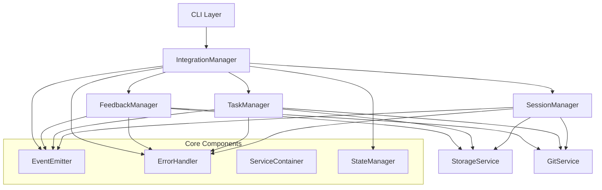

# フェーズ4移行ガイド：システム統合リファクタリング（T011）

## 1. 移行の全体像

### 1.1 目標

フェーズ4「移行と統合」の主な目標は、フェーズ1〜3で実装された新しいアーキテクチャコンポーネントを活用し、既存のコードを段階的に移行することです。これにより、システム全体の一貫性と保守性を向上させます。

具体的な目標は以下の通りです：

- **パッケージ構造の統一**: 新旧のディレクトリ構造を統一し、一貫した構造を実現する
- **依存性注入の粒度の改善**: オプションオブジェクトパターンを採用し、依存関係を明確にする
- **イベント駆動アーキテクチャの完全採用**: コンポーネント間の連携を標準化されたイベントベースにする
- **アダプターパターンの一貫した適用**: 外部インターフェースとビジネスロジックを明確に分離する
- **テスト自動化の強化**: 回帰テストを充実させ、リファクタリングの品質を確保する
- **ドキュメント整備**: 新しいアーキテクチャの理解と活用を促進する

### 1.2 スコープ

移行の対象となるコンポーネントは以下の通りです：

- **FeedbackManager**: フィードバック管理機能
- **TaskManager**: タスク管理機能
- **SessionManager**: セッション管理機能
- **IntegrationManager**: 統合管理機能

また、以下の横断的な取り組みも含まれます：

- **テスト強化**: 単体テスト、統合テスト、エンドツーエンドテストの充実
- **CI/CD統合**: テスト自動化とデプロイプロセスの改善
- **ドキュメント整備**: 開発者ガイド、アーキテクチャドキュメント、APIドキュメントの作成・更新

### 1.3 タイムライン

移行は全体で6週間を予定しています：

- **週1-2**: パッケージ構造の統一とFeedbackManagerの移行
- **週3-4**: TaskManagerとSessionManagerの移行
- **週5**: IntegrationManagerの移行
- **週6**: 最終テストとドキュメント整備

## 2. 移行順序

### 2.1 コンポーネント依存関係図



### 2.2 移行順序の詳細

依存関係の少ないコンポーネントから順に移行することで、リスクを最小限に抑えます。

#### 2.2.1 FeedbackManager（第1-2週）

FeedbackManagerは比較的新しく、依存するコンポーネントが少ないため、最初に移行します。

**移行ステップ**:
1. パッケージ構造の変更: `src/utils/feedback-manager.js` → `src/lib/managers/feedback-manager.js`
2. 依存性注入の改善: オプションオブジェクトパターンの採用
3. イベント駆動アーキテクチャの適用: 標準化されたイベント発行の採用
4. アダプターの更新: `src/lib/adapters/feedback-manager-adapter.js`の実装
5. テストの更新: 単体テスト、統合テストの更新

#### 2.2.2 TaskManager（第3週）

TaskManagerはFeedbackManagerの次に依存が少ないため、2番目に移行します。

**移行ステップ**:
1. パッケージ構造の変更: `src/utils/task-manager.js` → `src/lib/managers/task-manager.js`
2. 依存性注入の改善: オプションオブジェクトパターンの採用
3. イベント駆動アーキテクチャの適用: 標準化されたイベント発行の採用
4. アダプターの更新: `src/lib/adapters/task-manager-adapter.js`の実装
5. テストの更新: 単体テスト、統合テストの更新

#### 2.2.3 SessionManager（第4週）

SessionManagerはTaskManagerに依存する部分があるため、TaskManagerの移行後に移行します。

**移行ステップ**:
1. パッケージ構造の変更: `src/utils/session-manager.js` → `src/lib/managers/session-manager.js`
2. 依存性注入の改善: オプションオブジェクトパターンの採用
3. イベント駆動アーキテクチャの適用: 標準化されたイベント発行の採用
4. アダプターの更新: `src/lib/adapters/session-manager-adapter.js`の実装
5. テストの更新: 単体テスト、統合テストの更新

#### 2.2.4 IntegrationManager（第5週）

IntegrationManagerは他のすべてのマネージャーに依存するため、最後に移行します。

**移行ステップ**:
1. パッケージ構造の変更: `src/utils/integration-manager.js` → `src/lib/managers/integration-manager.js`
2. 依存性注入の改善: オプションオブジェクトパターンの採用
3. イベント駆動アーキテクチャの適用: 標準化されたイベント発行の採用
4. アダプターの更新: `src/lib/adapters/integration-manager-adapter.js`の実装
5. テストの更新: 単体テスト、統合テスト、エンドツーエンドテストの更新

## 3. 段階的アプローチ

### 3.1 パッケージ構造の統一

**目標**: すべてのコンポーネントを一貫したディレクトリ構造に配置する

**実装手順**:

1. 新しいディレクトリ構造を作成:
   ```
   src/
     ├── lib/
     │   ├── core/         # コアコンポーネント
     │   ├── data/         # データアクセス層
     │   ├── managers/     # ビジネスロジック層
     │   ├── adapters/     # アダプター層
     │   └── utils/        # ユーティリティ
     ├── cli/              # コマンドラインインターフェース
     ├── schemas/          # JSONスキーマ
     └── templates/        # テンプレート
   ```

2. 各コンポーネントを適切なディレクトリに移動:
   - `src/utils/feedback-manager.js` → `src/lib/managers/feedback-manager.js`
   - `src/utils/task-manager.js` → `src/lib/managers/task-manager.js`
   - `src/utils/session-manager.js` → `src/lib/managers/session-manager.js`
   - `src/utils/integration-manager.js` → `src/lib/managers/integration-manager.js`

3. インポートパスを更新:
   ```javascript
   // 変更前
   const { SessionManager } = require('../../utils/session-manager');
   
   // 変更後
   const { SessionManager } = require('../managers/session-manager');
   ```

4. サービス定義を更新:
   ```javascript
   // src/lib/core/service-definitions.js
   const { SessionManager } = require('../managers/session-manager');
   const { TaskManager } = require('../managers/task-manager');
   const { FeedbackManager } = require('../managers/feedback-manager');
   const { IntegrationManager } = require('../managers/integration-manager');
   ```

### 3.2 依存性注入の粒度の改善

**目標**: オプションオブジェクトパターンを採用し、依存関係を明確にする

**実装手順**:

1. マネージャークラスのコンストラクタを更新:
   ```javascript
   // 変更前
   constructor(storageService, gitService, logger, eventEmitter, errorHandler, options = {}) {
     this.storageService = storageService;
     this.gitService = gitService;
     this.logger = logger;
     this.eventEmitter = eventEmitter;
     this.errorHandler = errorHandler;
     this.options = options;
   }
   
   // 変更後
   constructor(options = {}) {
     // 必須依存関係の検証
     if (!options.storageService) throw new Error('StorageService is required');
     if (!options.gitService) throw new Error('GitService is required');
     
     // 依存関係の設定
     this.storageService = options.storageService;
     this.gitService = options.gitService;
     this.logger = options.logger || console;
     this.eventEmitter = options.eventEmitter;
     this.errorHandler = options.errorHandler;
     
     // 設定オプションの設定
     this.config = options.config || {};
     this.someDir = this.config.someDir || 'default/path';
   }
   ```

2. サービス定義を更新:
   ```javascript
   // 変更前
   container.registerFactory('sessionManager', (c) => {
     return new SessionManager(
       c.get('storageService'),
       c.get('gitService'),
       c.get('logger'),
       c.get('eventEmitter'),
       c.get('errorHandler'),
       {
         sessionsDir: c.get('config').session.sessionsDir
       }
     );
   });
   
   // 変更後
   container.registerFactory('sessionManager', (c) => {
     return new SessionManager({
       storageService: c.get('storageService'),
       gitService: c.get('gitService'),
       logger: c.get('logger'),
       eventEmitter: c.get('eventEmitter'),
       errorHandler: c.get('errorHandler'),
       config: c.get('config').session || {}
     });
   });
   ```

3. インスタンス化コードを更新:
   ```javascript
   // 変更前
   const sessionManager = new SessionManager(
     storageService,
     gitService,
     logger,
     eventEmitter,
     errorHandler,
     { sessionsDir: 'path/to/sessions' }
   );
   
   // 変更後
   const sessionManager = new SessionManager({
     storageService,
     gitService,
     logger,
     eventEmitter,
     errorHandler,
     config: { sessionsDir: 'path/to/sessions' }
   });
   ```

### 3.3 イベント駆動アーキテクチャの完全採用

**目標**: コンポーネント間の連携を標準化されたイベントベースにする

**実装手順**:

1. イベント名の標準化:
   ```javascript
   // 変更前
   this.eventEmitter.emit('session:started', data);
   
   // 変更後
   this.eventEmitter.emitStandardized('session', 'started', data);
   ```

2. イベントカタログの実装:
   ```javascript
   // src/lib/core/event-catalog.js
   class EventCatalog {
     constructor() {
       this.events = new Map();
       this.categories = new Set();
     }
     
     registerEvent(eventName, definition) {
       const [category, action] = eventName.split(':');
       this.events.set(eventName, {
         ...definition,
         category,
         action
       });
       this.categories.add(category);
     }
     
     getEventDefinition(eventName) {
       return this.events.get(eventName);
     }
     
     // 他のメソッド...
   }
   
   // イベント定義の例
   const catalog = new EventCatalog();
   catalog.registerEvent('session:started', {
     description: 'セッションが開始されたときに発行',
     dataSchema: {
       sessionId: 'string',
       timestamp: 'string',
       previousSessionId: 'string?'
     }
   });
   ```

3. 直接メソッド呼び出しをイベントに置き換え:
   ```javascript
   // 変更前
   const result = this.taskManager.createTask(taskData);
   
   // 変更後
   this.eventEmitter.emitStandardized('task', 'create', taskData);
   // タスク作成イベントをリッスンして処理
   this.eventEmitter.on('task:created', (result) => {
     // 結果を処理
   });
   ```

### 3.4 アダプターパターンの一貫した適用

**目標**: 外部インターフェースとビジネスロジックを明確に分離する

**実装手順**:

1. アダプターベースクラスの作成:
   ```javascript
   // src/lib/adapters/base-adapter.js
   class BaseAdapter {
     constructor(manager, options = {}) {
       if (!manager) {
         throw new Error('Manager is required');
       }
       
       this.manager = manager;
       this.logger = options.logger || console;
       this.errorHandler = options.errorHandler;
     }
     
     _handleError(error, operation, context = {}) {
       if (this.errorHandler && typeof this.errorHandler.handle === 'function') {
         return this.errorHandler.handle(error, this.constructor.name, operation, context);
       }
       
       this.logger.error(`Error in ${this.constructor.name}.${operation}:`, error);
       throw error;
     }
     
     _validateParams(params, required = []) {
       if (!params) {
         throw new ValidationError('Parameters are required');
       }
       
       for (const param of required) {
         if (params[param] === undefined) {
           throw new ValidationError(`Parameter '${param}' is required`);
         }
       }
     }
   }
   ```

2. 具体的なアダプターの実装:
   ```javascript
   // src/lib/adapters/task-manager-adapter.js
   const { ValidationError } = require('../core/error-framework');
   const BaseAdapter = require('./base-adapter');
   
   class TaskManagerAdapter extends BaseAdapter {
     async createTask(taskData) {
       try {
         this._validateParams(taskData, ['title']);
         
         return await this.manager.createTask(taskData);
       } catch (error) {
         return this._handleError(error, 'createTask', { taskData });
       }
     }
     
     async getTask(taskId) {
       try {
         this._validateParams({ taskId }, ['taskId']);
         
         return await this.manager.getTask(taskId);
       } catch (error) {
         return this._handleError(error, 'getTask', { taskId });
       }
     }
     
     // 他のメソッド...
   }
   ```

3. サービス定義の更新:
   ```javascript
   // src/lib/core/service-definitions.js
   container.registerFactory('taskManagerAdapter', (c) => {
     return new TaskManagerAdapter(
       c.get('taskManager'),
       {
         logger: c.get('logger'),
         errorHandler: c.get('errorHandler')
       }
     );
   });
   ```

4. CLIコードの更新:
   ```javascript
   // src/cli/task.js
   const ServiceContainer = require('../lib/core/service-container');
   const { registerServices } = require('../lib/core/service-definitions');
   
   // サービスコンテナの初期化
   const container = new ServiceContainer();
   registerServices(container);
   
   // アダプター経由でアクセス
   const taskManager = container.get('taskManagerAdapter');
   
   // コマンド実装
   async function createTask(args) {
     try {
       const task = await taskManager.createTask({
         title: args.title,
         description: args.description
       });
       
       console.log('Task created:', task);
     } catch (error) {
       console.error('Failed to create task:', error.message);
       process.exit(1);
     }
   }
   ```

## 4. テスト戦略

### 4.1 移行前のテスト強化

移行前に、既存の機能を確実にテストするための包括的なテストスイートを整備します。

**実装手順**:

1. テストギャップ分析:
   ```javascript
   // package.json に以下を追加
   {
     "scripts": {
       "test:coverage": "jest --coverage",
       "test:report": "jest --coverage --coverageReporters=text-lcov | coveralls"
     }
   }
   ```

2. 単体テストの強化:
   ```javascript
   // tests/lib/managers/session-manager.test.js の例
   describe('SessionManager', () => {
     let sessionManager;
     let mockDeps;
     
     beforeEach(() => {
       mockDeps = createMockDependencies();
       sessionManager = new SessionManager({
         storageService: mockDeps.storageService,
         gitService: mockDeps.gitService,
         logger: mockDeps.logger,
         eventEmitter: mockDeps.eventEmitter,
         errorHandler: mockDeps.errorHandler
       });
     });
     
     describe('createNewSession', () => {
       test('should create new session with default values when no previous session exists', async () => {
         mockDeps.storageService.fileExists.mockReturnValue(false);
         mockDeps.gitService.getCurrentCommitHash.mockResolvedValue('abc123');
         
         const result = await sessionManager.createNewSession();
         
         expect(result).toBeDefined();
         expect(result.session_handover.session_id).toBe('abc123');
         expect(result.session_handover.previous_session_id).toBeNull();
         // その他の検証...
       });
       
       // 他のテストケース...
     });
   });
   ```

3. 統合テストの追加:
   ```javascript
   // tests/lib/integration/manager-repository-integration.test.js の例
   describe('Manager-Repository Integration', () => {
     let container;
     let sessionManager;
     let sessionRepository;
     
     beforeEach(() => {
       // 実際のコンポーネントを使用（モックではなく）
       container = new ServiceContainer();
       registerServices(container, {
         // 必要に応じて一部のサービスをモック
         logger: createMockLogger()
       });
       
       sessionManager = container.get('sessionManager');
       sessionRepository = container.get('sessionRepository');
       
       // テスト用のデータベースをセットアップ
       // ...
     });
     
     // テストケース...
   });
   ```

### 4.2 移行中のテスト

移行中は、新旧実装の両方をテストし、結果を比較します。

**実装手順**:

1. 並行テスト:
   ```javascript
   // tests/migration/compare-implementations.test.js の例
   describe('Implementation Comparison', () => {
     let oldImplementation;
     let newImplementation;
     
     beforeEach(() => {
       // 古い実装をセットアップ
       oldImplementation = setupOldImplementation();
       
       // 新しい実装をセットアップ
       newImplementation = setupNewImplementation();
     });
     
     test('both implementations should return the same result for getSession', async () => {
       const sessionId = 'test-session-id';
       
       const oldResult = await oldImplementation.getSession(sessionId);
       const newResult = await newImplementation.getSession(sessionId);
       
       // 結果を比較
       expect(newResult).toEqual(oldResult);
     });
     
     // 他のメソッドの比較テスト...
   });
   ```

2. フィーチャーフラグを使用したテスト:
   ```javascript
   // tests/feature-flags/session-manager.test.js の例
   describe('SessionManager with Feature Flags', () => {
     test('should use old implementation when feature flag is off', () => {
       // フィーチャーフラグをオフに設定
       process.env.USE_NEW_SESSION_MANAGER = 'false';
       
       const container = new ServiceContainer();
       registerServices(container);
       const manager = container.get('sessionManager');
       
       // 古い実装が使用されていることを確認
       expect(manager.constructor.name).toBe('OldSessionManager');
     });
     
     test('should use new implementation when feature flag is on', () => {
       // フィーチャーフラグをオンに設定
       process.env.USE_NEW_SESSION_MANAGER = 'true';
       
       const container = new ServiceContainer();
       registerServices(container);
       const manager = container.get('sessionManager');
       
       // 新しい実装が使用されていることを確認
       expect(manager.constructor.name).toBe('NewSessionManager');
     });
   });
   ```

### 4.3 移行後の検証

移行後は、すべての機能が正しく動作することを確認するための包括的なテストを実施します。

**実装手順**:

1. エンドツーエンドテスト:
   ```javascript
   // tests/e2e/session-workflow.test.js の例
   describe('Session Workflow', () => {
     let container;
     let integrationManager;
     
     beforeEach(() => {
       // 実際のコンポーネントを使用
       container = new ServiceContainer();
       registerServices(container);
       
       integrationManager = container.get('integrationManager');
       
       // テスト環境をセットアップ
       // ...
     });
     
     test('complete session workflow: create, update, and end session', async () => {
       // 1. セッションを作成
       const session = await integrationManager.startNewSession();
       expect(session).toBeDefined();
       
       // 2. タスクを作成
       const task = await integrationManager.createTask({
         title: 'Test Task',
         description: 'Test Description'
       });
       expect(task).toBeDefined();
       
       // 3. タスクをセッションに関連付け
       await integrationManager.addTaskToSession(session.session_handover.session_id, task.id);
       
       // 4. セッションを終了
       const endedSession = await integrationManager.endSession(session.session_handover.session_id);
       expect(endedSession.session_handover.project_state_summary.completed_tasks).toContain(task.id);
       
       // その他の検証...
     });
     
     // 他のエンドツーエンドテスト...
   });
   ```

2. パフォーマンステスト:
   ```javascript
   // tests/performance/manager-performance.test.js の例
   describe('Manager Performance', () => {
     test('session manager performance', async () => {
       const container = new ServiceContainer();
       registerServices(container);
       const sessionManager = container.get('sessionManager');
       
       const iterations = 100;
       const startTime = performance.now();
       
       for (let i = 0; i < iterations; i++) {
         await sessionManager.createNewSession();
       }
       
       const endTime = performance.now();
       const averageTime = (endTime - startTime) / iterations;
       
       console.log(`Average time to create a session: ${averageTime.toFixed(2)}ms`);
       expect(averageTime).toBeLessThan(50); // 50ms以下であることを期待
     });
     
     // 他のパフォーマンステスト...
   });
   ```

## 5. リスク管理

### 5.1 フィーチャーフラグの使用

フィーチャーフラグを使用して、新旧実装を切り替えられるようにします。

**実装手順**:

1. フィーチャーフラグの定義:
   ```javascript
   // src/lib/core/feature-flags.js
   class FeatureFlags {
     constructor(config = {}) {
       this.flags = config.flags || {};
       this.environment = config.environment || process.env;
     }
     
     isEnabled(flagName, defaultValue = false) {
       // 環境変数を優先
       const envValue = this.environment[`USE_${flagName.toUpperCase()}`];
       if (envValue !== undefined) {
         return envValue === 'true';
       }
       
       // 設定値を使用
       return this.flags[flagName] || defaultValue;
     }
   }
   ```

2. サービス定義での使用:
   ```javascript
   // src/lib/core/service-definitions.js
   container.registerFactory('sessionManager', (c) => {
     const featureFlags = c.get('featureFlags');
     
     if (featureFlags.isEnabled('new_session_manager')) {
       return new NewSessionManager({
         storageService: c.get('storageService'),
         gitService: c.get('gitService'),
         logger: c.get('logger'),
         eventEmitter: c.get('eventEmitter'),
         errorHandler: c.get('errorHandler'),
         config: c.get('config').session || {}
       });
     } else {
       return new OldSessionManager(
         c.get('storageService'),
         c.get('gitService'),
         c.get('logger'),
         c.get('eventEmitter'),
         c.get('errorHandler'),
         c.get('config').session || {}
       );
     }
   });
   ```

3. フィーチャーフラグの設定:
   ```javascript
   // config.js
   module.exports = {
     flags: {
       new_session_manager: false,
       new_task_manager: false,
       new_feedback_manager: false,
       new_integration_manager: false
     }
   };
   ```

### 5.2 並行動作期間の管理

新旧実装を一定期間並行して動作させ、問題がないことを確認します。

**実装手順**:

1. 並行動作の設定:
   ```javascript
   // src/lib/core/service-definitions.js
   container.registerFactory('sessionManager', (c) => {
     const featureFlags = c.get('featureFlags');
     
     // 新しい実装を作成
     const newManager = new NewSessionManager({
       storageService: c.get('storageService'),
       gitService: c.get('gitService'),
       logger: c.get('logger'),
       eventEmitter: c.get('eventEmitter'),
       errorHandler: c.get('errorHandler'),
       config: c.get('config').session || {}
     });
     
     // 古い実装を作成
     const oldManager = new OldSessionManager(
       c.get('storageService'),
       c.get('gitService'),
       c.get('logger'),
       c.get('eventEmitter'),
       c.get('errorHandler'),
       c.get('config').session || {}
     );
     
     // 並行動作モードが有効な場合
     if (featureFlags.isEnabled('parallel_session_manager')) {
       return new ParallelSessionManager(oldManager, newManager, {
         logger: c.get('logger'),
         compareResults: true
       });
     }
     
     // それ以外の場合は、フラグに基づいて選択
     return featureFlags.isEnabled('new_session_manager') ? newManager : oldManager;
   });
   ```

2. 並行動作マネージャーの実装:
   ```javascript
   // src/lib/core/parallel-manager.js
   class ParallelSessionManager {
     constructor(oldManager, newManager, options = {}) {
       this.oldManager = oldManager;
       this.newManager = newManager;
       this.logger = options.logger || console;
       this.compareResults = options.compareResults || false;
     }
     
     async createNewSession(previousSessionId) {
       const oldResult = await this.oldManager.createNewSession(previousSessionId);
       const newResult = await this.newManager.createNewSession(previousSessionId);
       
       if (this.compareResults) {
         this._compareResults('createNewSession', oldResult, newResult);
       }
       
       // 古い実装の結果を返す
       return oldResult;
     }
     
     // 他のメソッド...
     
     _compareResults(method, oldResult, newResult) {
       try {
         // 結果を比較
         const oldJson = JSON.stringify(oldResult);
         const newJson = JSON.stringify(newResult);
         
         if (oldJson !== newJson) {
           this.logger.warn(`Results differ for ${method}:`, {
             old: oldResult,
             new: newResult
           });
         }
       } catch (error) {
         this.logger.error(`Error comparing results for ${method}:`, error);
       }
     }
   }
   ```

### 5.3 ロールバック手順

問題が発生した場合に備えて、ロールバック手順を整備します。

**実装手順**:

1. ロールバックスクリプトの作成:
   ```javascript
   // scripts/rollback.js
   const fs = require('fs');
   const path = require('path');
   
   // ロールバック対象のコンポーネント
   const components = [
     {
       name: 'SessionManager',
       newPath: 'src/lib/managers/session-manager.js',
       oldPath: 'src/utils/session-manager.js',
       backupPath: 'backup/session-manager.js'
     },
     // 他のコンポーネント...
   ];
   
   // ロールバックを実行
   function rollback(componentName) {
     const component = components.find(c => c.name === componentName);
     if (!component) {
       console.error(`Component ${componentName} not found`);
       return false;
     }
     
     try {
       // バックアップから復元
       if (fs.existsSync(component.backupPath)) {
         fs.copyFileSync(component.backupPath, component.oldPath);
         console.log(`Rolled back ${componentName} to ${component.oldPath}`);
         return true;
       } else {
         console.error(`Backup file for ${componentName} not found`);
         return false;
       }
     } catch (error) {
       console.error(`Error rolling back ${componentName}:`, error);
       return false;
     }
   }
   
   // コマンドライン引数からコンポーネント名を取得
   const componentName = process.argv[2];
   if (!componentName) {
     console.error('Component name is required');
     process.exit(1);
   }
   
   // ロールバックを実行
   const success = rollback(componentName);
   process.exit(success ? 0 : 1);
   ```

2. フィーチャーフラグの更新:
   ```javascript
   // config.js
   module.exports = {
     flags: {
       new_session_manager: false, // ロールバック時にfalseに設定
       new_task_manager: false,
       new_feedback_manager: false,
       new_integration_manager: false
     }
   };
   ```

## 6. コミュニケーション計画

### 6.1 進捗報告

移行の進捗を定期的に報告し、チーム全体で共有します。

**実装手順**:

1. 週次進捗レポートのテンプレート:
   ```markdown
   # 週次進捗レポート: フェーズ4移行（第X週）
   
   ## 完了したタスク
   - [x] タスク1
   - [x] タスク2
   
   ## 進行中のタスク
   - [ ] タスク3（80%完了）
   - [ ] タスク4（50%完了）
   
   ## 次週の予定
   - [ ] タスク5
   - [ ] タスク6
   
   ## リスクと課題
   - 課題1: 対応策...
   - 課題2: 対応策...
   
   ## メトリクス
   - テストカバレッジ: XX%
   - コード品質: XX
   - パフォーマンス: XX
   ```

2. デイリースタンドアップの実施:
   - 昨日やったこと
   - 今日やること
   - 障害になっていること

### 6.2 知識共有

移行に関する知識を共有し、チーム全体の理解を深めます。

**実装手順**:

1. ペアプログラミングの実施:
   - 経験豊富な開発者と新しい開発者をペアにする
   - 移行作業を共同で行う

2. コードウォークスルーの実施:
   - 移行したコンポーネントの構造と動作を説明
   - 新しいパターンの適用例を共有

3. ドキュメントの整備:
   - 移行ガイド
   - アーキテクチャドキュメント
   - APIドキュメント

## 7. 成功基準

### 7.1 機能的基準

- すべての既存機能が正常に動作すること
- パッケージ構造が統一されていること
- 依存性注入が一貫して使用されていること
- イベント駆動アーキテクチャが完全に採用されていること
- アダプターパターンが一貫して適用されていること

### 7.2 非機能的基準

- テストカバレッジ: 全体で80%以上、コアコンポーネントで90%以上
- パフォーマンス: リファクタリング前と比較して同等以上
- コードの重複率: 50%以上削減
- ドキュメント: すべてのコンポーネントとパターンが文書化されていること

### 7.3 プロセス基準

- CI/CDパイプラインが正常に動作していること
- すべてのプルリクエストがテストを通過していること
- コードレビューのプロセスが確立されていること

## 8. 結論

このフェーズ4移行ガイドは、システム統合リファクタリング（T011）の最終段階を円滑に進めるための詳細な計画を提供します。パッケージ構造の統一、依存性注入の粒度の改善、イベント駆動アーキテクチャの完全採用、アダプターパターンの一貫した適用という4つの主要な取り組みを通じて、システム全体の一貫性と保守性を向上させることを目指します。

段階的なアプローチと包括的なテスト戦略により、リスクを最小限に抑えながら移行を進めることができます。また、フィーチャーフラグや並行動作期間の管理などのリスク緩和策により、問題が発生した場合にも迅速に対応できるようにします。

この移行が完了すると、コードベースの保守性、拡張性、テスト容易性が大幅に向上し、将来のフィーチャー追加も容易になります。また、開発者の生産性向上、バグの減少、運用コストの削減など、長期的なメリットも期待できます。