# リファクタリング基準ドキュメント群 作成計画

## 1. 背景と目的

提供されたユーティリティクラス群 (`src/lib/utils/*`) とそのテストコード (`tests/lib/utils/*`, `tests/helpers/*`) を分析し、これらを基準として他のクラスやテストコードのリファクタリングを行うためのドキュメント群を作成します。
本プロジェクトはAI駆動開発であるため、ドキュメントはAIにとって読みやすく、また、AIが陥りがちなアンチパターンを予防する機能を備えることを目的とします。

## 2. ドキュメント戦略

AI駆動開発において効果的なドキュメントとするため、以下の戦略を採用します。

*   **AIフレンドリーな形式:** Markdownを基本とし、構造化された見出し、リスト、コードブロックを積極的に使用します。
*   **明確性と具体性:** 曖昧な表現を避け、「〜すべき」「〜してはならない」といった明確な指示と、具体的なコード例 (Do/Don't) を豊富に含めます。
*   **設計思想の明示:** なぜそのパターンを採用するのか、背景にある設計思想や目的を説明し、AIがコンテキストを理解できるようにします。
*   **アンチパターンの予防:** AIが生成しがちな不適切なコード（エラーハンドリングの省略、不適切な非同期処理、命名規則違反など）をアンチパターンとして明示し、具体的な修正方法を示します。
*   **一貫性の強調:** 命名規則、エラー処理、イベント発行、テストの書き方など、プロジェクト全体で維持すべき一貫性を強調します。
*   **参照の容易性:** 各ドキュメント間で関連する項目へのリンクを適切に設定し、AIが必要な情報にアクセスしやすくします。

## 3. ドキュメント構成案

以下のドキュメント群を作成します。

```mermaid
graph TD
    A[リファクタリング基準ドキュメント群] --> B(コーディング規約);
    A --> C(設計原則とパターン);
    A --> D(ユーティリティクラス利用ガイド);
    A --> E(テスト戦略とガイドライン);
    A --> F(AI開発者向けガイド);

    B --> B1(命名規則);
    B --> B2(フォーマット);
    B --> B3(コメント規約);
    B --> B4(言語機能ガイドライン);

    C --> C1(クラスベース設計);
    C --> C2(依存性注入);
    C --> C3(エラーハンドリング戦略);
    C --> C4(イベント駆動アーキテクチャ);
    C --> C5(非同期処理);
    C --> C6(設定管理);

    D --> D1(Logger);
    D --> D2(EventEmitter);
    D --> D3(StorageService);
    D --> D4(GitService);
    D --> D5(CacheManager);
    D --> D6(LockManager);
    D --> D7(PluginManager);
    D --> D8(Validator);
    D --> D9(ErrorHelpers/Errors);

    E --> E1(テストの目的と種類);
    E --> E2(Jest利用法);
    E --> E3(テストヘルパー利用法);
    E --> E4(モック戦略);
    E --> E5(非同期テスト);
    E --> E6(イベントテスト);
    E --> E7(エラーハンドリングテスト);
    E --> E8(カバレッジ);

    F --> F1(AI利用時の注意点);
    F --> F2(アンチパターン集);
    F --> F3(ドキュメント活用法);

    subgraph コーディング規約詳細
        B1("命名規則 (変数, 関数, クラス, 定数, ファイル, イベント名: component:action)"); B2("フォーマット (Prettier/ESLint)"); B3("コメント規約 (JSDoc, TODO)"); B4("言語機能 (async/await, エラークラス)");
    end

    subgraph 設計原則詳細
        C1("クラスベース設計指針"); C2("依存性注入 (コンストラクタ注入, 必須/任意依存)"); C3("エラーハンドリング (エラークラス階層, errorHandler)"); C4("イベント駆動 (EventEmitter, emitStandardized)"); C5("非同期処理 (Promise, async/await)"); C6("設定管理方針");
    end

    subgraph ユーティリティガイド詳細
        D1("Logger (ログレベル, コンテキスト)"); D2("EventEmitter (イベント登録/発行, 標準化)"); D3("StorageService (ファイル操作, パス)"); D4("GitService (Git操作抽象化)"); D5("CacheManager (キャッシュ戦略)"); D6("LockManager (リソースロック)"); D7("PluginManager (拡張性)"); D8("Validator (入力検証)"); D9("ErrorHelpers/Errors (エラー定義, 発行)");
    end

    subgraph テストガイド詳細
        E1("テスト目的/種類 (単体)"); E2("Jest基本 (describe, test, expect)"); E3("テストヘルパー (mock-factory, test-helpers)"); E4("モック戦略 (jest.fn, jest.spyOn)"); E5("非同期テスト"); E6("イベントテスト (expectStandardizedEventEmitted)"); E7("エラーテスト"); E8("カバレッジ目標");
    end

    subgraph AI向けガイド詳細
        F1("AIへの指示のコツ"); F2("アンチパターン (エラー処理漏れ, イベント名不統一等)"); F3("ドキュメント参照方法");
    end
```



## 4. 各ドキュメントの詳細内容（案）

### 4.1 コーディング規約

*   **命名規則:**
    *   変数、関数、クラス名: `camelCase`
    *   定数: `UPPER_SNAKE_CASE`
    *   ファイル名: `kebab-case.js` (テストファイルは `kebab-case.test.js`)
    *   イベント名: `component:action` (例: `cache:item_set`, `git:commit_create_after`)
*   **フォーマット:**
    *   Prettier と ESLint の設定に従います。([.prettierrc.json](/.prettierrc.json), [eslint.config.js](/eslint.config.js) 参照)
    *   主要ルール: インデント (スペース2つ), セミコロン必須, etc.
*   **コメント:**
    *   JSDoc形式を推奨。クラス、メソッド、複雑なロジックには説明を付与。
    *   必須タグ: `@param`, `@returns`, `@throws` (該当する場合)
    *   `TODO:` コメント: `TODO: [担当者/日付] 内容` の形式。定期的な棚卸しを実施。
*   **言語機能:**
    *   非同期処理: `async/await` を一貫して使用。Promiseチェーンよりも `async/await` を優先。
    *   エラー処理: `try...catch` を適切に配置。カスタムエラークラス (`src/lib/utils/errors.js` 参照) をスロー。

### 4.2 設計原則とパターン

*   **クラスベース設計:**
    *   各クラスは単一責任の原則 (SRP) に従う。
    *   コンストラクタは依存関係の注入と初期設定に専念。
    *   メソッドは具体的で明確な操作を行う。
*   **依存性注入 (DI):**
    *   コンストラクタインジェクションを原則とする。
    *   依存関係は `options` オブジェクトで受け渡し、必須/任意を明確にする (`logger` は多くの場合必須)。
    *   **Do:**
        ```javascript
        constructor(options = {}) {
          if (!options.logger) {
            throw new Error('Logger instance is required');
          }
          this.logger = options.logger;
          this.eventEmitter = options.eventEmitter; // Optional
        }
        ```
    *   **Don't:** クラス内部で直接 `new` したり、グローバルなインスタンスを参照しない。
*   **エラーハンドリング戦略:**
    *   `src/lib/core/error-framework.js` の基本エラークラスを継承し、`src/lib/utils/errors.js` で具体的なエラーを定義。
    *   `errorHandler` オプションを通じて、エラー処理を一元化・カスタマイズ可能にするパターンを採用。
    *   `src/lib/utils/error-helpers.js` の `emitErrorEvent` を利用して、標準化されたエラーイベント (`app:error`) を発行。
    *   `try...catch` で予期されるエラーを捕捉し、適切なカスタムエラーにラップして再スローするか、`errorHandler` に委譲。
*   **イベント駆動アーキテクチャ:**
    *   `src/lib/utils/event-emitter.js` (コアの `EnhancedEventEmitter` を拡張) を中心に、コンポーネント間の疎結合を実現。
    *   イベントの発行は `emitStandardized` / `emitStandardizedAsync` メソッドを使用し、イベントデータに `timestamp`, `component`, `action` (将来的には `traceId`, `requestId`) を含める。
    *   イベント名は `component:action` 形式を厳守。
*   **非同期処理:**
    *   `async/await` を使用し、コードの可読性を高める。
    *   Promiseを返す関数は必ず `await` するか、`.catch()` でエラーハンドリングを行う。
    *   **Don't:** Promise を無視しない (`floating promise`)。

### 4.3 ユーティリティクラス利用ガイド

(各クラスについて、目的、コンストラクタオプション、主要メソッド、イベント、注意点を記述)

*   **Logger (`src/lib/utils/logger.js`):**
    *   目的: アプリケーションのログ記録。
    *   コンストラクタ: `level`, `transports`, `contextProviders`, `eventEmitter`, `traceIdGenerator`, `requestIdGenerator` オプション。
    *   メソッド: `debug()`, `info()`, `warn()`, `error()`, `fatal()`, `addTransport()`, `addContextProvider()`。
    *   イベント: `log:message_created`, `log:alert_created`, `log:transport_added`, `log:context_provider_added`。
    *   注意点: ログレベル設定、コンテキスト情報の付与方法。
*   **EventEmitter (`src/lib/utils/event-emitter.js`):**
    *   目的: イベント駆動によるコンポーネント間連携。
    *   コンストラクタ: `logger` (必須), `debugMode`, `keepHistory`, `historyLimit` オプション。
    *   メソッド: `on()`, `off()`, `emitStandardized()`, `emitStandardizedAsync()`。
    *   イベント: 登録されたカスタムイベント、グローバル `event`。
    *   注意点: `emitStandardized` の利用、イベント名の命名規則。
*   **StorageService (`src/lib/utils/storage.js`):**
    *   目的: ファイルシステム操作の抽象化。
    *   コンストラクタ: `basePath`, `logger` (必須), `eventEmitter`, `errorHandler` オプション。
    *   メソッド: `readJSON()`, `writeJSON()`, `readText()`, `writeText()`, `writeFile()`, `updateJSON()`, `fileExists()`, `listFiles()`, `deleteFile()`, `deleteDirectory()`, `copyFile()`, `ensureDirectoryExists()`。
    *   イベント: `storage:file_read_before`, `storage:file_read_after`, `storage:file_write_before`, `storage:file_write_after`, `storage:file_delete_before`, `storage:file_delete_after`, etc.
    *   注意点: パスは内部で OS ネイティブに扱われる。エラーハンドリングは `errorHandler` に委譲される場合がある。
*   **GitService (`src/lib/utils/git.js`):**
    *   目的: Git 操作の抽象化。
    *   コンストラクタ: `repoPath`, `logger` (必須), `eventEmitter`, `errorHandler` オプション。
    *   メソッド: `getCurrentCommitHash()`, `extractTaskIdsFromCommitMessage()`, `getCommitsBetween()`, `getChangedFilesInCommit()`, `getCommitDiffStats()`, `getBranches()`, `getCurrentBranch()`, `getCommitHistory()`, `getFileHistory()`, `getCommitDetails()`, `stageFiles()`, `createCommit()`。
    *   イベント: `git:commit_get_hash_before`, `git:commit_get_hash_after`, `git:stage_before`, `git:stage_after`, etc.
    *   注意点: `simple-git` ライブラリに依存。エラーは `GitError` としてラップされる。
*   **(他のクラス: CacheManager, LockManager, PluginManager, Validator, ErrorHelpers/Errors についても同様に記述)**

### 4.4 テスト戦略とガイドライン

*   **テストの目的:**
    *   リグレッション（デグレード）の防止。
    *   コードの仕様と動作の文書化。
    *   リファクタリングの安全性確保。
*   **Jest利用法:**
    *   `describe()`: テストスイートのグルーピング。
    *   `test()` / `it()`: 個々のテストケース。
    *   `beforeEach()` / `afterEach()`: 各テスト前のセットアップと後処理（モックの初期化など）。
    *   `expect()`: アサーション（値の比較、モック呼び出しの検証など）。
*   **テストヘルパー利用法 (`tests/helpers`):**
    *   `mock-factory.js`: `createMockLogger()`, `createMockEventEmitter()`, `createMockErrorHandler()`, `mockTimestamp()` で依存関係や時間を簡単にモック。`createMockDependencies()` で共通の依存関係セットを作成。
    *   `test-helpers.js`: `expectStandardizedEventEmitted()` で標準化されたイベント発行を検証。`expectLogged()` でログ出力を検証。
    *   `path-helpers.js`: `normalizePath()`, `setupPathMatchers()` (カスタムマッチャー `toMatchPath`) で OS 非依存のパス比較を実現。
*   **モック戦略:**
    *   依存オブジェクト: `createMock*` ヘルパーや `jest.fn()` で作成。
    *   メソッド: `jest.spyOn()` で既存メソッドの呼び出しを監視したり、実装をスタブ化（置き換え）したりする。
    *   モジュール: `jest.mock('module-name')` でモジュール全体をモック化 (例: `simple-git`, `fs`)。
*   **非同期テスト:**
    *   `async/await` をテストコード内でも使用。
    *   Promise が解決されること: `expect(promise).resolves.toBe(...)`
    *   Promise が拒否されること: `expect(promise).rejects.toThrow(...)`
*   **イベントテスト:**
    *   `expectStandardizedEventEmitted(emitter, component, action, expectedData)` を使用。
    *   `expectedData` では、`timestamp: 'any'` や正規表現、`expect.any(String)` なども利用可能。
*   **エラーハンドリングテスト:**
    *   同期エラー: `expect(() => { /* code */ }).toThrow(ExpectedErrorClass)`
    *   非同期エラー: `expect(async () => { await /* code */ }).rejects.toThrow(ExpectedErrorClass)`
    *   `errorHandler` が呼び出されることの検証。
*   **カバレッジ:**
    *   目標: Statement カバレッジ 80% 以上を目指す。
    *   確認: `npm run test -- --coverage` でレポートを生成。

### 4.5 AI開発者向けガイド

*   **AI利用時の注意点:**
    *   **コンテキストの提供:** リファクタリングや機能追加を依頼する際は、関連するファイルの内容や、参照すべきドキュメント（特に設計原則、コーディング規約、関連するユーティリティガイド）を明確に指示する。
    *   **段階的な指示:** 一度に大規模な変更を指示せず、小さなステップに分割して依頼する。
    *   **出力の確認:** AIが生成したコードは必ずレビューし、規約やガイドラインに沿っているか、意図通りに動作するかを確認する。テストコードの生成も依頼し、テストを実行する。
    *   **フィードバック:** 問題点や改善点を具体的にフィードバックし、AIの学習を促す。
*   **アンチパターン集 (AIが生成しがちな例):**
    *   **エラーハンドリング不足:**
        *   **悪い例:** `const data = fs.readFileSync(filePath);` (エラー処理なし)
        *   **良い例:**
            ```javascript
            try {
              // ... file operation ...
            } catch (error) {
              this._handleError('File operation failed', error, context);
              // or throw new StorageError(...)
            }
            ```
    *   **イベント名の不統一:**
        *   **悪い例:** `eventEmitter.emit('git_commitCreated', data);`
        *   **良い例:** `eventEmitter.emitStandardized('git', 'commit_created', data);`
    *   **非同期処理の誤り:**
        *   **悪い例:** `gitService.getCurrentCommitHash(); // await忘れ`
        *   **良い例:** `const hash = await gitService.getCurrentCommitHash();`
    *   **依存関係のハードコーディング:**
        *   **悪い例:** `this.logger = new Logger();` (クラス内部で生成)
        *   **良い例:** コンストラクタで `options.logger` を受け取る。
    *   **テスト不足:**
        *   **悪い例:** 正常系のみのテスト。
        *   **良い例:** エラーケース、境界値、イベント発行、モック呼び出しなどを網羅的にテスト。`expectStandardizedEventEmitted` などのヘルパーを活用。
*   **ドキュメント活用法:**
    *   新しいクラス/関数を追加する場合: 「コーディング規約」「設計原則とパターン」を参照。
    *   既存のユーティリティを利用する場合: 「ユーティリティクラス利用ガイド」の該当クラスの項目を参照。
    *   テストコードを作成/修正する場合: 「テスト戦略とガイドライン」を参照。
    *   AIへの指示に迷った場合: 「AI開発者向けガイド」を参照。