# 基準ドキュメント群 拡充戦略 (フェーズ2: テスト改善)

## 1. 背景と目的

既存の基準ドキュメント群 (`docs/`) およびユーティリティクラスのテストコード (`tests/lib/utils/*`) を基盤とし、開発プロセス、特にテストの品質と効率をさらに向上させることを目的とします。

今回は、以下の5つの視点を既存の基準ドキュメント群に統合・拡充し、より堅牢で保守性の高いテスト実践のための明確な指針を提供します。

1.  **FIRST原則:** 良い単体テストの原則 (Fast, Independent, Repeatable, Self-Validating, Thorough)。
2.  **AAAパターン:** テストコードの標準的な構造 (Arrange, Act, Assert)。
3.  **テスト容易性 (Testability):** テストしやすいコード設計の推進。
4.  **契約によるテスト (Contract Testing):** モックと実オブジェクト間の整合性確保。
5.  **テストコードのリファクタリング:** テストコード自体の可読性・保守性向上。

これにより、AI開発者を含むチーム全体が、一貫した高品質なテストを効率的に作成・維持できるようになることを目指します。

## 2. 基準ドキュメント拡充戦略

以下の計画で、既存の基準ドキュメント群に上記5つの視点を統合・拡充します。

```mermaid
graph TD
    subgraph "基準ドキュメント群の拡充"
        A[拡充戦略] --> B(testing-guidelines.md の拡充);
        A --> C(design-principles.md の更新);
        A --> D(coding-standards.md の更新);
        A --> E(ai-developer-guide.md の更新);
        A --> F(全体像を示す図の追加);

        B --> B1(FIRST原則セクション追加);
        B --> B2(AAAパターンセクション追加);
        B --> B3(テスト容易性セクション追加/拡充);
        B --> B4(契約によるテストセクション追加);
        B --> B5(テストコードリファクタリングセクション追加);

        C --> C1(DIとテスト容易性の関連強化);

        D --> D1(テストコード固有の規約追加);

        E --> E1(テスト関連アンチパターン追加);

        F --> F1(テスト戦略全体像);
        F --> F2(ドキュメント間参照強化);
    end

    subgraph "拡充内容詳細"
        B1 --> B1a("各原則の説明");
        B1 --> B1b("具体的な実践方法 (Do/Don't)");
        B1 --> B1c("コード例");

        B2 --> B2a("AAAパターンの説明");
        B2 --> B2b("推奨テンプレート");
        B2 --> B2c("各セクションの役割");

        B3 --> B3a("テスト容易性の重要性");
        B3 --> B3b("DI, 副作用分離, 純粋関数");
        B3 --> B3c("リファクタリング例");

        B4 --> B4a("モックと実オブジェクトの整合性");
        B4 --> B4b("インターフェース/型定義の活用");
        B4 --> B4c("モックファクトリの推奨");

        B5 --> B5a("テストヘルパー作成/活用");
        B5 --> B5b("テストデータ共通化");
        B5 --> B5c("カスタムマッチャー");
        B5 --> B5d("重複排除テクニック");
    end

    style B fill:#f9f,stroke:#333,stroke-width:2px
    style C fill:#ccf,stroke:#333,stroke-width:1px
    style D fill:#ccf,stroke:#333,stroke-width:1px
    style E fill:#ccf,stroke:#333,stroke-width:1px
    style F fill:#cfc,stroke:#333,stroke-width:1px
```

## 3. 具体的な拡充内容

### 3.1 `docs/testing-guidelines.md` の大幅拡充

*   **「テスト設計の原則 (FIRST原則)」セクション新設:**
    *   Fast, Independent, Repeatable, Self-Validating, Thorough の各原則を詳細に解説。
    *   各原則を満たすための具体的なコーディングテクニックやアンチパターンを、コード例（Do/Don't）と共に示す。（例: Independent のために `beforeEach` で状態をリセットする、Fast のために I/O を伴うテストを分離するなど）
*   **「テスト構造 (AAAパターン)」セクション新設:**
    *   Arrange（準備）、Act（実行）、Assert（検証）の3ステップ構成を標準的なテスト構造として推奨。
    *   各ステップで実施すべき内容を明確にし、読みやすく保守しやすいテストコードのテンプレートを示す。
*   **「テスト容易性のための設計」セクション新設/拡充:**
    *   テストしやすいコードを書くことの重要性を強調。
    *   依存性注入（DI）、副作用の分離、純粋関数の利用、インターフェースの明確化など、テスト容易性を高める設計原則について解説。
    *   既存コードをテスト容易にするためのリファクタリング例（例: 依存関係をコンストラクタ注入に変更する）を示す。
*   **「モック戦略と契約によるテスト」セクション新設/拡充:**
    *   既存のモック戦略に加え、「契約によるテスト」の概念を導入。
    *   モックオブジェクトと実際の依存オブジェクトのインターフェースや振る舞いが一致することの重要性を説明。
    *   インターフェース定義（もしあれば）、型定義、または `tests/helpers/mock-factory.js` のようなファクトリ関数を活用し、一貫性のあるモックを生成する方法を推奨。
*   **「テストコードのリファクタリング」セクション新設:**
    *   テストコード自体の品質を維持・向上させるためのリファクタリング手法を紹介。
    *   `tests/helpers/test-helpers.js` のようなテストヘルパー関数の作成と活用、テストデータの生成ロジックの共通化、Jest のカスタムマッチャーの利用、`beforeEach`/`afterEach` を使ったセットアップ/クリーンアップの共通化など、具体的なテクニックを解説。

### 3.2 関連ドキュメントの更新

*   **`docs/design-principles.md`:** 「依存性注入 (DI)」セクションに、テスト容易性向上への貢献について追記し、`testing-guidelines.md` の関連セクションへのリンクを追加。
*   **`docs/coding-standards.md`:** テストコードに特有の命名規則（例: `describe` や `test` の記述スタイル）や、テストヘルパー関数のコメント規約などを追記。
*   **`docs/ai-developer-guide.md`:** 「アンチパターン集」に、テストに関するアンチパターン（FIRST原則に反するテスト、AAAパターンに従わないテスト、テスト容易性を低下させる実装、不適切なモックの使用など）とその修正例を追加。AIにテストコード生成を依頼する際の注意点も強化。

### 3.3 全体像の可視化と参照強化

*   上記の Mermaid 図のような、テスト戦略の全体像や各ドキュメント間の関連性を示す図を `testing-guidelines.md` または `README.md` に追加。
*   各ドキュメント間で、関連性の高いセクションへの相互リンクを強化し、開発者（AI含む）が必要な情報に容易にアクセスできるようにする。

## 4. 次のステップ

この計画に基づき、各ドキュメントの具体的な編集作業を進めます。