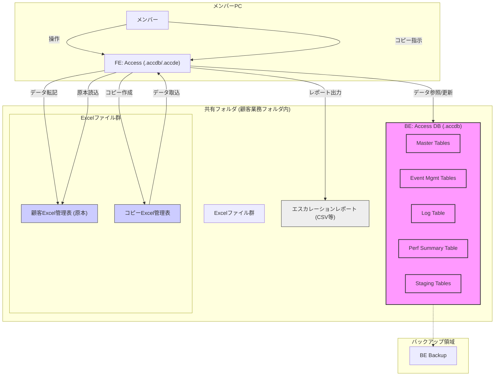

## 2. システム構成

### 2.1. システム構成概要
本システムは、「設計原則とパターン (VBA版)」に基づき、ユーザーインターフェースを提供する**フロントエンド(FE)**と、データを格納する**バックエンド(BE)**に分離した構成（FE/BE分離構成）を採用します。これにより、保守性、拡張性、およびデータ破損リスクの低減を図ります。

* **FE:** Microsoft Accessアプリケーション（.accdbまたは.accde形式）として各メンバーPC上で動作します。フォーム、レポート、UI制御ロジック、およびBEへのデータアクセス要求を含みます。**Excelコピー支援プロセス（コピー指示、原本読込、コピー作成）もFEの機能として実装**されます（要件定義書 4.1項参照）。
* **BE:** Microsoft Accessデータベースファイル（.accdb形式）として、アクセス権が管理された共有フォルダ上に配置されます。テーブル、クエリ、リレーションシップなど、データの実体を一元管理します。FEからはリンクテーブル等を通じて接続されます。BE内には、物理的にはテーブルオブジェクトとして、論理的には以下のテーブル群が含まれます。
    * マスタテーブル群 (MasterTables)
    * イベント管理テーブル群 (Event Mgmt Tables)
    * ログテーブル (Log Table)
    * 実績集計テーブル (Perf Summary Table)
    * ステージングテーブル群 (Staging Tables)

### 2.2. システム構成図 (Mermaid)

**構成要素補足:**

* **FE (フロントエンド):** ユーザーが操作するAccessアプリケーション。UI、入力ロジック、BEへのデータアクセス要求、**Excelコピー支援機能**等を含む。
* **BE (バックエンド):** Accessデータベースファイル。テーブル、クエリ、リレーションシップ等、データの実体を含む。共有フォルダに配置。
    * **MasterTables:** 各種マスタデータ（ユーザー、業務種別、工程定義など）を格納。
    * **Event Mgmt Tables:** イベント管理関連テーブル（イベント本体、詳細、関連）を格納。
    * **Log Table:** システムログ、エラーログを格納。
    * **Perf Summary Table:** 日次実績集計データを格納。
    * **Staging Tables:** ステージングDB関連テーブル（一時取込、案件情報、作業履歴、チェックミス）を格納。（詳細は詳細設計）
* **Excelファイル群:**
    * **顧客Excel管理表 (原本):** マスターデータ。原則直接編集しない。
    * **コピーExcel管理表:** 作業用にコピーされたファイル。FEへのデータ取込元。
* **エスカレーションレポート:** データ転記時のイレギュラー情報を出力するファイル（CSV形式等）。
* **バックアップ領域:** BEデータベースのバックアップ保管場所（運用要件で定義）。

---