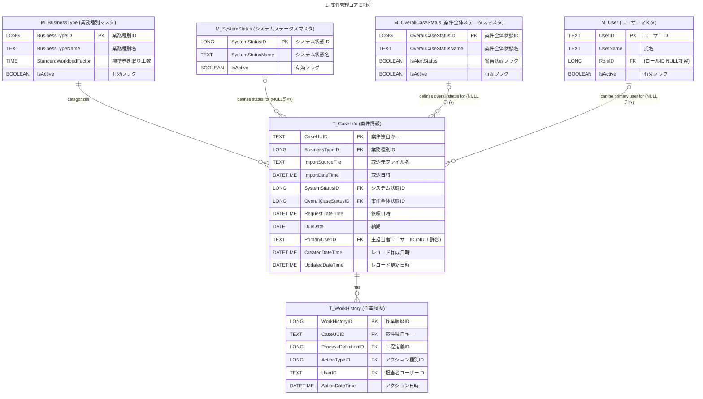
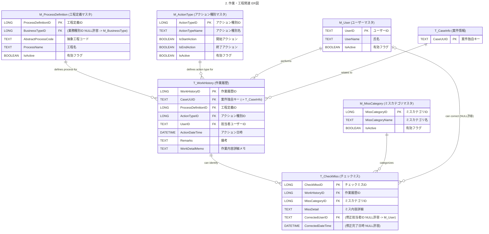
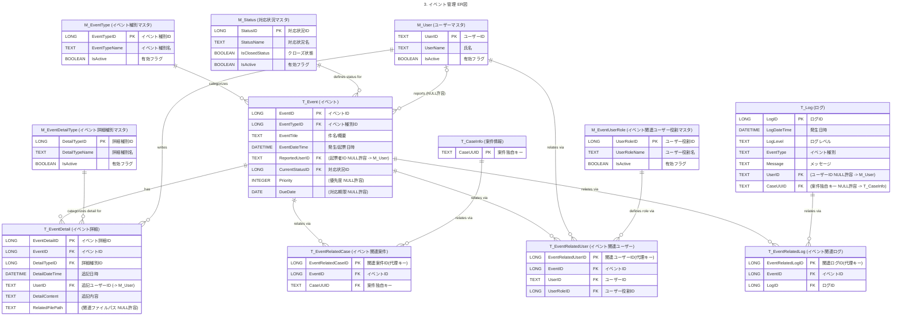

## 3. バックエンド(BE)設計

### 3.1. データベース概要
本システムのバックエンドは Microsoft Access データベース (.accdb) を使用します。データはBEデータベースファイル内のテーブルに格納され、FEアプリケーションからリンクテーブル等を通じてアクセスされます。

**設計方針:**

* **FE/BE分離:** [設計原則とパターン (VBA版)](../design-principles-vba.md) に基づき、保守性、拡張性、データ保護、テスト容易性を考慮し、FE/BE分離構成を採用します。
* **ステージングDB:** コピーExcel管理表からのデータ取込先として、またメンバーの作業領域として、BE内にステージングDB（専用テーブル群）を設けます。これにより、原本Excelへの直接操作を避け、データ整合性を維持しつつ作業を行います。
* **独自キー管理:** 顧客Excel管理表上のキー（行番号等）は変動する可能性があるため、システム内部では案件情報(`T_案件情報`)や作業履歴(`T_作業履歴`)などに**システム独自の安定したキー**を付与し、テーブル間のリレーションを確実に維持します。
    * 具体的には、**Excelとの連携・追跡においてキーの安定性が特に重要な案件情報テーブル (`T_CaseInfo`) の主キーにはUUID（テキスト型）を採用**します。これは、Excel側でキーが変動してもシステム内部で一意な識別子を保持し続けることを目的とします。
    * その他のテーブル（多くのマスタテーブルやトランザクションテーブル）では、主に**オートナンバー型**を主キーとして使用し、実装の簡便性を図ります。
* **正規化と冗長性:** 基本的に正規化を目指しますが、検索・表示パフォーマンスや実装の簡便性を考慮し、一部冗長な項目（例: `T_案件情報`の`CustomerName`）を持つことを許容します。
* **監査項目:** データ整合性と追跡可能性のため、原則として全てのテーブルにレコード作成日時 (`CreatedDateTime`) とレコード更新日時 (`UpdatedDateTime`) を設けます。これらの項目は、**主にVBAのコードにより、レコードの挿入・更新時に自動的に現在日時が設定されるように実装**します。([設計原則とパターン (VBA版)](../design-principles-vba.md) のエラーハンドリング戦略や、[コーディング規約 (VBA版)](../coding-standards-vba.md) のオブジェクト変数管理に従い、適切なタイミングで更新処理を組み込みます。)
* **命名規則:** テーブル名、フィールド名は[コーディング規約 (VBA版)](../coding-standards-vba.md) に準拠し、物理名は`PascalCase`、論理名は日本語とします。
* **データ型と制約:** Accessのデータ型を適切に選択し、必要な制約（主キー、外部キー、NULL許容、入力規則、インデックス）を設定します。特に検索条件や結合キーとなるフィールドにはインデックスを設定し、パフォーマンスを考慮します。

BE内には、ステージングDB関連テーブル群のほか、システム全体で利用するマスタテーブル群、トランザクションを記録するテーブル群（作業履歴、チェックミス等）、システムログテーブル、イベント管理テーブル群、実績集計テーブルが含まれます。


### 3.2. テーブル定義
以下に、本システムで使用する主要なテーブルの定義を示します。各テーブルのフィールド定義における「Index」列は、設定するインデックスの種類を示します（主キー(PK)、一意(Unique)、重複可(Index)）。

**【マスタテーブル】**

* **`M_BusinessType` (業務種別マスタ)**
    * 役割: 業務の種類（例：「証明書関連」）を管理します。

| 物理名                   | 論理名                 | データ型       | サイズ/形式 | PK | FK | NULL許容 | Index        | 既定値 | 備考                                                                                             |
| :----------------------- | :--------------------- | :------------- | :---------- | :- | :- | :------- | :----------- | :----- | :----------------------------------------------------------------------------------------------- |
| BusinessTypeID           | 業務種別ID             | オートナンバー | 長整数型    | ✅ |    | **No** | PK           |        | 業務種別の一意な識別子                                                                             |
| BusinessTypeName         | 業務種別名             | テキスト       | 100         |    |    | **No** | Unique       |        | 例：「証明書関連」「資格情報登録」。一意であるべき。                                                   |
| StandardWorkloadFactor | 標準巻き取り工数       | 数値型         | 長整数型    |    |    | Yes      | なし         |        | この業務の1件あたり標準工数（**秒単位**）。巻き取り工数計算用。                     |
| Description              | 説明                   | メモ型         |             |    |    | Yes      | なし         |        | 業務種別の補足説明（任意）                                                                       |
| IsActive                 | 有効フラグ             | Yes/No型       |             |    |    | **No** | Index        | Yes    | この業務種別が現在有効かを示すフラグ。検索条件として利用されるためインデックスを設定。                   |
| CreatedDateTime          | レコード作成日時       | 日時型         |             |    |    | **No** | なし         | Now()  | (監査用) 自動更新想定。                                                                          |
| UpdatedDateTime          | レコード更新日時       | 日時型         |             |    |    | **No** | なし         | Now()  | (監査用) 自動更新想定。                                                                          |

* **`M_ProcessDefinition` (工程定義マスタ)**
    * 役割: 抽象化された工程（作業の性質）を定義します。業務フローの構成要素となります。

| 物理名                     | 論理名                   | データ型       | サイズ/形式 | PK | FK | NULL許容 | Index             | 既定値 | 備考                                                                                                                                                                                                                         |
| :------------------------- | :----------------------- | :------------- | :---------- | :- | :- | :------- | :---------------- | :----- | :--------------------------------------------------------------------------------------------------------------------------------------------------------------------------------------------------------------------------- |
| ProcessDefinitionID        | 工程定義ID               | オートナンバー | 長整数型    | ✅ |    | **No** | PK                |        | 工程定義の一意な識別子                                                                                                                                                                                                         |
| BusinessTypeID             | 業務種別ID               | 数値型         | 長整数型    |    | ✅ | Yes      | Index             |        | `M_BusinessType.BusinessTypeID` と紐づく。特定の業務種別固有の工程の場合に指定（共通工程ならNULL）。FKだがNULL許容。                                                                                                               |
| AbstractProcessCode        | 抽象工程コード           | テキスト       | 50          |    |    | **No** | Index (Composite) |        | 抽象工程を示すコード。`BusinessTypeID` との組み合わせで一意性を担保する複合インデックスを推奨。                                                                                                                                   |
| ProcessName                | 工程名                   | テキスト       | 100         |    |    | **No** | Index             |        | 抽象化された工程の名称（例：「受付」「入力」「ダブルチェック」）。検索・表示用にインデックスを設定。                                                                                                                            |
| DefaultProcessType         | 標準工程種別             | テキスト       | 50          |    |    | Yes      | Index             |        | 工程の性質を示す分類（例：「メイン作業」「チェック」）。検索・表示用にインデックスを設定。                                                                                                                                     |
| StandardDurationMinutes    | 標準所要時間（分）       | 数値型         | 整数型      |    |    | Yes      | なし              |        | この工程の標準的な所要時間の目安（分単位）。実績集計等での利用を想定。                                                                                                                                                           |
| IsMandatoryInDefaultFlow   | 標準フロー必須フラグ     | Yes/No型       |             |    |    | **No** | なし              | No     | 主要な業務パターンにおいて、この工程が必須かどうかを示す目安。                                                                                                                                                                 |
| CanMultipleWorkers         | 複数担当者可否フラグ     | Yes/No型       |             |    |    | **No** | なし              | No     | 複数担当者が関与しうる工程かどうかの目安。                                                                                                                                                                                   |
| RequiresDifferentChecker   | 別担当者チェック要否フラグ | Yes/No型       |             |    |    | **No** | なし              | No     | 作業者と異なる担当者によるチェックが必要な工程かどうかの目安。                                                                                                                                                                 |
| StandardOrder              | 標準順序                 | 数値型         | 整数型      |    |    | Yes      | Index             |        | 業務フロー内での標準的な表示順や実行順を示す（任意）。ソート用にインデックスを設定。                                                                                                                                             |
| IsActive                   | 有効フラグ               | Yes/No型       |             |    |    | **No** | Index             | Yes    | この工程定義が現在有効かを示すフラグ。検索条件として利用されるためインデックスを設定。                                                                                                                                           |
| CreatedDateTime            | レコード作成日時         | 日時型         |             |    |    | **No** | なし              | Now()  | (監査用) 自動更新想定。                                                                                                                                                                                                      |
| UpdatedDateTime            | レコード更新日時         | 日時型         |             |    |    | **No** | なし              | Now()  | (監査用) 自動更新想定。                                                                                                                                                                                                      |

* **`M_User` (ユーザーマスタ)**
    * 役割: システム利用者の情報を管理します。

| 物理名          | 論理名           | データ型   | サイズ/形式 | PK | FK | NULL許容 | Index  | 既定値 | 備考                                                                                                                               |
| :-------------- | :--------------- | :--------- | :---------- | :- | :- | :------- | :----- | :----- | :--------------------------------------------------------------------------------------------------------------------------------- |
| UserID          | ユーザーID       | テキスト   | 50          | ✅ |    | **No** | PK     |        | ユーザーの一意な識別子（例：社員番号など）。ログイン認証等で使用。                                                                   |
| UserName        | 氏名             | テキスト   | 100         |    |    | **No** | Index  |        | 利用者の氏名。検索・表示用にインデックスを設定。                                                                                   |
| PasswordHash    | パスワードハッシュ | テキスト   | 255         |    |    | **No** | なし   |        | ハッシュ化されたパスワード。アルゴリズムに応じてサイズ調整。                                                          |
| PasswordSalt    | パスワードソルト | テキスト   | 100         |    |    | **No** | なし   |        | パスワードハッシュ化に使用するソルト。|
| RoleID          | ロールID         | 数値型     | 長整数型    |    | ✅ | Yes      | Index  |        | `M_Role.RoleID` と紐づく。役割（管理者、一般メンバー等）。FKだがNULL許容。権限管理のキーとなるためインデックスを設定。                     |
| IsActive        | 有効フラグ       | Yes/No型   |             |    |    | **No** | Index  | Yes    | このユーザーが現在有効（在籍中など）かを示すフラグ。ログイン制御や検索条件として利用されるためインデックスを設定。                   |
| CreatedDateTime | レコード作成日時 | 日時型     |             |    |    | **No** | なし   | Now()  | (監査用) 自動更新想定。                                                                                                            |
| UpdatedDateTime | レコード更新日時 | 日時型     |             |    |    | **No** | なし   | Now()  | (監査用) 自動更新想定。                                                                                                            |

* **`M_UserTaskAbility` (ユーザー対応可能タスクマスタ)**
    * 役割: ユーザーが対応可能なタスク（工程）を管理します（`M_User` と `M_ProcessDefinition` の多対多関係）。

| 物理名              | 論理名           | データ型   | サイズ/形式 | PK | FK | NULL許容 | Index             | 既定値 | 備考                                                                                                                               |
| :------------------ | :--------------- | :--------- | :---------- | :- | :- | :------- | :---------------- | :----- | :--------------------------------------------------------------------------------------------------------------------------------- |
| UserID              | ユーザーID       | テキスト   | 50          | ✅ | ✅ | **No** | PK, Index (Composite) |        | `M_User.UserID` と紐づく。主キーの一部。                                                                                           |
| ProcessDefinitionID | 工程定義ID       | 数値型     | 長整数型    | ✅ | ✅ | **No** | PK, Index (Composite) |        | `M_ProcessDefinition.ProcessDefinitionID` と紐づく。主キーの一部。                                                                   |
| SkillLevel          | スキルレベル     | 数値型     | 整数型      |    |    | Yes      | なし              |        | (任意) 対応可能レベル（例: 1:見習い, 3:標準, 5:熟練）。                                                                              |
| CreatedDateTime     | レコード作成日時   | 日時型     |             |    |    | **No** | なし              | Now()  | (監査用) 自動更新想定。                                                                                                            |
| UpdatedDateTime     | レコード更新日時   | 日時型     |             |    |    | **No** | なし              | Now()  | (監査用) 自動更新想定。                                                                                                            |

* **`M_Role` (ロールマスタ)**
    * 役割: ユーザーの役割（権限グループ）を管理します。

| 物理名        | 論理名         | データ型       | サイズ/形式 | PK | FK | NULL許容 | Index  | 既定値 | 備考                                                     |
| :------------ | :------------- | :------------- | :---------- | :- | :- | :------- | :----- | :----- | :------------------------------------------------------- |
| RoleID        | ロールID       | オートナンバー | 長整数型    | ✅ |    | **No** | PK     |        | ロールの一意な識別子。                                     |
| RoleName      | ロール名       | テキスト       | 50          |    |    | **No** | Unique |        | 例: "管理者", "一般"。一意であるべき。                     |
| Description   | 説明           | メモ型         |             |    |    | Yes      | なし   |        | ロールの補足説明（任意）。                                 |
| DisplayOrder  | 表示順         | 数値型         | 整数型      |    |    | Yes      | Index  |        | 画面表示時のソート順（任意）。インデックスを設定。           |
| IsActive      | 有効フラグ     | Yes/No型       |             |    |    | **No** | Index  | Yes    | このロールが現在有効か。検索条件として利用されるためインデックスを設定。 |
| CreatedDateTime | レコード作成日時 | 日時型         |             |    |    | **No** | なし   | Now()  | (監査用) 自動更新想定。                                  |
| UpdatedDateTime | レコード更新日時 | 日時型         |             |    |    | **No** | なし   | Now()  | (監査用) 自動更新想定。                                  |

* **`M_RoleMenuPermission` (ロールメニュー権限マスタ)**
    * 役割: ロールごとにアクセス可能な画面と、メニュー表示に必要な情報（表示名、順序、グループ）を管理します。

| 物理名                | 論理名           | データ型       | サイズ/形式 | PK | FK | NULL許容 | Index                      | 既定値 | 備考                                                                                                                                                                |
| :-------------------- | :--------------- | :------------- | :---------- | :- | :- | :------- | :------------------------- | :----- | :------------------------------------------------------------------------------------------------------------------------------------------------------------------ |
| RoleMenuPermissionID| 権限ID           | オートナンバー | 長整数型    | ✅ |    | **No** | PK                         |        | レコードの一意な識別子（代理キー）。                                                                                                                                    |
| RoleID                | ロールID         | 数値型         | 長整数型    |    | ✅ | **No** | Index (Composite, Unique)  |        | `M_Role.RoleID` と紐づく。必須項目。`ScreenID` との複合ユニーク制約を推奨。検索用にインデックス設定。                                                                          |
| ScreenID              | 画面ID           | テキスト       | 50          |    |    | **No** | Index (Composite, Unique)  |        | アクセス対象画面のID (`FRMXXXXX_XXX`形式)。必須項目。`RoleID` との複合ユニーク制約を推奨。検索用にインデックス設定。                                                               |
| CanView               | 閲覧権限         | Yes/No型       |             |    |    | **No** | なし                       | No     | このロールがこの画面/機能を閲覧できるか。メニュー表示の可否判断に使用。                                                                                                        |
| CanExecute            | 実行/編集権限    | Yes/No型       |             |    |    | **No** | なし                       | No     | このロールがこの画面/機能で実行や編集操作を行えるか。ボタンの有効/無効状態の制御に使用。                                                                                          |
| MenuDisplayName       | メニュー表示名   | テキスト       | 100         |    |    | **No** | なし                       |        | メインメニューのボタン等に表示される名前。アクセスキー（例: `&L`）を含む想定 (例: `案件一覧(&L)`)。必須項目。                                                                   |
| MenuGroup             | メニューグループ   | テキスト       | 50          |    |    | **No** | Index (Composite, Sort)    |        | メニュー項目を分類するグループ名（例: "基本操作", "データ連携", "管理機能"）。フォーム上のFrame等での整理用。`DisplayOrder` との複合インデックスをソート用に設定。必須項目。                    |
| DisplayOrder          | 表示順           | 数値型         | 整数型      |    |    | **No** | Index (Composite, Sort)    | 0      | `MenuGroup` 内での表示順序。小さい値が先。`MenuGroup` との複合インデックスをソート用に設定。必須項目。                                                                            |
| CreatedDateTime       | レコード作成日時   | 日時型         |             |    |    | **No** | なし                       | Now()  | (監査用) 自動更新想定。                                                                                                                                             |
| UpdatedDateTime       | レコード更新日時   | 日時型         |             |    |    | **No** | なし                       | Now()  | (監査用) 自動更新想定。                                                                                                                                             |

* **`M_SystemStatus` (システムステータスマスタ)**
    * 役割: 案件のシステム内部ステータス（例: 取込済、作業中、転記済）を管理します。

| 物理名           | 論理名         | データ型       | サイズ/形式 | PK | FK | NULL許容 | Index  | 既定値 | 備考                                                     |
| :--------------- | :------------- | :------------- | :---------- | :- | :- | :------- | :----- | :----- | :------------------------------------------------------- |
| SystemStatusID   | システム状態ID | オートナンバー | 長整数型    | ✅ |    | **No** | PK     |        | システムステータスの一意な識別子。                         |
| SystemStatusName | システム状態名 | テキスト       | 50          |    |    | **No** | Unique |        | 例: "取込済", "作業中", "転記済"。一意であるべき。         |
| Description      | 説明           | メモ型         |             |    |    | Yes      | なし   |        | ステータスの補足説明（任意）。                             |
| DisplayOrder     | 表示順         | 数値型         | 整数型      |    |    | Yes      | Index  |        | 画面表示時のソート順（任意）。インデックスを設定。           |
| IsActive         | 有効フラグ     | Yes/No型       |             |    |    | **No** | Index  | Yes    | このステータスが現在有効か。検索条件として利用されるためインデックスを設定。 |
| CreatedDateTime  | レコード作成日時 | 日時型         |             |    |    | **No** | なし   | Now()  | (監査用) 自動更新想定。                                  |
| UpdatedDateTime  | レコード更新日時 | 日時型         |             |    |    | **No** | なし   | Now()  | (監査用) 自動更新想定。                                  |

* **`M_OverallCaseStatus` (案件全体ステータスマスタ)**
    * 役割: 案件の全体的な状態（工程整合性や確認要否など）を管理します。

| 物理名              | 論理名           | データ型       | サイズ/形式 | PK | FK | NULL許容 | Index  | 既定値 | 備考                                                     |
| :------------------ | :--------------- | :------------- | :---------- | :- | :- | :------- | :----- | :----- | :------------------------------------------------------- |
| OverallCaseStatusID | 案件全体状態ID   | オートナンバー | 長整数型    | ✅ |    | **No** | PK     |        | 案件全体ステータスの一意な識別子。                       |
| OverallCaseStatusName| 案件全体状態名   | テキスト       | 50          |    |    | **No** | Unique |        | 例: "正常", "要確認", "異常あり"。一意であるべき。         |
| IsAlertStatus       | 警告状態フラグ   | Yes/No型       |             |    |    | **No** | Index  | No     | 注意喚起が必要な状態か (任意)。検索用にインデックスを設定。    |
| Description         | 説明             | メモ型         |             |    |    | Yes      | なし   |        | ステータスの補足説明（任意）。                             |
| DisplayOrder        | 表示順           | 数値型         | 整数型      |    |    | Yes      | Index  |        | 画面表示時のソート順（任意）。インデックスを設定。           |
| IsActive            | 有効フラグ       | Yes/No型       |             |    |    | **No** | Index  | Yes    | このステータスが現在有効か。検索条件として利用されるためインデックスを設定。 |
| CreatedDateTime     | レコード作成日時   | 日時型         |             |    |    | **No** | なし   | Now()  | (監査用) 自動更新想定。                                  |
| UpdatedDateTime     | レコード更新日時   | 日時型         |             |    |    | **No** | なし   | Now()  | (監査用) 自動更新想定。                                  |

* **`M_MissCategory` (ミスカテゴリマスタ)**
    * 役割: チェックミスのカテゴリを管理します。

| 物理名          | 論理名         | データ型       | サイズ/形式 | PK | FK | NULL許容 | Index  | 既定値 | 備考                                                     |
| :-------------- | :------------- | :------------- | :---------- | :- | :- | :------- | :----- | :----- | :------------------------------------------------------- |
| MissCategoryID  | ミスカテゴリID | オートナンバー | 長整数型    | ✅ |    | **No** | PK     |        | ミスカテゴリの一意な識別子。                               |
| MissCategoryName| ミスカテゴリ名 | テキスト       | 100         |    |    | **No** | Unique |        | 例: "入力誤り", "判断ミス"。一意であるべき。               |
| Description     | 説明           | メモ型         |             |    |    | Yes      | なし   |        | カテゴリの補足説明（任意）。                               |
| DisplayOrder    | 表示順         | 数値型         | 整数型      |    |    | Yes      | Index  |        | 画面表示時のソート順（任意）。インデックスを設定。           |
| IsActive        | 有効フラグ     | Yes/No型       |             |    |    | **No** | Index  | Yes    | このカテゴリが現在有効か。検索条件として利用されるためインデックスを設定。 |
| CreatedDateTime | レコード作成日時 | 日時型         |             |    |    | **No** | なし   | Now()  | (監査用) 自動更新想定。                                  |
| UpdatedDateTime | レコード更新日時 | 日時型         |             |    |    | **No** | なし   | Now()  | (監査用) 自動更新想定。                                  |

* **`M_ActionType` (アクション種別マスタ)**
    * 役割: 作業履歴のアクションの種類（例: 開始、終了）を管理します。

| 物理名          | 論理名         | データ型       | サイズ/形式 | PK | FK | NULL許容 | Index  | 既定値 | 備考                                                                                                                               |
| :-------------- | :------------- | :------------- | :---------- | :- | :- | :------- | :----- | :----- | :--------------------------------------------------------------------------------------------------------------------------------- |
| ActionTypeID    | アクション種別ID | オートナンバー | 長整数型    | ✅ |    | **No** | PK     |        | アクション種別の一意な識別子。                                                                                                       |
| ActionTypeName  | アクション種別名 | テキスト       | 50          |    |    | **No** | Unique |        | 例: "開始", "終了", "チェック完了", "完了"。一意であるべき。                                                                       |
| IsStartAction   | 開始アクション | Yes/No型       |             |    |    | **No** | Index  | No     | 工程開始を示すアクションか (任意)。実績集計等で利用する可能性を考慮しインデックスを設定。                                                      |
| IsEndAction     | 終了アクション | Yes/No型       |             |    |    | **No** | Index  | No     | 工程/案件終了を示すアクションか (任意)。実績集計等で利用する可能性を考慮しインデックスを設定。                                                    |
| Description     | 説明           | メモ型         |             |    |    | Yes      | なし   |        | アクション種別の補足説明（任意）。                                                                                                   |
| DisplayOrder    | 表示順         | 数値型         | 整数型      |    |    | Yes      | Index  |        | 画面表示時のソート順（任意）。インデックスを設定。                                                                                   |
| IsActive        | 有効フラグ     | Yes/No型       |             |    |    | **No** | Index  | Yes    | このアクション種別が現在有効か。検索条件として利用されるためインデックスを設定。                                                                 |
| CreatedDateTime | レコード作成日時 | 日時型         |             |    |    | **No** | なし   | Now()  | (監査用) 自動更新想定。                                                                                                            |
| UpdatedDateTime | レコード更新日時 | 日時型         |             |    |    | **No** | なし   | Now()  | (監査用) 自動更新想定。                                                                                                            |

* **`M_EventType` (イベント種別マスタ)**
    * 役割: イベント管理機能で扱うイベントの種類（例: 問合せ、クレーム）を管理します。

| 物理名         | 論理名       | データ型       | サイズ/形式 | PK | FK | NULL許容 | Index  | 既定値 | 備考                                                     |
| :------------- | :----------- | :------------- | :---------- | :- | :- | :------- | :----- | :----- | :------------------------------------------------------- |
| EventTypeID    | イベント種別ID | オートナンバー | 長整数型    | ✅ |    | **No** | PK     |        | イベント種別の一意な識別子。                               |
| EventTypeName  | イベント種別名 | テキスト       | 50          |    |    | **No** | Unique |        | 例: "問合せ", "クレーム", "エラー報告"。一意であるべき。     |
| Description    | 説明         | メモ型         |             |    |    | Yes      | なし   |        | イベント種別の補足説明（任意）。                           |
| DisplayOrder   | 表示順       | 数値型         | 整数型      |    |    | Yes      | Index  |        | 画面表示時のソート順（任意）。インデックスを設定。           |
| IsActive       | 有効フラグ   | Yes/No型       |             |    |    | **No** | Index  | Yes    | このイベント種別が現在有効か。検索条件として利用されるためインデックスを設定。 |
| CreatedDateTime| レコード作成日時 | 日時型       |             |    |    | **No** | なし   | Now()  | (監査用) 自動更新想定。                                  |
| UpdatedDateTime| レコード更新日時 | 日時型       |             |    |    | **No** | なし   | Now()  | (監査用) 自動更新想定。                                  |

* **`M_Status` (対応状況マスタ)**
    * 役割: イベント管理機能におけるイベントの対応状況（例: 新規受付、対応中、完了）を管理します。

| 物理名         | 論理名       | データ型       | サイズ/形式 | PK | FK | NULL許容 | Index  | 既定値 | 備考                                                     |
| :------------- | :----------- | :------------- | :---------- | :- | :- | :------- | :----- | :----- | :------------------------------------------------------- |
| StatusID       | 対応状況ID   | オートナンバー | 長整数型    | ✅ |    | **No** | PK     |        | 対応状況の一意な識別子。                                   |
| StatusName     | 対応状況名   | テキスト       | 50          |    |    | **No** | Unique |        | 例: "新規受付", "対応中", "完了"。一意であるべき。         |
| IsClosedStatus | クローズ状態 | Yes/No型       |             |    |    | **No** | Index  | No     | 完了/クローズ状態を示すか (任意)。検索用にインデックスを設定。 |
| DisplayOrder   | 表示順       | 数値型         | 整数型      |    |    | Yes      | Index  |        | 画面表示時のソート順（任意）。インデックスを設定。           |
| IsActive       | 有効フラグ   | Yes/No型       |             |    |    | **No** | Index  | Yes    | この対応状況が現在有効か。検索条件として利用されるためインデックスを設定。 |
| CreatedDateTime| レコード作成日時 | 日時型       |             |    |    | **No** | なし   | Now()  | (監査用) 自動更新想定。                                  |
| UpdatedDateTime| レコード更新日時 | 日時型       |             |    |    | **No** | なし   | Now()  | (監査用) 自動更新想定。                                  |

* **`M_EventDetailType` (イベント詳細種別マスタ)**
    * 役割: イベントへの追記（スクラップ）の種類（例: 初期報告、対応記録）を管理します。

| 物理名         | 論理名         | データ型       | サイズ/形式 | PK | FK | NULL許容 | Index  | 既定値 | 備考                                                     |
| :------------- | :------------- | :------------- | :---------- | :- | :- | :------- | :----- | :----- | :------------------------------------------------------- |
| DetailTypeID   | 詳細種別ID     | オートナンバー | 長整数型    | ✅ |    | **No** | PK     |        | 詳細種別の一意な識別子。                                   |
| DetailTypeName | 詳細種別名     | テキスト       | 50          |    |    | **No** | Unique |        | 例: "初期報告", "対応記録", "コメント"。一意であるべき。   |
| Description    | 説明           | メモ型         |             |    |    | Yes      | なし   |        | 詳細種別の補足説明（任意）。                               |
| DisplayOrder   | 表示順         | 数値型         | 整数型      |    |    | Yes      | Index  |        | 画面表示時のソート順（任意）。インデックスを設定。           |
| IsActive       | 有効フラグ     | Yes/No型       |             |    |    | **No** | Index  | Yes    | この詳細種別が現在有効か。検索条件として利用されるためインデックスを設定。 |
| CreatedDateTime| レコード作成日時 | 日時型         |             |    |    | **No** | なし   | Now()  | (監査用) 自動更新想定。                                  |
| UpdatedDateTime| レコード更新日時 | 日時型         |             |    |    | **No** | なし   | Now()  | (監査用) 自動更新想定。                                  |

* **`M_EventUserRole` (イベント関連ユーザー役割マスタ)**
    * 役割: イベントに関連するユーザーの役割（例: 報告者、担当者）を管理します。

| 物理名       | 論理名       | データ型       | サイズ/形式 | PK | FK | NULL許容 | Index  | 既定値 | 備考                                                     |
| :----------- | :----------- | :------------- | :---------- | :- | :- | :------- | :----- | :----- | :------------------------------------------------------- |
| UserRoleID   | ユーザー役割ID | オートナンバー | 長整数型    | ✅ |    | **No** | PK     |        | ユーザー役割の一意な識別子。                               |
| UserRoleName | ユーザー役割名 | テキスト       | 50          |    |    | **No** | Unique |        | 例: "報告者", "担当者", "確認者"。一意であるべき。         |
| Description  | 説明         | メモ型         |             |    |    | Yes      | なし   |        | ユーザー役割の補足説明（任意）。                           |
| DisplayOrder | 表示順       | 数値型         | 整数型      |    |    | Yes      | Index  |        | 画面表示時のソート順（任意）。インデックスを設定。           |
| IsActive     | 有効フラグ   | Yes/No型       |             |    |    | **No** | Index  | Yes    | この役割が現在有効か。検索条件として利用されるためインデックスを設定。 |
| CreatedDateTime| レコード作成日時 | 日時型       |             |    |    | **No** | なし   | Now()  | (監査用) 自動更新想定。                                  |
| UpdatedDateTime| レコード更新日時 | 日時型       |             |    |    | **No** | なし   | Now()  | (監査用) 自動更新想定。                                  |

* **`M_Setting` (設定マスタ)**
    * 役割: システム全体の設定値（例: デフォルトパス、特定機能のON/OFFフラグなど）をキー・バリュー形式で管理します。

| 物理名          | 論理名         | データ型   | サイズ/形式 | PK | FK | NULL許容 | Index | 既定値 | 備考                                                                                                                               |
| :-------------- | :------------- | :--------- | :---------- | :- | :- | :------- | :---- | :----- | :--------------------------------------------------------------------------------------------------------------------------------- |
| SettingKey      | 設定キー       | テキスト   | 100         | ✅ |    | **No** | PK    |        | 設定項目を識別する一意なキー (英語推奨、例: `DefaultExportPath`, `EnableAutoBackup`)。                                                 |
| SettingValue    | 設定値         | メモ型     |             |    |    | Yes      | なし  |        | 設定値。VBAコード側で適切なデータ型（文字列、数値、真偽値、日付など）に変換して利用する。                                                    |
| Description     | 説明           | メモ型     |             |    |    | Yes      | なし  |        | 設定項目の内容や目的を説明する（必須推奨）。                                                                                         |
| ValueTypeHint   | 値の型ヒント   | テキスト   | 50          |    |    | Yes      | なし  |        | (任意) 値の期待されるデータ型を示すヒント文字列（例: "String", "Integer", "Boolean", "Date"）。コードでの型変換や管理画面での表示補助用。 |
| IsEditable      | ユーザー編集可 | Yes/No型   |             |    |    | **No** | なし  | No     | (任意) 管理画面等でユーザーがこの設定値を編集できるかを示すフラグ。                                                                   |
| CreatedDateTime | レコード作成日時 | 日時型     |             |    |    | **No** | なし  | Now()  | (監査用) 自動更新想定。                                                                                                            |
| UpdatedDateTime | レコード更新日時 | 日時型     |             |    |    | **No** | なし  | Now()  | (監査用) 自動更新想定。                                                                                                            |

* **`M_Holiday` (祝日マスタ)**
    * 役割: 営業日計算で使用する祝日（国民の祝日など）の日付と名称を管理します。リードタイム分析などで利用します。

| 物理名          | 論理名         | データ型   | サイズ/形式 | PK | FK | NULL許容 | Index | 既定値 | 備考                                                                 |
| :-------------- | :------------- | :--------- | :---------- | :- | :- | :------- | :---- | :----- | :------------------------------------------------------------------- |
| HolidayDate     | 祝日           | 日付型     |             | ✅ |    | **No** | PK    |        | 祝日の日付。主キー。                                                 |
| HolidayName     | 祝日名         | テキスト   | 100         |    |    | **No** | Index |        | 祝日の名称（例：「元日」、「建国記念の日」）。検索用にインデックスを設定。 |
| Description     | 説明           | メモ型     |             |    |    | Yes      | なし  |        | 祝日の補足説明（任意）。                                             |
| IsActive        | 有効フラグ     | Yes/No型   |             |    |    | **No** | Index | Yes    | この祝日定義が現在有効か。検索条件として利用されるためインデックスを設定。 |
| CreatedDateTime | レコード作成日時 | 日時型     |             |    |    | **No** | なし  | Now()  | (監査用) 自動更新想定。                                              |
| UpdatedDateTime | レコード更新日時 | 日時型     |             |    |    | **No** | なし  | Now()  | (監査用) 自動更新想定。                                              |

**【トランザクションテーブル】**

* **`T_CaseInfo` (案件情報テーブル)**
    * 役割: 案件の共通コア情報とシステム上のステータスを管理します。ステージングDBの中心となるテーブルの一つです。

| 物理名            | 論理名             | データ型           | サイズ/形式 | PK | FK | NULL許容 | Index             | 既定値 | 備考                                                                                                                                                                                                                                                           |
| :---------------- | :----------------- | :----------------- | :---------- | :- | :- | :------- | :---------------- | :----- | :------------------------------------------------------------------------------------------------------------------------------------------------------------------------------------------------------------------------------------------------------------- |
| CaseUUID          | 案件独自キー       | テキスト           | 38          | ✅ |    | **No** | PK                |        | 案件の一意な識別子（UUID形式、例: "{xxxxxxxx-xxxx-xxxx-xxxx-xxxxxxxxxxxx}"）。VBAで生成・設定。                                                                                                                                                                     |
| BusinessTypeID    | 業務種別ID         | 数値型             | 長整数型    |    | ✅ | **No** | Index             |        | `M_BusinessType.BusinessTypeID` と紐づく。必須項目。検索・集計用にインデックスを設定。                                                                                                                                                                             |
| ImportSourceFile  | 取込元ファイル名   | テキスト           | 255         |    |    | Yes      | Index             |        | どのコピーExcelファイルから取り込まれたかのファイルパスまたはファイル名。トレーサビリティ用。検索用にインデックスを設定。                                                                                                                                            |
| ImportDateTime    | 取込日時           | 日時型             |             |    |    | **No** | Index             | Now()  | データが取り込まれた日時。検索・ソート用にインデックスを設定。                                                                                                                                                                                                 |
| LastUpdatedDateTime| 最終更新日時       | 日時型             |             |    |    | **No** | Index             | Now()  | このレコードが最後に（主にFEから）更新された日時。トリガー等での自動更新想定。検索・ソート用にインデックスを設定。                                                                                                                                                   |
| CaseMgmtNumber    | 案件管理番号       | テキスト           | 100         |    |    | Yes      | Index             |        | Excel上の管理番号など、検索キーとして利用する可能性のある項目。NULLを許容するが、検索効率のためインデックスを設定。                                                                                                                                                  |
| SystemStatusID    | システム状態ID     | 数値型             | 長整数型    |    | ✅ | Yes      | Index             |        | `M_SystemStatus.SystemStatusID` と紐づく。案件の現在のシステム内部状態。FKだがNULL許容（初期状態など）。検索・絞り込み用にインデックスを設定。                                                                                                                        |
| OverallCaseStatusID | 案件全体状態ID     | 数値型             | 長整数型    |    | ✅ | Yes      | Index             |        | `M_OverallCaseStatus.OverallCaseStatusID` と紐づく。案件の全体的な状態。FKだがNULL許容。検索・絞り込み用にインデックスを設定。                                                                                                                                      |
| RequestDateTime   | 依頼日時           | 日時型             |             |    |    | Yes      | Index             |        | 顧客からの依頼日時（納期管理用）。検索・ソート用にインデックスを設定。                                                                                                                                                                                           |
| DueDate           | 納期               | 日時型             |             |    |    | Yes      | Index             |        | この案件の納期。遅延チェックや検索・ソート用にインデックスを設定。                                                                                                                                                                                             |
| PrimaryUserID     | 主担当者ユーザーID   | テキスト           | 50          |    | ✅ | Yes      | Index             |        | `M_User.UserID` と紐づく（任意）。案件の主担当者。FKだがNULL許容。検索・絞り込み用にインデックスを設定。                                                                                                                                                         |
| CreatedDateTime   | レコード作成日時   | 日時型             |             |    |    | **No** | なし              | Now()  | (監査用) 自動更新想定。                                                                                                                                                                                                                                        |
| UpdatedDateTime   | レコード更新日時   | 日時型             |             |    |    | **No** | なし              | Now()  | (監査用) 自動更新想定。                                                                                                                                                                                                                                        |

* **`T_WorkHistory` (作業履歴テーブル)**
    * 役割: 案件に対する作業アクションを、抽象化された工程と紐づけて記録します。

| 物理名            | 論理名           | データ型       | サイズ/形式 | PK | FK | NULL許容 | Index             | 既定値 | 備考                                                                                                                                                                                                                             |
| :---------------- | :--------------- | :------------- | :---------- | :- | :- | :------- | :---------------- | :----- | :------------------------------------------------------------------------------------------------------------------------------------------------------------------------------------------------------------------------------- |
| WorkHistoryID     | 作業履歴ID       | オートナンバー | 長整数型    | ✅ |    | **No** | PK                |        | レコードの一意な識別子                                                                                                                                                                                                           |
| CaseUUID          | 案件独自キー     | テキスト       | 38          |    | ✅ | **No** | Index             |        | `T_CaseInfo.CaseUUID` と紐づく。必須項目。関連レコード検索のためインデックスを設定。                                                                                                                                               |
| ProcessDefinitionID | 工程定義ID       | 数値型         | 長整数型    |    | ✅ | **No** | Index             |        | `M_ProcessDefinition.ProcessDefinitionID` と紐づく。どの抽象化された工程かを示す。必須項目。検索・集計用にインデックスを設定。                                                                                                       |
| ActionTypeID      | アクション種別ID | 数値型         | 長整数型    |    | ✅ | **No** | Index             |        | `M_ActionType.ActionTypeID` と紐づく。必須項目。検索・集計用にインデックスを設定。                                                                                                                                               |
| UserID            | 担当者ユーザーID | テキスト       | 50          |    | ✅ | **No** | Index             |        | `M_User.UserID` と紐づく。このアクションを実行した担当者。必須項目。検索・集計用にインデックスを設定。                                                                                                                             |
| ActionDateTime    | アクション日時   | 日時型         |             |    |    | **No** | Index             | Now()  | このアクションが発生した日時。必須項目。検索・ソート用にインデックスを設定。                                                                                                                                                       |
| Remarks           | 備考             | メモ型         |             |    |    | Yes      | なし              |        | 自由記述欄。                                                                                                                                                                                                                     |
| WorkDetailMemo    | 作業内容詳細メモ | メモ型         |             |    |    | Yes      | なし              |        | 現場での具体的な作業名や手順などを補足する場合。                                                                                                                                                                               |
| CreatedDateTime   | レコード作成日時 | 日時型         |             |    |    | **No** | なし              | Now()  | (監査用) 自動更新想定。                                                                                                                                                                                                      |
| UpdatedDateTime   | レコード更新日時 | 日時型         |             |    |    | **No** | なし              | Now()  | (監査用) 自動更新想定。                                                                                                                                                                                                      |

* **`T_CheckMiss` (チェックミステーブル)**
    * 役割: チェック工程で発見された個々のミスを記録します。

| 物理名            | 論理名             | データ型       | サイズ/形式 | PK | FK | NULL許容 | Index        | 既定値 | 備考                                                                                                                               |
| :---------------- | :----------------- | :------------- | :---------- | :- | :- | :------- | :----------- | :----- | :--------------------------------------------------------------------------------------------------------------------------------- |
| CheckMissID       | チェックミスID     | オートナンバー | 長整数型    | ✅ |    | **No** | PK           |        | ミス記録の一意な識別子                                                                                                             |
| WorkHistoryID     | 作業履歴ID         | 数値型         | 長整数型    |    | ✅ | **No** | Index        |        | `T_WorkHistory.WorkHistoryID` と紐づく。どのチェックアクションでのミスか。必須項目。関連レコード検索のためインデックスを設定。               |
| MissCategoryID    | ミスカテゴリID     | 数値型         | 長整数型    |    | ✅ | **No** | Index        |        | `M_MissCategory.MissCategoryID` と紐づく。必須項目。検索・集計用にインデックスを設定。                                                 |
| MissDetail        | ミス内容詳細       | メモ型         |             |    |    | Yes      | なし         |        | 具体的なミスの内容。                                                                                                               |
| CorrectedUserID   | 修正担当者ユーザーID | テキスト       | 50          |    | ✅ | Yes      | Index        |        | `M_User.UserID` と紐づく（任意）。誰が修正したか。FKだがNULL許容。検索用にインデックスを設定。                                       |
| CorrectedDateTime | 修正完了日時       | 日時型         |             |    |    | Yes      | Index        |        | いつ修正が完了したか（任意）。検索・ソート用にインデックスを設定。                                                                   |
| CreatedDateTime   | レコード作成日時     | 日時型         |             |    |    | **No** | なし         | Now()  | (監査用) 自動更新想定。                                                                                                            |
| UpdatedDateTime   | レコード更新日時     | 日時型         |             |    |    | **No** | なし         | Now()  | (監査用) 自動更新想定。                                                                                                            |

* **`T_Log` (ログテーブル)**
    * 役割: システムの動作イベントやエラーを記録します。トラブルシューティングや監査証跡として利用します。

| 物理名           | 論理名           | データ型           | サイズ/形式 | PK | FK | NULL許容 | Index        | 既定値 | 備考                                                                                                                                                                                                                                                           |
| :--------------- | :--------------- | :----------------- | :---------- | :- | :- | :------- | :----------- | :----- | :------------------------------------------------------------------------------------------------------------------------------------------------------------------------------------------------------------------------------------------------------------- |
| LogID            | ログID           | オートナンバー     | 長整数型    | ✅ |    | **No** | PK           |        | ログレコードの一意な識別子。                                                                                                                                                                                                                                     |
| LogDateTime      | 発生日時         | 日時型             |             |    |    | **No** | Index        | Now()  | ログイベントが発生した日時。必須項目。検索・ソート用にインデックスを設定。                                                                                                                                                                                       |
| LogLevel         | ログレベル       | テキスト           | 20          |    |    | **No** | Index        |        | "INFO", "WARN", "ERROR", "DEBUG" など。必須項目。検索・絞り込み用にインデックスを設定。                                                                                                                                                                            |
| EventType        | イベント種別     | テキスト           | 50          |    |    | **No** | Index        |        | "DataImport", "DataExport", "Login", "Error", "CaseUpdate" など。必須項目。検索・絞り込み用にインデックスを設定。                                                                                                                                                    |
| UserID           | ユーザーID       | テキスト           | 50          |    | ✅ | Yes      | Index        |        | `M_User.UserID` と紐づく（操作したユーザー）。システムイベントの場合はNULL。FKだがNULL許容。検索・絞り込み用にインデックスを設定。                                                                                                                                      |
| CaseUUID         | 案件独自キー     | テキスト           | 38          |    | ✅ | Yes      | Index        |        | `T_CaseInfo.CaseUUID` と紐づく（関連する案件がある場合）。FKだがNULL許容。関連ログ検索のためインデックスを設定。                                                                                                                                                   |
| Message          | メッセージ       | メモ型             |             |    |    | **No** | なし         |        | ログメッセージの本文。必須項目。                                                                                                                                                                                                                               |
| SourceProcedure  | 発生元プロシージャ | テキスト           | 255         |    |    | Yes      | なし         |        | エラーやイベントが発生したVBAプロシージャ名（任意）。デバッグ用。                                                                                                                                                                                               |
| ErrorNumber      | エラー番号       | 数値型             | 長整数型    |    |    | Yes      | なし         |        | エラー発生時、`Err.Number` を記録。                                                                                                                                                                                                                              |
| ErrorDescription | エラー内容       | メモ型             |             |    |    | Yes      | なし         |        | エラー発生時、`Err.Description` を記録。                                                                                                                                                                                                                         |
| ContextInfo      | コンテキスト情報   | メモ型             |             |    |    | Yes      | なし         |        | (任意追加) デバッグに役立つ追加情報（例: 処理中の変数内容の一部など）。個人情報を含まないように注意。                                                                                                                                                               |

* **`T_Event` (イベントテーブル)**
    * 役割: イベント管理機能におけるイベント本体（箱）のヘッダー情報を管理します。

| 物理名          | 論理名         | データ型       | サイズ/形式 | PK | FK | NULL許容 | Index        | 既定値 | 備考                                                                                                                               |
| :-------------- | :------------- | :------------- | :---------- | :- | :- | :------- | :----------- | :----- | :--------------------------------------------------------------------------------------------------------------------------------- |
| EventID         | イベントID     | オートナンバー | 長整数型    | ✅ |    | **No** | PK           |        | イベントの一意な識別子                                                                                                             |
| EventTypeID     | イベント種別ID | 数値型         | 長整数型    |    | ✅ | **No** | Index        |        | `M_EventType.EventTypeID` と紐づく。必須項目。検索・絞り込み用にインデックスを設定。                                                 |
| EventTitle      | 件名/概要      | テキスト       | 255         |    |    | **No** | Index        |        | イベントのタイトル。必須項目。検索用にインデックスを設定。                                                                           |
| EventDateTime   | 発生/起票日時  | 日時型         |             |    |    | **No** | Index        | Now()  | イベントが発生または起票された日時。必須項目。検索・ソート用にインデックスを設定。                                                     |
| ReportedUserID  | 起票者ID       | テキスト       | 50          |    | ✅ | Yes      | Index        |        | `M_User.UserID` と紐づく。システム起票ならNULL。FKだがNULL許容。検索・絞り込み用にインデックスを設定。                                 |
| CurrentStatusID | 対応状況ID     | 数値型         | 長整数型    |    | ✅ | **No** | Index        | (※1)   | `M_Status.StatusID` と紐づく。現在の対応状況。必須項目。既定値は「新規受付」。検索・絞り込み用にインデックスを設定。                  |
| Priority        | 優先度         | 数値型         | 整数型      |    |    | Yes      | Index        |        | 例: 1(高)-5(低) など。NULL許容。検索・ソート用にインデックスを設定。                                                                 |
| DueDate         | 対応期限       | 日時型         |             |    |    | Yes      | Index        |        | 期限管理用。NULL許容。検索・ソート用にインデックスを設定。                                                                           |
| CreatedDateTime | レコード作成日時 | 日時型         |             |    |    | **No** | なし         | Now()  | (監査用) 自動更新想定。                                                                                                            |
| UpdatedDateTime | レコード更新日時 | 日時型         |             |    |    | **No** | なし         | Now()  | (監査用) イベント更新時に自動更新想定。                                                                                              |
(※1) `M_Status` の「新規受付」に対応するStatusIDを既定値に設定。

* **`T_EventDetail` (イベント詳細テーブル)**
    * 役割: イベントへの追記（スクラップ）を記録します。

| 物理名          | 論理名         | データ型       | サイズ/形式 | PK | FK | NULL許容 | Index        | 既定値 | 備考                                                                                                                               |
| :-------------- | :------------- | :------------- | :---------- | :- | :- | :------- | :----------- | :----- | :--------------------------------------------------------------------------------------------------------------------------------- |
| EventDetailID   | イベント詳細ID | オートナンバー | 長整数型    | ✅ |    | **No** | PK           |        | イベント詳細レコードの一意な識別子。                                                                                                 |
| EventID         | イベントID     | 数値型         | 長整数型    |    | ✅ | **No** | Index        |        | `T_Event.EventID` と紐づく。必須項目。関連レコード検索のためインデックスを設定。                                                     |
| DetailTypeID    | 詳細種別ID     | 数値型         | 長整数型    |    | ✅ | **No** | Index        |        | `M_EventDetailType.DetailTypeID` と紐づく。必須項目。検索・絞り込み用にインデックスを設定。                                          |
| DetailDateTime  | 追記日時       | 日時型         |             |    |    | **No** | Index        | Now()  | この追記が行われた日時。必須項目。検索・ソート用にインデックスを設定。                                                               |
| UserID          | 追記ユーザーID | テキスト       | 50          |    | ✅ | **No** | Index        |        | `M_User.UserID` と紐づく。追記したユーザー。必須項目。検索・絞り込み用にインデックスを設定。                                         |
| DetailContent   | 追記内容       | メモ型         |             |    |    | Yes      | なし         |        | テキストでの詳細内容。NULL許容。                                                                                                   |
| RelatedFilePath | 関連ファイルパス | テキスト       | 255         |    |    | Yes      | なし         |        | 添付ファイル等へのパス（ハイパーリンク用）。複数ファイルは複数レコードで対応するか、別の管理方法を検討。NULL許容。                               |
| CreatedDateTime | レコード作成日時 | 日時型         |             |    |    | **No** | なし         | Now()  | (監査用) 自動更新想定。                                                                                                            |

* **`T_EventRelatedCase` (イベント関連案件テーブル)**
    * 役割: イベントと案件の多対多関係を管理します（中間テーブル）。

| 物理名            | 論理名         | データ型   | サイズ/形式 | PK | FK | NULL許容 | Index             | 既定値 | 備考                                                                                                                               |
| :---------------- | :------------- | :--------- | :---------- | :- | :- | :------- | :---------------- | :----- | :--------------------------------------------------------------------------------------------------------------------------------- |
| EventRelatedCaseID| 関連案件ID     | オートナンバー | 長整数型    | ✅ |    | **No** | PK                |        | 中間テーブルのレコードを識別する代理キー。                                                                                           |
| EventID           | イベントID     | 数値型     | 長整数型    |    | ✅ | **No** | Index (Composite) |        | `T_Event.EventID` と紐づく。必須項目。`CaseUUID` との複合ユニークインデックス推奨。関連レコード検索のためインデックスを設定。            |
| CaseUUID          | 案件独自キー   | テキスト   | 38          |    | ✅ | **No** | Index (Composite) |        | `T_CaseInfo.CaseUUID` と紐づく。必須項目。`EventID` との複合ユニークインデックス推奨。関連レコード検索のためインデックスを設定。          |

* **`T_EventRelatedUser` (イベント関連ユーザーテーブル)**
    * 役割: イベントとユーザーの多対多関係を役割と共に管理します（中間テーブル）。

| 物理名            | 論理名         | データ型   | サイズ/形式 | PK | FK | NULL許容 | Index             | 既定値 | 備考                                                                                                                               |
| :---------------- | :------------- | :--------- | :---------- | :- | :- | :------- | :---------------- | :----- | :--------------------------------------------------------------------------------------------------------------------------------- |
| EventRelatedUserID| 関連ユーザーID   | オートナンバー | 長整数型    | ✅ |    | **No** | PK                |        | 中間テーブルのレコードを識別する代理キー。                                                                                           |
| EventID           | イベントID     | 数値型     | 長整数型    |    | ✅ | **No** | Index (Composite) |        | `T_Event.EventID` と紐づく。必須項目。`UserID`, `UserRoleID` との複合ユニークインデックス推奨。関連レコード検索のためインデックスを設定。 |
| UserID            | ユーザーID     | テキスト   | 50          |    | ✅ | **No** | Index (Composite) |        | `M_User.UserID` と紐づく。必須項目。`EventID`, `UserRoleID` との複合ユニークインデックス推奨。関連レコード検索のためインデックスを設定。  |
| UserRoleID        | ユーザー役割ID   | 数値型     | 長整数型    |    | ✅ | **No** | Index (Composite) |        | `M_EventUserRole.UserRoleID` と紐づく。必須項目。`EventID`, `UserID` との複合ユニークインデックス推奨。関連レコード検索のためインデックスを設定。 |

* **`T_EventRelatedLog` (イベント関連ログテーブル)**
    * 役割: イベントとログの多対多関係を管理します（中間テーブル）。エラー発生時の関連ログ紐付けなどに利用。

| 物理名            | 論理名       | データ型   | サイズ/形式 | PK | FK | NULL許容 | Index             | 既定値 | 備考                                                                                                                               |
| :---------------- | :----------- | :--------- | :---------- | :- | :- | :------- | :---------------- | :----- | :--------------------------------------------------------------------------------------------------------------------------------- |
| EventRelatedLogID | 関連ログID   | オートナンバー | 長整数型    | ✅ |    | **No** | PK                |        | 中間テーブルのレコードを識別する代理キー。                                                                                           |
| EventID           | イベントID   | 数値型     | 長整数型    |    | ✅ | **No** | Index (Composite) |        | `T_Event.EventID` と紐づく。必須項目。`LogID` との複合ユニークインデックス推奨。関連レコード検索のためインデックスを設定。             |
| LogID             | ログID       | 数値型     | 長整数型    |    | ✅ | **No** | Index (Composite) |        | `T_Log.LogID` と紐づく。必須項目。`EventID` との複合ユニークインデックス推奨。関連レコード検索のためインデックスを設定。              |

* **`T_DailyPerformanceSummary` (日次実績集計テーブル)**
    * 役割: 日次 × 担当者 × 業務種別 × 工程 の粒度で実績指標を集計・格納します。日次バッチ等での更新を想定。

| 物理名                 | 論理名               | データ型           | サイズ/形式 | PK | FK | NULL許容 | Index        | 既定値 | 備考                                                                                                                                                                                                                                                                                           |
| :--------------------- | :------------------- | :----------------- | :---------- | :- | :- | :------- | :----------- | :----- | :--------------------------------------------------------------------------------------------------------------------------------------------------------------------------------------------------------------------------------------------------------------------------------------------- |
| SummaryDate            | 集計日               | 日付型             |             | ✅ |    | **No** | PK, Index    |        | この実績データの対象日。主キーの一部。検索・集計用にインデックスを設定。                                                                                                                                                                                                                         |
| UserID                 | 担当者ユーザーID       | テキスト           | 50          | ✅ | ✅ | **No** | PK, Index    |        | `M_User.UserID` と紐づく。主キーの一部。検索・集計用にインデックスを設定。                                                                                                                                                                                                                     |
| BusinessTypeID         | 業務種別ID           | 数値型             | 長整数型    | ✅ | ✅ | **No** | PK, Index    |        | `M_BusinessType.BusinessTypeID` と紐づく。主キーの一部。検索・集計用にインデックスを設定。                                                                                                                                                                                                             |
| ProcessDefinitionID    | 工程定義ID           | 数値型             | 長整数型    | ✅ | ✅ | **No** | PK, Index    |        | `M_ProcessDefinition.ProcessDefinitionID` と紐づく。主キーの一部。検索・集計用にインデックスを設定。                                                                                                                                                                                                      |
| CompletedActionCount   | 完了アクション数     | 数値型             | 長整数型    |    |    | **No** | なし         | 0      | この担当者が、この日、この業務種別・工程で「完了」などの最終アクションを行った回数。日次バッチで`T_WorkHistory`から集計。                                                                                                                                                                         |
| WorkloadFactorSum      | 巻き取り工数合計     | 数値型             | 長整数型    |    |    | **No** | なし         | 0      | `CompletedActionCount` × `M_BusinessType.StandardWorkloadFactor` を日次バッチで計算・格納。工数指標。                                                                                                                                                                                           |
| EstimatedWorkMinutesSum| 作業時間(分)合計     | 数値型             | 長整数型    |    |    | **No** | なし         | 0      | この担当者が、この日、この業務種別・工程に費した作業時間（分）の概算。`T_WorkHistory`の開始/終了アクションのタイムスタンプ差分等から日次バッチで計算・格納。                                                                                                                                          |
| MissOccurredCount      | ミス発生件数         | 数値型             | 長整数型    |    |    | **No** | なし         | 0      | この担当者の作業（この業務種別・工程）に対して、この日に登録された`T_CheckMiss`の件数。日次バッチで`T_CheckMiss`と`T_WorkHistory`から集計。                                                                                                                                                           |
| CheckPerformedCount    | チェック実施件数     | 数値型             | 長整数型    |    |    | **No** | なし         | 0      | この担当者が、この日、この業務種別・工程で実施したチェックアクション（`M_ActionType`で識別）の回数。ミス率の母数。日次バッチで`T_WorkHistory`から集計。                                                                                                                                             |
| MissPointedOutCount    | ミス指摘件数         | 数値型             | 長整数型    |    |    | **No** | なし         | 0      | この担当者が、チェック実施時に`T_CheckMiss`に登録した（指摘した）件数。日次バッチで`T_CheckMiss`から集計。                                                                                                                                                                                    |
| CalculationDateTime    | バッチ実行日時       | 日時型             |             |    |    | Yes      | なし         |        | このレコードの集計値を計算したバッチの実行日時（任意）。データ鮮度の確認用。                                                                                                                                                                                                                   |

**【詳細設計へ持ち越し】**

* **`T_StagingImport_...` (一時取込テーブル群)**:
    * 役割: コピーExcelの各シート構成に対応する一時テーブル群。
    * 定義: 具体的なテーブル名、フィールド定義は取り込み対象のExcelファイル構造に応じて**詳細設計フェーズ**にて定義します。Excelの列名やデータ型を考慮して設計します。
* **`T_CaseDetail_...` (案件詳細テーブル群)**:
    * 役割: 案A（ハイブリッド方式）採用時に、業務種別ごとの主要な業務固有項目を格納するテーブル。
    * 定義: 具体的なテーブル作成要否、フィールド定義は**詳細設計フェーズ**にて、FEフォームの要件と合わせて定義します。業務種別ごとに必要な項目を洗い出し、`T_CaseInfo` との1対1（または1対多）の関係で設計します。


### 3.3. リレーションシップ定義

#### 3.3.1. ER図 (Entity Relationship Diagram)
主要なテーブル間の関連を以下に示します。








```mermaid
---
title: 6. システム設定・ログ ER図
---
erDiagram
    M_Setting ["M_Setting (設定マスタ)"] {
        TEXT SettingKey PK "設定キー"
        MEMO SettingValue "設定値"
        MEMO Description "説明"
        TEXT ValueTypeHint "(値の型ヒント NULL許容)"
        BOOLEAN IsEditable "ユーザー編集可"
    }

    T_Log ["T_Log (ログ)"] {
        LONG LogID PK "ログID"
        DATETIME LogDateTime "発生日時"
        TEXT LogLevel "ログレベル"
        TEXT EventType "イベント種別"
        MEMO Message "メッセージ"
        TEXT UserID FK "(ユーザーID NULL許容)"
        TEXT CaseUUID FK "(案件独自キー NULL許容)"
        TEXT SourceProcedure "(発生元プロシージャ NULL許容)"
        LONG ErrorNumber "(エラー番号 NULL許容)"
        MEMO ErrorDescription "(エラー内容 NULL許容)"
        MEMO ContextInfo "(コンテキスト情報 NULL許容)"
    }

    M_User ["M_User (ユーザーマスタ)"] {
        TEXT UserID PK "ユーザーID"
        TEXT UserName "氏名"
        BOOLEAN IsActive "有効フラグ"
    }

    T_CaseInfo ["T_CaseInfo (案件情報)"] {
       TEXT CaseUUID PK "案件独自キー"
       %% ... 他のフィールドは省略
    }

    M_User |o--o{ T_Log : "triggers (NULL許容)"
    T_CaseInfo |o--o{ T_Log : "relates to (NULL許容)"

    %% T_Log と T_Event の関連 (T_EventRelatedLog経由) は「3. イベント管理 ER図」参照
    
    ```
    
    ```mermaid
    ---
    title: 7. 祝日マスタ ER図
    ---
    erDiagram
        M_Holiday ["M_Holiday (祝日マスタ)"] {
            DATE HolidayDate PK "祝日"
            TEXT HolidayName "祝日名"
            MEMO Description "(説明 NULL許容)"
            BOOLEAN IsActive "有効フラグ"
        }
    %% このテーブルは他の主要テーブルとは直接リレーションを持たない想定
```

**凡例:**
* PK: 主キー (Primary Key)
* FK: 外部キー (Foreign Key)
* ||--o{ : 1対多 (子は親を必ず持つ)
* |o--o{ : 0または1対多 (子は親を持たない場合がある、またはFKがNULL許容)
* ||--|| : 1対1 (子は親を必ず持つ)
* |o--|| : 0または1対1 (子は親を持たない場合がある)
* (NULL許容): フィールドがNULLを許容することを示す補足（Mermaidの標準機能ではないためコメントとして記載）
* -> テーブル名: 外部キーが参照するテーブル名を示す補足

#### 3.3.2. リレーションシップ詳細定義
以下に、主要なテーブル間のリレーションシップと参照整合性の設定方針を示します。

| 親テーブル(1)           | 親PKフィールド      | 子テーブル(多)            | 子FKフィールド        | 関係の種類 | 参照整合性 | 連鎖更新 | 連鎖削除 | 備考                                                                     |
| :---------------------- | :------------------ | :------------------------ | :-------------------- | :--------- | :--------- | :------- | :------- | :----------------------------------------------------------------------- |
| M_BusinessType          | BusinessTypeID      | T_CaseInfo                | BusinessTypeID        | 1対多      | ✅         | ✅       | ⬜        | 業務種別削除時、関連案件は削除しない。                                       |
| M_BusinessType          | BusinessTypeID      | M_ProcessDefinition       | BusinessTypeID        | 1対多      | ⬜         | ⬜       | ⬜        | 子FKがNULL許容のため整合性OFF推奨。                                        |
| M_BusinessType          | BusinessTypeID      | T_DailyPerformanceSummary | BusinessTypeID        | 1対多      | ✅         | ✅       | ⬜        | 業務種別削除時、関連実績は削除しない（通常マスタ削除はしない想定）。           |
| M_ProcessDefinition     | ProcessDefinitionID | T_WorkHistory             | ProcessDefinitionID   | 1対多      | ✅         | ✅       | ⬜        | 工程定義削除時、関連作業履歴は削除しない（通常マスタ削除はしない想定）。       |
| M_ProcessDefinition     | ProcessDefinitionID | M_UserTaskAbility         | ProcessDefinitionID   | 1対多      | ✅         | ✅       | ✅        | 工程定義削除時、ユーザーの対応可能タスク情報も削除するのが自然。             |
| M_ProcessDefinition     | ProcessDefinitionID | T_DailyPerformanceSummary | ProcessDefinitionID   | 1対多      | ✅         | ✅       | ⬜        | 工程定義削除時、関連実績は削除しない（通常マスタ削除はしない想定）。           |
| M_User                  | UserID              | T_CaseInfo                | PrimaryUserID         | 1対多      | ⬜         | ⬜       | ⬜        | 子FKがNULL許容のため整合性OFF推奨。ユーザー削除時の扱いは運用で定義。        |
| M_User                  | UserID              | T_WorkHistory             | UserID                | 1対多      | ✅         | ✅       | ⬜        | ユーザー削除時、作業履歴は保持する（証跡のため）。                              |
| M_User                  | UserID              | T_CheckMiss               | CorrectedUserID       | 1対多      | ⬜         | ⬜       | ⬜        | 子FKがNULL許容のため整合性OFF推奨。ユーザー削除時の扱いは運用で定義。        |
| M_User                  | UserID              | T_Log                     | UserID                | 1対多      | ⬜         | ⬜       | ⬜        | 子FKがNULL許容のため整合性OFF推奨。ユーザー削除時、ログは保持する。            |
| M_User                  | UserID              | T_Event                   | ReportedUserID        | 1対多      | ⬜         | ⬜       | ⬜        | 子FKがNULL許容のため整合性OFF推奨。ユーザー削除時の扱いは運用で定義。        |
| M_User                  | UserID              | T_EventDetail             | UserID                | 1対多      | ✅         | ✅       | ⬜        | ユーザー削除時、イベント詳細は保持する。                                    |
| M_User                  | UserID              | T_EventRelatedUser        | UserID                | 1対多      | ✅         | ✅       | ✅        | ユーザー削除時、イベントとの関連付け（役割含む）も削除するのが自然。           |
| M_User                  | UserID              | M_UserTaskAbility         | UserID                | 1対多      | ✅         | ✅       | ✅        | ユーザー削除時、そのユーザーの対応可能タスク情報も削除するのが自然。           |
| M_User                  | UserID              | T_DailyPerformanceSummary | UserID                | 1対多      | ✅         | ✅       | ⬜        | ユーザー削除時、過去の実績は保持する。                                    |
| M_Role                  | RoleID              | M_User                    | RoleID                | 1対多      | ⬜         | ⬜       | ⬜        | 子FKがNULL許容のため整合性OFF推奨。                                        |
| M_SystemStatus          | SystemStatusID      | T_CaseInfo                | SystemStatusID        | 1対多      | ⬜         | ⬜       | ⬜        | 子FKがNULL許容のため整合性OFF推奨。                                        |
| M_OverallCaseStatus     | OverallCaseStatusID | T_CaseInfo                | OverallCaseStatusID   | 1対多      | ⬜         | ⬜       | ⬜        | 子FKがNULL許容のため整合性OFF推奨。                                        |
| M_MissCategory          | MissCategoryID      | T_CheckMiss               | MissCategoryID        | 1対多      | ✅         | ✅       | ⬜        | ミスカテゴリ削除時、関連ミス記録は削除しない（通常マスタ削除はしない想定）。     |
| M_ActionType            | ActionTypeID        | T_WorkHistory             | ActionTypeID          | 1対多      | ✅         | ✅       | ⬜        | アクション種別削除時、関連作業履歴は削除しない（通常マスタ削除はしない想定）。     |
| T_CaseInfo              | CaseUUID            | T_WorkHistory             | CaseUUID              | 1対多      | ✅         | ✅       | ⬜        | 案件削除時、作業履歴は削除しない（作業証跡として保持）。                       |
| T_CaseInfo              | CaseUUID            | T_Log                     | CaseUUID              | 1対多      | ⬜         | ⬜       | ⬜        | 子FKがNULL許容、案件削除時もログは保持。                                   |
| T_CaseInfo              | CaseUUID            | T_EventRelatedCase        | CaseUUID              | 1対多      | ✅         | ✅       | ⬜        | 案件削除時、イベントとの関連付けは**保持する**。                           |
| T_WorkHistory           | WorkHistoryID       | T_CheckMiss               | WorkHistoryID         | 1対多      | ✅         | ✅       | ✅        | 作業履歴削除時、それに紐づくチェックミス記録も削除するのが自然。                 |
| T_Event                 | EventID             | T_EventDetail             | EventID               | 1対多      | ✅         | ✅       | ✅        | イベント削除時、その詳細（追記）も削除するのが自然。                           |
| T_Event                 | EventID             | T_EventRelatedCase        | EventID               | 1対多      | ✅         | ✅       | ✅        | イベント削除時、案件との関連付けも削除するのが自然。                           |
| T_Event                 | EventID             | T_EventRelatedUser        | EventID               | 1対多      | ✅         | ✅       | ✅        | イベント削除時、ユーザーとの関連付けも削除するのが自然。                         |
| T_Event                 | EventID             | T_EventRelatedLog         | EventID               | 1対多      | ✅         | ✅       | ✅        | イベント削除時、ログとの関連付けも削除するのが自然。                           |
| M_EventType             | EventTypeID         | T_Event                   | EventTypeID           | 1対多      | ✅         | ✅       | ⬜        | イベント種別削除時、関連イベントは削除しない（通常マスタ削除はしない想定）。     |
| M_Status                | StatusID            | T_Event                   | CurrentStatusID       | 1対多      | ✅         | ✅       | ⬜        | 対応状況マスタ削除時、関連イベントは削除しない（通常マスタ削除はしない想定）。    |
| M_EventDetailType       | DetailTypeID        | T_EventDetail             | DetailTypeID          | 1対多      | ✅         | ✅       | ⬜        | 詳細種別マスタ削除時、関連詳細は削除しない（通常マスタ削除はしない想定）。     |
| M_EventUserRole         | UserRoleID          | T_EventRelatedUser        | UserRoleID            | 1対多      | ✅         | ✅       | ⬜        | ユーザー役割マスタ削除時、関連は削除しない（通常マスタ削除はしない想定）。     |
| T_Log                   | LogID               | T_EventRelatedLog         | LogID                 | 1対多      | ✅         | ✅       | ⬜        | ログ削除時、イベントとの関連付けは**保持する**（通常ログ削除はしない想定）。     |

**リレーションシップ設定方針:**

* **参照整合性:** 原則として設定(✅)します。ただし、外部キー(FK)がNULLを許容する場合は設定できません(⬜)。NULL許容FKで値が入る場合の整合性は、アプリケーションレベルでのチェックが必要です。
* **連鎖更新:** 原則として設定(✅)します。親テーブルの主キー値が変更された場合に、子テーブルの対応するFK値も自動的に更新されます（主キーがオートナンバーやUUID、複合主キーの場合は実質的に発生しませんが、設定しておくのが一般的です）。
* **連鎖削除:** 親レコード削除時の子レコードの扱いを定義します。
    * 中間テーブル(`M_UserTaskAbility`, `T_EventRelated...`)や詳細テーブル(`T_EventDetail`, `T_CheckMiss`)など、親レコードが存在しないと意味をなさないデータは、親レコード削除時に自動的に削除されるように連鎖削除(✅)を設定します。
    * 作業履歴(`T_WorkHistory`)やログ(`T_Log`)など、親レコード（案件情報やユーザーなど）が削除されても記録として残すべきデータについては、連鎖削除しない(⬜)ように設定します。これにより、要件定義書にある「作業証跡の確実な記録」を担保します。
    * マスタテーブルが親となるリレーションでは、通常マスタデータ自体を削除する運用は稀なため、連鎖削除はOFF(⬜)としています。

---