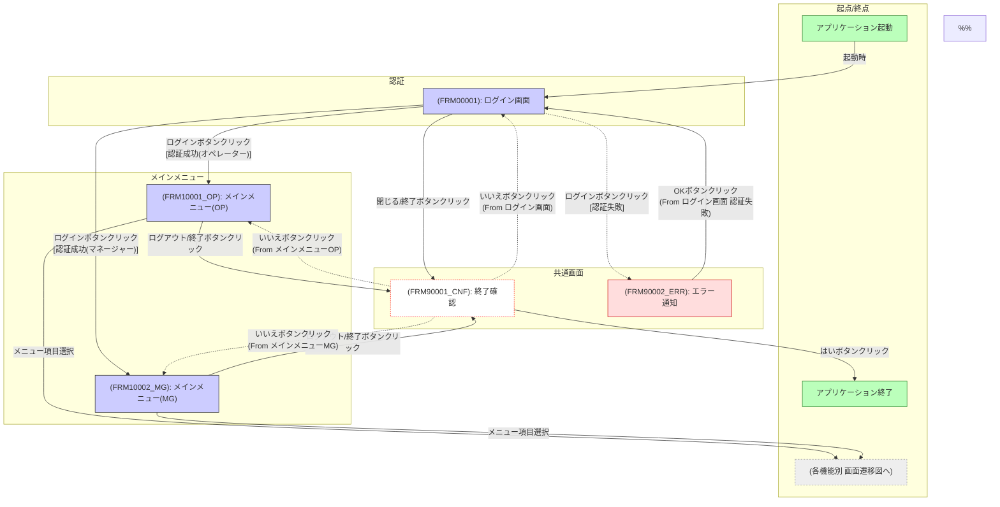
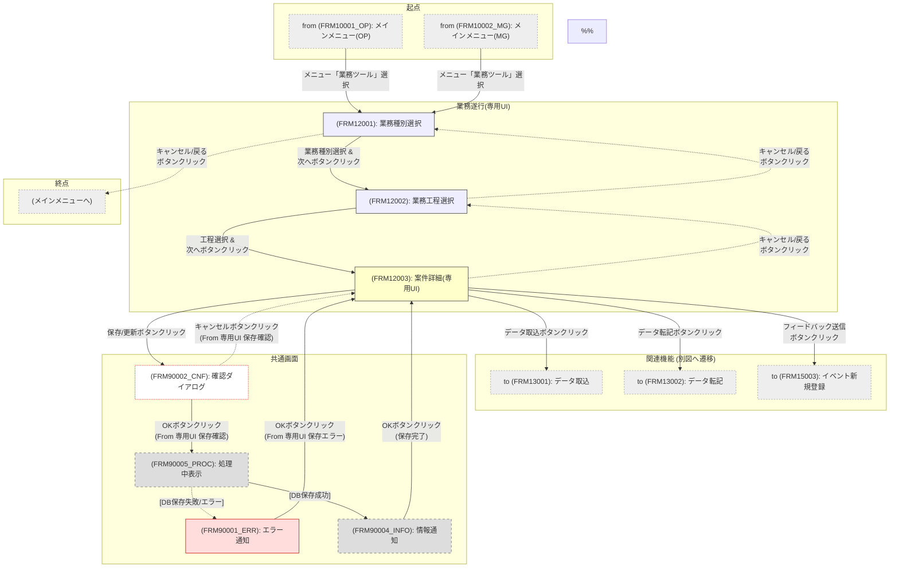
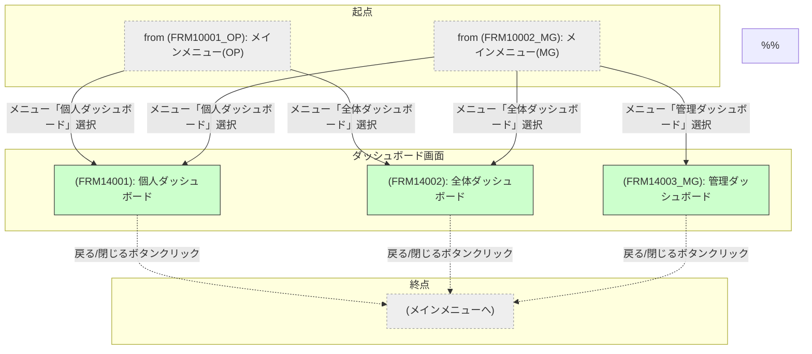
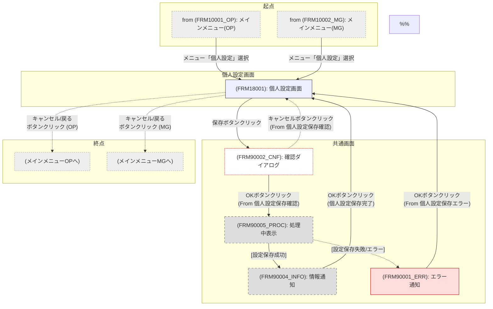

# 5. フロントエンド(FE)設計 (WIP)

_(今後の議論で定義)_

## 5.1. 画面一覧・画面遷移図 (WIP)

本セクションでは、本システムのユーザーインターフェースを構成する主要な画面とその役割、および画面間の主要な遷移フローを定義します。本書は、後続の画面レイアウト設計や詳細設計の基礎となります。

### 5.1.1. 画面一覧

## Category: 認証

| ScreenID   | ScreenName | Description                         | PrimaryTransitionSources (例)                                | PrimaryTransitionDestinations (例)                                                                                             | 詳細 (内部リンク)               |
| :--------- | :--------- | :---------------------------------- | :----------------------------------------------------------- | :----------------------------------------------------------------------------------------------------------------------------- | :------------------------------ |
| `FRM00001` | ログイン画面 | ユーザーID/パスワード等で認証を行う。 | - アプリケーション起動 - `FRM10001_OP` (ログアウト時) - `FRM10002_MG` (ログアウト時) | - `FRM10001_OP` (認証成功 - オペレーター) - `FRM10002_MG` (認証成功 - マネージャー) - **`FRM90001_ERR`** (認証失敗時) | [詳細](#画面詳細-frm00001---ログイン画面) |

---

### 画面詳細: FRM00001 - ログイン画面

#### 主要データソース

-   **`M_User`**: ユーザー認証に使用するテーブル。
    -   **参照フィールド:**
        -   `UserID` (PK, テキスト): 入力されたユーザーIDとの照合用。
        -   `PasswordHash` (テキスト): **【BE修正要】** パスワードハッシュ格納用フィールド（`basic-design-03`に追加が必要）。ソルトも別フィールド(`PasswordSalt`等)で持つことを推奨。
        -   `RoleID` (FK, 数値型): 認証成功後のロール判定用。`M_Role`テーブルと連携。
        -   `IsActive` (Yes/No型): アカウント有効性チェック用。
    -   **[BE連携]** **【basic-design-03-backend-design.md】** の`M_User`テーブル定義を参照。**`PasswordHash` および `PasswordSalt` フィールドを追加する**。

#### UI/ロジック分離方針

-   UIイベント（ログインボタンクリック）は、入力値取得と、後続の`AuthenticationService.Authenticate`メソッド（仮称）呼び出しに限定する。( **【design-principles-vba.md】4項** イベント駆動)
-   認証ロジック（ユーザー存在確認、アカウント有効性チェック、**パスワードハッシュ比較**）は、独立したクラスモジュール **`AuthenticationService`** （仮称）に実装する。UI（フォーム）はこのクラスに依存しない。( **【design-principles-vba.md】1項** SRP)
-   `AuthenticationService`は、`M_User`テーブルへのアクセスを行うデータアクセス層（例: `UserRepository`クラス、仮称）に依存する設計を推奨（**DI考慮**）。データアクセス層は、SQLインジェクション等のリスクを避けるため、パラメータ化クエリ等を使用する。( **【design-principles-vba.md】2項** DI)
-   `AuthenticationService.Authenticate`メソッドは、認証結果（成功/失敗/理由コード/ユーザー情報DTO）を明確な戻り値（例: 専用のResultクラスやDictionary）で呼び出し元（フォーム）に返すインターフェースとする。
    -   認証失敗時の理由コードとして、「認証情報不一致」「アカウント無効」などを定義し、メッセージ表示に利用する。
-   **[テスト容易性]** `AuthenticationService` およびデータアクセス層は、UIに依存せず単体テスト可能とする。特に認証ロジックは重要。( **【testing-guidelines-vba.md】4項** テスト容易性設計)
-   **パスワードポリシーチェック:** パスワード変更機能実装時には、指定されたポリシー（8文字以上、大文字小文字数字記号混合）を検証するロジックを`AuthenticationService`または関連モジュールに実装する（今回のログイン画面では直接使用しない）。
-   **パスワードハッシュ化:** パスワード設定・変更時には、指定されたアルゴリズム（推奨: **SHA-256/SHA-512**.NET連携が望ましい。詳細は後述）でハッシュ化およびソルト生成を行う。
-   (申し送り事項) `AuthenticationService`, `UserRepository`等の具体的なクラス設計、認証結果の返却方法、パスワードハッシュ化の実装詳細は「6. モジュール設計」および詳細設計で定義する。

#### 画面間データ連携方針

-   認証成功時、ログインしたユーザーの情報（**`UserID`**, **`RoleID`**, **`UserName`**）を後続のメインメニュー画面（`FRM10001_OP` または `FRM10002_MG`）へ連携する必要がある。
-   **`UserName`フィールドについて:**
    -   **説明:** `basic-design-03`の`M_User`テーブルに`UserName`フィールドが存在することは、ユーザーの氏名を表示する目的で一般的であり、直接的な問題はありません。認証後の画面（例: メインメニューのヘッダー）で「ようこそ、〇〇さん」のように表示するために`UserName`を`AppContext`に保持することは自然です。
    -   **考慮点:**
        -   **一意性:** `UserName`（氏名）は一意性が保証されないため、システム内部でユーザーを特定するキーとしては**必ず `UserID`（一意な識別子）を使用**してください。同姓同名のユーザーがいる場合でも、`UserID`で区別します。
        -   **変更:** 将来的に氏名変更があった場合、`M_User`テーブルの`UserName`を更新すれば表示名も追従しますが、もし`UserName`をキーのように使っている箇所があれば修正が必要です（`UserID`をキーとしていれば問題ありません）。
    -   **推奨:** **現状維持（`UserName`フィールドを利用）**とし、`AppContext`には **`UserID` と `UserName` の両方を格納**します。**アプリケーション全体でユーザー識別には`UserID`を使用し、表示目的でのみ`UserName`を使用する**ことを徹底します。
-   連携方法として、**グローバル変数の利用は原則禁止**とする。( **【coding-standards-vba.md】4項** 変数宣言)
-   アプリケーション全体でユーザーコンテキスト（ログイン情報、権限等）を保持・参照するための**専用クラス（例: `AppContext`クラス、シングルトンパターン等）の導入を強く推奨**する。ログイン成功時に`AppContext`クラスに認証結果を設定し、後続画面からはこのクラスのインスタンス経由でユーザー情報を参照する。
-   この方法は、テスト時に任意のユーザーコンテキストを設定することも容易にする。( **【testing-guidelines-vba.md】2項** Independent)
-   (申し送り事項) `AppContext`クラスの具体的な設計・実装方法は詳細設計で定義する。

#### アクセシビリティ配慮事項

-   **必須対応項目:**
    -   タブオーダー: ユーザーID入力欄 (`TabIndex=0`) → パスワード入力欄 (`TabIndex=1`) → ログインボタン (`TabIndex=2`) の順。( **【frontend-design-vba.md】Checklist A.2**)
    -   ラベル: ユーザーID、パスワードの各入力コントロールに対応するラベルを設定し、関連付ける。( **【frontend-design-vba.md】Checklist A.4**)
    -   アクセスキー: ユーザーIDラベルに `&U`, パスワードラベルに `&P`, ログインボタンに `&L` を設定。( **【frontend-design-vba.md】Checklist A.3**)
    -   コントラスト: **【persol-theme-guideline.md】3.1項, 5項** に基づき、文字色、背景色、ボタン色で十分なコントラスト比（WCAG 2.1 AAレベル）を確保する。( **【frontend-design-vba.md】Checklist A.6**)
    -   エラー通知: 認証失敗時は、**`FRM90001_ERR`** (共通エラー画面) へ遷移し、認証失敗理由コードに応じて以下のメッセージを表示する。( **【frontend-design-vba.md】Checklist A.10**)
        -   理由コード「認証情報不一致」の場合: **「ユーザーIDまたはパスワードが正しくありません。」**
        -   理由コード「アカウント無効」の場合: **「このアカウントは現在無効です。管理者に連絡してください。」**
        -   その他の認証エラーの場合: **「認証中にエラーが発生しました。時間をおいて再度試すか、管理者に連絡してください。」**
-   キーボードのみでの操作を可能にする。( **【frontend-design-vba.md】Checklist A.1**)
-   読みやすいフォント（例: Meiryo UI）と適切なサイズ（例: 10-12pt）を使用する。( **【frontend-design-vba.md】Checklist A.8**, **【persol-theme-guideline.md】3.2項, 5項**)
-   パスワード入力欄は入力文字が隠されるように（`InputMask` プロパティ = "Password"）。
-   **詳細は 【frontend-design-vba.md】付録A Checklist 参照。**
-   ( **【support-apps-requirements-statement.md】5.4項** 準拠)

#### その他特記事項

-   認証方式はユーザーID/パスワードとする。( **【support-apps-requirements-statement.md】5.1項** 任意機能)
-   パスワードは**ハッシュ化（＋ソルト）してDB(`M_User`)に保存**する。
    -   **推奨アルゴリズム:** **SHA-256** または **SHA-512**。可能であれば、**PBKDF2** (`System.Security.Cryptography.Rfc2898DeriveBytes`) の利用を推奨。
    -   **実装:** .NET Framework のクラスライブラリ (`System.Security.Cryptography`) をVBAから参照設定して利用するのが、セキュリティ強度と実装の手間の観点から推奨される。実行環境に.NET Framework が必要となる点に注意。これが困難な場合は、VBAで実装可能なライブラリの利用や、セキュリティレベルを考慮した代替策を検討（詳細は詳細設計）。
-   (確定) アカウントロックアウト機能は実装しない。
-   関連セキュリティ要件: **【support-apps-requirements-statement.md】5.1項**。
-   **[AI利用時の注意]** 認証ロジックやパスワードハッシュ処理をAIに生成させる場合は、セキュリティ上の脆弱性を含まないか、専門家による慎重なレビューが必須。( **【ai-developer-guide-vba.md】** 参照)

---

## Category: メインメニュー

| ScreenID      | ScreenName            | Description                                                                       | PrimaryTransitionSources (例) | PrimaryTransitionDestinations (例)                                                                                                                                                                                                                                                                                             | 詳細 (内部リンク)                     |
| :------------ | :-------------------- | :-------------------------------------------------------------------------------- | :---------------------------- | :------------------------------------------------------------------------------------------------------------------------------------------------------------------------------------------------------------------------------------------------------------------------------------------------------------------------- | :------------------------------------ |
| `FRM10001_OP` | メインメニュー(オペレーター) | オペレーター向け機能への起点となるメニュー画面。ロールに基づいて利用可能な機能が表示される。 | - `FRM00001` (ログイン成功時) | - `FRM11001` (案件一覧へ) - `FRM12001` (業務種別選択へ) - `FRM13001` (データ取込へ) - `FRM13002` (データ転記へ) - `FRM14001` (個人DBへ) - `FRM14002` (全体DBへ) - `FRM15004` (イベント履歴へ) - `FRM18001` (個人設定へ) - `FRM90002_CNF` (終了確認へ) - `FRM00001` (ログアウト時) | [詳細](#画面詳細-frm10001_op---メインメニューオペレーター) |
| `FRM10002_MG` | メインメニュー(マネージャー) | マネージャー向け機能への起点となるメニュー画面。ロールに基づいて利用可能な機能が表示される。   | - `FRM00001` (ログイン成功時) | - `FRM11001` - `FRM12001` - `FRM13001` - `FRM13002` - `FRM13003_MG` (データExportへ) - `FRM13004_MG` (バックアップへ) - `FRM14001` - `FRM14002` - `FRM14003_MG` (管理DBへ) - `FRM15001_MG` (イベント一覧へ) - `FRM15003` (イベント登録へ) - `FRM15004` - `FRM16001_MG` (マスタ一覧へ) - `FRM16003_MG` (ユーザー一覧へ) - `FRM16005_MG` (システム設定へ) - `FRM16007_MG` (ログ参照へ) - `FRM18001` - `FRM90002_CNF` - `FRM00001` (ログアウト時) | [詳細](#画面詳細-frm10002_mg---メインメニューマネージャー) |

---

### 画面詳細: FRM10001_OP - メインメニュー(オペレーター)

#### 主要データソース

-   **`AppContext`クラス（シングルトン実装）:** ログイン時に設定されたユーザー情報（**`UserID`**, **`RoleID`**, **`UserName`**）を参照。
    -   **[依存関係]** `AppContext`クラスの実装が必要（「6. モジュール設計」で定義）。
-   **`M_RoleMenuPermission`テーブル:** ログインユーザーの`RoleID`に基づいて、表示/有効化するメニュー項目とその表示名、遷移先`ScreenID`、表示順、グループ名などを取得する。
    -   **[BE連携]** このテーブルは **`basic-design-03-backend-design.md`** で定義される。`M_Role`テーブルと関連画面情報（`ScreenID`等）を紐付け、メニュー表示に必要な情報を含む。
-   **データソースなし（画面直接操作データ）:** ユーザーによるメニュー項目（ボタン）のクリックイベント。

#### UI/ロジック分離方針

-   **フォームイベント (`Form_Load`)**:
    -   `AppContext`からユーザー情報を取得し、画面ヘッダー等に表示（例: 「ようこそ、〇〇さん」）。
    -   `AppContext.RoleID` をキーとして、**`MenuViewController`クラス（仮称）** のメソッドを呼び出し、`M_RoleMenuPermission`テーブルから当ロールで利用可能なメニュー情報を取得する。(**【design-principles-vba.md】4項** イベント駆動)
    -   `MenuViewController`は、取得したメニュー情報（表示名、グループ名、表示順、ScreenID、権限）に基づき、フォーム上のメニュー項目（ボタン）を**カテゴリ別 (`MenuGroup`で指定されたグループ) に動的に生成または表示/有効状態を設定**する責務を持つ。(**【design-principles-vba.md】1項** SRP)
-   **メニュー項目クリックイベント (`cmdMenuXXX_Click`)**:
    -   イベントハンドラは、クリックされたボタンに対応する`ScreenID`を特定し、画面遷移を実行する処理（例: `DoCmd.OpenForm` 呼び出し）に限定する。遷移時のパラメータ渡しは後述の連携方針に従う。
-   **[テスト容易性]** `MenuViewController`クラスのロジック（`M_RoleMenuPermission`からのデータ取得・解釈、表示制御ロジック）は、UIフォームに依存せず単体テスト可能とする。(**【testing-guidelines-vba.md】4項** テスト容易性設計)
-   **(申し送り事項)** `MenuViewController`クラスの具体的な設計（動的なボタン生成/制御ロジック含む）は「6. モジュール設計」で定義する。

#### 画面間データ連携方針

-   **入力:** ログイン画面(`FRM00001`)から遷移後、**`AppContext`クラス**のインスタンス経由でログインユーザー情報（`UserID`, `RoleID`, `UserName`）を取得する。
-   **出力:**
    -   各機能画面へ遷移する際、必要に応じて`AppContext`から取得した情報や、遷移先の画面で必要な初期情報を、**フォームの`OpenArgs`プロパティ**または**`AppContext`クラス**経由で渡すことを基本方針とする。
    -   ログアウト/終了確認画面(`FRM90002_CNF`)へは、遷移元が本画面であることを示す情報を渡す。
-   **禁止事項:** グローバル変数の直接利用による画面間連携は行わない。( **【coding-standards-vba.md】4項** 変数宣言, **【testing-guidelines-vba.md】2項** Independent)
-   **(申し送り事項)** `OpenArgs`と`AppContext`の使い分け基準、`AppContext`クラスの具体的な設計は詳細設計で定義する。

#### アクセシビリティ配慮事項

-   **必須対応項目:**
    -   **タブオーダー:** メニュー項目（ボタン）間を、`M_RoleMenuPermission`で定義されたグループ順・表示順に従って論理的に移動できるように `TabIndex` を設定する。( **【frontend-design-vba.md】Checklist A.2**)
    -   **ラベルとアクセスキー:** 動的に生成または表示されるメニューボタンには、`M_RoleMenuPermission`の`MenuDisplayName`（例: `案件一覧(&L)`）に基づき `Caption` を設定し、アクセスキーを有効にする。( **【frontend-design-vba.md】Checklist A.3, A.4**)
    -   **キーボード操作:** 方向キーでのボタン間移動、`Enter`/`Space`での実行など、キーボードのみで全てのメニュー操作が可能であること。( **【frontend-design-vba.md】Checklist A.1**)
    -   **コントラスト:** ボタンの文字色、背景色とフォーム背景色のコントラスト比を十分に確保する。( **【frontend-design-vba.md】Checklist A.6**, **【persol-theme-guideline.md】3.1, 5**)
-   **推奨項目:**
    -   各メニューボタンに `ControlTipText` を設定。( **【frontend-design-vba.md】Checklist A.5**)
    -   `Frame`コントロール等を用いてメニューボタンを`MenuGroup`ごとに視覚的にグループ化し、適切な余白を設ける。( **【persol-theme-guideline.md】3.3**)
-   **要件定義参照:** **【support-apps-requirements-statement.md】5.4項** 準拠。
-   **詳細は 【frontend-design-vba.md】付録A Checklist 参照。**

#### その他特記事項

-   **画面レイアウト基本方針:** ユーザーエクスペリエンスを重視した**カスタムフォーム**として構築する。**カテゴリ分けされたボタン形式**（`M_RoleMenuPermission.MenuGroup`で定義されたグループごとにFrame等で区切り、その中に`DisplayOrder`順にボタンを配置）を採用する。**【persol-theme-guideline.md】** の原則（配色、タイポグラフィ、ボタンスタイル等）に従う。詳細は「5.2 主要画面レイアウト」(WIP)で定義。
-   **表示制御:** ログインユーザーのロールが「オペレーター」の場合にこの画面が表示され、`M_RoleMenuPermission`テーブルに基づきオペレーターが利用可能な機能メニューのみが表示・有効化される。
-   **拡張性:** `M_RoleMenuPermission`テーブルでメニュー項目を管理することにより、将来的なメニュー項目の追加・変更・削除に柔軟に対応可能とする。
-   **要件紐付け:** 本画面から遷移する各機能は、**【support-apps-requirements-statement.md】4項** の各機能要件に対応する。
-   **エラーハンドリング:** 画面ロード時等にエラーが発生した場合、共通エラー画面(`FRM90001_ERR`)へ遷移しエラー内容を表示した後、**ログイン画面(`FRM00001`)へ戻り、再ログインを促す。** 同時にエラーログを`T_Log`へ記録する。( **【design-principles-vba.md】3項** 準拠)
-   **[AI利用時の注意]** メニュー生成ロジックをAIに依頼する際は、`M_RoleMenuPermission`テーブル構造、動的なボタン生成・配置・アクセスキー設定、カテゴリ別グルーピング、標準ドキュメント準拠を指示すること。( **【ai-developer-guide-vba.md】** 参照)

---

### 画面詳細: FRM10002_MG - メインメニュー(マネージャー)

#### 主要データソース

-   **`AppContext`クラス（シングルトン実装）:** ログインユーザー情報（`UserID`, `RoleID`, `UserName`）を参照。
    -   **[依存関係]** `AppContext`クラスの実装が必要。
-   **`M_RoleMenuPermission`テーブル:** マネージャーロールの`RoleID`に基づいて、利用可能な全メニュー項目（オペレーター向け＋マネージャー向け）とその表示名、遷移先`ScreenID`、表示順、グループ名などを取得する。
    -   **[BE連携]** このテーブルは **`basic-design-03-backend-design.md`** で定義される。
-   **データソースなし（画面直接操作データ）:** ユーザーによるメニュー項目（ボタン）のクリックイベント。

#### UI/ロジック分離方針

-   **フォームイベント (`Form_Load`)**:
    -   `AppContext`からユーザー情報を取得し、画面ヘッダー等に表示。
    -   `AppContext.RoleID` をキーとして、**`MenuViewController`クラス（仮称）** のメソッドを呼び出し、`M_RoleMenuPermission`テーブルからマネージャーロールで利用可能な全メニュー情報を取得する。( **【design-principles-vba.md】4項** イベント駆動)
    -   `MenuViewController`は、取得したメニュー情報に基づき、フォーム上のメニューボタンを**カテゴリ別 (`MenuGroup`) に動的に生成または表示/有効状態を設定**する。( **【design-principles-vba.md】1項** SRP)
-   **メニュー項目クリックイベント (`cmdMenuXXX_Click`)**:
    -   クリックされたボタンに対応する`ScreenID`を特定し、画面遷移を実行する処理に限定する。
-   **[テスト容易性]** `MenuViewController`クラスのロジックは、UIフォームに依存せず単体テスト可能とする。( **【testing-guidelines-vba.md】4項** テスト容易性設計)
-   **(申し送り事項)** `MenuViewController`クラスは`FRM10001_OP`と共通化可能。具体的な設計は「6. モジュール設計」で定義する。

#### 画面間データ連携方針

-   **入力:** ログイン画面(`FRM00001`)から遷移後、**`AppContext`クラス**経由でログインユーザー情報を取得する。
-   **出力:**
    -   各機能画面へ遷移する際、必要に応じて`AppContext`から取得した情報や、遷移先の画面で必要な初期情報を、**フォームの`OpenArgs`プロパティ**または**`AppContext`クラス**経由で渡すことを基本方針とする。
    -   ログアウト/終了確認画面(`FRM90002_CNF`)へは、遷移元が本画面であることを示す情報を渡す。
-   **禁止事項:** グローバル変数の直接利用による画面間連携は行わない。( **【coding-standards-vba.md】4項** 変数宣言, **【testing-guidelines-vba.md】2項** Independent)
-   **(申し送り事項)** 連携方法の詳細は詳細設計で定義する。

#### アクセシビリティ配慮事項

-   **必須対応項目:**
    -   **タブオーダー:** メニュー項目（ボタン）間を、`M_RoleMenuPermission`で定義されたグループ順・表示順に従って論理的に移動できるように `TabIndex` を設定する。（例: 基本操作グループ → データ連携グループ → 管理機能グループ → その他グループ）( **【frontend-design-vba.md】Checklist A.2**)
    -   **ラベルとアクセスキー:** 動的に生成または表示されるメニューボタンには、`M_RoleMenuPermission`の`MenuDisplayName`に基づき `Caption` を設定し、アクセスキーを有効にする。( **【frontend-design-vba.md】Checklist A.3, A.4**)
    -   **キーボード操作:** キーボードのみで全てのメニュー操作が可能であること。( **【frontend-design-vba.md】Checklist A.1**)
    -   **コントラスト:** ボタン等のコントラスト比を十分に確保する。( **【frontend-design-vba.md】Checklist A.6**, **【persol-theme-guideline.md】3.1, 5**)
-   **推奨項目:**
    -   各メニューボタンに `ControlTipText` を設定。( **【frontend-design-vba.md】Checklist A.5**)
    -   `Frame`コントロール等を用いてメニューボタンを`MenuGroup`ごとに**明確に視覚的にグループ化**し、適切な余白を設ける。（例: 管理機能セクションを区別）( **【persol-theme-guideline.md】3.3**)
-   **要件定義参照:** **【support-apps-requirements-statement.md】5.4項** 準拠。
-   **詳細は 【frontend-design-vba.md】付録A Checklist 参照。**

#### その他特記事項

-   **画面レイアウト基本方針:** ユーザーエクスペリエンスを重視した**カスタムフォーム**として構築する。**カテゴリ分けされたボタン形式**を採用し、特に**管理機能セクションを視覚的に明確に区別**する。**【persol-theme-guideline.md】** の原則に従う。詳細は「5.2 主要画面レイアウト」(WIP)で定義。
-   **表示制御:** ログインユーザーのロールが「マネージャー」の場合にこの画面が表示され、`M_RoleMenuPermission`テーブルに基づきオペレーター向け機能**および**マネージャー向け管理機能に対応するメニュー項目が表示・有効化される。
-   **拡張性:** `M_RoleMenuPermission`テーブルでメニュー項目を管理することにより、将来的なメニュー項目の追加・変更・削除に柔軟に対応可能とする。
-   **要件紐付け:** オペレーター向け機能に加え、**【support-apps-requirements-statement.md】** の各種管理要件に対応する機能への導線となる。
-   **エラーハンドリング:** 画面ロード時等にエラーが発生した場合、共通エラー画面(`FRM90001_ERR`)へ遷移しエラー内容を表示した後、**ログイン画面(`FRM00001`)へ戻り、再ログインを促す。** 同時にエラーログを`T_Log`へ記録する。( **【design-principles-vba.md】3項** 準拠)
-   **[AI利用時の注意]** `MenuViewController`クラス等のロジック生成を依頼する際は、マネージャーロール固有のメニュー表示ロジックを含むこと、特にカテゴリ別グルーピングの必要性を明確に指示する。( **【ai-developer-guide-vba.md】** 参照)

---

## Category: 案件管理

| ScreenID      | ScreenName             | Description                                                                                                                                               | PrimaryTransitionSources (例)                                      | PrimaryTransitionDestinations (例)                                                                                                                                                           | 詳細 (内部リンク)                       |
| :------------ | :--------------------- | :-------------------------------------------------------------------------------------------------------------------------------------------------------- | :----------------------------------------------------------------- | :----------------------------------------------------------------------------------------------------------------------------------------------------------------------------------------- | :-------------------------------------- |
| `FRM11001`    | 案件一覧画面             | オペレーターまたはマネージャーが、担当案件（マネージャーは全案件も可）を検索条件で絞り込み一覧表示する。案件詳細への遷移、複数案件の一括更新・削除操作を行う。 | - `FRM10001_OP` - `FRM10002_MG` - `FRM11002` (詳細から戻る)      | - `FRM11002` (詳細へ) - `FRM11003_DLG` (一括更新へ) - `FRM90002_CNF` (一括削除確認へ) - `FRM10001_OP` (メニューへ戻る) - `FRM10002_MG` (メニューへ戻る)                      | [詳細](#画面詳細-frm11001---案件一覧画面)       |
| `FRM11002`    | 案件詳細画面(汎用UI)     | オペレーターまたはマネージャーが、選択された案件の共通情報、業務固有情報、作業履歴を参照・編集する。**書類照合を支援するレイアウトを考慮する。** | - `FRM11001` (一覧から)                                              | - `FRM11001` (一覧へ戻る) - `FRM90002_CNF` (保存/削除確認へ) - `FRM90001_ERR` (エラー発生時)                                                                                            | [詳細](#画面詳細-frm11002---案件詳細画面汎用ui) |
| `FRM11003_DLG`| 一括更新設定ダイアログ   | 案件一覧画面からの一括更新時に、**共通案件情報**の更新対象項目と更新値を設定するモーダルダイアログ。                                                     | - `FRM11001` (一覧から)                                              | - `FRM90002_CNF` (更新実行確認へ) - `FRM11001` (キャンセル時、一覧へ戻る)                                                                                                                | [詳細](#画面詳細-frm11003_dlg---一括更新設定ダイアログ) |

---

### 画面詳細: FRM11001 - 案件一覧画面

#### 主要データソース

-   **一覧表示用クエリ:** `Q_SearchCases_Admin` (**【basic-design-04】4.1.1項**)。案件情報(`T_CaseInfo`)と関連マスタ(`M_BusinessType`, `M_SystemStatus`, `M_OverallCaseStatus`, `M_User`)を結合。
-   **操作対象特定:** ユーザーが一覧（連続フォームまたはデータシートビュー）で選択したレコードの `CaseUUID`。

#### UI/ロジック分離方針

-   **UIイベント (フォームロード, 検索ボタンクリック等):**
    -   検索条件の取得・設定。
    -   一覧表示更新処理（後述の専用ロジック呼び出し）のトリガー。
    -   一括操作ボタンクリック時の選択レコード特定と後続画面呼び出し。
    -   UI制御は最小限に留める。( **【design-principles-vba.md】4項** イベント駆動)
-   **一覧表示更新ロジック:**
    -   独立したプロシージャ（例: `Private Sub UpdateListView()`）として実装。
    -   検索条件に基づき、フォームのレコードソース（`Q_SearchCases_Admin`）を動的にフィルタリングまたは再構築する。
    -   **【設計原則とパターン (VBA版)】1項** SRP に基づき、複雑な条件生成ロジックは別モジュール化も検討。
-   **一括更新/削除ロジック:**
    -   選択された案件の`CaseUUID`リストを取得する処理。
    -   実際の一括更新/削除処理は**専用モジュール（例: `BulkOperationService`クラス（仮称））** に分離し、フォームからは処理依頼のみを行う。
    -   **(申し送り事項)** `BulkOperationService` の具体的な設計は「6. モジュール設計」でFIXする。
-   **[テスト容易性]** レコードソース構築ロジック、一括処理の対象特定ロジックは、UIに依存せずテスト可能とする。( **【testing-guidelines-vba.md】4項** テスト容易性設計)

#### 画面間データ連携方針

-   **入力:** メインメニュー(`FRM10001_OP`, `FRM10002_MG`)から遷移時、**`AppContext`クラス（仮称）** 経由でユーザー情報（ロール等）を参照し、UI制御（例: マネージャーの場合のみ全件表示可能など）を行う。 **(申し送り事項)** `AppContext`クラスの具体的な設計は詳細設計で定義する。
-   **出力:**
    -   案件詳細画面(`FRM11002`)へ遷移時: 選択された単一案件の **`CaseUUID` をフォームの `OpenArgs` プロパティ**で渡す。
    -   一括更新設定ダイアログ(`FRM11003_DLG`)へ遷移時: 選択された**複数の `CaseUUID` リスト**を渡す。文字列長制限を考慮し、**専用のコンテキスト管理クラス（例: `AppContext`）を利用する方針を推奨する。具体的な実装方法は詳細設計で決定する。** (`TempVars`の利用は次善策とする。)
    -   確認ダイアログ(`FRM90002_CNF`)へ遷移する場合（一括削除時）: 確認メッセージと処理に必要な情報（`CaseUUID`リスト等）を`OpenArgs`等で渡す。
-   **禁止事項:** グローバル変数利用は禁止。( **【coding-standards-vba.md】4項** 変数宣言, **【testing-guidelines-vba.md】2項** Independent)

#### アクセシビリティ配慮事項

-   **必須対応項目:**
    -   タブオーダー: 論理的な順序（検索条件入力 → 検索/クリアボタン → 一覧表示コントロール → 一括操作ボタン → 閉じるボタン）に設定。( **【frontend-design-vba.md】Checklist A.2**)
    -   ラベル: 全ての検索条件入力コントロール、主要ボタンに、目的が明確なラベル/キャプションを設定し関連付ける。( **【frontend-design-vba.md】Checklist A.4**)
    -   アクセスキー: 主要な検索条件フィールド、ボタン（検索 `&S`, クリア `&R`, 詳細 `&D`, 更新 `&U`, 削除 `&L`, 閉じる `&C` 等）に設定。( **【frontend-design-vba.md】Checklist A.3**)
    -   キーボード操作: 一覧表示コントロール（データシートビュー or 連続フォーム）において、矢印キーでの行移動、`Shift`+矢印キーでの複数行選択、`Enter`キーでの詳細画面遷移（またはダブルクリック）など、キーボードのみでの操作を完結できるようにする。( **【frontend-design-vba.md】Checklist A.1**)
    -   コントラスト: **【persol-theme-guideline.md】3.1項, 5項** に基づき、十分なコントラスト比を確保する。( **【frontend-design-vba.md】Checklist A.6**)
-   **推奨項目:**
    -   検索条件フィールドに `ControlTipText` で入力形式や内容の補足説明を設定。( **【frontend-design-vba.md】Checklist A.5**)
    -   スクリーンリーダーでの一覧読み上げに配慮し、標準コントロール（データシートビュー等）を優先的に使用する。( **【frontend-design-vba.md】Checklist A.13** ベストエフォート)
-   **要件定義参照:** **【support-apps-requirements-statement.md】5.4項** 準拠。
-   **詳細は 【frontend-design-vba.md】付録A Checklist 参照。**

#### その他特記事項

-   **要件紐付け:** **【support-apps-requirements-statement.md】4.2項**（顧客情報参照・絞り込み）を主に担当。一括更新・削除機能も本画面が起点となる。
-   **パフォーマンス:** 大量データ表示時のフォーム読み込み速度、検索実行速度が**【support-apps-requirements-statement.md】5.2項**の要件を満たすよう、`Q_SearchCases_Admin`クエリの最適化（インデックス活用）およびVBA側のデータロード方式（必要なデータのみ読み込む等）を考慮する。( **【design-principles-vba.md】5項** 長時間処理考慮)
-   **UIレイアウト:** 検索条件エリア、一覧表示エリア、ボタンエリアを明確に区別し、**【persol-theme-guideline.md】** のレイアウト原則（グループ化、余白等）に従う。詳細は「5.2 主要画面レイアウト」(WIP)で定義。
-   **[AI利用時の注意]** レコードソース構築やフィルタリングのロジック生成を依頼する際は、パフォーマンスとセキュリティ（SQLインジェクション対策）を考慮したパラメータ化クエリの使用を指示すること。( **【ai-developer-guide-vba.md】** 参照)

---

### 画面詳細: FRM11002 - 案件詳細画面(汎用UI)

#### 主要データソース

-   **表示用クエリ:** `Q_GetCaseDetails_Worker` (**【basic-design-04】4.1.2項**)。`T_CaseInfo`, `T_CaseDetail_...` (詳細設計で定義), 関連マスタを結合。フォームのレコードソースとして使用。
-   **作業履歴表示用クエリ:** `Q_GetWorkHistory` (**【basic-design-04】4.1.3項**)。`T_WorkHistory`と関連マスタを結合。サブフォームのレコードソースとして使用。
-   **更新対象テーブル:** `T_CaseInfo`, `T_CaseDetail_...` (詳細設計で定義), `T_WorkHistory`。データアクセスは後述のリポジトリパターン経由を推奨。

#### UI/ロジック分離方針

-   **最重要方針:** UIイベントプロシージャ（`AfterUpdate`, `BeforeUpdate`, 保存ボタンクリック等）は、UIからの入力値取得、基本的な形式チェック（例: `IsDate`）、および後続のビジネスロジック/データアクセス層への処理依頼に限定する。( **【design-principles-vba.md】4項** イベント駆動)
-   **データ検証ロジック:**
    -   必須チェック、文字数制限、データ型チェック、日付の前後関係チェック、業務ルールに基づく項目間相関チェック等の詳細なバリデーションロジックは、**独立した`ValidationModule`（標準モジュール、仮称）または`CaseValidator`クラス（仮称）** に実装する。
    -   フォームの`BeforeUpdate`イベント等からこれらの検証ロジックを呼び出し、エラーがあれば更新をキャンセルし、ユーザーにフィードバックする。( **【design-principles-vba.md】1項** SRP)
-   **データ永続化ロジック:**
    -   データの保存（新規作成/更新）・削除処理は、**`CaseRepository`クラス（仮称）等のデータアクセス層**に分離する。フォームからは直接DAO/ADOを使用しない。
    -   `CaseRepository`は、関連テーブル（`T_CaseInfo`, `T_CaseDetail_...`, `T_WorkHistory`）への書き込みを責務とし、必要に応じてトランザクション管理を行う。( **【design-principles-vba.md】1項, 2項 DI**)
    -   **(申し送り事項)** `ValidationModule`, `CaseValidator`, `CaseRepository` の具体的な設計は「6. モジュール設計」でFIXする。
-   **[テスト容易性]** データ検証ロジック、データ永続化ロジックは、UIフォームとは独立して**単体テスト可能**とする。( **【testing-guidelines-vba.md】4項** テスト容易性設計)

#### 画面間データ連携方針

-   **入力:**
    -   案件一覧画面(`FRM11001`)から遷移時に、対象案件の **`CaseUUID` をフォームの `OpenArgs` プロパティ**経由で受け取る。
    -   フォームロード時に`OpenArgs`から`CaseUUID`を取得し、それを使って`CaseRepository`経由でデータを取得・表示する。
    -   **`AppContext`クラス（仮称）** からログインユーザー情報（ロール等）を参照し、権限に応じたUI制御（例: 読み取り専用/編集可能の切り替え）を行う。 **(申し送り事項)** `AppContext`クラスの具体的な設計は詳細設計で定義する。
-   **出力:**
    -   保存/削除等の操作後に確認ダイアログ(`FRM90002_CNF`)へ遷移する場合、確認メッセージと関連情報（`CaseUUID`等）を`OpenArgs`で渡す。
    -   エラー発生時にエラー通知画面(`FRM90001_ERR`)へ遷移する場合、エラー情報を`OpenArgs`等で渡す。
    -   「戻る」ボタンクリックで案件一覧画面(`FRM11001`)へ戻る。
-   **禁止事項:** グローバル変数利用は禁止。( **【coding-standards-vba.md】4項** 変数宣言, **【testing-guidelines-vba.md】2項** Independent)

#### アクセシビリティ配慮事項

-   **必須対応項目:**
    -   タブオーダー: 参照書類と照合しやすいように、画面上部の共通情報から主要な入力/編集エリア、作業履歴サブフォーム、ボタン類へと、論理的で自然な順序に設定する。( **【frontend-design-vba.md】Checklist A.2**)
    -   ラベル: 全ての入力/表示コントロール（サブフォーム含む）に、目的が明確なラベルを関連付ける。( **【frontend-design-vba.md】Checklist A.4**)
    -   アクセスキー: 主要な入力フィールド、ボタン（保存 `&S`, キャンセル `&C`, 戻る `&B` 等）に設定。( **【frontend-design-vba.md】Checklist A.3**)
    -   キーボード操作: 全てのコントロールへのフォーカス移動、値の入力・選択、サブフォーム内の操作、ボタン実行がキーボードのみで可能であること。( **【frontend-design-vba.md】Checklist A.1**)
    -   コントラスト: **【persol-theme-guideline.md】3.1項, 5項** に基づき、十分なコントラスト比を確保する。読み取り専用フィールドと編集可能フィールドは視覚的に（背景色、枠線等で）区別できるようにする。( **【frontend-design-vba.md】Checklist A.6**)
    -   エラー通知: 入力バリデーションエラー発生時、エラー箇所を明確に示し（例: 背景色変更、アイコン表示）、`FRM90001_ERR`またはメッセージボックスで具体的なエラー内容と修正方法を通知する。( **【frontend-design-vba.md】Checklist A.10**)
-   **書類照合支援UIへの配慮:**
    -   **レイアウト:** **【support-apps-requirements-statement.md】4.2項**に基づき、参照書類と照合しやすいよう、項目グルーピング、表示順序を考慮する。( **【persol-theme-guideline.md】3.3**)
    -   **キーボード操作と読み上げ:** 上記レイアウト配慮に加え、キーボードでの操作性、スクリーンリーダーでの読み上げにも配慮する。**具体的な機能（画面分割、ハイライト、マーキング等）は詳細設計で検討・定義する。** ( **【frontend-design-vba.md】Checklist A.1, A.13**)
-   **推奨項目:**
    -   入力規則や項目の補足説明を `ControlTipText` で提供。( **【frontend-design-vba.md】Checklist A.5**)
-   **要件定義参照:** **【support-apps-requirements-statement.md】5.4項** 準拠。
-   **詳細は 【frontend-design-vba.md】付録A Checklist 参照。**

#### その他特記事項

-   **要件紐付け:** **【support-apps-requirements-statement.md】4.2項**（作業情報の記録、入力バリデーション、書類照合支援）、**4.3項**（リレーション管理）に対応。
-   **UIレイアウト:** 案件共通情報エリア、業務固有情報エリア（`T_CaseDetail_...`用、詳細は詳細設計）、作業履歴エリア（サブフォーム）、操作ボタンエリアなどを明確に区分けする。**【persol-theme-guideline.md】** の原則に従う。詳細は「5.2 主要画面レイアウト」(WIP)で定義。
-   **業務固有情報の扱い:** 業務種別によって`T_CaseDetail_...`が存在しない、または内容が異なる場合があるため、フォーム上で関連セクションの表示/非表示や読み込み処理を動的に制御する必要がある（詳細は詳細設計）。
-   **作業履歴:** `T_WorkHistory`をサブフォームで表示。件数が多い場合のパフォーマンス（遅延読み込み等）を考慮する。( **【design-principles-vba.md】5項**)
-   **[AI利用時の注意]** バリデーションロジックやDBアクセスロジックの生成を依頼する際は、UI分離とテスト容易性を考慮したクラス/モジュール構成を前提とし、エラーハンドリング規約(**【design-principles-vba.md】3項**)の遵守を指示すること。( **【ai-developer-guide-vba.md】** 参照)

---

### 画面詳細: FRM11003_DLG - 一括更新設定ダイアログ

#### 主要データソース

-   **更新可能項目リスト:** `T_CaseInfo` のうち、一括更新の対象となりうる**共通項目**を定義（コード内でリスト管理、または専用マスタテーブル`M_BulkUpdateField`等を作成して管理）。**どの項目を対象とするかは詳細設計で定義する。**
-   **更新値の選択肢:** 更新対象項目に応じて、関連マスタ（例: `M_SystemStatus`, `M_User`）を`ComboBox`のレコードソースとして使用。

#### UI/ロジック分離方針

-   **UIイベント (項目選択, 値入力, OK/キャンセルボタンクリック):**
    -   ユーザーによる更新対象項目と更新値の設定を受け付ける。
    -   OKボタンクリック時に、設定内容と対象`CaseUUID`リストを取得し、確認画面(`FRM90002_CNF`)へ処理を依頼する。
    -   UI制御と後続処理へのデータ渡しが主。( **【design-principles-vba.md】4項** イベント駆動)
-   **一括更新実行ロジック:** 実際の一括更新処理は、確認画面(`FRM90002_CNF`)を経由した後、**専用のビジネスロジックモジュール（例: `BulkOperationService`クラス（仮称））** で実行される想定。このダイアログ自体には実行ロジックを持たない。( **【design-principles-vba.md】1項** SRP)
-   **(申し送り事項)** 更新可能な項目リストの管理方法、`BulkOperationService` の具体的な設計は「6. モジュール設計」でFIXする。

#### 画面間データ連携方針

-   **入力:**
    -   案件一覧画面(`FRM11001`)から、一括更新対象の**複数の `CaseUUID` リスト**を、**専用のコンテキスト管理クラス（例: `AppContext`）を利用する方針を推奨する。具体的な実装方法は詳細設計で決定する。** (`TempVars`の利用は次善策とする。)
-   **出力:**
    -   OKボタンクリック時、設定された更新内容（対象項目、更新値）と対象`CaseUUID`リストを、確認画面(`FRM90002_CNF`)へ`OpenArgs`等で渡す。
    -   キャンセルボタンクリック時は、結果を返さずにダイアログを閉じ、案件一覧画面(`FRM11001`)に戻る。
-   **禁止事項:** グローバル変数利用は禁止。( **【coding-standards-vba.md】4項** 変数宣言, **【testing-guidelines-vba.md】2項** Independent)

#### アクセシビリティ配慮事項

-   **必須対応項目:**
    -   タブオーダー: 更新項目選択（例: コンボボックス）→ 更新値入力/選択 → OKボタン → キャンセルボタン の順。( **【frontend-design-vba.md】Checklist A.2**)
    -   ラベル: 全ての選択/入力コントロール、ボタンに明確なラベル/キャプションを設定し関連付ける。( **【frontend-design-vba.md】Checklist A.4**)
    -   アクセスキー: 更新項目(`&F`), 更新値(`&V`), OK(`&O`), キャンセル(`&C`)等に設定。( **【frontend-design-vba.md】Checklist A.3**)
    -   キーボード操作: 全ての選択・入力、ボタン実行がキーボードのみで可能であること。( **【frontend-design-vba.md】Checklist A.1**)
    -   コントラスト: **【persol-theme-guideline.md】3.1項, 5項** に基づき、十分なコントラスト比を確保する。( **【frontend-design-vba.md】Checklist A.6**)
-   **推奨項目:**
    -   `ControlTipText`で設定内容や更新時の注意点を補足。( **【frontend-design-vba.md】Checklist A.5**)
-   **要件定義参照:** **【support-apps-requirements-statement.md】5.4項** 準拠。
-   **詳細は 【frontend-design-vba.md】付録A Checklist 参照。**

#### その他特記事項

-   **モーダルダイアログ**として実装し、ユーザーが設定完了またはキャンセルするまで他の操作をブロックする。
-   **更新可能な項目:** 現時点では、`T_CaseInfo`の共通項目（例: システムステータス、主担当者など）のみを対象とする方針。**どの項目を一括更新可能とするかは詳細設計で定義する。**
-   **`T_CaseDetail_...`（業務固有項目）の一括更新は、実装の複雑性から本画面のスコープ外とする**（必要であれば運用での代替、または個別機能として別途検討）。
-   **入力値の検証:** 更新値入力コントロールでは、対象項目のデータ型に応じた基本的な入力チェック（例: 日付形式、数値形式）を行う。詳細なビジネスルール検証は`BulkOperationService`で行う。

---

## Category: 業務遂行(専用)

| ScreenID   | ScreenName           | Description                                                                                                                                                                | PrimaryTransitionSources (例)                                            | PrimaryTransitionDestinations (例)                                                                                                                                                                                                                                                                                            | 詳細 (内部リンク)                             |
| :--------- | :------------------- | :------------------------------------------------------------------------------------------------------------------------------------------------------------------------- | :----------------------------------------------------------------------- | :------------------------------------------------------------------------------------------------------------------------------------------------------------------------------------------------------------------------------------------------------------------------------------------------------------------------------------------ | :-------------------------------------------- |
| `FRM12001` | 業務種別選択画面       | オペレーターまたはマネージャーが、**自身のスキル・役割で対応可能な範囲**で、これから作業を行う案件の業務種別を選択する。`FRM12003`（専用UI）への導線。                                        | - `FRM10001_OP` - `FRM10002_MG` - `FRM12002` (工程選択から戻る)      | - `FRM12002` (工程選択へ) - `FRM10001_OP` (キャンセル時) - `FRM10002_MG` (キャンセル時)                                                                                                                                                                                                                                               | [詳細](#画面詳細-frm12001---業務種別選択画面)       |
| `FRM12002` | 業務工程選択画面       | オペレーターまたはマネージャーが、選択した業務種別に対応し、かつ**自身のスキル・役割で対応可能な範囲**で、作業工程（現場での呼称）を選択する。`FRM12003`（専用UI）への導線。                           | - `FRM12001` (業務種別選択から) - `FRM12003` (専用UIから戻る)           | - `FRM12003` (専用UIへ) - `FRM12001` (戻る/キャンセル時)                                                                                                                                                                                                                                                                                   | [詳細](#画面詳細-frm12002---業務工程選択画面)       |
| `FRM12003` | 案件詳細画面(専用UI) | オペレーターまたはマネージャーが、選択された業務種別・工程に最適化されたUIで、**手元の書類のキー情報を基にステージングDB上の案件データを検索・表示**し、入力・編集・確認作業を**サイクル的に**行う。 | - `FRM12002` (工程選択から) - **自身** (作業確定⇒クリア後の次作業) | - `FRM12002` (戻る/キャンセル時) - `FRM13001` (データ取込へ) - `FRM13002` (データ転記へ) - `FRM15003` (フィードバック送信へ) - `FRM90002_CNF` (作業確定確認へ) - `FRM90001_ERR` (検索/保存/イレギュラーエラー発生時) - **(TBD)** 検索ヒットなし/不一致通知画面                                                              | [詳細](#画面詳細-frm12003---案件詳細画面専用ui) |

---

### 画面詳細: FRM12001 - 業務種別選択画面

#### 主要データソース

-   **表示用クエリ:** `Q_GetAllowedBusinessTypesForUser` (仮称) - ログインユーザー(`AppContext.UserID`)が**`M_UserTaskAbility`で対応可能と定義された**業務種別（`M_BusinessType`）のうち、有効な(`IsActive=True`)ものを取得するクエリ。（**【basic-design-04】** に追加定義が必要）
    -   **関連テーブル:** `M_BusinessType`, `M_ProcessDefinition`, `M_UserTaskAbility`
-   **選択結果:** ユーザーが選択した`BusinessTypeID`。

#### UI/ロジック分離方針

-   **フォームロード時:**
    -   ログインユーザーの`UserID`を`AppContext`から取得。
    -   `UserService`クラス（仮称）または関連クエリを用いて、ユーザーが選択可能な業務種別リスト(`Q_GetAllowedBusinessTypesForUser`)を取得。
    -   取得したリストをフォーム上の選択コントロール（リストボックス推奨）に表示。
    -   ユーザーのスキル/役割に応じて選択肢がフィルタリングされるロジックは**`UserService`クラス等**に分離する。( **【design-principles-vba.md】1項** SRP)
-   **「次へ」ボタンクリックイベント:**
    -   選択コントロールから選択された`BusinessTypeID`を取得。
    -   必須選択チェック。
    -   次画面(`FRM12002`)を、取得した`BusinessTypeID`を渡して開く処理を呼び出す。( **【design-principles-vba.md】4項** イベント駆動)
-   **[テスト容易性]** ユーザーの選択可能リスト取得ロジックはUI非依存でテスト可能とする。( **【testing-guidelines-vba.md】4項** テスト容易性設計)
-   **(申し送り事項)** `Q_GetAllowedBusinessTypesForUser`クエリの具体的なSQLと、選択肢フィルタリングロジックを実装する`UserService`クラス（仮称）の設計は「6. モジュール設計」および詳細設計でFIXする。

#### 画面間データ連携方針

-   **入力:**
    -   メインメニュー(`FRM10001_OP`, `FRM10002_MG`)から遷移。
    -   **`AppContext`クラス（仮称）** からログインユーザー情報（`UserID`）を取得し、表示する業務種別リストのフィルタリングに使用。
-   **出力:**
    -   次画面(`FRM12002`)へ、選択された **`BusinessTypeID` をフォームの `OpenArgs` プロパティ等**で渡す。
-   **禁止事項:** グローバル変数利用は禁止。( **【coding-standards-vba.md】4項** 変数宣言, **【testing-guidelines-vba.md】2項** Independent)

#### アクセシビリティ配慮事項

-   **必須対応項目:**
    -   選択コントロール（リストボックス推奨）: キーボード（矢印キー、Enter/Space）での選択、項目読み上げに対応。( **【frontend-design-vba.md】Checklist A.1, A.13**)
    -   タブオーダー: 選択コントロール → 次へ/キャンセルボタン の順。( **【frontend-design-vba.md】Checklist A.2**)
    -   ラベル: 選択コントロール、ボタンに明確なラベル/キャプションを設定。( **【frontend-design-vba.md】Checklist A.4**)
    -   アクセスキー: 次へ(`&N`), キャンセル(`&C`)ボタン等に設定。( **【frontend-design-vba.md】Checklist A.3**)
    -   コントラスト: **【persol-theme-guideline.md】3.1項, 5項** に準拠。( **【frontend-design-vba.md】Checklist A.6**)
-   **詳細は 【frontend-design-vba.md】付録A Checklist 参照。**
-   ( **【support-apps-requirements-statement.md】5.4項** 準拠)

#### その他特記事項

-   **ユーザーに応じた選択肢制限:** ログインユーザーのスキル/役割(`M_UserTaskAbility`参照)に応じて選択可能な業務種別を制限する機能が**必須**。
-   リストには業務種別名(`BusinessTypeName`)を表示。

---

### 画面詳細: FRM12002 - 業務工程選択画面

#### 主要データソース

-   **表示用クエリ:** `Q_GetAllowedProcessesForUser` (仮称) - 前画面から渡された`BusinessTypeID`に紐づき、かつログインユーザー(`AppContext.UserID`)が**`M_UserTaskAbility`で対応可能と定義された**工程定義（`M_ProcessDefinition`）のうち、有効な(`IsActive=True`)ものを取得するクエリ。（**【basic-design-04】** に追加定義が必要）
    -   **関連テーブル:** `M_ProcessDefinition`, `M_UserTaskAbility`
-   **選択結果:** ユーザーが選択した`ProcessDefinitionID`。

#### UI/ロジック分離方針

-   **フォームロード時（または`OpenArgs`受け取り後）:**
    -   前画面から渡された`BusinessTypeID`と、`AppContext`から取得した`UserID`を使用。
    -   `UserService`クラス（仮称）または関連クエリを用いて、ユーザーが選択可能な工程リスト(`Q_GetAllowedProcessesForUser`)を取得。
    -   取得したリスト（**現場で定着している具体的な工程名称 `ProcessName`** を表示）をフォーム上の選択コントロール（リストボックス推奨）に表示。
    -   ユーザーのスキル/役割に応じた選択肢フィルタリングロジックは**`UserService`クラス等**に分離する。( **【design-principles-vba.md】1項** SRP)
-   **「次へ」ボタンクリックイベント:**
    -   選択コントロールから選択された`ProcessDefinitionID`を取得。
    -   必須選択チェック。
    -   次画面(`FRM12003`)を、取得した`ProcessDefinitionID`と前画面から引き継いだ`BusinessTypeID`を渡して開く処理を呼び出す。( **【design-principles-vba.md】4項** イベント駆動)
-   **[テスト容易性]** ユーザーの選択可能リスト取得ロジックはUI非依存でテスト可能とする。( **【testing-guidelines-vba.md】4項** テスト容易性設計)
-   **(申し送り事項)** `Q_GetAllowedProcessesForUser`クエリと`UserService`クラス（仮称）の設計は「6. モジュール設計」および詳細設計でFIXする。

#### 画面間データ連携方針

-   **入力:**
    -   前画面(`FRM12001`)から **`BusinessTypeID` を `OpenArgs` プロパティ等**で受け取る。
    -   **`AppContext`クラス（仮称）** からログインユーザー情報（`UserID`）を取得し、表示する工程リストのフィルタリングに使用。
-   **出力:**
    -   次画面(`FRM12003`)へ、選択された **`ProcessDefinitionID` と `BusinessTypeID` を `OpenArgs` プロパティ等**で渡す。
-   **禁止事項:** グローバル変数利用は禁止。( **【coding-standards-vba.md】4項** 変数宣言, **【testing-guidelines-vba.md】2項** Independent)

#### アクセシビリティ配慮事項

-   **必須対応項目:**
    -   選択コントロール（リストボックス推奨）: キーボード操作、項目読み上げに対応。( **【frontend-design-vba.md】Checklist A.1, A.13**)
    -   タブオーダー: 選択コントロール → 次へ/戻る/キャンセルボタン の順。( **【frontend-design-vba.md】Checklist A.2**)
    -   ラベル: 選択コントロール、ボタンに明確なラベル/キャプションを設定。( **【frontend-design-vba.md】Checklist A.4**)
    -   アクセスキー: 次へ(`&N`), 戻る(`&B`)等に設定。( **【frontend-design-vba.md】Checklist A.3**)
    -   コントラスト: **【persol-theme-guideline.md】3.1項, 5項** に準拠。( **【frontend-design-vba.md】Checklist A.6**)
-   **詳細は 【frontend-design-vba.md】付録A Checklist 参照。**
-   ( **【support-apps-requirements-statement.md】5.4項** 準拠)

#### その他特記事項

-   **ユーザーに応じた選択肢制限:** ログインユーザーのスキル/役割(`M_UserTaskAbility`参照)に応じて選択可能な工程を制限する機能が**必須**。
-   リストには現場で使われている具体的な工程名(`ProcessName`)を表示。

---

### 画面詳細: FRM12003 - 案件詳細画面(専用UI)

#### 主要データソース

-   **案件検索用キー情報:** ユーザーが画面上の検索バーに入力する情報（例: 社員番号、健保番号など、業務種別により異なる）。
-   **検索・表示・編集対象:** ステージングDB内の案件関連データ。
    -   `T_CaseInfo`: 案件基本情報。
    -   `T_CaseDetail_...`: 業務種別固有の詳細情報（**詳細設計で定義**）。
    -   関連マスタ: `M_User` (担当者表示用), `M_SystemStatus`等。
    -   検索クエリ: `Q_SearchCaseForDedicatedUI` (仮称) - ユーザー入力キーで`T_CaseInfo`や`T_CaseDetail_...`を検索するクエリ。（**【basic-design-04】** に追加定義が必要）
-   **作業履歴表示:** `Q_GetWorkHistory` (**【basic-design-04】4.1.3項**) - 表示中の案件(`CaseUUID`)に紐づく履歴（サブフォーム等で表示）。
-   **更新対象テーブル:** `T_CaseInfo`, `T_CaseDetail_...`, `T_WorkHistory` （データアクセス層経由で更新）。

#### UI/ロジック分離方針

-   **最重要方針:** UIイベント（検索ボタンクリック、テキストボックス変更、確定ボタンクリック等）は、入力取得/設定、後続ロジック呼び出しに限定。( **【design-principles-vba.md】4項** イベント駆動)
-   **UI動的制御ロジック:**
    -   フォームロード時および検索実行後に、`OpenArgs`等で受け取った`BusinessTypeID`と`ProcessDefinitionID`に基づき、表示するコントロール、レイアウト、有効/無効状態を動的に調整する。この制御ロジックは**専用の`DedicatedUIController`クラス（仮称）等**に分離する。( **【design-principles-vba.md】1項** SRP)
-   **案件検索ロジック:**
    -   検索バーでの入力値を取得し、**`CaseSearchService`クラス（仮称）** を呼び出す。
    -   `CaseSearchService`は、`Q_SearchCaseForDedicatedUI`クエリ等を用いてステージングDBを検索し、結果（該当案件データ or ヒットなし or 複数ヒット等）を返す。検索キー項目は業務種別により異なるため、動的な対応が必要。
-   **データ表示/入力ロジック:**
    -   検索結果（案件データ）をフォーム上のコントロールに適切にバインド/表示する。
    -   ユーザーによる入力値を受け付け、基本的な形式チェックを行う。
-   **データ検証ロジック:**
    -   「確定」ボタンクリック時などに、入力されたデータ全体の整合性、業務ルールに基づくチェックを行う。このロジックは**独立した`ValidationModule`または`CaseValidator`クラス等**に実装し、`DedicatedUIController`から呼び出す。( **【design-principles-vba.md】1項** SRP)
-   **データ永続化ロジック（確定処理）:**
    -   検証OK後、入力されたデータと作業履歴（例: 「入力完了」アクション）をDBに保存する。この処理は**`CaseRepository`クラス（仮称）等**のデータアクセス層に分離する。複数テーブル更新を伴うため、**トランザクション管理が必須**。( **【design-principles-vba.md】1項, 2項 DI, 3項**)
-   **サイクル処理制御:** 確定処理成功後、UIをクリアし、次の検索入力待ち状態にする制御を行う。
-   **イレギュラーハンドリング:** 検索ヒットなし、複数ヒット、突合不一致などのイレギュラーケースを検知し、適切なメッセージ表示や画面遷移を行うロジック（詳細は詳細設計）。
-   **[テスト容易性]** 上記のUI制御、検索、検証、永続化、イレギュラーハンドリングの各ロジックは、UIフォームとは独立して**単体テスト可能**とする。( **【testing-guidelines-vba.md】4項** テスト容易性設計)
-   **(申し送り事項)** `DedicatedUIController`, `CaseSearchService`, `ValidationModule`/`CaseValidator`, `CaseRepository`等の具体的な設計は「6. モジュール設計」でFIXする。**特にUI動的制御と業務固有ロジックの分離・管理方法が設計の鍵となる。**

#### 画面間データ連携方針

-   **入力:**
    -   工程選択画面(`FRM12002`)から **`BusinessTypeID` と `ProcessDefinitionID` を `OpenArgs` プロパティ等**で受け取る。これらはUIの動的制御に使用される。
    -   **【重要】** **案件データ自体は画面遷移時には受け取らない。** 画面表示後にユーザーが**検索バーにキー情報を入力**することで、対応する案件データをステージングDBから取得・表示する。
    -   `AppContext`クラス（仮称）からログインユーザー情報（`UserID`）を取得し、作業履歴記録等に使用。
-   **出力:**
    -   「データ取込」ボタンクリック時: データ取込画面(`FRM13001`)へ遷移。現在の`BusinessTypeID`等を`OpenArgs`で渡す。
    -   「データ転記」ボタンクリック時: データ転記画面(`FRM13002`)へ遷移。現在の`BusinessTypeID`等を`OpenArgs`で渡す。
    -   「フィードバック送信」ボタンクリック時: イベント新規登録画面(`FRM15003`)へ遷移。表示中の案件情報(`CaseUUID`等)を`OpenArgs`で渡す。
    -   「確定」ボタンクリック後、確認ダイアログ(`FRM90002_CNF`)へ遷移。確認メッセージと関連情報（処理内容識別子等）を`OpenArgs`で渡す。
    -   エラー発生時、エラー通知画面(`FRM90001_ERR`)や専用の通知画面（TBD）へ遷移。エラー情報を`OpenArgs`等で渡す。
    -   「戻る/キャンセル」ボタンクリック時、工程選択画面(`FRM12002`)へ戻る。
-   **禁止事項:** グローバル変数利用は禁止。( **【coding-standards-vba.md】4項** 変数宣言, **【testing-guidelines-vba.md】2項** Independent)

#### アクセシビリティ配慮事項

-   **必須対応項目:**
    -   タブオーダー: 画面上部の**検索バー**から始まり、主要な表示/入力エリア（**書類照合を意識した論理的な順序**）、作業履歴サブフォーム、機能ボタン（データ取込/転記/フィードバック）、確定/キャンセルボタンへと自然に流れるように設定。( **【frontend-design-vba.md】Checklist A.2**)
    -   ラベル: 検索バー、全ての表示/入力コントロール、ボタンに、目的が明確なラベルを関連付ける。( **【frontend-design-vba.md】Checklist A.4**)
    -   アクセスキー: 検索バー、主要な入力フィールド、機能ボタン、確定(`&S`), キャンセル(`&C`)等に設定。( **【frontend-design-vba.md】Checklist A.3**)
    -   キーボード操作: 検索実行、表示エリアのスクロール/確認、入力フィールドへの入力、作業履歴サブフォーム操作、ボタン実行がキーボードのみで可能であること。( **【frontend-design-vba.md】Checklist A.1**)
    -   コントラスト: **【persol-theme-guideline.md】3.1項, 5項** に基づき、十分なコントラスト比を確保。特に**書類との照合対象項目や入力必須項目は視覚的に強調**（背景色、太字等）することも検討。( **【frontend-design-vba.md】Checklist A.6**)
    -   エラー通知: 入力バリデーションエラー、検索ヒットなし、突合不一致、保存エラー発生時、エラー箇所を明確に示し、具体的なエラー内容と対処方法を通知する。( **【frontend-design-vba.md】Checklist A.10**)
-   **書類照合支援UIへの配慮:**
    -   **レイアウト:** 要件定義書 4.2項、ヒアリング結果に基づき、**手元書類と画面のレイアウトを可能な限り一致させ、視線移動が少なくなるように項目を配置・グルーピング**する。入力が必要な項目は、書類上の導線に沿って配置する。( **【persol-theme-guideline.md】3.3**)
    -   **キーボード操作と読み上げ:** 上記レイアウト配慮に加え、キーボードでのスムーズな項目間移動、スクリーンリーダーでの論理的な読み上げ順序を実現する。( **【frontend-design-vba.md】Checklist A.1, A.13**)
    -   （詳細設計検討事項）ハイライト、マーキング機能等の導入。
-   **推奨項目:**
    -   入力規則や項目の補足説明を `ControlTipText` で提供。( **【frontend-design-vba.md】Checklist A.5**)
-   **要件定義参照:** **【support-apps-requirements-statement.md】5.4項** 準拠。
-   **詳細は 【frontend-design-vba.md】付録A Checklist 参照。**

#### その他特記事項

-   **本画面はシステムのコアであり、最も開発コストがかかる画面。** 業務種別・工程ごとに最適化されたUI/UXを提供することが最大の目的。表示フィールドやレイアウトが大きく変わることを想定。
-   **サイクル処理:** ユーザーは「検索⇒表示⇒照合・入力⇒確定⇒（UIクリア）⇒検索...」というサイクルで作業を行う。このサイクルをスムーズに行えるUI設計が重要。
-   **イレギュラー対応:** 検索ヒットなし、複数ヒット、DB保存時のエラー（制約違反等）、突合不一致など、様々なイレギュラーケースへの対応フローと画面表示を詳細設計で定義する必要がある。
-   **要件紐付け:** **【support-apps-requirements-statement.md】4.2項**（作業情報の記録、入力バリデーション、**書類照合支援**）、**4.3項**（リレーション管理）を主に担当。データ連携機能への起点ともなる。
-   **[AI利用時の注意]** UI動的制御、業務固有ロジック、データ検証、DB永続化（トランザクション含む）など、複雑なロジック生成を依頼する際は、UI/ロジック分離方針、エラーハンドリング規約、アクセシビリティ要件を明確に指示し、生成コードのレビューを特に慎重に行うこと。( **【ai-developer-guide-vba.md】** 参照)

---

## Category: データ連携

| ScreenID        | ScreenName                   | Description                                                                                                                                                                                                                                            | PrimaryTransitionSources (例)                                                              | PrimaryTransitionDestinations (例)                                                                                                                                                                                                                                                               | 詳細 (内部リンク)                         |
| :-------------- | :--------------------------- | :----------------------------------------------------------------------------------------------------------------------------------------------------------------------------------------------------------------------------------------------------- | :--------------------------------------------------------------------------------------- | :--------------------------------------------------------------------------------------------------------------------------------------------------------------------------------------------------------------------------------------------------------------------------------------------- | :---------------------------------------- |
| `FRM13001`      | データ取込画面(汎用)         | ユーザーが指定した「顧客Excel管理表(原本)」を基に「コピーExcel管理表」を自動生成し、その内容をステージングDBへ取り込む一連の処理を開始する。対象業務種別を指定する。                                                                                             | - `FRM10001_OP` - `FRM10002_MG` - `FRM12003` - `FRM13005_ERR` (エラー詳細から戻る) - `FRM90006_LOCK` (ロック解除後) | - `FRM90005_PROC` (処理中へ) - `FRM90006_LOCK` (原本ロック通知へ) - `FRM90001_ERR` (汎用エラーへ) - (遷移元画面へ - キャンセル時)                                                                                                                                                                | [詳細](#画面詳細-frm13001---データ取込画面汎用)     |
| `FRM13002`      | データ転記画面(汎用)         | ステージングDB上の**条件に合致する作業完了済み案件データ**（例: システムステータス「完了」）を抽出し、対応する「顧客Excel管理表(原本)」へ転記（書き戻し）する処理を開始する。転記対象の業務種別を指定する。                                                        | - `FRM10001_OP` - `FRM10002_MG` - `FRM12003` - `FRM90005_ESCL` (レポート確認後) - `FRM90006_LOCK` (ロック解除後) | - `FRM90005_PROC` (処理中へ) - `FRM90006_LOCK` (原本ロック通知へ) - `FRM90001_ERR` (汎用エラーへ) - (遷移元画面へ - キャンセル時)                                                                                                                                                                | [詳細](#画面詳細-frm13002---データ転記画面汎用)     |
| `FRM13003_MG`   | データエクスポート画面(MG)   | (MG) 指定した条件（エクスポート種別、期間、ユーザー等）に基づき、システム内のデータ（案件情報、作業履歴、ログ等）をCSV形式等でファイルに出力する。                                                                                                       | - `FRM10002_MG`                                                                          | - `FRM90005_PROC` (処理中へ) - `FRM90001_ERR` (エラー発生時) - `FRM90004_INFO` (成功通知へ) - `FRM10002_MG` (メニューへ戻る)                                                                                                                                                                | [詳細](#画面詳細-frm13003_mg---データエクスポート画面mg) |
| `FRM13004_MG`   | バックアップ画面(MG)         | (MG) ユーザーが指定した**BEデータベースファイル**のバックアップを指定した場所に作成する。                                                                                                                                                           | - `FRM10002_MG`                                                                          | - `FRM90005_PROC` (処理中へ) - `FRM90001_ERR` (エラー発生時) - `FRM90004_INFO` (成功通知へ) - `FRM10002_MG` (メニューへ戻る)                                                                                                                                                                | [詳細](#画面詳細-frm13004_mg---バックアップ画面mg)   |
| `FRM13005_ERR`  | データ取込エラー詳細画面     | データ取込処理(`FRM13001`)実行後、検証エラー等が発生した場合に遷移。エラー内容（ファイル名、シート名、行/列、エラー理由等）をリスト表示し、原本Excelの修正を促す。                                                                                           | - `FRM90005_PROC` (データ取込エラー時)                                                     | - `FRM13001` (取込画面へ戻る) - (外部)顧客Excel管理表(原本)を開く機能 (任意)                                                                                                                                                                                                                         | [詳細](#画面詳細-frm13005_err---データ取込エラー詳細画面) |
| `FRM13006_INFO` | データ転記イレギュラー概要画面 | データ転記処理(`FRM13002`)完了後、転記できなかったイレギュラーな案件が存在した場合に遷移。発生したイレギュラーの件数や概要（対象案件の一部など）を確認し、エスカレーションレポートを確認するよう促す。                                                        | - `FRM90005_PROC` (データ転記イレギュラーあり時)                                           | - `FRM90006_ESCL` (エスカレ確認へ)                                                                                                                                                                                                                                                               | [詳細](#画面詳細-frm13006_info---データ転記イレギュラー概要画面) |

---

### 画面詳細: FRM13001 - データ取込画面(汎用)

#### 主要データソース

-   **業務種別選択用:** `Q_GetMasterData_BusinessTypes` (basic-design-04 4.5.1項相当) - ユーザーが取込対象のデータ種別を選択するために使用。
-   **データ取込元:** ユーザーが指定した「顧客Excel管理表(原本)」を基に、FEの補助機能で自動生成された「コピーExcel管理表」。 **【※FEロジックで処理】**
-   **データ取込先:** ステージングDB (`T_StagingImport_...`, `T_CaseInfo`, `T_CaseDetail_...` 等)。 **【※BEロジックで処理】**

#### UI/ロジック分離方針

-   **UIイベント (原本ファイル選択ボタンクリック, 業務種別選択, 取込実行ボタンクリック, キャンセルボタンクリック):**
    -   ユーザーによる原本Excelファイルパスと業務種別の選択を受け付ける。
    -   「取込実行」クリック時に、後続のデータ取込処理モジュール（例: `DataImportService`クラス（仮称））へ、選択されたファイルパスと業務種別IDを渡して処理を開始する。( **【design-principles-vba.md】4項** イベント駆動)
    -   キャンセルボタンクリック時の処理。（後述）
-   **データ取込処理モジュール (`DataImportService`クラス等) が担当:**
    -   原本Excelファイルの存在・アクセス権チェック、ファイルロック確認。ロック時は`FRM90006_LOCK`表示。
    -   コピーExcel管理表の自動生成（指定フォルダへ、指定命名規則で）。
    -   コピーExcel管理表の読み込みと解析（シート名、列マッピングは業務種別IDに基づき設定情報を参照）。 **【※詳細設計マター】**
    -   データ検証（型、必須、空欄、値の整合性、重複等、汎用ルール＋業務固有ルール）。 **【※詳細設計マター】**
    -   ステージングDBへのデータ登録・更新（リポジトリパターン経由推奨、トランザクション管理必須）。
    -   ログ記録（成功、失敗、エラー詳細を`T_Log`へ）。
    -   エラーハンドリング（ファイルIOエラー、Excelオブジェクトエラー、DBエラー等）。( **【design-principles-vba.md】3項**)
    -   **キャンセル処理:** 処理の実行中にキャンセル要求を受け付け、DB処理をロールバックし、安全に処理を中断する機能。
-   **[テスト容易性]** Excel読込、データ検証、DB登録ロジック、キャンセル処理はUI非依存でテスト可能とする。( **【testing-guidelines-vba.md】4項**)
-   **(申し送り事項)** `DataImportService`クラスの具体的な設計、コピーExcel生成ロジック、業務種別ごとのExcelマッピング定義、詳細な検証ルール、キャンセル処理の実装詳細は「6. モジュール設計」および詳細設計でFIXする。

#### 画面間データ連携方針

-   **入力:**
    -   メインメニュー(`FRM10001_OP`, `FRM10002_MG`) または 専用UI(`FRM12003`) から遷移。
    -   専用UIからの遷移の場合、業務種別が特定されている可能性があるため、`OpenArgs`等で受け取り、初期選択状態とする。
    -   `AppContext`クラス（仮称）からユーザー情報を参照可能。
-   **出力:**
    -   「取込実行」ボタンクリック後、処理中画面(`FRM90005_PROC`)へ遷移。
    -   処理中画面からは、結果に応じて情報通知(`FRM90004_INFO`)、エラー詳細(`FRM13005_ERR`)、汎用エラー(`FRM90001_ERR`)へ遷移。キャンセル成功時も情報通知(`FRM90004_INFO`)へ遷移。
    -   原本ファイルロック時はファイルロック通知画面(`FRM90006_LOCK`)へ遷移。ロック解除リトライ時は`FRM90005_PROC`へ戻る。キャンセル時は本画面(`FRM13001`)へ戻る。
    -   キャンセルボタンクリック時、または処理完了/エラー確認後、遷移元画面（メインメニュー or 専用UI）へ戻る。
-   **禁止事項:** グローバル変数利用は禁止。( **【coding-standards-vba.md】4項**, **【testing-guidelines-vba.md】2項**)

#### アクセシビリティ配慮事項

-   **必須対応項目:**
    -   タブオーダー: 原本ファイル選択ボタン → 業務種別選択 → 取込実行ボタン → キャンセルボタン。( **【frontend-design-vba.md】Checklist A.2**)
    -   ラベル: 各コントロール、ボタンに明確なラベル/キャプション設定。( **【frontend-design-vba.md】Checklist A.4**)
    -   アクセスキー: ファイル選択(&F), 業務種別(&B), 取込実行(&I), キャンセル(&C)等に設定。( **【frontend-design-vba.md】Checklist A.3**)
    -   キーボード操作: 全ての選択・実行がキーボードのみで可能。( **【frontend-design-vba.md】Checklist A.1**)
    -   コントラスト: `persol-theme-guideline.md` 準拠。( **【frontend-design-vba.md】Checklist A.6**)
-   **推奨項目:**
    -   ファイル選択ダイアログの初期フォルダを適切に設定。
    -   処理中は処理中表示(`FRM90005_PROC`)へ遷移し、ユーザーに状況をフィードバック。**処理中画面にはキャンセルボタンを設ける。**
    -   エラー発生時はエラー詳細画面(`FRM13005_ERR`)等で具体的な情報を提供。( **【frontend-design-vba.md】Checklist A.10**)
-   **詳細は 【frontend-design-vba.md】付録A Checklist 参照。**
-   ( **【support-apps-requirements-statement.md】5.4項** 準拠)

#### その他特記事項

-   **要件紐付け:** **【support-apps-requirements-statement.md】4.1項** (データ取込・準備機能) に対応。
-   ファイル選択には標準のファイルダイアログを使用。
-   **キャンセル処理:** 処理中画面(`FRM90005_PROC`)にキャンセルボタンを設け、`DataImportService`へキャンセル要求を通知。`DataImportService`はキャンセルを検知した場合、DB処理をロールバックし、処理を中断する。
-   **[AI利用時の注意]** Excel読込やデータ検証ロジックをAIに依頼する際は、業務種別によるマッピング差異、エラーハンドリング規約、キャンセル処理の考慮を明確に指示すること。( **【ai-developer-guide-vba.md】** 参照)

---

### 画面詳細: FRM13002 - データ転記画面(汎用)

#### 主要データソース

-   **業務種別選択用:** `Q_GetMasterData_BusinessTypes` (basic-design-04 4.5.1項相当) - 転記対象を絞るために使用。
-   **転記対象データ取得用:** `Q_GetCasesForExport` (basic-design-04 4.3.1項) - 指定された業務種別IDと、転記対象となるシステムステータスID（例: 「完了」に対応するID）でフィルタリングして使用。
-   **データ転記先:** ユーザーが選択した「顧客Excel管理表(原本)」。 **【※FEロジックで処理】**
-   **データ更新対象:** ステージングDB (`T_CaseInfo`のステータス更新等)。 **【※BEロジックで処理】**

#### UI/ロジック分離方針

-   **UIイベント (業務種別選択, 転記対象確認[任意], 転記実行ボタンクリック, キャンセルボタンクリック):**
    -   ユーザーによる業務種別の選択を受け付ける。
    -   （任意）転記実行前に、`Q_GetCasesForExport` を実行し、対象件数を表示してユーザーに確認を促す。
    -   「転記実行」クリック時に、後続のデータ転記処理モジュール（例: `DataExportService`クラス（仮称））へ、選択された業務種別IDを渡して処理を開始する。( **【design-principles-vba.md】4項** イベント駆動)
    -   キャンセルボタンクリック時の処理。（後述）
-   **データ転記処理モジュール (`DataExportService`クラス等) が担当:**
    -   対象案件データの取得（`Q_GetCasesForExport`実行）。
    -   対象の「顧客Excel管理表(原本)」の特定とファイルロック確認。ロック時は`FRM90006_LOCK`表示。
    -   Excelファイルへのデータ書き込み（対象セル特定、値設定）。
    -   イレギュラー処理（要件定義書 7.2項に基づくスキップ、ログ記録、エスカレーションレポート(CSV)出力）。 **【※重要ロジック】**
    -   ステージングDBのステータス更新（`Q_UpdateCaseStatusAfterExport`実行、リポジトリ経由推奨、トランザクション管理）。
    -   ログ記録（成功、失敗、イレギュラー情報を`T_Log`へ）。
    -   エラーハンドリング。( **【design-principles-vba.md】3項**)
    -   **キャンセル処理:** 処理の実行中にキャンセル要求を受け付け、DB処理をロールバックし、Excelファイルへの書き込みを中断（可能な範囲で復元）する機能。
-   **[テスト容易性]** Excel書き込み、イレギュラー判定、ステータス更新、キャンセル処理ロジックをUI非依存でテスト可能とする。( **【testing-guidelines-vba.md】4項**)
-   **(申し送り事項)** `DataExportService`クラスの具体的な設計、イレギュラー判定・レポート出力ロジック、キャンセル処理の実装詳細は「6. モジュール設計」および詳細設計でFIXする。

#### 画面間データ連携方針

-   **入力:**
    -   メインメニュー(`FRM10001_OP`, `FRM10002_MG`) または 専用UI(`FRM12003`) から遷移。
    -   専用UIからの遷移の場合、業務種別が特定されている可能性があるため、`OpenArgs`等で受け取り、初期選択状態とする。
    -   `AppContext`クラス（仮称）からユーザー情報を参照可能。
-   **出力:**
    -   「転記実行」ボタンクリック後、処理中画面(`FRM90005_PROC`)へ遷移。
    -   処理中画面からは、結果に応じて情報通知(`FRM90004_INFO`)、イレギュラー概要(`FRM13006_INFO`)、汎用エラー(`FRM90001_ERR`)へ遷移。キャンセル成功時も情報通知(`FRM90004_INFO`)へ遷移。
    -   原本ファイルロック時はファイルロック通知画面(`FRM90006_LOCK`)へ遷移。リトライ時は`FRM90005_PROC`へ戻る。キャンセル時は本画面(`FRM13002`)へ戻る。
    -   イレギュラー概要(`FRM13006_INFO`)からはエスカレーション確認画面(`FRM90006_ESCL`)へ遷移。
    -   キャンセルボタンクリック時、または処理完了/エラー確認後、遷移元画面（メインメニュー or 専用UI）へ戻る。
-   **禁止事項:** グローバル変数利用は禁止。( **【coding-standards-vba.md】4項**, **【testing-guidelines-vba.md】2項**)

#### アクセシビリティ配慮事項

-   **必須対応項目:**
    -   タブオーダー: 業務種別選択 → (任意:対象件数表示エリア) → 転記実行ボタン → キャンセルボタン。( **【frontend-design-vba.md】Checklist A.2**)
    -   ラベル: 各コントロール、ボタンに明確なラベル/キャプション設定。( **【frontend-design-vba.md】Checklist A.4**)
    -   アクセスキー: 業務種別(&B), 転記実行(&E), キャンセル(&C)等に設定。( **【frontend-design-vba.md】Checklist A.3**)
    -   キーボード操作: 全ての選択・実行がキーボードのみで可能。( **【frontend-design-vba.md】Checklist A.1**)
    -   コントラスト: `persol-theme-guideline.md` 準拠。( **【frontend-design-vba.md】Checklist A.6**)
-   **推奨項目:**
    -   処理中は処理中表示(`FRM90005_PROC`)へ遷移し、ユーザーに状況をフィードバック。**処理中画面にはキャンセルボタンを設ける。**
    -   イレギュラー発生時は概要画面(`FRM13006_INFO`)で状況を通知。( **【frontend-design-vba.md】Checklist A.10** 関連)
-   **詳細は 【frontend-design-vba.md】付録A Checklist 参照。**
-   ( **【support-apps-requirements-statement.md】5.4項** 準拠)

#### その他特記事項

-   **要件紐付け:** **【support-apps-requirements-statement.md】4.4項** (データ転記機能) に対応。
-   転記対象となるシステムステータス（例: 「完了」）は`M_Setting`テーブル等で設定可能にしておくことを検討。
-   **キャンセル処理:** 処理中画面(`FRM90005_PROC`)にキャンセルボタンを設け、`DataExportService`へキャンセル要求を通知。`DataExportService`はキャンセルを検知した場合、DB処理をロールバックし、Excelファイルへの書き込みを中断（可能であれば部分的に書き込んだ内容も元に戻す）する。
-   **[AI利用時の注意]** イレギュラー判定ロジックやExcel書き込み処理をAIに依頼する際は、要件定義書7.2項のイレギュラー定義、エラーハンドリング規約、キャンセル処理の考慮を明確に指示すること。( **【ai-developer-guide-vba.md】** 参照)

---

### 画面詳細: FRM13003_MG - データエクスポート画面(MG)

#### 主要データソース

-   **エクスポート種別選択肢:** (コード内定義 or `M_Setting`等で管理) - 例: 「完了案件情報(期間指定)」「作業履歴(期間・ユーザー指定)」「イベントログ(期間・レベル指定)」「エラーログ(期間指定)」など、ベストプラクティスに基づき初期定義。
-   **ユーザー選択用:** `Q_GetMasterData_Users` (basic-design-04 4.5.1項相当)
-   **データ取得元:** エクスポート種別に応じて関連テーブル/クエリを使用（例: `T_CaseInfo`, `T_WorkHistory`, `T_Log`）。 **【※BEロジックで処理】**

#### UI/ロジック分離方針

-   **UIイベント (エクスポート種別選択, 条件指定(期間、ユーザー等), フォルダ選択, 実行ボタンクリック, キャンセルボタンクリック):**
    -   ユーザーによるエクスポート条件の設定を受け付ける。出力先フォルダパスを指定させる。
    -   「実行」クリック時に、後続のエクスポート処理モジュール（例: `DataExportService`クラス（仮称） - `FRM13002`と共通化可能か検討）へ、選択された条件を渡して処理を開始する。( **【design-principles-vba.md】4項** イベント駆動)
-   **エクスポート処理モジュール (`DataExportService`クラス等) が担当:**
    -   指定された条件に基づき、対象データをDBから取得するクエリを実行。
    -   取得したデータを指定されたフォルダへCSV形式等でファイル出力する。
    -   ログ記録。( **【design-principles-vba.md】3項** 準拠)
    -   エラーハンドリング（DBアクセスエラー、ファイルIOエラー等）。
-   **[テスト容易性]** データ取得、ファイル出力ロジックをUI非依存でテスト可能とする。( **【testing-guidelines-vba.md】4項**)
-   **(申し送り事項)** エクスポート可能なデータの種類と条件、出力ファイル形式・命名規則は詳細設計で定義する。`DataExportService`クラスの設計も「6. モジュール設計」で行う。

#### 画面間データ連携方針

-   **入力:** メインメニュー(`FRM10002_MG`)から遷移。`AppContext`クラス（仮称）からユーザー情報を参照可能。
-   **出力:**
    -   「実行」ボタンクリック後、処理中画面(`FRM90005_PROC`)へ遷移。
    -   処理中画面からは、結果に応じて情報通知(`FRM90004_INFO`)、汎用エラー(`FRM90001_ERR`)へ遷移。
    -   キャンセルボタンクリック時、または処理完了/エラー確認後、メインメニュー(`FRM10002_MG`)へ戻る。
-   **禁止事項:** グローバル変数利用は禁止。( **【coding-standards-vba.md】4項**, **【testing-guidelines-vba.md】2項**)

#### アクセシビリティ配慮事項

-   **必須対応項目:**
    -   タブオーダー: エクスポート種別選択 → 条件指定コントロール → 出力先フォルダ指定 → 実行ボタン → キャンセルボタン。( **【frontend-design-vba.md】Checklist A.2**)
    -   ラベル: 各コントロール、ボタンに明確なラベル/キャプション設定。( **【frontend-design-vba.md】Checklist A.4**)
    -   アクセスキー: 主要な条件、実行(&E), キャンセル(&C)等に設定。( **【frontend-design-vba.md】Checklist A.3**)
    -   キーボード操作: 全ての選択・指定・実行がキーボードのみで可能。( **【frontend-design-vba.md】Checklist A.1**)
    -   コントラスト: `persol-theme-guideline.md` 準拠。( **【frontend-design-vba.md】Checklist A.6**)
-   **推奨項目:**
    -   処理中は処理中表示(`FRM90005_PROC`)へ遷移。
    -   エラー発生時は`FRM90001_ERR`等で具体的な情報を提供。( **【frontend-design-vba.md】Checklist A.10**)
-   **詳細は 【frontend-design-vba.md】付録A Checklist 参照。**
-   ( **【support-apps-requirements-statement.md】5.4項** 準拠)

#### その他特記事項

-   マネージャー専用機能。
-   **提案:** 初期実装として以下のエクスポート機能を提供。
    -   完了案件情報（期間指定、主要項目） - CSV
    -   作業履歴（期間、ユーザー、業務種別指定） - CSV
    -   イベントログ（期間、レベル指定） - CSV
    -   エラーログ（期間指定） - CSV
-   出力先フォルダはユーザーが選択できるようにファイルダイアログを使用。

---

### 画面詳細: FRM13004_MG - バックアップ画面(MG)

#### 主要データソース

-   なし (ファイルシステム操作が主)

#### UI/ロジック分離方針

-   **UIイベント (BEファイル選択ボタンクリック, バックアップ先選択ボタンクリック, 実行ボタンクリック, キャンセルボタンクリック):**
    -   ユーザーによるバックアップ対象BEファイルパスと、バックアップ先フォルダパスの指定を受け付ける。
    -   「実行」クリック時に、後続のバックアップ処理モジュール（例: `BackupService`クラス（仮称））へ、選択されたパス情報を渡して処理を開始する。( **【design-principles-vba.md】4項** イベント駆動)
-   **バックアップ処理モジュール (`BackupService`クラス等) が担当:**
    -   指定されたBEデータベースファイルのコピーを指定されたフォルダへ実行する（ファイル名は日付等を含めて自動生成）。
    -   ログ記録。( **【design-principles-vba.md】3項** 準拠)
    -   エラーハンドリング（ファイルアクセス権限、ディスク空き容量、ファイルI/Oエラー等）。
-   **[テスト容易性]** ファイルコピーロジックはUI非依存でテスト可能とする。( **【testing-guidelines-vba.md】4項**)
-   **(申し送り事項)** `BackupService`クラスの具体的な設計は「6. モジュール設計」でFIXする。BEファイルの整合性チェック（例: `CompactRepair`の実行オプション）を含めるか検討。

#### 画面間データ連携方針

-   **入力:** メインメニュー(`FRM10002_MG`)から遷移。`AppContext`クラス（仮称）からユーザー情報を参照可能。
-   **出力:**
    -   「実行」ボタンクリック後、処理中画面(`FRM90005_PROC`)へ遷移。
    -   処理中画面からは、結果に応じて情報通知(`FRM90004_INFO`)、汎用エラー(`FRM90001_ERR`)へ遷移。
    -   キャンセルボタンクリック時、または処理完了/エラー確認後、メインメニュー(`FRM10002_MG`)へ戻る。
-   **禁止事項:** グローバル変数利用は禁止。( **【coding-standards-vba.md】4項**, **【testing-guidelines-vba.md】2項**)

#### アクセシビリティ配慮事項

-   **必須対応項目:**
    -   タブオーダー: BEファイル選択ボタン → バックアップ先選択ボタン → 実行ボタン → キャンセルボタン。( **【frontend-design-vba.md】Checklist A.2**)
    -   ラベル: 各ボタン、表示パス欄に明確なラベル/キャプション設定。( **【frontend-design-vba.md】Checklist A.4**)
    -   アクセスキー: BEファイル(&B), バックアップ先(&P), 実行(&K), キャンセル(&C)等に設定。( **【frontend-design-vba.md】Checklist A.3**)
    -   キーボード操作: 全ての選択・実行がキーボードのみで可能。( **【frontend-design-vba.md】Checklist A.1**)
    -   コントラスト: `persol-theme-guideline.md` 準拠。( **【frontend-design-vba.md】Checklist A.6**)
-   **推奨項目:**
    -   処理中は処理中表示(`FRM90005_PROC`)へ遷移。
    -   エラー発生時は`FRM90001_ERR`等で具体的な情報を提供。( **【frontend-design-vba.md】Checklist A.10**)
-   **詳細は 【frontend-design-vba.md】付録A Checklist 参照。**
-   ( **【support-apps-requirements-statement.md】5.4項** 準拠)

#### その他特記事項

-   マネージャー専用機能。
-   要件定義書 6.2項 (バックアップ) の手動実行インターフェース。
-   **業務によりBEが分散するため、どのBEファイルをバックアップ対象とするか、ユーザーがファイル選択ダイアログで指定できるようにする。**
-   バックアップ先フォルダもユーザーが選択できるようにする。ファイル名は「元のファイル名_yyyymmddhhnnss.accdb」のような形式で自動生成する。

---

### 画面詳細: FRM13005_ERR - データ取込エラー詳細画面

#### 主要データソース

-   なし (エラー情報は連携データとして受け取る)。エラー情報はリストボックス等で表示。

#### UI/ロジック分離方針

-   データ取込処理モジュール(`DataImportService`)から渡されたエラー情報のリスト（例: `Collection`や`Dictionary`の配列）を受け取り、リストボックス等に整形して表示する。
-   エラー内容には、エラーが発生した**原本Excelファイル名**、シート名、行番号、列名（または項目名）、エラー種別（型不一致、必須違反、重複、業務ルール違反など）、問題のある値を含める。
-   (任意)「原本Excelを開く」ボタンがクリックされた場合、エラーリストで選択されているエラーに対応する原本ファイルを開く処理を実行する。
-   UI表示と補助機能提供が主。( **【design-principles-vba.md】1項**, **4項**)

#### 画面間データ連携方針

-   **入力:** 処理中画面(`FRM90005_PROC`)から、エラー情報のリスト（構造化されたデータ）を`OpenArgs`またはコンテキストクラス経由で受け取る。
-   **出力:** 「閉じる」ボタンクリック時、データ取込画面(`FRM13001`)へ戻る。
-   **禁止事項:** グローバル変数利用は禁止。( **【coding-standards-vba.md】4項**, **【testing-guidelines-vba.md】2項**)

#### アクセシビリティ配慮事項

-   **必須対応項目:**
    -   タブオーダー: エラーメッセージ → エラーリスト → (任意:原本を開くボタン) → 閉じるボタン。( **【frontend-design-vba.md】Checklist A.2**)
    -   ラベル: リストボックス、ボタンに明確なラベル/キャプション設定。( **【frontend-design-vba.md】Checklist A.4**)
    -   アクセスキー: 原本を開く(&O), 閉じる(&C)等に設定。( **【frontend-design-vba.md】Checklist A.3**)
    -   キーボード操作: リストのスクロール/選択、ボタン実行が可能。( **【frontend-design-vba.md】Checklist A.1**)
    -   コントラスト: `persol-theme-guideline.md` 準拠。( **【frontend-design-vba.md】Checklist A.6**)
    -   エラーメッセージ: ユーザーが**どのファイルのどの箇所を修正すべきか**を具体的に理解できる情報をリスト形式で表示。( **【frontend-design-vba.md】Checklist A.10**)
-   リストボックスの内容がスクリーンリーダーで読み上げ可能か配慮。( **【frontend-design-vba.md】Checklist A.13** ベストエフォート)
-   **詳細は 【frontend-design-vba.md】付録A Checklist 参照。**
-   ( **【support-apps-requirements-statement.md】5.4項** 準拠)

#### その他特記事項

-   要件定義書 4.1項 (インポートログ) に関連。ユーザーが取込エラーを修正するための支援画面。
-   「原本Excelを開く」機能の実装は任意。実装する場合、エラーリストで選択された行に対応するファイルを開く必要がある。

---

### 画面詳細: FRM13006_INFO - データ転記イレギュラー概要画面

#### 主要データソース

-   なし (イレギュラー概要情報は連携データとして受け取る)。

#### UI/ロジック分離方針

-   データ転記処理モジュール(`DataExportService`)から渡されたイレギュラー発生件数、および代表的なイレギュラーの内容（例: 最初の数件の対象案件名とイレギュラー理由）を画面上に表示する。
-   エスカレーションレポートのファイルパスを表示し、ユーザーにレポートの確認と対応を促すメッセージを表示する。
-   「レポート確認へ」ボタンクリック時に、エスカレーションレポート確認画面(`FRM90006_ESCL`)へ遷移させる。
-   UI表示と画面遷移制御が主。( **【design-principles-vba.md】1項**, **4項**)

#### 画面間データ連携方針

-   **入力:** 処理中画面(`FRM90005_PROC`)から、イレギュラー発生情報（件数、概要リスト、レポートファイルパス）を`OpenArgs`またはコンテキストクラス経由で受け取る。
-   **出力:** エスカレーションレポート確認画面(`FRM90006_ESCL`)へ、レポートファイルパス等の必要な情報を`OpenArgs`で渡す。
-   **禁止事項:** グローバル変数利用は禁止。( **【coding-standards-vba.md】4項**, **【testing-guidelines-vba.md】2項**)

#### アクセシビリティ配慮事項

-   **必須対応項目:**
    -   タブオーダー: 概要メッセージ → レポート確認ボタン → (任意:閉じるボタン)。( **【frontend-design-vba.md】Checklist A.2**)
    -   ラベル: ボタンに明確なラベル/キャプション設定。( **【frontend-design-vba.md】Checklist A.4**)
    -   アクセスキー: レポート確認(&R)等に設定。( **【frontend-design-vba.md】Checklist A.3**)
    -   キーボード操作: ボタン実行が可能。( **【frontend-design-vba.md】Checklist A.1**)
    -   コントラスト: `persol-theme-guideline.md` 準拠。( **【frontend-design-vba.md】Checklist A.6**)
    -   メッセージ: イレギュラーが発生したこと、件数、および**次に取るべきアクション（レポート確認）**を明確に伝える。( **【frontend-design-vba.md】Checklist A.10** 関連)
-   **詳細は 【frontend-design-vba.md】付録A Checklist 参照。**
-   ( **【support-apps-requirements-statement.md】5.4項** 準拠)

#### その他特記事項

-   要件定義書 4.4項 (エスカレーションレポート出力) に関連。ユーザーにイレギュラー発生を通知し、次のステップへ誘導する。

---

## Category: ダッシュボード

| ScreenID      | ScreenName           | Description                                                                                                                                         | PrimaryTransitionSources (例)         | PrimaryTransitionDestinations (例)                                                                                                           | 詳細 (内部リンク)                             |
| :------------ | :------------------- | :-------------------------------------------------------------------------------------------------------------------------------------------------- | :------------------------------------ | :------------------------------------------------------------------------------------------------------------------------------------------- | :-------------------------------------------- |
| `FRM14001`    | 個人ダッシュボード       | オペレーターまたはマネージャーが、自身の作業実績（件数、時間、品質指標、工数）を指定条件で確認し、必要に応じて詳細へドリルダウンする。                   | - `FRM10001_OP` - `FRM10002_MG`      | - `FRM11001` (案件一覧へ、ドリルダウン時) - `FRM15002_MG` (イベント詳細へ、ドリルダウン時) - `FRM10001_OP`/`FRM10002_MG` (戻る)            | [詳細](#画面詳細-frm14001---個人ダッシュボード)     |
| `FRM14002`    | 全体ダッシュボード       | オペレーターまたはマネージャーが、チーム全体の作業実績（合計/平均指標、依頼量推移）を指定条件で確認し、必要に応じて詳細へドリルダウンする。           | - `FRM10001_OP` - `FRM10002_MG`      | - `FRM11001` (案件一覧へ、ドリルダウン時) - `FRM10001_OP`/`FRM10002_MG` (戻る)                                                              | [詳細](#画面詳細-frm14002---全体ダッシュボード)     |
| `FRM14003_MG` | 管理ダッシュボード(MG) | マネージャーが、メンバー別比較、リードタイム分析、積み残し状況、エラー傾向などを指定条件で確認し、必要に応じて詳細へドリルダウンする。業務改善に活用。 | - `FRM10002_MG`                         | - `FRM14001` (個人DBへ、ドリルダウン時) - `FRM11001` (案件一覧へ、ドリルダウン時) - `FRM16007_MG` (ログ参照へ、ドリルダウン時) - `FRM10002_MG` (戻る) | [詳細](#画面詳細-frm14003_mg---管理ダッシュボードmg) |

---

### 画面詳細: FRM14001 - 個人ダッシュボード

#### 主要データソース

-   **実績概観・推移グラフ用:**
    -   `Q_GetDailyPerformanceSummary` (**【basic-design-04】4.2.1項**)。自身の`UserID`でフィルタ。
-   **ミス分析用:**
    -   `Q_GetMissAnalysisData_Personal` (仮称、**【basic-design-04】への追加定義が必要**): 指定期間・業務・ユーザーのミス情報を`T_CheckMiss`と関連テーブルから集計（工程別、ミスカテゴリ別）。
-   **ドリルダウン用 (サブフォーム等):**
    -   `Q_SearchCases_Admin` (**【basic-design-04】4.1.1項**): ミスが発生した案件等を表示。
-   **フィルタ選択肢用:** `Q_GetMasterData_BusinessTypes` (**【basic-design-04】4.5.1項相当**), `Q_GetMasterData_ProcessDefinitions` (**【basic-design-04】4.5.1項相当**) 等。

#### UI/ロジック分離方針

-   **UIイベント (フォームロード, 期間/業務種別選択, 更新ボタンクリック, グラフ要素クリック（ドリルダウン）等):**
    -   ユーザーによるフィルタ条件の選択を受け付ける。
    -   「更新」ボタンクリック時に、後続のデータ表示更新ロジック（`DashboardService.UpdatePersonalDashboard` 等）を呼び出す。( **【design-principles-vba.md】4項** イベント駆動)
    -   グラフ要素クリック時に、ドリルダウン処理ロジックを呼び出す。
-   **データ表示更新ロジック (`DashboardService`クラス等):**
    -   `AppContext`から自身の`UserID`を取得。
    -   フォームから受け取ったフィルタ条件に基づき、関連クエリ(`Q_GetDailyPerformanceSummary`, `Q_GetMissAnalysisData_Personal`)を実行。
    -   取得したデータを加工・集計し（例: 期間内の合計値、平均値、ミス率計算、**標準巻取り工数の工程按分ロジック含む**）、フォーム上の各表示コントロール（テキストボックス、リストボックス、グラフオブジェクト等）にデータを設定する。
    -   このロジックはUIフォームから分離する。( **【design-principles-vba.md】1項** SRP)
-   **ドリルダウン処理 (`DashboardService`クラス等):**
    -   グラフ要素クリック時に、対応するフィルタ条件（例: 特定の工程、ミスカテゴリ）で詳細データ取得クエリ(`Q_SearchCases_Admin`等)を実行し、サブフォーム等に表示するためのデータを準備する。
-   **[テスト容易性]** `DashboardService`のデータ取得・加工・計算・ドリルダウン用データ取得ロジックは、UIフォームに依存せず単体テスト可能とする。( **【testing-guidelines-vba.md】4項**)
-   **(申し送り事項)** `DashboardService`クラスの具体的な設計、**標準巻取り工数の工程按分ロジック**、ミス分析用クエリ(`Q_GetMissAnalysisData_Personal`)、ドリルダウンUI（サブフォーム等）の具体的な設計は「6. モジュール設計」および詳細設計でFIXする。

#### 画面間データ連携方針

-   **入力:** メインメニュー(`FRM10001_OP`, `FRM10002_MG`)から遷移。`AppContext`クラス（仮称）からログインユーザー情報（`UserID`）を取得する。
-   **出力:**
    -   ドリルダウンで別画面（例: `FRM11001` 案件一覧）に遷移する場合、必要なキー情報（例: `CaseUUID`リスト）をフォームの`OpenArgs`プロパティ等で渡す。
    -   「戻る」ボタンクリック時にメインメニューへ戻る。
-   **禁止事項:** グローバル変数利用は禁止。( **【coding-standards-vba.md】4項**, **【testing-guidelines-vba.md】2項**)

#### アクセシビリティ配慮事項

-   **必須対応項目:**
    -   タブオーダー: 論理的な順序（フィルタ条件エリア → 更新ボタン → 各表示エリア（グラフ、リスト、ドリルダウン用サブフォーム等） → 戻るボタン）に設定。( **【frontend-design-vba.md】Checklist A.2**)
    -   ラベル: 全てのフィルタ条件コントロール、ボタン、主要な表示エリア（グラフタイトル、サブフォーム等）に、目的が明確なラベル/キャプションを設定し関連付ける。( **【frontend-design-vba.md】Checklist A.4**)
    -   アクセスキー: 主要なフィルタ条件、更新(&U), 戻る(&B)等に設定。( **【frontend-design-vba.md】Checklist A.3**)
    -   キーボード操作: フィルタ条件の選択、ボタン実行、表示エリア間の移動、グラフ要素へのフォーカス（可能であれば）、**ドリルダウン操作（例: グラフ要素選択後のEnterキー実行）** 、サブフォーム内の操作が可能であること。( **【frontend-design-vba.md】Checklist A.1**)
    -   コントラスト: **【persol-theme-guideline.md】3.1項, 5項** に基づき、十分なコントラスト比を確保する。グラフで使用する色も、隣接色とのコントラストや色覚多様性に配慮する。( **【frontend-design-vba.md】Checklist A.6, A.7**)
    -   **代替テキスト/情報:** グラフの内容は、グラフタイトル、軸ラベル、データラベル等で明確にし、必要に応じて隣接するテキストボックスやリストボックスで具体的な数値データを提供する。ドリルダウン可能な箇所は、操作方法を`ControlTipText`等で補足する。( **【persol-theme-guideline.md】5項**, **【frontend-design-vba.md】Checklist A.5**)
-   **推奨項目:**
    -   フィルタ条件に`ControlTipText`で説明を追加。( **【frontend-design-vba.md】Checklist A.5**)
-   **要件定義参照:** **【support-apps-requirements-statement.md】5.4項** 準拠。
-   **詳細は 【frontend-design-vba.md】付録A Checklist 参照。**

#### その他特記事項

-   **要件紐付け:** **【support-apps-requirements-statement.md】4.5項**（メンバー個人向け表示）に対応。ドリルダウン機能追加。
-   **表示項目:**
    -   **実績概観:** 標準巻取り工数(工程按分後)、件数、作業時間、ミス率、ミス指摘率（指定期間・業務）。
    -   **推移グラフ:** 上記指標の週次/月次積み上げ棒グラフ（積み上げは業務種別/工程種別で切替可能）。
    -   **ミス分析:** 工程別/ミスカテゴリ別割合（グラフ）。**グラフクリックで関連案件一覧をサブフォーム表示（ドリルダウン）**。
-   **フィルタ条件:** 期間(デフォルト:当月)、業務種別(デフォルト:チーム内全業務)、工程種別、担当者(デフォルト:自分)。 **【BE修正要】**「チーム内」の定義のため`M_User`等に所属情報追加が必要。
-   **UIレイアウト:** フィルタエリアと表示エリア（タブ等で上記項目を切替）を明確に分ける。**【persol-theme-guideline.md】** の原則に従う。詳細は「5.2 主要画面レイアウト」(WIP)で定義。
-   **パフォーマンス:** データ量が増加しても実用的な応答速度を維持できるよう、関連クエリの最適化（インデックス）、VBAでのデータ処理効率化を考慮する。( **【design-principles-vba.md】5項**, **【support-apps-requirements-statement.md】5.2項**)
-   **[BE修正要]** ミス分析用クエリ`Q_GetMissAnalysisData_Personal`を`basic-design-04`に追加定義が必要。**標準巻取り工数の工程按分ロジックの定義場所（マスタ or 設定 or コード）を決定する必要あり。**

---

### 画面詳細: FRM14002 - 全体ダッシュボード

#### 主要データソース

-   **実績概観・推移グラフ用:**
    -   `Q_GetDailyPerformanceSummary` (**【basic-design-04】4.2.1項**)。全ユーザーまたはチーム全体で集計。
    -   `Q_GetRequestVolumeTrend` (仮称、**【basic-design-04】への追加定義が必要**)。依頼量推移用。`T_CaseInfo`の`RequestDateTime`を基に集計。
-   **ミス分析用:**
    -   `Q_GetMissAnalysisData_Overall` (仮称、**【basic-design-04】への追加定義が必要**): 全体またはチーム全体のミス情報を集計。
-   **ドリルダウン用 (サブフォーム等):**
    -   `Q_SearchCases_Admin` (**【basic-design-04】4.1.1項**)。
-   **フィルタ選択肢用:** `Q_GetMasterData_BusinessTypes`, `Q_GetMasterData_ProcessDefinitions` 等。

#### UI/ロジック分離方針

-   **UIイベント:** フィルタ条件選択、更新ボタンクリック、**グラフ要素クリック（ドリルダウン）** 等。後続ロジック呼び出し。
-   **データ表示更新ロジック (`DashboardService`クラス等):**
    -   フィルタ条件に基づき、関連クエリ(`Q_GetDailyPerformanceSummary`, `Q_GetRequestVolumeTrend`, `Q_GetMissAnalysisData_Overall`)を実行。
    -   取得データを加工・集計（全体合計、平均値、**標準巻取り工数按分**等）。
    -   グラフオブジェクトやリストボックスに設定。
    -   ロジックはUIから分離。( **【design-principles-vba.md】1項, 4項**)
-   **ドリルダウン処理:** ミス分析グラフクリック時に詳細データ取得クエリ(`Q_SearchCases_Admin`等)を実行し、サブフォーム等に結果を表示するロジック。
-   **[テスト容易性]** データ取得・加工・計算・ドリルダウン用データ取得ロジックはUI非依存でテスト可能とする。( **【testing-guidelines-vba.md】4項**)
-   **(申し送り事項)** `DashboardService`クラス、依頼量推移クエリ(`Q_GetRequestVolumeTrend`)、全体ミス分析クエリ(`Q_GetMissAnalysisData_Overall`)、ドリルダウンUIの設計は「6. モジュール設計」および詳細設計でFIXする。

#### 画面間データ連携方針

-   **入力:** メインメニュー(`FRM10001_OP`, `FRM10002_MG`)から遷移。`AppContext`クラスからユーザー情報（ロール、所属チーム等）を参照。
-   **出力:** ドリルダウンで別画面へ遷移する場合、必要なキー情報を`OpenArgs`で渡す。メインメニューへ戻る。
-   **禁止事項:** グローバル変数利用禁止。( **【coding-standards-vba.md】4項**, **【testing-guidelines-vba.md】2項**)

#### アクセシビリティ配慮事項

-   **`FRM14001`と同様の配慮が必須。**
-   **必須対応項目:** タブオーダー、ラベル、アクセスキー、キーボード操作（ドリルダウン含む）、コントラスト、色覚多様性配慮、代替テキスト/情報。
-   **詳細は 【frontend-design-vba.md】付録A Checklist 参照。**
-   ( **【support-apps-requirements-statement.md】5.4項** 準拠)

#### その他特記事項

-   **要件紐付け:** **【support-apps-requirements-statement.md】4.5項**（作業状況の可視化）に対応。ドリルダウン機能追加。
-   **表示項目:** `FRM14001`に準じ、全体合計/平均値、依頼量推移を表示。ミス分析＋ドリルダウンも同様。
-   **フィルタ条件:** 期間(デフォルト:当月)、業務種別(デフォルト:チーム内全業務)、工程種別、担当者(デフォルト:チーム内全メンバー)。**【BE修正要】**「チーム内」の定義のため`M_User`等に所属情報追加が必要。
-   **UIレイアウト:** フィルタエリアと表示エリア（タブ等で切替）。**【persol-theme-guideline.md】** 準拠。詳細は「5.2」(WIP)。
-   **パフォーマンス:** 全体データの集計・表示のため、クエリ最適化が非常に重要。( **【design-principles-vba.md】5項**, **【support-apps-requirements-statement.md】5.2項**)
-   **[BE修正要]** 依頼量推移クエリ`Q_GetRequestVolumeTrend`、全体ミス分析クエリ`Q_GetMissAnalysisData_Overall`を`basic-design-04`に追加定義が必要。

---

### 画面詳細: FRM14003_MG - 管理ダッシュボード(MG)

#### 主要データソース

-   **メンバー別比較用:** `Q_GetDailyPerformanceSummary` (**【basic-design-04】4.2.1項**)。
-   **リードタイム/積み残し分析用:** `Q_GetLeadTimeAnalysisData` (**【basic-design-04】4.2.2項**)。
-   **エラー傾向分析用:** `Q_GetErrorTrend` (仮称、**【basic-design-04】への追加定義が必要**)。`T_Log`テーブルを集計。
-   **ドリルダウン用 (サブフォーム/画面遷移):**
    -   個人DBへ: `FRM14001` 呼び出し情報。
    -   案件一覧へ: `Q_SearchCases_Admin` (**【basic-design-04】4.1.1項**)。
    -   ログ参照へ: `FRM16007_MG` 呼び出し情報。
-   **フィルタ選択肢用:** `Q_GetMasterData_Users`, `Q_GetMasterData_BusinessTypes` 等。
-   **営業日計算用:** `M_Holiday` (**【basic-design-03】**) をVBAロジックから参照。

#### UI/ロジック分離方針

-   **UIイベント:** フィルタ条件選択、更新ボタンクリック、**リスト/グラフ要素クリック（ドリルダウン）** 等。後続ロジック呼び出し。
-   **データ表示更新ロジック (`AnalyticsService`クラス等):**
    -   フィルタ条件に基づき、関連クエリ(`Q_GetDailyPerformanceSummary`, `Q_GetLeadTimeAnalysisData`, `Q_GetErrorTrend`)を実行。
    -   取得データを加工・分析・集計。
        -   **リードタイム/積み残し:** **基本方針として、Accessクエリ内で可能な限りの判定・集計（例: 積み残しフラグ、日別/週別グループ化）を行い、VBA(`AnalyticsService`内)では複雑な計算（営業日）や最終的な集計・整形を補完する。** パフォーマンスに応じて、よりクエリ側での集計を強化、または集計テーブル導入（改善案B）を検討。
        -   **メンバー間比較:** `Q_GetDailyPerformanceSummary`の結果を集計・比較。
        -   **エラー傾向分析:** `Q_GetErrorTrend`の結果を集計。
    -   フォーム上の各表示コントロールにデータを設定。
    -   ロジックはUIから分離。( **【design-principles-vba.md】1項, 4項**)
-   **ドリルダウン処理:** リスト/グラフ要素クリック時に、対応する画面（個人DB`FRM14001`, 案件一覧`FRM11001`, ログ参照`FRM16007_MG`）を適切なパラメータで開くロジック。
-   **[テスト容易性]** データ取得、各種分析ロジック、ドリルダウン用データ取得ロジックはUI非依存で単体テスト可能とする。( **【testing-guidelines-vba.md】4項**)
-   **(申し送り事項)** `AnalyticsService`クラス、リードタイム計算ロジック、積み残し判定ロジック（クエリ＋VBA）、エラー傾向分析クエリ(`Q_GetErrorTrend`)、ドリルダウン処理等の具体的な設計は「6. モジュール設計」および詳細設計でFIXする。

#### 画面間データ連携方針

-   **入力:** メインメニュー(`FRM10002_MG`)から遷移。`AppContext`クラス（仮称）からユーザー情報（ロール）を参照。
-   **出力:** ドリルダウンで別画面（`FRM14001`, `FRM11001`, `FRM16007_MG`）へ遷移する場合、必要なパラメータ（例: 対象`UserID`, `CaseUUID`リスト, ログフィルタ条件）を`OpenArgs`で渡す。メインメニューへ戻る。
-   **禁止事項:** グローバル変数利用禁止。( **【coding-standards-vba.md】4項**, **【testing-guidelines-vba.md】2項**)

#### アクセシビリティ配慮事項

-   **`FRM14001`と同様の配慮が必須。**
-   **必須対応項目:** タブオーダー、ラベル、アクセスキー、キーボード操作（**ドリルダウン操作含む**）、コントラスト、色覚多様性配慮、代替テキスト/情報。
-   **特に注意:** 多様な分析結果を表示するため、**情報の構造化と分かりやすい視覚表現、代替情報提供**が重要。100%積み上げ棒グラフ等もラベルや数値表示で内容を補完する。
-   **詳細は 【frontend-design-vba.md】付録A Checklist 参照。**
-   ( **【support-apps-requirements-statement.md】5.4項** 準拠)

#### その他特記事項

-   マネージャー専用機能。
-   **要件紐付け:** **【support-apps-requirements-statement.md】4.5項**（作業状況の可視化）の管理向け詳細分析に対応。ドリルダウン機能追加。
-   **表示項目:** メンバー別比較（業務量等、100%積み上げ棒/面グラフ）、個人DBへのアクセスリスト（リストクリックで`FRM14001`へ遷移）、リードタイム分析（営業日）、積み残し状況（日次推移等）、エラー発生傾向。各項目から関連する詳細情報（案件、ログ等）へドリルダウン可能。
-   **フィルタ条件:** 期間(デフォルト:当月)、業務種別(デフォルト:チーム内全業務)、担当者(デフォルト:チーム内全メンバー)。**【BE修正要】**「チーム内」の定義のため`M_User`等に所属情報追加が必要。
-   **UIレイアウト:** フィルタエリアと表示エリア（タブ等で分析ビューを切替）。**【persol-theme-guideline.md】** 準拠。詳細は「5.2」(WIP)。
-   **パフォーマンス:** 複雑な分析・集計のため、関連クエリの最適化とVBAロジックの効率化が極めて重要。必要に応じて**事前集計方式（改善案B）の検討**も視野に入れる。( **【design-principles-vba.md】5項**, **【support-apps-requirements-statement.md】5.2項**)
-   **[BE修正要]** エラー傾向分析クエリ`Q_GetErrorTrend`を`basic-design-04`に追加定義が必要。積み残し判定・集計用クエリの検討・追加も必要に応じて行う。

---

## Category: イベント管理

| ScreenID        | ScreenName               | Description                                                                                                                     | PrimaryTransitionSources (例)                                                            | PrimaryTransitionDestinations (例)                                                                                                                                                 | 詳細 (内部リンク)                             |
| :-------------- | :----------------------- | :------------------------------------------------------------------------------------------------------------------------------ | :--------------------------------------------------------------------------------------- | :--------------------------------------------------------------------------------------------------------------------------------------------------------------------------------- | :-------------------------------------------- |
| `FRM15001_MG`   | イベント一覧画面(MG)       | マネージャーが、登録されたイベント（問合せ、エラー報告、要望など）を検索条件で絞り込み一覧表示する。                               | - `FRM10002_MG` - `FRM15002_MG` (詳細から戻る) - `FRM15003` (新規登録後 - MG起点) | - `FRM15002_MG` (詳細へ) - `FRM15003` (新規登録へ) - `FRM10002_MG` (メニューへ戻る)                                                                                                    | [詳細](#画面詳細-frm15001_mg---イベント一覧画面mg)     |
| `FRM15002_MG`   | イベント詳細/編集画面(MG) | マネージャーが、選択したイベントの詳細情報を確認し、ステータス更新、担当者割り当て、対応履歴の追記などを行う。                       | - `FRM15001_MG` - `FRM15004` - `FRM15005_DLG_MG` (追記から戻る)               | - `FRM15001_MG` (一覧へ戻る) - `FRM15005_DLG_MG` (追記へ) - `FRM90002_CNF` (更新確認へ) - `FRM90001_ERR` (エラー発生時)                                                               | [詳細](#画面詳細-frm15002_mg---イベント詳細編集画面mg)   |
| `FRM15003`      | イベント新規登録画面     | マネージャーまたはオペレーター（フィードバック時）が、発生したイベント（問合せ、エラー報告、要望など）の情報を新規登録する。           | - `FRM10002_MG` - `FRM15001_MG` - `FRM12003` (フィードバック時)                 | - `FRM15001_MG` (完了後 - MG起点) - `FRM12003` (完了後 - 専用UI起点) - `FRM90002_CNF` (登録確認へ) - `FRM90001_ERR` (エラー発生時) - (遷移元画面へ - キャンセル時)                       | [詳細](#画面詳細-frm15003---イベント新規登録画面)     |
| `FRM15004`      | イベント登録履歴画面     | (MG/OP) 自身が登録したイベント（ご意見・ご要望含む）の履歴を表示する。                                                           | - `FRM10001_OP` - `FRM10002_MG`                                                        | - `FRM15002_MG` (詳細へ - MGのみ) - `FRM10001_OP` (メニューへ戻る) - `FRM10002_MG` (メニューへ戻る)                                                                                        | [詳細](#画面詳細-frm15004---イベント登録履歴画面)     |
| `FRM15005_DLG_MG`| イベント追記ダイアログ(MG) | (MG) 既存イベントへ追記を行うためのポップアップダイアログ。                                                                     | - `FRM15002_MG` (詳細から)                                                           | - `FRM15002_MG` (追記保存/キャンセル後、詳細へ戻る) - `FRM90005_PROC` (追記保存処理中へ) - `FRM90001_ERR` (エラー発生時)                                                                     | [詳細](#画面詳細-frm15005_dlg_mg---イベント追記ダイアログmg) |

---

### 画面詳細: FRM15001_MG - イベント一覧画面(MG)

#### 主要データソース
- `Q_GetEvents` (basic-design-04 4.4.1項)

#### UI/ロジック分離方針
- 検索条件設定、一覧表示（データシート or 連続フォーム）、新規/詳細ボタンクリックのハンドリング。
- 検索ロジック（クエリのフィルタ条件設定）は分離可能。
- UI表示と画面遷移制御が主。(design-principles-vba.md 4項)

#### 画面間データ連携方針
- メインメニュー(`FRM10002_MG`)から遷移。
- イベント詳細/編集画面(`FRM15002_MG`)へ、選択されたイベントの`EventID`を`OpenArgs`で渡す。
- イベント新規登録画面(`FRM15003`)を開く。
- グローバル変数利用は禁止。(coding-standards-vba.md 4項, testing-guidelines-vba.md 2項)

#### アクセシビリティ配慮事項
- **必須対応項目:**
    - タブオーダー: 検索条件 → 検索/クリアボタン → イベント一覧 → 新規/詳細/閉じるボタン (Checklist A.2)。
    - ラベル: 検索条件、一覧、ボタンに明確なラベル/キャプション設定 (Checklist A.4)。
    - アクセスキー: 主要な検索条件、新規(&N), 詳細(&D)等に設定 (Checklist A.3)。
    - キーボード操作: 一覧での選択、ボタン実行が可能 (Checklist A.1)。
    - コントラスト: `persol-theme-guideline.md` 準拠 (Checklist A.6)。
- **詳細は `frontend-design-vba.md` 付録A Checklist 参照。**
- (`support-apps-requirements-statement.md` 5.4項 準拠)

#### その他特記事項
- マネージャー専用機能。
- イベント検索機能（種別、ステータス、期間、起票者等）を実装する。

---

### 画面詳細: FRM15002_MG - イベント詳細/編集画面(MG)

#### 主要データソース
- イベント本体情報表示: `T_Event` (OpenArgsで渡されたEventIDでフィルタ)
- 追記履歴表示(サブフォーム): `Q_GetEventDetails` (basic-design-04 4.4.2項)
- 関連案件表示(サブフォーム): `Q_GetEventsByCaseUUID` (basic-design-04 4.4.3項) - ※関連案件のCaseUUIDは`T_EventRelatedCase`経由で取得
- ステータス選択肢: `M_Status`
- 担当者選択肢: `M_User` (または担当者候補を絞るクエリ)

#### UI/ロジック分離方針
- フォームロード時に`EventID`に基づき各情報を表示。
- UIイベント(ステータス変更、担当者割り当て、追記ボタンクリック、更新ボタンクリック): ユーザー操作受付と、後続のデータ処理モジュール(`EventManagementService`クラス等)呼び出し。
- データ処理モジュールが担当:
    - データ検証
    - DB操作（`T_Event`更新, `T_EventRelatedUser`更新等） - リポジトリ経由推奨
    - ログ記録
    - エラーハンドリング
- (design-principles-vba.md 1, 2, 3, 4項 準拠)
- **[テスト容易性]** データ検証、DB操作ロジックをUI非依存でテスト可能とする。(testing-guidelines-vba.md 4項)
- (申し送り事項) 詳細は「6. モジュール設計」で定義する。担当者割り当て（`T_EventRelatedUser`への登録）ロジックが必要。

#### 画面間データ連携方針
- イベント一覧(`FRM15001_MG`)または履歴画面(`FRM15004`)から、対象の`EventID`を`OpenArgs`で受け取る。
- イベント追記ダイアログ(`FRM15005_DLG_MG`)へ、現在の`EventID`を`OpenArgs`で渡す。
- 更新後/キャンセル後、遷移元画面へ戻る（一覧or履歴）。
- グローバル変数利用は禁止。(coding-standards-vba.md 4項, testing-guidelines-vba.md 2項)

#### アクセシビリティ配慮事項
- **必須対応項目:**
    - タブオーダー: イベントヘッダー情報 → 追記履歴サブフォーム → 関連案件サブフォーム → ステータス/担当者編集エリア → 操作ボタン (Checklist A.2)。
    - ラベル: 全ての表示/編集コントロール、ボタンに明確なラベル/キャプション設定 (Checklist A.4)。
    - アクセスキー: 主要な項目、ボタンに設定 (Checklist A.3)。
    - キーボード操作: 全ての入力、選択、サブフォーム操作、ボタン実行が可能 (Checklist A.1)。
    - コントラスト: `persol-theme-guideline.md` 準拠 (Checklist A.6)。
- サブフォーム内のリスト等もキーボード操作、読み上げに配慮 (Checklist A.1, A.13)。
- **詳細は `frontend-design-vba.md` 付録A Checklist 参照。**
- (`support-apps-requirements-statement.md` 5.4項 準拠)

#### その他特記事項
- マネージャー専用機能。
- イベントの追記履歴、関連案件を同一画面で確認できる構成。
- (検討事項) 関連ユーザー（報告者以外の担当者など）の表示・管理機能、関連ログへのリンク機能。

---

### 画面詳細: FRM15003 - イベント新規登録画面

#### 主要データソース
- 選択肢用: `M_EventType`
- 関連案件選択用: `T_CaseInfo` (簡易的な検索機能を提供)
- 登録対象テーブル: `T_Event`, `T_EventDetail` (初期報告), `T_EventRelatedCase` (関連案件), `T_EventRelatedUser` (起票者/担当者)

#### UI/ロジック分離方針
- UIイベント(入力、関連案件選択、登録ボタンクリック): ユーザー操作受付と、後続のデータ処理モジュール(`EventManagementService`クラス等)呼び出し。
- データ処理モジュールが担当:
    - データ検証
    - DB操作（複数テーブルへの登録、**トランザクション管理必須**） - リポジトリ経由推奨
    - ログ記録
    - エラーハンドリング
- (design-principles-vba.md 1, 2, 3, 4項 準拠)
- **[テスト容易性]** データ検証、DB登録ロジック（トランザクション含む）をUI非依存でテスト可能とする。(testing-guidelines-vba.md 4項)
- (申し送り事項) 複数テーブルへの整合性を保った登録処理が重要。詳細は「6. モジュール設計」で定義する。

#### 画面間データ連携方針
- 遷移元画面に応じて、初期値（例: 業務遂行画面からなら関連案件情報）を`OpenArgs`等で受け取る可能性がある。
- 登録完了後、遷移元の画面（一覧、業務遂行画面等）へ戻る。
- グローバル変数利用は禁止。(coding-standards-vba.md 4項, testing-guidelines-vba.md 2項)

#### アクセシビリティ配慮事項
- **必須対応項目:**
    - タブオーダー: イベント種別 → 件名 → 詳細内容 → 関連案件選択 → 登録/キャンセルボタン (Checklist A.2)。
    - ラベル: 全ての入力/選択コントロール、ボタンに明確なラベル/キャプション設定 (Checklist A.4)。
    - アクセスキー: 主要な入力項目、登録(&S)等に設定 (Checklist A.3)。
    - キーボード操作: 全ての入力、選択、ボタン実行が可能 (Checklist A.1)。
    - コントラスト: `persol-theme-guideline.md` 準拠 (Checklist A.6)。
- 関連案件を選択するUI（例: 検索付きリストボックス）もアクセシビリティに配慮 (Checklist A.1, A.13)。
- **詳細は `frontend-design-vba.md` 付録A Checklist 参照。**
- (`support-apps-requirements-statement.md` 5.4項 準拠)

#### その他特記事項
- マネージャーとオペレーターの両方が利用可能（オペレーターはフィードバック用途）。ロールに応じてUIや選択肢を制御する必要があるかもしれない。
- イベント種別に応じて、入力が必要な項目が動的に変化する可能性がある。

---

### 画面詳細: FRM15004 - イベント登録履歴画面

#### 主要データソース
- `Q_GetEvents` (basic-design-04 4.4.1項) - `AppContext`から取得した自身の`UserID`で`ReportedUserID`をフィルタリングして使用。

#### UI/ロジック分離方針
- フォームロード時に自身の登録履歴を表示（データシート or 連続フォーム）。
- 詳細表示ボタン/レコードダブルクリックイベント: (MGの場合のみ)選択された`EventID`を取得し、詳細画面(`FRM15002_MG`)を開く。
- UI表示と画面遷移制御が主。(design-principles-vba.md 4項)

#### 画面間データ連携方針
- メインメニューから遷移。
- `AppContext`クラスから自身の`UserID`を取得。
- (MGの場合) イベント詳細/編集画面(`FRM15002_MG`)へ、選択された`EventID`を`OpenArgs`で渡す。
- グローバル変数利用は禁止。(coding-standards-vba.md 4項, testing-guidelines-vba.md 2項)

#### アクセシビリティ配慮事項
- **必須対応項目:**
    - タブオーダー: イベント履歴一覧 → 詳細表示ボタン(MGのみ)/閉じるボタン (Checklist A.2)。
    - ラベル: 一覧、ボタンに明確なラベル/キャプション設定 (Checklist A.4)。
    - アクセスキー: 詳細(&D)(MGのみ), 閉じる(&C)等に設定 (Checklist A.3)。
    - キーボード操作: 一覧での選択、ボタン実行が可能 (Checklist A.1)。
    - コントラスト: `persol-theme-guideline.md` 準拠 (Checklist A.6)。
- **詳細は `frontend-design-vba.md` 付録A Checklist 参照。**
- (`support-apps-requirements-statement.md` 5.4項 準拠)

#### その他特記事項
- マネージャーとオペレーターの両方が利用可能。
- ログインユーザーが登録した(`ReportedUserID`が一致する)イベントのみを表示する。
- マネージャーの場合は詳細画面への遷移を可能にするが、オペレーターは参照のみとする。

---

### 画面詳細: FRM15005_DLG_MG - イベント追記ダイアログ(MG)

#### 主要データソース
- 選択肢用: `M_EventDetailType`
- 登録対象テーブル: `T_EventDetail`

#### UI/ロジック分離方針
- フォームロード時に親画面から受け取った`EventID`を保持。追記内容入力、種別選択。
- UIイベント(保存ボタンクリック): 入力内容取得と、後続のデータ処理モジュール(`EventManagementService`クラス等)呼び出し。
- データ処理モジュールが担当:
    - データ検証
    - DB操作（`T_EventDetail`追加） - リポジトリ経由推奨
    - ログ記録
    - エラーハンドリング
- (design-principles-vba.md 1, 2, 3, 4項 準拠)
- **[テスト容易性]** データ検証、DB登録ロジックをUI非依存でテスト可能とする。(testing-guidelines-vba.md 4項)
- (申し送り事項) 詳細は「6. モジュール設計」で定義する。

#### 画面間データ連携方針
- イベント詳細/編集画面(`FRM15002_MG`)から、対象の`EventID`を`OpenArgs`で受け取る。
- 保存/キャンセル後、イベント詳細/編集画面(`FRM15002_MG`)へ戻る。必要であれば更新通知を行う。
- グローバル変数利用は禁止。(coding-standards-vba.md 4項, testing-guidelines-vba.md 2項)

#### アクセシビリティ配慮事項
- **必須対応項目:**
    - タブオーダー: 詳細種別選択 → 追記内容入力 → 保存/キャンセルボタン (Checklist A.2)。
    - ラベル: 各入力/選択コントロール、ボタンに明確なラベル/キャプション設定 (Checklist A.4)。
    - アクセスキー: 詳細種別(&T), 追記内容(&D), 保存(&S)等に設定 (Checklist A.3)。
    - キーボード操作: 全ての入力、選択、ボタン実行が可能 (Checklist A.1)。
    - コントラスト: `persol-theme-guideline.md` 準拠 (Checklist A.6)。
- **詳細は `frontend-design-vba.md` 付録A Checklist 参照。**
- (`support-apps-requirements-statement.md` 5.4項 準拠)

#### その他特記事項
- マネージャー専用機能。
- モーダルダイアログとして実装。

---

## Category: 管理メニュー(MG)

| ScreenID      | ScreenName               | Description                                                                                                           | PrimaryTransitionSources (例)                      | PrimaryTransitionDestinations (例)                                                                                           | 詳細 (内部リンク)                           |
| :------------ | :----------------------- | :-------------------------------------------------------------------------------------------------------------------- | :----------------------------------------------- | :------------------------------------------------------------------------------------------------------------------------- | :------------------------------------------ |
| `FRM16001_MG` | マスタ一覧画面(MG)         | マネージャーが、編集対象のマスタデータ（業務種別、工程定義、ユーザー、ロール、ステータス、ミスカテゴリ等）を選択する。 | - `FRM10002_MG` - `FRM16002_MG` (編集から戻る) | - `FRM16002_MG` (編集へ) - `FRM10002_MG` (メニューへ戻る)                                                                | [詳細](#画面詳細-frm16001_mg---マスタ一覧画面mg)     |
| `FRM16002_MG` | マスタ編集画面(MG)         | マネージャーが、選択したマスタデータのレコードを追加・編集・削除（または有効/無効切り替え）する。                     | - `FRM16001_MG` (一覧から)                     | - `FRM16001_MG` (一覧へ戻る) - `FRM90002_CNF` (保存/削除確認へ) - `FRM90001_ERR` (エラー発生時)                             | [詳細](#画面詳細-frm16002_mg---マスタ編集画面mg)     |
| `FRM16003_MG` | ユーザー一覧画面(MG)       | マネージャーが、システム利用ユーザーを検索し、一覧表示する。                                                           | - `FRM10002_MG` - `FRM16004_MG` (編集から戻る) | - `FRM16004_MG` (編集へ) - `FRM10002_MG` (メニューへ戻る)                                                                | [詳細](#画面詳細-frm16003_mg---ユーザー一覧画面mg)   |
| `FRM16004_MG` | ユーザー編集画面(MG)       | マネージャーが、選択したユーザーの情報（氏名、有効/無効）を編集し、ロールの割り当てや対応可能な業務工程を設定する。         | - `FRM16003_MG` (一覧から)                     | - `FRM16003_MG` (一覧へ戻る) - `FRM90002_CNF` (保存確認へ) - `FRM90001_ERR` (エラー発生時)                                  | [詳細](#画面詳細-frm16004_mg---ユーザー編集画面mg)   |
| `FRM16005_MG` | システム設定一覧画面(MG)   | (MG) システム設定項目 (`M_Setting`) を一覧表示する。編集可能な項目のみ表示することを想定。                              | - `FRM10002_MG` - `FRM16006_MG` (編集から戻る) | - `FRM16006_MG` (編集へ) - `FRM10002_MG` (メニューへ戻る)                                                                | [詳細](#画面詳細-frm16005_mg---システム設定一覧画面mg) |
| `FRM16006_MG` | システム設定編集画面(MG)   | (MG) 選択されたシステム設定値を編集する。                                                                             | - `FRM16005_MG` (一覧から)                     | - `FRM16005_MG` (一覧へ戻る) - `FRM90002_CNF` (保存確認へ) - `FRM90001_ERR` (エラー発生時)                                  | [詳細](#画面詳細-frm16006_mg---システム設定編集画面mg) |
| `FRM16007_MG` | ログ参照画面(MG)         | マネージャーが、システム動作やエラーに関するログを、日時、レベル、キーワード等で検索し、内容を確認する。                   | - `FRM10002_MG`                                  | - `FRM10002_MG` (メニューへ戻る)                                                                                           | [詳細](#画面詳細-frm16007_mg---ログ参照画面mg)     |

---

### 画面詳細: FRM16001_MG - マスタ一覧画面(MG)

#### 主要データソース
- なし (編集対象のマスタ種別リストはコード内で定義、または簡易的な設定テーブルから取得)

#### UI/ロジック分離方針
- フォームロード時に編集可能なマスタのリストを表示する。
- リスト選択イベント/ボタンクリックイベント: 選択されたマスタ種別を識別し、対応する編集画面(`FRM16002_MG`)を適切なパラメータ付きで開く。
- UI表示と画面遷移の制御が主。(design-principles-vba.md 4項)

#### 画面間データ連携方針
- メインメニュー(`FRM10002_MG`)から遷移。
- マスタ編集画面(`FRM16002_MG`)へ、編集対象のマスタ種別を示す情報（例: マスタテーブル名、画面タイトル）を`OpenArgs`等で渡す。
- グローバル変数利用は禁止。(coding-standards-vba.md 4項, testing-guidelines-vba.md 2項)

#### アクセシビリティ配慮事項
- **必須対応項目:**
    - タブオーダー: マスタ選択リスト → 編集ボタン/閉じるボタン (Checklist A.2)。
    - ラベル: リスト、ボタンに明確なラベル/キャプション設定 (Checklist A.4)。
    - アクセスキー: 編集(&E), 閉じる(&C)等に設定 (Checklist A.3)。
    - キーボード操作: リスト選択、ボタン実行が可能 (Checklist A.1)。
    - コントラスト: `persol-theme-guideline.md` 準拠 (Checklist A.6)。
- **詳細は `frontend-design-vba.md` 付録A Checklist 参照。**
- (`support-apps-requirements-statement.md` 5.4項 準拠)

#### その他特記事項
- マネージャー専用機能。
- 編集対象のマスタが増減する可能性を考慮し、リストの管理方法（コード直書き vs 設定テーブル）を検討。

---

### 画面詳細: FRM16002_MG - マスタ編集画面(MG)

#### 主要データソース
- 編集対象: `OpenArgs`で指定されたマスタテーブル（例: `M_BusinessType`, `M_ProcessDefinition`等）。
- データ表示/更新用クエリ: 対象マスタテーブルに対する`Q_GetMasterData_XXX`相当のクエリ、またはテーブル直接バインド。
- 関連選択肢: 必要に応じて他のマスタ（例: `M_ProcessDefinition`編集時に`M_BusinessType`リスト）

#### UI/ロジック分離方針
- フォームロード時: `OpenArgs`から対象マスタを特定し、対応するデータを表示。UI要素（表示列、入力コントロール）を動的に調整。
- UIイベント(レコード選択、値変更、保存/新規/削除ボタンクリック): ユーザー操作受付と、後続のデータ処理モジュール(`MasterMaintenanceService`クラス等)呼び出し。
- データ処理モジュールが担当:
    - データ検証
    - DB操作（追加/更新/削除） - リポジトリパターン経由推奨
    - ログ記録
    - エラーハンドリング
- (design-principles-vba.md 1, 2, 3, 4項 準拠)
- **[テスト容易性]** データ検証、DB操作ロジックをUI非依存でテスト可能とする。(testing-guidelines-vba.md 4項)
- (申し送り事項) **汎用的なマスタ編集画面とするため、対象マスタに応じたUIとロジックの動的制御が必要。** 詳細は「6. モジュール設計」で定義する。

#### 画面間データ連携方針
- マスタ一覧画面(`FRM16001_MG`)から、編集対象マスタ種別を示す情報を`OpenArgs`等で受け取る。
- 保存/キャンセル後、マスタ一覧画面(`FRM16001_MG`)へ戻る。
- グローバル変数利用は禁止。(coding-standards-vba.md 4項, testing-guidelines-vba.md 2項)

#### アクセシビリティ配慮事項
- **必須対応項目:**
    - データ表示形式(データシートビューor連続フォーム/単票): キーボードでのレコード移動、編集、選択が可能 (Checklist A.1)。
    - タブオーダー: データ表示/編集エリア → 操作ボタン（新規/保存/削除/閉じる） (Checklist A.2)。
    - ラベル: 全ての入力/表示コントロール、ボタンにラベル/キャプション設定 (Checklist A.4)。
    - アクセスキー: 主要な編集項目、操作ボタンに設定 (Checklist A.3)。
    - コントラスト: `persol-theme-guideline.md` 準拠 (Checklist A.6)。
    - エラー通知: 保存時等のエラーは`FRM90001_ERR`等で具体的に通知 (Checklist A.10)。
- **詳細は `frontend-design-vba.md` 付録A Checklist 参照。**
- (`support-apps-requirements-statement.md` 5.4項 準拠)

#### その他特記事項
- マネージャー専用機能。
- 汎用的な画面構成とし、編集対象マスタに応じて表示・編集項目を動的に変更する実装を想定。
- 削除操作は物理削除ではなく論理削除（`IsActive`フラグの切り替え）を基本とするマスタもあるため、対象マスタに応じて削除ボタンの挙動を変更する必要がある。

---

### 画面詳細: FRM16003_MG - ユーザー一覧画面(MG)

#### 主要データソース
- `Q_GetMasterData_Users` (basic-design-04 4.5.1項相当) - `M_User`と`M_Role`をJOINしてロール名も表示。

#### UI/ロジック分離方針
- 検索条件入力、一覧表示（データシート or 連続フォーム）、新規/編集ボタンクリックのハンドリング。
- 検索ロジック（クエリのフィルタ条件設定）は分離可能。
- UI表示と画面遷移制御が主。(design-principles-vba.md 4項)

#### 画面間データ連携方針
- メインメニュー(`FRM10002_MG`)から遷移。
- ユーザー編集画面(`FRM16004_MG`)へ、選択されたユーザーの`UserID`を`OpenArgs`で渡す（新規の場合は空または特定値を渡す）。
- グローバル変数利用は禁止。(coding-standards-vba.md 4項, testing-guidelines-vba.md 2項)

#### アクセシビリティ配慮事項
- **必須対応項目:**
    - タブオーダー: 検索条件 → 検索/クリアボタン → ユーザー一覧 → 新規/編集/閉じるボタン (Checklist A.2)。
    - ラベル: 検索条件、一覧、ボタンに明確なラベル/キャプション設定 (Checklist A.4)。
    - アクセスキー: 主要な検索条件、ボタンに設定 (Checklist A.3)。
    - キーボード操作: 一覧での選択、ボタン実行が可能 (Checklist A.1)。
    - コントラスト: `persol-theme-guideline.md` 準拠 (Checklist A.6)。
- **詳細は `frontend-design-vba.md` 付録A Checklist 参照。**
- (`support-apps-requirements-statement.md` 5.4項 準拠)

#### その他特記事項
- マネージャー専用機能。
- ユーザー検索機能（氏名、有効フラグ等）を実装する。

---

### 画面詳細: FRM16004_MG - ユーザー編集画面(MG)

#### 主要データソース
- 表示/編集対象: `M_User`, `M_UserTaskAbility`
- 選択肢用: `Q_GetMasterData_Roles`, `Q_GetMasterData_ProcessDefinitions`
- ユーザーの既存スキル取得用: `Q_GetUserTaskAbilities` (basic-design-04 4.10.2項)

#### UI/ロジック分離方針
- フォームロード時に`UserID`に基づきユーザー情報を表示。ロール、対応可能タスクを表示・編集可能にする。
- UIイベント(値変更、保存ボタンクリック): ユーザー操作受付と、後続のデータ処理モジュール(`UserService`クラス等)呼び出し。
- データ処理モジュールが担当:
    - データ検証
    - DB操作（`M_User`更新、`M_UserTaskAbility`追加/削除） - リポジトリ経由推奨
    - ログ記録
    - エラーハンドリング
- (design-principles-vba.md 1, 2, 3, 4項 準拠)
- **[テスト容易性]** データ検証、DB操作ロジックをUI非依存でテスト可能とする。(testing-guidelines-vba.md 4項)
- (申し送り事項) 詳細は「6. モジュール設計」で定義する。**対応可能タスクの設定UI（例: チェックボックスリスト、複数選択リストボックス）は使いやすさと実装の容易さを考慮して決定する。**

#### 画面間データ連携方針
- ユーザー一覧画面(`FRM16003_MG`)から、編集対象の`UserID`を`OpenArgs`で受け取る。
- 保存/キャンセル後、ユーザー一覧画面(`FRM16003_MG`)へ戻る。
- グローバル変数利用は禁止。(coding-standards-vba.md 4項, testing-guidelines-vba.md 2項)

#### アクセシビリティ配慮事項
- **必須対応項目:**
    - タブオーダー: ユーザー情報入力 → ロール選択 → 対応可能タスク設定 → 保存/キャンセルボタン (Checklist A.2)。
    - ラベル: 全ての入力/選択コントロール、ボタンに明確なラベル/キャプション設定 (Checklist A.4)。
    - アクセスキー: 主要な項目、ボタンに設定 (Checklist A.3)。
    - キーボード操作: 全ての入力、選択、ボタン実行が可能 (Checklist A.1)。
    - コントラスト: `persol-theme-guideline.md` 準拠 (Checklist A.6)。
    - 対応可能タスク設定UI: リストボックス等を使用する場合、キーボードでの選択操作、読み上げに配慮 (Checklist A.1, A.13)。
- **詳細は `frontend-design-vba.md` 付録A Checklist 参照。**
- (`support-apps-requirements-statement.md` 5.4項 準拠)

#### その他特記事項
- マネージャー専用機能。
- パスワードリセット機能は本画面には含めず、別途検討・実装する（セキュリティ考慮）。

---

### 画面詳細: FRM16005_MG - システム設定一覧画面(MG)

#### 主要データソース
- `M_Setting` テーブル (または `IsEditable=True` のみを抽出する専用クエリ)

#### UI/ロジック分離方針
- フォームロード時に編集可能な設定項目を一覧表示（データシート or 連続フォーム）。
- 編集ボタン/レコードダブルクリックイベント: 選択された設定の`SettingKey`を識別し、編集画面(`FRM16006_MG`)を開く。
- UI表示と画面遷移制御が主。(design-principles-vba.md 4項)

#### 画面間データ連携方針
- メインメニュー(`FRM10002_MG`)から遷移。
- システム設定編集画面(`FRM16006_MG`)へ、編集対象の`SettingKey`を`OpenArgs`で渡す。
- グローバル変数利用は禁止。(coding-standards-vba.md 4項, testing-guidelines-vba.md 2項)

#### アクセシビリティ配慮事項
- **必須対応項目:**
    - タブオーダー: 設定一覧 → 編集/閉じるボタン (Checklist A.2)。
    - ラベル: 一覧、ボタンに明確なラベル/キャプション設定 (Checklist A.4)。
    - アクセスキー: 編集(&E), 閉じる(&C)等に設定 (Checklist A.3)。
    - キーボード操作: 一覧選択、ボタン実行が可能 (Checklist A.1)。
    - コントラスト: `persol-theme-guideline.md` 準拠 (Checklist A.6)。
- **詳細は `frontend-design-vba.md` 付録A Checklist 参照。**
- (`support-apps-requirements-statement.md` 5.4項 準拠)

#### その他特記事項
- マネージャー専用機能。
- `M_Setting`テーブルの`IsEditable`フィールドが`True`の項目のみを表示・編集可能とする。

---

### 画面詳細: FRM16006_MG - システム設定編集画面(MG)

#### 主要データソース
- `M_Setting` テーブル (特定の`SettingKey`のレコード)

#### UI/ロジック分離方針
- フォームロード時: `SettingKey`に基づき設定情報を表示。`ValueTypeHint`に応じて適切な入力コントロールを表示/制御。
- UIイベント(値変更、保存ボタンクリック): ユーザー操作受付と、後続のデータ処理モジュール(`SettingService`クラス等)呼び出し。
- データ処理モジュールが担当:
    - データ検証（`ValueTypeHint`に基づく型チェック等）
    - DB操作（`M_Setting`更新） - リポジトリ経由推奨
    - ログ記録
    - エラーハンドリング
- (design-principles-vba.md 1, 2, 3, 4項 準拠)
- **[テスト容易性]** データ検証、DB操作ロジックをUI非依存でテスト可能とする。(testing-guidelines-vba.md 4項)
- (申し送り事項) 詳細は「6. モジュール設計」で定義する。

#### 画面間データ連携方針
- 一覧画面(`FRM16005_MG`)から編集対象の`SettingKey`を`OpenArgs`で受け取る。
- 保存/キャンセル後、一覧画面(`FRM16005_MG`)へ戻る。
- グローバル変数利用は禁止。(coding-standards-vba.md 4項, testing-guidelines-vba.md 2項)

#### アクセシビリティ配慮事項
- **必須対応項目:**
    - タブオーダー: 設定キー表示 → 設定値入力 → 説明表示 → 保存/キャンセルボタン (Checklist A.2)。
    - ラベル: 各表示/入力コントロール、ボタンに明確なラベル/キャプション設定 (Checklist A.4)。
    - アクセスキー: 設定値(&V), 保存(&S)等に設定 (Checklist A.3)。
    - キーボード操作: 値の入力、ボタン実行が可能 (Checklist A.1)。
    - コントラスト: `persol-theme-guideline.md` 準拠 (Checklist A.6)。
    - 入力制御: `ValueTypeHint`に応じて数値のみ、日付のみ等の入力制限や形式チェックを行う。エラー時は具体的に通知 (Checklist A.10)。
- **詳細は `frontend-design-vba.md` 付録A Checklist 参照。**
- (`support-apps-requirements-statement.md` 5.4項 準拠)

#### その他特記事項
- マネージャー専用機能。
- `M_Setting`テーブルの`IsEditable`が`True`の項目のみ編集可能とする制御をかける。

---

### 画面詳細: FRM16007_MG - ログ参照画面(MG)

#### 主要データソース
- `Q_SearchLogs` (basic-design-04 4.9.1項)

#### UI/ロジック分離方針
- 検索条件設定、検索実行ボタンクリック、結果表示（データシート or 連続フォーム）。
- 検索実行イベント: 検索条件を取得し、`Q_SearchLogs`のパラメータを設定して実行、結果をフォームのレコードソースに設定するロジックを分離する。
- UI表示とデータ取得制御が主。(design-principles-vba.md 4項)

#### 画面間データ連携方針
- メインメニュー(`FRM10002_MG`)から遷移。
- グローバル変数利用は禁止。(coding-standards-vba.md 4項, testing-guidelines-vba.md 2項)

#### アクセシビリティ配慮事項
- **必須対応項目:**
    - タブオーダー: 検索条件 → 検索/クリアボタン → ログ一覧 → 閉じるボタン (Checklist A.2)。
    - ラベル: 検索条件、一覧、ボタンに明確なラベル/キャプション設定 (Checklist A.4)。
    - アクセスキー: 主要な検索条件、検索(&S)等に設定 (Checklist A.3)。
    - キーボード操作: 条件設定、ボタン実行、一覧のスクロール・選択が可能 (Checklist A.1)。
    - コントラスト: `persol-theme-guideline.md` 準拠 (Checklist A.6)。
- 大量ログ表示時のページネーション機能や読み上げ対応を検討 (Checklist A.11, A.13)。
- **詳細は `frontend-design-vba.md` 付録A Checklist 参照。**
- (`support-apps-requirements-statement.md` 5.4項 準拠)

#### その他特記事項
- マネージャー専用機能。
- `T_Log`テーブルが肥大化した場合の検索パフォーマンスに注意が必要。特にキーワード検索（`Message`等）はインデックスが効きにくいため、期間指定を必須にする等の対策を検討。(design-principles-vba.md 5項, 要件定義書 5.2項)
- ログの定期的な削除・アーカイブ運用（運用要件6項、`Q_DeleteOldLogs`）と連携。

---

## Category: 個人設定

| ScreenID   | ScreenName   | Description                                                                                           | PrimaryTransitionSources (例)         | PrimaryTransitionDestinations (例)                                                                                                     | 詳細 (内部リンク)                   |
| :--------- | :----------- | :---------------------------------------------------------------------------------------------------- | :------------------------------------ | :----------------------------------------------------------------------------------------------------------------------------------- | :---------------------------------- |
| `FRM18001` | 個人設定画面 | (任意機能) ユーザーが自身のアプリケーション設定（UIテーマ、通知設定など、カスタマイズ可能な項目があれば）を編集する。 | - `FRM10001_OP` - `FRM10002_MG`      | - `FRM90002_CNF` (保存確認へ) - `FRM90001_ERR` (エラー発生時) - `FRM10001_OP` (キャンセル時) - `FRM10002_MG` (キャンセル時) | [詳細](#画面詳細-frm18001---個人設定画面) |

---

### 画面詳細: FRM18001 - 個人設定画面

#### 主要データソース
- (未定) 個人設定を保存するための専用テーブル(`T_UserPreference`など)または`M_User`テーブルへのカラム追加が必要。詳細は詳細設計で決定。

#### UI/ロジック分離方針
- UIイベント(設定値変更、保存ボタンクリック): ユーザー操作受付と、後続のデータ処理モジュール(`UserPreferenceService`クラス等)呼び出し。
- データ処理モジュールが担当:
    - 現在の設定値の読み込み
    - 設定値の検証
    - DB操作（設定値の保存） - リポジトリ経由推奨
    - ログ記録
    - エラーハンドリング
- (design-principles-vba.md 1, 2, 3, 4項 準拠)
- **[テスト容易性]** 設定の読み込み/保存ロジックをUI非依存でテスト可能とする。(testing-guidelines-vba.md 4項)
- (申し送り事項) 本機能は任意であり要件未定義。実装する場合、保存対象の設定項目と共に詳細は「6. モジュール設計」で定義する。

#### 画面間データ連携方針
- メインメニューから遷移。
- `AppContext`クラスから自身の`UserID`を取得し、設定の読み込み/保存対象ユーザーを特定する。
- 保存/キャンセル後、メインメニューへ戻る。
- グローバル変数利用は禁止。(coding-standards-vba.md 4項, testing-guidelines-vba.md 2項)

#### アクセシビリティ配慮事項
- **必須対応項目 (実装する場合):**
    - タブオーダー: 各設定項目 → 保存/キャンセルボタン (Checklist A.2)。
    - ラベル: 全ての設定項目コントロール、ボタンに明確なラベル/キャプション設定 (Checklist A.4)。
    - アクセスキー: 主要な設定項目、保存(&S)等に設定 (Checklist A.3)。
    - キーボード操作: 全ての入力、選択、ボタン実行が可能 (Checklist A.1)。
    - コントラスト: `persol-theme-guideline.md` 準拠 (Checklist A.6)。
- `ControlTipText`で設定項目の説明 (Checklist A.5 推奨)。
- **詳細は `frontend-design-vba.md` 付録A Checklist 参照。**
- (`support-apps-requirements-statement.md` 5.4項 準拠（実装する場合）)

#### その他特記事項
- **【重要】任意機能であり、現時点では要件未定義。** 実装有無、設定可能な項目は今後の検討事項。
- 実装する場合、どのような設定項目（例: 表示テーマ切替、通知設定、デフォルトフィルタ条件等）を提供するか詳細設計で定義する必要がある。

---

## Category: 共通画面

| ScreenID       | ScreenName               | Description                                                                                                                               | PrimaryTransitionSources (例)                                      | PrimaryTransitionDestinations (例)                                                                                                                               | 詳細 (内部リンク)                         |
| :------------- | :----------------------- | :---------------------------------------------------------------------------------------------------------------------------------------- | :----------------------------------------------------------------- | :------------------------------------------------------------------------------------------------------------------------------------------------------------------------------- | :---------------------------------------- |
| `FRM90001_ERR` | エラー通知画面/ダイアログ  | 予期せぬエラーや処理中のエラー発生をユーザーに通知する。エラー内容の表示やログへの誘導を行う。                                             | 各画面のエラーハンドリング処理から                                   | (エラー発生元の画面) (メインメニュー) (アプリケーション終了 - 致命的エラー時)                                                                                                   | [詳細](#画面詳細-frm90001_err---エラー通知画面ダイアログ) |
| `FRM90002_CNF` | 確認ダイアログ             | 削除・保存・登録・更新・**終了**等の重要な操作を実行する前に、ユーザーに最終確認を求める汎用モーダルダイアログ。                               | 各画面の主要な操作ボタンクリック時                                   | (呼び出し元画面へ - 処理実行指示) (呼び出し元画面へ - キャンセル指示) (アプリケーション終了 - 終了確認時Yes)                                                                            | [詳細](#画面詳細-frm90002_cnf---確認ダイアログ)       |
| `FRM90003_INFO`| 情報通知ダイアログ/ステータス| 処理完了、保存完了など、ユーザーへの情報提供を目的としたメッセージを表示する。                                                               | 各画面の処理完了後                                                   | (呼び出し元画面) (次の画面)                                                                                                                                                   | [詳細](#画面詳細-frm90003_info---情報通知ダイアログステータス)|
| `FRM90004_PROC`| 処理中表示               | データ取込、データ転記、集計など、時間のかかる処理を実行中に表示するインジケーター画面/ダイアログ。                                         | データ連携画面、集計処理等から                                         | - `FRM90003_INFO` (成功時) - `FRM13005_ERR` (取込エラー時) - `FRM13006_INFO` (転記イレギュラー時) - `FRM90001_ERR` (汎用エラー時) - (呼び出し元画面へ - キャンセル時)                | [詳細](#画面詳細-frm90004_proc---処理中表示)        |
| `FRM90005_ESCL`| エスカレーションレポート確認 | データ転記時のイレギュラーレポートの内容を確認し、必要な手動対応（Excel修正、管理者への連絡等）を行うよう促す。                             | - `FRM13006_INFO` (イレギュラー概要から)                           | - `FRM13002` (データ転記画面へ戻る) - (外部) 顧客Excel管理表を開く機能 (任意) - (外部) メーラー起動機能 (任意)                                                                     | [詳細](#画面詳細-frm90005_escl---エスカレーションレポート確認)|
| `FRM90006_LOCK`| ファイルロック通知画面     | データ取込/転記処理に必要なExcelファイルが他のユーザーによってロックされており、処理を続行できない場合に通知し、リトライまたはキャンセルを促す。 | データ取込/転記処理モジュールから (ファイルオープン試行時)             | (呼び出し元処理へ - リトライ指示) (呼び出し元画面へ - キャンセル指示)                                                                                                               | [詳細](#画面詳細-frm90006_lock---ファイルロック通知画面) |
| `FRM90007_INFO`| バージョン情報画面         | アプリケーションのバージョン、コピーライト情報などを表示する。                                                                          | メインメニューのヘルプ等から                                         | (呼び出し元画面へ)                                                                                                                                                                 | [詳細](#画面詳細-frm90007_info---バージョン情報画面)     |

**【注記】** YAMLファイル `basic-design-05-frontend-design.yaml` 内の共通画面IDを `FRM90001_CNF` から `FRM90007_LOCK` までと解釈して記載しています。旧`SCR900`(アプリ終了確認)に対応する独立したIDはYAML内に見当たらなかったため、汎用確認ダイアログ`FRM90002_CNF`（旧`SCR_CNF`相当）がその役割も担う想定としています。バージョン情報画面は`FRM90007_INFO`（旧`SCR90008_INFO`相当）としました。

---

### 画面詳細: FRM90001_ERR - エラー通知画面/ダイアログ

#### 主要データソース
- なし (エラー情報は連携データとして受け取る)

#### UI/ロジック分離方針
- 受け取ったエラー情報（エラー番号、内容、発生元等）を画面上に表示する。
- 詳細ログへの参照方法などを案内する（任意）。
- OKボタンクリックで閉じる。
- UI表示ロジックが主。(design-principles-vba.md 1項, 4項)

#### 画面間データ連携方針
- 呼び出し元のエラーハンドリング処理から、表示すべきエラー情報（メッセージ、タイトル、エラー番号、ログID等）を`OpenArgs`または専用のエラーコンテキストクラスで受け取る。
- 戻り先（元の画面に戻るか、メニューに戻るか等）も呼び出し元から指示される必要があるかもしれない。
- グローバル変数利用は禁止。(coding-standards-vba.md 4項, testing-guidelines-vba.md 2項)

#### アクセシビリティ配慮事項
- **必須対応項目:**
    - タブオーダー: エラーメッセージ表示エリア → OKボタン (Checklist A.2)。
    - ラベル: ボタンに明確なラベル/キャプション設定 (Checklist A.4)。
    - アクセスキー: OK(&O)等に設定 (Checklist A.3)。
    - キーボード操作: ボタン実行が可能 (Checklist A.1)。
    - コントラスト: `persol-theme-guideline.md` 準拠。エラーを示すアイコン(例: `persol-theme`の赤系)を併用 (Checklist A.6, A.7)。
    - メッセージ: ユーザーが理解でき、可能な場合は次のアクションを示唆するような具体的で分かりやすいメッセージ (Checklist A.10)。
- **詳細は `frontend-design-vba.md` 付録A Checklist 参照。**
- (`support-apps-requirements-statement.md` 5.4項 準拠)

#### その他特記事項
- 汎用的なエラー表示画面。`MsgBox vbCritical` の代替として、より詳細な情報提供や統一感のあるUIを提供するために使用。
- エラーの重要度に応じて、表示するアイコンやメッセージ内容を動的に変更することを検討。
- (検討事項) エラー発生時の詳細情報（スタックトレース等）を別ウィンドウやファイルで表示する機能。

---

### 画面詳細: FRM90002_CNF - 確認ダイアログ

#### 主要データソース
- なし (表示メッセージは連携データとして受け取る)

#### UI/ロジック分離方針
- 受け取った確認メッセージとタイトルを表示する。
- ボタン（はい/いいえ、OK/キャンセル等）クリック結果を呼び出し元に返す。
- UI表示と結果返却のみ。(design-principles-vba.md 1項, 4項)

#### 画面間データ連携方針
- 呼び出し元画面から、表示する確認メッセージ、タイトル、表示するボタンの種類（例: Yes/No, OK/Cancel）を示す情報を`OpenArgs`または専用関数で受け取る。
- モーダル表示し、ユーザーが選択したボタンに応じた結果（例: `vbYes`, `vbNo`, `vbOK`, `vbCancel`）を呼び出し元に返す（フォームの`Tag`プロパティや専用関数の戻り値など）。
- グローバル変数利用は禁止。(coding-standards-vba.md 4項, testing-guidelines-vba.md 2項)

#### アクセシビリティ配慮事項
- **必須対応項目:**
    - タブオーダー: 確認メッセージ → 各ボタン (Checklist A.2)。
    - ラベル: ボタンに明確なラベル/キャプション設定 (Checklist A.4)。
    - アクセスキー: はい(&Y), いいえ(&N), OK(&O), キャンセル(&C)等に設定 (Checklist A.3)。
    - キーボード操作: ボタン実行が可能 (Checklist A.1)。
    - コントラスト: `persol-theme-guideline.md` 準拠 (Checklist A.6)。
    - メッセージ: 何を確認しているのか明確なメッセージ (Checklist A.10 関連)。
- デフォルトフォーカスは、安全な操作（例: キャンセル、いいえ）に設定することを推奨。
- **詳細は `frontend-design-vba.md` 付録A Checklist 参照。**
- (`support-apps-requirements-statement.md` 5.4項 準拠)

#### その他特記事項
- `MsgBox`関数の代替として、アプリケーション内で統一されたUIを提供するために使用。
- **アプリケーション終了確認 (旧SCR900相当) にもこの汎用ダイアログを使用する想定。**
- 呼び出し元で結果を判定し、後続処理を分岐させる。

---

### 画面詳細: FRM90003_INFO - 情報通知ダイアログ/ステータス

#### 主要データソース
- なし (表示メッセージは連携データとして受け取る)

#### UI/ロジック分離方針
- 受け取った情報メッセージとタイトルを表示する。
- OKボタンクリックで閉じる。
- UI表示ロジックのみ。(design-principles-vba.md 1項, 4項)

#### 画面間データ連携方針
- 呼び出し元画面から、表示するメッセージ、タイトル、アイコン種別（情報、警告等）を`OpenArgs`または専用関数で受け取る。
- モーダルまたはモードレスで表示（用途による）。OKボタンクリックで閉じる。
- グローバル変数利用は禁止。(coding-standards-vba.md 4項, testing-guidelines-vba.md 2項)

#### アクセシビリティ配慮事項
- **必須対応項目:**
    - タブオーダー: 情報メッセージ → OKボタン (Checklist A.2)。
    - ラベル: ボタンに明確なラベル/キャプション設定 (Checklist A.4)。
    - アクセスキー: OK(&O)等に設定 (Checklist A.3)。
    - キーボード操作: ボタン実行が可能 (Checklist A.1)。
    - コントラスト: `persol-theme-guideline.md` 準拠。情報を示すアイコン(例: `persol-theme`の青系や緑系)を併用 (Checklist A.6, A.7)。
    - メッセージ: ユーザーに伝達すべき情報が明確にわかるメッセージ (Checklist A.10 関連)。
- **詳細は `frontend-design-vba.md` 付録A Checklist 参照。**
- (`support-apps-requirements-statement.md` 5.4項 準拠)

#### その他特記事項
- `MsgBox vbInformation` や `MsgBox vbExclamation` の代替として、統一UIを提供。
- Accessのステータスバー表示(`Application.StatusBar`)と使い分ける（一時的な短い通知はステータスバー、ユーザー確認が必要な情報はダイアログ等）。

---

### 画面詳細: FRM90004_PROC - 処理中表示

#### 主要データソース
- なし (進捗情報は連携データとして受け取る可能性あり)

#### UI/ロジック分離方針
- 処理中であることを示す表示（アニメーションGIF、プログレスバー等）を行う。
- (任意) キャンセルボタンのイベントハンドリング。キャンセル要求を処理モジュールへ通知。
- UI表示とキャンセル操作受付が主。(design-principles-vba.md 4項, 5項)

#### 画面間データ連携方針
- 時間のかかる処理を開始するモジュールからモードレス（またはモーダル）で表示される。
- (任意) 処理モジュールから進捗状況（パーセンテージ等）を受け取り、プログレスバー等に反映する仕組み（`Timer`イベントやコールバック）。
- 処理モジュールからの完了/エラー/キャンセル通知を受けて画面を閉じる。
- グローバル変数利用は禁止。(coding-standards-vba.md 4項, testing-guidelines-vba.md 2項)

#### アクセシビリティ配慮事項
- **必須対応項目:**
    - 処理中であることが明確に伝わるテキストメッセージ（例: 「処理中です...」）を表示 (Checklist A.10 関連)。
    - (任意) キャンセルボタンがある場合、ラベル、アクセスキー、タブオーダー、キーボード操作を設定 (Checklist A.1, A.2, A.3, A.4)。
    - コントラスト: `persol-theme-guideline.md` 準拠 (Checklist A.6)。
- 処理が完了するまで、ユーザーが他の操作を行えないように適切に制御する（モーダルの場合）。
- スクリーンリーダー利用者に処理中であることが伝わるように配慮（`Application.ScreenUpdating`等との組み合わせ）(Checklist A.13 ベストエフォート)。
- **詳細は `frontend-design-vba.md` 付録A Checklist 参照。**
- (`support-apps-requirements-statement.md` 5.4項 準拠)

#### その他特記事項
- 長時間処理によるUIフリーズを避けるために重要。(design-principles-vba.md 5項)
- `DoEvents`の使用は必要最小限に留め、副作用に注意する。
- キャンセル機能の実装は、処理の中断・ロールバックが可能かどうかを考慮して決定する。

---

### 画面詳細: FRM90005_ESCL - エスカレーションレポート確認

#### 主要データソース
- なし (レポートファイルパス等は連携データとして受け取る)

#### UI/ロジック分離方針
- レポートファイルのパス表示、レポートを開くボタン、手動対応を促すガイドメッセージの表示。
- 「Excelを開く」「メール作成」等の補助機能を除き、UI表示ロジックが主。
- (design-principles-vba.md 1項, 4項)

#### 画面間データ連携方針
- イレギュラー概要画面(`FRM13006_INFO`)から、エスカレーションレポートのファイルパス等の情報を`OpenArgs`で受け取る。
- 「レポートを開く」ボタンで、指定されたパスのファイル（CSV）を開く。
- 「閉じる」ボタンでデータ転記画面(`FRM13002`)へ戻る想定（※要確認：遷移元が複数ある場合は戻り先制御が必要）。
- グローバル変数利用は禁止。(coding-standards-vba.md 4項, testing-guidelines-vba.md 2項)

#### アクセシビリティ配慮事項
- **必須対応項目:**
    - タブオーダー: ガイドメッセージ → レポートパス表示 → レポートを開くボタン → (任意:メール作成ボタン) → 閉じるボタン (Checklist A.2)。
    - ラベル: 各表示要素、ボタンに明確なラベル/キャプション設定 (Checklist A.4)。
    - アクセスキー: レポートを開く(&O), 閉じる(&C)等に設定 (Checklist A.3)。
    - キーボード操作: ボタン実行が可能 (Checklist A.1)。
    - コントラスト: `persol-theme-guideline.md` 準拠 (Checklist A.6)。
    - メッセージ: ユーザーが取るべき次のアクション（レポート確認、手動修正、連絡）を明確に指示 (Checklist A.10 関連)。
- レポートファイル自体へのアクセシビリティにも配慮が必要（CSV形式は比較的良好）。
- **詳細は `frontend-design-vba.md` 付録A Checklist 参照。**
- (`support-apps-requirements-statement.md` 5.4項 準拠)

#### その他特記事項
- 要件定義書 4.4項 (エスカレーションレポート出力、エスカレーションプロセス) に関連。
- レポートファイルを開く処理（`ShellExecute`等）、メール作成支援（`FollowHyperlink "mailto:..."`等）の実装は任意。

---

### 画面詳細: FRM90006_LOCK - ファイルロック通知画面

#### 主要データソース
- なし (ロックされているファイル名は連携データとして受け取る)

#### UI/ロジック分離方針
- ロックされているファイル名を表示。
- リトライボタン、キャンセルボタンのクリック結果を返す。
- UI表示と結果返却のみ。(design-principles-vba.md 1項, 4項)

#### 画面間データ連携方針
- データ取込/転記処理モジュールから、ロックされているファイル名を`OpenArgs`または専用関数で受け取る。
- モーダル表示し、結果（リトライ or キャンセル）を呼び出し元に返す。
- グローバル変数利用は禁止。(coding-standards-vba.md 4項, testing-guidelines-vba.md 2項)

#### アクセシビリティ配慮事項
- **必須対応項目:**
    - タブオーダー: メッセージ表示 → リトライ/キャンセルボタン (Checklist A.2)。
    - ラベル: ボタンに明確なラベル/キャプション設定 (Checklist A.4)。
    - アクセスキー: リトライ(&R), キャンセル(&C)等に設定 (Checklist A.3)。
    - キーボード操作: ボタン実行が可能 (Checklist A.1)。
    - コントラスト: `persol-theme-guideline.md` 準拠 (Checklist A.6)。
    - メッセージ: どのファイルがロックされているかと、どうすべきか（リトライ or キャンセル）を明確に伝える (Checklist A.10 関連)。
- **詳細は `frontend-design-vba.md` 付録A Checklist 参照。**
- (`support-apps-requirements-statement.md` 5.4項 準拠)

#### その他特記事項
- データ連携機能の安定性確保に重要。
- リトライ間隔や回数は呼び出し元モジュールで制御。

---

### 画面詳細: FRM90007_INFO - バージョン情報画面

#### 主要データソース
- なし (バージョン情報はコード内の定数、または`M_Setting`テーブルから取得)

#### UI/ロジック分離方針
- 固定的な情報を表示するのみ。
- UI表示ロジックのみ。(design-principles-vba.md 1項, 4項)

#### 画面間データ連携方針
- メインメニュー等から呼び出される。
- OKボタンクリックで閉じる。
- グローバル変数利用は禁止。(coding-standards-vba.md 4項, testing-guidelines-vba.md 2項)

#### アクセシビリティ配慮事項
- **必須対応項目 (実装する場合):**
    - タブオーダー: 情報表示エリア → OKボタン (Checklist A.2)。
    - ラベル: ボタンに明確なラベル/キャプション設定 (Checklist A.4)。
    - アクセスキー: OK(&O)等に設定 (Checklist A.3)。
    - キーボード操作: ボタン実行が可能 (Checklist A.1)。
    - コントラスト: `persol-theme-guideline.md` 準拠 (Checklist A.6)。
- 表示される情報（バージョン番号、コピーライト）がスクリーンリーダーで読み上げ可能であること (Checklist A.13)。
- **詳細は `frontend-design-vba.md` 付録A Checklist 参照。**
- (`support-apps-requirements-statement.md` 5.4項 準拠（実装する場合）)

#### その他特記事項
- 標準的なアプリケーションで提供される情報表示画面。実装は任意。
- ヘルプメニュー等の導線を検討。

---

**注記:**

- 要件定義書 4.1 項記載の「Excel コピー支援 (任意)」については、現時点では専用画面を設けず、実装未定とします。必要に応じてデータ取込画面(`SCR131`)等の補助機能として詳細設計で検討します。

- **【申し送り事項: UI とロジックの分離】**
後続の「5.3 主要機能フロー」および「6. モジュール設計」においては、本画面一覧の各画面（特に `SCR111`, `SCR123` など、データ操作やビジネスロジックを含む画面）について、UI（フォーム）とビジネスロジック/データアクセス処理を明確に分離する設計を行うこと。ロジックは再利用可能でテスト容易な独立したモジュール（クラス、標準）として実装する方針とする（`design-principles-vba.md`, `testing-guidelines-vba.md` 準拠）。

- **【補足: 画面間データ連携について】**
本セクションで示す画面遷移において、画面間で特定のデータ（例: 選択されたレコードの ID、ユーザーが選択したパラメータ）を受け渡す必要がある場合があります。プロジェクト標準（`coding-standards-vba.md`, `testing-guidelines-vba.md`）に基づき、グローバル変数への直接的な依存は原則として避けます。データ連携の具体的な方法としては、フォームの `OpenArgs` プロパティの活用、引数付きでのプロシージャ呼び出し、あるいは専用のデータコンテキスト管理用クラス/モジュールの導入などが考えられます。最適な方法は、後続の「6. モジュール設計」または詳細設計フェーズにて、連携するデータの種類や量、画面間の関係性を考慮して決定します。

---

### 5.1.2. 画面遷移図

### **認証とメインメニュー 画面遷移図**

---

### **案件管理 (汎用 UI) 画面遷移図**

```mermaid
graph TD
    %% --- 案件管理 (汎用 UI) 画面遷移図 (改修版 v1.1) ---
    %% Description: メインメニューから案件一覧、詳細(汎用UI)への遷移、および詳細保存、一括更新・削除フローを示す。
    %% Version: 1.1 (2025-04-14)
    %% Author: Gemini
    %%
    %% 凡例:
    %%   :::main      - 主要画面 (一覧, 詳細)
    %%   :::popup     - ポップアップ/ダイアログ (一括更新設定, 確認)
    %%   :::common    - 共通処理/通知 (処理中, 情報)
    %%   :::error     - エラー関連画面/通知
    %%   :::placeholder - 他の図からの遷移元/遷移先

    subgraph "起点"
        FROM_MENU_OP["from (FRM10001_OP): メインメニュー(OP)"]:::placeholder
        FROM_MENU_MG["from (FRM10002_MG): メインメニュー(MG)"]:::placeholder
    end

    subgraph "案件管理"
        LIST_VIEW["(FRM11001): 案件一覧画面"]:::main
        DETAIL_VIEW["(FRM11002): 案件詳細(汎用UI)"]:::main
        BULK_EDIT_DLG["(FRM11003_DLG): 一括更新設定"]:::popup
    end

    subgraph "共通画面"
        CONFIRM_DLG["(FRM90002_CNF): 確認ダイアログ"]:::popup
            %% 汎用確認ダイアログ
        PROCESSING["(FRM90005_PROC): 処理中表示"]:::common
            %% 汎用処理中表示
        INFO_NOTIFY["(FRM90004_INFO): 情報通知"]:::common
            %% 汎用情報通知
        ERR_NOTIFY["(FRM90001_ERR): エラー通知"]:::error
            %% 汎用エラー通知
    end

     subgraph "終点"
       TO_MAIN_MENU["(メインメニューへ)"]:::placeholder
     end

    %% --- 基本遷移 ---
    FROM_MENU_OP -->|メニュー「案件一覧」選択| LIST_VIEW
    FROM_MENU_MG -->|メニュー「案件一覧」選択| LIST_VIEW

    LIST_VIEW -->|"案件選択<br>(ダブルクリック等)"| DETAIL_VIEW
    DETAIL_VIEW -->|"戻る/閉じるボタンクリック"| LIST_VIEW
        %% 詳細から一覧へ戻る

    LIST_VIEW -->|"戻る/閉じるボタンクリック"| TO_MAIN_MENU
        %% 一覧からメインメニューへ戻る
    DETAIL_VIEW -.->|"キャンセルボタンクリック<br>[変更破棄]"| LIST_VIEW
        %% 変更を破棄して一覧へ戻る (※変更ありの場合は確認(CONFIRM_DLG)を挟む想定)

    %% --- 詳細画面での保存フロー (Save Flow) ---
    DETAIL_VIEW -->|"保存ボタンクリック"| CONFIRM_DLG
        %% 保存前に確認
    CONFIRM_DLG -->|"OKボタンクリック<br>(From 詳細保存確認)"| PROCESSING
        %% 確認後、処理中表示へ
    CONFIRM_DLG -.->|"キャンセルボタンクリック<br>(From 詳細保存確認)"| DETAIL_VIEW
        %% 確認キャンセル、詳細画面維持

    PROCESSING -->|"[DB保存成功]"| INFO_NOTIFY
        %% 保存成功時、情報通知へ
    PROCESSING -.->|"[DB保存失敗/エラー]"| ERR_NOTIFY
        %% 保存失敗時、エラー通知へ

    INFO_NOTIFY -->|"OKボタンクリック<br>(保存完了)"| DETAIL_VIEW
        %% 情報通知後、詳細画面維持（変更が反映された状態）
    ERR_NOTIFY -->|"OKボタンクリック<br>(From 詳細保存エラー)"| DETAIL_VIEW
        %% エラー通知後、詳細画面に戻る（ユーザーに修正を促す）

    %% --- 一覧画面での一括削除フロー (Bulk Delete Flow) ---
    LIST_VIEW -->|"複数選択 &<br>一括削除ボタンクリック"| CONFIRM_DLG
        %% 一括削除前に確認
    CONFIRM_DLG -->|"OKボタンクリック<br>(From 一括削除確認)"| PROCESSING
        %% 確認後、処理中表示へ
    CONFIRM_DLG -.->|"キャンセルボタンクリック<br>(From 一括削除確認)"| LIST_VIEW
        %% 確認キャンセル、一覧画面維持

    PROCESSING -->|"[一括削除成功]"| INFO_NOTIFY
        %% 削除成功時、情報通知へ
    PROCESSING -.->|"[一括削除失敗/エラー]"| ERR_NOTIFY
        %% 削除失敗時、エラー通知へ

    INFO_NOTIFY -->|"OKボタンクリック<br>(一括削除完了)"| LIST_VIEW
        %% 情報通知後、一覧画面に戻る（一覧が更新される）
    ERR_NOTIFY -->|"OKボタンクリック<br>(From 一括削除エラー)"| LIST_VIEW
        %% エラー通知後、一覧画面に戻る

    %% --- 一覧画面での一括更新フロー (Bulk Update Flow) ---
    LIST_VIEW -->|"複数選択 &<br>一括更新ボタンクリック"| BULK_EDIT_DLG
        %% 一括更新設定ダイアログ表示
    BULK_EDIT_DLG -->|"OKボタンクリック<br>(更新内容設定)"| CONFIRM_DLG
        %% 設定後、実行確認へ
    BULK_EDIT_DLG -.->|"キャンセルボタンクリック"| LIST_VIEW
        %% 設定キャンセル、一覧画面に戻る

    CONFIRM_DLG -->|"OKボタンクリック<br>(From 一括更新確認)"| PROCESSING
        %% 確認後、処理中表示へ
    CONFIRM_DLG -.->|"キャンセルボタンクリック<br>(From 一括更新確認)"| LIST_VIEW
        %% 確認キャンセル、一覧画面に戻る

    PROCESSING -->|"[一括更新成功]"| INFO_NOTIFY
        %% 更新成功時、情報通知へ
    PROCESSING -.->|"[一括更新失敗/エラー]"| ERR_NOTIFY
        %% 更新失敗時、エラー通知へ

    INFO_NOTIFY -->|"OKボタンクリック<br>(一括更新完了)"| LIST_VIEW
        %% 情報通知後、一覧画面に戻る（一覧が更新される）
    ERR_NOTIFY -->|"OKボタンクリック<br>(From 一括更新エラー)"| LIST_VIEW
        %% エラー通知後、一覧画面に戻る

    %% --- スタイル定義 ---
    classDef main fill:#ccf,stroke:#333,stroke-width:1px;
    classDef popup fill:#fff,stroke:#f00,stroke-width:1px,stroke-dasharray: 2 2;
    classDef common fill:#ddd,stroke:#666,stroke-width:1px,stroke-dasharray: 5 5;
    classDef error fill:#fdd,stroke:#c00,stroke-width:1px;
    classDef placeholder fill:#eee,stroke:#999,stroke-width:1px,stroke-dasharray: 3 3;
```

---

### **業務遂行 (専用 UI) 画面遷移図**

---

### **データ連携 画面遷移図**

```mermaid
graph TD
    %% --- データ連携 画面遷移図 (改修版 v1.2 - ヒアリング反映) ---
    %% Description: データ取込、データ転記、エクスポート、バックアップ機能の画面遷移と、関連する共通画面（処理中、エラー、通知、ロック）との連携を示す。
    %% Version: 1.2 (2025-04-14)
    %% Author: Gemini
    %%
    %% 凡例:
    %%   :::placeholder - 他の図からの遷移元/遷移先
    %%   :::datalink    - データ連携画面 (取込, 転記, エクスポート, バックアップ)
    %%   :::errorDetail - データ取込エラー詳細画面
    %%   :::irregularSummary - データ転記イレギュラー概要画面
    %%   :::common      - 共通処理/通知 (処理中, 情報, エスカレ, ロック)
    %%   :::error       - 汎用エラー通知
    %%   --> 実線: 正常遷移 / 処理開始
    %%   -.-> 点線: エラー / キャンセル / イレギュラー / ロック / 戻る遷移

    subgraph "起点"
        FROM_MENU_OP["from (FRM10001_OP): メインメニュー(OP)"]:::placeholder
        FROM_MENU_MG["from (FRM10002_MG): メインメニュー(MG)"]:::placeholder
        FROM_DEDICATED_UI["from (FRM12003): 案件詳細(専用UI)"]:::placeholder
    end

    subgraph "データ連携画面"
        IMPORT_FORM["(FRM13001): データ取込(汎用)"]:::datalink
        EXPORT_FORM["(FRM13002): データ転記(汎用)"]:::datalink
        EXPORT_FILE_FORM["(FRM13003_MG): データエクスポート(MG)"]:::datalink
        BACKUP_FORM["(FRM13004_MG): バックアップ(MG)"]:::datalink
        IMPORT_ERR_DETAIL["(FRM13005_ERR): データ取込エラー詳細"]:::errorDetail
        EXPORT_IRR_SUMMARY["(FRM13006_INFO): データ転記イレギュラー概要"]:::irregularSummary
    end

    subgraph "共通画面"
        PROCESSING["(FRM90005_PROC): 処理中表示<br>※キャンセルボタン付"]:::common
        INFO_NOTIFY["(FRM90004_INFO): 情報通知"]:::common
        ESCALATION_CONFIRM["(FRM90006_ESCL): ｴｽｶﾚｰｼｮﾝﾚﾎﾟｰﾄ確認"]:::common
        FILE_LOCK_NOTIFY["(FRM90007_LOCK): ファイルロック通知<br>※リトライ/キャンセルボタン付"]:::common
        ERR_NOTIFY["(FRM90001_ERR): エラー通知"]:::error
    end

    subgraph "終点"
        TO_ORIGIN["(遷移元画面へ)"]:::placeholder
        TO_MENU_MG["(メインメニューMGへ)"]:::placeholder
    end

    %% --- メインメニュー/専用UIからの遷移 ---
    FROM_MENU_OP -->|メニュー「データ取込」| IMPORT_FORM
    FROM_MENU_OP -->|メニュー「データ転記」| EXPORT_FORM
    FROM_MENU_MG -->|メニュー「データ取込」| IMPORT_FORM
    FROM_MENU_MG -->|メニュー「データ転記」| EXPORT_FORM
    FROM_MENU_MG -->|メニュー「データエクスポート」| EXPORT_FILE_FORM
    FROM_MENU_MG -->|メニュー「バックアップ」| BACKUP_FORM
    FROM_DEDICATED_UI -->|データ取込ボタン| IMPORT_FORM
    FROM_DEDICATED_UI -->|データ転記ボタン| EXPORT_FORM

    %% --- データ取込フロー ---
    IMPORT_FORM -->|"取込実行"| PROCESSING
        %% 処理中画面を表示
    PROCESSING -->|"バックグラウンド処理開始<br>(原本ロック確認、コピー生成、読込、検証、DB登録)"| PROCESSING
        %% 実処理は裏で実行されるイメージ
    PROCESSING -.->|"[原本ファイルロック検知]"| FILE_LOCK_NOTIFY
        %% ロック検知したら通知画面へ
    FILE_LOCK_NOTIFY -->|"リトライ指示"| PROCESSING
        %% リトライ時は再度ロック確認から
    FILE_LOCK_NOTIFY -.->|"キャンセル指示"| IMPORT_FORM
        %% ロック通知画面からキャンセル

    PROCESSING -->|"[処理正常完了]"| INFO_NOTIFY
        %% 成功時
    PROCESSING -.->|"[処理完了(検証エラーあり)]"| IMPORT_ERR_DETAIL
        %% 検証エラー時 (DBロールバック後)
    PROCESSING -.->|"[処理中エラー(DB/IO等)]"| ERR_NOTIFY
        %% その他の致命的エラー (DBロールバック後)
    PROCESSING -.->|"キャンセルボタンクリック<br>または<br>キャンセル指示受信"| INFO_NOTIFY
        %% キャンセル成功通知 (DBロールバック後)

    INFO_NOTIFY -->|"OK<br>(From 取込完了/キャンセル)"| IMPORT_FORM
        %% 完了/キャンセル通知後、取込画面へ
    IMPORT_ERR_DETAIL -.->|"閉じる"| IMPORT_FORM
        %% エラー詳細確認後、取込画面へ
    ERR_NOTIFY -.->|"OK<br>(From 取込エラー)"| IMPORT_FORM
        %% 致命的エラー確認後、取込画面へ

    IMPORT_FORM -.->|"キャンセル/戻る"| TO_ORIGIN
        %% 取込画面から遷移元へ

    %% --- データ転記フロー ---
    EXPORT_FORM -->|"転記実行"| PROCESSING
        %% 処理中画面を表示
    PROCESSING -->|"バックグラウンド処理開始<br>(原本ロック確認、対象取得、Excel書込、イレギュラー判定、DB更新)"| PROCESSING
        %% 実処理は裏で実行
    PROCESSING -.->|"[原本ファイルロック検知]"| FILE_LOCK_NOTIFY
        %% ロック検知したら通知画面へ
    FILE_LOCK_NOTIFY -->|"リトライ指示"| PROCESSING
    FILE_LOCK_NOTIFY -.->|"キャンセル指示"| EXPORT_FORM

    PROCESSING -->|"[処理正常完了(イレギュラーなし)]"| INFO_NOTIFY
        %% 成功時
    PROCESSING -.->|"[処理完了(イレギュラーあり)]"| EXPORT_IRR_SUMMARY
        %% イレギュラー発生時 (DBロールバックなし、レポート出力後)
    PROCESSING -.->|"[処理中エラー(DB/IO等)]"| ERR_NOTIFY
        %% 致命的エラー (DBロールバック後)
    PROCESSING -.->|"キャンセルボタンクリック<br>または<br>キャンセル指示受信"| INFO_NOTIFY
        %% キャンセル成功通知 (DBロールバック後)

    INFO_NOTIFY -->|"OK<br>(From 転記完了/キャンセル)"| EXPORT_FORM
        %% 完了/キャンセル通知後、転記画面へ
    EXPORT_IRR_SUMMARY -->|"レポート確認へ"| ESCALATION_CONFIRM
    ESCALATION_CONFIRM -.->|"確認完了/閉じる"| EXPORT_FORM
        %% エスカレーション確認後、転記画面へ
    ERR_NOTIFY -.->|"OK<br>(From 転記エラー)"| EXPORT_FORM
        %% 致命的エラー確認後、転記画面へ

    EXPORT_FORM -.->|"キャンセル/戻る"| TO_ORIGIN
        %% 転記画面から遷移元へ

    %% --- データエクスポートフロー (MGのみ) ---
    EXPORT_FILE_FORM -->|"エクスポート実行"| PROCESSING
    PROCESSING -->|"バックグラウンド処理開始<br>(データ取得、ファイル出力)"| PROCESSING
    PROCESSING -->|"[処理正常完了]"| INFO_NOTIFY
    PROCESSING -.->|"[処理中エラー(DB/IO等)]"| ERR_NOTIFY

    INFO_NOTIFY -->|"OK<br>(From エクスポート完了)"| EXPORT_FILE_FORM
    ERR_NOTIFY -.->|"OK<br>(From エクスポートエラー)"| EXPORT_FILE_FORM
    EXPORT_FILE_FORM -.->|"キャンセル/戻る"| TO_MENU_MG

    %% --- バックアップフロー (MGのみ) ---
    BACKUP_FORM -->|"バックアップ実行"| PROCESSING
    PROCESSING -->|"バックグラウンド処理開始<br>(BEファイルコピー)"| PROCESSING
    PROCESSING -->|"[処理正常完了]"| INFO_NOTIFY
    PROCESSING -.->|"[処理中エラー(ファイルアクセス等)]"| ERR_NOTIFY

    INFO_NOTIFY -->|"OK<br>(From バックアップ完了)"| BACKUP_FORM
    ERR_NOTIFY -.->|"OK<br>(From バックアップエラー)"| BACKUP_FORM
    BACKUP_FORM -.->|"キャンセル/戻る"| TO_MENU_MG


    %% --- スタイル定義 ---
    classDef placeholder fill:#eee,stroke:#999,stroke-width:1px,stroke-dasharray: 3 3;
    classDef datalink fill:#dde,stroke:#333,stroke-width:1px;
    classDef errorDetail fill:#fcc,stroke:#a00,stroke-width:1px;
    classDef irregularSummary fill:#fef,stroke:#a0a,stroke-width:1px;
    classDef common fill:#ddd,stroke:#666,stroke-width:1px,stroke-dasharray: 5 5;
    classDef error fill:#fdd,stroke:#c00,stroke-width:1px;
```

---

### **ダッシュボード 画面遷移図**

---

- **イベント管理 (マネージャー向け) 画面遷移図 (修正案)**

```mermaid
graph TD
    %% --- イベント管理 画面遷移図 (改修版 v1.1) ---
    %% Description: イベント管理機能（一覧(MG)、詳細/編集(MG)、新規登録(MG/OP)、履歴(MG/OP)、追記(MG)）の画面遷移を示す。
    %% Version: 1.1 (2025-04-14)
    %% Author: Gemini
    %%
    %% 凡例:
    %%   :::placeholder - 他の図からの遷移元/遷移先
    %%   :::event       - イベント管理画面
    %%   :::popup       - ポップアップ/ダイアログ (追記, 確認)
    %%   :::common      - 共通処理/通知 (処理中, 情報)
    %%   :::error       - エラー関連画面/通知
    %%   --> 実線: 正常遷移
    %%   -.-> 点線: エラー/キャンセル遷移

    subgraph "起点"
        FROM_MENU_MG["from (FRM10002_MG): メインメニュー(MG)"]:::placeholder
        FROM_MENU_OP["from (FRM10001_OP): メインメニュー(OP)"]:::placeholder
            %% OPは履歴画面へ遷移可能
        FROM_DEDICATED_UI["from (FRM12003): 案件詳細(専用UI)"]:::placeholder
            %% 専用UIから新規登録(フィードバック)へ
    end

    subgraph "イベント管理画面 (MG/OP)"
        EVENT_LIST["(FRM15001_MG): イベント一覧(MG)"]:::event
        EVENT_DETAIL["(FRM15002_MG): イベント詳細/編集(MG)"]:::event
        EVENT_ENTRY["(FRM15003): イベント新規登録(MG/OP)"]:::event
        EVENT_HISTORY["(FRM15004): イベント登録履歴(MG/OP)"]:::event
        EVENT_ADD_DETAIL_DLG["(FRM15005_DLG_MG): イベント追記"]:::popup
    end

    subgraph "共通画面"
        INFO_NOTIFY["(FRM90004_INFO): 情報通知"]:::common
        CONFIRM_DLG["(FRM90002_CNF): 確認ダイアログ"]:::popup
        PROCESSING["(FRM90005_PROC): 処理中表示"]:::common
        ERR_NOTIFY["(FRM90001_ERR): エラー通知"]:::error
    end

    subgraph "終点"
        TO_MENU_MG["(メインメニューMGへ)"]:::placeholder
        TO_MENU_OP["(メインメニューOPへ)"]:::placeholder
        TO_DEDICATED_UI["(専用UI画面へ)"]:::placeholder
    end

    %% --- 起点からの遷移 ---
    FROM_MENU_MG -->|メニュー「イベント一覧」選択| EVENT_LIST
    FROM_MENU_MG -->|メニュー「イベント新規登録」選択| EVENT_ENTRY
    FROM_MENU_MG -->|メニュー「イベント登録履歴」選択| EVENT_HISTORY
    FROM_MENU_OP -->|メニュー「イベント登録履歴」選択| EVENT_HISTORY
        %% OPは履歴のみ表示可能
    FROM_DEDICATED_UI -->|"フィードバック送信<br>ボタンクリック"| EVENT_ENTRY
        %% 専用UIから新規登録へ

    %% --- イベント一覧画面 (EVENT_LIST) フロー (MGのみ) ---
    EVENT_LIST -->|"イベント選択<br>(ダブルクリック等)"| EVENT_DETAIL
    EVENT_LIST -->|"新規登録ボタンクリック"| EVENT_ENTRY
    EVENT_LIST -.->|"戻る/閉じるボタンクリック"| TO_MENU_MG

    %% --- イベント詳細/編集画面 (EVENT_DETAIL) フロー (MGのみ) ---
    EVENT_DETAIL -->|"更新ボタンクリック"| CONFIRM_DLG
        %% 更新確認
    CONFIRM_DLG -->|"OKボタンクリック<br>(From 詳細更新確認)"| PROCESSING
    CONFIRM_DLG -.->|"キャンセルボタンクリック<br>(From 詳細更新確認)"| EVENT_DETAIL

    PROCESSING -->|"[更新成功]"| INFO_NOTIFY
    PROCESSING -.->|"[更新失敗/エラー]"| ERR_NOTIFY

    INFO_NOTIFY -->|"OKボタンクリック<br>(更新完了)"| EVENT_DETAIL
        %% 更新後も詳細画面維持
    ERR_NOTIFY -->|"OKボタンクリック<br>(From 詳細更新エラー)"| EVENT_DETAIL
        %% エラー時は詳細画面に戻る

    EVENT_DETAIL -->|"追記ボタンクリック"| EVENT_ADD_DETAIL_DLG
        %% 追記ダイアログ表示
    EVENT_DETAIL -.->|"キャンセル/戻る<br>ボタンクリック"| EVENT_LIST
        %% 変更破棄して一覧へ戻る (※変更ありの場合は確認挟む想定)

    %% --- イベント追記ダイアログ (EVENT_ADD_DETAIL_DLG) フロー (MGのみ) ---
    EVENT_ADD_DETAIL_DLG -->|"追記保存ボタンクリック"| PROCESSING
        %% 保存処理へ（確認は任意）
    EVENT_ADD_DETAIL_DLG -.->|"キャンセルボタンクリック"| EVENT_DETAIL
        %% 追記キャンセル、詳細画面に戻る

    PROCESSING -->|"[追記成功]"| INFO_NOTIFY
    PROCESSING -.->|"[追記失敗/エラー]"| ERR_NOTIFY

    INFO_NOTIFY -->|"OKボタンクリック<br>(From 追記完了)"| EVENT_DETAIL
        %% 追記後、詳細画面に戻る（履歴が更新される）
    ERR_NOTIFY -->|"OKボタンクリック<br>(From 追記エラー)"| EVENT_ADD_DETAIL_DLG
        %% エラー時は追記ダイアログに戻る

    %% --- イベント新規登録画面 (EVENT_ENTRY) フロー (MG/OP) ---
    EVENT_ENTRY -->|"登録ボタンクリック"| CONFIRM_DLG
        %% 登録確認
    CONFIRM_DLG -->|"OKボタンクリック<br>(From 新規登録確認)"| PROCESSING
    CONFIRM_DLG -.->|"キャンセルボタンクリック<br>(From 新規登録確認)"| EVENT_ENTRY

    PROCESSING -->|"[登録成功]"| INFO_NOTIFY
    PROCESSING -.->|"[登録失敗/エラー]"| ERR_NOTIFY

    INFO_NOTIFY -->|"OKボタンクリック<br>(From 新規登録完了, MG起点)"| EVENT_LIST
        %% MG起点なら一覧へ
    INFO_NOTIFY -->|"OKボタンクリック<br>(From 新規登録完了, 専用UI起点)"| TO_DEDICATED_UI
        %% 専用UI起点なら専用UIへ
    ERR_NOTIFY -->|"OKボタンクリック<br>(From 新規登録エラー)"| EVENT_ENTRY
        %% エラー時は新規登録画面に戻る

    EVENT_ENTRY -.->|"キャンセル/戻る<br>ボタンクリック (MGメインから)"| TO_MENU_MG
    EVENT_ENTRY -.->|"キャンセル/戻る<br>ボタンクリック (専用UIから)"| TO_DEDICATED_UI
    EVENT_ENTRY -.->|"キャンセル/戻る<br>ボタンクリック (MG一覧から)"| EVENT_LIST

    %% --- イベント登録履歴画面 (EVENT_HISTORY) フロー (MG/OP) ---
    EVENT_HISTORY -->|"イベント選択<br>(ダブルクリック等、MGのみ)"| EVENT_DETAIL
        %% MGのみ詳細へ遷移可能
    EVENT_HISTORY -.->|"戻る/閉じるボタンクリック (MG)"| TO_MENU_MG
    EVENT_HISTORY -.->|"戻る/閉じるボタンクリック (OP)"| TO_MENU_OP


    %% --- スタイル定義 ---
    classDef placeholder fill:#eee,stroke:#999,stroke-width:1px,stroke-dasharray: 3 3;
    classDef event fill:#fec,stroke:#333,stroke-width:1px;
    classDef common fill:#ddd,stroke:#666,stroke-width:1px,stroke-dasharray: 5 5;
    classDef popup fill:#fff,stroke:#f00,stroke-width:1px,stroke-dasharray: 2 2;
    classDef error fill:#fdd,stroke:#c00,stroke-width:1px;
```

---

### **管理機能 (マネージャー向け) 画面遷移図**

```mermaid
graph TD
    %% --- 管理機能 (マネージャー向け) 画面遷移図 (改修版 v1.1) ---
    %% Description: マネージャー向けの管理機能（マスタ、ユーザー、システム設定、ログ参照）の画面遷移を示す。
    %% Version: 1.1 (2025-04-14)
    %% Author: Gemini
    %%
    %% 凡例:
    %%   :::placeholder - 他の図からの遷移元/遷移先
    %%   :::admin       - 管理機能画面
    %%   :::popup       - ポップアップ/ダイアログ (確認)
    %%   :::common      - 共通処理/通知 (処理中, 情報)
    %%   :::error       - エラー関連画面/通知
    %%   --> 実線: 正常遷移
    %%   -.-> 点線: エラー/キャンセル遷移

    subgraph "起点"
        FROM_MENU_MG["from (FRM10002_MG): メインメニュー(MG)"]:::placeholder
    end

    subgraph "管理機能画面 (MG)"
        MASTER_LIST["(FRM16001_MG): マスタ一覧"]:::admin
        MASTER_EDIT["(FRM16002_MG): マスタ編集"]:::admin
        USER_LIST["(FRM16003_MG): ユーザー一覧"]:::admin
        USER_EDIT["(FRM16004_MG): ユーザー編集"]:::admin
        SETTINGS_LIST["(FRM16005_MG): システム設定一覧"]:::admin
        SETTINGS_EDIT["(FRM16006_MG): システム設定編集"]:::admin
        LOG_VIEW["(FRM16007_MG): ログ参照"]:::admin
    end

    subgraph "共通画面"
        INFO_NOTIFY["(FRM90004_INFO): 情報通知"]:::common
        CONFIRM_DLG["(FRM90002_CNF): 確認ダイアログ"]:::popup
        PROCESSING["(FRM90005_PROC): 処理中表示"]:::common
        ERR_NOTIFY["(FRM90001_ERR): エラー通知"]:::error
    end

    subgraph "終点"
        TO_MAIN_MENU["(メインメニューMGへ)"]:::placeholder
    end

    %% --- メインメニューからの遷移 ---
    FROM_MENU_MG -->|メニュー「マスタ設定」選択| MASTER_LIST
    FROM_MENU_MG -->|メニュー「ユーザー設定」選択| USER_LIST
    FROM_MENU_MG -->|メニュー「システム設定」選択| SETTINGS_LIST
    FROM_MENU_MG -->|メニュー「ログ参照」選択| LOG_VIEW

    %% --- マスタ設定フロー ---
    MASTER_LIST -->|"マスタ選択<br>(ダブルクリック等)"| MASTER_EDIT
    MASTER_EDIT -->|"保存ボタンクリック"| CONFIRM_DLG
        %% マスタ保存確認
    CONFIRM_DLG -->|"OKボタンクリック<br>(From マスタ保存確認)"| PROCESSING
    CONFIRM_DLG -.->|"キャンセルボタンクリック<br>(From マスタ保存確認)"| MASTER_EDIT
        %% 確認キャンセル、編集画面維持

    PROCESSING -->|"[マスタ保存成功]"| INFO_NOTIFY
    PROCESSING -.->|"[マスタ保存失敗/エラー]"| ERR_NOTIFY

    INFO_NOTIFY -->|"OKボタンクリック<br>(マスタ保存完了)"| MASTER_LIST
        %% 保存成功後、一覧に戻る
    ERR_NOTIFY -->|"OKボタンクリック<br>(From マスタ保存エラー)"| MASTER_EDIT
        %% エラー時は編集画面に戻る

    MASTER_EDIT -.->|"キャンセル/戻る<br>ボタンクリック"| MASTER_LIST
        %% 編集キャンセル、一覧に戻る
    MASTER_LIST -.->|"戻る/閉じるボタンクリック"| TO_MAIN_MENU
        %% 一覧からメインメニューへ

    %% --- ユーザー設定フロー ---
    USER_LIST -->|"ユーザー選択/新規<br>ボタンクリック"| USER_EDIT
    USER_EDIT -->|"保存ボタンクリック"| CONFIRM_DLG
        %% ユーザー保存確認
    CONFIRM_DLG -->|"OKボタンクリック<br>(From ユーザー保存確認)"| PROCESSING
    CONFIRM_DLG -.->|"キャンセルボタンクリック<br>(From ユーザー保存確認)"| USER_EDIT

    PROCESSING -->|"[ユーザー保存成功]"| INFO_NOTIFY
    PROCESSING -.->|"[ユーザー保存失敗/エラー]"| ERR_NOTIFY

    INFO_NOTIFY -->|"OKボタンクリック<br>(ユーザー保存完了)"| USER_LIST
        %% 保存成功後、一覧に戻る
    ERR_NOTIFY -->|"OKボタンクリック<br>(From ユーザー保存エラー)"| USER_EDIT
        %% エラー時は編集画面に戻る

    USER_EDIT -.->|"キャンセル/戻る<br>ボタンクリック"| USER_LIST
        %% 編集キャンセル、一覧に戻る
    USER_LIST -.->|"戻る/閉じるボタンクリック"| TO_MAIN_MENU
        %% 一覧からメインメニューへ

    %% --- システム設定フロー ---
    SETTINGS_LIST -->|"設定選択<br>(ダブルクリック等)"| SETTINGS_EDIT
    SETTINGS_EDIT -->|"保存ボタンクリック"| CONFIRM_DLG
        %% 設定保存確認
    CONFIRM_DLG -->|"OKボタンクリック<br>(From 設定保存確認)"| PROCESSING
    CONFIRM_DLG -.->|"キャンセルボタンクリック<br>(From 設定保存確認)"| SETTINGS_EDIT

    PROCESSING -->|"[設定保存成功]"| INFO_NOTIFY
    PROCESSING -.->|"[設定保存失敗/エラー]"| ERR_NOTIFY

    INFO_NOTIFY -->|"OKボタンクリック<br>(設定保存完了)"| SETTINGS_LIST
        %% 保存成功後、一覧に戻る
    ERR_NOTIFY -->|"OKボタンクリック<br>(From 設定保存エラー)"| SETTINGS_EDIT
        %% エラー時は編集画面に戻る

    SETTINGS_EDIT -.->|"キャンセル/戻る<br>ボタンクリック"| SETTINGS_LIST
        %% 編集キャンセル、一覧に戻る
    SETTINGS_LIST -.->|"戻る/閉じるボタンクリック"| TO_MAIN_MENU
        %% 一覧からメインメニューへ

    %% --- ログ参照フロー ---
    LOG_VIEW -.->|"戻る/閉じるボタンクリック"| TO_MAIN_MENU
        %% ログ参照からメインメニューへ


    %% --- スタイル定義 ---
    classDef placeholder fill:#eee,stroke:#999,stroke-width:1px,stroke-dasharray: 3 3;
    classDef admin fill:#eee,stroke:#333,stroke-width:1px;
    classDef common fill:#ddd,stroke:#666,stroke-width:1px,stroke-dasharray: 5 5;
    classDef popup fill:#fff,stroke:#f00,stroke-width:1px,stroke-dasharray: 2 2;
    classDef error fill:#fdd,stroke:#c00,stroke-width:1px;
```

---

### **その他機能 (個人設定) 画面遷移図**

---

**注記:**

- **【申し送り事項: SCR111 および SCR123 における書類照合支援 UI/UX 設計】**
要件定義書 4.2 項に基づき、紙媒体/PDF との目視照合を容易にするため、以下の UI/UX 要素の導入を具体的に検討・設計すること。

  - **画面分割:** 参照書類と入力画面を並べて表示できるようなレイアウト（Access フォームのサイズ調整や分割表示機能の活用）。
  - **項目グルーピングと順序:** 参照書類のレイアウトに合わせて、関連する入力項目をグループ化し、表示順序を最適化する。
  - **視覚的ハイライト:** 照合中の項目や、差異がある可能性のある項目を一時的にハイライト表示する機能（条件付き書式等の活用）。
  - **照合済みマーキング:** 照合済みの項目/セクションに対して、ユーザーがチェックマーク等を付けられる機能と、その状態の保持（`T_WorkHistory`等への記録検討）。
  - **フォントと拡大:** 読みやすいフォント（`persol-theme-guideline.md` 参照）と、必要十分な文字サイズを確保する。

- **【申し送り事項: 業務遂行フロー (SCR121 -> SCR122 -> SCR123) の妥当性について】**
本システムの主要な業務遂行フローとして、現行案では「業務種別選択(SCR121) → 工程選択(SCR122) → 専用 UI(SCR123)」という段階的な画面遷移を採用しています。ユーザビリティの観点から、代替案として「メインメニューから直接、業務種別と工程を複合選択する画面へ遷移し、そこから専用 UI へ移行する」フローも検討しました。この代替案は遷移ステップ数を削減できる可能性がありますが、以下の理由から現行案がより妥当であると判断し、採用します。

  - **現行案のメリット:**
    - 各工程に特化した専用 UI(`SCR123`)を提供することで、オペレーターは必要な情報に集中でき、入力ミス削減と作業効率向上の効果が大きいと考えられます。
    - 業務種別と工程を段階的に選択することで、ユーザーの認知負荷を軽減し、選択ミスを防ぎます。
  - **代替案のデメリット:**
    - 複合選択画面の UI が複雑化する可能性があります。
    - 専用 UI への最適化度が低下する可能性があります。

---

### 5.2. 主要画面レイアウト (WIP)

_(今後の議論で定義)_

---

### 5.3. 主要機能フロー (WIP)

_(今後の議論で定義)_

---
