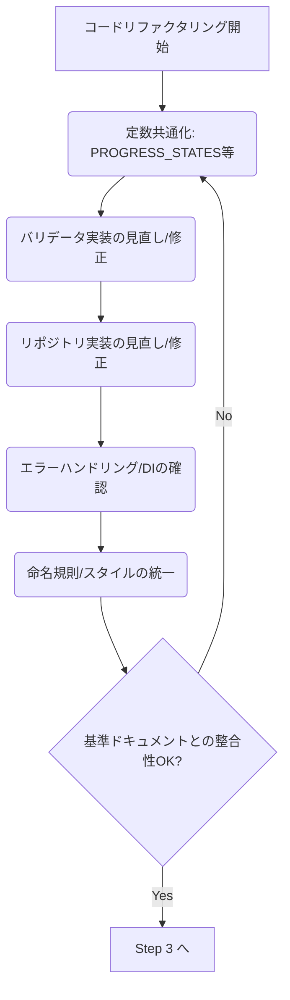

# データレイヤーリファクタリング 引継ぎドキュメント

## 1. タスク概要

### 1.1. 当初の目的
プロジェクト全体の基準となる方針（基準ドキュメント群）に基づき、`src/lib/data` および `tests/lib/data` 配下のコード（リポジトリ、バリデータ、および関連テスト）をリファクタリングし、コード品質と一貫性を向上させる。

### 1.2. 現在の状況
リファクタリング計画の Step 1「テストコード修正 (基盤整備)」が完了した段階。`tests/lib/data` 配下のテストスイート (`npm test tests/lib/data`) がすべてパスすることを確認済み。

## 2. 完了した作業 (Step 1)

以下のテストファイルおよび関連する実装ファイルを修正し、テストスイートを安定化させた。

*   **`tests/lib/data/task-repository.test.js`:**
    *   `repository` 変数の参照エラーを `taskRepository` に修正。
    *   コンストラクタのカスタムオプションテスト (`should create repository with custom options (progressStates)`) を修正し、リポジトリインスタンスがカスタムバリデータを保持することを検証するように変更。
    *   `ValidationError` の期待値を基本的なメッセージに修正。
*   **`tests/lib/data/repository.test.js`:**
    *   `deleteMany` テストのエラーハンドリング期待値を修正。
*   **`tests/lib/data/validators/task-validator.test.js`:**
    *   `TaskValidator` の実装に合わせて、テストケースの期待値を修正（不要なテストのコメントアウト、期待値の変更）。
    *   `test.each` の構文エラーを修正。
*   **`tests/lib/data/integration/repository-validator-integration.test.js`:**
    *   `ValidationError` の期待値を基本的なメッセージに修正。
*   **`tests/lib/data/feedback-repository.test.js`:**
    *   `ValidationError` の期待値を基本的なメッセージに修正。
    *   `getFeedbackHistoryByTaskId` のエラーハンドリングテストを修正（`errorHandler` ではなく `logger.warn` を検証）。
    *   `calculatePriority` のエラーハンドリングテストを修正（`logger.error` が呼ばれないことを検証）。
    *   `getFeedbackStats` のエラーハンドリングテストの期待値を修正。
*   **`src/lib/data/repository.js`:**
    *   `deleteMany` メソッドの `catch` ブロックで `errorHandler` を呼び出すように修正。
*   **`src/lib/data/session-repository.js`:**
    *   `createSessionFromGitCommits` で `git_changes` が初期化されることを確認・修正。
    *   プライベートメソッド (`_calculateChangeSummary`, `_getKeyArtifactCandidates`) の `catch` ブロックで `errorHandler` を呼び出すように修正。
*   **`tests/lib/data/session-repository.test.js`:**
    *   `ValidationError` の期待値を基本的なメッセージに修正。
    *   プライベートメソッドのエラーハンドリングテスト (`_calculateChangeSummary`, `_getKeyArtifactCandidates`) の期待値を修正（エラーがそのままスローされることを期待）。

## 3. 次のステップ (計画 Step 2: コードリファクタリング)

以下のリファクタリング作業を実施する。

*   **B1: 定数共通化:** `TaskValidator` と `TaskRepository` 内の `PROGRESS_STATES`, `STATE_TRANSITIONS` を共通の場所 (例: `src/lib/core/constants.js` を新規作成) に移動する。
*   **B2: バリデータ実装の見直し/修正:** 各バリデータ (`TaskValidator`, `SessionValidator`, `FeedbackValidator`) の実装を基準ドキュメント (`docs/utility-guides/validator-guide.md` など) と照合し、必要に応じて修正する。特に `TaskValidator` の `validateHierarchy` は詳細な実装が必要。
*   **B3: リポジトリ実装の見直し/修正:** 各リポジトリ (`TaskRepository`, `SessionRepository`, `FeedbackRepository`, `Repository`) の実装を基準ドキュメント (`docs/design-principles.md` など) に従って見直す。
    *   バリデータの適切な利用。
    *   エラーハンドリングの一貫性（`errorHandler` の利用、適切なエラークラス）。
    *   依存性注入 (DI) の確認。
*   **B4: エラーハンドリング/DIの確認:** プロジェクト全体のエラーハンドリング戦略とDIパターンに沿っているか確認する。
*   **B5: 命名規則/スタイルの統一:** コード全体の命名規則やスタイルを [コーディング規約](docs/coding-standards.md) に合わせる。
*   **確認:** 各修正後に `npm test tests/lib/data` を実行し、テストがパスし続けることを確認する。

## 4. 関連ファイル

*   **リファクタリング対象:**
    *   `src/lib/data/repository.js`
    *   `src/lib/data/task-repository.js`
    *   `src/lib/data/session-repository.js`
    *   `src/lib/data/feedback-repository.js`
    *   `src/lib/data/validators/task-validator.js`
    *   `src/lib/data/validators/session-validator.js`
    *   `src/lib/data/validators/feedback-validator.js`
    *   `tests/lib/data/` 配下の関連テストファイル
*   **基準ドキュメント:**
    *   `docs/coding-standards.md`
    *   `docs/design-principles.md`
    *   `docs/testing-guidelines.md`
    *   `docs/utility-guides/` 配下の関連ガイド
*   **新規作成候補:**
    *   `src/lib/core/constants.js` (定数共通化のため)

## 5. その他

*   ファイル編集は `write_to_file` ツールを使用する方針で進めていた。
*   テストは `npm test tests/lib/data` で実行可能。

---
このドキュメントで、次のセッションで作業を再開するために必要な情報は網羅されているでしょうか？