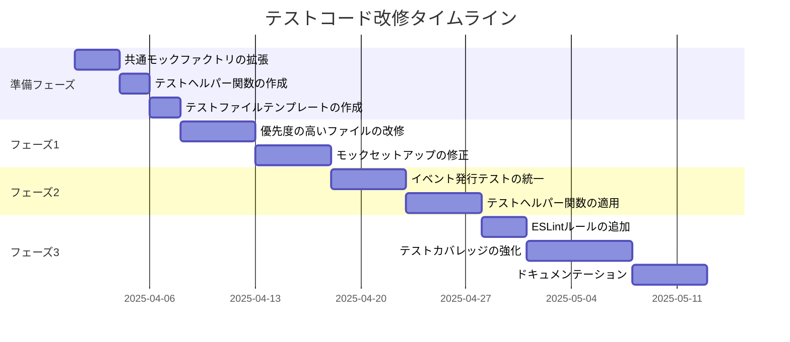
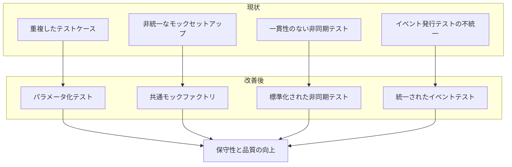
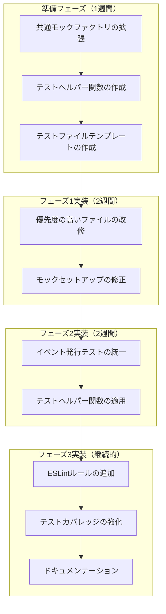
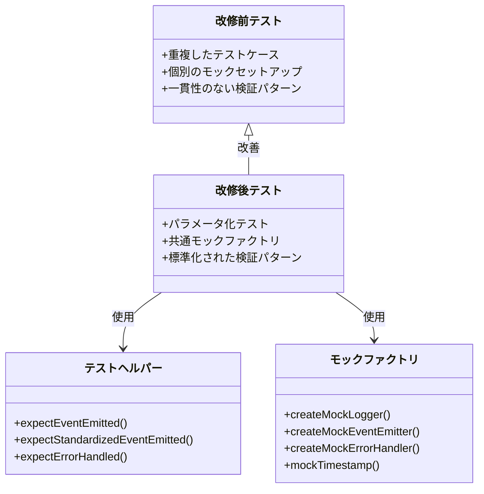

# JavaScript ユーティリティライブラリのテストコード改修戦略

## 改修戦略の概要

この改修戦略は、テストコードの品質と保守性を段階的に向上させるための具体的なアプローチを提供します。





## 現状分析

複数のテストファイルを詳細に分析した結果、以下の改善点が特定されました：

### 1. テストケースの重複

多くのテストファイルで類似したテストケースが個別に記述されています：

```javascript
// validator.test.js の例
test('タイトルがない場合、エラーを返す', () => {
  const invalidTask = { description: 'これはテストタスクです' };
  const result = validator.validateTaskInput(invalidTask);
  expect(result.isValid).toBe(false);
  expect(result.errors).toContain('タイトルは必須の文字列です');
});

test('タイトルが文字列でない場合、エラーを返す', () => {
  const invalidTask = { title: 123, description: 'これはテストタスクです' };
  const result = validator.validateTaskInput(invalidTask);
  expect(result.isValid).toBe(false);
  expect(result.errors).toContain('タイトルは必須の文字列です');
});
```

### 2. モックセットアップの重複

テストファイル間でモックの作成方法が統一されていません：

```javascript
// event-emitter.test.js の例
mockLogger = {
  debug: jest.fn(),
  info: jest.fn(),
  warn: jest.fn(),
  error: jest.fn()
};

// event-helpers.test.js の例
mockLogger = {
  error: jest.fn()
};
```

また、一部のファイルでは不要なモッククリアが行われています：

```javascript
// cache-manager.test.js の例
beforeEach(() => {
  jest.clearAllMocks();
  mockDeps = createMockDependencies();
  
  // ...
  
  // 不要な重複
  jest.clearAllMocks();
});
```

### 3. 非同期テストの一貫性不足

非同期テストの実装方法が統一されていません：

```javascript
// lock-manager.test.js の例
test('指定時間後にresolveする', async () => {
  const ms = 100;
  jest.spyOn(global, 'setTimeout');
  const promise = lockManager._sleep(ms);
  expect(setTimeout).toHaveBeenCalledWith(expect.any(Function), ms);
  jest.advanceTimersByTime(ms);
  await promise;
});

// event-helpers.test.js の例
test('標準化された非同期イベントを発行する', async () => {
  const superEmitAsync = jest.spyOn(EnhancedEventEmitter.prototype, 'emitAsync').mockResolvedValue(undefined);
  await eventEmitter.emitStandardizedAsync(component, action, data);
  expect(superEmitAsync).toHaveBeenCalledWith(/* ... */);
});
```

### 4. イベント発行テストの不統一

イベント発行のテストパターンが統一されていません：

```javascript
// event-emitter.test.js の例
expect(superEmit).toHaveBeenCalledWith(
  `${component}:${action}`,
  expect.objectContaining({
    ...data,
    timestamp: '2025-03-24T00:00:00.000Z',
    component,
    action
  })
);

// cache-manager.test.js の例
expect(mockDeps.eventEmitter.emit).toHaveBeenCalledWith(
  'cache:miss',
  expect.objectContaining({ key: 'non-existent-key' })
);
```

### 5. モックファクトリの不十分な活用

`tests/helpers/mock-factory.js`が存在しますが、すべてのテストで活用されていません。

## 改修戦略

以下の改修戦略を段階的に実施することで、テストコードの品質と保守性を向上させます。

### フェーズ 1: 基盤整備（1-2週間）

#### 1.1 共通モックファクトリの拡張

既存の`mock-factory.js`を拡張し、すべてのテストで使用できる標準化されたモックを提供します：

```javascript
// tests/helpers/mock-factory.js の拡張
function createMockLogger(options = {}) {
  return {
    debug: jest.fn(),
    info: jest.fn(),
    warn: jest.fn(),
    error: jest.fn(),
    fatal: jest.fn(),
    ...options
  };
}

function createMockEventEmitter(options = {}) {
  return {
    on: jest.fn(),
    off: jest.fn(),
    emit: jest.fn(),
    emitAsync: jest.fn().mockResolvedValue(true),
    emitStandardized: jest.fn(),
    emitStandardizedAsync: jest.fn().mockResolvedValue(true),
    getRegisteredEvents: jest.fn().mockReturnValue([]),
    listenerCount: jest.fn().mockReturnValue(0),
    logger: createMockLogger(),
    debugMode: false,
    ...options
  };
}

function createMockErrorHandler(options = {}) {
  return {
    handle: jest.fn(),
    ...options
  };
}

// 日付・時間関連のモックヘルパー
function mockTimestamp(isoString = '2025-03-24T00:00:00.000Z') {
  jest.spyOn(Date.prototype, 'toISOString').mockReturnValue(isoString);
  jest.spyOn(Date, 'now').mockReturnValue(new Date(isoString).getTime());
  return new Date(isoString).getTime();
}

module.exports = {
  createMockDependencies,
  createCustomMockDependencies,
  createMockLogger,
  createMockEventEmitter,
  createMockErrorHandler,
  mockTimestamp
};
```

#### 1.2 テストヘルパー関数の作成

テスト検証を簡略化するヘルパー関数を作成します：

```javascript
// tests/helpers/test-helpers.js
function expectEventEmitted(emitter, eventName, expectedData) {
  expect(emitter.emit).toHaveBeenCalledWith(
    eventName,
    expect.objectContaining(expectedData)
  );
}

function expectStandardizedEventEmitted(emitter, component, action, expectedData) {
  expect(emitter.emitStandardized).toHaveBeenCalledWith(
    component,
    action,
    expect.objectContaining(expectedData)
  );
}

function expectErrorHandled(handler, errorType, message, context = {}) {
  expect(handler.handle).toHaveBeenCalledWith(
    expect.objectContaining({
      name: errorType,
      message: expect.stringContaining(message)
    }),
    expect.any(String),
    expect.any(String),
    expect.objectContaining({
      additionalContext: expect.objectContaining(context)
    })
  );
}

module.exports = {
  expectEventEmitted,
  expectStandardizedEventEmitted,
  expectErrorHandled
};
```

#### 1.3 テストファイルテンプレートの作成

新規テストファイル作成時に使用する標準テンプレートを作成します：

```javascript
/**
 * [クラス名]のテスト
 */

const [クラス名] = require('../../../src/lib/utils/[ファイル名]');
const { 
  createMockLogger, 
  createMockEventEmitter,
  mockTimestamp 
} = require('../../helpers/mock-factory');
const { 
  expectEventEmitted, 
  expectStandardizedEventEmitted 
} = require('../../helpers/test-helpers');

describe('[クラス名]', () => {
  let instance;
  let mockLogger;
  let mockEventEmitter;
  
  beforeEach(() => {
    jest.clearAllMocks();
    mockLogger = createMockLogger();
    mockEventEmitter = createMockEventEmitter();
    mockTimestamp();
    
    instance = new [クラス名]({
      logger: mockLogger,
      eventEmitter: mockEventEmitter
    });
  });
  
  afterEach(() => {
    jest.restoreAllMocks();
  });
  
  describe('constructor', () => {
    test('デフォルト値で初期化される', () => {
      // Arrange
      const defaultInstance = new [クラス名]();
      
      // Assert
      expect(defaultInstance.logger).toBe(console);
      // その他のデフォルト値の検証
    });
    
    test('カスタム値で初期化される', () => {
      // Assert
      expect(instance.logger).toBe(mockLogger);
      expect(instance.eventEmitter).toBe(mockEventEmitter);
      // その他のカスタム値の検証
    });
  });
  
  describe('[メソッド名]', () => {
    test('正常ケース', () => {
      // Arrange
      const input = { /* 入力データ */ };
      
      // Act
      const result = instance.[メソッド名](input);
      
      // Assert
      expect(result).toEqual(/* 期待される結果 */);
      expectStandardizedEventEmitted(mockEventEmitter, 'component', 'action', {
        // 期待されるイベントデータ
      });
    });
    
    test('エラーケース', () => {
      // Arrange
      const invalidInput = { /* 無効な入力データ */ };
      
      // Act & Assert
      expect(() => {
        instance.[メソッド名](invalidInput);
      }).toThrow(/* 期待されるエラー */);
    });
  });
});
```

### フェーズ 2: テストケースの改善（2-3週間）

#### 2.1 テストケースのパラメータ化

類似したテストケースをパラメータ化テストに変換します：

```javascript
// validator.test.js の改善例
describe('validateTaskInput', () => {
  // 有効なケースのテスト
  test('有効なタスクデータの場合、検証に成功する', () => {
    // 既存のテストコード
  });
  
  // 無効なケースのパラメータ化テスト
  test.each([
    ['タイトルがない場合', { description: 'これはテストタスクです' }, 'タイトルは必須の文字列です'],
    ['タイトルが文字列でない場合', { title: 123, description: 'これはテストタスクです' }, 'タイトルは必須の文字列です'],
    ['タイトルが長すぎる場合', { title: 'a'.repeat(201), description: 'これはテストタスクです' }, 'タイトルは200文字以内にしてください'],
    ['説明がない場合', { title: 'テストタスク' }, '説明は必須の文字列です'],
    ['説明が文字列でない場合', { title: 'テストタスク', description: 123 }, '説明は必須の文字列です'],
    ['ステータスが無効な場合', { title: 'テストタスク', description: 'これはテストタスクです', status: 'invalid' }, 'ステータスは pending, in_progress, completed, blocked のいずれかである必要があります'],
    ['優先度が無効な場合', { title: 'テストタスク', description: 'これはテストタスクです', priority: 6 }, '優先度は1から5の整数である必要があります'],
    ['優先度が数値でない場合', { title: 'テストタスク', description: 'これはテストタスクです', priority: '3' }, '優先度は1から5の整数である必要があります'],
    ['見積もり時間が無効な場合', { title: 'テストタスク', description: 'これはテストタスクです', estimated_hours: -1 }, '見積もり時間は0以上の数値である必要があります'],
    ['見積もり時間が数値でない場合', { title: 'テストタスク', description: 'これはテストタスクです', estimated_hours: '5' }, '見積もり時間は0以上の数値である必要があります'],
    ['進捗率が無効な場合', { title: 'テストタスク', description: 'これはテストタスクです', progress_percentage: 101 }, '進捗率は0から100の数値である必要があります'],
    ['進捗率が数値でない場合', { title: 'テストタスク', description: 'これはテストタスクです', progress_percentage: '50' }, '進捗率は0から100の数値である必要があります']
  ])('%s、エラーを返す', (_, invalidTask, expectedError) => {
    // Act
    const result = validator.validateTaskInput(invalidTask);
    
    // Assert
    expect(result.isValid).toBe(false);
    expect(result.errors).toContain(expectedError);
  });
  
  // 依存関係のテストもパラメータ化
  test.each([
    ['依存関係が配列でない場合', { title: 'テストタスク', description: 'これはテストタスクです', dependencies: 'T001' }, '依存関係は配列である必要があります'],
    ['依存関係のタスクIDがない場合', { title: 'テストタスク', description: 'これはテストタスクです', dependencies: [{}] }, '依存関係のタスクIDは必須の文字列です'],
    ['依存関係のタスクIDが無効な形式の場合', { title: 'テストタスク', description: 'これはテストタスクです', dependencies: [{ task_id: 'invalid' }] }, '依存関係のタスクIDはT000形式である必要があります'],
    ['依存関係のタイプが無効な場合', { title: 'テストタスク', description: 'これはテストタスクです', dependencies: [{ task_id: 'T001', type: 'invalid' }] }, '依存関係のタイプはstrongまたはweakである必要があります']
  ])('%s、エラーを返す', (_, invalidTask, expectedError) => {
    // Act
    const result = validator.validateTaskInput(invalidTask);
    
    // Assert
    expect(result.isValid).toBe(false);
    expect(result.errors).toContain(expectedError);
  });
});
```

#### 2.2 エラークラステストのパラメータ化

エラークラスのテストもパラメータ化して重複を削減します：

```javascript
// errors.test.js の改善例
describe('基本的なエラークラス', () => {
  beforeEach(() => {
    jest.clearAllMocks();
    mockTimestamp();
  });
  
  afterEach(() => {
    jest.restoreAllMocks();
  });
  
  // 基本的なエラークラスのテストをパラメータ化
  test.each([
    ['ValidationError', ValidationError, errorFramework.ValidationError, 'ERR_VALIDATION', true],
    ['StateError', StateError, errorFramework.StateError, 'ERR_STATE', false],
    ['DataConsistencyError', DataConsistencyError, errorFramework.DataConsistencyError, 'ERR_DATA_CONSISTENCY', false],
    ['LockError', LockError, errorFramework.LockError, 'ERR_LOCK', false],
    ['TimeoutError', TimeoutError, errorFramework.TimeoutError, 'ERR_TIMEOUT', true]
  ])('%s クラスが正しく動作する', (errorName, ErrorClass, ParentClass, expectedCode, expectedRecoverable) => {
    // Arrange
    const message = `${errorName}テスト`;
    const options = { context: { test: 'value' } };
    
    // Act
    const error = new ErrorClass(message, options);
    
    // Assert
    expect(error).toBeInstanceOf(ErrorClass);
    expect(error).toBeInstanceOf(ParentClass);
    expect(error.message).toBe(message);
    expect(error.name).toBe(errorName);
    expect(error.code).toBe(expectedCode);
    expect(error.context).toEqual(options.context);
    expect(error.recoverable).toBe(expectedRecoverable);
    expect(error.timestamp).toBe('2025-03-24T00:00:00.000Z');
    
    // toJSONのテスト
    const json = error.toJSON();
    expect(json).toEqual({
      name: errorName,
      message: message,
      code: expectedCode,
      context: options.context,
      cause: undefined,
      recoverable: expectedRecoverable,
      timestamp: '2025-03-24T00:00:00.000Z'
    });
  });
});
```

#### 2.3 非同期テストの統一

非同期テストのパターンを統一します：

```javascript
// lock-manager.test.js の改善例
describe('_sleep', () => {
  test('指定時間後にresolveする', async () => {
    // Arrange
    const ms = 100;
    jest.spyOn(global, 'setTimeout');
    
    // Act
    const promise = lockManager._sleep(ms);
    
    // Assert - タイマーが正しく設定されたことを確認
    expect(setTimeout).toHaveBeenCalledWith(expect.any(Function), ms);
    
    // タイマーを進める
    jest.advanceTimersByTime(ms);
    
    // 解決されることを確認
    await expect(promise).resolves.toBeUndefined();
  });
});
```

### フェーズ 3: モックとイベントテストの標準化（2-3週間）

#### 3.1 共通モックファクトリの適用

すべてのテストファイルで共通モックファクトリを使用するように変更します：

```javascript
// event-emitter.test.js の改善例
const { 
  createMockLogger, 
  mockTimestamp 
} = require('../../helpers/mock-factory');

describe('EventEmitter', () => {
  let eventEmitter;
  let mockLogger;
  
  beforeEach(() => {
    jest.clearAllMocks();
    mockLogger = createMockLogger();
    mockTimestamp();
    
    eventEmitter = new EventEmitter({
      logger: mockLogger,
      debugMode: true,
      keepHistory: true,
      historyLimit: 200
    });
  });
  
  // 以下テストコード
});
```

#### 3.2 イベント発行テストの統一

イベント発行のテストパターンを統一します：

```javascript
// event-emitter.test.js の改善例
const { expectStandardizedEventEmitted } = require('../../helpers/test-helpers');

describe('emitStandardized', () => {
  test('標準化されたイベントを発行する', () => {
    // Arrange
    const component = 'component';
    const action = 'action';
    const data = { key: 'value' };
    
    // 親クラスのemitメソッドをスパイ
    const superEmit = jest.spyOn(EnhancedEventEmitter.prototype, 'emit').mockImplementation(() => {});
    
    // Act
    eventEmitter.emitStandardized(component, action, data);
    
    // Assert
    expect(eventEmitter._isStandardized).toBe(false);
    
    // コンポーネントイベントの検証
    expect(superEmit).toHaveBeenCalledWith(
      `${component}:${action}`,
      expect.objectContaining({
        ...data,
        timestamp: '2025-03-24T00:00:00.000Z',
        component,
        action
      })
    );
    
    // グローバルイベントの検証
    expect(superEmit).toHaveBeenCalledWith(
      'event',
      expect.objectContaining({
        type: `${component}:${action}`,
        ...data,
        timestamp: '2025-03-24T00:00:00.000Z',
        component,
        action
      })
    );
  });
});
```

### フェーズ 4: 継続的改善（継続的）

#### 4.1 ESLintルールの追加

テストコードの品質を自動的に検証するESLintルールを追加します：

```javascript
// .eslintrc.js
module.exports = {
  // 既存の設定
  overrides: [
    {
      files: ['**/*.test.js'],
      rules: {
        // テスト関連のルール
        'jest/prefer-expect-assertions': 'error',
        'jest/no-identical-title': 'error',
        'jest/valid-expect': 'error',
        'jest/prefer-to-be': 'error',
        'jest/prefer-to-contain': 'error',
        'jest/prefer-to-have-length': 'error',
        'jest/prefer-expect-resolves': 'error',
        // カスタムルール
        'custom/no-duplicate-test-structure': 'warn',
        'custom/use-test-helpers': 'warn'
      }
    }
  ]
};
```

#### 4.2 テストカバレッジの強化

エッジケースと境界値のテストを追加します：

```javascript
// validator.test.js の追加テスト例
describe('validateTaskInput - エッジケース', () => {
  test('空のオブジェクトの場合、複数のエラーを返す', () => {
    const result = validator.validateTaskInput({});
    
    expect(result.isValid).toBe(false);
    expect(result.errors.length).toBeGreaterThan(1);
    expect(result.errors).toContain('タイトルは必須の文字列です');
    expect(result.errors).toContain('説明は必須の文字列です');
  });
  
  test('nullの場合、エラーを返す', () => {
    const result = validator.validateTaskInput(null);
    
    expect(result.isValid).toBe(false);
    expect(result.errors).toContain('タスクオブジェクトが不正です');
  });
  
  test('undefinedの場合、エラーを返す', () => {
    const result = validator.validateTaskInput(undefined);
    
    expect(result.isValid).toBe(false);
    expect(result.errors).toContain('タスクオブジェクトが不正です');
  });
  
  test('境界値: タイトルが200文字ちょうどの場合、有効', () => {
    const validTask = {
      title: 'a'.repeat(200),
      description: 'これはテストタスクです'
    };
    
    const result = validator.validateTaskInput(validTask);
    
    expect(result.isValid).toBe(true);
  });
  
  test('境界値: 優先度が1の場合、有効', () => {
    const validTask = {
      title: 'テストタスク',
      description: 'これはテストタスクです',
      priority: 1
    };
    
    const result = validator.validateTaskInput(validTask);
    
    expect(result.isValid).toBe(true);
  });
  
  test('境界値: 優先度が5の場合、有効', () => {
    const validTask = {
      title: 'テストタスク',
      description: 'これはテストタスクです',
      priority: 5
    };
    
    const result = validator.validateTaskInput(validTask);
    
    expect(result.isValid).toBe(true);
  });
});
```

## 実装計画





### 準備フェーズ（1週間）

1. 共通モックファクトリの拡張
   - `mock-factory.js`の拡張
   - 日付・時間関連のモックヘルパーの追加

2. テストヘルパー関数の作成
   - `test-helpers.js`の作成
   - イベント検証、エラー検証のヘルパー関数の実装

3. テストファイルテンプレートの作成
   - 標準テンプレートの設計と承認

### フェーズ1実装（2週間）

1. 優先度の高いファイルの改修
   - `validator.test.js`のパラメータ化
   - `errors.test.js`のパラメータ化
   - `lock-manager.test.js`の非同期テスト改善

2. モックセットアップの修正
   - 不要な重複の削除
   - 共通モックファクトリの適用

### フェーズ2実装（2週間）

1. イベント発行テストの統一
   - `event-emitter.test.js`の改修
   - `event-helpers.test.js`の改修
   - `cache-manager.test.js`の改修

2. テストヘルパー関数の適用
   - 既存テストへのヘルパー関数の適用
   - 検証コードの簡略化

### フェーズ3実装（継続的）

1. ESLintルールの追加
   - テスト関連のルール設定
   - カスタムルールの実装

2. テストカバレッジの強化
   - エッジケースと境界値のテスト追加
   - 不足テストの特定と追加

3. ドキュメンテーション
   - テスト標準とパターンのドキュメント作成
   - モックとヘルパーの使い方ガイド作成

## 期待される効果

この改修戦略を実施することで、以下の効果が期待できます：

1. **コード量の削減**: パラメータ化テストにより、テストコードの量が約30%削減されます。
2. **保守性の向上**: 標準化されたパターンにより、テストコードの理解と修正が容易になります。
3. **テスト品質の向上**: エッジケースと境界値のテスト追加により、バグの早期発見が可能になります。
4. **開発効率の向上**: 共通モックとヘルパー関数により、新規テスト作成の効率が向上します。
5. **一貫性の確保**: 統一されたテストパターンにより、コードレビューが効率化されます。

## リスクと対策

1. **既存テストの破損リスク**
   - 対策: 各フェーズ後に全テストを実行し、カバレッジが低下していないことを確認

2. **チーム内の知識格差**
   - 対策: ドキュメント作成とペアプログラミングによる知識共有

3. **リファクタリングの優先度低下**
   - 対策: 改修作業を小さな単位に分割し、通常の開発サイクルに組み込む

## まとめ

この改修戦略は、テストコードの品質と保守性を段階的に向上させるための具体的なアプローチを提供します。各フェーズで改善効果を確認しながら進めることで、リスクを最小限に抑えつつ着実に品質向上を図ることができます。